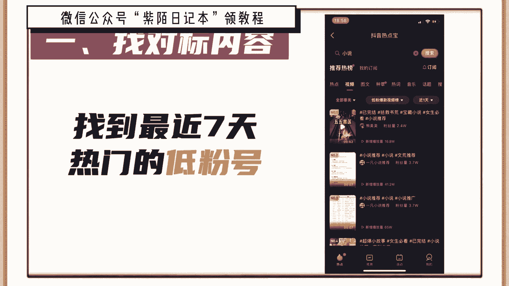
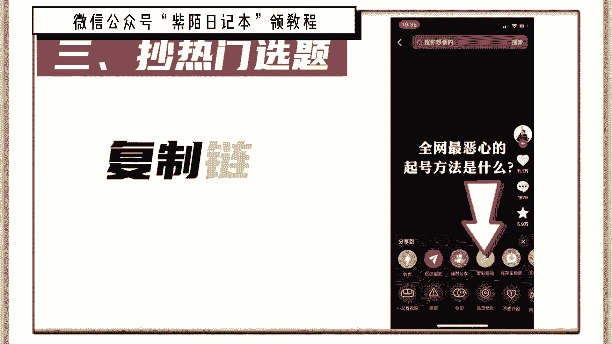
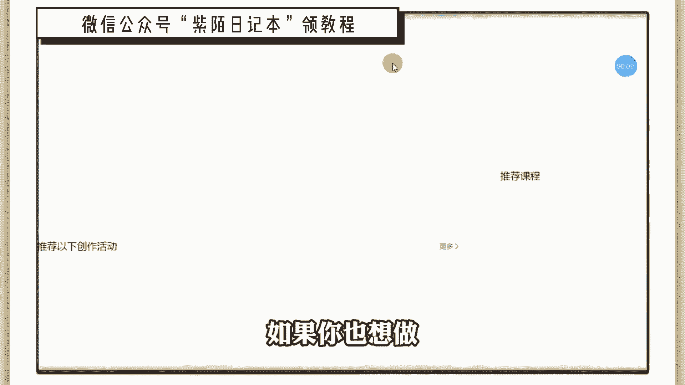
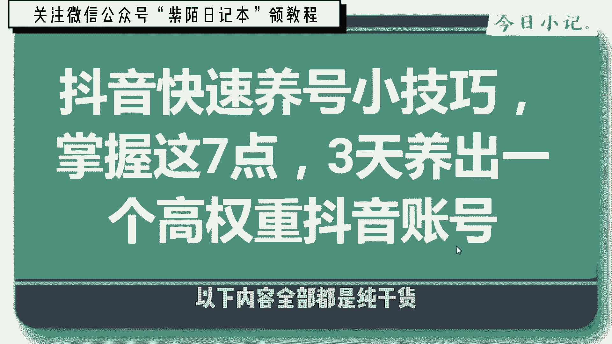
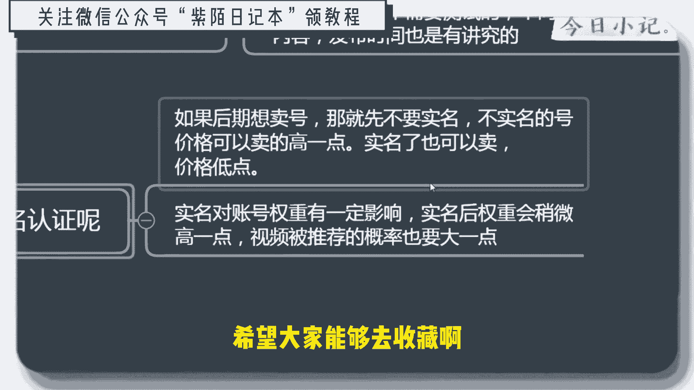

# 2024年做抖音怎么快速起号？3天养出一个高权重抖音账号，掌握这7点，抖音快速养号小技巧！ - P1 - 朝九晚五的角头 - BV1BqeEeFEvq

🎼我是拼了命的把我失去的尊严给夺回来。做抖音如何快速起号，并不是打开某某开关就能火，那些都是骗流量的。下面告诉你真正的洗号方法，按照步骤操作，你也可以像我这样上热门。😡，Yeah。

首先要搞清楚什么叫做起号，抖音有8个流量值，起号的本质就是流量值突破，至少要达到二级流量值，拥有几千基础播放量，才能叫做起号成功。但是99%的人都不会起号账号不符合系统推荐算法，所以只有几百播放。

下面是起号的5个步骤，缺一不可。这是MCN机构内部资料，建议收藏一、找对标内容，抖音搜索热点宝，点击观测，选择你的行业，找到最近7天涨粉最多的10个账号，然后搜索你行业的热点视频，点击低粉爆款视频吧。

找到最近7天热门的低粉号，这才是找对标最正确的方法，也是最恶心的方法。2、确定表现形式，这是需要把对标账号的所有视频看一遍，找一个你能模仿并且超越的表现形式，确定谁来拍怎么拍拍给谁看。

我这里选择的是MG动画形式，以此代替真人出镜。3超热门选题，从对标账号中找7个热门话题，在抖音搜索热门话题内容，找到三个相关的视频，复制链接账号为。😊。

文字，然后组成为一篇内容，用自己的理解进行表述，最终形成一篇原创热门文案。4、测试爆款通过定好的形式完成视频制作，每天定时发布一条视频，连续发布7天，不出意外，必有一条爆款。

因为一个新号一般会有三次上热门机会，期间可以购买抖加，头达人相似，加速测试结果。我复制爆款，上热门之后，粉丝量会爆涨。然后就是复制爆款视频，提高粉丝年度，这时你就会神奇的发现。

你发的视频再也不是三五百播放，随随便便就是几千几万播放。这是我其中的一个账号，从抖音起号到开通中视频计划，用了3个月左右的时间。现在每天的收入都能稳定在600到1000。

只要坚持下去还是可以赚到一份不错的收益的。如果你也想做可以在下方评论区留言一个6，大家可以一起玩。😊。

🎼今天先哥给大家分享抖音快速养号小技巧，掌握这7点，3天养出一个高权重的抖音号。以下内容全部都是纯看货，建议咱们大家去可以收藏一下，那边用的时候比较方便啊。

我们会从这7个方面给大家去讲抖音养号的一些详细的技巧。我们先看第一个短视频账号注册啊。短视频账号注册的话，如果条件允许的话，可以先注册两个号啊。若果手机不够用，可以一个号也行。

🎼呃，如果说你注册之前已注册短视频账号，而且已经上传了自己乱七八糟这种视频的话，建议就是可以更换和注销。但是在更换好注销之前需要去测试一下，怎么去测试呢？你可以连着发3天。

每天发一个你制作呃制作好的这种视频，你想做哪类视频，做发哪类视频的内容啊，一定要垂直。🎼如果播放量加，就是1000到几万之间，不用注胶，可以直接使用。如果说播放量都低于500，连个30天0都是这样的话。

那直接可以注销了啊，重新再去申请就行了。下面就是说一机一张卡一号啊，这是做任何短视频账号都是必须的这种最起码的要求啊。第三点就是说是账号不要来回的切换。🎼同一个wifi下。

连着短视频的账号不要超过3个啊。同一个手机来回切换账号的话，同一个wifi连着多个短视频账号会被判定为营销号，不给播放量的。🎼这就是短视频账号注册的时候需要注意的一点。第二就是手机卡的选择啊。

手机卡的话，170和171这些虚拟的物联网卡，包括黑户卡都不建议使用，要使用正常的号段，正常的这个移动联通电信的这些卡，你可以去营业厅去办卡，最好是针对这个短视频账号能够去免流量的啊。

这种卡这样的话比较好一点。🎼新号的快速养号啊操作的时候呢，第一就是向正常人员去操作就行了。注册好账号之后刷几条视频，直接导入这个通讯录啊。只要手机卡没有问题，手机没有乱切换过短视频账号。

此时的新账号应该是有权的了。正常注册的账号导入通讯录后出值量不会低于500的啊。养号呢每天的话就是要刷抖音啊，你想做哪类视频就刷哪类视频，别的直接划过就行了。空闲时间比较少，没时间的话。

可以直接把就是直播间打开，然后把手机放在一边让他去观看直播，这是为了模拟真人去看直播，你有时间了可以再跟主播进行进行互动啊，千万不要粘贴复制啊，你一个字一个字的打。因为是你粘贴复制的话。

其实平台的机器都可以识别的，所以说再去给别人发互动，发评论的时候不要粘贴复制，刷视频的时候，你可以点赞，然后是评论一条。那么什么号可以判断为废号呢？这个也是大家比较关心的。

就是如果说你发了多个视频都没有破500，这说明你的号可能要不时间长没用了，要不就是说刷个刷个赞，或者是视频比较杂乱，然后是被平台直接判定为你低账号。🎼权重的账号。那你这个时候需要做的是重新注册账号啊。

注册账号之前的话，一定要个式化手机，抹除手机原来的数据啊之后再重新注册手机，重新注册账号啊。🎼呃，如果说上传多次视频仍然不给播放量，全部都是零啊，零播放直接注册新的账号啊，重新去刷机就行了。

第五点就注册之后该怎么去操作啊。呃，首先是最好是用手机流量卡注册啊，可以导入通讯录啊，导入这个微信好友啊。第二就填写好资料，没事，别去改它。第三就是多关注同城的账号，关注点赞评论都要去做。

第四就是逛个同城啊直播间。因为是特别是给同城的一些就是呃特别是给同城的这个视频去评论，因为是同城的视频一般都不容易热门，你评论之后一般都是。这个视频的这个。🎼视频或者是这个博主，他都会主动去回复你评论。

这样的话会形成有效的互动，也能增强你账号的权重。🎼第五就评论视频的时候，用正常人的思维啊，你不要是纯机器的随便打个表什么打个字，然正常去去评论就行了。第六是前三天主要是看视频，看直播，就不要发视频了。

第四是千万不要在手机上切换通账号，容易被判为营销号啊，这个一定要一定要注意。因为我一定强调不这边那么一天发几个视频，什么时间发比较合适啊，一天的话发1到两条视频就可以啊，什么时间发的话。

这个需要你自己去测试不同的行业，它发布的内容不一样。比如说你是做影视的，影视的话可能是在呃中午比如说或者是下班，甚至说是在这个别人就是休息的空档，比如说1点多或者下午的话，三四点比较困的时候。

然后去发这个东西，然后是比较合适的。然后呢你像美女的话类的视频，他可能是在晚上发比较合适，对吧？你要根据自己的这个产品去测试。不同的产品然后是不同的视频，它的发布时间也是不一样的。

那么是否需要实名认证呢？如果你后期想去卖号啊，那就先不要视频，因为是不实名的价格会高一点，实频的也可以卖，但是价格就稍微低一点，实名对账号的权重有一定影响，视频后这个权重会稍微高一点。🎼啊。

视频的推荐概率也比较大一点。好了，今天的分享就到这里了啊，全部内容概括，希望大家能够继续收藏啊，这样的话你用的时候也比较方便。

Yeah。

