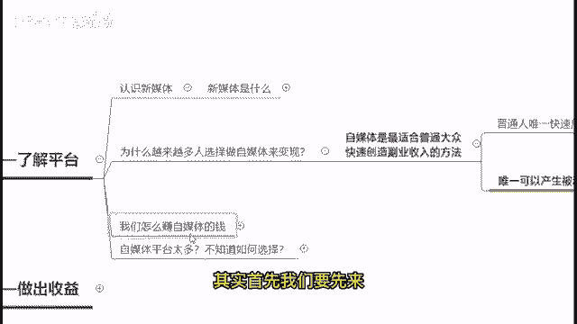
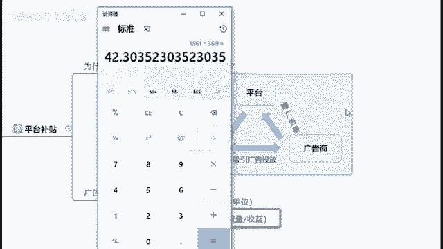

# 2024年做抖音怎么快速起号？3天养出一个高权重抖音账号，掌握这7点，抖音快速养号小技巧！ - P10：3怎么去赚自媒体的钱 - 草没有发霉 - BV1C1tWeqEo7

好，那么讲到赚钱了，其实首先我们要先来做一个核心的一个东西。

就是其实我们是怎么样去赚自媒体的钱。

那么赚钱你肯定首先要知道他的钱从哪里来。

你得先知道钱从哪里来，才能够知道你能够怎样更好地去获取到这个钱。

首先第一个钱它是来源于平台补贴的。

为什么啊，我们说在平台上面发内容，我们不需要给平台钱。

平台还倒贴给我们钱呢，在这里广告费是关键对吧好。

那么在这边的话，首先我们可以看到啊，平台它是靠赚取广告商的一个广告费，来进行这个赚钱的，如果说平台上面有更多的一个优秀内容创作者，去创造出更多的优秀内容，吸引我们的广告商去做广告投放的话。

平台啊就能够给出更多的一个广告费，给到一个我们的一个优秀内容创作者，鼓励他去创作出更多的优秀内容，吸引到更多的人，从而吸引更多的一个广告商，进行一个广告的投放，那么在这边啊，我也知道。

很多人其实是奔着提升自己的一个啊单价而来，对不对，那么其实你可以想你的视频，你的内容到底要通过什么样的方式，能够帮助平台更好地留住用户，或者说帮他更好地打广告，这样子的话平台才会给你更高的收益。

如果说你没有办法去帮助平台赚取广告费的话，那么平台给你的钱是一定不会多的，这个就是我们在自媒体上面赚钱的一个，底层逻辑，知道吧好。

那么在这边我点开一个MICROSOFT的一个网站给大家啊，来看一下，这个是我随便点开的一个MICROSOFT的一个网站，那么在这边我们可以往下拉对吧，我们可以看到有很多不同方面的一些啊，新闻资讯。

包括娱乐类的一个资讯，生活类的资讯啊，其他国家的一些资讯，那么在这些资讯周围环绕的是什么，就是这些广告，所以说如果说你的创作内容，能够帮助平台吸引更多的用户停留。

或者说能够帮助他更好地去插入这些广告的话，那么你所能够赚到的钱才能够更多，如果说你的内容，你的视频让平台觉得诶怎么没有办法插广告，又或者说怎么没有办法帮我留住用户对吧，那么这样子的话啊。

你是没有办法能够获取一个高收益的好，这个是我们赚钱的一些底层逻辑，是需要了解的好，那么再来啊，我想问一下在座的各位，其实到现在再来听的一个同学们，其实你们有多少人是还没有自己的一个，自媒体账号的。

如果说你是还没有自己的一个自媒体账号的，对自媒体里面的所有的，包括这些播放量啊，收益啊，单价都不了解的，你打个零在公屏上给我看一下，如果说你是完全没有账号，也不了解上面的收益如何计算的。

不了解上面的单价如何计算的，你打个零在公屏上给我看一下，我看看有多少同学是还没有自己的自媒体账号，然后对于上面的所有的这些情况，也都不了解的哦，还是有非常多的哈啊，有非常多好，那么在这边的话呢。

我还是简单的先跟大家去介绍一下，首先平台上面你要去赚取收益的话，首先它基本上是按照你的一个播放量的多少，或者说是阅读量的多少来去算钱的，你的播放量越高，阅读量越高，那么你有机会获取到的这个单价。

你有机会获取到的收益也就会更高，那么单价是怎么计算呢，你比如说其实现在大部分的一个呃平台，包括头条号，包括大于号在内，基本上是以万播放量为一个单位去给你算钱的，那么计算方法很简单。

用你的收益除以你的多少万的播放量来去计算。

然后那么在这边我打开一个我自己的账号。

来给大家看一下，这是我自己创作的一个账号，首先打开我们的一个收益数据。

可以看到这个是我昨天的一个收益，对不对。

拿出计算器好，怎么去计算呢，把我昨天的收益算上去，1561除以多少呢。

找到我昨天的一个作品数据。

然后看这个昨天的阅读播放量，找这个阅读播放量，然后我们要除以多少呢，不是说除以整个数字，我们要以多少，以万播放量为单位，我们只要看多少，这是多少万，36。9万，那么我们就除以36。9。

得出我们的这一个单价，我们这一个头条号的单价就是42块钱啊。

我这个号昨天的一个单价就是42块钱。

当然这一个单价它不是说恒定不变的，它会随着你内容创作的不同而发生改变，比如说啊你的这个创作内容啊，今天播放量很好，那么你的这个收益就有可能高一些。

你今天创作这个内容很优质，就也有可能高一些啊。

这个呢是不是说一直一直不变的，它是每天都会发生一定的变化的。

对吧好，那么在这里，由于我看到很多同学都还没有。

自己的一个自媒体账号，那么首先你要获得一个高收益，账号的第一步一定是注册账号。

那么注册账号，首先第一步你必须年满18岁，然后如果说你没有年满18岁的话，那么对不起，就算你注册了账号，你也没有办法去提现，那么没有办法提现的话，你也就赚不了这个钱了对吧。

那么第二个你得有一个手机或者电脑啊。

智能手机都没有问题，那么再来啊，首先如果说啊，刚刚很多同学没有注册这个账号的话，首先第一点，基本上现在的自媒体平台啊。

都是需要你用浏览器去注册的啊。

大家注意，如果是你用手机端的话，那么你记住不要用app端去注册啊。

大部分的平台不要用app端去注册。

用浏览器去注册，找到你的要注册的这个官方网站名称。

去注册好吧，然后每个平台呢是只能注册一个账号的。

对于个人来说啊，大家记住，特别是要注册头条号的百家号的这些人啊。

大家记住，不要用app端去注册。