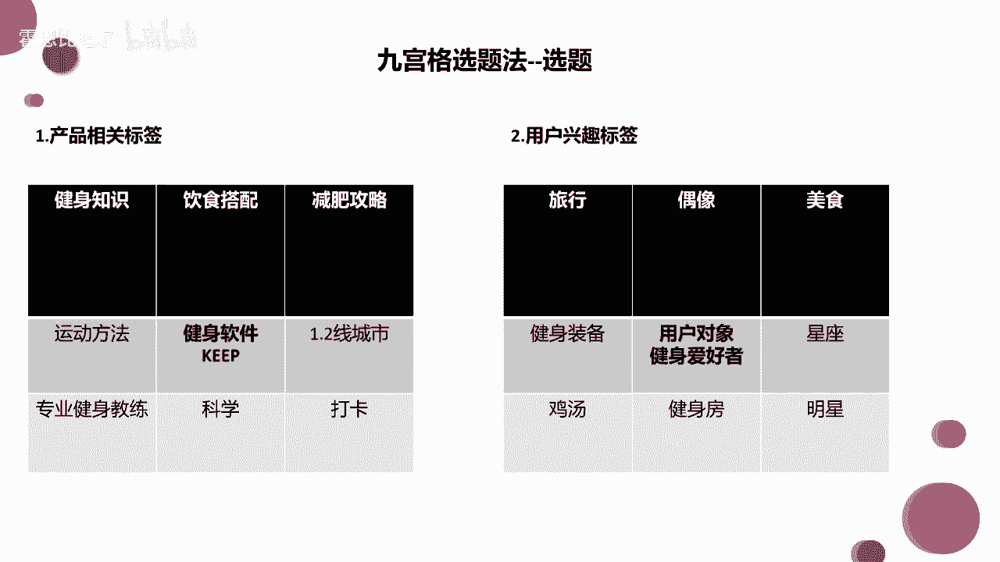
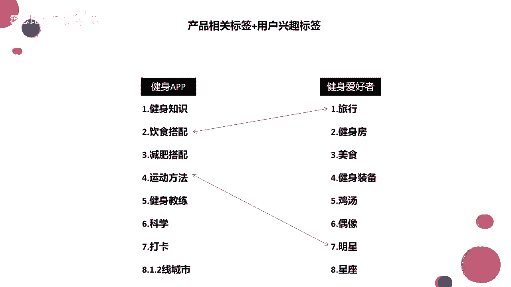

# 2024年做抖音怎么快速起号？3天养出一个高权重抖音账号，掌握这7点，抖音快速养号小技巧！ - P10：产品与用户兴趣标签 - 霍恩比道尔 - BV1fjtWe4EGs

好吧啊，那我接着来讲啦，我们再回到我们的这个选题上，回到选题上插了一个题外话，回到选题上，刚才跟大家讲啦，我们今天要以这个keep健身软件为例，去给大家讲一讲我们这个选题方法。

我们涉及到一个是产品相关的标签，一个是用户兴趣的标签，我们首先来看产品产品相关的标签啊，我先把这个健身软件keep放在中间，放在中间，然后哈它旁边的12345678，旁边的八个空格。

我们去找我们去联想这个产品有哪些特点，想一想这个产品有哪些特点，我的视频是林正英风格的，那你可以找竞品啊，一定要学会找竞品啊，你不可能说啊，比如说我做美食的，我不知道我的竞品有哪些，这个是不可以的。

这个是不可以的，后面有一节课给大家讲了竞品分析啊，好了嗯，我们想这个keep它的一个产品的特点有哪些啊，比如说我是一个线上健身软件啊，线上健身软件之外之后，我上面会配备一些专业的健身教练，我把它填在这。

那除了专业健身教练之外呢，我还给你一些饮食的搭配，来给你一些减肥的攻略，我还教你健身的干货知识，对不对，会教你一些运动方法，而且还是科学的运动方法，你把你想到的所有关键词往里面填就可以了。

L这边他是打卡运动的，你今天打卡，明天打卡，后天打卡，你看你连续运动多少天，他是有这样的一个制度，那最后呢它是呃针对一二线城市啊，去开发的这款软件，可能一二线城市用的比较多。

那么这个呢是它产品本身的一个产品属性了，就好像抖音使用抖音的，就是一二线城市的人比较多，使用快手的就是三四线城市的人比较多，这个其实在百度指数上，在艾瑞网上都是能够在都是能够查到的好吧。

然后我们就把产品相关的标签给它放里面，就不用管了，就不用管了，然后我们再来到这边，用户兴趣标签这块，你看使用我们健身软件的都是什么，健身爱好者或者是想要减肥的人，对不对，或者想要塑形的瘦身的人。

那这是一个用户对象，我们把它再放在中间，放在中间之后，我们开始联想啊，爱好健身的人，热爱生活的人，他可能对什么还感兴趣，这个大家就放开了，想放开了想，他可能喜欢健身房，对不对。

线下的时候他可能经常也去健身房，只不过时间不太够啊，上班比较忙，所以选择用线上的健身软件，对不对，他可能对于一些健身装备还比较感兴趣，是不是啊，比如说什么紧身衣啦，运动鞋啦，就他可能对这些还比较感兴趣。

另外我们说可能热爱健身的人哈，热爱健身的人，他是热爱生活的，对不对，他可能对于一些减肥餐，轻脂的这种美食是比较感兴趣的，清脂的美食，因为美食也不一定都是大大大鱼大肉，对不对。

减肥就是为了放心的吃哈哈这个逻辑也行了，你看啊，我们想到他对健身房感兴趣，健身装备感兴趣，对于这个美食感兴趣，那如果说他是一个热爱生活的人，可能还热爱旅行啊，对不对啊，可能对于星座啊明星。

然后鸡汤这些也感兴趣，当然我们把几个最标准的或者最关键的东西，写出来之后，剩下的我们可以往里填充，往里填充，就是把这个用户群给他扩大，本身是健身爱好者啊，最终扩成生活热爱者，对不对，热爱生活者。

那如果是就是网易云患者或者网易云用户的话，那么对应的可能就不是这种标签了啊，大家懂吧，就是把这个标八个标签填起来就OK了，那么现在呢我们针对产品，针对用户填满了我们的这个九宫格。

那接下来怎么办好了，接下来呢我给他挨个列出来，看到没有，刚才我们填满的这些东西，我们挨个列出来，还有时尚的穿搭，没错哎，大家已经开始思考了，大家已经开始思考了，那么但是我们的重点是选题啊。

宝贝我们列出来之后，怎么能够给出一个完整的选题啊，来我们给他连连看，给他连连看，给它搭配起来看一下，比如说饮食搭配和这个旅行搭配起来，你能想到什么样子的选题，饮食搭配和旅行结合起来，我给它连起来。

你看你能想到什么样子的选题，给我一句文案，就可以给我一句文案就可以，能想到什么，啊随便想，去给大家随便写一个什么外出旅行啊，如何享受旅行，又能干吃不胖，旅行装备是吗，旅行装备是旅行，单纯旅行。

你怎么和这个饮食搭配给搭配，给它就是串联在一起，以这种连连看的形式，我们去做这种选题，覆盖了这个健身app，也覆盖了健身爱好者的兴趣，好大家可能这个想不到，我再重连一个，我再连这个运动方法。

还有我们的明星哎，怎么去进行一个选题，呵呵来广东吃肠粉对也行啊，既能享受什么旅行，又能干吃不胖，是不是烤地瓜，烤牛蛙是哪啊，烤地瓜不是山东的吗，运动方法和明星连起来，大家给我一个选题。

给我一个标题就可以，给我一个标题，饿了是吗，赵丽颖都在练的五个健身方法，你一定要学起来，这个算不算一个算吧，还有什么还有什么啊，范冰冰都在练的三个健身方法，你一定要学起来，对明星的身材管理。

这五个运动方法你一定不要错过，是不是大家要把它连成完整的一句话，要符合这个逻辑，符合逻辑啊，再给大家出一个啊，我把什么呢，我把科学和我们的啥呀，科学，来我连一下啊，把我的科学跟什么连在一起呢。

科学跟健身房吧，再给你们出一个，我把科学和健身房连在一起啊，大家能不能出一个什么样的选题呢，科学和健身房哎怎么讨论起来，吃的啦，大家都是吃货无疑了，来如何科学的健身，是啊差不多差不多啊。

比如说我再给你们讲一个，比较那个那个一点的自律成就自由，用科学的方法带你健身，对不对，嘿嘿他更有那个更鸡汤一点啊，如何科学的健身呢，那就有点嗯干巴巴干干瘪瘪，对不对，好了这些文案你看了吗。

让大家去想文案的时候呢，想不到大家其实想不到啊，这个文案大家有限，所以这个时候你还要把你的百度啊，把你的各种软件给他借助起来，好我们去搜一下，搜一下关键词，什么健身科学，对不对。

你看它会出来哪些联想的长句子，这些长句子我们能不能用上，能不能变成我们的一个选题，哈哈这样健身不科学哈哈，如何科学的健身去追妹妹好吧，不能说不能说一模一样吧，可以说是毫不相关哈，好啦。

那么啊这些这个呢是我们的九宫格选题法啊，其实就是帮助大家去写选题的啊，去写选题，去找选题的，因为大家经常会遇到那种，我这这期写什么内容啊，我下一期就是啊我要拍什么内容啊，我真的是费尽了我的脑瓜。

是不是在健身房如何科学撩妹啊，这个走向越来越不对了，哈哈哈好了，那么我们可能哈就是呃用这种连连看的方式，我们能够延伸出五无数个选题，你知道吗，无数个选题背后呢我们可以建立无数个素材库。

这样的话我们其实我们的这个视频啊，就是哎无数多种，你就源源不断发吧，但是我们刚才想的那几个选题真的好吗，啊什么样的选题才是好的，比如说刚才啊，我们小红同学在健身房如何科学的撩妹啊。

比如说啊像什么呀啊如何科学的去那个追美眉。

是不是啊。