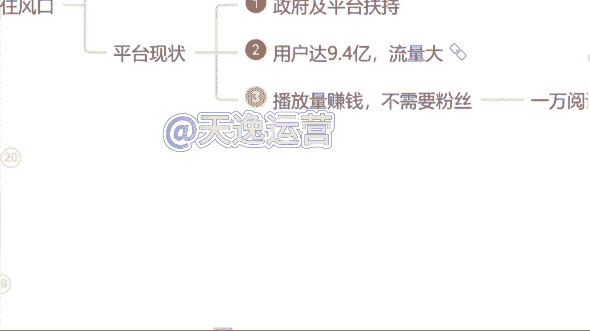
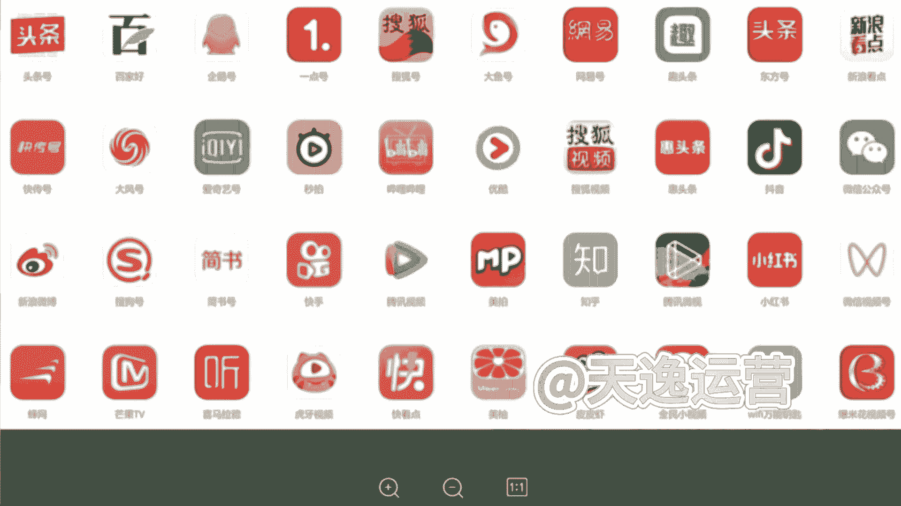
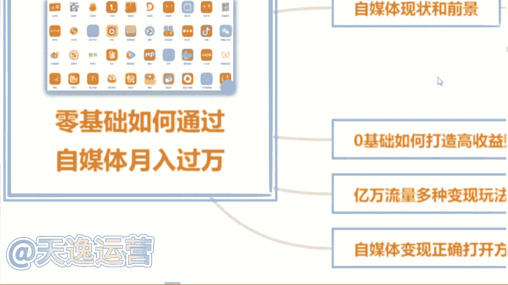
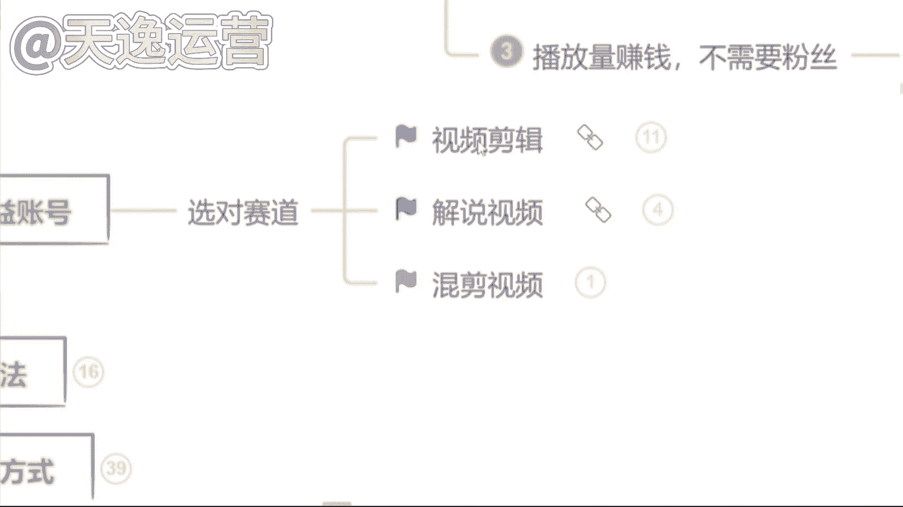

# 2024年做抖音怎么快速起号？3天养出一个高权重抖音账号，掌握这7点，抖音快速养号小技巧！ - P11：4.0基础如何打造高收益账号 - 去掉半杯烦恼x - BV1x5vaejEgH

好那除此之外呢有很多同学也会说到了是吧，好曾老师，我觉得可以做是吧，我觉得能赚到钱也值得去做了，但是为什么我发的这个视频发出去，它永远都是零播放量呢，要不然只有几百甚至1000多的播放量。

是不是这个平台他不喜欢我，他看不惯我，所以说他不给我推送流量啊，其实不是的，是因为我们自媒体平台呢它总共有30多个啊。

这30多个平台呢同学们全部截图保存啊，这30多个平台我们未来都能够用到的，今日截图好吧，因为这30多个平台呢，它每一个平台结算收益的方式，适合的领域都是各不相同的，同学们熟悉吗，对他们了解吗。

其实不太了解，对不对，那首先我们来看一下。

其实每一个平台它适合的领域都是各不相同的，包括给你举个例子吧。

比如说今天啊我说我要做一个这个今日头条，这个头条号，我说我要做，那我先把这个平台账号注册好，那注册好了过后，我去选择一个适合B站去做的舞蹈领域，我能在这个头条上面做起来吗，你觉得能做起来吗。

我去做的是头条号这个平台，但是我偏偏就选了一个适合B站去做的领域，为什么呢，这个就是很多这个自媒体嗯，呃这个人没有做起来账号的原因，你连平台以及领域都没有选择，对这个平台，他凭什么给你推送流量啊。

他不会把这个流量浪费在你的身上的，他是会去扶持适合它这个平台，适合用户去观看的领域的，这个呢我到时候送给大家啊，把这个领域的区分到时候我送给大家啊，让你们有一个领域区分的地方。

但是呢我得看你们的表现好吧，谁今天啊互动性是最强的，是真正想要学习到这个知识的，我就送给你们啊，因为曾曾老师特别喜欢这个爱学习的同学，好吧。

看你们的表现咯，那除此之外呢，这30多个平台呃。

30多个平台里面，我们该去选择什么样的这个内容，我们来做视频呢是吧，那首先问一下同学们，平常在这个刷视频的过程当中，我们刷什么样的视频，刷的是最多的，你看什么样啊，看着视频看的最多是影视的呢。

解说的呢是吧，单视频剪辑的呢，还是说游戏的呢，综艺的呢，动漫的呢，搞笑的呢，你看什么看的是最多的，呵呵美女好的好的，我知道了，那喜欢看美女的同学非常的不错呀，泽泽老师也喜欢看美女嗯。

但是我们把看美女的时间，我们去做一个美女的盘点视频，她可能赚钱会更快一点是吧，影视的什么正能量的，搞笑的，还有呢其他同学呢看什么样的视频，看的是最多的，还有没有其他的，基本上都是影视了是吗，好的好的。

我知道了，影视呢在所有的平台上面，确实扩散量是最大的啊，军事的也有是吗，军事的它在我们国内的平台是可以做的，但涉及到一些呃会比较外网的平台，他是做不了的，嗯像现在的那个to talk，他就做不了。

这个是吧，那首先呢在这个平台上面，我建议同学们哈一定要去选择对赛道，我刚才说到了，你赛道选择对了这个平台，他才会给你推送流量，我建议你们去做的话，就以这三个类型的视频为主，首先第一个视频剪辑类的。

第二个解说视频类的，第三个混剪视频类的，这三个类型的视频，是现在所有平台大数据分析之下，用户的点击量，阅读量以及完播率是最高的三个领域，大数据是什么意思，知道吗，同学们大数据，比如说我举个例子吧。

比如说我们平常就很多同学呢会说，看的东西是比较多的，就刷到什么看什么，比如说呃这这一类型的视频的话，就是我们所有同学说不知道的，也是啊一样的，就平常刷到什么看什么，你在所有的类型的视频的这个停留时间。

它是一样的，但大数据呢，就是如果说我们今天选择抖音这个平台，我今天刷美女刷的时间更长，从明天开始，这个平台他给你推送美女的视频绝对是最多的，如果说你看美食类看的是最多的，那从明天开始。

这个平台它给你推送美食类相关的视频，它就是最多的，有没有这样的情况，是不是这样子的，这就叫大数据啊，大数据呢他现在可能比我们自己的爸爸妈妈，还要了解，我们知道我们到底喜欢什么样的内容，什么样的东西。

跟着大数据去做视频啊。

