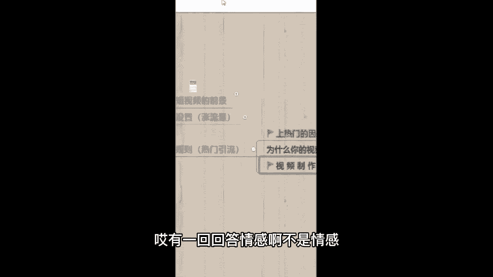

# 2024年做抖音怎么快速起号？3天养出一个高权重抖音账号，掌握这7点，抖音快速养号小技巧！ - P12：8、视频制作核心(上) - 谎言不等于真爱 - BV1AwvYe5EUG

视频制作的核心，这是一个大板块，先跟老师一起来看，我先给你们放一个视频呃，看完这个视频要回答我的问题，我的问题是来思考一下这些视频，它能够火起来的共同点在哪里，然后回答在我们公屏上啊，看谁先答出来。

老婆你觉得女人真正吸引男人的是什么呢，诶你喜欢的人叫你什么啊哈哈，我喜欢的人叫我滚，普通人怎么用帽子拍大片，哥，你觉得快乐是什么，什么是真正的打水漂，今天给你看看什么叫真正的打水漂嗯，如何拒绝道德绑架。

中午发财，记得转给我，为什么现在提出离婚的女人越来越多了，大家知道为什么饭店的鱼汤喝起来那么好喝吗，娶你的话需要多少彩礼，8万10万吧，哎有的同学回答情感哎不是情感。

因为它里面还教你怎么摄影啊，包括怎么做饭。

那肯定不是情感啊，有同学说问答问题对吧，哎没错啊，跟情感没关系，是不是抄作业了啊，来没错啊，他们这些视频的共同点都在于开头提出了问题，呃，有些同学很认真拍视频，可能开头来个自我介绍，比如说我举个例子。

大家好，我叫小月，我来自赣州，今天我给大家讲一节抖音的课程，巴拉巴拉，你拍一个这个短视频啊，短视频有人看吗，人家立马划走，因为短视频他节奏非常的快，你像你刷视频，是不是希望他上来直接说事儿。

哎我不好奇你是谁，我也不在乎你是谁来，你直接给我有事说事对吧，咱们刷视频也一样啊，那如果说咱们做视频，记住开头，别废话，开头用抖音的黄金时间3~6秒钟，直接说你这条视频要干什么。

或者你的标题就围绕视频的内容去做，让别人一看开头第一句他就知道你是做什么的，如果他感兴趣，他就会看完，不感兴趣，他直接划走，证明嗯嗯咱们想吸引的也不是他嘛，所以来开头3~6秒是黄金时间。

不要把这个黄金时间给糟蹋了，那我们来看一下标题应该怎么去起，我找了十个行业的标题，可能没有咱呃可能没有咱们同学的，不用着急啊，我带你们先浏览一下，划重点来，比如说服装类型的成熟女性。

划重点要懂得这些穿搭技巧，来宠物类型的，你划重点，见过猫咪游泳吗，来美食类型的鸡蛋这样做，孩子特爱吃，教育类型的父母一定要知道的这五个细节，包括美妆类型的学生党，你们是不是还在用这个来。

汽车类型的穷人适合开什么车，来家居类型的家里，这三种物品可能含大量甲醛，会释放毒气，很多年，你家有吗，来一下就吸引别人，母婴类型的烧钱又不实用的婴儿产品，你买了吗，来看到了没有，这些标题都很吸引人。

而且我画出来的重点在于什么，他们都吸引了一个群体，边听我讲课边思考了啊，咱们是边听边思考的一个课堂来，我的问题是在于你思考一下，你做的那个短视频吸引的群体到底是谁，然后可以打在公屏上，我举一个例子。

比如说我做的是服装好，那接着我卖的到底是男装还是女装哦，女装那吸引的肯定是女性群体啊，那再接着我这个女装适合多大年龄阶段的人穿，20多岁，30多岁，40多岁还是50多岁对吧。

我的服装适合哪个年龄阶段的哈，比如说二三十岁的好女性，2323十岁，接着我这个服装是适合职场女性穿，还是说居家休闲的宝妈穿，还是追求价格实惠的学生党来穿，我再结合啊，我这个衣服很便宜，性价比很高。

而且适合学生穿，那我的啊可能锁定的群体就是女性啊，多少哪个年龄阶段的，追求什么价格的学生党对吧，抓准群体，不要指望40亿群体都喜欢，咱神仙都做不到，你们对吧，吸引的是哪个群体，思考一下。

哪怕说你吸引的是男性，女性，哪个年龄阶段的对吧，对什么感兴趣的，你看这个你要不动脑筋，你说你后面该怎么搞，得自己思考出自己的群体，你要实在找不着你，课下哎，我跟你一对一沟通，我帮你找好不好。

来接着群体结束了之后再找这个核心话题，他们感兴趣的核心话题，你比如说你做游戏的好，你这个游戏比如说你打的是那个彩虹6号，你吸引的都是男性群体，女性很少去玩，那你肯定要找男性群体好奇的点，对不对。

你不可能拍一个口红颜色啊，哪个颜色好看，那男生大概率不会看，接着疑问，结尾这个记下来，一会儿我们会来到文案环节，你不会选文案，老师我会教你怎么样去选文案，先不用着急，我看有同学问什么产品啊。

问什么黄金啊对吧，你想一下你的产品吸引的是哪个群体啊，比如说你卖的，你得看你卖的是什么产品对吧，就跟服装是一样的，那个比如说你卖一个老年保健品。

