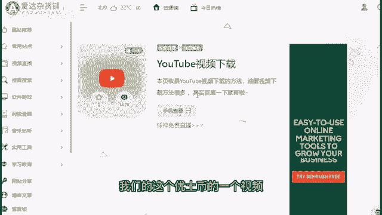
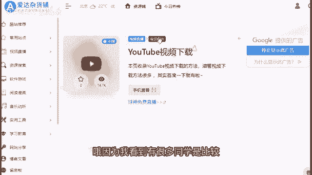
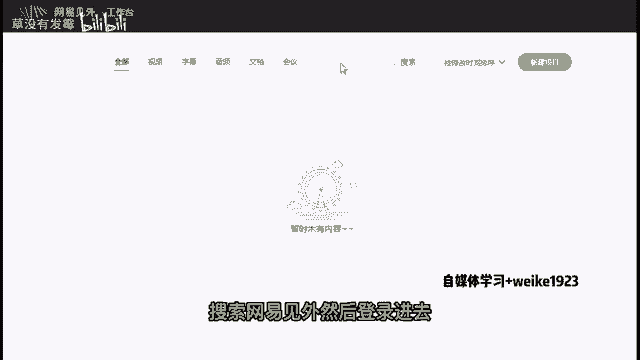
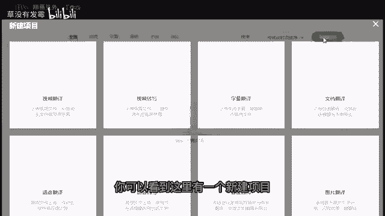
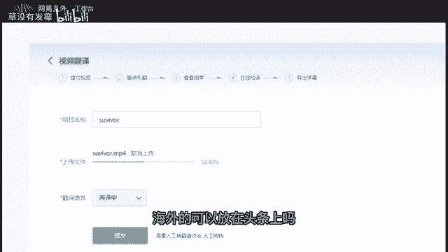
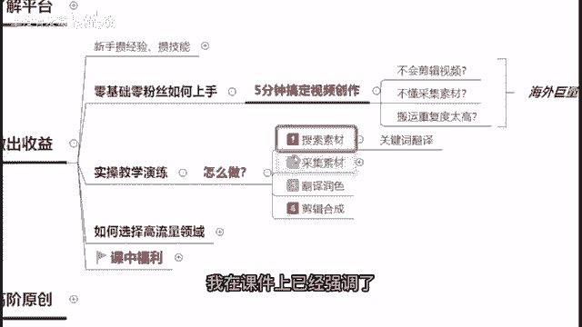
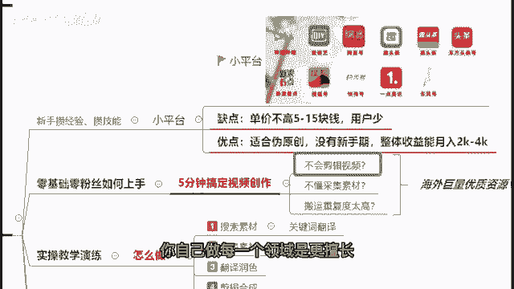
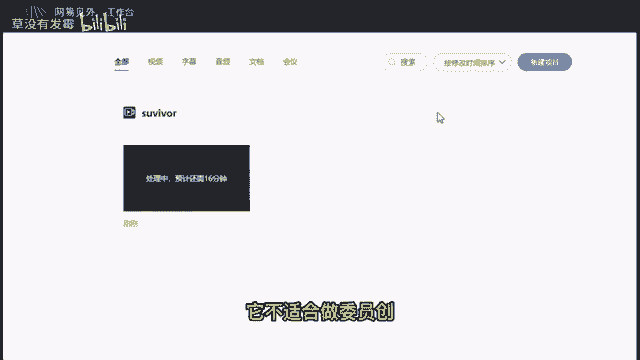
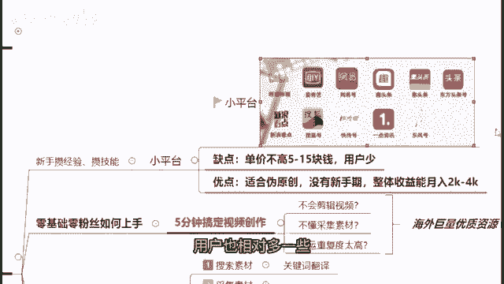
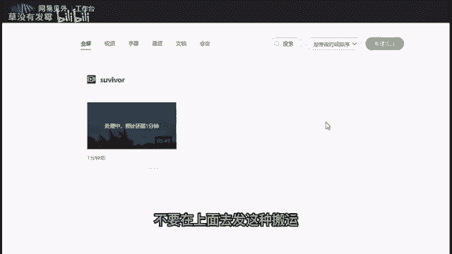

# 2024年做抖音怎么快速起号？3天养出一个高权重抖音账号，掌握这7点，抖音快速养号小技巧！ - P13：6字幕翻译工具介绍 - 草没有发霉 - BV1C1tWeqEo7

然后在这边的话，如果说啊大家想要把整个视频下载下来的话，也可以啊，你用这个啊，比如说在这里我们直接会有这个插件，让你可以直接下载我们的这个YOUTUBE的一个视频。

包括这里的话它也有这个解析下载的站点，以及下载的一个方式，方法直接全部都有写到给大家啊，包括大家如果说你是不知道该怎么样去上这个，海外的一个啊视频的话啊，那么在这边课后你可以问老师。

我如果说你要跟着我学习的话，我可以把我自己所有在用的东西去分享给到你，然后把我们那个视频下载下来之后，我们该怎么样去操作呢，因为我看到有很多同学是比较关心。

这个翻译的问题的，OK没问题，你搜索这个网易见外啊，这个工作台，然后登录进去搜索网易见外。

然后登录进去，登录进去之后呢，你可以看到这里有一个新建项目。

然后新建项目的左上方这里有一个视频翻译。

然后你点击这样的一个视频翻译，填写你的一个项目名称，就是你的一个视频名称，那么在这里的话啊，我随便取个名字吧，就刚刚survivor这个名字吧，然后把我们刚刚做好的视频下载啊。

我们给他做一个上传上传进来，然后在下面你可以选择这个翻译的语言，音译中或者中译音都是没有任何问题的啊，然后它的翻译呢也是比较准确的，而且最重要的是这个网易见外的这个翻译台，它是不需要任何的一个费用。

是可以做到免费的翻译的，然后包括我也跟刚刚有一位同学，我看到公屏上在问海外的。

可以放在头条上吗，不行我刚刚就已经强调了，我在课件上已经强调了。

就是你要做你就做小平台，因为小平台的话，你才可以做这个伪原创才可以啊，做搬运，你不要在大平台上面去做，你要做你就在这些小平台上面去做，你不要在头条号上面去发，也不要在百家号上面去发，也不要发在抖音上。

你要发就发在这一些平台里面，不要乱发啊，因为小平台以外的大平台基本上都是啊，不会支持你去做这个伪原创和搬运的，但是对于很多的新手小白而言，一开始就让你去做原创的话，其实是非常困难的。

所以我建议前期大家做搬运的一个方面，第一个你可以逐步的去锻炼你自己，剪辑视频的能力，第二个你可以去慢慢地摸索清楚，你自己做哪一个领域是更擅长。

更适合的，好吧好，那么所以在这里啊，我们的一个视频已经上传完了，我们点击一下提交，然后在提交之后啊，我们来看一下他现在在处理中啊，那么既然有16分钟的一个处理时间啊，其实不用16分钟那么久啊。

隔2分钟刷新一下，它就很快的，大概就是45分钟的一个时间，那么这45分钟的时间呢，大家如果有相应的一些疑问，你可以打在公屏上，我会选择性的去回答你们的这个问题，因为现在我们是需要等待他去做一个。

实时的一个处理的好，那么在这边的话呢，啊我大概回答一下，刚刚公屏上一些同学们回答的一些问题啊，首先这一个平台网易见外的这个翻译平台，它是不收费的，它是一个完全免费的软件，好，那么再来一个啊。

我们的这个抖音，它是属于我们的一个字节跳动呢，属于大平台，它不适合做伪原创。

你要做伪原创，要做搬运，通通在小平台上面去做，你要做你就在B站，爱奇艺艺啊，或是网易号趣头条会头条，搜狐号，快船号这些平台上面去做好吧，如果说你要做小平台的话，你就在这个上面去做。

小平台里面其实B站是最好上手的，B站可以发非常多的领域，然后呢他的这个钱呢相对也给的比较多一些，用户也相对多一些，而且你也可以很明显的看得到。

我刚刚是不是列举了一个B站的一个页面，给大家，这个就是B站一个个人号，他去做这个荒岛求生的搬运，你可以很明显看到他就是一个个人的一个博主，然后他去做这些荒岛求生的一个搬运，对不对。

他就是做了一个原声原画，然后加了一个中文字幕而已，但是就这样他也能有2000啊，200多万的一个播放，他一条视频就能够赚3000块钱好，所以说这个就是我为什么，建议大家刚开始做的时候，先选择小平台去做。

你也可以从搬运开始，尝试练习你的一个剪辑能力，练习你的这个适合的领域对吧，所以说啊这个是我刚开始觉得，如果说新手刚开始你希望能够做出收益的，又或者但是你又觉得啊。

自己的这个能暂时的这个剪辑能力不是很好的，你可以先这样去做啊，开启你的一个自媒体的一个道路好，那么在这边啊，哦我我也再回答一下，同学们在公屏上的一个问题，就是混剪算搬运吗啊首先我回答你混剪。

看你混剪的好不好，你混剪的好，它就是原创啊，如果说你混剪的不好啊，那么它就是一个伪原创啊，这个就看你这个剪辑的能力，以及你对这个呃剪辑的这个脚本，写得到底怎么样，然后在这边的话。

我看到有同学其实在问B站，做国内综艺行不行不行，国内综艺肯定不行，国内综艺你那个就是很容易被查到的，因为国内的这些公司，它是呃会是会有团队时刻注意，国内的这些平台是否侵权的，所以你要做你不要做国内的。

你要做你就做国外的啊，不要做国内明显的大家都知道的综艺啊，建议是不要做啊，建议是不要做，因为这个侵权问题，你做国外的综艺，因为国外的这个团队不一定会啊，看到你这个国内的这些平台也不会去管你。

但是你做国内的事情就完全不一样了，好那么在这边我们来看一下啊，还有一分钟时间我再回答一分钟哦，我们这个啊我们同学们的一个问题，然后我看一下，嗯我看一下国外这个平台好翻墙啊，翻墙这个问题呢。

实际上啊就像是我也不能直接的说，就是啊翻墙这件事情呢，就像是大家都有一些心知肚明的小网站啊，基本上基本上是成了年的男生，应该都会有习惯去观看的，但是你看看实际上有人管你这些事情吗。

有人去管你上这些网站吗，没有嘛，对不对，所以说你单纯的去翻墙是没有人管的，然后再来跟大家强调，你所有这作者这些搬运做伪原创，都要在小平台去做，不能发西瓜视频，不能发抖音，不能发头条啊好吗。

西瓜视频抖音头条都属于大平台，不要在上面去发这种搬运。

不要在上面发。