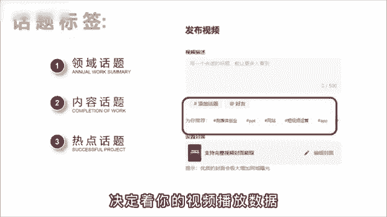
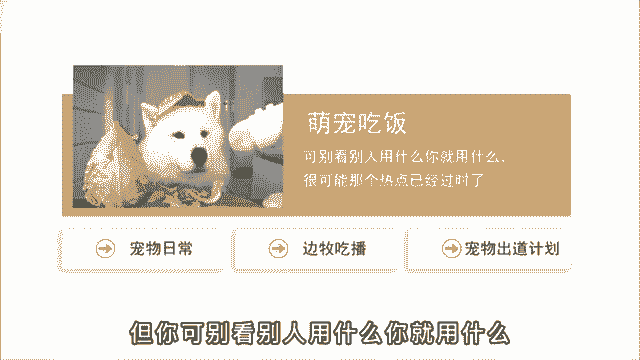
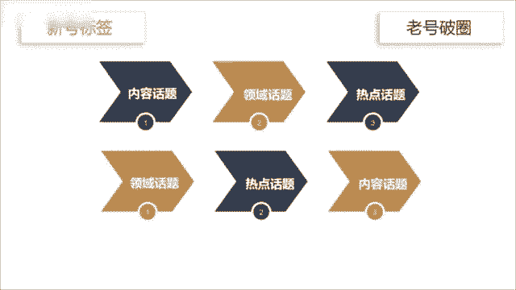

# 2024年做抖音怎么快速起号？3天养出一个高权重抖音账号，掌握这7点，抖音快速养号小技巧！ - P13：6话题标签引流技巧 - 漫步花再乡 - BV1FyeweHEXt

话题选不好，流量少一半，很多人啊觉得话题这个功能鸡肋没啥用，不重视，但我劝你啊，可别小看这个功能，这其中呢隐藏着大大的心机。

用好了能够帮助新号快速完成能启动，因为添加一个合适的话题，能够帮你带来更多的曝光机会和精准流量，一般来说啊，话题分为三类领域话题内容话题和热点话题，领域话题用来覆盖行业大类内容，话题细分识别人群。

热点话题就是蹭流量的话题，选择的优先级与正确与否，决定着你的视频播放数据。

举个例子来说，你是做萌宠吃播的账号，分别对应的话题啊，就是领域宠物日常内容，边牧吃播热点，宠物出道计划这个热点话题啊，有可能是时下热点，也有可能呢是平台的流量扶持计划需要啊，你自己去找找。

但是呢你可千万别看别人用什么你就用什么。

很可能啊那个热点已经过时了，具体方法呢就是登录电脑版的抖音服务中心，选择创作灵感，点击创作素材，再点击热门话题就可以看到了，这里面都是时下热门的话题标签，你可以根据自己的行业来选择，比如刚才说的萌宠。

你就可以选择动植物，排名第一的就是宠物出道计划，然后点击后边的发布视频，就可以自动打上该话题了，那关于话题标签啊，另外还有两种情况，第一你是星号期则内容话题大于领域，话题大于热点话题。

原理呢是让系统快速精准的知道，你究竟是干什么的，盲目的蹭热点，有可能啊会影响你的标签，第二是老号破圈则领域话题大于热点，话题大于内容话题，原理呢是老号的流量比较稳定，需要突破领域的限制。

破圈获得更多的流量推荐。

但是呢就算学会了这个方法。

