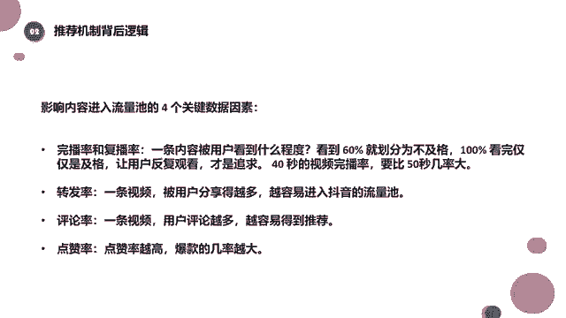
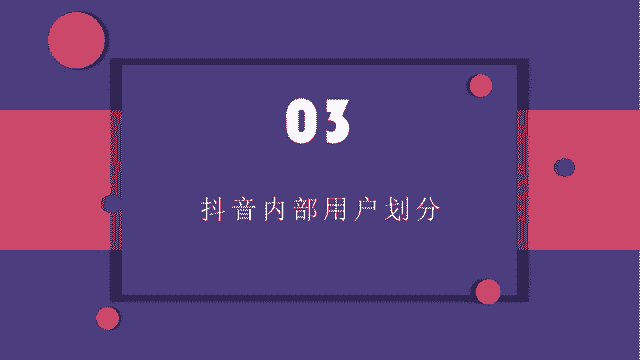
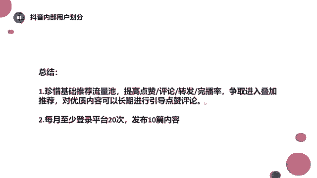

# 2024年做抖音怎么快速起号？3天养出一个高权重抖音账号，掌握这7点，抖音快速养号小技巧！ - P13：抖音内部用户划分 - 辣妹小熊aa - BV1VKtVesEZC

然后我们最后的话讲一讲这个用户划分，因为刚才给同学们讲了用户标签的这个概念，对吧啊，所以说我们知道啊，抖音，他对自己的用户做了一个，非常精细的精细化运营，我我喝口水。

我们可以简单的看一下这张图，好啊呃，首先我得给大家先讲一个概念，之前我们在讲养号的时候说了，我们为什么要养号，就是因为我要提升活跃度，那么提升活跃度哈，提升活跃度是为了什么。

为了让抖音能够认定我是一个正常用户，我不是为了来你抖音赚你的钱，不是为了来抖音营销，不是为了来抖音引流的，就算是你的真实目的是这个，但是你也不能让抖音觉得啊，我就是来干这个。

你要让他觉得我就是一个正常用户，我是来使用你这个平台的，我是喜欢你这个平台，我是喜欢上面的作品，我才来的啊，先给大家说一个这个概念，然后我们再来看这张图，这个图呢其实大家能看明白吧，看明白吧。

横着的是月发布视频的次数，竖着呢是月登录次数，然后呢，每个不同次数下面，它都它都有对应不同的一个颜色，那么这些颜色它会代表什么，我们一点点来看啊，一点点来看，那么这边我们看啊，从底下看。

你说月登录次数是零次，那月发布次数是0~10次的时候，他全部都是红色，大家看到全部都是红色，可能这个时候同学们就有疑问了，老师他月登录次数是零次，也就相当于一次都没登录啊。

那他是怎么做到月发布次数是十次以上的，唉这个焦点的位置大家可能闹不懂了，是不是，那么其实啊，我们要深度理解一下这边的月登录次数啊，啊这块讲的咱们的登录次数是什么呢，就是登录并且有效的浏览了。

这才算是一次有效登录次数，如果你仅仅是登录上去，然后把视频发布出去，这不算是正常登录，大家能懂吧，所以说这个零次代表着你没浏览，你登录这个账号仅仅是为了发视频，大家应该能理解哈，如果说你是发布。

发布完了之后也浏览了，是会增加一个权重的啊，虽然抖音的官方他没有这样讲过，但是呢就是其他的一个呃这个短视频平台，比如像微视，他已经是这样的好吧，那在抖音里他也有这样的一个用户划分，那么我们可以看到啊。

像这种月登录次数零次，然后发布次数十次以上，大家肯定觉得就不正常了，这明显就是一个人可能运营了多个号是吧，他现在就是一个红色用户，那么如果你是一个红色用户的话，那抖音会给你什么样的运营方式呢。

可以看一下红色用户唉，他现在还不会把你的作品推荐给别人，他还是在培养你的使用习惯，也就是在抖音那里认为啊，如果你是红色用户，那你根本还不喜欢我的作，我不喜欢我的这个产品啊，不喜欢刷我的抖音。

没不也不看我的作品，你就仅仅上来去发布你自己的作品，那这个时候我怎么可能把你推荐给别人呢，对吧，你得用啊，你得用我的抖音，你得刷它呀，你得培养你自己的使用习惯呀，对不对，这个时候呢。

它的重心还是在给你推荐优质的视频，还不会想要把你的视频推荐给别人，那是如果说你是红色用户的话啊，你即使你月发布十次以上，你发布20次以上，你发布30次，它也是一个红色用户，这个大家要注意了。

然后我们再来看我们看橙色这个位置，橙色这个位置呢是约发的次数0~5次啊，然后这个登录次数呢大概是0~20次左右，大家能看到吧，好这个时候呢是一个橙色用户，这个时候呢感觉还不错啊，月登录次数呢也不错。

但是呢发布次数比较少啊，可能一个月0~5次，相当于啊一个周发一条，甚至说你一天呃，你今天发一条，明天发一条，然后呢你下下周再发三条啊，下一下周你就不发了啊，就有可能是这种情况对吧。

就是三天打鱼两天晒网的一个情况，这个时候呢，你是一个橙色用户或者是土黄色用户啊，这是什么颜色，那这个时候唉，抖音会对你做的一个运营方式是什么，来给你提供更优质的内容，他还是在给你推荐内容。

还是在给你推荐内容哈，看到没有啊，这是土黄色用户，然后我们再接着往下看，我们再看这个浅绿色的用户啊，你月发布次数5~10次可能比较规律了，然后你的登录次数呢可能也是5~10次，看到没有啊，甚至十次以上。

然后哎越冬次数0~5次也都是浅绿色，那么在这个时候，基本上我的登录次数和我的发布次数，都是比较规律的，都是比较规律的一个情况，这个时候其实平台呢会给你一定的流量倾斜了。

因为你变成了他们平台的核心输出者啦，对不对啊，你有可能这个时候你积累了一定的粉丝了啊，或者是说你这个时候呢有喜欢的这样的一个啊，什么视频内容，然后呢你也会发布一些比较垂直的视频内容。

你的内容标签和用户标签他都给你打好了，那这个时候他可能会给你一定的流量倾斜啊，尤其是像深绿色这一块，其实深绿色浅绿色都差不多，他会想要留住你了对吧，我们可以看一下，像这个深绿色和浅绿色用户啊。

平台必须想尽办法去保留你，然后让你呢往这个核心输入者的身份，输出者的身份去转换，大家能看到吧啊当然了，当然了哈，抖音它其实不存在说特别大的一个流量倾斜，只能说你发布的都不错了，然后你整个用户标签。

内容标签明确了，他会给你很精准的推送到一定的流量，你的内容质量都不错了，他会给你推荐到啊，比较精准的喜欢你视频的人，那这个时候你自然能够积累到一定的粉丝对吧，所以这里想跟大家说的是什么呢。

啊一定要让抖音识别出你是一个正常用户啊，千万不要做一些比较过分的营销行为，让他判定出来你是个营销号的话，基本上你的机会是不大的，基本上机会是不大的，所以在养号的时候，我再三的给大家强调。

咱们一定要保持活跃度，一定要保持活跃度，像一个正常人一样，你怎么去看视频，怎么去点赞啊，怎么去那个收藏转发，就按以前一样就可以了啊，只不过在这个过程中呢，可能我们心里自己知道啊。

我接下来我做这些行为是为了，我要做一个美食账号，我要做一个美妆账号，我稍稍往那边有点倾斜啊，这样就可以了，好吧，好啦，基本上就给大家讲一讲这个用户划分，然后让大家吸引，大概知道啊。

我们整个这个抖音它的一个推荐机制啊，啊它的一个就是啊叫什么用户划分啦，还有它的一个就是流量池的分配啦，啊这里让大家知道，其实这节课呢概念性的东西偏多哈，概念性的东西偏多，可能配合着案例大家会比较喜欢啊。

但是今天呢我们一个案例都没有啊，这些内容还是比较重要的，其实比较重要的，你只你只有知道了一些啊，推荐机制，也就是我们说的背后的原理，你才能更好的去运营你的这个账号，好吧好，那么下面的话可能有个总结啊。

就是珍惜一下我们基础推荐的，基础推荐的流量池，提高一下我们这些啊完播点赞评论转发啊，争取进入到我们的叠加推荐，对优质的内容呢可以长期进行引导，点赞评论就是我们的什么呀，时间效应嘛，对不对。

然后每月至少登录平台20次发布视频内容，当然这个是想告诉大家，如果我们决定就是要做视频了哦，一定要就是保持一个比较稳定的输出，比较稳定的输出，如果说你看你你前期经过这么大的劲儿哈，你去养号，养完号之后。

你去做商业定位，你去做内容定位，然后你去发布视频，发布完了之后啊，你还不要，你还不按时的输出，那么前面这一些全都白费了，全都白费了，如果说你今天发了视频，你下下周又发视频。

那这样的一个流量肯定是不怎么好的，肯定是不怎么好的，除非你前期已经有了大量的这个粉丝基础啊，比如说我们在抖音上能够看到一个账号叫尿尿，是只猫，他有1000万的粉丝，他有1000万的粉丝。

那么他现在发布视频的频率是啊，7月20号发一条，8月啊，8月中旬可能发一条啊，他可能中间相隔一个月甚至一个月更多，那是因为人家前期已经有了一个，1000多万的粉丝量，1000多万的粉丝量。

如果咱们自己刚开始做号的话，避免掉这种情况，避免了这种情况，这个以后我也会跟大家说，因为大家现在啊做做作品有出现一个问题，就是我想到什么就拍什么，拍完了我就发出去，下一个作品不知道在哪啊。

吃了上顿没下顿的感觉，但是咱们一般去做的话，不是这样做的，我们会前期至少先策划出五期内容啊，或者策划出十期，先策划完了之后，我们知道第一期拍什么，第二期拍什么，第三期拍什么，第四期拍什么。

然后呢呃那个规定一个完成的时间，完成的时间完成之后，我们再发出去，然后再去评估一下这几个作品的效果，对了，好像发朋友圈一样，对我们现在就是这样，就是今天想着哎我要拍一个什么啊，我拍完了啊，觉得特别好。

可能我花了两天的时间，我才把它搞好，我的欣喜若狂，我就发出去了，但是我看到那个流量哎呀怎么回事，我觉得应该有1000万流量的，结果只有100个流量，算了下一个作品再说吧，什么时候等等，我心情好了。

我再发是吧，大家可能经常就会遇见这种这种情况，因为其实啊每个人的想法都一样啊，还是有很大一部分人还是想着啊，能够靠一个作品，或者自己觉得比较优质的那个作品，然后完成一次爆火，至少是浏览量不要太差。

但是这个东西确实是一个长期的过程，确实是一个长期的过程，你只有去做了，你才知道哎，用户他不太喜欢这个，我下一次换个方向啊，或者是换完方向之后发现用户还行，然后我们再去在这个经验中去总结这个教训，对吧。

好好像发朋友圈一样，人间真实，那我看其实好多同学就这样，很可能啊一期发完之后，下一期哎不知道发什么了，就开始想啊，下一期的选题我要做什么，然后突然在某一个时刻一拍脑瓜哦，我想到了我就做它吧。

然后下下棋又没着落了，就都是这样的情况，这个之后我也会给大家讲的，那讲到讲到方案策划的时候，会给大家讲到，我们前期怎么去做这个这个方案的一个策划，怎么去先把咱们前几期的内容给他制定出来。

跟油管的机制一样，不过内容抓的更严格了，是的内容抓的更严格了，这个是以后的大趋势吗。

