# 2024年做抖音怎么快速起号？3天养出一个高权重抖音账号，掌握这7点，抖音快速养号小技巧！ - P14：内容的三有原则 - 霍恩比道尔 - BV1fjtWe4EGs

可能在不提到这个的时候，大家就不会想到顺序问题，对不对，好了，那么说了这么多啊，这个时候我们就回来了，那内容定位到底怎么确定啊，啊就是说用户他到底喜欢什么样的作品，对不对对。

一秒钟让素人变女神的打光方式，你的这个标题比前面那个标题好100倍，真的。

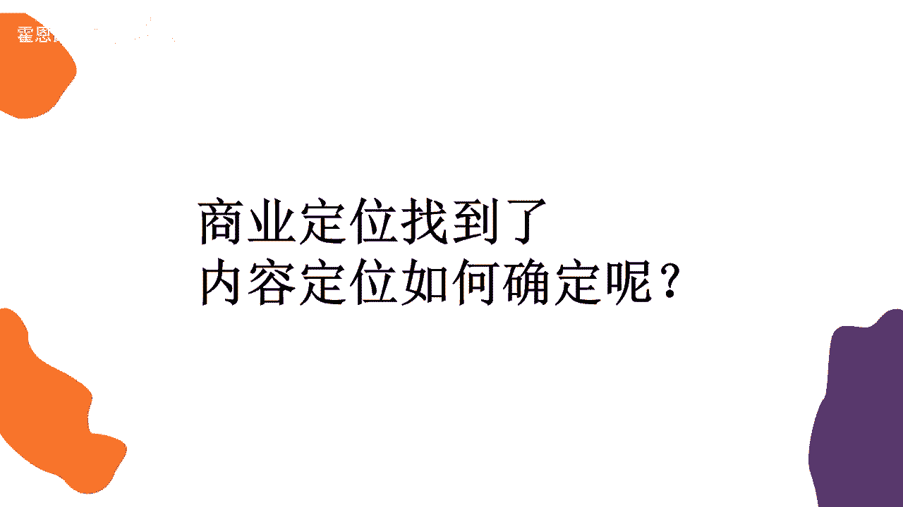

好了，那么我们接着来看啊，我们看几个视频。

好了啊，啊这其实就是一个钢琴弹奏，这个卡农有一个简易版的这样一个钢琴的乐谱，对不对，简谱啊，他是可以啊，私信拿到的，那么这个我们看上去它是一个什么呀，对于对钢琴有兴趣的或者初学钢琴的人来说。

它是一个比较有用处的一个内容对吧。

我们再接着来看啊。

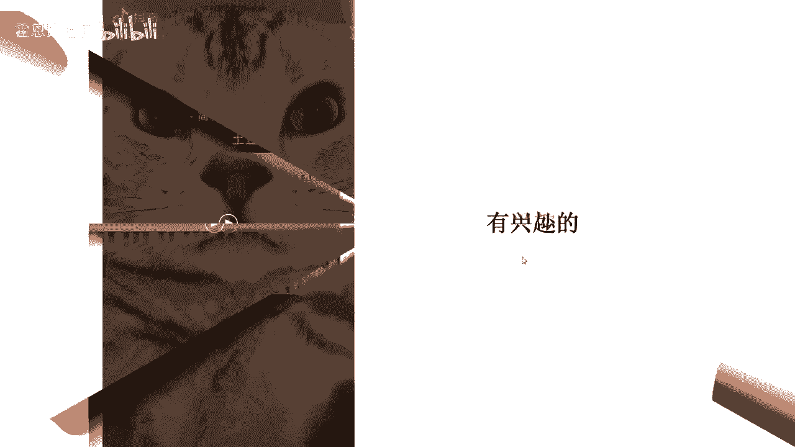

小汪虽然长的不但是球大，我虽然不长，但也不算小声一点，和你一起扑通，你放开手。

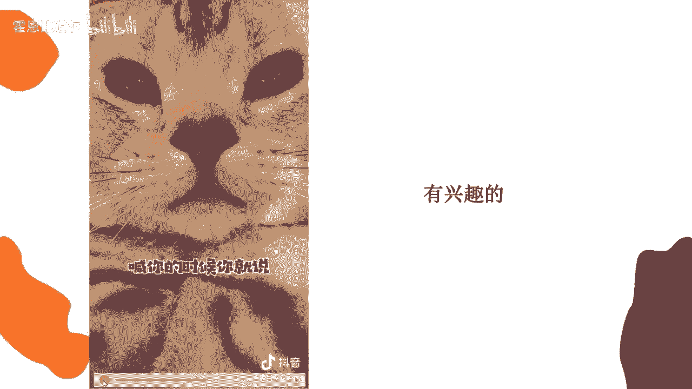

这世界对每个人都是控好，这是一个小弯儿，对不对，它是一个小喵子，它是一个宠物，那么宠物的话，有人喜欢宠物，有人不喜欢宠物，你像我就比较喜欢宠物，那它就是我感兴趣的一个内容，我看到之后呢。

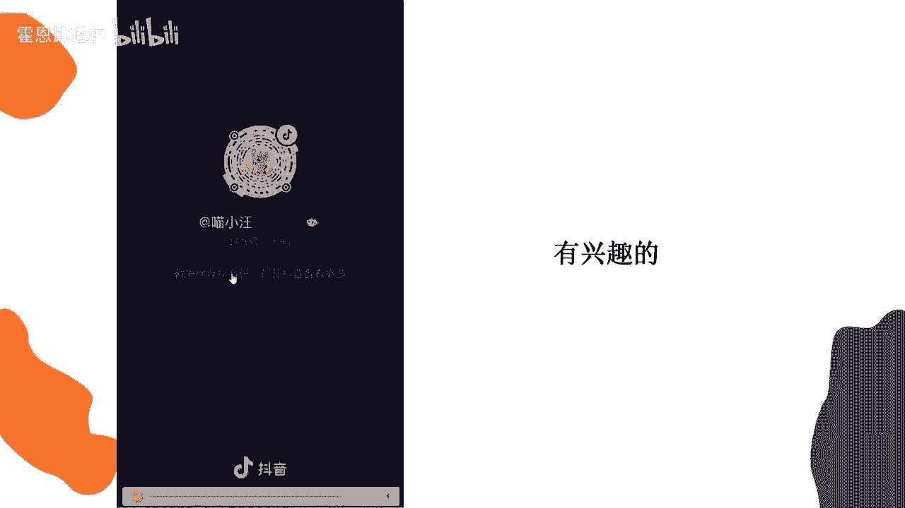

我会想点赞，那我再往下看，再看一个视频。

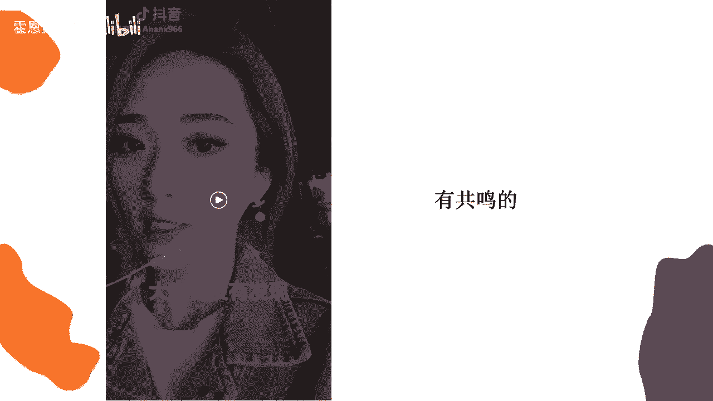

大家有没有发现身边的男孩子长大之后，话变得越来越少，大多数时候都是自己默默的在做事情，一开始以为是性格的原因，后来才知道他们不是不想说，而是不知道怎么开口，因为他们早就已经习惯了。

身边都是需要依靠他的人，而他想依靠的人却没有，所有事情都得自己默默承受。

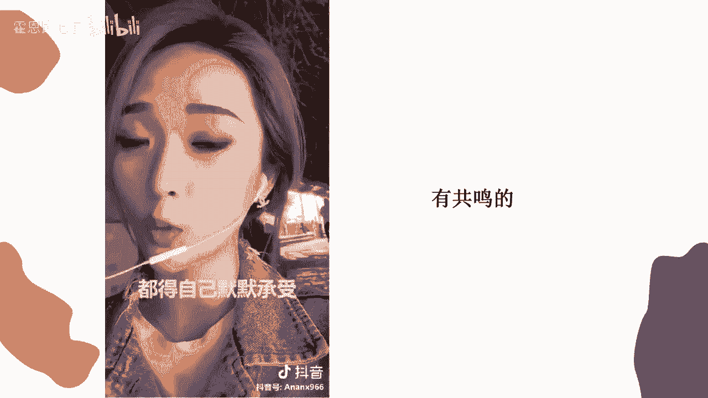

来直播间的男孩子们啊，有没有这么坚强，让人心疼的男孩子，这个美颜是不是有点过分了啊，这个关注点是不是有点跑偏了哈，猪头来我们直播间有没有这么啊坚强的男孩子，看完了之后呢，有点共鸣，说到我的心坎儿里了。

这个人是谁，我得关注他，对不对，是不是，这就是我们说啊。

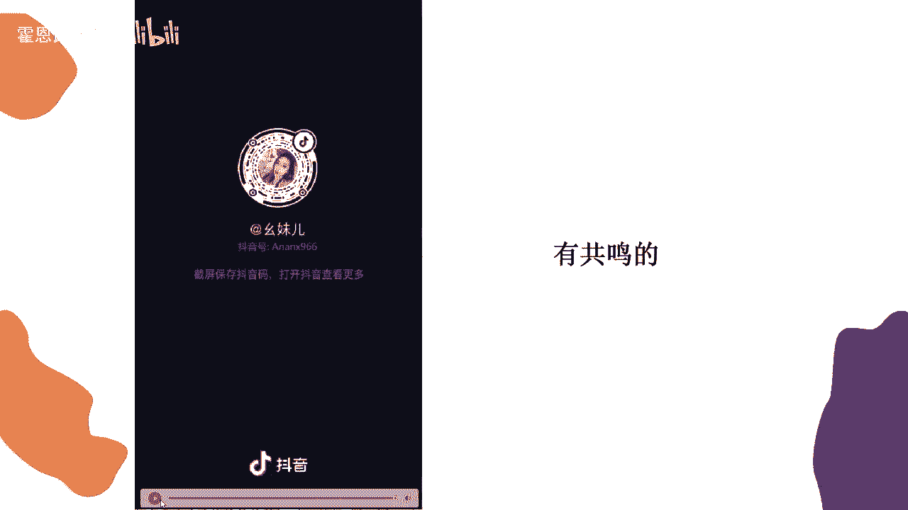

我们简单总结一下，这个叫做三有原则，我也不给你们卖关子了，那这个三有原则呢目前是全网通用的一个内容，被喜爱的三有原则叫做有用处，有兴趣有共鸣，那么其实讲到这，大家可能还不太理解啊，给大家看一个表。

那么我们目前啊，在抖音上看到的一些视频的内容，它基本上都符合有用处，那有兴趣有共鸣这三个点啊，这个字我打错了，这里应该是有兴趣，好吧基本上都符合这几个点，你像啊教程类的推荐类的，它都属于干货类嘛。

它就是属于有用处，还有一些美好的剧情，颜值萌宠啊，以及比较炫酷的炫技，然后还有恶搞情景剧，他就属于比较感兴趣的，有一些私人领域的，对不对，这一类，那么再往下看啊，可能还有什么呀啊就是励志类，鸡汤类。

无论是鸡汤还是反鸡汤，还是伪鸡汤还是毒鸡汤，对不对，它都属于这种，就是有共鸣类的，有共鸣类的，就像刚才给大家看到的啊，那个美颜过头的，那个小姐姐在讲男孩子辛酸历程的，对不对，它就会让人产生有共鸣的感觉。

那么其实啊我讲完之后，大家哎似乎好像有点明白了，无论什么内容，我们可以从这三个点先往外延伸，是不是啊，那大家看到这么一串啊，内容之后可能又有点懵了，人美好类，推荐类，教程类，炫酷类，九大类。

我到底要做哪一类呢，到底哪一类才能适合我的商业定位，才能适合我的内容定位啊，大家先不用想啊，先不用想，先不用想，你现在要做哪个类型的内容，还有点太早，我们先来看一看就行好吧。

那么接下来的话呢我们还是要先去看一个视频。

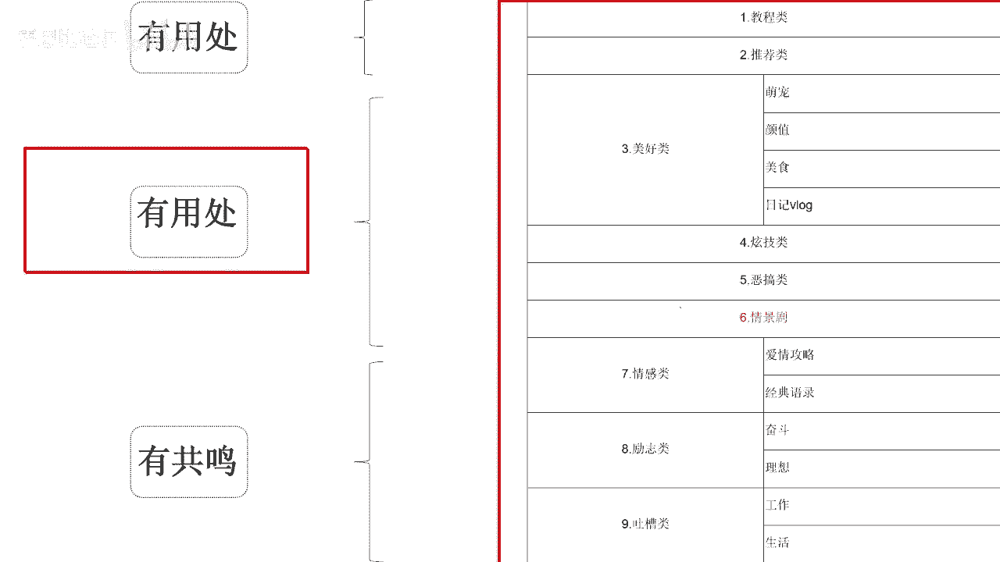

来我们先要在看这个视频。

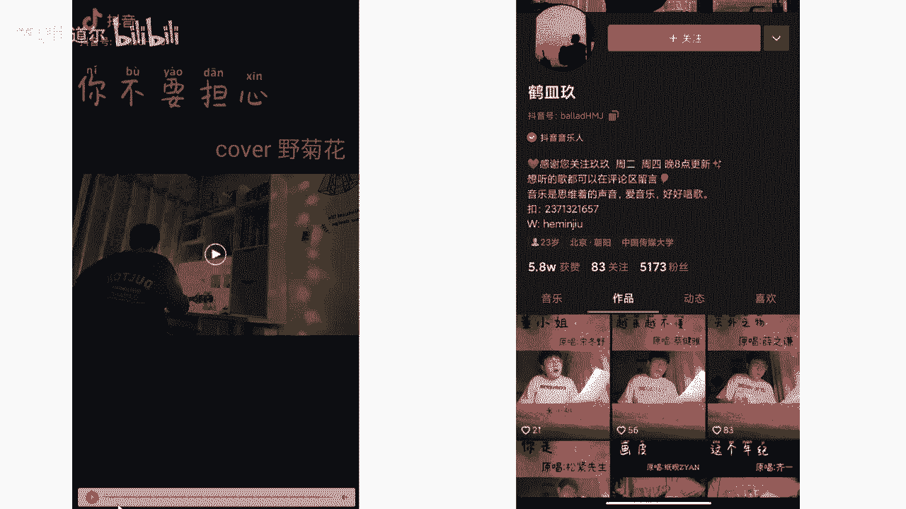

啊哟啊哟，屋里海边浓烈和世代。

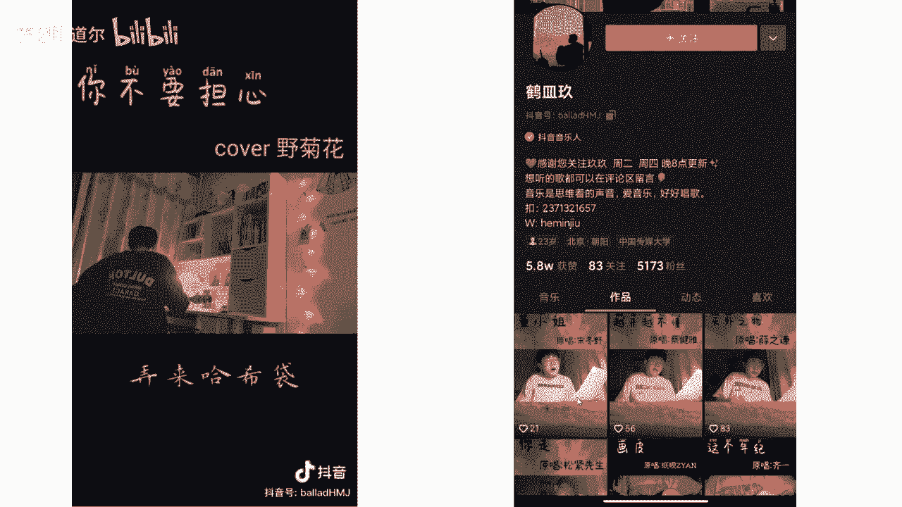

好了这个视频看完了，大家觉得这个视频好不好，还不错，是不是是不是啊，画面啦，然后唱的啦，整个感觉还不错，不是说那种粗制滥造的视频对吧，而且这个视频呢他的点赞还可以，然后呢哎我们来看一看他的账号。

这个账号叫做鹤鸣九，哎感觉差点什么，老是感觉差点什么，但是差点什么呢，我也不知道，来我们来分析一下啊，这个账号啊有一个很大的问题，来我们来到主页之后，发现他的获赞5。8万，但是他的粉丝只有5173个。

说明什么呀，其实说明他的作品做的还可以，有人点赞，还有喜欢的5。8万点赞呢，但是他不涨粉丝呀，然后粉丝你的获赞，比你的获赞和粉丝去给他除一下，你可以得到一个比例，可以得到一个比例。

你可以得到一个他多少个赞才能得到一个粉丝，这样的一个比例，他稍微的有点不太正常，那这是什么问题啊，同学们这什么问题，可能有同学说老师我知道什么问题哎，作品可以，但是没有持续关注的，是不是他不垂直呀。

老师，啊十比一是吧，他十个粉丝十个赞才得到一个粉丝是吧，大家可以看一下你的粉丝刷的，大家可以看一下啊，有的说它不垂直，但是我们一看这个封面啊，全是唱歌的，他好像也挺垂直的呀，那他是什么问题呢。

是什么问题导致了他不涨粉丝，因为有同学啊肯定会面临这种问题啊，老师我的作品垂直啊，我觉得我的作品也很用心啊，然后我给别人看，他们都说我的作品还行啊，都不是什么垂直乱造，垂直是啥呀，垂直呢就是嗯我做唱歌。

我就一直做唱歌，哎如果我做唱，今天做唱歌，明天做美食，后天做旅行，我这就不叫垂直，对不对，垂直那就相当于什么呀，同一个领域一直做到底，因为我们在想定位的时候，可能会想，刚才会想什么教程类，什么美食类。

什么剧情类，对不对，就只专注于一个领域，没错是的，这就是我们垂直的意思，因为你不垂直的话，别人他很难去关注你，除非这个人，除非观众喜欢的是这个人，大家懂不，那有时候你你你关注一些美妆博主也好啦。

关注一些大网红也好啦，那他这个人可能发他去旅行，他去吃饭，你都想看，但如果你这个人吧，他不是特别的，就是有吸引力，那别人也不是很喜欢你，那你要想把这个东西做得好，你就得专注于一个领域。

你做美食就一直做美食，然后别人关注你的话，他才会有关注的欲望，对不对，那这是我们垂直的意思，一般我们普通人去做这种视频的话，都做垂直类的账号，好的啊，刚才讲到哪了啊，讲那啊。

刚刚讲到就有很多同学会遇到这种问题，就是老师我的作品做的也不差呀，啊我的这个领域垂直呀，为什么我不太涨粉丝呢，我觉得我有些作品别人还挺喜欢的，这是为啥，我这长不动，那他是什么问题哈。

我们说他一个问题是主题IP的问题，一个是账户搭建的问题，是这两个问题啊，那么我们一点点来看，首先我们来看啊。

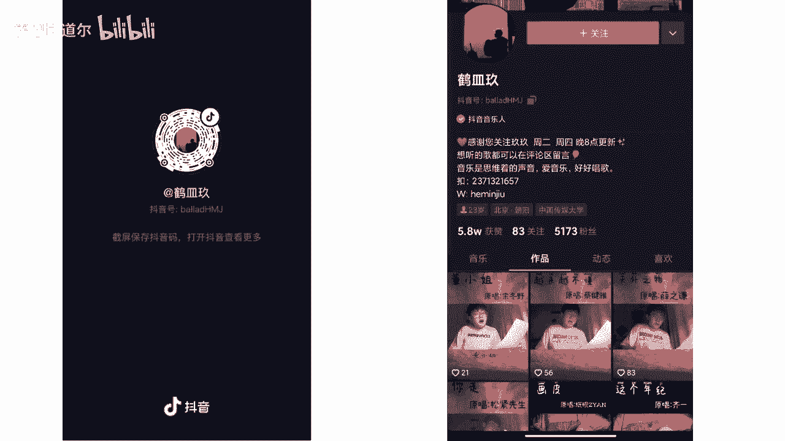