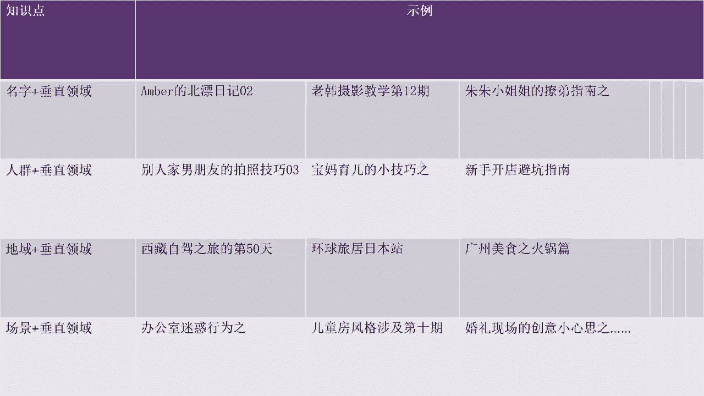
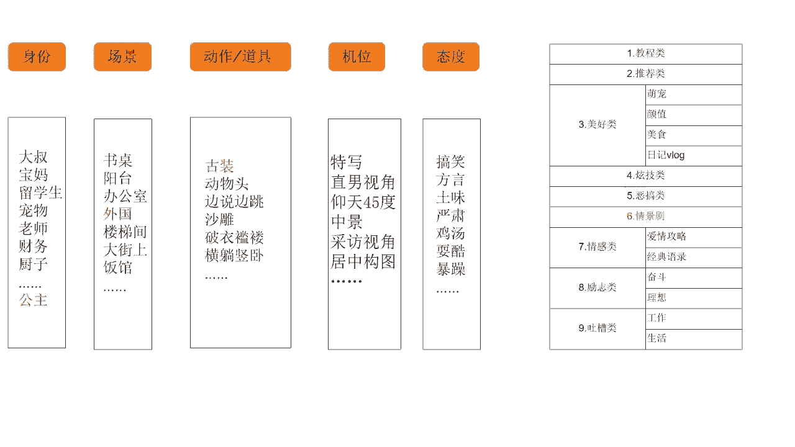
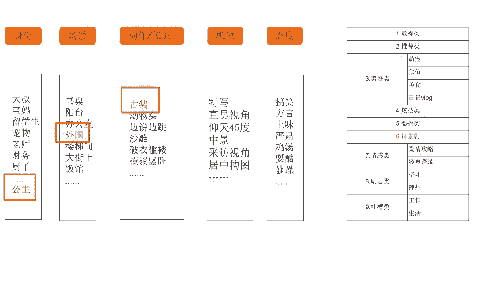
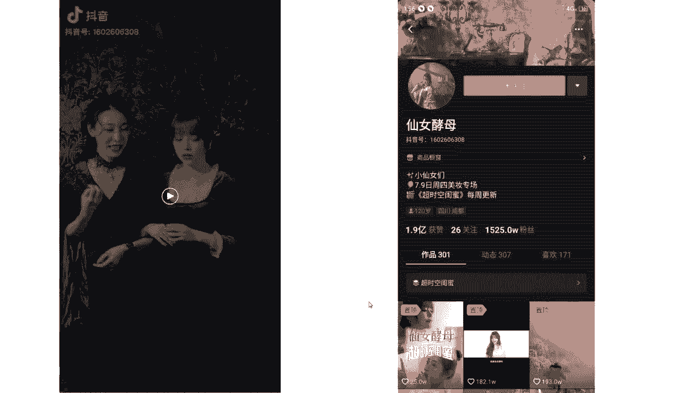

# 2024年做抖音怎么快速起号？3天养出一个高权重抖音账号，掌握这7点，抖音快速养号小技巧！ - P14：策划内容定位 - 运运好运营 - BV1ZLsqe9E3q

能不能懂，宝贝们好，那么其实我们在想到这种主题IP之后呢，懂是吧，然有同学说了，老师你这个东西吧，好像好多人都这么做的，什么老韩摄影教学，我还看见小韩摄影教学了呢，那你有什么猪猪小姐姐。

我还有什么猪猪小弟弟呢，是不是，那你这个广州美食之火锅片，人家老发什么重庆美食之火锅片的啊，这么多，那现在是不是重复内容特别多呀，是不是，那我在做这个主题还能火吗，那我看老韩摄影教学，最开始他很火。

但是往后面再拉好多做摄影教学，他火不起来呀。

是不是啊，这个这个时候问题就来了，但是我们选的这个主题IP它还能火起来吗，可能我们第一想的是去模仿别人啊，什么火我就也做个什么主题呗，啊对不对，这个是人之常情，但是他还能不能火起来，看能不能火起来。

哎能不能火起来，再看我们接下来的什么呀，我们的核心内容啊，大家想等我想好一个主题IP之后，我里面的核心内容还没有想的更细致啊，比如说我选择了这个老韩摄影教学了，但是里面我到底教什么。

我到底拍拍人还是拍景啊，我用手机交还是用相机教我，这些我都没确定啊，那这个时候我们说除了主题IP之外，更具体的呢就是我们是什么样的唉，我们要在什么场景里，用什么道具和动作啊，去啊，表达什么样的态度。

用什么样的机位，我们的视频结构，我们的内容是什么样的，这些都是我们需要接下来定的，大家能懂不，哎所以说其实一个内容定位没有那么简单，是不是它是一环套一环，一环套一环的，好吧啊，那么我举个例子。

咳咳我举个例子啊，然后刚才我们想到啊，除了说主题IP之后，我们还要想什么呀，什么我们的身份，我们的长景，我们整个动作，我们的道具，我们的机位，甚至使我们的态度啊，这个是我们都要想到的一些啊。

尽可能多的去给他扩充，对不对，那越丰富越具体，那么我们整个的定位越明确，我们接下来去产出内容的时候越容易能懂吧，啊那大家其实可以看一下，之前有一个账号叫做暴躁的小峰。

那他其实就是啊在在态度中选取了这个暴躁啊，其实他现在已经有很多粉丝了，很多粉丝了，那它的一个脚本模模式呢，跟我们接下来要讲的一些内容上的脚本模式，其实都是一样的啊，这个之后我们讲到你们就清楚了，好吧好。

你看在这里啊，我们选择了主题IP之后，那其实身份场景动作，机位态度我们都得选择一下，都得选择一下啊，那么在这里呢就是嗯给你们看一个案例吧，给你们看一个案例叫做仙女酵母。

她的一个案例，所以我诶我的包呢肯定带到咖啡馆了，走你好，请问有看到我的包吗。

你好是这个吗，诶谢谢诶，不好意思，我好像电话也忘拿了，哎帮你收起来了啊。

谢谢，太感谢了，不好意思，稍等一下。

一会我闺蜜应该也会发现她们把我给忘在这了，好了，同学们，那我们来想一下这个视频啊，这个视频呵呵他这个段子好不好啊，这个段子好不好，单纯讲这个段子内容的话啊，他的这个视频的段子内容非常的呃，就是怎么说呢。

有点无聊，并不是说很新颖的那种段子，对不对，但是这个视频他大概有几百万的点赞吧，那这是为什么呢，同学们想一下，这是为什么，这是为啥，想一下就他的策划非常的好，他策划非常好，大家返回来再看一下。

那仙女酵母呢，她现在有1000啊，525万粉丝，那其实你会去看他的段子的时候啊，有的时候这些段子都很简单，没有什么技术含量，基本上在网上就是你抄我的，我抄你的，互相抄，那么他获胜的点在哪里。

在于他对于身份场景以及他的道具一个打造，大家可以看一下啊，她的身份是一个什么公主，那么他的场景呢选择了外国啊，外国的古装啊，可能偏向于古欧洲那种吧，偏向于古欧洲那种，能懂不啊。

像这种比较独特的一个策划呢，导致了即使说他的段子没什么新颖啊，没什么新颖的，它也能够突出重围，大家能懂这个意思吗，其实这一部分呢咱们属于人物IP的一个打造。

人VIP的一个打造啊，那么除了这个例子之外呢。

