# 2024年做抖音怎么快速起号？3天养出一个高权重抖音账号，掌握这7点，抖音快速养号小技巧！ - P15：8怎样选择高流量领域 - 草没有发霉 - BV1C1tWeqEo7

好那么在后面我来跟大家讲讲，就是我们应该怎么样去选择一个高流量的领域，也就是说我们该怎么样去获得平台的推流，其实这个是很重要的，就是首先你要知道你在平台上面，你的收益上不去，都是因为没有流量。

没有流量的话，那么就没有人来看你的这个内容，没有人来看你的一个视频，那么这样子的话你就没有钱，没有收入，所以说你要选对平台，在推荐在做的一些流量的一个领域，你才能够获得一个更好的一个收益。

然后第二个你必须规避好平台的一个禁忌内容，包括抽烟喝酒，或是说一些比较大尺度的一些啊，穿着比较少的一些内容，都是平台所不允许的，如果说你的视频，你第一个你觉得你的这个啊流量不高。

你可以看一下你做你做的这个领域，是不是平台在做推流，在做活动的，第二个你可以看一下你找的这些素材里面，是否有抽烟喝酒纹身等等，所有相关的一些内容，如果说有抽烟喝酒纹身等等，相关的内容都是会被限流的。

一旦被限流，你的这个视频就相当于是废了好，所以说在这里的话，我也准备了一些课中福利给到大家啊。

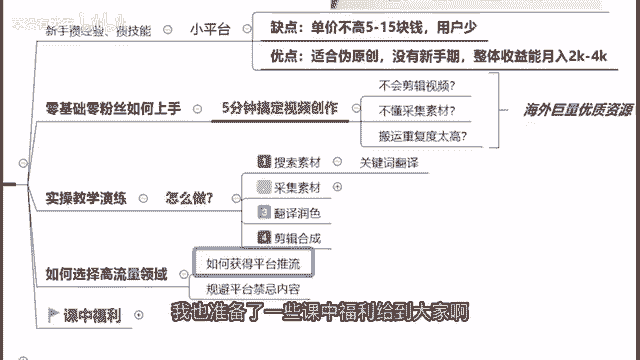

什么课中福利呢，来给大家先看一下，首先啊我刚刚也讲到啊。

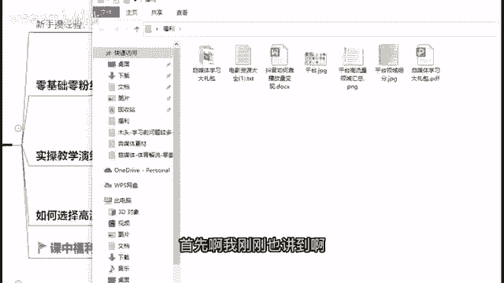

我们的一个平台领域啊是非常重要的，所以在这边我给大家做了一个平台，高流量领域的一个汇总表。

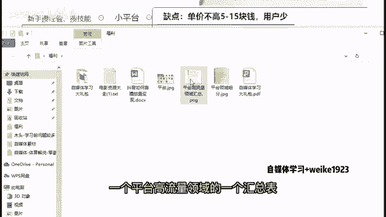

来，我们来可以看一下，你比如说啊我们现在去做会头条的话，现在会头条他有在推流的领域，是比如说娱乐搞笑奇闻野史时尚等等。

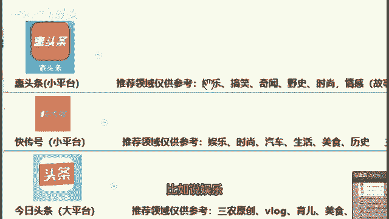

那么比如说你在会头条上面。

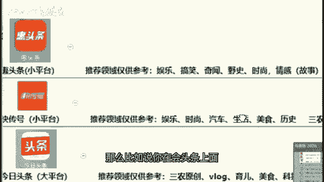

你就不要去做这些影视，不要去做汽车，不要去做这些历史。

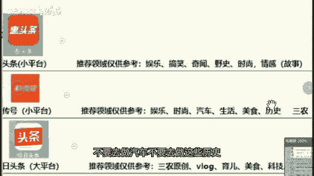

对吧啊，你在上面做的话，平台不会给你这些领域域，去做一个流量的一个推流。

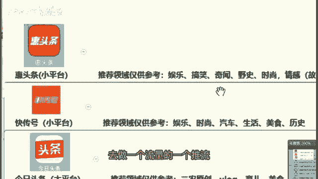

包括比如说你在今日头条上面去做，可以去做哪些方面呢。

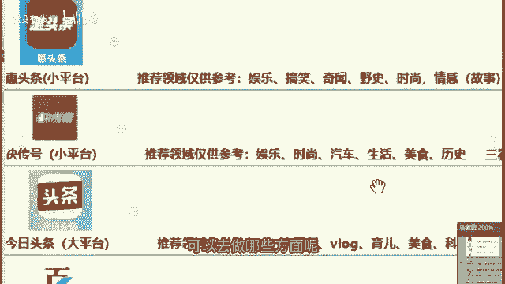

比如说三农的一个原创VLOG，或者是美食科技解说等等。

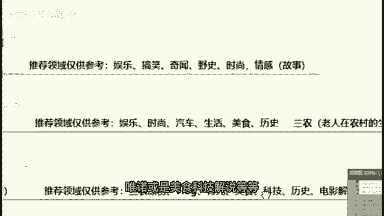

这些方面的一些内容都是比较好的，对吧啊，你做这些方面的话，那么平台就有可能给你们更多的流量啊，那么你们也才能够有更高的一个收益。

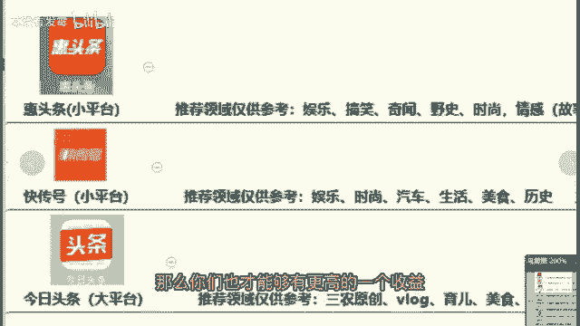

对不对，所以说选对领域也是很重要的一件事情，然后在这边我也给大家准备了一个，平台领域的一个细分表，来在这里给大家先看一下，你比如说很多人他现在有在做这个美食领域的，但是他选择美食领域之后。

他可能有这个啊探店也做，然后试吃也做，然后文化也做，这个配料盘点也做，这样的话其实是不好的，就是你做一个领域之后，你最好搞清楚里面的细分领域，然后你在细分领域里面，最多选择做两个就已经完全足够了。

如果说你做美食，你在里面的细分领域你又做了四五个的话，其实平台他会不知道你到底想做什么，他就没有办法给你精确的去推荐的呃，那些流量给你没有办法给你精准的配搭，配这个粉丝给你。

那么你的这个收益效果肯定是不会好的，因为其实你是要让平台知道你在做什么，你的这个目标人群是什么啊，才能够让平台给你推更加精确的流量，所以说这个是大家需要注意的一个事情内容，那么还有就是啊我在这边啊。

因为我知道很多同学是做影视为主的好。

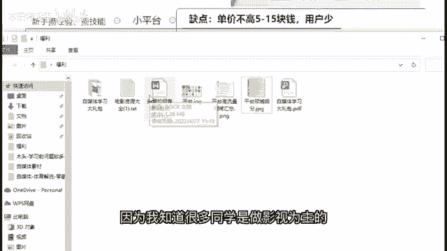

那么所以在这边的话，我也准备了一个电影资源大全给到大家，就是我知道很多人做影视，但是啊这个影视的话，很多人他不知道上哪去找素材，所以在这里我准备了50个电影资源大全，给到大家啊。

如果说大家做影视又不知道上哪找素材的话。

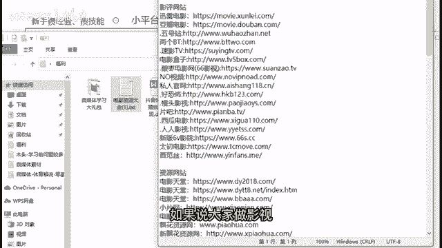