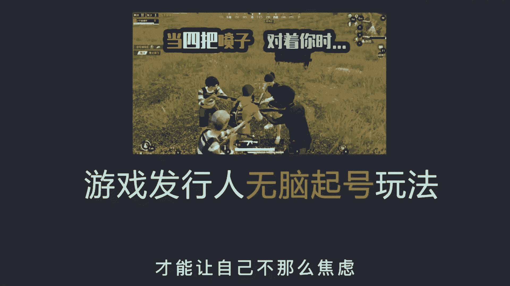
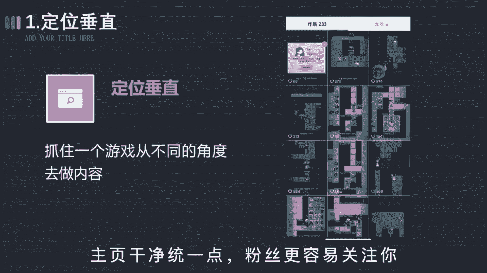
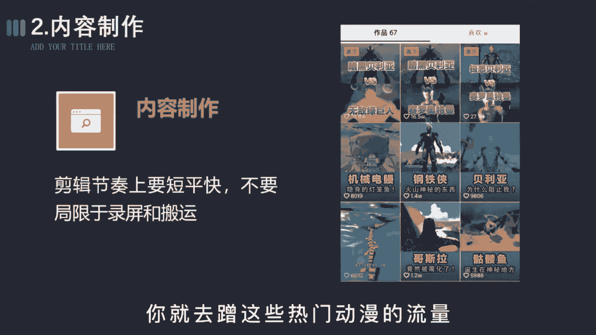
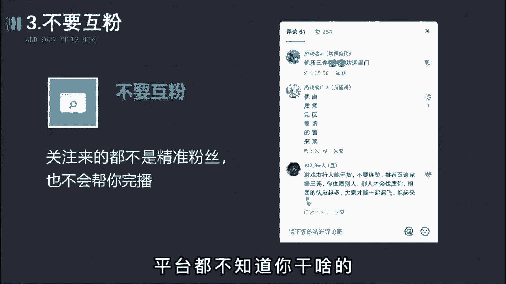
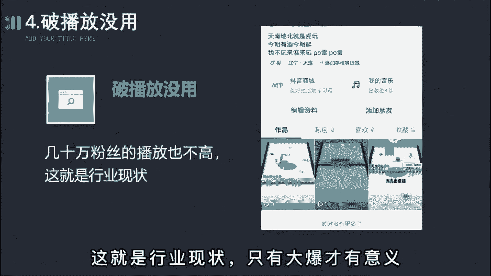
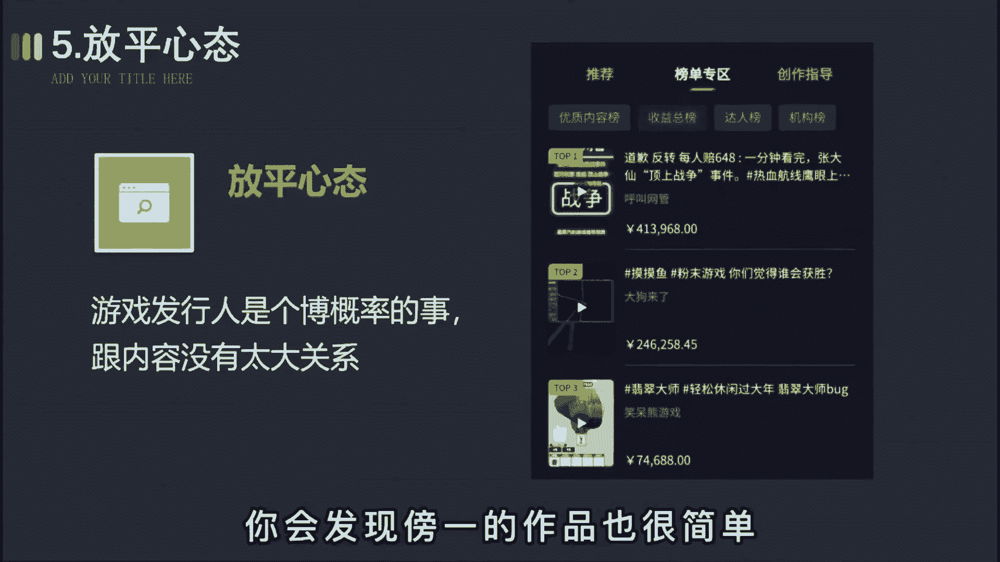
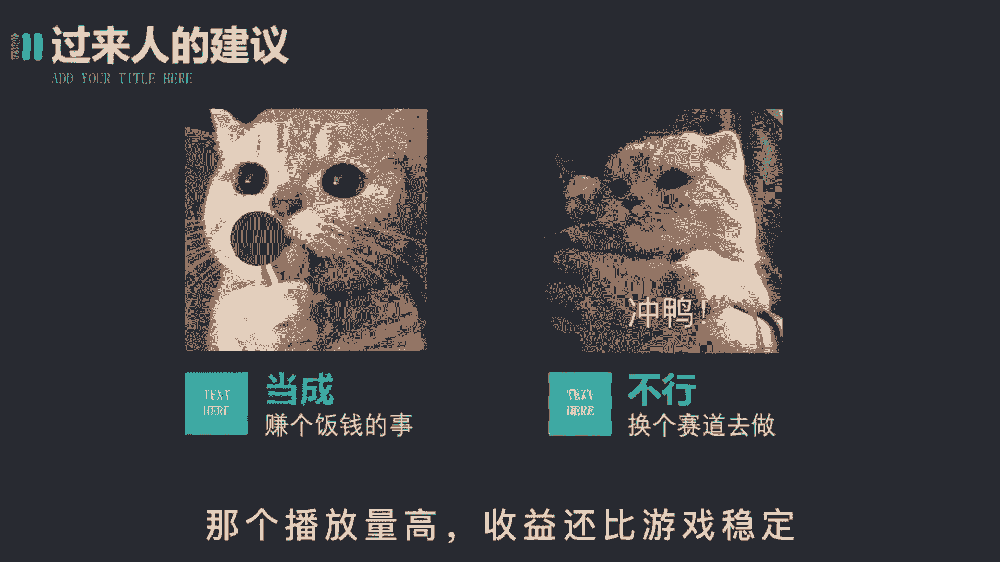

# 2024年做抖音怎么快速起号？3天养出一个高权重抖音账号，掌握这7点，抖音快速养号小技巧！ - P15：变现篇丨抖音游戏号怎么玩 - 鼓腹含和防护服 - BV1KYpueQE5k

游戏发行人要怎么起号，才能有稳定的副业收入，才能让自己不那么焦虑。

这期呢都是我的一些肺腑之言，都是一些行内人不会告诉你的秘密，希望做任务的你能够耐心看完，第一步，定位垂直，所谓垂直不是说你发了游戏就叫垂直，而是要以系列来发布，比如这六期就只做益智类或者闯关类。

就抓住一个游戏，从不同的角度去做内容测试，每一个类型的游戏播放数据，而不是随心情乱发，主页干净统一一点，粉丝啊更容易关注你。

第二步，内容制作剪辑节奏上要短平快，不要局限于录屏或搬运，适当的加入一些其他的素材，比如表情包之类的，尽量呀往小孩喜欢的事物上去靠，像奥特曼斗罗大陆之类的，都可以作为你内容的主角。

你就去蹭这些热门动漫的流量。

突破游戏的圈层，第三步，不要互粉，停掉所有互关互粉的行为，除了让你的粉丝数变得好看些，没有任何的意义，关注来的都不是精准粉丝，也不会帮你完播，乱七八糟的人，会让系统无法给你打标签。

平台都不知道你是干啥的。

那播放就更不容易增长，第四步，破播放没用，无论你是几千还是几万的播放，都没有什么太大的意义，最多啊几块十几块的收益，你但凡有耐心观察下，就会发现那些榜单的其他视频大多也没多少赞。

有几10万粉丝的播放也不高，这就是行业的现状，只有大爆才有意义。

第五步放平心态，这也是最重要的一点，不要觉得说只要发了视频就有播放，就有收益，任何行业起信号都不会有播放，这很正常，游戏发行人呢就是个博概率的事情，跟内容有时啊也没有太大关系。

你会发现榜一的作品也很简单。

你都能随时模仿，但他就是能火，而你就不行，所以啊奉劝所有做游戏发行人的玩家，你就把他当成能赚个午饭钱的差事就行，毕竟啊制作也简单，像我不到半小时就能出一个作品，也不耽误干其他事情，如果哪个视频爆了。

这就属于意外惊喜，没爆呢也无所谓，就跟洗脸刷牙一样，就是顺便的事，这样呢你就不会为了流量而焦虑了，但如果你实在是想要体会百万播放的快感，建议你换个赛道，比如做游戏解说或者沙雕动画。

去玩中视频计划那个呀播放高。

