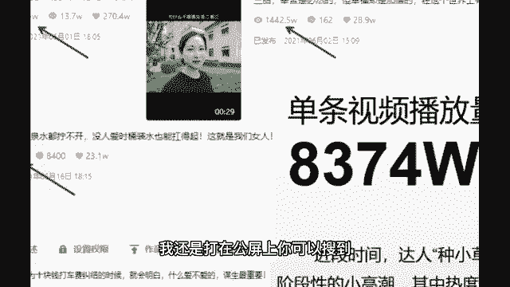

# 2024年做抖音怎么快速起号？3天养出一个高权重抖音账号，掌握这7点，抖音快速养号小技巧！ - P18：16、口播类视频拍摄方法-7 - 伊利鸡蛋仔 - BV1rApae6EBk

咱该讲拍摄环节了，不会拍的同学啊，自己啊精神精神，不要说看着看着睡觉了啊，拍摄注意这几点啊，构图比例，主题突出，事物清晰，光线色彩和内容连贯，这是文字干巴巴的，老师举例子给你讲，举两种，一种是口播类型。

因为口播你不管做什么，金融口播，装修口播，养生口播，情感口播，巴拉吧啦一堆口播，你拍摄方法都一样对吧，都是那样拍，然后日常生活你不管是拍段子，记录生活，拍搞笑的，拍日常做美食，你的拍摄方法全都一样。

所以老师我就举这两种，这两种几乎囊括了所有拍摄方法了，首先我们看第一个口播类型的，我举一个咱们学员的例子啊，我还是打在公屏上。

你可以搜到他的名字叫做种小草，做的什么呢，情感口播，人家是一个40岁带三个娃的宝妈，单条视频播放量破8000多万，一个视频涨了30万粉丝，那凭什么他一条视频就能涨30万，咱们涨个粉丝那么难呢。

是因为他都是吸引针对性的群体，一会儿你看他的视频，你就知道你一眼就能看出来他吸引的群体是谁，就比如说我吸引的群体是20多岁的学生党，我拍的所有的东西都是拍这些学生感兴趣的，那么我的涨粉会非常快。

而且非常针对性，先说一下这个构图啊，抖音它是一个九比16的竖屏，同学们啊，咱们每个人都是九比16，那么关键看里面你想拍横屏还是想拍竖屏，你看他拍的是横屏，四比三的一个横屏，强调一下啊，四比三的横屏。

你做视频你不管做哪个类型的，你不要说一会横屏，一会竖屏，东一下西一下的，你要横屏，你全拍横屏，你要竖屏，你全拍竖屏啊，咱稳定一点对吧，这都这些小细节你都注意一下，然后接着人物主体占中间占70%左右。

不要怼大脸去拍啊，怼一张大脸在那人家都看不下去了，一定要你看左边，右边上边要留白对吧，看起来这个画面哎很清晰，很舒适，如果说你觉得自己不是特别漂亮，特别帅气，能不能做口播，能不能拍抖音，可以抖音。

它不是说你非得特别好看，你才能火，你主要口播传达的是什么，传达的是内容，传达的是知识，你让别人看起来哎清晰体面就行了，觉得自己不好看的，去开个美颜滤镜，这个时代啊，美颜滤镜一开，咱就没有丑人啊。

你就放心大胆的开美颜就行了，别太夸张就行啊，那接着我先带你看一下，他这条涨粉30万的视频，我的小要求就是看完之后直接回答我这个视频，他想吸引的是哪个群体的眼球啊，直接告诉我啊。

跟婆婆在一起住是什么样的感受，我跟我婆婆在一起住了16年了，平时磕磕碰碰有点小不愉快，那都是正常的，买了衣服不敢光明正大拿回家，新衣服都是放几天再穿，也都不是事儿哈，我最大的感受就是这十多年以来。

我娘家人很少在我家住上几天，很少，这对于我内心来说其实是一个很大的缺失，唉你看我们班有同学说婆媳关系，那具体是哪个群体呢，啊这婆媳关系是一个关系，具体是哪个群体呢，对不对，你看他吸引的。

哎你看咱们班同学做媳妇的非常好，婆媳关系谁最有感触，其实男性群体吧，对婆媳关系她的感触绝对没有女性深刻，而且哪种能够感受婆媳关系，你说没结婚，十几岁，20几岁小姑娘，她能感受到吗，她感受不到。

她一定是结了婚的女性群体，她才能够真真切切地感受到婆媳关系，才能够和种小草产生共鸣，那么它吸引的一定是已婚群体啊，那我们一会儿看看具体是哪个群体，我们看数据，那先讲一下，你看他是不是开美颜了。

这路有点歪了，所以你们到时候觉得自己不是特别漂亮的啊，稍微开一下美颜，给自己整的稍微体面一点就行了，然后你看构图也是四比三，有的同学说老师口播，我不想在户外拍，我能在家拍吗，可以你在哪拍都行。

你背景整的好看一点就行啊，别背景太难看，然后接着就是老师。

我做口播是不是得背下来啊，虽然一条视频很短，但是我脑瓜子记忆力不太好，我背不下来怎么办，你背不下来，剪辑环节，我给你推荐一个好东西，咱们做口播不需要背边读边录，是不是更简单了，然后接着嗯，做口播。

其实最主要的是你声音得清晰，所以我给你们推荐一个好东西，很便宜，十几块钱自己去买，就是一个手机收声麦，你到时候自己从淘宝啊，京东啊，哪里去买一个就行了啊。

