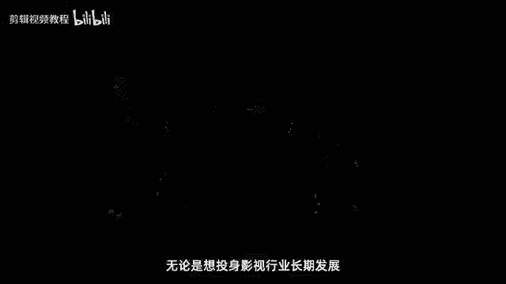
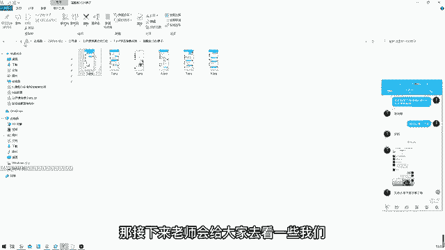

# 2024年做抖音怎么快速起号？3天养出一个高权重抖音账号，掌握这7点，抖音快速养号小技巧！ - P20：快速入门影视后期剪辑 - 汪了个汪a - BV1cUpReuEwy

在这里你将有机会接触到影视后期行业，关于剪辑调色，包装合成特效，三维动画，动态视觉等等各个专业领域，最前沿的知识与技能，无论是想投身影视行业长期发展。

或者兼职接单，拓展自己的能力边界，还是通过影视技能为自己的学习或工作助力，在接下来的时间里，请跟随我一起来了解一下影视行业的概况，那这节课我们主要讲哪些内容呢，首先我们会来讲一下整个行业的一些前景分析。

包括入行需要必备的哪些技能知识，如何去变现，如何来提升我们的能力，步步紧扣，然后帮助大家去全面的了解，影视后期这个行业好，我们来看一下第一个方向，主要是关于我们行业前景的分析。

我们会从行业的内幕发展方向，以及薪资待遇，这三个板块去给大家做详细的讲解，那我们首先来看一下关于行业内幕啊，究竟有哪些内幕呢，首先我们来看一下，那内幕的话，我无非就是这么六大点啊。

可能更多是一些科普性的知识内容，因为很多同学呢对这些呃知识，他的认知还是比较片面的，首先影视后期是什么对吧，影视后期的根基又是什么，哪个软件我们一定要学呢啊他这么牛逼，我们一定要学他对吧。

究竟哪一个入行要做哪些准备，包括如果是兼职接单，选哪一个才是更赚钱的，那如果我们要去找工作，企业对于后期人才的要求又会是怎样的，好在这个时候，大家可以打出你比较感兴趣的话题的序号，123456啊。

我看一下大家对哪一方面比较感兴趣一点啊，在公屏上打出来好，我们来看一下，首先什么是影视后期，这是我们要讲的第一条内幕，那影视后期就是影视，后期制作是指除了前期策划，中期拍摄以外，所有的制作过程。

那例如说像一些综艺节目，电影电视剧，甚至呢电视剧中间的广告，这些所谓的创作内容，它都是属于影视后期的范畴，那简单来理解呢，其实我们设计领域，它除了平面，那基本上它就是属于那种会动的。

动态类的一些影视后接的展示了啊，基本上可以分为这两大类，例如说像平面设计的话，它更多是基于静态类的一些设计，那影视后期它是基于动态类的一些设计跟展示，所以呢但凡我们在生活当中所遇到的一些。

动态类的一些效果展示对吧，那基本上都都跟影视后期有关系啊，你都可以把它纳入这个范畴里面，明白吗，好这个就是关于什么是引申后期，那以后假如说有朋友问你们哎影视后期啥呀，那这个时候你是不是就能够。

很坦然的去回答他的问题了，对吧好，我们来看一下第二条内幕，影视后期的根基是什么，那很多同学会问了，为什么不是AE，为什么不是C是D，为什么不是侯迪尼，为什么不是玛雅等等等等对吧。

为什么他就是PR剪辑思考软件相当的简单呀，很多同学在学中毒软件当中，就发现APR很容易上手，很简单，为什么它是根基呢，其实恰恰是最基础的，它才是最根本的一项技术，因为我们在学习pr的时候呢。

我们不是单纯只学习他的操作，他很多剪辑思维，剪辑技巧我们也得学，而且这个恰恰是有难度的地方，另外呢我们在学习pr的时候，也会学习到大量的理论知识，例如说我们会学习到剧本，镜头，语言构图啊。

编剧导演调色等等等等的一些知识对吧，像达芬奇专业调色，我们也会在pr的板块里面去学到，至少我们的课程会在里面学到，那可能其他的一些机构就不清楚了，明白吗，所以这个就是影视后期的根基。

简单理解就是对拍摄好的视频素材和图片，进行精加工，依照一定的逻辑顺序，把无意义的碎片连成有情节的故事，那这个就是剪辑的一个简单的意义好，那我希望大家一定不要小看片啊，因为我们如果没把这个东西学好。

你会发现你后面会了AE，会了C4D，你只是会技术，但是你没办法去提升你的美感，没办法去进行镜头间的转化对吧，他的一些剪辑思路，编辑的逻辑，这些你都不具备的情况下，那你只能去做出一些单个的。

零散的一些东西出来，没办法形成一个完整的片子啊，所以这一个大家一定要重视明白吗，好我们来看一下第三条内幕，哪个软件一定要学呢，那这里老师推荐的是特效合成软件AE after effects。

因为不管你是走哪个方向，你会发现总离不开的软件就是AE，拍摄剪辑方向我们会学习到pr AE达芬奇对吧，动态设计方向我们会学习到AE，C4D会涉及到少量的pr，然后电影后期方向AE是根基。

然后往上面去纵深去延伸的话呢，会有NK玛雅侯迪尼等等软件，所以你会发现一定离不开软件，就是AE，因为AE这种软件它的跨度非常大，它具备PS的这种图层画的一些功能，俗称会动的。

PS具备pr的一些简单的剪辑功能，有它的时间线的一些属性，具备C4D的三维的属性，它有一些E3D的三维插件，除了S跟Y轴之外，它还有一个Z轴对吧，所以你会发现他神通广大，无所不能。

但是他也不是说啥都能干，因为他最多最多就是来处理一些短的视频，长的视频在里面搞不了，如果有玩过这款软件，应该就知道好，我们来看一下第四条内幕，入行要做哪些准备呢，很多同学说我是不是有一台手机。

我就可以来做影视后期这个行业了，可以学习可以，但是你实践搞不了，那老师这边推荐的，首先硬件啊，那你有一台5000以上的电脑，基本上是OK了，但如果有条件买个8100万的也可以。

但是最少最少你也得5000以上，不要说我买一个两三千的，三四千的办公电脑，就来学很卡，体验不好，会把你劝退，明白吗，然后软件这一块的话，主要是AE pr c4DPSSI达芬奇啊，像AU的话可能也会用到。

那这里老师没有把它列入，因为基本上大部分的一些音频处理，pr也可以搞定，明白吗，然后这些软件插件素材等等，报名之后我们都会给大家去提供啊，所以这一块大家不用担心，然后我希望大家要做好第三点准备。

就是心态的准备，我们要怀抱空杯的心态来认真学习，并且一定要谦虚戒骄，很多人就是以为诶我这些软件都会了呀，不需要学的，恰恰他们只是会软件的操作，他们不会一些具体的案例，剪辑思维思路技巧等等。

那这些的话你根本就找不到工作，可能你可以找到工作，但是你找到的就是最低端的一份工作，两三千三四千，你很难找到6~8000的一个工作，但如果你选好了，找个五六千，六七千七八千，很容易明白吗。

还有第四点就是要做好学习的准备，不管你现在是自学还是报班，你是已经入行了，还是说没有入行，我觉得自律是最重要的，你一定要持续不断的去要求自己，然后在自律的背后有一个非常重要的点，就是专注。

很多人说我每天都在自律，我每天都在学习，为什么我的成长速度非常慢，为什么呢，因为你不够专注，你今天学一下平面设计，明天学一下UI设计，后天学一下室内设计，大后天学一下cg艺术。

大大后天你学习一下隐身后进，你学你能够学会哪一样，所以啊大家一定要专注，不要朝思暮想，看着锅里的，想着碗里的，那这样肯定是没办法把这个东西学好的，明白吗，好我们来看一下啊。

第五条内幕兼职接单写哪个才是更赚钱的呢，那老师这边给大家推荐的是，关于AE和C4D相结合的动态设计方向，因为这个方向你会发现它非常的值钱，基本上是按帧或者是按按秒来收费的。

至少按秒收费都有300~1000元每秒不等，那如果是一些二维的mg动画的话，基本上也可以达到200到500元每秒不等，但是可能有些同学说，哎我怎么去一些接单平台啊，接单它的价格没这么高呢。

因为他们会收取一定的分成，然后包括现在市场的竞争可能有所激烈，有时候可能mg动画呃，一些比较简单的100元每秒也可以做，然后一些三维的可能200元每秒也可以做，这个是你们要去评估。

当然这个是一个报价的参考，那如果你们后续去接单的话呢，可以按照老师这个价格去报，你可以往上去报，例如说1000每秒，500每秒这样去报，然后呢看一下客户的反应，在最终谈到一个相对比较适合的价格。

你能够接受，你觉得花这个时间去做这个东西能够划得来的，那你就去干呗，对不对啊，赚多赚少，这个取决于你谈单的一个能力，然后还有你自身能否去具备这种做单能力了啊，这个是最核心的关键。

好那如果是一些企业宣传片的话呢，少则一两万，多则几10万，你会发现非常好赚啊，非常好赚，所以这一块啊我希望大家要把它重视起来，要把它重视起来啊，OK好我们来看一下第六条内幕，那如果我们要去就业找工作了。

企业对于我们的要求是怎样的，后新人的要求究竟是如何呢，那其实经过朱老师这么多年来的一个调研，包括我也是陆陆续续做了很多的一些，就业的调查反馈啊，我发现现在越来越多的机构，会更加倾向于这种全能型人才。

全能型人是怎样的呢，就是精通AE pr c4D，也不是精通，就是熟练掌握啊a e pr c4D，然后精通其中的一到两个软件，那这里老师跟他提倡的是一专多厂，就你在这些软件当中啊。

你有一到两个是非常拿得出手的，然后其他软件你都会用，那这样的情况下你再去就业找工作，你会发现就没那么难了，明白吗，所以这个是我们要去掌握的一些东西，大家一定要对自己有所要求，不要说我只学个AE。

我只学个pr，我只学个CCD就够了，我就可以找到相应的工作了，那你后面你要接单赚钱呢，那你遇到一些一些C4D的，你不会怎么办，遇到一些偏R你不会怎么办，所以啊现阶段你就应该做好充足的准备。

而不是说到时候再来捉襟见肘，那就非常的被动了，明白吗，好我们来看一下第二部分啊，就是三个主要的发展方向哦，那这里的话呢主要是有拍摄剪辑类啊，占据了半壁江山啊，就业机会非常的多。

然后动态设计类占据了1/4，商业类影视后期的典型代表，然后也是很多人想要去就业转型的高薪方向，因为这个方向相对比较值钱，而且它没那么麻烦，不需要前期去拍摄，我只需要后期搞定就行了，还有这个电影后期类。

电影后期类相对来说它的门槛会高一点，技术要求也相对比较高，所以很多人在选择这个方向的时候呢，可能会有所迟疑，因为首先这个行业竞争是比较大的，而且他对于工作经验有一定的要求，所以大家如果想要进入这个行业。

可能优先选择前面这两个方向，后面这个方向的话，大家可以沉淀个一两年，两三年之后你再去学习相应的一些知识，那老师这边的话也是通过这一个对比表，给大家详细的去看一下，哎究竟它会涉及哪一些内容对吧。

那首先的话像拍摄剪辑类，它主要是涉及像旅拍，Vlog，剪辑师，调色师，自媒体短视频，像旅拍跟VLOG也是近年来，随着很多青年啊出去旅游啊，这种时尚的一些展现方式，慢慢涌现出来的一种职业哦。

然后还有VLOG对吧，记录视频的一种呈现方式，包括剪辑时调设施，这个就不用多讲了，然后还有自媒体短视频，这个主要是针对一些信息流的广告，例如说呃有人想要做个人IP，然后他拍好拍摄好好的素材。

你给他去简单去加个字幕，调个色，做个剪辑，这个非常简单对吧，然后这些方向的话主要是用的AE票和达芬奇啊，薪资待遇在5~10K市场份额50%好，下面我们来看一个影片。

让大家加深一下对这一块的一个了解和认知，好那下面我们来看一下动态设计类，那动态设计类主要是涉及哪一些东西的，像动画师，建模师，产品包装，广告包装栏目包装，这些通通都是属于动态设计类的方向，明白吗。

然后像这些方向的话，主要是基于纯后期的一些啊，设计会比较多一点，它主要是基于AE和C4D方面的设计，然后可能会少量用到pr方面的一些东西啊，那基本上他的薪资待遇呢相对会更高一点，8~15K啊。

8~15 k，然后它的市场份额相应也会比较少一点，目前的话是1/4的市场份额，那我们也是通过下面这个短片来进一步认识一。

下什么是动态设计类诶，Yeah，I will fight all along，And you can drive it along，Tierday on the train，What you say。

And i'm rown in your face，Htc，What you see well，It's me，I'll put you back in your pl，Yeah。

I'm done if it's gone，And i can do it，Someone so what you wanna do，I will fight all along cause。

I have done it memorn，And i can do it some more，I got an hourgi，Wanna cut through the door。

It's too late it's you，Or is it tick tick tick，Tick，Tick，Tick，Tick wu。

Say i will fight you were wrong，Yeah，Yeah，Going，Going is gone。

I saw you exerday and waiting too luntil，It give to your ha，And maybe you better to the。

Beat it up for dogs and dance，No second chance，That's right，Cause i have done it born。

And i can do it come on，I got my e on the floor，I'm gonna not，Untiful too late to do。

Or is the tick tick tick，Tick，Tick，Tick tick boo。

好那最后我们来看一下电影后期类，那电影后期类主要是有哪些方向呢，像特效师，合成师，导演对吧，然后呢除了AE pr c4D以外呢，可能还需要你去掌握，像玛雅NK侯迪尼UE等等软件，不是说所有你都要掌握。

就是不同的领域，你需要掌握不同的东西，明白吗，然后像薪资这一块啊，基本上跟动态设计类差不多，25%的一个市场份额，然后薪资是8~15K啊，这个是主要的三个发展方向。

同样的像电影后期类，我们也简单通过一个影片来认识一下。

OK好，下一面我们来讲一下关于薪资待遇这一块啊，那薪资待遇的话呢，目前在一二线城市，基本上普遍的薪资是可以达到8K以上的，那在三四线城市的话，基本上在7K以上是没有问题的，所以远远超过其他行业。

这个是它的一个平均薪资好，然后基本上你工作个半年或一年以后，随着你能力经验的增加，你的薪资涨幅也是非常快的，月入过万不会很难，我们结合一个具体的这种招聘需求，我们来看一下，像左边这边啊。

是高新成品影视后期制作动效设计师对吧，8000到1万，那他的具体要求是怎样的呢，熟练操作AE或pr或PSS等相关视频软件，或掌握C4D等三维软件，他说了这么多，或或或或或或或是不是很牛逼啊。

呃说了这么多货，其实他就是暗示你说，如果你都会，那我就要你了，那如果你只会其中一到两个软件，那我要考虑考虑，所以啊大家在找这方面的工作时候，一定要给自己提个醒了，是不是这么单纯，并不是哦。

好我们来看一下资深影视后期制作啊，1万5到2万究竟需要有哪方面的一些要求呢，熟练应用AE pr c4D喉顶理等软件，是不是多了一个喉顶理对吧，就多了一个电影后期类的一个软件。

然后呢熟练使用AE pr等相关后期软件，能在C4D和喉笛里进行特效的解算，那这个的话呢就需要你有一定的这种更高阶，软件能力的一些应用技术，那这些的话其实我比较推荐大家在啊学完AE pr，C4D以后啊。

沉淀个一两年，两三年，你再去学习更高难度的一些软件，这样比较科学一点，明白吗，好我们来看一下第二部分，关于我们入行必备的一些技能，六大软件认识以及三大软件分析，那这一部分老师会非常快速的给大家过一遍啊。

因为我发现这些软件应该大家都认识，首先这六个软件应该大家都认识吧，AE pr c4D达芬奇，PSAI对吧，好那啊，像C4D的话，主要是做一些三维的模型，动画这一块，那它具体可以用在哪些地方。

例如说栏目包装广告包装IP角色产品，广告动画制作，3D建模对象设计，概念设计等等，这些方向都是可以的，好我们来看一下第二个软件，AE特效合成软件，主要是用来做特效合成以及动画的。

那它可以具体用在影像合成，视觉效果，动画制作，网页动画，视频效果，3D合成，2D合成以及非线性编辑，呃这里说到非线性编辑的，我给大家提一下非线性编辑，就是说它不是一条线，编辑到尾它可以多条线同时进行。

例如说像A1或者是pr里面，它会有多个视频轨道，音频轨道对吧，就可以多条线进行同时的编辑，这是非线性编辑啊，好我们来看一下像pr这一块主要是用来做剪辑，调音配色加字幕等等，那它具体用在视频剪辑。

影片调色，视频压缩，字幕制作，音频制作，音频编辑，广告制作非线性编辑以及自媒体的简介，那这些都是属于pr的应用方向，好我们来看一下啊，达芬奇综合软件，主要是一款非常专业的电影调色软件啊。

专业调色一般会用它，那它具体可以用在视频剪辑，电影调色，后期合成，字幕制作，音频编辑和影像制作这六个方面好，我们来看一下倒数第二个软件，PS修图软件，顾名思义，它就是一款P图软件。

那它具体可以用在图像合成，数字绘画，平面设计，画图像调色，后期修饰，广告摄影，视觉创意以及界面设计这一块，那最后一口软件就是AI矢量绘图软件，主要是配合AE做一些mg动画的素材的。

这种原始的积累跟绘制啊，那它具体也可以用在字体设计，印刷出版矢量插画，海报设计，图像上色，诗集设计以及版式设计，还有页面设计，这个是六大软件的基本认识，好我们来看一下三个核心软件。

就是我们入行必修的三个软件啊，第一个软件呢就是cinema ford c4D啊，C4D是一款三维制图软件，他第一个优点呢，就是它的普及程度非常非常之高，它可以用在像电影后期，像影视后期，像工业设计。

像电商设计，平面设计，UI设计等等方向都会有它的身影存在，所以它的普及程度非常的高，他打败了他的元老级的人物，例如说玛雅3D max c牛等软件对吧，然后它的稳定性也非常强啊，非常稳定。

所以呢这个软件就比较受人喜欢，我们做后期最讨厌的就是崩崩崩对吧，然后就崩掉了啊，那很让人崩溃的一种情况，那他的情况呢就非常稳定，很少说啊，出现崩溃的一些情况，而且他第三个特点就是它的界面非常的直观。

我们学习起来呢非常容易上手操作，那像玛雅啊，3D max啊，侯迪尼等软件呢，它的界面就没那么直观，相对来说没有C4D那么直观啊，所以它的难度会更难一点好，然后最后一个特点就是。

它有一个非破坏性的制作流程，那你可以有从头再来的机会，做错了也不用担心啊，我还可以给你一次犯错的机会好，这个是C4D，我们来看一下第二个核心软件，AE特效合成软件，他是后期制作当中的瑞士军刀。

因为它涵盖了PS的图层的概念是会动的，PS也涵盖了pr的时间线概念对吧，是他的兄弟软件，还有这种三维的一些属性，它有这个XYZ轴啊，然后它也会有一些三维的插件，那第二个特点呢它会有两大应用方向。

一个是动画方向，主要是mg动画，Motion graphics，还有个合成方向，合成方向主要是一个实景跟虚拟元素的结合，那可能我们生活当中看到的一些五毛特效，或者是在好莱坞大片。

看到的一些非常牛逼的电影特效，可能都会有AE的身影好，那像他六大核心概念的话，也是我们在进阶班里面会主要学习到的，一些重点主要的知识，例如说合成的这个概念，它跟PS的序列的概念是不是一样的呀。

新建合成新建序列是一样的概念，只是不同的叫法，然后图层的概念对吧，它是由一个又一个透明的视频叠加而成，形成最终效果展示它是这样的一个效果展示，那PS它是一层又一层透明的图片。

那AE的话是一层又一层透明的饰品，所以这个就是两者的区别，一个是会动，一个不会动啊，然后它有一个动画的属性，可以有这个关键帧，可以做动画，还有这个各种各样的效果，有内置的一些效果插件。

也有外置的很多各种各样的一些强大的插件，也是我们学习的重点难点，然后它有它的一些三维属性，以及渲染输出的这一块的属性啊，OK这个就是关于我们AE这一块软件的认识，好我们再来看一下第三个核心软件。

pr剪辑调音配色软件，那这款软件的话呢，也是非常专业的剪辑调色软件了，而且它非常容易学，高效精准，也是最多人使用家庭背景最好的，为什么说人家家庭背景好呢，因为他有很多兄弟姐妹啊。

有AE有PS有AI有AU还有达芬奇等等软件，作为他的兄弟姐妹进行一个配合使用，团结起来就非常的强大，所以这个软件我觉得大家一定不要忽视它，它能够爆发出大大的能量啊，OK好那认识完了这三个软件。

我们来看一下第三部分，关于知识技能变现，首先我们会分成两个部分啊，像第一个部分是全能发展，第二个部分是坚持发展，想要全职发展，在公屏上给老师扣个一啊，然后如果是想要坚持发展，你扣个二，我看一下。

如果都想要，你就扣个一二哈，我看一下同学们呃，都是怎么打算的啊，好我们来看一下，像全职发展的话呢，目前基本上5K起步啊，入行的话5K起步，然后入行半年的话呢，轻轻松松是可以实现月入过万的，像剪辑师。

调色师，特效师，动画师，三维建模师以及动态设计师，那这些都是你可以去发展的一些方向，那等一下老师会结合一些具体的就业的一些，学员反馈给大家去展示一下这个行业，他究竟他的前景如何对吧。

这个是老师之前做过的一些相关的，这种就业的调查，所以呢可以非常真实的给大家去展示这个行业，如今的一些真实的情况，也可以给大家提供一些方向啊，好，那接下来朱老师给大家看一下，我们这边学员的一些就业的反馈。

那老师先随便点开一个，例如说彭鑫同学啊，这位同学的话呢是之前做事业单位工作的，然后后面的话他转型来做咱们的影视，后期我也觉得是非常励志的一个学员啊，咱们可以看一下，这个是前段时间老师做的一个就业调查啊。

毕业的学生，然后他们现在在哪个城市工作，岗位是什么，待遇如何，主要负责哪一块的，以及他们工作会涉及到哪些软件，包括他们未来会怎么去发展，提前给大家去做一些就业调查，让大家在以后的学习当中对吧。

就业当中会有更多的一些参考的地方，我们来看一下啊，是在湖南长沙那边就业，主要是做后期类的工作，然后目前薪资是8000左右，主要是看项目，你会也会有一些项目的一些提成，然后他主要是做mg动画这一块的。

涉及的是AE，AI和PS，主要是用到AE跟AI啊，因为他是做mg动画这一块，然后呢未来他是想要做自己的工作室嘛，然后我也是跟他简单聊了一下，我说呃你现在的话呢还可以啊，综合性质还是不错的。

然后平时可以接点外包，他目前接外包比较少，所以他总体的薪资可能就没那么高，也就8000左右呃，可能会加一些这种年终奖吧，年终奖可能一年下来12万23万应该是有的，像这样的一个公司。

然后未来的话呢他是想要去自己去开个工作室，我觉得挺有想法的啊，好我们再来看一下另外一个学员，例如说陈鑫同学吧，陈建同学，我觉得每一次我都会拿他出来给大家讲一下啊，呃像陈仙同学的话呢。

是学了四个月之后就找到工作了，然后呢他现在呢是做什么工作呢，主要是做动态设计类的工作，现在是15K啊，也就是1。5万的薪资，他说这不是一个结束，这是一个新的开始，在浙江绍兴那边就业了啊，也是朋友介绍的。

看了作品之后就被老板一眼看中了，所以真的是实力派啊，呃他主动态设计，而且会兼顾一些后期剪辑，海报设计这一块的，半设计半后期的岗位啊，复合型的综合性岗位，他也是学习比较努力的，所以他会的东西比较多。

就AE pr c4DPSARAU，达芬奇这些等等都会一些，但是他工作当中呢，不是说所有他都要精通知道吧，大家一定不要有这个误区，我要把所有的软件精通了，我才能够找到工作，不一定你只要有一到两把刷子。

然后其他的你也会对吧，那你会有更多的优势，因为有时候一些平面的呀，剪辑的呀对吧，你都会做，是不是你就会有更大的优势，例如说它主要是做动态设计类的，但是它的剪辑，平面海报等等，他都能做，这就是他的优势。

所以他能够拿到1。5万一个月的薪资，好这个是这位同学啊，那我们再来看一下啊，例如说像亚军同学对吧，呃亚军同学的话呢，也是我觉得非常优秀的一名同学，他是19年报名的，然后呢现在是在上海那边做产品，动画。

还有宣传片，然后他说了，技术一定要不断的提升才能站得住脚，所以我想要告诉各位同学，不是说我们在就业之前才要学习，而是你要终身学习，那你毕业之后你就业了，你工作了，你一样要不断的去提升自己。

学习更多的东西，才能让自己不断的成长，然后他现在一个月是1。5万到1。8万，这个是他呃单纯在项目加提成这块的一个收入，当然这个只是他全职的收入，他还会有一些外包的收入，等一下我会会给大家去看一下额。

其他同学我就不一一给大家看了啊，好那关于就业这个板块，老师就给大家介绍到这里，好，我们来看一下关于接单，兼职接单这一块，那兼职接单的话呢，目前影视后期可以说是最适合发展的副业了。

也是很多人会去兼职搞副业接单的一个方向，因为他的单价基本上在200到1000人每秒不等，而且他接单机会也比较多，那如果是咱们的VIP学员的话呢，我们也会给你去推荐一些接单就业的机会。

那当然你也可以去自己去找工作啊，或者是说去一些接单网去接单，例如说猪八戒网，一品归客网，豆瓣小组，淘宝闲鱼QQ群，或者说你人你身边有一些人脉，有一些同行，他们有一些单子做不了，那也可以给到你去做明白吗。

好然后包括像这些啊，给大家去看一下啊，像这些是之前老师对接的一些单子很多啊，就对接一个单子，我就拉一个群，然后让客户跟学员在群里面去交流沟通啊，所以这些就不一定给大家去看了啊。

然后可能有一些小单也给大家看一下吧，例如说像开宇同学，他也接了一些小单啊，当然这个单就不小啊，1万我之前给他推荐的是一个小单，然后他班主任给他推荐了一个1万的单子，那像这个是一个小单，500块钱的啊。

这个是他班主任对吧，然后这是他们交流的一个群啊，这个是我给他推荐的一个单子，他说老师搞定了，谢谢你对吧，然后下次来我们学院还要请我吃饭，因为他之前有来学院看过我，我对他印象蛮深刻的。

然后这些我觉得都挺好的，就跟学员玩得开啊，然后也能够成为朋友嘛，我觉得也是挺努力，挺优秀的一个同学啊，因为他就学了两三个月之后呢，就开始接单了啊，虽然说接的单子都不大啊，几百块钱，但是我觉得也挺不错的。

靠自己的能力能赚到钱，接了五个单子就赚了1500，每个单子平均300块钱，那学了几个月之后就可以开赚钱，我觉得很棒，虽然说我不能够赚太多的大单子对吧，但是我可以从一些小单子，然后一点一点去磨练自己。

也当做是一个项目实战经验的积累，然后在这个过程当中，也可以积累到自己的一些作品，到时候你去就业找工作，兼职接单都有优势啊，像这个单子也是我给他推荐的，所以他非常感谢我对，所以呢这个也是他的一个梦想吧。

所以其实很多人来学影视，后期也是一个圆梦的过程，那我们能够做到就是帮助你达成你的梦想好，那接下来老师会给大家去看一些。

我们学院的一些作品，大家可以欣赏一下。

这里是芜湖城市的发源地，有着芜湖人最为珍贵和自豪的回忆，浓缩着芜湖人的精神信仰，这就是芜湖古城，从春秋时遇西汉至县到宋祝新城明兴长街，这块土地上，郡盐贤达灿若星海，文化杂糅兼收并蓄，舟集往来，商贾云集。

诉说着它的辉煌和沧桑，见证历史风流，著于城市未来，芜湖古城开放包容的胸襟，激荡在城市上空，助推城市全面升级，协同发展至下镜湖区，以中心焦点的影响力荣繁华与理想一体，古异遗香，现代气息交融于此。

聚献一座宜商宜居，宜游宜业的文旅大城，为城市注入新的生机和活力，怀此初衷，芜湖古城在住宅产品规划上，还原原有街巷肌理与尺度，匠心营造独门独院，宽境大宅的低密墅区，重塑古城街象远递进的居住形态。

重拾城央居住荣耀，栖居古城的尊容，从归家开始，业主可以驱车直入，畅享直达专属车库的便捷感受，推开车门就是家门的温馨，也可步行归家，向街巷循序递进，治理，游走在灰墙黛瓦与石材立面所构筑的，西风晚韵中邂逅。

人在城中奏，似在画中游的别样风情，转角逢院，独门独院专属匾额，诉说居于此的无上尊荣，登门入院入墓是院墙违和的私密天地，太太的花园，孩子的乐园，全家人的向往都在这里，地上两层涵盖居住会客，餐厨等多重功能。

营造宽境大宅，阔绰餐厨空间，既可满足先生的牛排，也能烹煮父母的佳肴，享受家人围习的和乐，宽景厅堂可以是亲友会客厅，也可是祖孙小课堂，在清风与阳光的陪伴下，收藏日常点滴幸福，二层主卧套房，以旧寝区。

卫浴区，衣帽间，观景区，四大功能区，精准诠释生活私密与身份尊贵，地下生活精彩纷呈，多重休闲空间可随心设置私人酒窖，琴室，台球室，健身房等，家人之间互不干扰，社交互动，拥有更多可能。

在这里不仅拥享大宅庭院空间，更可入席城市塔尖圈层，谈笑有鸿儒，往来皆雅士，尽皆生活与事业的疆场，深知高净值人群对生活的精细严苛，安徽首家获得住宅写字楼双国优荣誉，的国家一级资质物业。

安徽置地旗下信连物业入驻芜湖城，提供匹配塔尖人士的生活礼遇，在社区清洁，安保关怀等方面进城全方位更立体的温馨服务，以细致入微的服务为业主提供尊贵居住体验。

诚央价值引领精英共识，大宅趋势聚合，他坚信赖芜湖古城，以中兴贵胄之地造极顶豪资产封面，珍惜传世，屹立高阶生活之味，好我们来看一下究竟如何来提升我们的能力呢，老师会分成四个部分给大家去讲解。

首先我们来看一下什么人才适合学习，以上后期自学真的可以成才吗，月入过万的后期人都是如何学习的，以及如果报班，我们选择线上还是线下，我们来综合来分析一下，OK好大家现在可以对号入座了啊。

如果是第一种情况的，热爱视觉设计，影视行业的扣个一，如果是第二种情况，思维开阔灵活，喜欢追逐新鲜事物的扣二，如果是希望通过高价值的工作实现自我提升，并获得可观回报的扣三，如果都是就123都抠出来。

把相应的需要抠出来，老师了解一下大家的情况好，那基本上如果你能够抠出来对吧，其中的一点你就适合，那如果越多那就越适合，明白吗，好我们来看一下关于自学究竟能不能成才，很多同学说自学很难呀。

有些同学自学好像也不难，为什么有两种这样不同的一些呃看法的，因为有很多同学说自学不难，就是他觉得把这个人学会了就行，但是他可能不注重说哎你学会之后的应用，只是单纯把这个软件这个工具学会了。

但是呢应用程度能力非常差，那难在哪里呢，难在是你学会这个软件如何去应用，如何去就业，如何去接单赚钱，那为什么难呢，因为其实我们自学的话，很难去找到一套非常系统的课程对吧，这是第一个难点，第二点。

第二个难点，你很难去评估，你是否真正把这个东西已经学会了，第三个难点，你做的任何的这个作业，他合格与否，你也不知道，第四个难点，你学习过程当中遇到很多各种各样的问题，有些是百度找不到答案的，不可否定。

百度可以解决一部分的问题，但是它解决不了全部的问题，而且百度出来的答案对吧，鱼龙混杂，啥答案都有，你相信哪一个呢，所以需要你有非常强大的检索能力，但是普通人很难做到，所以啊自学它是非常费时间的一种操作。

虽然说可以省下一点钱，但是你省下这些钱恰恰浪费了，你可以赚更多钱的更多的时间，所以这个是一种投资理念，我希望大家能够去评估一下啊，那其实像报班的话呢，相对来说那是比较费钱，但是可以省下很多时间。

但是省下这么多时间可以用来干嘛呢，可以赚更多的钱，例如说我们如果自学，我学了3年才学会，但是一个报班他学了半年就学会，那他剩下两年半是不是可以用来赚更多的钱，等了两年半就可以赚几10万。

但是这个自学他花了3年没赚一分钱，但是他这项技能还不一定能够学得会，所以这就是一个投资思维理念的差异了，好我们来看一下啊，基本上自学的话，学个基础，我觉得完全没有问题。

例如说做个简单的短视频剪辑一个小片子，看看教程跟着做问题不大，但是如果你是要作为职业发展，作为就业接单，自学是非常难的，而且它的成本非常高，特别是时间成本对吧，那如果我们把自学同等的时间放在其他方面。

例如说我把自学的时间，我花半年的时间，我放在报个班去学，那你后面的时间是不是可以利用起来，做更多的事情，赚更多的钱呢，这个是我们要去思考的好，我们来看一下月入过万的后期人，都是如何学习的。

我建议大家还是要去报班，学4~6微就可以精通一项技能，何乐而不为呢对吧，所以呢这边基本上月入过万的后期人，大多数都是通过报班去学的，少数可能会通过自学，大部分是通过报班，可能百分之呃。

99以上都是通过报班的1%，他是自学的，因为自学成功率非常低，那像报班的话，适合哪些人，例如说急需要提升自己技能的在校学生对吧，或者说一些流水线工人，或者是一些就业转型者，或者是一些工作遇到瓶颈的人群。

因为你们时间都非常的宝贵，所以你们还是要花4~6个月的时间，来精通一项技能，然后把剩下的时间用在赚更多钱上面，这个才是一个相对比较明智的选择，好我们来看一下最后一点，关于报班，我们选择线上还是线下呢。

这个也是很多人疑惑的地方，其实报班的话啊，我觉得线上线下都可以，就看你适合哪一种，相对来说，目前大的趋势，可能会更加偏向于这种线上的教育，但线下的话呢也是有一部分选择的，例如说像一些能力非常非常差。

智力率非常非常差的人，他只能去线下了，但大部分的同学稍微有点自制力的，我觉得线上学习反而是更好的一种选择，像线下的话，一般培训费用呢就非常的昂贵，现在可能大部分会在3万左右，一般是在2万。

2万到3万之间，如果是低于2万的，你要慎重了，可能他的培训内容是否足够专业，足够饱满，他是不是有这种割韭菜的一些嫌疑，你要去考察一下，一般2万到3万的话，那基本上学到的东西跟我们线上学呃。

几千块钱学到的东西差不多，然后学习周期可能要半年左右，那如果你是有工作的，并且你现在月薪5000，那半年的话，你就会耽误你赚3万块钱，并且这半年的时间你还要提供你的住宿费对吧。

吃住的一些费用一到2万还是要的，那基本上你半年下来，你就得花个五到6万去学这个东西，那这一块成本是相当的高的，所以啊这种方式只适合那种不上学，不工作，经济条件还不错啊。

不适合在校大学生或者已经有工作的人，明白吗，那第二种方式的话是在线教育，那在线教育的话相对来说费用就少很多，那其实像线上的话，基本上也是学习六个月，但是会提供两年免费复训，并且每个月都会有开班。

例如说我这个月没学会，我下个月是不是我要上进阶课了呢，不是你基础课没学会，你就接着上基础课，每个月都可以基础课学习，每个月基础课都会开班，那你都可以去参加学习，所以啊两年之内是免费复训。

而且学习时间也相当灵活，那有时候你晚上没空对吧，要约会，要加班，要聚会等等，那是不是我们可以看回放学习啊，所以他是可以根据学员自身的情况，去个性化的安排时间，是适合绝大多数人选择的一种啊。

应该说一种报班的方向啊，好那现在如果你觉得想要报线下的，你扣一想要报线上的扣二啊，老师看一下你们的选择是怎样的，现在可以打在公屏上啊，好我看到现在基本上啊，应该很多小伙伴会选择。

这种线上的一些教育方式啊，那这种方式的话呢，老师也会给大家推荐一套课程，就是我们的影视全能就业班，好在推荐这套课程之前的话呢，老师会给大家先去讲一下，关于设计师从小白到大师的必经之路。

我觉得这个方向的话呢也是非常重要的，大家如果把这一块掌握了以后，可以少走很多的弯路，也对未来自己的发展有更多的一些定位啊，好我们把它稍微缩小一点吧，好我们来看一下啊，首先这个是老师做了6年教育培训。

所总结出来的一些经验啊，给大家去分享一下，可能有很多人他是处于初级阶段，他只会基本软件操作，以为他自己会了，可能AE pr c4D他会啦，PSAI达芬奇他也会了对吧。

然后恰恰很多人他只是停留在素材搬运的阶段，会套模板，他就觉得自己会了，会基本的软件使用，他就觉得自己会了，殊不知你只是踏开了第一步，你只是处于初级阶段，是不是有很多同学今天看了。

明天万是的同学给老师在公屏上扣个一，我看一下，应该很多人是哎今天我学到明天就忘，为什么呢，因为你们今天只是看了，但没有去实操，所以他的记忆力没办法进一步的去刻画，人是有这个遗忘曲线的，艾宾浩斯遗忘曲线。

对不对啊，经过这个多少个小时后，他的记忆只剩下百分之几十，对不对，所以我们要去实践，不断的去巩固，学而时习之不亦乐乎，对不对，我们学习要不断的去预习它，养成这种习惯，然后更好的去操作它，去实战它。

才能更深刻地去记住它啊，这个应该是90%的同学都停留的阶段，就是初级阶段只会基本软件操作，按葫芦画瓢，然后做软件搬运，素材套用等等，好那个高级阶段的话呢，我们就会学到的一些理论。

结合实战相应用的一些东西，例如说我们做剪辑，做调色，做特效，做合成，做动画，那我们学会了相应的领域，我们就可以走相应的方案，例如说剪辑师，调色师，特效师和真实动画师，动态视觉测试师等等，都可以的。

好多大师阶段的话呢，基本上我们就进入了实战阶段，实战他会做一些更具有这种价值的一些方向，例如说宣传片非常值钱，一个片子几万几10万对吧，导演，那我们都知道，一部好的电影离不开一个好的导演对吧。

编剧那编剧也是非常重要的，在导演之下一个非常重要的一个角色，好的编剧才能够呈现一个非常精彩的片子，对话等等，然后像达芬奇的专业调色，有些人想要进一步去进攻调色领域的，那这个软件也不能错过。

包括多软件的一些商业项目实战，那这些的话也会在大师阶段慢慢的去给到你，那你是否已经具备这方面的一些能力了呢，萌新自问，很多人是不具备的，到优秀阶段的话呢，我们要进行一个思维的转变，从营销策划。

文案等等去进一步的武装自己，不要只是一个会操作的工具，我们要有一些可以搭配的一些东西，例如说你是一个非常牛逼的人，但是大家都不知道你很牛逼，那也没用，你没办法把你的这个技术进行变现。

那为什么现在有很多人想要去开工作室，开公司，他就是要结合更多的一些东西，进行的思维的转变，从而有进一步的发展啊，那如果你要去做个工作室，然后去谈单的话，你是不是要有一定的心理沟通，能力对吧。

然后如果你现在是一个企业的老人，那你对这个经济人文这一块，是不是有一个更大的一个把控，深入的一些认识对吧，那如果你是想要做一名专业的设计师，那你对于这个创意跟艺术的一些修养，那你是不是应该进一步去提升。

才能够达到一个更高的高度，形成自己的一些设计风格，那这些都是优秀阶段，我们要去做的一些思维的转变，取决于你要走哪些方向，那你才应该去转哪些方向，例如说像钟老师啊，慢慢也在往这个方向去发展了。

我会去做个人的IP，会通过营销策划对吧，通过网上去发布我的一些教程，我们老师的一些教程去推推广，我们这边的一些知名度，打造我们这边的一些个人IP对吧，那这些的话，包括我这边也会跟很多的客户去进行谈单。

那心理沟通这一块，也是老师所要去不断的去提升的，所以我也希望大家能够按照这样的一条道路，不断的去要求地，自己去提升自己，从基础高级大师优秀，不断的去突破，我相信你们是可以的好，那下面的话呢。

老师来给大家介绍一下我们的VIP课程，那像咱们的VIP课程啊，我给大家推荐的是影视全能就业班，那这套课程的话呢主要涵盖哪些东西呢，像学习模式，学习周期，上课时间十大优势以及课程详细的介绍。

我们来看一下学习模式这一块，我们主要是以直播加回放，加解答加在线的一个作业点评，那这些的话我觉得非常有必要像直播课对吧，直播课就是可以跟同学们进行一个直播互动，然后有问题当场也可以给大家解决。

那如果你错过了直播课，没关系，咱们课后有回放，每一节直播课都有回放，不用担心错过任何一节课，并且呢还会给大家提供一个在线的解答服务，解答服务包括课中的一个交流解答，包括我们助教老师一对一的解答。

你报名之后可以微信端加到我们的助教老师，他会给你解决专业性的问题，有A1有pr，有C4D3位助教可以加上三位老师，而且你做的每一份作业，我们都会给你进行作业点评，那你就能够知道我这个作业究竟做的怎样。

我这个知识点究竟掌握了没有，我有哪里还需要优化改进的地方，我们老师会给你提供一些指导性的建议，这个是主要的学习模式，然后学习周期的话，一般来说呢六个月左右，就是半年可以学完全部的课程。

那假如说你半年还没学完，怎么办呢，很多同学会问了啊，没关系，两年之内提供免费复训，学到你会为止，那我觉得这块应该是，可以给大家打下一个定心丸了啊，因为其实你只要认真学，怎么磨，两年之内你都可以磨得出来。

而且我们的课程两年之内不断更新，基础班月月开班，高级班两到三个月开一次，所以啊开班频率是非常之频繁的啊，所以学习的机会非常多，只要你用心，只要你足够勤奋，那上课时间的话，基本上我们分为135246。

像例如说一三我们上pr246就上AE，大家可以错开时间去学习，那如果错过时间也有一天可以缓缓缓一缓啊，那如果时间实在少，一周上三节课也可以，然后我们会分成两个时间段上课，例如说07：30到08：

30是上基础课，8。40到9。40上高级课啊，所以这个是上课时间这一块的安排，周日的话是休息的，会给大家休息一天，然后十大课的优势啊，给大家看一下，首先我们会有四大终端同步学习。

那这一块我觉得是非常给力的啊，四大终端同步学习，手机平板电脑电视都支持，因为我们这边从08年就开始做了，所以这些都是独立研发的，一些呃学习的渠道平台，然后每个月都会开直播课程，实时学习新知识。

这样的话零基础的小白就不用担心错过课程，或者是说呃学不会了，因为每个月我们都会开新班，而且会有一个分阶段教学的过程，循序渐进式的学习啊，小白依旧不用担心了，我们这边会从零基础入门开始教。

真的是从非常小白小白的一个操作开始教你了，你只要你会认字，你能听得到，你能看得到，那你就可以学得懂啊，然后呢学完基础就学进阶，学完进阶学高级，学完高级学商业综合实战，逐个阶段去拔升你的能力啊。

OK第四点的话会有一个作业式通关，学习趣味十足，那这一点我觉得也非常重要，为什么呢，因为你把这一块学会了对吧，那你就能够积累到自己的一些作品集了，能到时候去就业接单找工作了。

你就能够亮出来你自己的一些个人代表作了嘛，对不对，会提供清晰的学习规划，方向会更加明确，那你报名之后的话呢，我们的助教务老师啊，我们的教务老师会给你提供一对一的学习规划，告诉你这个课程如何学。

你这个情况应该学哪些东西等等，这样你就不会再迷茫了啊，然后第六点的话呢，会给大家提供这种分组式的学习小组对抗赛，你追我赶，学习氛围非常好，我们这边不是说一个人学习啊，就是说会给你分成一个小组织的。

这样的话你可以找到组织，到时候你们也可以建个群，相互加个好友，那其实单身的小伙伴对吧，还有机会可以脱单啊，我觉得这个感觉还是非常不错的啊，然后会有一个多对一的解答服务啊，三个助教老师。

一位教一位班主任去辅导你学习，助教解决咱专业问题，教务解决日常的问题，包括什么上课通知啊等等，然后班主任呢会给你提供心灵上，生活上的一些辅导，跟啊这个引导啊，OK好，第八点的话就是一个作业集的指导了。

例如说我们这边会给学员去在毕业作品这一块，会不断的去指导你做出好作品啊，帮助你成功去就业啊，会有一个就业指导，会有一个接单推荐，那我们这边是有13年的教育实力沉淀了，所以是非常安全可靠。

所以大家可以安心在这边学习，另外的话两年之内免费复训，学会为止啊，两年之内学会为止啊，会有两年的一个时间给到你去学，所以毕业基本上是不用担心什么的，毕业无忧好，那详细课程介绍的话呢。

老师这边给大家看一下啊，像我们主要教哪些软件呢，像AE pr c4DPSAI达芬奇，这些都是我们要学习的，主学AE pr c4D辅学psi达芬奇，那主要会分为设四个阶段啊，第一个阶段学习基础。

第三阶段学习高级，第四个阶段学习商业综合实战，我们会针对向拍摄剪辑类，会有一个剪辑调色大师班，动态设计类，会有一个动态视觉特训班给大家去做讲解。

明白吗，好，下面我们来看一下，关于我们全能就业班的一个详细的介绍啊，详细的介绍它究竟是长啥样子的呢，那像全能就业班的话呢，我们可以看到啊，它主要是视觉设计与技术能力全方位平衡培养，打造行业优质的设计师。

那我们学习的是时下最强的软件组合，C4D3维制作，AE特效合成，pr剪辑，达芬奇调色，PS修图AI素材对吧，然后像第一个阶段，主要是带大家去认识一下最基本的一些软件。

像AIPS是给大家去赠送的两个选修课程啊，主要也是教大家一些基本的像字体，图形设计元素啊，P图的一些理论知识，基础的一些操作学习，然后像pr这块呢我们就会学的比较详细了，会从它最基本的行业认知。

以及他最基本的工作流程去一一的讲解，并且在最后面会让大家去做一个小小的作业，作为你在第一个阶段的毕业作品，然后AE的话也是一样的，从他的一个行业发展，到他最基本的工作面板的认识，工作流程的认识。

一步一步的去教给大家，同样也是会通过一个小案例，让大家去真正的把这一块给掌握下来，然后像C4D的话也是一样的，从行业认知对吧，然后再到整个软件最基本的一些工作流程，操作会给大家去讲。

在最后也会让大家去做一个作业出来啊，那第一个阶段基本上我们花个半个月，就可以把它全部学完啊，所以是非常快速的啊，好那第二个阶段的话呢，主要是一个快速进阶的阶段，让我们打完基础就可以快速去进步去学习了。

像快速的一个进阶课程，pr的进阶课程，我们会学习到剪辑软件的基础以及剪辑流程，项目啊，项目流程这一块啊，例如说像剪辑的方案史啊，项目素材的管理啊等等，包括音频剪辑，调色板块啊。

界面布局啊这一些快速的去认知pr这个软件，然后像A1这个软件的话呢，则会学习到它合成基础到项目流程所有的知识，例如说像合成的动画的表达式的，脚本的跟踪的抠像的内置插件的使用，风格化效果的制作都会讲到。

然后像C4D的快速进阶课程呢，也是会学习到它从基础到案例的等等的，一些展示，例如说建模材质，灯光动画，然后再结合他的OC渲染器，它的一些广告综合的案例，去给大家去做展示学习。

那基本上大家学完这个第二个阶段，过去两到三个月，我们是可以找一些简单的几百块钱的单子，先去练练手了，好到第三阶段的话呢，我们就会进入高级课的学习了，高级课的学习啊，主要就是学习一些剪辑思路。

还有一些调色跟高级的塌陷，就不仅仅只是停留在最基本的一些软件操作了，那这样的话可能你学再多软件操作也没用，那我们像pr的高级班啊，我们会学到他pr的一些转场，多机位剪辑音频编辑，短视频制作。

VR360摄影摄像等等，还有各种各样的一些插件，包括一些调色案例等等啊，这些都会在pi的高级班里面学到，然后像C4D的高级实战课程呢，则会通过一些高级的特效以及三维的案例，商业案例来进行进一步的讲解。

例如说像一些抽象艺术化的案例啊，或是像布料毛发破碎粒子，海洋插件，流体插件，像火焰烟雾等等的一些案例啊，我们都会讲到，好的，我们接下来看一下，像A1特效合成高级实战课程，那这个课程的话呢。

我们主要学习到他AE的一些高级插件，还有商业项目流程的学习，像高级粒子效果的制作对吧，例如说form粒子PREX滤纸E3D，还有这种牛顿动力学的一些插件，包括NG动画啊，实景合成微电影。

包括一些综艺的片头，AE跟C4D的交互，这些我们通通都会学到，那我们可以看到，基本上市面上99%的机构，都只学习到第三阶段，那我们这个机构的话会给大家去赠送，第四阶段就是一个能力拔尖的阶段啊。

那这个阶段的话叫做对吧，pr大师课程以动态视觉特训班，就是拍摄剪辑类跟动态视觉类的。

进一步的深化啊，然后像这个剪辑调色大师课程的话，主要会学习达芬奇以及商业剪辑案例，例如说像TVC宣传片，广大剧情音乐MV，婚庆广告实战调色实战案例等等，所以这些课程就非常接地气啊，就学完之后。

你后面的话直接可以去套用去借鉴的啊，然后包括编剧课，导演课，拍摄片，蒙太奇，达芬奇这些通通会在大师班里面去教到你，那你学完之后的话，你就是集万千功力于一身了啊，这些都是非常牛逼的一些技术。

然后像动态视觉特训班的话呢，会学习到哪些东西呢，像视觉创意类的对吧，还有这种个人项目的，还有一些项目流程的商业项目解析与训练的，我们都会去讲，例如说像红移渲染器，高级透明质感的一个表现。

做一些场景的模型，例如说OC渲染器对吧，做这种创意锦鲤的高级渲染，还有这个动态设计类的，logo设计与场景模型的搭建，还有这种小清新风格的场景制作，以及高级特效的制作，这种是电商风格类的。

以及这种概念设计对吧，还有这种炫酷风格的抽象艺术的，未来风的高级技法的好，接着我们来看一下报班都有哪些福利呢，啊报班都有哪些福利呢，像我们这边报班的话，会给大家去赠送往期20多期的回放课程。

几千节课价值上万，就你报名之后啊，我们往期所有的课程你都可以学，然后包括你报名之后，两年之内更新的所有的课程你也可以学，那往期的话20多期的回放课程有几千节课，等着你来学啊。

然后呢会给你赠送一个影视后期的资源库，里面会涵盖各种各样你所需要的学习的，各种各样的一些资料跟素材，明白吗，包括会给你赠送九门选修课程，那这九门选修课的话呢，我觉得非常棒啊，像动态视觉特训班对吧。

刚刚我们讲过的价值3980，还有就业产品服务，你后面要去就业找工作了，接单了，我们会给你提供一些就业产品服务的小招，培训啊，这样的话你就能够知道诶，我这个究竟要如何去就业，如何去面试，如何去谈单等等。

包括有一门设计美学综合班，提升你的设计美感，让你做出来的设计不再廉价，不再low哈，还有一个达芬奇的特训班啊，这个是在pr高级班以外单独出来的，一门达芬奇特训班啊，包括mg动画特训班。

非常好玩的一种光影动画啊，AI跟PS的一些基础入门班，包括网红必备剪辑特效技能特训班，那这个课程的话呢主要是有60多个特效案例，你去做抖音，做up主都用得上，还有大神教你成为手机摄影高手。

随时随地都可以拍出好的照片啊，那这些的话对吧，你认真学，学完之后肯定是可以拍出好的一些照片的，那对于你后面去做一些前期的拍摄，也有一定的帮助好，那学费这一块多少钱呢，我们这边的话呢。

首先我们支持多种方式支付啊，像微信支付宝银行卡这些都可以，然后我们也可以支持花呗，如果三期是免利息的，最多可以分12期，然后白条或信用卡也是可以分12期，那如果都没有的情况下怎么办呢。

也可以申请咱们的助学分期嘛，助学分期呢是支持零首付免息，分期分3~6个月，怎么理解呢，就是说假如说你今天报名了，你今天不用马上交学费，学费从下个月的今天开始，还分3~6个月去还清就行了。

所以是零零学费入学，我觉得非常爽啊，好那学费这一块的话呢，原价是9599，那今天如果你听到这里，有听到这里的小伙伴对不对，那老师会给你一个非常优惠的价格，立减3000元，只需要6599。

但是呢仅限前三名，好的，现在如果想要报名学习的小伙伴对吧，现在可以扫这个二维码，然后呢备注报名就可以了，然后就可以抢购这个名额了啊，好那我们今天的分享呢就到这儿。

