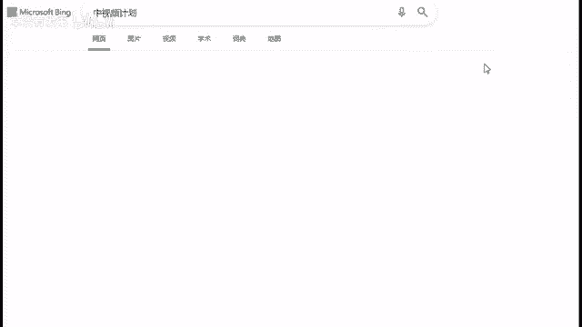
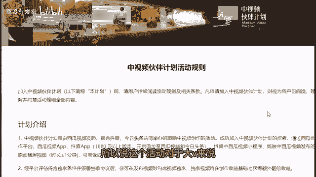
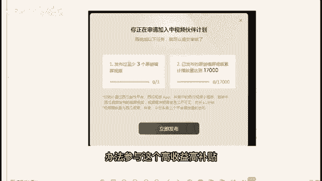
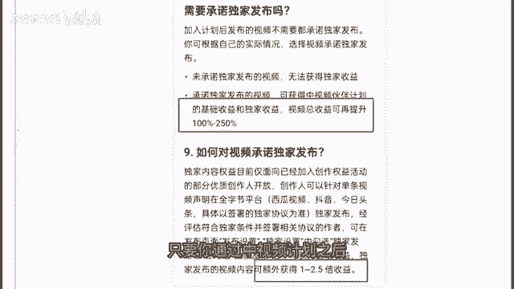
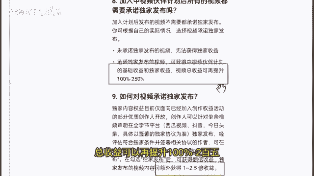
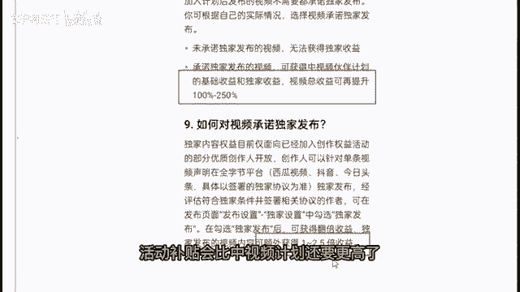
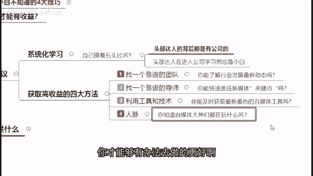

# 2024年做抖音怎么快速起号？3天养出一个高权重抖音账号，掌握这7点，抖音快速养号小技巧！ - P22：15提高收益的四大方法 - 草没有发霉 - BV1C1tWeqEo7

好，那么在这里的话来，我来跟大家也说一下，对同学们的一些最后的一些建议吧，来跟大家做一个最后的一个，对同学们的一些建议，首先第一个我是建议大家，如果你想要把自己的一个自媒体去做好的话啊。

又或者说你希望能够让你自己的自媒体，能够有一个比较好的一个收益的话，我建议大家可以去做一个系统化的一个学习，因为如果说你是自学的一个状态的话，你一定是属于一个自己，那么其实我知道啊。

很多人啊以前在上学的时候都会经历到啊，这个补习班兴趣班对不对，但是如果说大家以前学的时候都能够知道，你要上重点高中，那么我就去外面报补习班，报辅导班，报兴趣班，我才能够上重点高中的话。

那么现在如果说你想要你自己的自媒体，做出一个很好的收益，那么我也是建议啊，你要做一个系统化的一个学习啊，你自己想想嘛，你要上重点高中，你都知道要报补习班了，那你想你自己自媒体获得一个好的收益。

要要报班学习，那不是一个很正常的一个事情吗，对不对啊，这个是实打实的一个事情啊，我也不多跟大家说啊，如果说你想要自己做自学的话，当然没有任何的问题，当然完全可以自学，只是说你靠着自己自学。

想把自己的账号做得很好的话，你自己想想这个存在的可能性到底有多高，就像是你光在学校学习，你不报任何的补习班，不报任何的兴趣班，那么你就想要考上重点高中，这个概率到底有多大，你自己可以想一想。

您您如果只是说唉我只要上一个普通高中，普通大学我就满足的，OK没有任何问题，自学完全足够啊，这里的话我也跟大家说一下，其实基本上头部达人的背后啊，都是有公司的头部达人，他在进入公司学习之前。

他也是一个小白啊，举个最简单的例子，抖音的浪味仙，他在有公司帮他去运营的时候，他的这个粉丝数量也才是几十几百，它的这个播放点赞量也才不过是个位数，但是当他有公司运营了之后对吧。

你可以看到有游戏帮他去运营，帮他去做账号之后，他是不是迅速在一年时间内，就做到了3000万粉丝，这个啊就是背后有团队帮助他的一个好的结果，对吧好，那么在这里我也跟大家讲一下，获取高收益的四大方法。

好这边的话，首先第一个我建议大家，如果说你是想获取高收益的话，你可以去找一个靠谱的团队啊，因为有靠谱的团队的话，你才能够时刻去了解发展，行业发展的一个最新动态，你比如说最啊。

现在大家知道这个中视频计划吗，我看看有多少同学知道这个中视频计划了解，并且知道中视频计划的，你打个一在公屏上，如果说完全不清楚中视频计划的，你打个零在公屏上给我看一下，不了解中视频计划的。

你打个零在公屏上给我看一下，了解中视频的，你打个一不了解的打个零，听过哦，听过的同学也比较多啊，但是零的同学也比较多，就是完全不知道，不了解的同学差不多也是占了一半对吧，哦好的，我看到了好。

那么在这边的话呢，我先跟啊，不了解不清楚的同学们，来讲解一下这个中视频计划，首先中视频计划它是由字节跳动推出的啊，这个现在应该说是自媒体里面，最补贴最高的一个活动了，现在自媒体里面应该没有比中视频计划。

收益更高的一个活动了，打一下中视频计划。

好我们直接来看一下，这个是由字节跳动推出的啊，以前我们应该都知道，其实在以前抖音它是你，你只有播放量，它是没有办法赚钱的，但是只要你参与这个中视频计划，你在抖音上面的播放量，就已经完全可以算钱了啊。

这是很恐怖的一件事情，对于抖音的头部大V网红来说，简直就是送钱，因为他们的播放量瞬间都是几百万的播放量，他们在抖音上面，所以说这个活动对于大V来说真的是送钱。

那么再来一个啊，我们的一个中视频计划啊，这个是活动规则有很多，那么在这里呢，我简明扼要的先跟大家说一下规则，首先第一点，你要参与中视频计划的话，你要发布过至少三个原创横屏视频。

三个再来你的这个原创横屏视频，需要累计播放量达到1万7，你就要累计播放量达到1万7之后，才能够参与这个中视频计划，达不到的话啊，那么对不起啊，你就没有办法参与这个高收益高补贴。

但是只要你通过了之后对吧，只要你通过中视频计划之后。

你只要承诺独家发布你的视频，总收益可以再提升100%到250。

也就是说除了原来你自己的收益以外，你可以额外获得一到2。5倍的收益，这个是非常吓人的，可以说现在没有任何一个自媒体的一个平台，活动补贴会比中视频计划还要更高了。

那么啊再来跟大家讲讲中视频计划里面，如果说你不了解不清楚的话，你会知道中视频现在做哪个方向，做哪个领域最容易过中视频吗，你又会知道做哪个方向，做哪个领域，才能够在中视频里面得到一个好的收益吗。

你要知道做哪些方面，才能够得到中视频的一个高额补贴吗，对吧啊，因为如果说你做中视频，它一到2。5倍的一个收益，你知道该怎么样去做，才能够获取到啊2。5倍的收益，而不是只获取一倍的收益吗对吧。

这些都是需要一个有一个团队在背后，时刻的帮你，去关注所有这些行业发展的这些动态，去关注整个中视频的风口到底汇聚在哪里，又或者下一个风口到底汇聚在哪里对吧，那么第二个，我建议大家去找一个靠谱的一个导师。

因为没有靠谱的导师的话，大家其实是你靠自己做，你很难快速地抓住新媒体的一个关键点，包括很多人你不去听啊，咱们这一些公开课的话，其实很难，你也很难去了解每一个视频，它的点到底在哪里。

为什么人家那个视频就能够做到百万赞，为什么人家那个视频就能够做到百万播放量，你能够快速的清楚抓到，人家为什么能够做得这么好吗，这些就是关键点，人家是封面做得好呢，还是标题做得好呢。

还是前十秒的内容做得好呢，还是因为它中间的整体内容，到底做了一些怎样的处理呢，好如果说没有一个导师，你自己纯看的话，你可能啊你自己了解吗，对吧啊，这个就是一个重点，就好比啊现在啊我跟你拿出一本啊。

5年高考3年模拟来，你去做做这些题，我告诉你高考就会做这些题，但是你又知道这些考点全部都在哪吗，你可能自己不太清楚，对不对，这个就是一个关键点所在了，那么再来一个啊，学会利用工具和技术啊。

这个当然就哦刚刚我做这个原创的图文，包括做搬运视频的时候，我也用了很多不同的一个工具软件和技术，那么用好了这些工具软件和技术，就能够让我做到事半功倍的一个效果，再来一个就是人脉啊，其实对我来说。

我做自媒体已经45年的一个时间了，我已经有了属于我自己的一个自媒体圈子了，那么我是可以快速了解，知道现在自媒体的圈子里面在流行什么，在玩什么，在做什么的啊，就好比我另外也有在做餐饮，那么我也会跟啊。

广州各大餐饮界的老板经常去吃饭，因为我需要跟他们了解，现在餐饮界的一个走向动向，又或者说现在的一个顾客，消费者更加喜欢什么，我都需要去了解，那么我就需要进入这样的一个圈子，不能说我做自媒体。

我有自媒体圈子，但是我现在又做餐饮，我没有餐饮的圈子的话，我怎么样去做，对不对，好这个就是人脉的一个重要性，你得进入这个圈子，你才能够有办法去做得更好啊。

对吧好。