# 2024年做抖音怎么快速起号？3天养出一个高权重抖音账号，掌握这7点，抖音快速养号小技巧！ - P25：13、视频类型案例分析-4 - 漫步花再乡 - BV1FyeweHEXt

接着往后看啊，晒过程诶，万物皆可晒过程，我不管你做的是哪个领域，不论是什么健身游泳服装美食生活类型，什么钓鱼啊等等啊，我就不一一列举了，都能来晒过程，比如说晒制作过程，工作过程，卖货过程。

来我给你们举一个万物皆可晒过程的例子啊，刚才有个同学不是说自己是做健身类型的吗，来我给你们看一下我之前带过的一个学员。

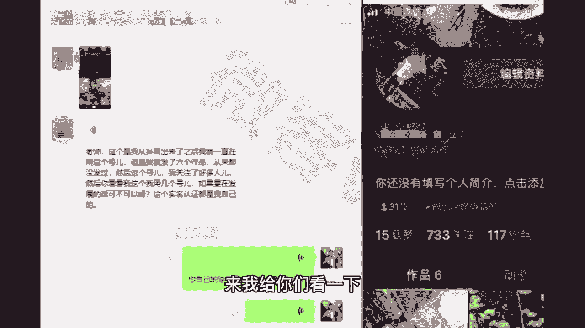

他就和你们很像啊，就之前那个朋友圈看他发的啊，拍拍自己去哪玩了啊，拍拍自己的这个啊帅气的照片，拍拍自己出去玩的风景，看一下他的播放量啊，一百一百零一两百七十九就权重很低。

然后接着啊我们啊一对一的沟通之后，就围绕健身减肥，现在是全民健身的时代，就晒过程，晒什么过程，晒健身的过程，同时晒过程的同时教给别人一些健身的知识，那你看他的播放量150多万，210多万，380多万。

就是围绕一个领域的视频认真坚持做下去，并且你拍的这个内容有知识，让别人看完之后能学到东西，那就是一个好作品，我再给你们举一个例子啊，这个学员就是按照老师我刚才说的去做的。

他是自己有工厂做的发箍生产类型的，他就是自己有工厂嘛，平常拍自己工厂，拍自己的发箍，没人看，这边这条视频185万，为什么流量爆了呢，因为我让他晒过程的同时，画面是晒过程，然后呢声音配上了一个故事。

你看忍住一天不联系，你配上了一个故事，结果呢播放量一下就爆了。

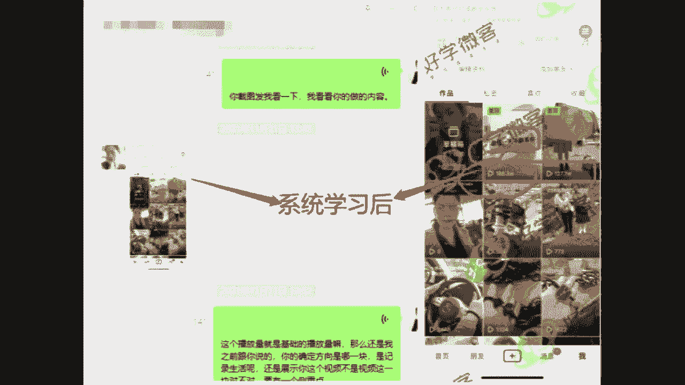

你说一条视频100多万人看，给你引个几万的顾客，几万的流量好像并不难吧，那接着再看一个宝妈的吧，呃雨露均沾一下，咱都瞅一瞅这个宝妈同学，之前就是宝妈都喜欢拍自己家宝宝嘛。

老师我也理解她就很喜欢拍自己家宝宝，你看播放量400多，播放量200多，播放量100多播放量啊，拍完后期我们怎么做的呢，可以拍宝宝不用改，对不对，你拍宝宝没有错，那我们拍宝宝的小脚丫还是一样的拍。

接着配上一个搞笑配音，有意思的配音，结果给到了1400多万的播放量，1400多万人看过他们家宝宝的小脚丫，觉得好玩，觉得有意思，关注他这边也是小脚丫，250多万的播放量，你就可以看出。

其实呃拍还是那么拍，只不过我们只是微调了一个办法而已对吧，同学们可以理解吧，只是微调一下，并没有说你平常自己制制作那么复杂，这就是老师我跟你说的万物皆可晒过程，我举一个例子啊。

晒过程它最主要注意的是什么，是对比，怎么对比呢，来比如说我做服装好，服装穿搭，我之前穿我自己的衣服，唉，在视频面前看起来像120斤，我穿了我准备要卖的衣服，我的产品我搭配了一下，哎。

一下子显瘦20斤对吧，这就是对比，对比越强烈效果越好，比如说做美发呀，做美甲呀等等，都是一样的，全部都是对比在里面，你看指甲之前是什么样，做了美甲之后之后是什么样子，发型也是一样，包括说你们能想到的呃。

晒自己的生活呀，晒美食呀对吧，晒工厂啊都可以配上老师说的画面是一部分。

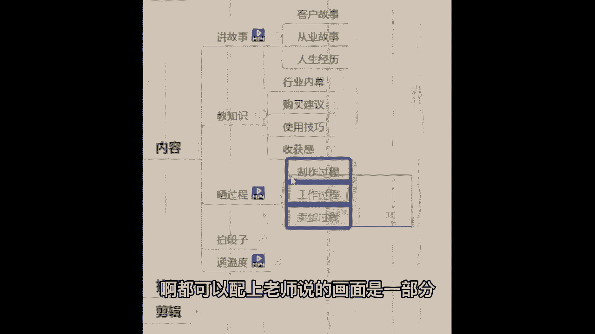

再配上任何一个搞笑趣事或者一个故事，都是很好的一个灵感，那这边我给你们举一个例子吧，这是我的一个学员，他的名字叫海椒，抖，音上直接可以查到她，我给你们看一下他的这个美食生活类型的视频，是怎么做出来的。

那么看完之后呢，告诉我这个是强人设还是弱人设呀。

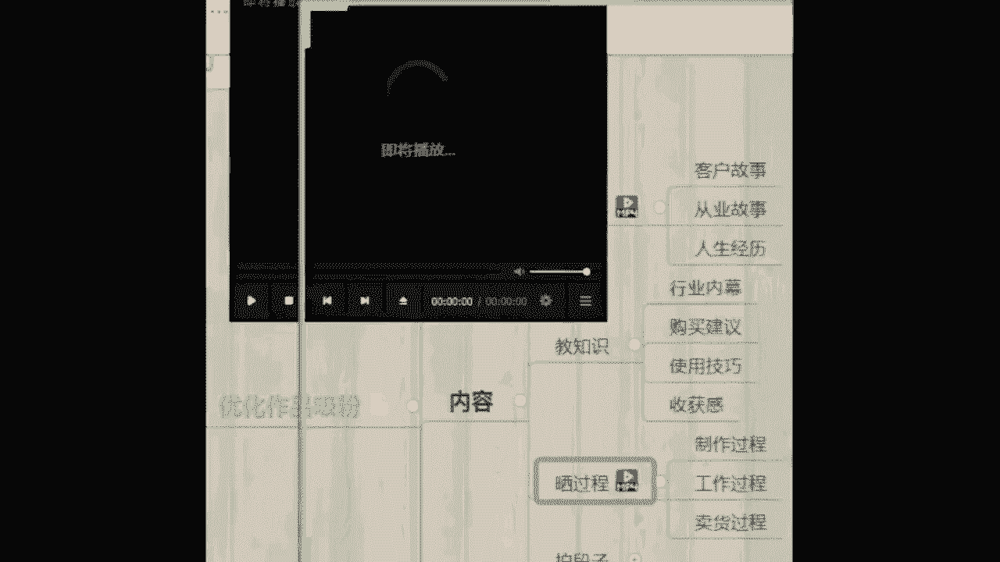

今天给大家分享一个杨枝甘露。

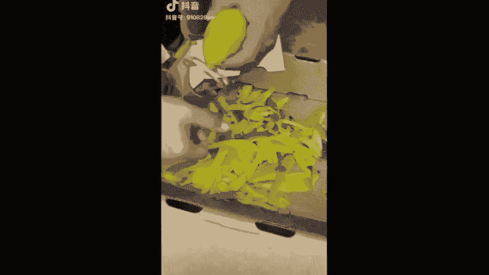

♪ 你的爱 ♪。

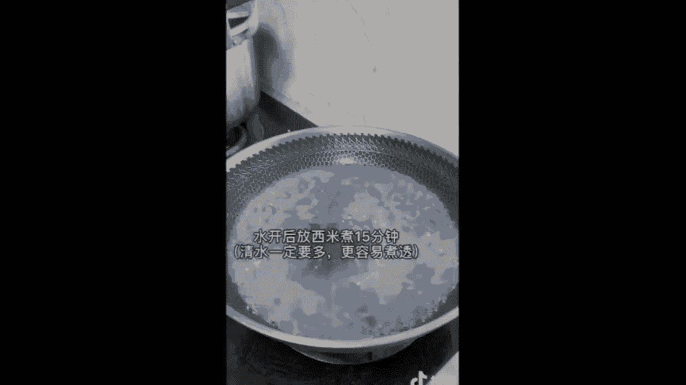

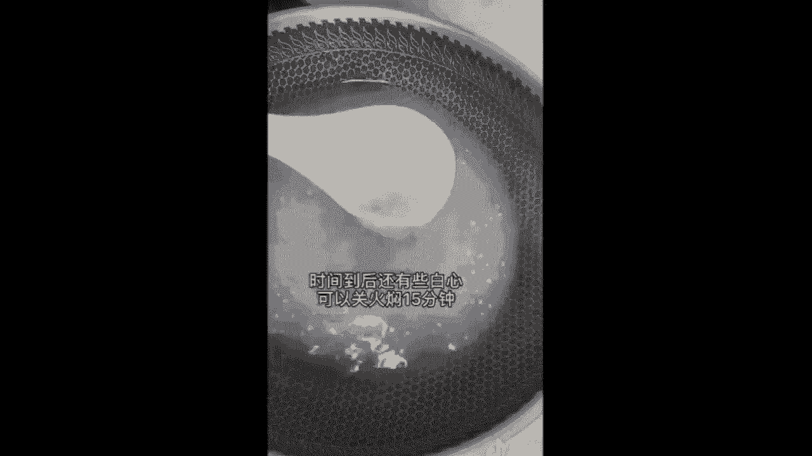

♪ 呜呼呜呼呜呼呜 ♪，♪ 宁静的夏天 ♪，♪ 天空中繁星点点 ♪。

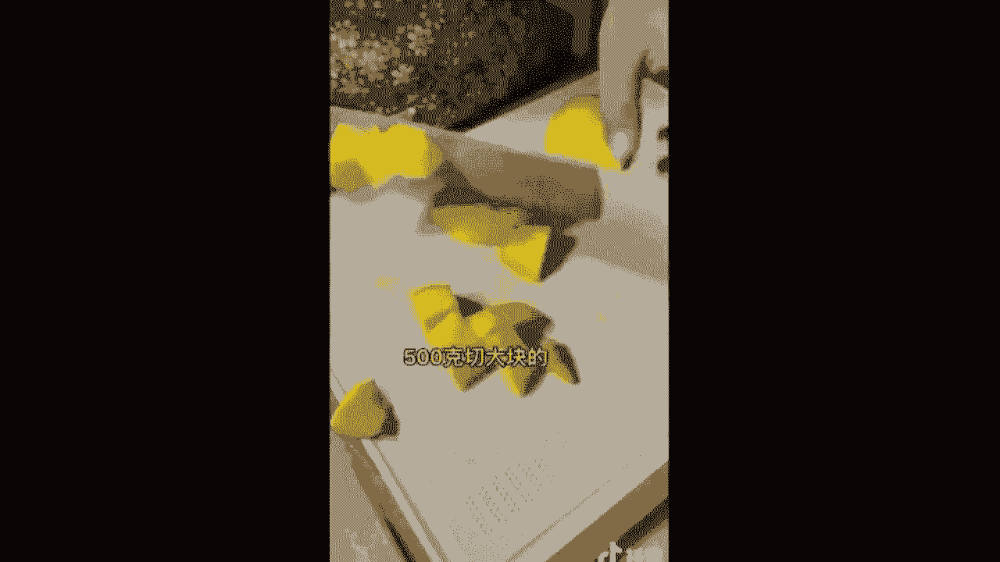

♪ 心里头有些思念 ♪，♪ 思念着你的脸 ♪。

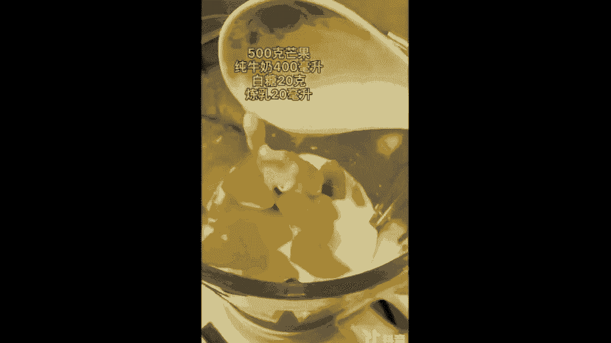

♪ 我可以假装看不见 ♪。

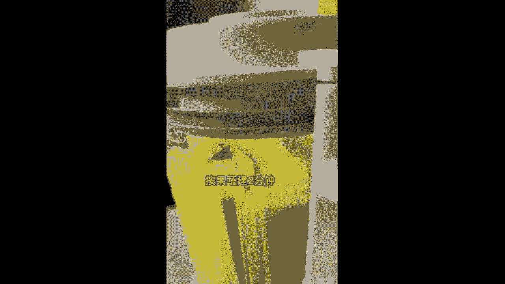

♪ 也可以偷偷的想念 ♪，♪ 直到让我摸到你那温暖的脸 ♪。

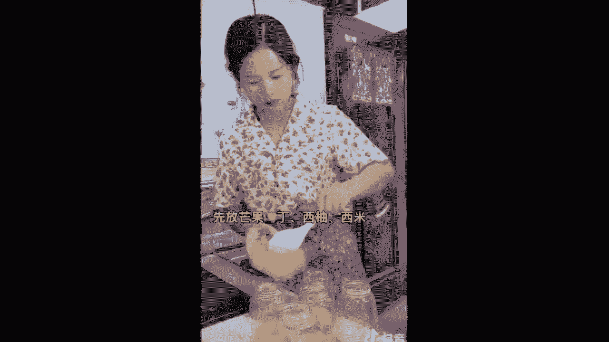

♪ 宁静的夏天 ♪，♪ 天空中繁星点点 ♪。

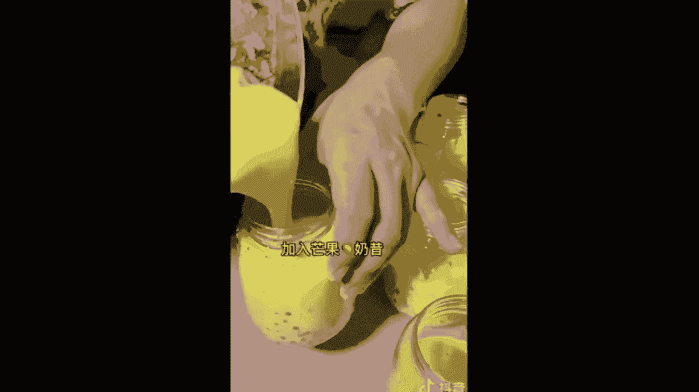

♪ 心里头有些思念 ♪，♪ 思念着你的脸 ♪，♪ 我可以假装看不见 ♪。

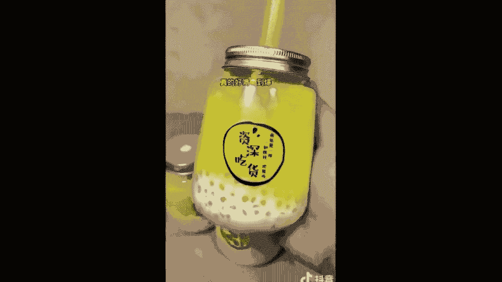

♪ 也可以偷偷的想念 ♪。

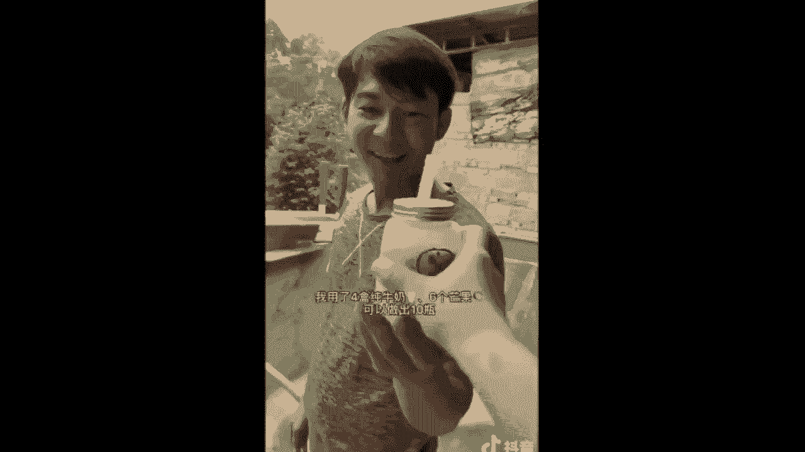

♪ 直到让我摸到你那温暖的脸 ♪。

♪ 知了也睡了 ♪，安静的睡了。

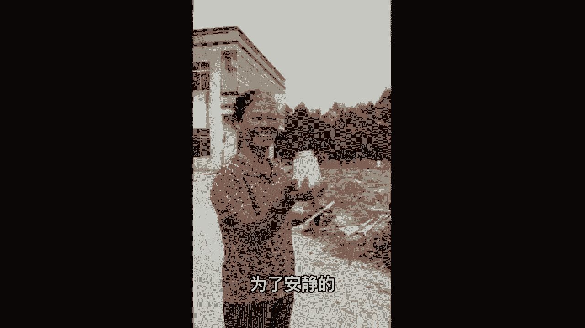

在我心里面抖音咳好，我们看完这个海椒的视频了，那她这个绝对是强人设，真人出镜晒自己的制作过程，那么同时我们同学，如果说你想做这一类型的视频，晒制作过程的话，记住结尾不要说啊，我教完你东西，我就咔停止了。

你要分享一下，哪怕是和你周围的朋友，和你的同事，和你的这个哎认识的人对吧，有一个对话，有一个沟通，让你你看一条视频，他能够认识你几秒，十条视频呢也几十条视频呢，他就能感觉这个用户啊。

观众他会觉得他已经和你很熟悉了，他有这个错觉，他就会觉得认识你很久了，那么他变成你的真忠粉。

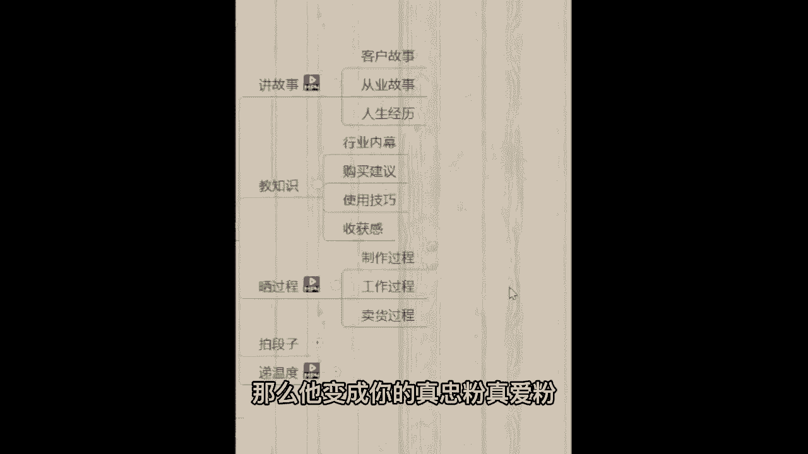

真爱粉，特别喜欢你的粉丝。