# 2024年做抖音怎么快速起号？3天养出一个高权重抖音账号，掌握这7点，抖音快速养号小技巧！ - P26：【手机版】卡点抽帧的制作方法 - 汪了个汪a - BV1cUpReuEwy

Hello，大家好，欢迎来到我们卡点篇章的课程学习，本次课程分为四节课，第一节课是我们抽帧卡点视频的制作，第二节课是我们视频变图片卡点，第三节课是镜头快速切换卡点。

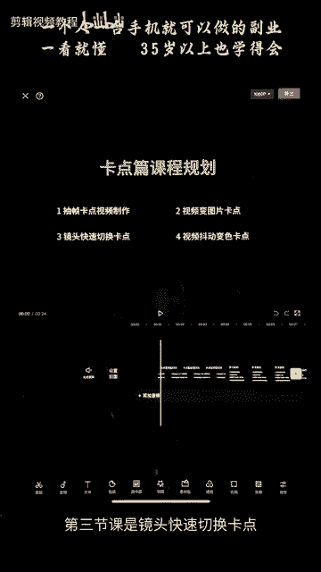

第四节课是我们视频抖动变色卡点，希望大家能够通过我们卡点篇章的学习。

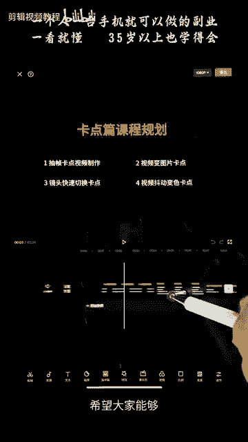

熟练地掌握我们剪映的界面，第二掌握音乐节奏，第三完成属于自己的卡点视频作品，第四为后续的进阶课程打好基础，那么我们来看一下我们本节课的主要学习内容。

抽帧卡点视频的制作，抽帧卡点视频的制作非常简单，第一步对音乐进行踩节拍，第二步根据音乐节奏对视频进行分割，不懂没有关系，我们通过接下来的一个实战案例，教会大家，我们先来看一下案例。

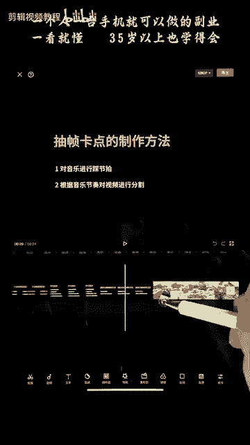

首先第一步打开剪映，点击开始创作，将我们已经保存的视频添加到我们的剪映中。

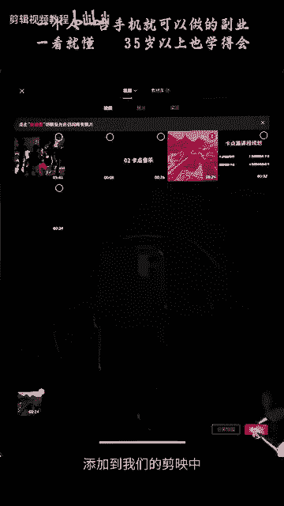

点击视频一定要先选中视频，才能点击音量，将音量调成零，点击勾选，那么我们的视频原声就没有了，第二步，点击下方的添加音频，点击提取音乐，将我们保存好的视频提取它的声音。

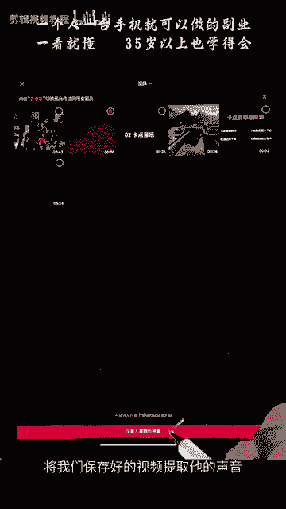

这样的话就把声音导入进来了，我们的音乐点击音乐，点击下方的节拍，就进入了我们自动踩点的一个节拍界面，点击左下方的自动踩点，系统就会自动给我们生成这些黄色的节拍点，系统生成的节拍点。

每一个的间距都是一样的，均匀的分布，我们可以看一下，这里有节拍一，有节拍二，节拍一的话就比较稀疏，节拍二的话就比较密集，我们可以看一下节拍二的比较密集，我们看一下这个蓝色的这个波形图。

蓝色的这个波形图最高峰的位置，波形图的最高峰位置就是我们节拍点的位置，我们可以看到我们这个音乐的节拍，都是比较均匀分布的，所以我们就用系统生成的就可以，如果你的音乐不是匀速的。

你就需要自己去手动添加点或者删除点，在这一个地方，这个的话我们下节课会加强练习，这里的话我们就用系统生成的这个节拍点，点击勾选，这样的话，我们的节拍点就会显示在我们的音乐上面。

第二步呢就是对我们的视频进行抽帧，首先将时间拖动啊，对准我们这个黄色的节拍点，然后对画面进行分割，然后再选择一段进行分割，选择的这一段呢我们是需要删除掉的，就是抽帧。

抽帧的意思就是将视频中的中间片段删除掉，就是抽帧，抽帧之后呢啊我们点击删除，那么我们可以看到啊，他这两个画面呢就会有一个跳动的效果啊，刚好对上我们的节拍点，就是我们的抽帧卡点，好对准下一个节拍点。

将这一个视频进行分割，选中跟我们刚刚删掉的那一段，长度差不多的视频进行分割，然后将它抽除啊，删掉就是我们的抽帧，抽掉它，好这样的话以此类推，一步一步的抽帧下去啊，我们还有一个更快捷的方法。

就是选中这一个画面进行分割，我们比如要删除到这一个地方，我们可以这样拖动，效果跟我们刚刚分割之后删除是一样的啊，比如说我们对准这个节拍点，对这个地方啊，选中这个画面进行分割，我们要删除这一段。

从这一个地方到这个地方的这一段，我们可以怎么操作呢，我们可以直接把这个地方拖动到这里，那么中间这一段就删除掉了啊，然后这样的话会更快捷一点，我们选中这一个视频对准分割拖动，以此类推。

将后面的所有视频画面，进行这样的一个抽帧处理，选择视频进行分割拖动，好然后将多余的视频分割删除掉，多余的删除掉，我们来看一下我们制作的一个效果，好的这里呢有一个需要注意的地方，就是我们的剪映自动踩点。

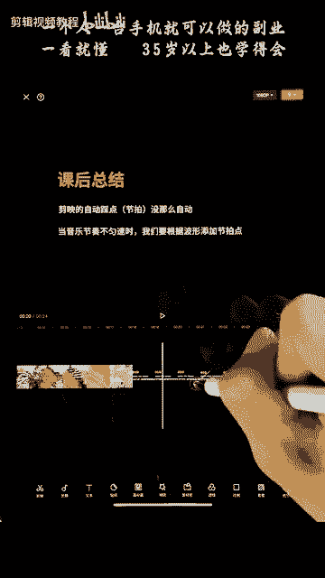

踩节拍没有那么自动，如果你的音乐不匀速的时候，就需要我们根据一个波形图去添加。

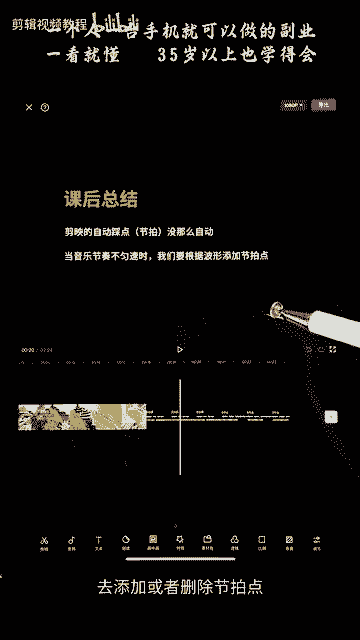

或者删除节拍点，这里呢给大家布置一个课后作业。

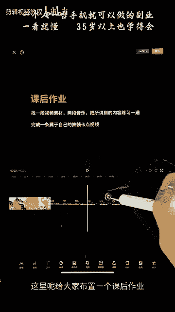

找一段视频素材，两段音乐，把所讲的内容练习一遍，并不是说两段音乐都是放在同一个视频里面，而是说让你找两段不同类型的音乐。

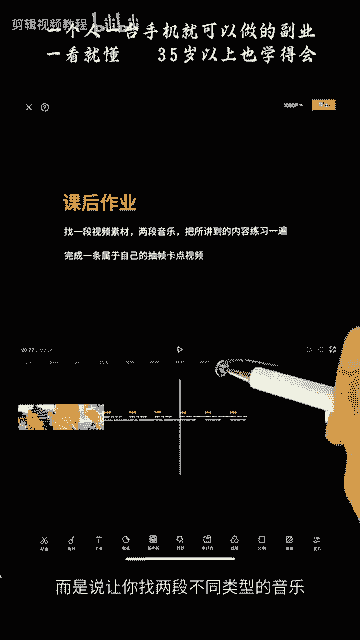

去进行我们的音乐节奏的卡节拍啊，我们的踩点。

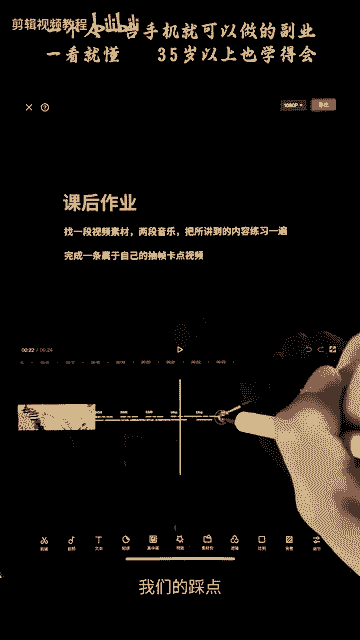

然后完成一条属于自己的抽帧卡点视频。

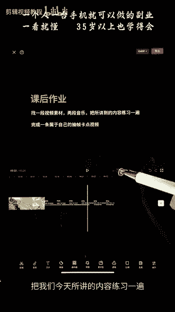