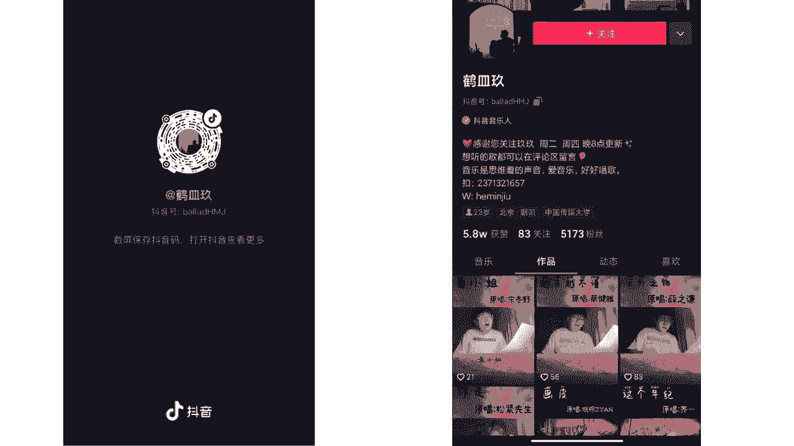
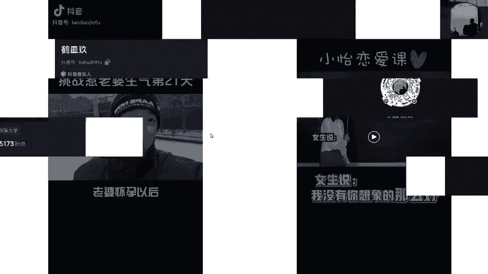
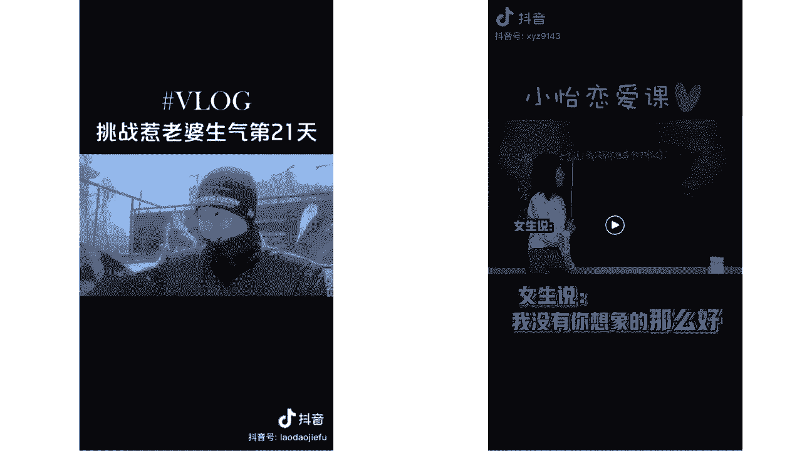
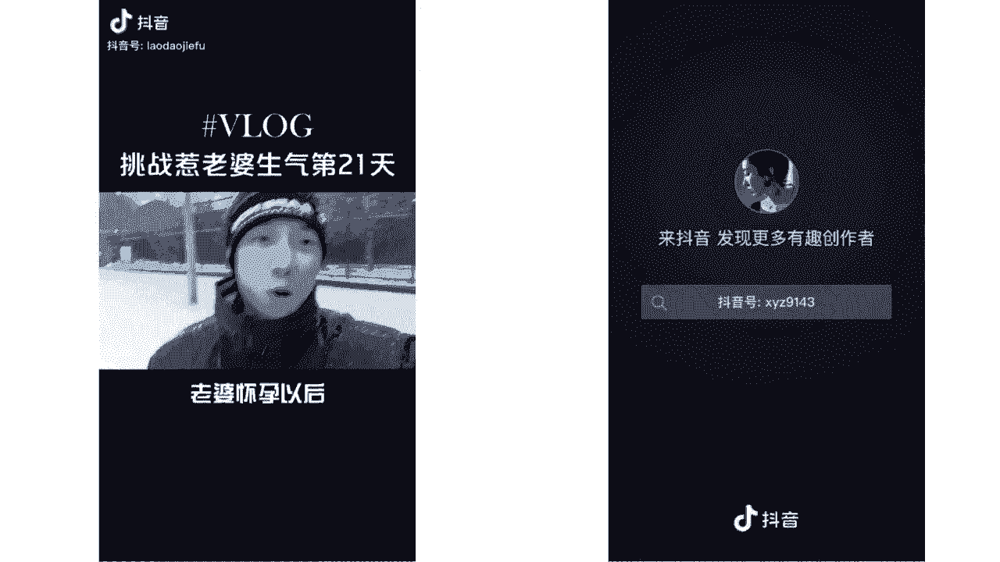
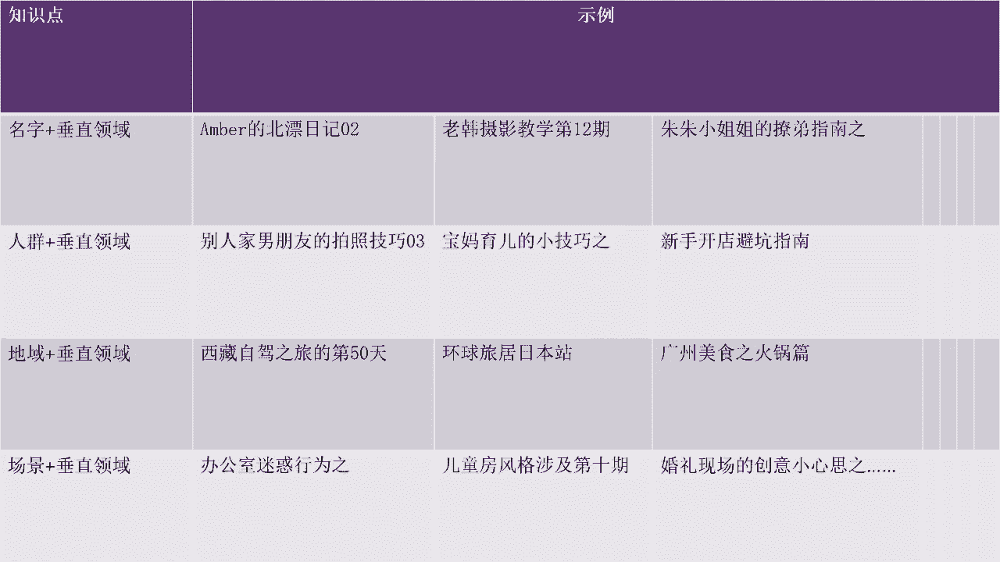

# 2024年做抖音怎么快速起号？3天养出一个高权重抖音账号，掌握这7点，抖音快速养号小技巧！ - P27：主题IP - 运运好运营 - BV1ZLsqe9E3q

什么是主题IP，我们接下来再看两个视频。

首先我们看左边这个老婆怀孕以后一直停更的，惹老婆生气系列又回来了，老婆来，老婆来打雪仗，来来来来来吧，来我和孩子一块打一块打，哼嗯哼奥奥奥利给奥奥奥利。

给baby baby bb抖音好啊。

这是左边视频，我们再看右边视频，女生说我没有你想象的那么好，该怎么回复啊，没事儿，我不嫌弃你，人家不嫌弃你就不错了，应该说不管你好不好，我都喜欢你，哎，注意啊，同学们，这是最容易扣分的一道题，难就难在。

接下来女生既可以明确拒绝你，也可以装作没有安全感，利用你的保护欲，让你对她无条件包容，可谓是进退自如啊，哦当女生说这句话时，最好的处理办法就是不表态，你只需要回复他三个字，明白了，然后果断撤退。

如果女生真想拒绝你，咱也算识趣，不再纠缠，但如果他对你有意思，那他心里肯定会非常不爽，他怎么不说话了，是不是误会我了，到时候女生会回来找你的。

哎好了，这两个视频我们都看过了。

你们呢有没有发现他们有一个老婆回，比较共同的特点或比较相似的特点，首先我们来看啊，挑战惹老婆生气的第21天，这个视频，如果说啊你单纯不看上面这个文字啊，你就只看他跟他老婆这么嬉戏打闹。

好像没有什么特殊的地方啦，对不对啊，只是拍的一个日常的视频，他的镜头啊，包括说他整个画面也没有特别的好哈哈，这招叫欲擒故纵，你们总关心我们的这个视频内容，来我们看一看啊，如果说他不加这个挑战。

惹老婆生气的，第21天，你可能看过之后就划走了，这是什么呀，我也看不懂，对不对，但他给了你一个主题，它引导着你去看诶，这是第21天，是不是还有第20天啊，啊是不是有更有趣的呀，这个没有趣，没关系。

我好想看看他的20天啊，他的19天他怎么惹老婆生气的，对不对，这是他的一个主题啊，也就是说哈他现在有21天，他接下来可能有22天，23天，24天，大家能懂吧，啊比如说之前比较火的。

就是有一个嗯什么嗯阿拉蕾的装修日记，不知道大家有没有看过啊，就是阿拉蕾这个人在北京租了一个，买了一个什么小院儿，完了之后他的装修，那么他通过这件事呢，衍生出来了无数期的一个作品。

那么这就是他的一个主题啊，能懂吧，呃围绕着惹老婆生气，围绕着装修日记这么个事儿，我们能延伸出来无数期的视频，我们这个小鱼恋爱扣也是一样的。

是不是小姨恋爱课，那他这个策划的就更绝了啊，这小姨恋爱课她大概20多条视频哦，涨了多少粉丝来着，我有点忘了啊啊反正涨的很很厉害，因为他这个人设啊，他整个这个账号策划的非常好。

首先它的主题就是什么小姨恋爱课对吧，那么其次的话呢什么可能对于同学们来说，这个还是比较有用处的，对不对，有些啊直男他不太会追女生，对不对，还有就是特别感兴趣啊，对于这个感情，对于这个恋爱特别感兴趣。

还有就是哎呀这个问题我好像之前遇到过呀，就特别有共鸣，对不对，他一举三得，那么其实这个视频拍起来也非常简单，一块小黑板放在那儿，我一天拍了个十天，对不对，那这个啊就更绝了，那么我们现在啊。

主要关注的就是他的这个主题IP，看到没有，其实我们会发现，刚才那个啊主题IP上出现了一个什么问题，它没有一个明确的主题IP，对不对啊，这个人记不太住他的主题，记不太住，他唱了一首歌。

那我听了之后觉得好听，我点个赞我就走了呗，对不对，我也不想看他昨天唱了什么，他明天再唱什么，是不是那吸引不到别人，所以说主题IP的存在呢是非常重要的好。

那么主题IP我们怎么去取，这里也给到大家的方法了，所以说啊大家在明确了商业定位之后，我要去做内容定位了，我选择我做医美行业了，不要着急，先去拍，内，容，里面还有很多很多东西需要我们一点一点填充，知道吗。

那我们首先来填充第一个叫叫做主题IP，那这个方法加这个原则，大家先来看一下，是不是有点看不懂，是不是有点看不懂，进入中，是不是有同学说老师为什么隔几页PPT就给我，这种让我看不懂的东西。

好我们先把这个啊这个概念先看一下啊，接下来给大家举几个例子，大家就知道了好吧，这里我就不解释了啊，解释的话大家看这个文字也是啊，大眼瞪小眼明白哈哈，然后我们接着来看给大家举的这几个例子哈。

你看我们看得懂是吧，你看我们取这个啊叫什么主题IP的时候，也就是我们找主题的时候啊，一般都用这几种方式，名字加垂直领域人群加垂直领域，地域加垂直领域情景加垂直领域，看到没有，那么这里呢给大家举个例子。

来首先第一个名字加垂直领域啊，第一个是某某的北漂日记，零二集，老韩摄影教学第12期，那猪猪小姐姐的撩地指南之某某某某某啊，懂吧，名字就是我的这个个人嘛，哎我叫什么，我叫老韩，是不是，这个是猪猪小姐。

后面的话，垂直领域就是你看他的垂直领域是北漂，北漂日记，那她的垂直领域呢是摄影教学，那猪猪小姐姐的垂直领域呢是撩地指南，对不对，能动是吧，然后接下来看这个人群加垂直领域，看别人家男朋友的拍照技巧。

第三期，宝妈育儿的小技巧之什么，什么新手开店避坑指南能看到吧，人群就是前面别人家的男朋友，宝妈，还有新手，这都属于人群，那么后面加垂直领域就是拍摄技巧啊，育儿技巧避坑指南是不是能懂吧。

那么在接下来再看啊，地域加垂直领域啊，西藏自驾之旅的第50天，环球旅居日本站，然后广州美食之火锅篇啊，这个也很容易理解啦，地域就是西藏啊，哈日本，然后什么啊火锅啊是什么，广州是不是都是这种地域。

再加垂直领域，就是自驾环球旅居，然后美食是不是，那接下来就是场景加垂直领域，那办公室迷惑行为之哎，为什么总有人脚臭，对不对，办公室迷惑行为，还有儿童房风格装修，以及呢婚礼现场的创意小心思。

那这些都是场景再加垂直领域，那这些呢都是啊想主题的一些小方法，它主题的小方法其实大家可以啊记一下，对不对，大家可以截个图啊啊或者是什么呀，就是记住它啊，以后我们再去想主题的时候呢，就比较明确了。

对不对。