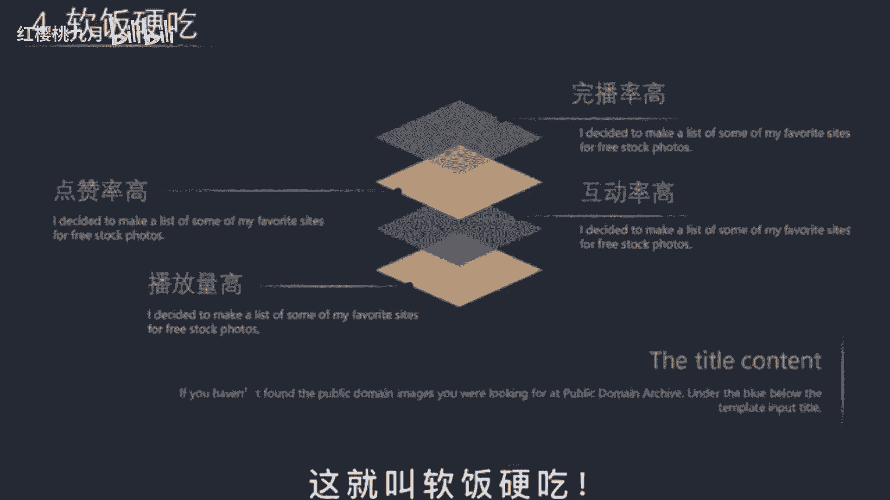

# 2024年做抖音怎么快速起号？3天养出一个高权重抖音账号，掌握这7点，抖音快速养号小技巧！ - P28：新手如何做好抖音 - 红樱桃九月 - BV1iytVetEcB

做抖音的最高境界就是吃软饭，选话题呢就是选老婆话题，选得好，软饭吃到饱，软饭男啊，有这么三个特点，和我们做抖音的逻辑是共通的。

第一个呢是喜欢吹牛，但从来不干实事啊，比如说你是做好物分享，第一句呢就是买了这个清洁神器，再也不用担心厨房油污，那到底是不是真的好物呢啊并不重要，再比如啊你是做影视解说的，开头呢。

就是这绝对是一部能让你吓到，汗毛竖起的恐怖片啊，你是做知识分享的，打开这个隐藏开关，播放量暴涨100倍，那你看看他们呀，都是吹牛的人，并不关心到底是不是真的有用，只要能拉住你的眼球，提高完播率就好了。

第二点呢是能巧妙地讨好对方，也就是说想你所想无死角的满足你的欲望，在抖音上，只要你能满足实用价值，利益价值，情绪价值，这三点就一定能火啊，比如说你是解说视频的，看完呢丰富了我的谈资，大家都愿意给你点赞。

再比如我这种，这就是利益价值，情绪价值呢就能给观众带来感动，愤怒愉快等心灵体验，产生情绪的共鸣啊，比如揭露镰刀的内幕啊，打假数码产品的博主播放量都非常高，第三点是特别擅长打扮自己，如今社会啊。

男人与女人都喜欢美好的事物，同样都是美食博主，这两个视频你更喜欢谁呢，这个呀都在讲同一部电影，那这两个封面你又更愿意关注谁，短视频啊，讲究的就是前三秒的画面冲击，这直接影响到用户的低眼感官感受啊。

特别是用户有了关注意愿时，一般呢都会进入到你的主页。

所以你的封面一定不要像朋友圈似的杂乱无章，一定要封面统一，这样大家才更愿意关注你，当你拥有了这种软饭的能力，即使内容水平一般，也会深受粉丝的喜爱，播放量爆炸啊，为什么呢，因为抖音是机器啊。

他不知道什么是好内容，只知道什么是好数据，你玩播高点赞，高播放量呢就会不断的提升，被推荐给更多类似的人观看，当你打上了账号标签，就相当于入赘成功啊，以后不用怎么努力，也能有上万的稳定流量。

