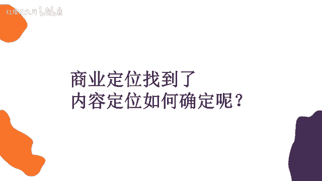
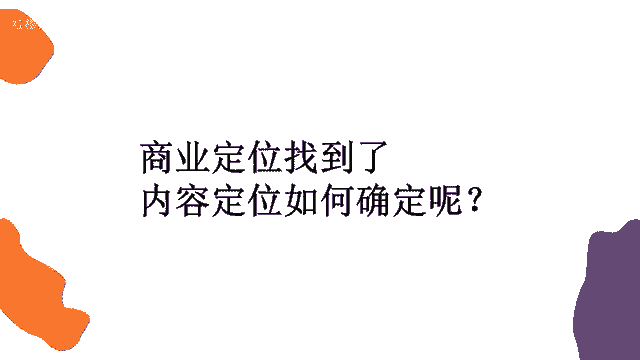

# 2024年做抖音怎么快速起号？3天养出一个高权重抖音账号，掌握这7点，抖音快速养号小技巧！ - P29：用户思维 - 红樱桃九月 - BV1iytVetEcB

怎么才能够达到这种引流的效果，哎销售的效果。

那我们可能以销售的思维我们去做的话，啊啊你会怎么做，以销售的思维去想。

取决于客户的需求是吧，哎没错哈。

我们马上就要讲到了，那取决于客户的需求，那我们怎么才能想到客户的需求呢。

其实大家想一下，我们以销售的思维去做，我们想到大家喜欢啥用啥。

那我们这些技巧，我们这些话术呢。

你想单纯用销售的思维去想的话，我们可能会说我是医美。

我能让你变美，你来到我的机构之后，我让你变成有一个蜕变，我们这里的就是这个医生特别的专业。

特别的权威，那或者说我这本书特别好。

只需要59块钱，今天是七夕节，我还降了十块钱。

你买吧，特别优惠，哎但是这样的内容它在淘宝上是可以的。

我们说在抖音上是不可以的，为啥呀。

为啥呀，大家喜欢啥用啥。

市场调研没错，市场调研也是能够帮助我们去完成商业定位的。

那么商业定位完了之后，我们就要再深入的去想了，我们要做内容对吧。

应该先是自己拥有资源，然后想客户的需求。

最后想怎么用自身的需求啊没错，所以我们第一步才是做的商业定位。

对不对啊，首先啊我们自己拥有的一个资源。

要么就是你自己有产品，要么就是你自己有电，要么呢就是你的标签里面有你特别擅长的领域。

特别特殊的领域，对不对，然后我们现在在想了。

我们怎么才能抓住用户的心，让他买你的东西，让他能够引流到你的线下来。

亮点不够哈啊，因为淘宝和抖音它有一个实质性的区别。

我们说淘宝是电商平台。

而抖音是一个娱乐平台，是不是，但凡你打开淘宝。

就是因为你有什么的需求啊，购物的需求，或者是你做好了花钱的准备对吧。

所以在这个时候他怎么给你销营销啊。

他他告诉你59块钱，现在七夕节还降十块，还打五折。

你一看便宜啊，你就买了，对不对，但是抖音它是一个娱乐软件。

你本来是去抖音找乐子的，是不是哎老娘图开心的。

这个时候有人给你推销了，你是不是还挺烦的，就稍微有点烦是吧。

你即使再便宜，关我什么事，我来是为了要干嘛的，我是为了娱乐的。

那你老是跟我说，这个打折那个打折我不想要。

对不对，所以我们要站在用户的角度上哦，刚才我也讲了，互联网思维有九大思维。

我们先不管其他的八个思维是什么，而且现在市面上啊。

总是会流传出各种各样可能12大思维啊。

各种这思维，那思维就是很多概念派的东西出现了，但是我们可以不用管其他的啊。

我们永远记住，第一个是用户思维，永远都要想用户他喜欢什么嗯。

我给大家举个例子好吧，就比如说我们肯定学习了拍摄剪辑。

对不对，你们也学习了这种灯光打光的知识了吧。

你们学了没有啊，我假设你们学了，比如说你们学会了之后啊。

学的特别好了，我想要把这个知识呢分享到抖音上。

目的呢哦就是为了我要教别人这个知识，让别人也付费也付费买我的知识好吧。

那么我假设这个可能呃。

视频中可能你有五个知识点，这五个知识点呢就是讲什么啊。

小小老师讲的是吧啊，那我不知道你们学了什么灯光啊，我我也并没有小学老师那么专业。

我随便讲几个，而测光怎么打，打了有什么效果。

底光怎么打，打了有什么效果，蝴蝶光怎么打，打了有什么效果，还有轮廓光怎么打。

打了有什么效果啊，是不是我们可能一个视频里有这四五个知识点。

那么如果是你们把这个知识分享到抖音上。

你们会怎么讲，或者说你们会按照什么顺序讲。

是不是随便想到哪个讲哪个，按测光我们怎么打，它可以让视频更清晰。

那底光我们这样打，它可以让这个画面更恐怖，那蝴蝶光这么打。

可以让我们整个人更美丽，我们是不是按照随机的顺序。

就把这几种光的知识给讲完了。

你可以想一下，你们是不是会这样讲。

然后啊你可能这样讲完之后我发出去。

我要起个标题嘛，那你的标题会怎么讲，或者说卷心菜今天教你三种打光方式啊。

非常有用，赶紧收藏，你会这样起标题吗。

大家可以就是真的去思考一下。

是不是真的思考一下，我们总说啊。

不会是吧，那你们会怎么样怎么样去完成这个视频呢。

怎么样取这个标题呢，是这个东西都是需要思考的。

我们真的在说用户他到底想看什么，用户他到底需要什么。

那你就要具体到你的视频，即使你的视频只有七秒钟，只有八秒钟，你也要考虑到每一秒钟。

你的用户看完之后有什么样的反应。

是不是，那比如说刚才我讲到测光底光蝴蝶光。

对不对，那大家可以想一下，测光人人必会的三个打光神技啊。

好我一会再讲这个标题的事啊，大家可以想一下，比如说测光，我打我可能让视频可以更清晰。

底光我打我能够更害怕，唉其实我看了之后。

我觉得哦好像是这个样子哦，还有点用啊，还行吧。

然后最后我讲的蝴蝶光怎么打啊，可以让女生更漂亮，对不对。

更漂亮这个东西呢是利益，而底光打更恐怖。

只是一个效果，大家能懂吧，所以你在展示给用户的时候啊。

你要想一下怎么样才能吸引到他们啊。

比如说这几种打光方式，我可能会把蝴蝶光怎么打，有什么效果放在第一个。

我们女生更漂亮，可以把她的轮廓给打出来，对不对，因为我第一第一第一个就是前面几秒的时候。

我好像给别人获得利益的感觉了。

对那么其他的几个你可能只是单纯的教它哦，这个工具是这么用的。

用了之后能有这种效果，对吧。

所以说我们可能把更吸引人的哎，或者说能让别人有这种利益获得感的放在前面。

是不是，然后再讲到标题这个事情啊，标题这个事情是什么啊。

就是人人必会的三个打光神技，有同学说了。

对不对，那或者说啊教你三种打光方式，但是其实啊这种打光神技打光方式。

那那别人会想看吗，哎你打光关我啥事。

对不对，关我啥事就让我没有利益获得感。

那你可以说什么啊，卷心菜教你能把姑娘变漂亮的打光方式。

那这样的话啊，这个就是有一种利益获得感的标题。

那当然我只是举了一个简单的例子，好吧啊，当然具体每个光啊到底打出来有什么效果啊。

是不是光要叠加着使用啊，我也不太清楚，这个你们肯定是更了解的。

对不对，所以说每一秒都要考虑用户。

