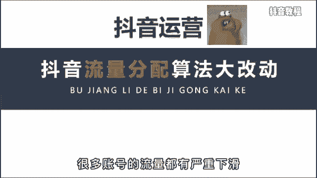
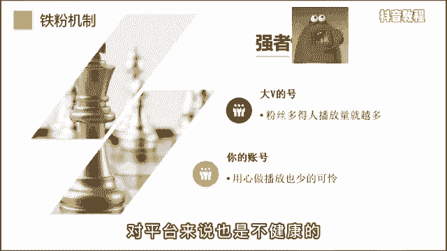
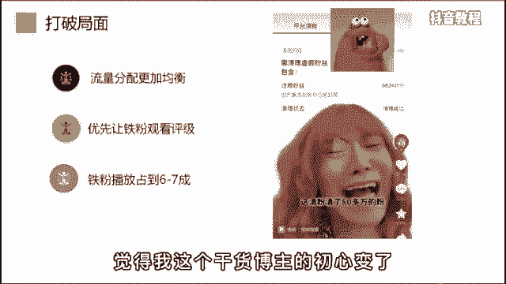
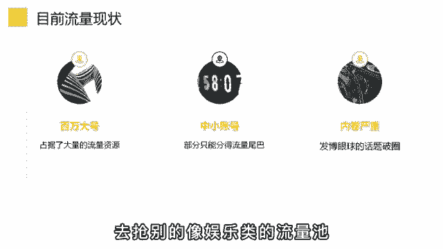
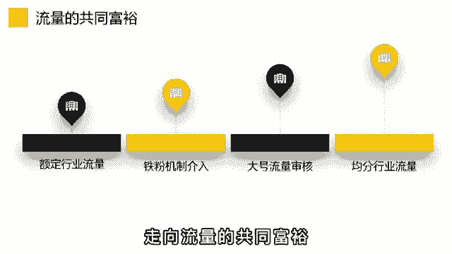

# 2024年做抖音怎么快速起号？3天养出一个高权重抖音账号，掌握这7点，抖音快速养号小技巧！ - P31：基础篇丨抖音播放量推送机制 - 阿毛传奇24 - BV1nbame3EKg

最近你是不是流量不太好，这是因为抖音的算法有了大幅变动，很多账号的流量都有严重的下滑。

知名网红毛毛姐一夜掉粉80万，不过呢这对小博主来说，却是一次弯道超车的好机会，看到视频最后啊一定会对你有所帮助，那造成这个现象的主要原因是，因为抖音的算法新增了一个铁粉机制。

所谓铁粉就是长期支持你的粉丝，再恰我们只能看到粉丝的总数，这就导致强者恒强，粉丝多的人播放量就越多，哪怕就是拍一段毫无意义的吃水果，也会被吸引走几十上百万的流量，这对普通人来说却是一种不公平。

对平台来说也是不健康的。

所以呢，这个铁粉系统就会从一定程度上打破这种局面，让流量的分配更加均衡，让真心做好内容的你能获得更多的流量推荐，无论大号呢是有几百万的粉丝，在作品发布的初期，都会优先让他的铁粉观看瓶颈。

只有过了铁粉这关后，才会进行大范围的推荐，一般呢10万播放以内啊，铁粉播放要占到6~7成的比例，比如呢我是做运营教学的，我发现最近流量不太好，也去发一些炫富博眼球的话题，老粉看到了就会不乐意。

觉得我这个干货博主初心变了。

所以流量呢也不见得会变好，然后再说一下，为什么对中小博主来说是次机会，首先呀你要明白一个基本的概念，每一个行业赛道损失的体量是不一样的，你做娱乐号粉丝到1000万都有可能，但你做技能培训。

比如开挖掘机最多啊，就是10万的体量，原因呢有以下两点，第一是学习枯燥，看短视频啊，主要还是以消遣为主，第二呢是学挖掘机的人本来就少，所以呢当你看到一些人做教学视频，不要上来就怼人家。

这么点粉丝还做教学，这是由平台的总用户体量来决定的，不是所有的行业都能做到百万粉，也不是所有的百万粉的号都能健康的变现，明白了这个后，我们再说机会是什么，之前啊。

头部账号在各自的领域占据了大量的流量资源，随便水一篇都有几10万的播放，而平台呢在这个赛道的流量是固定的，这就导致新号的流量很不稳定，假设呢你是美妆赛道，大家每天啊均分2000万的固定流量。

大号每个人都拿走1/20，小号呢可不就剩点流量尾巴了吗，而想要破播放，也就只能发一些博眼球的话题，比如呢边唱歌边化妆，去想别的，像娱乐类的流量池。

让行业啊不断的内卷，而铁粉机制的出现，会让水视频的大号流量有所限制，不再单纯依靠粉丝数来分配，这样呢就会有更多的行业流量给到其他，认真做视频的账号。

