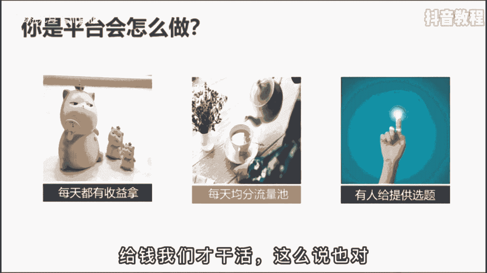

# 2024年做抖音怎么快速起号？3天养出一个高权重抖音账号，掌握这7点，抖音快速养号小技巧！ - P31：运营篇丨抖音要怎么才能上热门 - 红樱桃九月 - BV1iytVetEcB

为什么很多人做短视频做不起来，给你分享一个终身受益的思维方式，平台思维只要拥有了这个意识以后。

你做任何事情都不会失败，想象一下，如果你是平台，你要怎么做，才能让作者源源不断的为你去创造内容，你可能会想当然是要有收益了，给钱我们才干活，这么说也对。

但严格来说是要有激励机制，平台呢就像是一个牌桌，我们的作品就是我们的手牌，每次发作品时摸到的都是不同的牌，虽然之前拿到的牌不太好，但是好在每次都有拿新牌的机会，这就是第一个要点，不确定性。

不确定性可以极大的激发一个人的热情，激发他心中好赌的欲望，刺激他源源不断的做下去，你要是说每天只要发作品就给你十块钱，一天封顶，发五个流量平均分配，那这样呢你就看不到优质的作品，大家都会变得麻木。

尽管每天都能捡到钱。

很快平台就会灭亡，但反过来，如果平台给你不确定的奖励，只要发到一个关键作品，你就会直接山鸡变凤凰，流量爆炸，收益倍增，这个玩法是最刺激的，但你根本舍不得下拍桌，因为你不知道未来会不会火。

每当你快要放弃的时候，平台就突然给你来一梭子，大家内容相同，质量差不多，但就是给你流量要多得多，让你满血复活，等你再次拥有了创作热情，不会离开牌桌的时候，平台就会再次用同样的方法刺激一下别人。

这样每个人都会拼尽全力去创作，你会认为是自己的努力得到了回报，是自己的内容战胜了别人，其实不然，第一名和第11名并没有那么大的差距，因为好坏是没有明确的界定标准。

我可以让你火，也可以让他火，这才是平台真正的核心规则，企图用最小的代价激发你最大的创作动力。

那明白了这个道理，我再问你想要做起来短视频应该怎么办，答案是持续更新，因为它一定要给你奖励，否则你就会流失啊，这是平台不愿意看到的，所以当你更新的越多，你离下一次的奖励就越近，哪怕是同样的质量。

他一定会优先给你流量，让你鲜活，论视频表现里。

我一个烂PPT都有人看，你还能不如我吗，可为什么还有这么多人放弃呢，因为他们目光太短浅，太功利了，功利心太重的人生注定会是一场灾难，你不能克服自身的惰性，甚至没有足够的耐心，等到我视频的结尾。

这样的人做任何事情都会一事无成，只是他们刚好选择做了短视频，目盲者贪利，心宅者耗功，你越是想要获利，越是不想要吃亏，最后反而会失去更多机会，所以向有结果的人学习。

