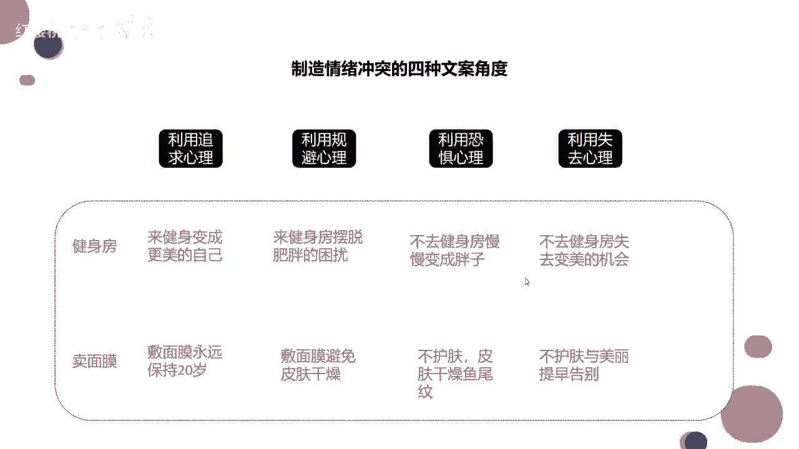

# 2024年做抖音怎么快速起号？3天养出一个高权重抖音账号，掌握这7点，抖音快速养号小技巧！ - P39：制造情绪冲突的十种文案角度 - 红樱桃九月 - BV1iytVetEcB

来看看啊，选题很重要，选完题之后，我们才能去做这种脚本结构，去做这个什么呀，去做这个拍摄来，我们可以看一下，来可以看一下，那么我们同样的一句话，用不同的方式说出来，它表达的效果其实就不太一样对吧。

你比如说啊，你比如说我想让一个人去健身，我想让他去瘦身，我直接跟他说，来健身房变成更美的自己，那其实这句话就有有一点点什么，有一点点无关痛痒，对不对，来健身房变成更美的自己。

你就好像跟我说说了一句广告词，什么做沃尔沃更安全，是不是做沃尔沃更安全好，又说了一句这样的广告词，但如果你换句话说呢，啊如果你不去变健身房，你就失去了变美的机会啊，你去用这种失去心理。

去恐吓心理去告诉用户的话呢，他会在他的心里形成一种紧迫感，形成一种紧迫感，对不对，就算你卖面膜，你告诉他敷面膜永远保持20岁，哎也是干干巴巴的一句话，对不对啊，什么弹弹弹弹走鱼尾纹。

也是相当于这样的一句广告词，那如果你告诉他啊，你什么啊，不护肤的话，不尽早敷面膜的话，你就会长什么样的鱼尾纹啊，长什么样的痣，长什么样的斑，这个斑是永久不可去的，如果你用这种心理去跟他讲的话。

唉他可能就会重视一点了，对不对，这个就是同样的一个选题，你用不同的话去说出来，或者你用不同的文案去表达的话啊，给到用户心里的这种暗示是不一样的，这个大家能知道吧，能懂吧。

就好像说我们也是双11在抢购的时候啊，那个额优惠的信息说哎你今天买我的东西，我给你打五折啊，如果说这个时候再给你加上一个刺激，就是这个打五折的优惠，仅剩下两个名额了，你就会马上下单。

然后第一个你如果特别想买，你可能还等到12点，那等到那个还差十秒钟，12点的时候，你去买对吧，这两种造成的刺激，它是不一样的，每天看大鹏的课，整头一句话就是了，哎我喝口水啊，和主播带货是一个道理。

这样拍你可以卖断货，哈哈是啊，都是这样，都是这样，所以说你现在大雄，你想想刚才你说的那个文案，你说的刚才那个文案是什么，如何科学的健身，你就会发现其实这样的一句话也是无关痛痒的，对不对。

哎大家心里想可能能想到，但是真的去实操的话，大家可能有点做不到，哎，如何科学的健身，就好像是刚才我说的啊，就是敷面膜永远保持20岁，它是一个道理，如果你告诉他，如果你不科学的健身，你会造成什么样的结果。

对吧你会造成什么样的结果啊，你的就是如果你不健身，你过了呃，过了多长时间之后啊，就是长期的劳累啊，长期坐着你就会变成一个什么叫什么啊，腰间盘突出啦什么的，可可能没有那么夸张啊，啊对不对。

咱基本上就是这个道理，同样的一同样的一个选题，用不同的方式，不同的心理去说出来的时候，给用户造成的那种情感的冲突，情绪的冲突也是不一样的，也就是说我们在这里要制造情绪的冲突。

啊那么这里还有啊啊制造这种情绪冲突呢，其实它是有几个呃，就是模板可以去使用的啊，可以去使用的，其实前面几个模板就真的不是特别的好呵，我都拿它来做对比了啊，但是呢有些行业也是可以去使用的。

有些行业可以可以去使用的，但是后面的话恐惧心理失去心理啊，是会经常使用的，但是也不要特别频繁，如果特别频繁的话，也会给用户造成就是不太好的心理啊，大家能懂吧，好了啊啊这个的话大家其实可以稍微的记一下。

稍微记一下，因为这个学会了之后呢，你可以用在嗯你任何的视频里面，任何视频里面这样健身塑造什么水蛇腰，忍受不了，一时身体的疼痛会成为你终身的疼痛，我我觉得你们可以去那个奥美公司。

奥美是一个非常有名的广告公司啊，他的嗯嗯他的名气主要来源于他的广告文案，我觉得你们都可以去了，好了啊，我们现在就先暂时把这个额选题这块。

先讲到这里啊，大家要记录一下的，或者要学会的呢，是我们这个九宫格选题法。

你可以把这里代入任何不同的一个产品，然后不同的用户好去把这些东西延伸开，延伸开之后呢，利用刚才连连看的方连连看的一个方式，我们去给他做一个额选题。

做一个选题，好吧好，那我们接着往后讲啊，还有9分钟啊。

