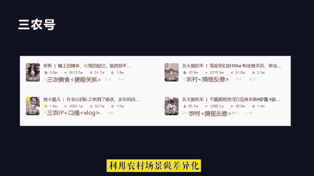

# 2024年做抖音怎么快速起号？3天养出一个高权重抖音账号，掌握这7点，抖音快速养号小技巧！ - P3：1.做抖音的5项基本能力 - 这个手刹不太灵z - BV11SHpeWEtu

首先做抖音创作必备的五项基本能力，第一拍摄剪辑能力，最基本的如何用手机拍出画面流畅，表达清晰的视频素材，这个能力是需要具备的，其次手机剪映或者电脑版剪映的使用，也就是剪辑的能力，如何剪出让用户能看下去。

而且觉得有价值的作品，也是需要经过不断练习才可以的，第二内容策划能力，内容策划其实就是你的作品构思，比如你想要通过什么样类型的内容，来传递你想要表达的信息，或者你每一个镜头以及在视频中说的每一句话。

它的作用是什么，如何进行串联起来，形成一个优质的作品，这些内容是需要不断的花时间揣摩和练习，才能找到感觉的，第三镜头表现力，如果是真人出镜，如何在镜头前轻松地表达自己，而且还要把自己想要表达出来的情绪。

以及感觉演绎到位，这个也是需要我们个人不断去练习的，第四细分行业的知识储备，如果你提供的是知识类的内容，如何让用户关注你，就需要你有相对比较专业的细分行业知识，才能获得粉丝的芳心，第五流量变现技能。

不管你是通过什么方式来变现的，当系统给你的作品推送大量的流量的时候，你能不能将流量快速的变现，这个需要你提前就规划好变现的路径，如果你本身就有成熟的商业模式或赚钱方法，承接抖音流量会比较容易。

如果你是通过短视频或者直播带货的方式，那么还要熟悉直播电商的整体流程，比如选品能力以及卖点，提炼直播能力和话术技巧等，如果你是通过星图广告，那么你需要努力做好个人人设或者个人IP。

当然如果你仅仅是靠流量来获取，平台的广告分成，那么就需要有不断创作爆款视频的能力，以及获取平台更多流量的能力，另外做好抖音，我们还需要准备五个方面，第一拍摄剪辑设备，拍摄设备相对比较简单一点。

一般我们自己使用的手机，只要支持1080P30帧就可以满足需求，不过最好可以用苹果12以上的，或者是国产旗舰版或者次旗舰版型号的手机，当然如果你的内容方向对画面质量要求较高。

建议你还是用相机拍摄剪辑设备，手机当然是可以的，不过如果对电脑操作比较熟练，用电脑剪辑视频效率会更高效一点，第二有充足的时间去做选题，做抖音短视频并不是一朝一夕的事情，我们看到很别人很多爆款视频。

你首先要确定自己，有没有足够多的时间去发掘选题，拍摄剪辑等，第三平台规则的熟悉，平台的规则是我们每个人都需要遵守的，都需要在策划的时候就需要规避掉，因此做之前需要把平台规则好好看一遍。

第四看过足够多不同内容类型的作品，在抖音中创作出优秀的内容，是需要作者具备网感的，也就是对互联网热点内容的敏感度，基本的网络热梗，京剧热门视频，热门BGM是需要我们花时间去熟悉，理解和整理书籍的。

而且这些内容也在实时更新，需要我们不断的去看，才能跟上创作的步伐，第五熟练内容创作的流程，科学的创作流程，能够大大提升我们起号，以及做出爆款视频的几率，因此如何更专业的创作短视频，需要我们不断的去学习。

最后我们还要认识到，其实做抖音并没有那么复杂，我们创作的作品出来发布到平台上，在互联网中我们就是一个博主而已，这个过程并没有想象的，或者是有些人说的那么繁琐，唯一有难度的就是。

需要我们持续地创作出优质的内容作品，因此我们关注五个核心方面即可，第一热门视频BGM和对标账号，这些内容我们只要花时间去刷，去找，就可以找到很多了解的很多，慢慢的对抖音创作就会有一个正确。

而且而且细致的认知，说白了就是要见得足够多，第二内容价值和垂直度，内容价值通俗点讲，就是让刷到你的用户觉得你的内容要么有意思，要么有知识，要么有感觉，要么没有见过，没体验过。

要么就是自己内心想的被你说出来了，产生了情感共鸣，当然除了内容价值之外，账号是不能乱发作品的，也就是如果你发有用的知识，就一直发这类的，如果你发别人有感觉的，就一直发这类的，第三画面文案和内容呈现形式。

在抖音中是靠推荐页的竖版视频吸引粉丝的，那么视频中的元素无非就是画面声音和文字，所不同的是，这些元素经过不同的组合，形成了不同的内容形式，传递出来的信息和感觉就不一样了。

所以我们不管是平时刷视频还是创作视频，所谓的内容质量就是这些元素细节在不断优化，第四账号人设和个人IP塑造，我们要变现，做人设是比较容易的方法，人设也就是你在这个账号中，人物角色的设定是什么。

经过长时间的沉淀积累起来，粉丝粘性之后，也就是你的信粉丝信任你，这样就形成了个人的IP，IP形成之后，不管是通过广告还是带货来变现，都是比较容易的事情了，第五完播率，互动率和粉丝画像。

我们在运营账号的时候，需要关注的数据就是作品的完播率，也就是多少人刷到你的作品，有多少人看完这个数据比较重要，会被反馈到抖音系统中，如果数据比较好，平台给你的流量就会更多，当然还有互动率。

也就是点赞评论转发收藏关注等用户行为，另外我们还要去查看观看我们的视频，用户是什么样的人，是不是我们想要吸引的人，好同学们，下面正式进入我们的课程，首先我们先认识一下在抖音中。

常见的热门作品类型都有哪些。

作品类型其实就是我们所说的行业赛道，我们在抖音中发什么样的作品，抖音系统会自动分析我们的作品，然后对我们的作品进行分类，也就是我们听过的抖音，给我们的账号打标签的说法。

当我们发某一种类型的作品比较多的时候，抖音就把我们归到某一个赛道中，因为抖音的推荐算法是跑马机制，因此我们需要和同一赛道中的同类型作品，进行数据pk，来抢夺抖音推荐的流量，首先我们来看美食号。

美食号是抖音中流量非常大的一类，竞争也非常激烈，像我们平时刷到的做菜的，吃饭的，探店的，深夜食堂类的，都属于美食赛道的，现在如果想要在美食赛道做出成绩，就需要从内容类型。

美食体验或者拍摄剪辑方面做出创新，才有机会出圈，如果没有任何创新，仅仅是拍好做好中规中矩，比如家常菜的制作，这种类型的账号已经很难获取大的流量了，因此我们看，在抖音创作者服务中心中的美食作品。

流量排行榜中，流量比较靠前的，基本都是增加了差异化创新的元素，比如制作美食，用两分半钟的沉浸式制作流程，呈现出高糖的创意，小羊蛋糕，获得了115万点赞和，2118万的播放量。

当然也有利用解说的形式来呈现美食诱惑，这种就是内容形式的创新，也有农村类治愈系的美食号，农村的场景就是天然的场景差异化元素，因此我们可以看到很多三农类的账号做美食，基本都是做一些在城市很常见。

但是搬到农村的环境去制作，就会有不同的效果，旅行类的账号也是在抖音中流量比较大的赛道，不过如果仅仅是美景拍摄或者是景点展示，这种类型的竞争并不是很大，除非是非常稀缺的风景和景点，汽车类的账号也是一样。

大部分做汽车号的博主都会去分享汽车知识，但汽车类的赛道目前在抖音中已经相对成熟，而且也有很多头部IP，已经在知识分享方面做得很专业，因此如果要做汽车类的账号，就必须创新内容，比如人设的反差。

即谁来说车有反差的人设，说起来效果就是不一样，当然还可以加一些剧情或者创新内容形式，例如舞蹈或者说唱等，影视娱乐号是在抖音中作品最多的赛道，也是流量最多的内容类目，因为抖音是娱乐平台。

其娱乐和媒体属性决定了，每天抖音都需要大量的新的娱乐内容产生，因此这个赛道对作品质量要求不高，而且不用出镜也可以操作，运动才类账号多数以随拍内容为主，当然也有一些挑战类的，手工类的。

极限运动类的这种类型账账号的视频，适合在户外进行拍摄，文化教育知识号，知识付费书单号，传统文化类等内容都集中在这个大赛道中中，这种类型的账号主要以知识分享为主，内容价值主要是知识情绪和观众认同感。

内容形式多数以口播文案图文为主，才艺号，才艺类账号的内容多数以唱歌，颜值或跳舞达人为主，户外随拍是抖音普通人发作品最多的赛道，这类账号的内容多数以随手拍为主，如果内容非常有意思，或者正能量。

又或者有很强的反差感，抖音也会对单个作品推荐大量的流量，但是这种类型的账号很难做，垂直泛，流量较多，后期变现不易，剧情号，剧情号是较容易打造人设的一类账号，不过剧情号的拍摄成本较高，演员场景道具等。

另外剧情号还需要演员具备较强的演绎能力，三农号，三农及农业，农村和农民，在抖音中，三农赛道是抖音重点扶持的赛道，而且目前来说，大部分专业的短视频创作者，利用农村场景做差异化。

都取得了不错的效果啊，亲子号，萌娃亲子关系，熊孩子的日常等，很容易引起很多人的共鸣，特别是已婚人士，这类群体具备一定的消费能力，而且消费需求也非常明确，穿搭美妆类时尚号啊，穿搭美妆时尚类的账号。

主要粉丝群体为18~35岁的女性，这类群体是抖音中的核心人群，因此这个赛道除了博主竞争比较激烈外。