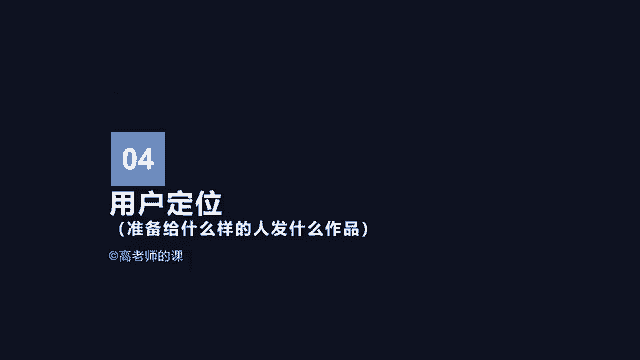
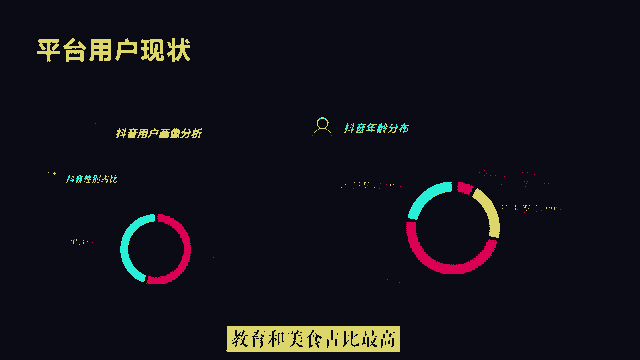
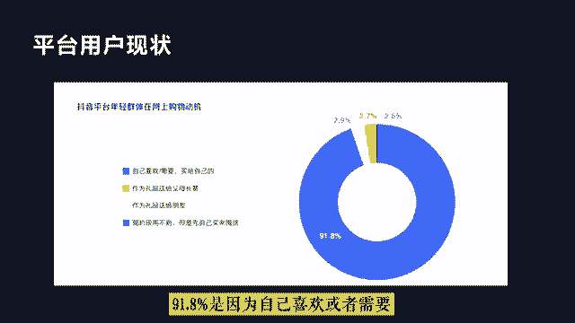
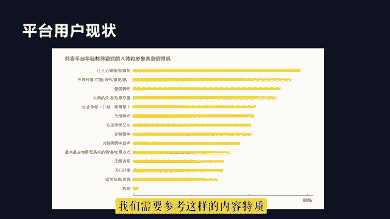
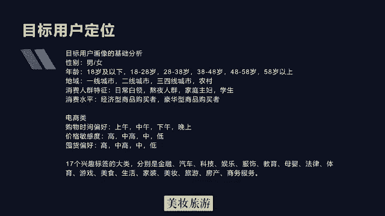
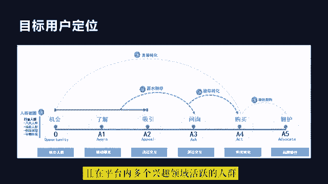
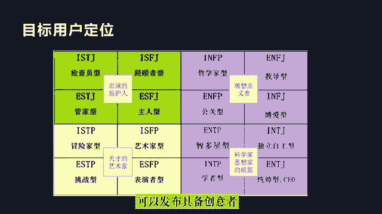

# 2024年做抖音怎么快速起号？3天养出一个高权重抖音账号，掌握这7点，抖音快速养号小技巧！ - P6：4.用户定位 - 悟空看天空 - BV1E9s5e8ED1

好，同学们，下面我们来讲用户定位。用户定位就是我们要思考我们准备给什么样的人发什么样的作品。我们可以考虑一下，在抖音中用户刷到你的作品的过程。首先，创作内容作品，并在抖音中发布。然后呢。

抖音通过对账号和作品的综合分析，再结合用户刷视频时，感兴趣的内容相关性。将你的视频推送给感兴趣的用户，用户在刷到你的视频时，会根据自己的观感体验，进行观看、点赞、关注、评论或者转发的操作行为反馈。

抖音根据这些行为反馈，再将视频推送给更多这样的人，这就是一个热门视频的来历。所以想要创作出热门视频，首先需要对你的目标用户进行分析。当然，我们做抖音终极目的是为了变现，并非一味的追求视频的热度。

但视频播放量是变现的前提。因此，我们在分析目标用户时，也要将核心用户的商业价值考虑进去，针对你的核心用户将你的视频内容的价值进行拆解，针对不同的维度进行精细化的策划设计。

这样才能最大限度保证你发布的视频吸引到的核心人群是精准的。

好，首先我们了解一下抖音平台用户的现状。在抖音中，大部分是什么特征的人在使用抖音APP呢？抖音的日活用户已经突破7亿，人均使用时长超过2小时。所以在抖音中，无论在任何时候。

任何地点以及任何行业都有大量的用户在活跃。但是从总体来说，抖音的用户具备什么样的特征呢？首先，抖音中，女性用户占比55%，年龄在18到30岁之间的占比71%，超过60%的用户分布在一二线城市。其中。

教育美食、旅游搞笑和娱乐的兴趣偏好是总体兴趣偏好的top5。教育和美食占比最高，分别是25%和727%。另外，在抖音中，年轻群体的网上购物动机91。8%是因为自己喜欢或者需要买给自己的用户。

而且在抖音中，这部分年轻群体喜欢的人物和形象具备的特质，也有以下几个类型。首先，多数是让人心情愉悦或者是搞笑的，其次是颜值控，也就是好看可爱漂亮的等。然后是具有爱国情怀，具备社会正能量的。

还有就是认真生活，认真处事态度的等。因此，在创作视频或者打造人设时，我们需要参考这样的内容特质。

好，如何定位我们的目标用户呢？我们在定位目标用户时，可以通过行业竞争对手或者对标账号来获取参考用户数据，也可以通过线下或者是过往企业消费者的数据进行统计。对于目标用户画像的基础分析。

应该从以下几个方面来进行性别有男和女年龄可以划分为18岁及以下、18到28岁、28岁到38岁、38岁到48岁、48岁到58岁、58岁及以上。地域的话。

可以划分为一线城市、二线城市、三线城市、四线城市消费人群特征可以划分为日常白领、熬夜人群、家庭主妇、学生。消费水平的话，有经济型商品购买者，也有豪华型商品购买者。

如果是电商类的还需要考虑消费者的购买时间偏好，价格敏感度，囤货偏好。购物时间偏好有上午、中午下午、晚上。价格敏感度可以分为高中高中低，囤货偏炮可以分为高中高中低。从用户兴趣方面来说。

抖音对视频观看者做了17个兴趣标签的大类，分别是金融、汽车、科技、娱乐、服饰教育、母婴、法律、体育、游戏、美食、生活、家装、美妆、旅游、房产、商务服务。

另外，对于品牌商家来说，抖音又将用户进行了5A人群分层，分别是A一了解感知阶段。也就是我知道阶段，顾客是被动接收信息，是品牌知名度主要的来源。A2吸引吸引阶段，也就是我喜欢阶段，增加顾客的品牌意向。

创造短期记忆或扩大成长期记忆。A3问询询问阶段，也就是我相信阶段，适度引发顾客的好奇，引发顾客收集信息的行为。A4行动行动阶段，也就是我购买阶段。

想要让顾客采取的行动是购买以及购买之后的消费、使用以及售后服务。A5拥户拥户阶段，也就是我推荐阶段，顾客可能会发展出对品牌的强烈忠诚度，这会反映在顾客保留率，重复购买以及向其他人宣扬品牌的好处上。

A一人群是被动人群，对品牌有感知，但这群人是未有进一步互动的人群。品牌多次触达，形成深度认知后会进行互动。A2人群是轻交互人群，已经形成品牌印象，被品牌创造短期的记忆多次立体触达后会采取进一步互动。

或形成长期记忆。A3人群是深度交互人群，被引起好奇，引发客户主动收集品牌相关信息的行为，是最接近成交转化的一环，转化率最高，只差临门一脚形成转化，是高价值的人群。A5人群是品牌私域用户，关注品牌账号。

发表正面评论以及转发品牌信息等用户，除以上人群外，还有一部分最大的人群就是潜在的人群O人群及有相关行为且在平台内多个兴趣领域活跃的人群，等待被吸引注力的人群。

除以上人群划分的维度外，我们还可以从婚否、家庭、职业收入、资产等方面对用户进行描述。当然，如果某些行业以上信息数据获取有难度，也可以从用户人格方面进行描述。这样对内容的产出也具有一定的指导意义。因此。

我们可以依据分型人格分析图来进行。针对不同类型的人格特点，我们可以有针对性的产出不同的内容，例如，忠诚型人格的人，小心谨慎，多疑虑，偏保守，发布的视频内容要具有真实感，而且要接地气。

这样会更容易收到这类人的青睐。理想主义者偏感性，视频内容多以情绪价值为主。艺术家型人格的人更愿意接受新的体验，可以发布具备创意者或者挑战体验型的内容。学者型人格的人，对于知识类的内容可能会更感兴趣。

而而且更愿意互动。

うん。