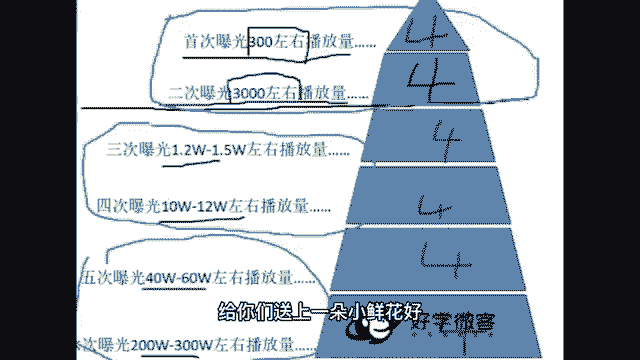
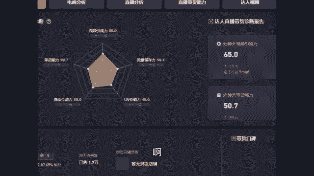

# 2024年做抖音怎么快速起号？3天养出一个高权重抖音账号，掌握这7点，抖音快速养号小技巧！ - P8：5、如何上热门 - 大叔只会干活 - BV1UwvDeTEaJ

怎么热门引流呢，都想上热门，来看一下上热门的因素对吧，什么因素取决于你的视频能不能火起来呀，就这四个因素呃，前三个我相信我不用给你们讲，你们都知道来，第四个我着重讲一下完播是什么意思。

完播就是别人把我们的作品从第一秒钟看到，最后一秒钟，从头到尾看完了就叫完播，你想抖音视频千千万能给咱视频看完，那证明咱视频肯定好，他肯定喜欢咱啊对吧，不然他看一半就走了，那么有的同学说。

老师既然完播挺重要的，我可不可以拍视频，拍的短一点，我就拍三秒钟，这样别人一下子就看完了，我是不是能火呀，呃格局小了，他的确给你看完了，但是他如果不给你评论点赞啥的，那也没用啊，光看完没用。

这四个都很重要啊，这是取决于你上热门的评论点赞转发完播，那么接着你的流量是怎么来的，什么叫上热门，上热门不就是你的播放量特别多，这就叫上热门，那么你的播放量是怎么来的呢。

来这张图是我们自然流量池的一个图，咱抖音给咱流量，不是从第一个一直给给给给给，给到咱上百万个流量，他不是这么给咱的，他怎么给咱啊，哎来哎跟老师我一起来看一下啊，他是这么给咱们的，就是我们班每一位同学。

你发布一条视频出去抖音啊，都会给我们300左右的播放量，可能有的同学是呃一两百，有的同学可能是四五百，就是300左右，然后我们在这个播放量里面，那四个评论点赞转发完播四个数据都不错，那么恭喜你。

你就会获得第二次曝光，他会再给你3000左右的播放量，但是在3000左右的播放量里面，你那个评论点赞转发完播不咋地了，唉那么老师我很遗憾的告诉你，你的播放量就只有3000多，就不会再增加了。

必须是这四个东西，你看这四个评论点赞转发完播一直都很好，他会接着给你1万多，10万多，40多万，两三百万的播放量，咱播放量是这么来的，那么你们现在都处在第几层流量池啊，可以告诉老师一下。

是不是大部分同学都在一和二啊，这个播放量可能偶尔作品好了一点，是不是来到第三层和第四层了呀，都是在什么情况呀，也可以分享一下啊，还是很希望咱们大家努努力，咱不要老在上面飘着。

咱们争取来第五层和第六层播放量转一转啊，都可以加加油，给你们送上一朵小鲜花好。

那么老师接着带咱们班同学往后看了啊。

嗯既然我们已经知道了呃，播放量是怎么来的，也知道热门是需要哪些因素才能上的，那我要问一个问题了，就是咱们班同学有没有投过斗家的同学呀，投过抖家的同学，公屏上给老师，我扣个一，我看一下。

看咱们班同学多少人花，花过钱，为抖音花过钱的扣个一啊，然后投过抖家的同学接着再回答我一个问题，就是你觉得投了之后呃，以他是对你来说有帮助还是没有帮助，有帮助的，扣个有没有帮助的，扣个没就行了。

我看一下啊，包括有的同学不知道斗家是啥，斗家就是嗯你给抖音给抖，给抖音花钱，抖音让你的作品被更多人看到，就是给他充钱，有的十个同学里面可能有七个同学说没有用啊，有浏览量，有浏览量量不叫有用。

那个浏览量是你花钱买的，你只要给他充钱，他都给你浏览量，那个不叫有用，什么叫有用，你充了抖加他给你涨很多粉丝，涨很多点赞，那才叫有用，光涨浏览量不叫有用啊，来仔细听，不管你们投没投过。

老师帮你解决这个问题之后，别乱花钱啊，咱们抖音有两个流量池，一个叫自然流量池，就是咱刚才看的那个图片嘛，你的作品好，这四个数据好，给你更多流量，数据不好就给你300多，还有一个流量池叫做抖加流量尺。

这这两个流量池啊，它是平行的，它不是叠加的，有的同学哎就是说给斗家充钱了，唉斗家给我流量了，觉得诶是不是有用啊，不是他是一个商人，你给他多少钱，他给你多少流量，而且你俩是明码标价，谁也别欠谁的。

他绝对不会多给你，自然流量池，就是你数据好，他多给你，那么我们能不能靠抖加上热门呢，嗯我也不知道能不能，我告诉你一个数据，你自己来判定，你觉得能不能啊，就是一个普通的作品，你想靠单纯的投抖加。

而不是靠视频质量，想让它播放量达到几10万上百万，上到热门的话，你需要投16万人民币，那你觉得他能不能帮助你上热门，我觉得如果我们都是大土豪的话，那斗家能帮咱们上热门，不就投16万吗。

但如果我们都是普普通通的，那神经病才会花16万投豆家呢，所以可能对于咱们来说，他没法帮咱们上热门啊，那么如果你真的想要投抖加，你怎么去投，不要胡乱投了啊，来这样去投，你发了一条作品，你先别着急，投抖加。

你先隔半天或者第二天你看一下，结果到了第二天，你发现他只给了你300左右的播放量，证明什么，证明你数据不咋地，别人不怎么喜欢看这种作品，你就别投抖，加了他对你没有任何帮助，那么接着哪种作品适合投抖家。

还是一样，先发呃，先发出来，先别投抖加，然后过个半天，过个第二天看一下，如果说他给了你，包括说1万多的播放量，给了你10万多的播放量，证明什么，证明别人喜欢看这个作品，这个作品好，那这个作品好的话。

你再花钱投抖加效果一定不错，斗家它就是只能给你起到锦上添花的效果，就是你这个东西本身好，它能让你更好，如果你这个作品不好，你投了抖家，你就是拿钱砸水漂，你连个水漂动静都听不见来。

这一点能够明白的同学在公屏上给老师，我扣个明白两个字啊，确保咱们是知道怎么回事了，包括说后期老师我会告诉你，咱们如何撬动自然流量池，如何通过把作品做好，它给你更多流量，而不是说我们只是盲目的充钱想火。

