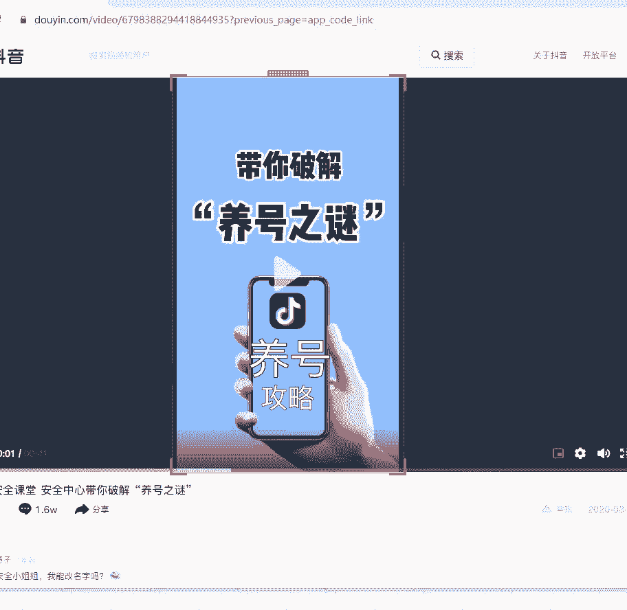
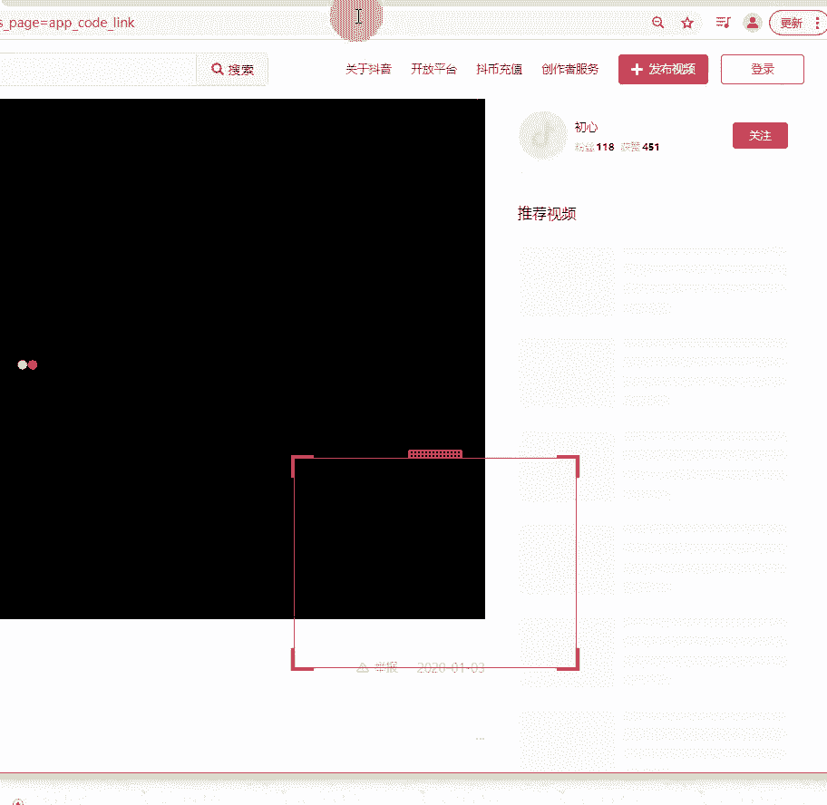
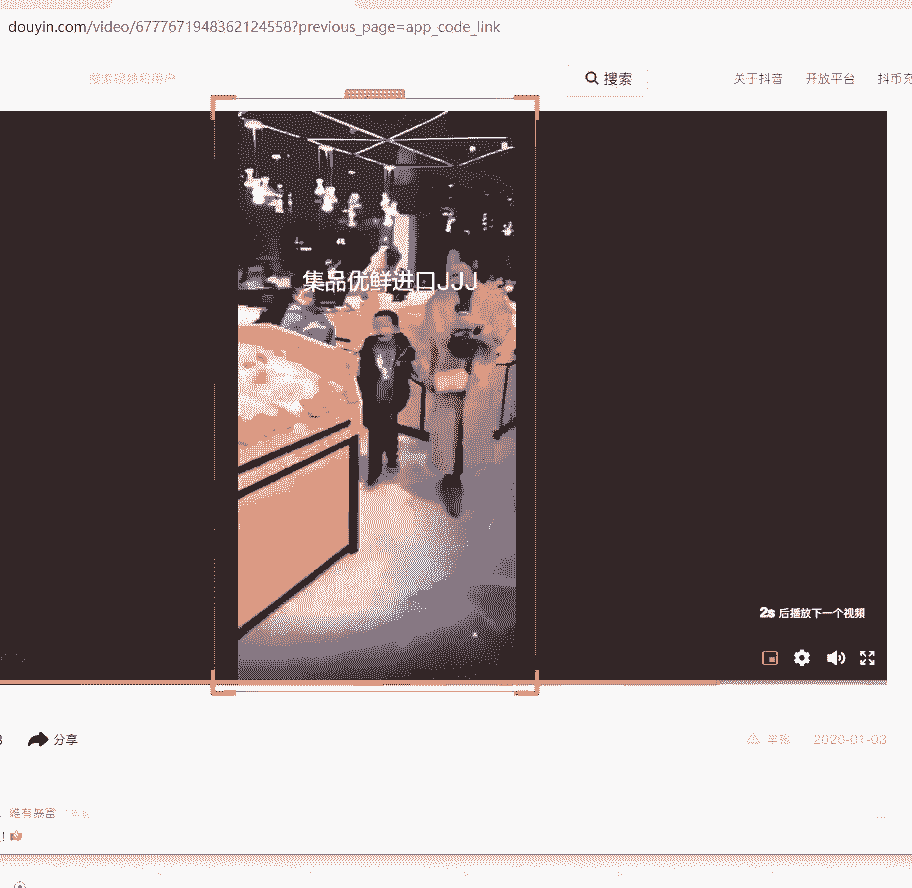
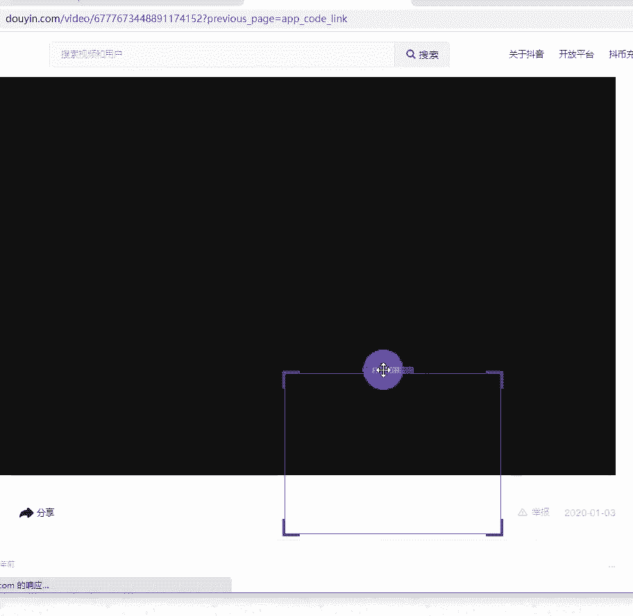
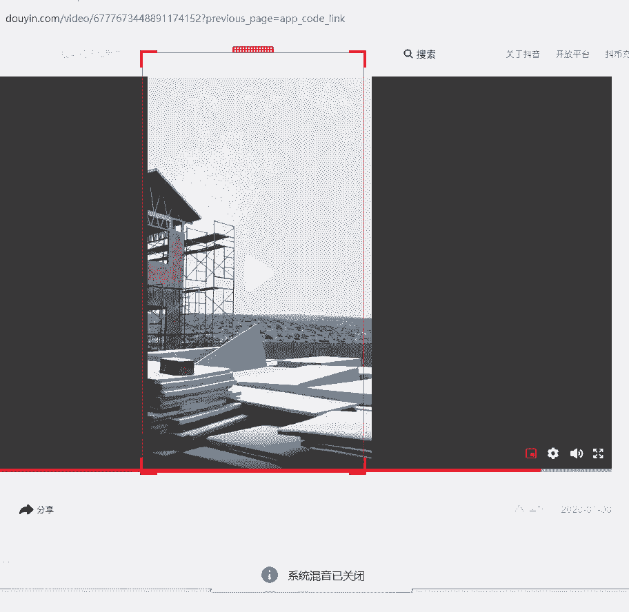

# 2024年做抖音怎么快速起号？3天养出一个高权重抖音账号，掌握这7点，抖音快速养号小技巧！【短剧推广】 - P10：6账号搭建与雷区规避 - 我从山中来带着大宝剑 - BV1ZCtBeNE8r

好各位同学晚上好，现在能够听到老师的声音，并且能够看到画面的同学在评论区扣个一，可以听到我的声音，并且能够看到画面的同学扣个一好，声音和画面都没有问题的话，就截一张图啊，截一张图发给你的指导老师啊。

这个上课签到是要截图发给你的指导老师的，哦切记得截图啊，记得截图，好部分同学说没有听到声音的啊，嗯听不到声音，也听不到我说话，退出重进一下退出，好听得到是吧，有声音没有画面吗，咋没声音啊。

没声音的同学啊，这句话是放给听不到声音的同学看啊，其他同学不用管啊，其他同学不用管，这句话是放给听不到声音的同学看的好吧，今天我的声音是正常的吧，没有像啊上一节课这种情况了吧，啊好正常是吧，好好。

呃那先来回顾一下上一节课讲到的啊，上节课呢我们主要讲的是一个领域定位优选好，我现在来简检查一下各位同学，上节课的作业做的怎么样好，在评论区告诉老师，你们定位好领域了吗，你们定位好领域了吗。

可以直接把你定位的领域打在屏幕上啊，让我了解一下，嗯好我看到了有影视啊，有知识口播啊，影视唱歌对口型，花艺制作啊，影视影视还是比较多的啊，情感励志啊，影视剪辑还是啊影视音乐唱歌啊，可以可以哈。

好非常棒啊，非常棒非常棒好，如果说啊如果说有部分同学就是听了上一节课，觉得自己还是没有办法定位的话，我告诉大家啊，定位首先第一点要从自己的实际情况出发啊，从实际情况出发，第二点就是说你看一下。

你是想要自己去拍摄素材，做依次剪辑呢，还是做二次剪辑啊，就是说你要做一次创作还是二次创作，就是在你不确定的情况下，你先考虑好这个大方向，我们先找到一个大方向，然后再把这个大方向往下面细分啊，往下面细分。

那么当你选好了，我是要做依次创作，所谓依次创作就是说我要自己去拍视频啊，自己拍视频，然后进行剪辑，二次剪辑的话是去网上下载素材进行剪辑，这个称之为二次剪辑啊，如果你现在还不确定。

具体要做哪个领域的情况下，那你先把这个大方向确定好，你是要做一次创作还是做二次剪辑啊，如果说你要做一次创作，那可能又会分为两种情况，那可能是是要真人出镜的呢，还是不是真人出镜的。

就是你可以慢慢的去给他细分啊，最后找到适合你自己的领域啊，最后找到适合自己的领域好，再强调一次啊，定位领域一定是从你的实际出发啊，你自己是个什么情况，你自己最清楚，所以说定位领域这件事情呢。

嗯你的指导老师只能够给你提一些建议啊，给你提一些意见，但是它不能够决定你做哪个方向，因为最终啊要去做这个事情的人是你自己啊，最了解你自己的情况的人也是你自己，所以说你的指导老师只能给到建议啊。

他会根据你的实际情况去建议你的啊，不会盲目给你建议啊，肯定是根据你的实际情况去给建议的，好吧好，那么我希望啊就是今天还没有定位的同学，一定要抓紧时间定位啊，还有就是如果说你是今天刚刚进到课堂的同学。

那也不用着急啊，就是一定要问你的指导老师，去要前两节课的录播啊，一定要问指导老师要前面的录播，然后抽个时间啊，把前面的录播都看一遍，因为定位的话是非常重要的啊，定位非常重要。

那么我们今天这节课来讲的是一个抖音，账号的搭建与雷区规避，这个就是当你的账号定位好领域之后，要做的第二步操作就是账号的搭建好，那么在做账号之前啊，相信很多同学都会遇到一些问题，什么问题呢。

首先就是很多同学会疑惑啊，这是我从你们的指导老师那里了解到的，首先第一点就是说，你现在的这个账号还能不能用啊，就很多同学会担心说啊，老师我的账号之前啊，就是可能看了很多其他奇奇怪怪的东西。

或者是比较杂乱啊，那我现在这个账号还能不能用啊，第二个就是关于活跃账号，活跃账号这个问题呢，其实很多同学可能在抖音的一些直播间里面，有听说过啊，活跃账号或者是养号的这种说法，那么怎么去活跃你的账号啊。

怎么去活跃你的账号好，第三个呢就是抖音平台不能发什么内容，其实上节课我也有问一些同学啊，就是有同学告诉我，他之前发作品违规了，那你是发了什么违规了呢，啊那什么不能发呢，我为什么之前发的作品会违规。

是因为你不了解抖音的规则啊，那么今天这节课就会告诉你，抖音平台不能发什么内容，就避免你以后发作品的时候出现违规的现象啊，好最后一个就是关于标签，好标签的这个说法的话，不知道大家之前有没有听说过啊。

做账号的话，这个标签还是非常重要的啊，非常重要的好，那么今天我们就带着这四个问题来学习啊，带着四个问题来学习，首先第一点就是关于，什么情况下账号会被限流啊，什么情况下账号会被限流好。

你们有没有出现过自己账号限流的情况，问一下大家，你们以前有没有出现过账号限流，没有啊，没有是最好的啊，没有是最好的啊，如果说有的话，那可能嗯就看一下，具体是因为什么原因导致限流啊，给大家看一下啊。

一般啊一般是这五种情况啊，这五种情况会导致账号被限流啊，不懂是吧，不懂更要学习啊，限流是什么意思，就是啊打个最直观的一个比喻啊，就是说比如说这个账号正常情况下，他发布一个作品。

至少是能够达到呃2万的一个播放量，但是呢他有一天突然发一个作品，他发现这个作品的播放量可能只有100左右了，就很显然这个账号就是被限流了啊，就这个播放量突然直线下降，我或者是说更加贴近大家一点。

就说平常作品发出去，正常也是有500左右的一个播放量，结果你今天发出去零播放啊，或者是说稍微情况好一点点，两位数的一个播放量，那么其实这种情况很显然账号就被限流了啊，账号就被限流了好。

首先啊账号限流有哪几种情况呢，第一种就是说视频违规，直接被判定限流，这种的话往往是会直接收到官方通知啊，那么这种官方通知给大家看一下啊，就是由官方给你发出来的，来看一下这上面啊这个小喇叭。

这个右下角写了一个官方啊，官方这个账号评级通知是抖音，官方给你发的啊，抖音官方发的好，首先啊还有讲到啊，你的账号被识别到广告行为过多，导致你的账号出现了问题啊，就说且搜索端暂时无法搜索该账号。

这个问题就非常严重啊，非常严重，因为别人都搜索不到你的账号，那你的作品别人就更加看不到了啊，更加看不到了，这就是第一种情况啊，视频违规直接被判定限流，如果说你的视频里面带了广告的话。

那绝对妥妥的会限被限流啊，被限流好，那么具体什么叫做广告营销呢，很多同学就是有时候，甚至在自己的视频里面带上了广告，有一点不自知的这种情况啊，那什么情况下出现广告营销啊，好给大家看一下什么是广告营销。

大家看第一啊，如果说你的账号不是企业蓝V号啊，就是这个蓝V账号，大家通俗来讲就是这个蓝V账号，那么它其实叫啊学名叫做企业认证号啊，如果说你不是这个企业认证号，然后你直接在视频里面展示了商家的地址。

商家的联系方式或者是二维码这些信息的话，那你的这个视频妥妥的啊，被认定为广告营销，如果说你这个账号啊，为什么有些我之前就有遇到啊，有些同学说，老师为什么他的作品就可以发这些东西。

然后我一去看那个人的账号啊，人家开了企业蓝V的啊，开了企业蓝V的，就是这个企业号，它其实是有好处的，它就是可以让你在视频里面适当的带一些广告，这就是开企业号的一些权益，但是如果说你的账号没有开通。

企业账号的情况下，你是没有办法去打这些广告的，如果说你账号没有开通企业账号的话，你在视频里面啊放了电话号码呀，或者是微信二维码啊，或者是直接放这个微信号啊，就很有可能导致你的账号被限流。

因为平台就会认定为你的这个视频啊，就是一个广告营销的视频，所以说这种情况下，就会导致你的账号直接被限流好，这个是第一个情况啊，第二种情况呢就是视频中植入硬性广告元素，什么叫硬硬性广告元素啊。

就是广告呢一般分为软广和硬广啊，硬广就是直接把商品的打折信息，价格等直接放在视频上啊，比如说今天这个东西啊，限时抢购九块九，那这个就是很显然啊，你直接把价格都放在视频里面了。

然后你的这个账号并不具备一个打广告的资质，那你这样子的话，你的这个账号也会被判定为限流啊，这是第二种情况，就是直接在视频中植入一个硬广元素啊，硬广元素好，第三种情况呢就是视频内容啊。

视频内容本身是没有太多的问题，但是呢他并没有，就是比如说啊，有些同学，他可能想自己的产品并并没有什么商品链接啊，也没有网店，没有办法放到商品橱窗里，或者是放到抖音小店里，但是他又着急把自己的产品卖出去。

他就直接在抖音视频上面说啊，想要购买这个产品的宝宝可以联系我的微信，然后啪啪啪把自己的微信放上去了啊，或者说直接怎么怎么样，只要你在这个视频里面提到了微信两个字，哪怕你的二维码或者是你的微信号。

没有展示出来，你的这个作品都会被判定限流啊，你的这个账号都会被判定为广告营销号，这个就是一种非官方渠道的引流啊，非官方渠道的引流，那么我们到时候应该如何正确的去引流，这个后续的课堂上也会讲解到。

这个现在跟大家说出来，就是避免你们出现这种情况，想要引流也要用正确的方式去引流啊，好这三种啊，这三种就是属于广告营销啊，希望大家都要注意啊，就算你再着急去推销你的产品，再着急带货，也要避免出现这种情况。

好吧好，这个关于广告营销这一块，大家能够理解吗，理解就扣一啊，理解就扣一，关于广告营销这一块啊，好大家都能理解的话，我们就来讲第二种啊，第二种情况被判定限流是什么情况，被判定限流啊。

就是频繁的切换设备登录好，什么意思呢，这个也是大家平常会忽略掉的啊，大家平常经常会忽略掉，就是两个账号在同一个手机频繁切换，登录好，先问一下有没有这种操作的同学，就是有的同学说啊，我有两个抖音号呀。

我这个也要刷，那个也要刷，那我只有一个手机，那我就只能来回切换，有没有这样子的同学啊，有啊，我看到有一个同学说有啊，好这种同学也是不允许的啊，也是不允许的啊，看来有这种情况的同学还是比较多啊。

为什么会这样子呢，因为我们的抖音账号登录在一台设备上，它是会锁定IP的啊，什么叫锁定IP呢，就是大家想一下，就是平常哪些设备会存在一个IP地址呢，就比如说我们的电脑，我们的手机啊或是路由器。

它都是有一个IP地址的，但是如果说你同一个IP地址，有超过一个账号的话，他就可能会认定为你的账号就是营销号啊，他会觉得是一个人在操纵多个账号，他就会觉得你的账号是营销号啊，所以说这是第一种情况啊。

还有第二种情况呢，就是以一个账号换多个设备去登录啊，那么多个账号登在同一个设备上也不行，一个账号登多个设备也不行啊，希望大家牢记这一点，就是有些同学上来就跟老师说，老师你一个账号又只能定位一个领域。

可是我就是想做两个呀，我想做三个，我想做四个怎么办好，如果说你真的想要做那么多，首先给到的第一点建议，就是说你前期刚开始做账号，先专注做好其中一个啊，不要着急啊，你一个做好了之后。

那你第二个第三个还怕做不起来吗，大家想一下是不是这样子的啊，如果说你非要想啊，老师我就想一起做嘛啊我用四个账号一起做，那如果说你想要四个账号一起做，那你就要用四台手机去登这四个账号，千万不能说啊。

把四个账号登在同一台手机上了，否则的话，四个账号都有可能被平台认定为是营销号啊，希望大家记住啊，希望大家记住好这个啊，这个是大家平常会就是容易忽略的啊，容易忽略的就是频繁的切换设备登录啊。

这个大平常可能就是我因为我刚问了，我也看到大部分的同学都说有过这种情况，就这种的话，其实大家平常很容易忽略掉啊，因为你的账号呢，一旦被判定为一个广告营销号的话，被判定为营销号的情况下。

平台基本上不怎么会给你推流了啊，这个是第二点啊，第二点可能会导致账号被限流啊，第三个就是视频搬运被判定限流啊，现在抖音的审核规则呢是越来越严格了啊，如果说你是刚开始啊。

就16年抖音这个软件刚刚发行的时候，那个时候你去其他平台搬运作品啊，如果是非常火的作品，可能你也能火起来，但是现在不一样了啊，从2016年到现在的2021年，它已经过去很长的一段时间了。

所以说他的这个审核规则是不断在完善的，之前搬运也能火，现在是坚决不允许啊，你一搬运你的账号直接就废掉了啊，哦刚刚有同学说啊，刚有同学说什么，万一手机坏掉了怎么办啊，你看清楚啊。

这上面有两个有一个词语叫做平凡，什么叫频繁呢，就是我经常这么操作啊，我经常这么操作才会被判定，不是说你四五个月，然后换一个手机登录也会被判定，不是这样子的，是你经常这么操作才会被判定啊，好吧嗯，好好好。

其他同学收啊，不要去聊与课堂无关的话题了啊，好那么视频搬运被判定限流好，那么这一种啊，判搬运比较严重的情况下，也是会直接收到平台的一个通知的啊，这个也是官方给你发的通知啊，首先第一点抖音鼓励原创内容啊。

绝对是原创内容，这也是我上节课讲到的，为什么啊，我其实还蛮推荐大家，如果说有条件的话，可以去做这个VLOG账号，因为VLOG账号就是妥妥的原创啊，因为你拍的就是你自己，或是你家人的一个生活状态。

那绝对就是自己就是原创，就不存在说会出现搬运的这种情况啊，抖音是鼓励原创作品的，如果说你的账号被识别到搬运内容较多的话，那他首先会跟你说减少搬运啊，这个还是之前比较温和的一种提醒了。

现在他是直接跟你说啊，就会有大概多长的一个周期，完全不给你的账号一丁点的推荐，然后你还要去发多少个作品，符合他的规则之后呢，然后他再重新对你的账号进行评级啊，他重新评级之后。

你的账号达到了他的一个推荐的要求，他才会重新开始推荐你的账号，所以说希望大家千万不要去搬运啊，背叛搬运的话是非常非常非常危险的，因为甚至搬运次数多了，会直接导致账号被封掉啊，好什么是视频搬运是吧啊。

好如果说啊什么是搬运，看跟大家解释一下什么是搬运啊，跟大家讲一下有多种情况啊，有多种情况，首先第一点啊，就是未经他人允许将他人作品保存下来，发至自制自己的账号啊，其实这个不存在说经他人允许。

就算别人允许了，你直接去下载别人的视频，发到你的账号上，一样的也是搬运啊，一样的是搬运，就是说比如啊打个最简单的例子，就是说我在抖音上诶，我看到这个视频非常好啊，我想嗯自己把它下载下来，发在我的账号上。

然后我真的就这么去操作了啊，我就去把他的这个视频下载了，然后直接在我的抖音上点击加号，把这个视频发布出去了，好妥妥的，这个就是搬运啊，这个就是搬运好吧好，第二个嗯。

就是无版权无授权转载平台内或平台外的内容，就是第一个是你下载了别人的视频去发布，是搬运，第二个是转载也会导致一个搬运，因为你没有版权，没有授权的情况下去转载是不允许的，就现在有些博主啊。

他连自己的作品是否就是被转载，他都会设置一个权限啊，就是你必须获得他的允许，你才能转载他的作品，如果说他没有给你授权，或者是说一些影视作品，你没有版权的情况下，你就不能够去转载啊，不能够去转载。

搞清楚啊，这个版权包括这个授权是非常非常严重的啊，所以说有一些啊有一些原创视频的话，他其实是压根就不允许别人去转载的，他宁可不要这个转发量啊，他宁可不要这个转发量，因为你一旦转载的话。

后续很有可能就会被别人去搬运啊，被别人蹭热度蹭流量，然后导致有时候甚至会出现什么情况呢，本来的账号都还没有别人转载的账号，做的那么好啦，这个其实就是对这个账号主人的一种额伤害啊。

所以说你要转载别人的作品，你也要先看清楚他是否允许别人去转载啊，他是否允许别人去转载好，这个是第二点啊，第三点啊，第三点就是录屏的电影或者是电视啊，正在播放的内容，未经任何加工上传自制自己的账号啊。

看一直有同学在问啊，录屏算搬运吗，看清楚我的第三条内容啊，第三条内容就是说你录屏了，电影或者是电视剧啊，正在播放的一个电影或者电视剧，然后你觉得这个特片段特别精彩，然后你把它录制下来了。

录制下来了之后呢，你就直接觉得哎呀这个片段真的非常好，我觉得非常的完美啊，不需要任何的剪辑，直接把它上传好，妥妥的搬运啊搬运啊，这就是搬运好吧好，这是第三点啊，第四点就是搬运一些影视综艺啊。

或者是体育与赛事，包括一些外网的视频片段啊，所谓外网的视频片段，就是说他本身很多人就说那老师呃，这个版权应该只针对国内的视频吧，国外的视频应该没有关系吧，啊不一定啊，不一定。

如果说你直接用了外网的视频片段，并且是简单的二次内容创作，是什么意思呢，比如说给他加个背景音乐啊，给他换个背景啊，这个就是属于一个非常简单的二次创作啊，如果是这样子的话。

那你的这个账号也是被判定为搬运的啊，也是被判定为搬运的好，这是第四点啊，第五点，第五点就是说出现抖音平台之外的水印，或者是特效等元素啊，就是呃平台和平台之间是相互竞争的，大家应该都知道啊。

平台和平台之间都是相互竞争的，那你自己想一下，你如果是抖音的一个啊运营商啊，或者和一个快手的运营商，你们之间本来存在一个竞争的关系，结果你把印有快手水印的作品发在抖音上面去。

你说抖音平台会推荐你的作品吗，肯定不会啊，肯定不会，所以说就是发作品，千万不能够带有其他平台的一个水印啊，咳好，第六点，第六点呢就是冒充公众人物啊，或者是假办账号是公众人物，本人或者是公众人物。

工作室人员，经纪人员等等啊，这种情况下也是会被判定为搬运的，就是现在呢有很多人啊，就是很多明星，他可能就是开了这个自己的抖音号啊，但是有些人呢他就混淆视听啊，混淆视听什么意思呢。

就比如说这个明星本人他发了一个作品，然后呢他就依靠去搬运这个明星，他自己发本人发布的作品，然后把他稍微的二次剪辑一下，然后把自己的账号包装成明星本人啊，有这种啊，有这种这种也是严厉打击的啊。

严厉打击的这个也是搬运行为，好吧好，那么搬运啊，搬运一共包括这六种情况啊，一共包括这六种情况，好前天嗯看到有一个叫马云的，应该是假的，怎么还能看啊，但是你要看清楚，有一些账号他虽然现在确实还存在。

但是基本上啊其实很多账号你都可以看到，如果说他是冒充这个名人本人的话，他的账号基本上更新的作品也非常少啊，甚至不排除人家会啊，就是花钱让自己上热门的这种情况啊，都是有可能的，好吧好。

这六种情况都是属于搬运啊，如果说大家记不住啊，大家记不住，就是我只讲一遍的话，想要全部不记住，可能还是有点困难，所以说大家可以截图保存一下啊，可以截图保存一下好吧，啊就记不住啊，可以截图保存一下好吗。

好截好图就可以扣个一啊，截好图就扣个一，因为内容稍微有点点多啊，内容稍微有点点多啊，跟大家讲什么是搬运，其实就是希望大家以后不要出现搬运的行为啊，希望大家不要出现这种情况，因为搬运跟大家讲。

你一个作品被判定为搬运，影响的是你整个账号啊，一个作品被判定搬运影响的是整个账号，而不是说只是这一个作品受到影响，好吧好，这是第三点啊，第四点就是一个淘宝刷粉，朋友圈刷粉啊，刷粉刷赞啊。

刷粉刷赞都是不允许的，好听说过刷粉吗，问一下大家有没有听说过刷粉的，大家在今天啊，今天这节课之前有听说过抖音刷粉吗，有啊没有好吧啊，也有没有的啊，不懂是吧，嗯什么叫刷粉啊。

刷粉就是说哎呀我的账号粉丝太少了啊，看着一点都不好看，我去淘宝上啊，或者是看到朋友圈有人打广告，哎我花个五块钱，十块钱让他给我刷个几千粉丝这种啊，这是属于刷粉啊，或者是花个十几20块钱让他给我刷点粉丝。

让我的账号的粉丝看起来多一些啊，这个就是属于刷粉行为，哎呦刷赞啊，就是我的这个作品发出去了，哎怎么没有人给我点赞啊，我花花一点钱让别人去给我点赞啊，这个就是属于刷粉刷赞行为啊，甚至还有刷播放量的。

刷播放量的，就是说哎，我的作品一直都只有500左右的播放量，唉播放量太低了啊，我花点钱让别人帮我刷这个播放量吧，啊让我的数据好看一些好，这些都是违规的啊，这些都是违规的，一旦被平台检测到。

那你的账号就直接被限流啊，所以说大家千万不要去相信啊，去相信什么刷粉啊，或者是刷赞，千万不要去操作啊，千万不要去操作，好吧好，最后一点，最后一点就是说作品不符合斗家投放要求啊，作品不符合斗家投放要求。

那你的这个账号也有可能是被限流了啊，也有可能是单纯的，因为这个作品导致你的账号被限流啊，就是当什么叫投抖加，就是说当你点击上热门的时候，出现该视频内容不符合抖加投放字样，或者是说直接显示这个视频搬运。

以及不适合传播，这种时候你的账号都是被限流了啊，因为它出现这个内容，就说明你这个视频违规了啊，你投抖加的时候啊，它出现这个显示说什么视频不适宜公开呀，或者说不适合传播呀，或者说你这个视频有搬运行为啊。

就很有可能就是说你这个视频里面，就有违规状况了啊，出现违规了，所以说这种情况你的账号也是会被限流的，因为你的作品违规了啊，作品违规了，咳好这个呢就一共是啊五点，关于账号啊被限流的一些情况啊。

就是讲这个其实主要就是跟大家说啊，跟大家说，希望大家以后自己做作品的时候啊，自己做账号的时候避免出现这五种情况啊，避免出现这五种情况，甚至很多时候啊，你在不确定自己的账号，是不是被限流的情况下呢。

你可以长是去投放抖家，其实大家不要把这个抖家想的啊，其实抖抖家跟很多你们在抖音上刷到的，说的那些其实他不一样的啊，他不一样的，不是像那些人说你一个作品投了抖，加其他不投的话，你的账号永远起不来。

不存在啊，不存在，甚至我可以告诉大家，就是很多人，我你们应该在一些直播间里面听到啊，我五天涨粉100万的那种，我告诉大家都是投抖家投出来的，真的啊，这个是是事实，比如说五天涨粉啊，发五个作品就涨粉了。

额500万的那种，绝对是投抖家投出来的啊，他甚至投的不是小钱，是大钱啊，一天可能就会花好几千出去的那种，所以说希望大家不要觉得就是投抖家这个事情，其实这个是很正常的。

但是说如果说你嗯不了解投抖价的一个规则，随意去投放的话，确实是没有太多好处的，我们就算以后要投斗架，也要找一个恰当的时机去投啊，恰当的时机去投，好吧好，那么这五种情况啊，希望大家都记住。

以后自己不要出现这些情况，好吧好，那么下面再来讲一下一些常规的啊，常见的一个违规类型啊，常见的违规类型，听不清楚了吗，啊听不清楚吗，其他同学告诉我一下，声音正常吗，啊听得清楚是吧啊。

头抖加是什么意思是吧，头抖加简单粗暴的说就是花钱买播放量啊，花钱给作品买播放量啊，就这个意思啊，简单粗暴的理解就是花钱啊，把钱投给抖音啊，让抖音去推送加热推送你的作品，就这个意思啊。

下面来讲一下啊一些常见的一个啊违规类型啊，常见的违规类型，一个就是含有一个广告啊，含有广告是肯定的，第二个呢就是背叛搬运，还有第三种啊，第三种就是永久封禁啊，永久封禁这个封账号啊，我跟大家讲。

不是说你的账号犯一次错，他就会给你永久封禁，他是慢慢起来的，就是不会说除非你是重大错误啊，重大错误就会一次性直接给你封禁，但是像搬运，其实搬运这个事情呢，你说大不大，说小不小，为什么这么说呢。

因为你第一次被判搬运的话，他可能是说哎给你账号封个七天啊，或者是说你的账号是广告营销的话，可能第一次给你封个七天啊，你第二次还犯，那可能就给你封个一个月啊，好你第三次犯可能就会给你永久封禁啊。

永久封禁的话，他其实也不是说一上来就会永久封禁，大家也不用太过谨慎，但是还是要仔细一些啊，还是要仔细一些，好吧好，第第四个呢，就是刚刚说的不符合抖加投放标准啊，说到这个斗家，有些同学之前可能就投过。

也有点了解，那么大部分同学应该都是没有投过斗家的，斗家啊，简单粗暴地说就是花钱让自己的作品上热门啊，花钱给自己的作品买播放量，这个钱是花到哪里去了，给抖音了啊，给抖音了，就这么去理解啊。

还在问斗掐是什么啊，我刚已经说了啊，斗掐就是简单粗暴的说，投抖加就是花钱买播放量好吧，花钱买播放量啊，或者是说花钱买粉丝也可以啊，因为他有两种方式啊，有两种方式去投放，一个是呃增加作品的一个啊曝光度。

就是增加作品的一个播放量，还有一种就是增加账号粉丝的啊，它有两种方向去投放的，就是说看你自己选择哪种，简单粗暴的说就是花钱为自己的账号买流量啊，花钱为账号买流量，就是这样子的，第五种就是一个啊刷粉行为。

刷粉行为，这是我刚说的啊，花点钱啊，感觉自己账号粉丝太少了，我花点钱刷点粉啊，就这样子好，这些情况啊，这些情况都是大家以后做账号都需要避免的啊，都需要避免的，就是说你们之前都没有这种情况是最好的啊。

你们之前没有出现过这种情况，当然是最好的，那么嗯后续也要保持啊，后续也要保持，不要出现这些情况，好吧好，这个就是关于账号啊，出现一些哦，可能会出现就导致账号违规的一些情况，如果说你之前有出现过了。

那以后就避免啊，如果说你之前还没有出现过，那以后也要注意，好吧啊好嗯，下面啊，下面主要就是来讲一下，刚开始说到的一个标签啊，如何知道你的账号有没有被平台触发标签啊，标签花钱买流量不不违规啊，不违规。

好吧好，那么标签好，先问一下大家，在今天这节课之前，大家有知道账号会有标签这回事吗，有没有同学知道的，知道啊，有知道的，不知道啊，不知道的居多啊，我看了一下啊，不知道的居多，那么首先来看一下啊。

什么叫标签啊，什么叫标签，比较简单的来讲呢，就是说平台把你的账号归类为一个类型啊，什么叫把你的账号归类为一个类型呢，什么意思呢，就是说你的这个账号，比如说哦你从一开始你就只关注影视剪辑领域。

你每天看视频，刷视频，你也只刷影视剪辑领域，你关注的账号也是影视剪辑领域的账号，你发作品，你发的也是影视剪辑的作品啊，一直这样子坚持去做啊，当然你的作品肯定是要呃，不断的有质量上面的一个提升啊。

就是作品质量肯定是要过关的，那么你一直一直持续这样子去做的话，那么最后平台就会把你的账号归类为一个，影视剪辑的账号啊，这个就是标签，就是给你贴上标签，其实就是把你的账号进行了一个归类啊，进行了一个归类。

好，我刚刚这么解释了一遍，大家听懂了没有，就说关于这个标签啊，关于这个标签我刚这么解释了一遍，听懂了没有，好知道了是吧，好，这个就是标签啊，标签啊，强调一下啊，标签呢不是一朝一夕就能养成的。

不是说我前面活跃了几天账号，我就有标签了啊，没有那么快啊，标签还是需要有时间的啊，需要有时间好，那么怎么给TP账号贴上标签啊，好什么时候平台给你贴上标签，首先是一个长期的过程啊，长期的过程啊。

咳有些同学说啊，老师我感觉我的账号被贴上标签了啊，那这个时候呢其实你要认真的看一下你的作品，作品有发垂直吗，关注的账号是都是同一个领域吗，发布的作品是啊同领域里面的优质作品吗，所以说很多同学说啊。

老师我之前发了很多作品，我的账号有没有被贴上标签呢，那你先看一下之前发的，是不是同一个类型的作品啊，很有可能之前有些同学发的，根本就不是同一个类型的作品，虽然发了很多，但是很杂乱。

那你的账号也没有标签啊，咳好这个是啊，关于贴标签啊，贴标签怎么看是吧，会讲到的啊，会讲到的，那么这个再讲一下啊，在讲怎么看标签之前，先说一下标签有什么作用啊，标签能够让你的账号持续被推荐，什么意思呢。

就是当你的这个账号，比如说啊就是按照我最开始说的这个例子啊，被贴上了一个影视剪辑的标签之后，平台后续不会漫无目的的去推荐我的作品，为什么，因为我的账号已经触发标签了，那他就只会把我的账号推荐给。

喜欢看影视剪辑的用户，他会给我精准的去进行推荐啊，就会让你的账号持续获得精准推荐，这就是触发标签的一个好处，这也是为什么我们在做账号的时候，老师一直会强调一个垂直度的问题，也是因为这个标签啊。

也是因为标签，因为只有了有了标签之后，你的账号才能够获得一个持续的推荐啊，最后再来讲一下啊，大家都很关心的，我怎么看我的账号有没有被贴标签呢，啊首先啊方法呢有两个啊，方法有两个。

但是这个方法还是仅供参考啊，仅供参考，首先第一个就是抖音搜索这个创作灵感啊，看推荐的是否为同领域的类型，如果说视同领域的类型，那就是被贴上标签了啊，贴上标签了啊，比如说啊比如说就在这里啊。

就是你搜索了一个创作灵感，就在抖音里面啊，搜索一个创作灵感，如果说下面出现的就是都是同一个类型的话，那就说明你的账号被贴上标签了，但如果说都不是一个类型的，那很显然账号没有被贴标签啊。

这是第一种看标签的方式好，还有第二种呢就是用另一个账号去看你的账号，就是用别人的抖音号去搜索你的抖音号啊，一般在这个关注的右边，可以看到一个倒三角形的标志，那么点开这个三角形的标志啊。

弹出来就是可能感兴趣的啊，他会下面会有一些弹出来感兴趣的人，如果说弹出来的人是同领域的账号的话，那说明你的账号就被贴上标签了，如果说弹出来的人可能是通讯录好友啊，那你的账号就还没有被贴上标签啊。

比如说就是嗯这个页面啊，用别人的账号去搜索你的账号啊，这个页面是别人的账号，去搜索你的账号的一个页面啊，在这个关注的右边，有一个这个倒三角形的标志啊，你把这个地方点开点开的话。

他一般会给你推荐其他的几个账号，如果说啊推荐的那几个账号，和你的这个账号是同领域的，就比如说啊假设啊我先是打个比方，假设这个账号是做呃一个萌宠领域的啊，假设他是做萌宠领域的，那么如果说后面推荐。

就是你点开这个倒三角的标志，下面出来的账号也全部都是萌宠领域的话，那就说明这个账号就被贴上标签了，好吧这么说大家能理解吧，能理解吗，就是怎么看标签，理解吧啊理解就扣个一啊，或是打个理解，啊好。

这个就是你们呃今天这节课结束之后啊，都是可以去看自己的账号的标签的啊，都是可以去看自己账号的标签，就是要用别人的账号去搜索你的账号啊，要用别人的账号去搜索你的账号。

就是你自己是没办法在自己的账号上看到的啊，自己在自己的账号上看到的话，可以用上面这种方法，可以用上面这种方法，就是直接去搜这个创作灵感，然后如果说搜这个创作灵感，看推荐的都是你这个同领域的话。

那就说明被贴上标签了啊，如果说不是，那就没有啊，就是两种方法，两种方法咳，标签肯定是平台给你贴上的啊，标签肯定是平台给你贴上的好吧，那么这两种看标签的方式呢，它其实也是仅供参考啊，仅供参考。

为什么这么说呢，因为标签这个东西毕竟是平台给你贴上的，真正了解你你账号数据的，那也是平台最了解啊，就是我们很多人说啊，老师我想看权重啊，老师我的这个账号能打多少分，这些数据啊，你的账号的具体数据。

真的是只有抖音内部才能看到的啊，就很多嗯，包括现在，现在已经出现了各种各样的第三方平台啊，就是如果说大家比如说在之前在其他的直播间，可能听说过什么抖抖侠呀，抖大大呀这种啊，微信小程序你们可能都有听说过。

就是说啊在这个上面可以查到账号权重啊，我的账号权重查出来怎么这么低啊，啊不应该呀，怎么怎么样啊，甚至是它上面还会告诉你，哎你的这个账号的标签是什么什么，我告诉你大家啊，这个查出来都不准确啊，都不准确。

那么其实老师说的这两种方法呢，哈更贴近一些啊，它更加贴近抖音数据一些，因为这个是直接在抖音平台去进行查看的，那么比如说你们像用啊什么抖抖侠，抖大大这种第三方的小程序去查看的，这个数据真的是仅供参考啊。

千万不要太当真了好吧，希望大家注意啊，如果说啊我解释了两遍都还不知道这个标签啊，怎么去查看的话啊，可以课后再看一下啊，录播课好吧好，这个是关于标签的一个问题啊，关于标签的一个问题好，那么讲完标签。

我们接下来讲一下养号，大家听说过养号这种说法吗，听说过养号吗，没有听说过有有听说过啊，因为在一些抖音直播间里面过啊，他其实经常会有一些主播会讲，那么这个养号啊，要不要去养号啊，我们看一个官方的通知啊。

这个官方通知呢是抖音官方的一个视频啊，给大家看一下，声音给大家打开啊。

官方带你破解养号之谜，江湖上流传着很多关于抖音养号的说法，首先要告诉大家的是，所谓的养号是不存在的，一些营销号发布关于如何养号的内容，常常包括个人资料的修改，如何浏览视频，点赞关注评论。

养号的周期和时长，以及账号检测养号和不养号的区别，其实大家明白，这个过程就是一个正常的用户行为，大家点赞关注以后，算法会记得你的喜好，并在下一次根据你的喜好，去推送相应领域的内容，抖音平台以内容为王。

持续发布优质的内容，才会使作品保持更高的流量哦，关注安全中心不迷路，你还想知道什么，赶紧评论下方留言告诉我们吧，这一个视频啊，这个视频大家不要看，是一个小姐姐在这里拍的啊。

这个视频她是抖音安全中心发出来的啊，看清楚啊，他是抖音安全中心发的一个视频，就是是绝对官方的啊，绝对官方的好，那么看完刚刚这个视频之后，问一下大家要养号吗，问一下要不要养号，看完刚刚这个视频啊，不用啊。

不用养号啊，就是所谓的养号，其实他就是一个正常的用户行为啊，他就是一个非常正常的用户行为，你们平常在刷抖音，他其实就是一个非常正常的用户的一个行为啊，好那么知道了，这个养号其实并没并不存在这种说法。

甚至说啊其实不用去养号，它就是你只要是一个比较正常的用户行为，不要太反常就行了啊，我每天就在抖音上刷一刷视频啊，点适当的点点关注啊，或者是给别人写写评论呐，这些行为就是正常的啊，好那么不用养号啊。

不存在养号这种说法，那我的账号搭建这个不假啊，账号肯定是需要认真去搭建的，因为这个账号搭建它会关乎到很多问题，就大家平常刷抖音的时候，其实很多账号他的辨识度都很搞，我不知道大家有没有注意到。

比如说因为我上课之前啊，我问了大部分同的同学都想要做影视剪辑，那么你们就会发现啊，你在抖音上面去搜索影视剪辑之后，他出来的账号绝对是非常的精准的，就全部都是影视剪辑的账号啊，就是如果说你不信我说的。

你可以课后自己去查查一下，就你在抖音上面去搜索影视剪辑，然后点到用户那一栏，绝对下面推荐的账号都是影视剪辑的账号，他不会因为说你输了影视剪辑，他推荐给你，其他账号不存在啊，所以说怎么样去搭建我的账号。

让我的账号看起来，一眼就知道我是做什么领域的，所以说这个账号搭建非常重要啊，非常重要好首先第一点啊，你的账号搭建要体现你的一个领域辨别啊，我现在给大家看两张个人主页啊，好先看一下这个。

看一下大家看到这个个人主页啊，我甚至还可以给大家拉长一些啊，好看到这个页面，大家告诉我，你能看得出来这个账号是什么领域的吗，能看出来吗，这个账号就是你们现在能看到的啊，我可以再稍微给你们放大一点啊。

基本上判别不出来啊，基本上判别不出来，因为我看到有些人说觉得能看出来的啊，说是美女的，说是生活的啊，都比较多，那么再给大家看下面一个，这个账号呢大家能看出来，下面这个账号是做什么的吗。

是不是非常清晰明了，下面这个账号啊，非常清晰，一看就知道他是一个分享育儿知识的啊，所以说我们自己做账号，那你要做影视，那你要给自己一个标谁啊，要让用户看到你的账号，看到你的头像，或者是看到你的昵称。

或者是看到你的个人简介，他就知道诶这个做影视剪辑的，我喜欢，我可以替他点关注啊，就是这个样子的，我们自己做账号也是一样的啊，好如果说啊，你们觉得这个账号都还看不出来的话，那我也不知道该说些啥了啊。

啊这个账号是绝对一眼就能看出来，他是分享育儿知识的，分享育儿知识的好，所以我们自己做账号也是这样子啊，也是这样子，一定要让用户第一眼就能看出来哎，我这个账号是分享什么内容的啊，好那么最具辨识度的。

最能够让别人一眼就看出来，你这个账号是做什么的，主要是三点，主要是三点啊，因为我们在抖音编辑资料，可能会编辑一大堆，但是最重要的三点不能忽略，第一个就是你的昵称啊。

你的昵称一定要能够体现你的一个领域定位啊，一定要能体现你的领域定位，比如说有些人说老师，我觉得我做影视剪辑唉，我都知道了，老师让我叫某某影视啊，或者是某某影视剪辑，我觉得太普通了吧，别人都用这个名字。

我想要取一个个性化一些的好，我告诉大家在做这个拟写昵称的时候，千万不要个性化啊，千万不要个性化，为什么这么说呢，个性化的昵称，其实在抖音里面并没有太大的辨识度啊，并没有太大的辨识度。

所以说希望大家就在取这个昵称的时候，尽量避免个性化啊，我就要一点顺口的就好了啊，顺口一些的啊，就比如说我要做一个影视剪辑啊，我要做一个影视剪辑的话，我就可以叫啊，比如说啊我要叫燕子剪辑啊。

啊我要做影视剪辑，我可以就取一个这样子的名字，不要取什么花里胡哨的名字啊，取得花里胡哨的，别人可能还记不住，但是你这种啊比较顺口的，一下子就记住了啊，一下子就记住了，或者是说啊比如说我做励志领域的啊。

我就取名叫励志小王啊，好就这样子简单顺口，又没有生僻字啊，就让别人一眼看过去就知道了啊，你比如说第一个燕子剪辑一看就知道啊，我是做一个剪辑的啊，如果说下面这个咳，励志小王一看就知道是分享励志知识的啊。

可以起自己名字的谐音吗，可以呀啊可以啊，这个我说的这个啊，比如说燕子姐姐可能燕子影视更好一些啊，燕子影视更好一些嗯啊燕子影视好吧好，我这个后面这两个字啊，基本上是要能够体现你的一个领域定位啊。

或者说你要叫什么情感也一样的啊，比如说叫某某情感啊，都是一样的，所以说你用自己的名字也可以，用你名字的谐音字也可以啊，好这是关于一个昵称啊，一定要取一个顺口的，没有生僻字的啊，没有生僻字的好。

第四点呢就是要避免违规敏感词，就是很多词啊，可能我们平时都想象不到，就是有一些很平常的词，它在这个抖音上，就我们平常最常见的一个字，咳啊这个什么泡面低价出售，这个不用管啊，就是这个字啊。

大家经常会看到的这个字啊，但是当如果说大家说啊，那我的作品里面没办法呀，必须要出现这个字的时候怎么办，你可以用拼音啊，或者是用这个Z字，它不是那个Z开头吗，你可以用字母代替，所以说你的昵称里面啊。

首先就是你的昵称里面就要避免这些违规词啊，或者是这个敏感词，甚至是这些营销词汇啊，大家其实可能很难想象啊，你们之前可能都注意不到，在今天啊，在我刚刚说这个事情之前，在我不知道是不是啊，有的可能知道啊。

有的可能知道，但是我告诉大家，我不希望以后在你们的作品里面，看到有这个字啊，好吧好，我的昵称里面要避免出现这些啊，还有一个就是避免一个特殊的符号啊，避免一个特殊的符号，比如说啊像这些啊，像这些啊。

其实除了这些之外，还有啊，还有比如说像有些同学他很喜欢搞一个这个，很喜欢搞一个这个没必要啊，这些符号都没有必要出现在你的昵称里面，好吧啊，这些符号都没有必要出现在昵称里面，强调一下。

最好呢就取一个中文名字就可以了，中文名字就可以了，好啊，下面这个呢是一个昵称的一个举例啊，就是取昵称啊，取昵称一定要注意啊，一定要注意这几点情况好吧，一定要注意这几点情况，首先呢就是最重要的一点。

就是要体现你的一个领域定位啊，体现你的一个领域定位，然后导师，然后下面再遵守啊，不要个性化啊啊要顺口没有生僻字啊，避免一些违规啊，敏感营销的词汇，名字的长短有关系吗，尽量简短一些好一些啊。

如果说你超过呃六个字的就太长了点啊，超过六个字就感觉太长了啊，因为有时候名字长了的话也会记不住啊，也会记不住，好吧，好昵称比较重要，头像也非常重要啊，首先头像呢要清晰完整，有辨识度，这是最重要的三点啊。

那么类型啊，头像一般有哪两种类型的，一个就是真人，一个就是文字好，那么在这里我都给大家推荐做文字头像啊，文字头像，那么很多人说，那我做文字头像，我这个文字是什么呢，文字就可以用你的昵称啊。

用你的昵称去做这个文字头像，为什么不推荐大家做真人头像啊，是这样的咳，真人头像漂亮小哥哥小姐姐啊，大家都想要去点开来看一下，但是呢你通过一个漂亮小姐姐，或者是一个帅气小哥哥的头像。

你基本上是判断不太出来，他的这个账号要分享什么内容，但是我做一个文字头像啊，比如说最常见的一个文字头像啊，大家在抖音上可能应该也有见过，这个头像啊，这个头像基本上大部分做情感领域的人。

他都是做的这个情感语录的一个头文字头像，就我不仅看你的昵称，就能分辨出你的一个领域定位，我看你的头像也是非常直观的，但是你一旦用了真人做头像的话，别人根本就不知道啊，你这个账号是做什么领域的呢。

我不清楚呀，就会出现这种情况啊，所以说我建议大家都做文字头像啊，尽量做文字头像，当然如果啊真人头像推荐哪些领域呢，真人的话推荐就是比如说啊萌娃，啊或者是萌宠唉，还有一个就是记录生活啊。

嗯暂时大概就是这几个啊，如果说你要做用真人头像的话，这三个领域的话，我就比较推荐用真人啊，如果说是其他其他领域，尤其是二次剪辑的领域啊，尤其是二次剪辑的领域的话，我都建议大家用文字头像，好吧好。

这是关于头像啊，头像那么嗯最重要的三点讲了两点了啊，一个是昵称，一个是头像啊，我没有说真人头像不能上传啊，你们不要误解我的意思，我只是说我建议我推荐啊，我没有说你一定要用这个文字头像，我没有这么说啊。

我是说我建议好吧咳好昵称和头像说完了之后，第三个就是这个简介啊，第三个就是这个简介，如果说真的这个头像是这样子的，你真的一定要用自己真人的头像，那没有人就说哎你就不能用真人啊，没有人会这么去说你。

但是说呃给到的建议啊，给到的建议就是你们可以去做你的这个嗯，五领域相关的一个文字头像会好一些啊，好然后第三个呢就是关于这个简介啊，简介的话最好要和领域相关，就是在这个简介里面要能够体现你。

比如说你这个账号想要分享什么内容啊，这个就是简单的介绍一下你的账号，就比如说我们看一下育儿有方这个账号啊，育儿有方这个账号就是他的这个简介啊，稍稍放大一丢丢啊，好好看不清楚的话，我就给大家念一下啊。

他的这个简介写的是这里是育儿有方，恳请大家多多支持，每天晚上09：30更新，教你更好的方法来教育孩子好，他的这个个人简介呢就是非常简洁明了啊，他就说清楚了，我的这个账号呢，我的名称叫做育儿有方。

然后我每天分享的是一些好的方法，来教育孩子的方法就讲的很清楚啊，他这个账号主要就是分享这些啊，也没有别的，那么他最后有一个遇到问题可以咨询微信好，关于这个放微信，在自己的个人主页上面的这个事情啊。

是这样的，刚开始做账号不要放微信啊，刚开始放账放做账号的时候，微信啊或者是电话号码，联系地址啊都不要放啊，就是你账号做起来之后再放啊，如果说真的有需要的话啊，真的有需要的话，那你就后续再放。

不要一开始就放啊，不要一开始就放这个什么微信号，就是这里联系方式不要放好，这个就是关于一个简介啊，那么最重要的的就是昵称头像和简介啊，这三个是最重要的，那么其他的不重要，那就什么都不填了吗，不是啊。

不是咳，学校也要填的啊，学校也要填的好，学校的话有人就说老师我没有上过大学啊，上面只能够填大学啊，没有关系，就填一个本地的大学就可以了啊，没有人去考证，你有没有上过这个大学，没有人去考证的。

所以说希望大家就说，你一定要把这个资料完善好啊，把资料完善好好吧，好一个是学校，第二个呢就是性别啊，你是男生就填男生啊，你是女生就填女生好吧好，最后一个生日生日的话，填一个真实生日就可以了。

如果说你不想暴露你的年龄的话，你也可以不一定填真实生日啊，这个生日的话尽嗯，如果说你觉得嗯，别人看到你的年龄也无所谓的话，那你就填真实的啊，如果说你觉得啊我填真实身份，就真实年龄会暴露我的年龄啊。

尤其是可能啊一些女孩子，她不想暴露自己的年龄的话，那你就可以适当的填一个啊，不用太夸张的就行好吧好，还有一个就是地区啊，你是哪的你就填哪啊，你是哪的就填哪，你是武汉的就填武汉啊。

你是呃广州的就填广州好吧，这个这个没有限制啊，这个没有限制好吧，还有一个就是背景啊，这个背景就是这个顶上的那个头图啊，顶上的那个头图在哪个位置呢，给大家看一下啊，就是这个位置啊，这个位置这一片区域啊。

这一片区域就是我的鼠标画的这一片区域，这个就是头图啊，就这个背景的这个区域，那么这个图片应该怎么去添加啊，第一就是要有你的一个个人特色啊，要有你的一个个人特色，然后第二呢就是嗯和领域相关的内容。

或者是说用于引导关注的图片啊，用于引导关注的这个图片的话，大家应该都有看到过很多，比如说在那里就是说啊谢谢你长得这么好看，还来关注我，这张图片大家应该都有看到过啊。

如果说你平常有注意到别人的个人主页的话，那你就应该都有看到过，就是谢谢你长得这么好看，还来关注我，或者是说听说关注我的人都越来越漂亮了呢，或者说听说关注我的人都越来越好了呢。

啊就是这种图片就可以放在那个位置啊，可以放在那个位置，因为它这个是呃没有什么太大关系的，只要你的图片不违规就行啊，好或者说如果说你找不到合适的图片，也没有嗯找到自己的一个个人特色的情况下啊。

那你就用系统默认的那个黑乎乎的，也没有太大关系啊，没有太大关系好，这是关于一个背景啊，好再强调一下啊，就是这个账号的一个搭建呢，其实最重要的三个地方啊，就是这个昵称头像简介啊，这三个是最最最最重要的啊。

最重要的好，那么昵称头像简介啊，如果说你现在对于这三个东西，都一筹莫展的情况下，你也可以去咨询一下你的指导老师啊，但是前提是你已经确定好领域定位了啊，前提是确定好领域定位了之后。

这个问题你才能去咨询你的指导老师，不要说你连你领域定位都还没有做好的情况下，你就冲上去问指导老师啊，老师我的昵称应该叫什么啊，千万不要这样子好吧，就是说当你已经确定好领域定位了之后呢。

比如说你跟你的指导老师说，嗯老师我定位了情感领域，那我的这个昵称应该怎样写比较好啊，我的头像去哪里做这个文字头像啊，其实这个文字头像的话，可以到优盖网上面去做的啊，就是说大家也不用担心。

就U盖网是一个免费制作文字头像的网站，好吧，就网址可以问指导老师要啊，也可以自己去浏览器上面搜索好简介的话，一般啊，简介一定要符合你的领域定位就可以了啊，这三点是最最最重要的啊。

好关于文字头像怎么做这个问题啊，我待会放到解答课来讲一下，好吧啊，现在就是先把课上的内容讲完啊，啊我先就是有什么问题啊，我尽量放在解答课来回答你们啊，现在尽量先把课上的内容讲完，OK好。

第三个问题就是说张浩活跃度的一个养成啊，虽然说不存在养号这种说法，但是我们的账号还是需要去活跃一下的啊，活跃一下的啊，因为为什么说要去活跃账号呢，因为老师之前有遇到过什么情况啊，有个学员跟我说。

老师我的账号被封了啊，我说什么情况，你知道是什么情况，就是他当天刚刚注册的一个账号，他实名认证了，然后疯狂在直播间去给别人刷礼物啊，就是因为这个行为，就导致他的账号直接被封掉了，为什么会被封掉啊。

因为很多时候，平台会认定为这个账号是什么情况，他可能会觉得这是主播的工作室买的一个账号，专门给她刷礼物的，所以说活跃账号这个事情，很多人都觉得哎呀什么活跃账号呀，官方都通知说不用养号了。

那我为什么要活跃账号啊，活跃账号，他其实就是让你的这个行为，变成一个正常的用户行为啊，就比如说你一个新注册的账号，你猛的去别人的直播间刷礼物的话，平台就会认定为你这个行为不正常。

他就会觉得你这是一个专门买来，给别人刷礼物的账号啊，所以说最后会导致你的账号被封禁啊，那么这个活跃度的养成啊，首先还是刚开始强调的这个啊，一机一卡一耗啊，一机一卡一号好吧。

嗯一个手机号是只能注册一个账号呀，啊一个手机号确实是只能注册一个账号，我这上面没有说一张卡能够注册两个账号吧，啊没有说啊，好，第二个呢，就是关于前面讲到的一个基础的信息啊，也要把它填填写完整啊。

头像一定要用清晰的头像，就是有人说老师我不能上传自己的头像吗，可以啊，但是前提要保证清晰完整啊，要保证清晰完整好，第三个啊，就是一个要使用抖音的一个官方版本啊，就是只有抖音那两个字的那个软件好吧。

就是什么抖音火山版，抖音极速版，这些都不要去用啊，都不要去用，就是说我们做这个抖音啊，包括我们的课程主要讲解的就是抖音啊，不是什么抖音火山版，也不是什么抖音极速版好吧，主要就是专注于抖音啊。

好这个是最基础的一些啊，好下面就是关于点关注啊，点赞啊，写评论这个问题了啊，有些同学呢之前可能不知道啊，所以就觉得这个账号不错，点关注了啊，那个账号不错，点关注了好，那么这个关注是怎么去关注的啊。

酌情关注，什么叫酌情关注呢，我可能一天关注两三个啊，这样子不要一天就觉得哎，我刷到这个视频觉得好，哎，我关注一下哎呦，今天我又刷到另外一个视频，我觉得好，又关注了一下，不要就是大量的去关注啊。

千万不要大量关注好吧，酌情关注，或者是说假设啊，你现在定位了一个领域，比如说定位了影视剪辑，那你就可以去关注几个影视剪辑的账号啊，优质账号你可以去学习一下啊，可以去学习好嗯。

现在我看到评论区有很多问题啊，先认真听我讲，有问题放在解答课提问好吗，好再强调一次啊，有问题放在解答课提问，好这是关于点关注啊，点关注的问题啊，酌情关注啊，或者是关注一些同领域的。

不要乱七八糟的去关注啊，第二个呢就是点赞，很多同学呢就觉得哎他这个作品挺好的，我要给他点赞啊，那么这个点赞千万也不要随意大量的去点赞啊，你不要觉得他好就点了，其实没有必要啊，没有必要好吧好。

第三个呢就是评论，评论的话啊，可以去多编辑一些热门的评论啊，评论有些同学说啊，就是尤其是指导老师说活跃账号的时候，要多评论啊哈有些同学就只记住了这个多评论，但是你们没有注意一个非常重要的点。

这个评论是要根据这个作品内容本身去进行，评论的啊，如果说你总是在别人的作品下面，刷一个666呀，刷一朵啊玫瑰花呀，那么这种评论是属于无效评论啊，没有什么用的好吧，没有什么用处的啊，所以说要多去评论。

是要编辑一些热门的评论啊，编辑一些热门热门评论咳，而且热门评论它是在一定程度上，增加你的账号曝光率的啊，增加账号曝光率的啊，嗯我之前其实是有一些神评的那些评论啊，他们的账号曝光率就非常高。

因为他的一个评论，点赞量都能高达几10万的这种，那他的账号曝光率也是非常高的，如果说你能够编辑神评出来的话，那你的账号也有可能会因为一条评论，而火起来啊，也火起来，好吧好。

这个是关于我们活跃账号经常会操作的三点啊，就是关注点赞以及评论啊，好那么具体的一个活跃方式啊，具体的一个活跃方式给大家看一下啊，就是可能嗯有些同学已经问自己的指导老师。

要一份这个关于活跃账号的一个流程了啊，那么嗯这个大家也可以看一下，这是一个缩减版的一个活跃方式啊，就比较简单呃，因为呃活跃账号的那个流程呢，嗯是一个文档比较长，大家可能就是说觉得哎。

这里面有什么东西看不懂啊，或者是记不住没有关系啊，你们就看这一小段内容啊，就是根据这个去进行活跃就可以的啊，好就是每天看一个小时同领域的视频啊，就是你定位好领域之后，每天至少刷一个小时同领域的视频。

那我第一节课的时候，我问大家按每天刷抖音的时间有多少，如果说你一天只有20分钟或者半个小时，刷抖音的时间的话，可能需要适当的去延长一下，你看抖音的一个时间了啊，好吧好嗯。

就是活跃账号呢嗯一般是活跃5~7天啊，活跃5~7天，因为你定位好一个领域之后，基本上是要多在这个领域内去活跃的，其实在活跃账号刷别人的视频的这个过程啊，且也是你们向同行学习的一个过程。

然后呢就是看这个视频的话，有些同学可能会觉得说嗯，老师我没有办法说，一天里面有连续的一个小时去刷视频，那也没有关系，一个小时也可以分散一下啊，比如说分散20分钟刷一次啊，就是分三次去刷也可以的。

就是活跃账号的话，至少要保证一天能刷一个小时啊，至少刷一个小时，那么你遇到好的账号可以酌情点关注啊，不是说不关注可以适当的去点关注啊，一天点个两到三个的关注，其实是没有太大问题的。

但前提是关注的一定是同领域的啊，就说你定位影视剪辑领域的话，那你今天要关注的账号，肯定是影视剪辑的账号啊，不要去关注其他的，你定位情感，那你今天要关注的账号啊，你觉得好的账号，那肯定也是情感领域的账号。

不要去关注其他领域的账号了啊，好这个是一个活跃方式啊，这个是一个啊比较简单的一个版本的活跃方式，好，最后强调一下啊，最后强调一下一些注意事项啊，一个注意事项，活跃度啊，活跃度的养成是一个长期的。

因为很多同学呢他可能会走进一个什么误区呢，就是定位好领域之后，你的指导老师会告诉你啊，那同学领域定位好了之后呢，我们需要做的就是去活跃账号啊，活跃账号呢一般5~7天会活跃完成啊，5~7天这个时间段内。

你暂时先不要发作品好，很多同学就出现了一个什么误区呢，那老师我活跃了七天之后，我是不是就再也不用活跃账号了呢，啊我第七天啊，我账号一共活跃了七天，老师说活跃5~7天，那我一共活跃了七天哈。

第八天我开始发作品了，那我是不是以后都再也不用活跃账号了呢，不是的啊，活跃是一个长期的过程，只要你还在抖音发作品啊，只要你还在抖音发作品，那你就必须每天都抽时间去活跃啊，必须每天都抽时间去活跃嗯。

而且活跃账号去刷别人的作品，本身也是一个学习的过程啊，而且经常在抖音上刷一些视频的话，你能够看到一些最新的热点，好我现在想问一下，大家知道最近抖音上最热的一个热点是什么吗。

就今天今天抖音上最热的一个热点，大家是知道是什么事情吗，我我想问一下，就是你们平常活就是刷视频啊，你们有没有真正get到这个热点啊，河南水灾2号非常棒啊，就是现在能够在评论区上刷到。

说是郑州的这个水灾的问题，就说明你们平常刷是还是有get到这个重点的啊，如果说你都不知道的话，那说明你刷视频没有刷到重点上啊，没有刷到重点上，那么我可以告诉大家啊，最近这几天的一个热点啊。

首先就是今天啊，包括昨天开始就已经非常热的，就是这个河南郑州啊，河南整个说是河南有一一片区域，这个呃灾情都比较严重啊，这个是第一个，还有第二个就是关于一个明星的事情啊，就是吴亦凡对啊。

吴亦凡这个事情这几天也比较火啊，比较火好，这也是一个热点啊，还有其实除了这个之外呢，在吴亦凡这件事情之前啊，南京疫情对南京疫情是今天刚刚上来的啊，刚刚上来的一个热点，所以说你平常刷抖音活跃账号啊。

你也要适当的去关注一下，最近抖音上的一些热点啊，一定要适当的去关注一下最近的热点，也不要单纯的就觉得啊老是说要活跃账号，你就像一个刷抖音的机器一样，在那里刷视频肯定是不行的啊。

就是也要适当的去关注一下热点，因为这些热点其实对于我们自己发作品，都是有很多用处的，就是很多热点都能蹭的上啊，我不知道你们有没有发现，其实最近发生的很多事情啊，就是都能蹭得上热点。

比如说吴亦凡这个事情吧，它有一些恶劣啊，对这个社会的影响它是恶劣的，那么假设我的账号定位了一个正能量的领域，其实我也可以蹭这个热点，不知道大家有没有发现，就是我要反向的去宣扬啊。

就比如说吴亦凡这个事情很恶劣，那我就更加要去宣传正能量好，那么除了这个事情的这个热点之外，假设啊就是现在比较热门的，就是这个河南郑州的这个水灾，那么这个时候更加是弘扬国人，正能量的一个时候。

那如果说我定位正能量领域，这些热点其实都可以去蹭啊，包括前几天啊，前几天有一个就是关于一个金毛SIRI的这个事情，他也是上了热搜的，那么很多的热点都可以去蹭啊，呃再加上今天南京的疫情。

突然呃就出现比较严重，嗯嗯我看新闻的消息，就是说，他必须在一天之内给192万群众啊，大概有这么多人要一天之内做完核酸检测，那么这个时候也是一个啊，弘扬正能量的一个过程，就是如果说你定位正能量领域的话。

你是不是可以适当的去蹭一下这些热点呢，啊好吧，具体怎么去蹭热点啊，后面的课程也会讲解到啊，就怎么更好的蹭热点，怎么更好的去利用这个热点啊，都会讲到，好吧好，这是第一个啊，关于活跃度的问题啊。

关于活跃度的问题，第二个呢就是这个啊最开始也说到了啊，不要频繁的切换设备去登录啊，不要频繁的切换设备登录账号啊，嗯好第三点啊，第三点就是这个事情，大家之前可能啊可能也会忽略的。

就是发作品要用手机流量去发布啊，发作品要用手机流量去发布，大家是不是之前都没有注意这个问题，连着WIFI就用WIFI发啊，没有WIFI就用流量发啊，反正就是随便发，有没有同学是这样子的，咳好强调一下。

以后发作品啊，以后发作品啊，一定都要用手机流量发啊，发作品一定都要用手机流量发，你刷视频可以用WIFI刷，你用WIFI刷刷三四个小时都没关系，但是你发作品一定要用流量发，为什么这么说。

其实这个其实跟锁定IP地址是一样的，你用流量发布作品，他就知道你的这个作品是从哪个IP地址出来的，但是如果说你用WIFI发会出现一个什么情况呢，你的这个WIFI可能不是你一个人在用啊。

啊如果说你比如说你在公司上班啊，公司那个WIFI不知道有多少人用着呢，你用这个WIFI去发作品，别人也用这个WIFI发作品，一个WIFI啊，同一个路由器它是同一个IP地址的，那么同一个IP地址发布出去。

多个作品流量就会被分散掉啊，流量会被分散掉，好吧好，希望大家都注意一下啊，牢记这一点啊，牢记这一点好，这个是关于啊一个账号啊，账号的一个搭建的一个问题啊，账号搭建的一个问题，最后来讲一下。

就是啊平台不推荐的一个内容啊，平台不推荐的内容，说为什么要讲这个平台不推荐的内容呢，就是希望大家以后做作品的时候也注意这一点，既然都说了平台不推荐，那你就要避免自己做出这种作品来啊。

嗯好不推荐哪些作品啊，首先看一下啊，我昨天啊我昨天刷抖音的时候刷到一个视频，他这么说的，他说他之前他的作品都是几百万的播放量，导致他的作品播放量直接只有两位数了，虽然啊他说的这句话存在一些夸张的成分。

但是对于普通用户来说啊，对于一个普通用户来说，就是你们啊，或者是说我我们都是普通用户，那么这个时候如果说你的账号就发的作品，一旦出现这个违禁的词汇的话，真的可能会让你账号流量跌停，什么意思呢。

本来我平常好好的发作品吧，也有个五六百的播放量，结果我突然发了一个作品，可能直接就只有两位数的一个播放量了啊，所以说希望大家注意啊，这是第一点啊，第一点嗯，第二个就是违规导流啊，违规导流。

那么什么叫违规导流啊，违规导流是哪些情况啊，第一没有修改，直接搬运别人的作品啊，没有修改好，我待会会讲到，我既然说了啊，有出现违规词词汇的不行，那我肯定会讲有哪些违规，这就违禁的词啊，肯定会讲的好吧。

不要着急啊，好第二呢就是比如说含有一些政治军事，社会灾害，暴力造谣色情啊，敏感就是大家都知道呃，就嗯热门就是这个郑州水灾，那么郑州水灾这个事情，大家有没有发现非常官方的数据，它都是官方去发布的啊。

就没有哪个民众在那里说啊，怎么怎么样，这个呃政府领导人怎么怎么样，没有哪个民众的账号去发的，这些都是由官方账号去发布的，就普通人发布的，只是说一些嗯自己看到的一些场景。

但是真正的就是比如说一些相关的政策啊，或者是对于一些嗯捐款啊，物资这些的调配啊，全部都是官方在发布，就我们普通人并不具备这个权利，去发这些内容啊，所以说希望大家注意一下，包括这件事情可能会导致最后啊。

河南有一些领导人被问责，但是这些都不应该是普通人去发的啊，所以希望大家注意，你再喜欢这些东西，你再想去分享你的一个观点，你也千万不要涉及这些内容啊，好第三个呢就是关于。

如果说你的这个视频里面含有联系方式，以及二维码，或者是一些价格等等啊，这些也是不允许的，都是属于违规导流啊，都是属于违规导流，咳好这是前面两点啊，第三点就是说不清晰的视频，不推荐大家想一下。

你自己在抖音上面刷视频的时候，你本来看的好好的，结果突然刷到一个视频特别模糊，你会想看吗，告诉一下老师，就你自己看到一个模糊的视频，你会喜欢吗，你会点赞，你会评论，你会关注这个用账户吗，不想对不对。

所以说同样的啊，同样的，既然你都不想看模糊的视频，那你发的模糊视频谁又想看呢，是不是大家换位思考一下，都是一样的，所以说不清晰的作品平台是不会推荐的啊，不清晰的作品平台是不会推荐的。

这一点希望大家注意一下啊，就很多时候可能你们后面会做作品的时候，我有时候会去下载别人已经二次剪辑，或者甚至已经三次剪辑的素材来进行剪辑的话，我都不推荐啊，都不推荐，如果说你反复的去下载。

别人已经反复剪辑过的作品的话，这个画质到最后真的是没法看啊，你自己在看这个视频的时候，你自己先看一下这个清晰度，能够让你自己满意吗，如果说这个清晰度你自己都不满意的情况下。

那你就不要想着把它发抖音上面去了哈，这好这个是第三点啊，第四点呢就是说视频有水印不推荐啊，主要有水印啊，最常见的一些水印啊，腾讯视频啊，爱奇艺，芒果TV，随科啊，好看等等啊，还有一些比如说优酷视频。

就是你平常用这些软件看视频的时候，它的这个右上角就会有他这个logo啊，或者是左上角会有这个logo，这个就是水印啊，这个就是水印，那么如果说你的作品上面出现了这些水印，绝对的不推荐啊，绝对不推荐。

希望大家注意啊，希望大家注意，尤其是做影视剪辑的啊，影视剪辑的真的不是说我针对你们啊，是因为影视剪辑的人，真的很少会注意到这个问题，可能一不小心就把这个logo带有logo的视频，发到抖音上面去了啊。

这个怎么去掉啊，后面有专门的课程讲到啊，会有专门的课程讲到，好吧嗯好嗯，第五点呢就是负能量错误导向的视频不推荐啊，为什么这么说，就比如什么叫负能量错误导向啊，抽烟喝酒，说脏话，造谣。

打架都开车刷视频玩抖音啊，抖音的广告词大家知道吗，问一下，抖音的广告词有没有人知道的，有没有人知道抖音的那个slogan，不知道啊，对我看到了啊，那个小桃桃美耶，同学啊，记录美好生活啊。

抖音记录美好生活，那么既然是美好生活，大家想要抽烟喝酒，说脏话，造谣打架斗殴，这是美好生活吗，显然一看就知道不是啊，所以说这些不是美好生活的内容，抖音平台通通不推荐啊，通通不推荐，甚至很有可能你的账号。

会因为你发了这样子的一个作品，直接违规啊，直接违规，好吧嗯好，这个就是负能量错误导向的视频不推荐啊，千万不要觉得诶我今天在路边看到诶，这个看一下热闹诶，出现有人打架斗殴了，我拍了个视频上传到抖音啊。

千万不要这样啊，千万不要这样，下一个啊，下一个就是硬广视频不推荐啊，一开始就讲到的广告视频不推荐，什么叫硬广视频啊，给大家看一个视频，增加一下大家一个清晰的热。

这个视频放的有点快，放下的最新鲜的热离子，拥抱彩虹，勇敢的向前走。

黎明的，好刚刚给大家看到的这个视频啊，它就是一个妥妥的硬广视频啊，妥妥的一个硬广视频，那么这种视频也是不推荐的啊，咳好下一个呢就是朋友圈话的视频不推荐，这个是很多同学可能会犯的一个错误啊。

会犯的一个错误，就是说作品并没有什么实际意义的标题啊，没有进行讲解，这种视频是不推荐的啊，好嗯课程是有录播的啊，课程是有录播的，今天的内容稍微有点多，所以讲的讲的时间有点长了啊，那么这种视频啊。

朋友圈话的视频长什么样子啊，朋友圈话的视频长什么样子，给大家看一下。

忽然下的一场雪，飘得那么纯洁，将我埋葬在你，忽然下的一场雪，飘得那么纯洁，将我埋葬在你的世界，这种视频这种视频就是属于朋友圈化的视频啊。

大家经常在朋友圈刷到这种视频的，这种视频不推荐啊，不推荐好吧，希望大家注意啊，就是说很多同学呢可能会出现一种什么情况，就觉得说哎呀，我今天看这个风景挺好看的啊，拍了一下就直接上传到抖音了啊。

直接上传到抖音了，那这种作品的话肯定是不推荐的啊，肯定是不推荐的，好吧咳，就是你平常觉得这个视频拍了之后，能够马上发朋友圈的作品，你直接把它上传到抖音，绝对不推荐啊。

好最后一个就是无主题的图片轮播视频啊，这个呢很多同学就是说老师我不会拍视频，我就用图片去拼凑成一个视频行不行啊，给大家看一下什么叫无主题图片轮播啊，好这个作品啊，这个作品他就是属于一个无主题图片轮播。

就是我们看到啊几张图片在循环，就在不停的放啊，就是图片图片图片图片图片没有任何主题，也没有任何解说啊，这种视频的话平台也不推荐啊，咳额那总共啊总共不推荐的视频包括哪些啊。

给大家就是一起放到一起给大家看一下啊，可以截个图啊，这个位置大家可以截个图，就是说不推荐的内容啊，不推荐的内容大家牢记啊，牢记就是说额这些作品，这些视频既然都不推荐了，那你就不能再去做这种作品了啊。

显然做出来也是无用功，因为平台不推荐好吧好，需要截图的啊，抓紧时间截图啊，需要截图的抓紧时间截图，截好图的在评论区扣个一，就希望大家都记住啊，自己以后就不要做这种作品啊，希望大家记住。

不要做这种作品好吧，首先就是一个极限用语啊，首先就是一个极限用语，就是我上面刚刚讲到这个最字，这个Z它就是属于一个极限用语啊，它就属于一个极限用语，其实，那么除了这个字之外呢，还有哪些词啊。

什么国家级啊，世界级啊，最高级啊，第一啊，唯一啊，首歌啊，首选啊，这些啊，希望大家注意一下啊，因为下了课之后呢，你们可以问自己的指导老师要一份的啊，还有一些违禁的权威性词语啊，权威性词语。

比如说那什么啊，严禁使用一些什么啊，国家某某领导人推荐啊，国家某某机关推荐啊，或者是国家某某机关专供特供等等，就是这种借用国家或者是国家机关工作人员的，这种名头啊，去做推荐的，这个也是绝对绝对不允许的。

一定要记住啊，一定要记住什么特供啊，专供啊，这些啊不允许出现，好吧好，第三个呢就是疑似欺骗消费者的一些词语啊，比如说恭喜获奖全民免免单，点击有惊喜啊，这个东西的话，其实大家在拼多多上应该能够见到很多啊。

我不知道大家有没有见过啊，就比如说恭喜你获得了什么免单的那种名额啊，嗯中央电视台查推前差点推荐嗯，不建议这么去打擦边球啊，不建议这么去打擦边球好吧，就很多拼多多词汇啊，这个这个这几句啊。

要如果说平常用拼多多比较多的同学，应该就看出来，那就是一些拼多多词汇啊，哈这些都不能用啊，还有一个就是疑似医疗用语啊，医疗用语的话就比较多啊，比较多，就就这只是一部分啊，这只是一部分，就还有更多。

一部分课后大家可以问指导老师要一份啊，因为今天给大家布置的作业，问指导老师要一份就可以的啊，问指导老师要一份啊，好，好记住了，不要说哎老师怎么不给我截截图就划走了啊，一定要问自己的指导老师要一份好吧。

也不要试图，因为有这些什么极限用语或是权威性，违禁的权威性词语，你就想着去打擦边球啊，千万不要啊，这擦边球还是啊注意一下，千万不要尝试着说，哎我就想试一下行不行啊，千万不要这样去操作好吧。

课后可以问你们的指导老师要一份啊，好那么今天的这个课程啊，今天的课程就讲到这，那么整的来说呢，今天的课程内容有一点点多啊，有一点点多嗯，尤其是对于大家就作为一个小白的话。

可能很多时候你们之前都踩到了一些误区啊，踩到了一些误区，所以说你们可能就这节课，觉得知识点内容有一点多，但是没有关系啊，课程可以无限回放啊，就保存好，录播之后可以无限回放好。

那么今天这节课啊就讲到这儿啊。