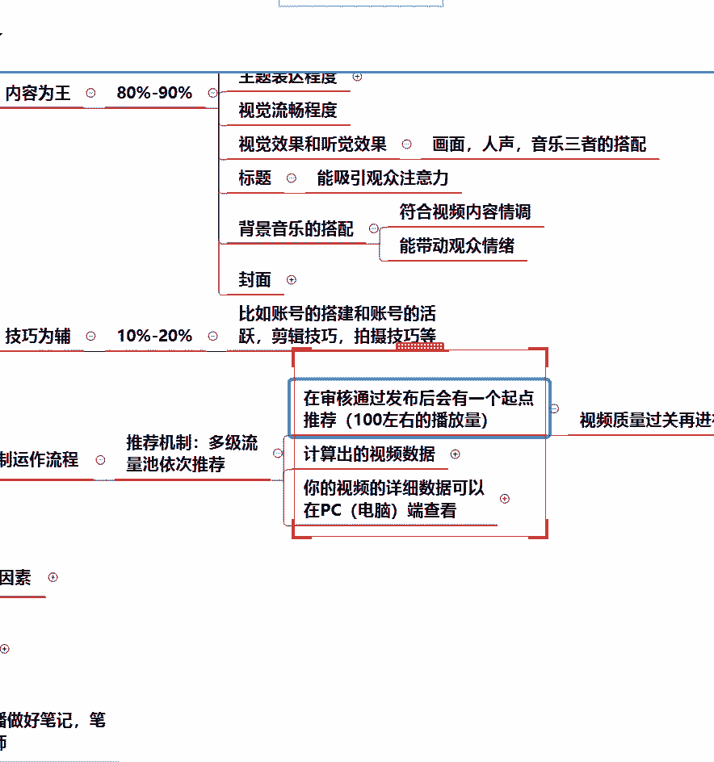
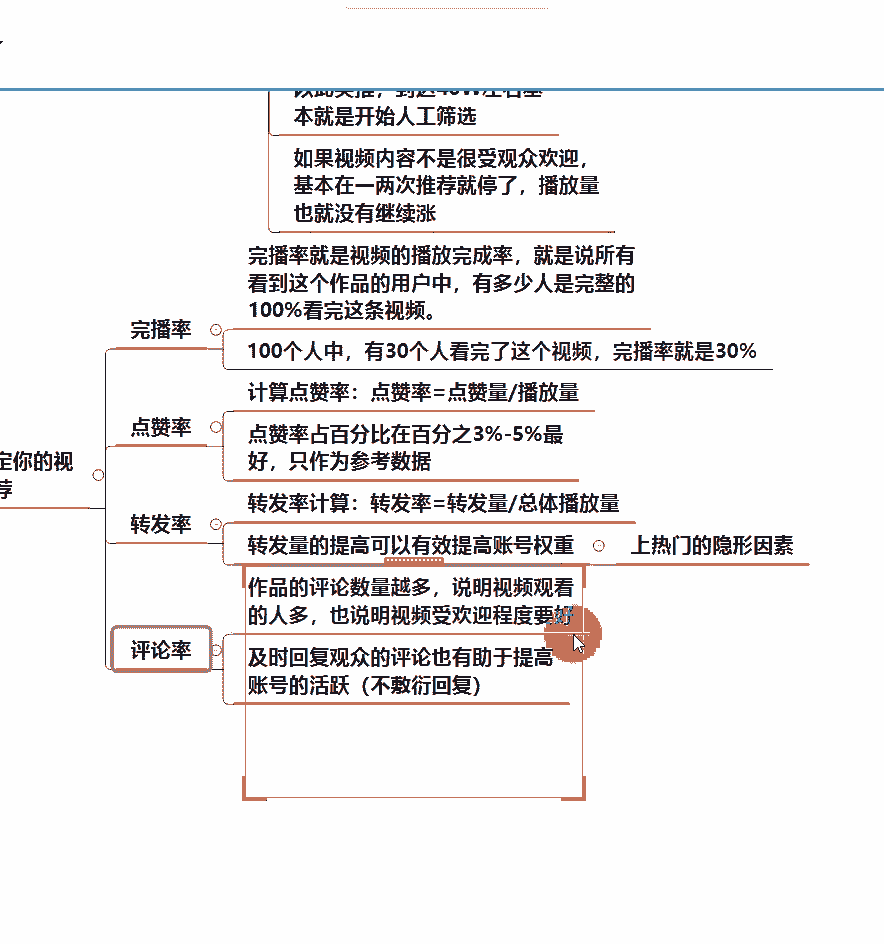
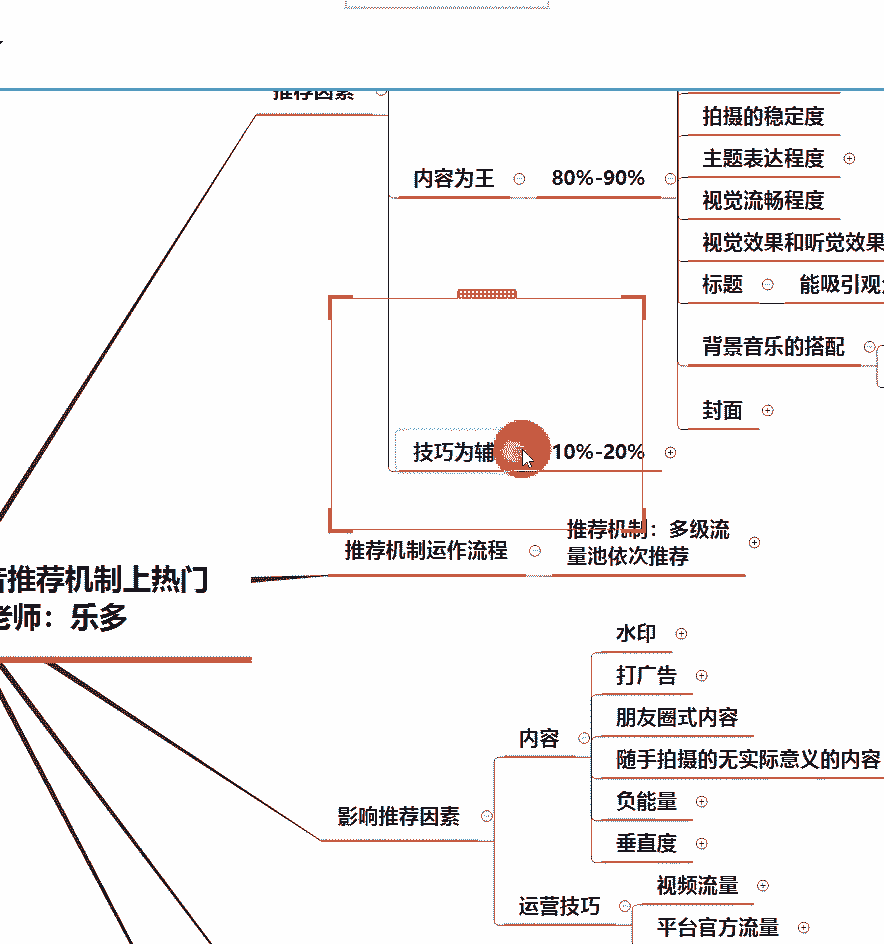

# 2024年做抖音怎么快速起号？3天养出一个高权重抖音账号，掌握这7点，抖音快速养号小技巧！【短剧推广】 - P11：7如何利用抖音机制上热门 - 我从山中来带着大宝剑 - BV1ZCtBeNE8r

各位同学晚上好，现在能够听到老师的声音，并且能够看到清晰的画面的同学，在评论区扣个数字一啊，能够听到老师的声音，并且能够看到画面的同学啊，扣个一，先检查一下设备，好都没有任何问题的话，给大家一分钟啊。

截一张图啊，就是就截你们页面上看到的这张图啊，发给你们的指导老师就可以了啊，就是我们的上课签到是要发给指导老师的啊，就是你们现在看到的这个页面啊，截一张图发给指导老师啊，咳哦发了是吧，好啊好。

看不到画面啊，如果说啊只听到声音或者是看不到画面的，同学就退出去重新进一下啊，如如果说有同学只看只听到声音啊，看不到画面就退出去重新进一下啊，嗯好啊，没有任何问题，我们就开始讲课。

那么上节课呢我们讲到一个抖音账号的搭建，以及一些抖音的雷区，应该如何去避免自己踩雷区，因为呃通过我在课堂上对大家的一个一些提问，然后我从评论区了解到，很很多同学之前呢因为不了解抖音的规则啊。

可能就踩到了很多雷区啊，这个很多同学啊，甚至有些同学是直接就收到了，抖音官方的通知啊，抖音官方发给你的这种违规通知，既然他都给你发了违规通知的话，显然啊你的账号就是踩到了平台的雷区了。

好那么上一节课的这个知识点其实是比较多的，所以说希望大家就是课后啊，一定要反复的去复习，我们所有的课程啊，都是需要去反复复习的，尤其是知识点比较多的情况下啊，可能听一遍课，甚至有时候只复习一遍。

可能都记不住那么多，所以说希望大家就是有时间，都要多去看一下课程啊，尤其是关于于一些抖音的雷区，希望大家都注意，就是避免自己犯这种错误啊，因为有时候啊一些小错误，就比如说有一些小问题啊。

这种还算比较小的一个问题了，我可以把这个啊作品隐藏起来，然后重新去活跃一下账号，那么一段时间后，这个账号基本上就会恢复正常，但是如果说你的账号，一旦如果说被判定为广告营销呀，或者是被判定为搬运。

那可能想要恢复账号的话，就需要比较长的时间才能恢复过来了啊，希望上节课讲到的一些抖音雷区的知识点，希望大家都是能够认真去看一下的啊，录播一定要反复复习的好啊，不用看到。

就是能够看到这个课件上的内容就可以了啊，看到课件上的内容就OK了，好那么我们今天的课程内容啊，就是来讲一下利用抖音的推荐机制上热门，那你既然想要上热门，肯定是要了解一下，抖音是怎么把作品送上热门的啊。

虽然这其中会有一些些哎人为的因素在里面，但是大部分还是要依靠抖音这个平台啊，好嗯写一句话啊，写一句话给一些同学看一下好吧，如果说看不到画面啊，看不到画面，只能听到声音的话，就退出去重新进一下啊。

嗯声音声音和画面都有问题的话，那就可能是你的网络会有问题啊，嗯没有问题是吧，没有画面啊，还是说没有画面吗，好我先写一句话，在屏幕上啊，我给大家看一眼，就是有些同学啊，有些同学啊。

有些同学出现这个问题了啊，我就嗯啧就是听不到这个，这句话是给听不到声音的同学看的好吧，这句话是给啊听不到声音的同学看到好吧，其他同学就呃能够听到声音的话，就不用不用理会啊。

这个主要是给听不到声音的同学看了，好吧好啊，嗯大部分都有没有问题的话，应该我这边的设备不存在有问题啊，那么今天呢我们这节课啊，就是讲如何利用抖音的推荐机制上热门，我们主要来解决的就是。

首先第一点就是发布的视频是怎样去被推荐的，就比如说大家在抖音上发一个作品，那我的作品为什么有时候会有播放量，有时候又没有播放量啊，或者是说为什么，我感觉我的作品跟别人的作品很相似，为什么别人的有播放量。

我的却没有播放量啊，这个是第一点好啊，第二个呢就是主要讲一下这个抖音的一个，推荐机制的一个特征啊，他这个他这个推荐机制其实是层层递进的，一层一层往上去推的好，第三个就是如何获得更多的推荐，好。

相信大家应该都是希望自己的作品，可以上热门的吧，没有同学说啊，我的作品上不上热门无所谓吧，应该没有同学会有这种想法啊，那么既然想要你的作品上热门，那肯定就要去了解抖音的这个推荐机制啊。

怎样才能把自己的作品送上热门啊，好首先第一点来讲的一个，就是抖音的一个推荐因素啊，推荐因素推荐因素呢首先讲到第一个问题，就是关于去中心化的问题，好在今天这节课之前，有同学听说过去中心化这个名词吗。

去中心化这个名词在今天这节课之前，有同学听说过吗，没有啊，好我我基本上看到大家都说是没有啊，也有同学有听说过的啊，那，去中心化是什么意思啊，去中心化既然有去中心化，那肯定就有一个名词叫做中心化啊。

有一个名词叫中心化好，那什么叫中心化呢，先把中心化给大家讲清楚了之后啊，再来给大家讲去中心化，中心化就大家知道啊，比如说我们看一些男团女团啊，我们就会发现它有一个中心位，就是所所谓的这个C位啊。

那么所谓这个C位它其实就是一个中心位，那么大部分的啊，比如说一场舞台表演，我们都知道，这个聚光灯，肯定大部分时间都会打在这个C位上面，这个是一个典型的中心化现象，就是你只有站在C位的时候。

你才能获得这个灯光啊，才能够被更多的人看到，那么去中心化的意思就是说它不存在这种现象，不存在说你必须站到了C位，才会有这么多的聚光灯看到你啊，你站在其他的一个走位上面，也是有很一样的灯光打到你的。

这个就是去中心化的意思啊，再通俗易懂的来讲一下，就是说每一个人的抖音账号，在抖音这个平台都是平等的啊，每一个账号都是平等的，所有人啊，所有人都是平等的，所以我们平常可能看到啊。

有些同学会觉得那人家是明星，他的账号肯定会比我的账号，得到平台更多的一个推荐，其实不是这样子的，他的这个账号，在没有进行本人的一个实名认证之前，他的账号跟你的账号没有本质的区别啊。

在这个平台上并没有任何本质的区别，那为什么明星的账号，他一旦注册了这个抖音账号，他进行了一个本人的一个身份认证之后，他的流量蹭蹭蹭的就上去了，那是因为他自己因为在那个身份上，他自带了很多流量啊。

很多人会误解啊，很多人会误解，他说那我跟明星怎么可能一样呢，那你跟明星是不一样的，但是其实你们的账号本质上是一样的，这就是一个去中心化，在抖音这个平台，每一个人的账号都是平等的好，这就是通俗的来讲啊。

去中心化就这个意思嗯，大家能理解吧，去中心化就是账号都是平等的啊，简单的说大家能理解这个去中心化的意思了，没有理解就扣一啊，理解就在评论区扣个一所有的账号啊，账号都是平等的，但是你非要说那老师啊。

人家刘德华入驻抖音，他上来就涨粉千万，那是他本身刘德华这个人自带的流量啊，他跟这个账号没有太大关系，如果说刘德华他注册了抖音账号，但是他没有进行一个实名认证啊，没有去认证他这个身份的话。

他的账号跟你的账号其实本质上是一样的，因为他认证了这个身份之后，别人就知道诶，这个是刘德华诶，我是他的粉丝就会关注他啊，是这样子的，他的那个流量是他的身份带来的，而不是他这个账号本身就有这么多流量啊。

好所以说大家也不要觉得啊，那我肯定比不过别人啊，尤其是很多人会陷入一种误区，就是说那抖音上面现在就已经有了很多，百万粉丝，千万粉丝的账号，那我现在这个小号肯定做不起来了啊，平台都肯定把流量给到他们去了。

其实不是的啊，平台都是一视同仁的，对于所有的账号都是一视同仁的啊，好这是第一点啊，跟大家讲一下一个中去中心化的问题，就是有些同学真的会有这种疑惑，他会觉得哎，平台是不是把流量都分给那些优质账号了呢。

是不是我就没有流量了呢，其实不是，只要你创造出优质的内容，平台一样也会给你流量啊，大家要相信，只要平，只要你的内容足够优质，平台也会给到你流量的，好吧好，这是第一点啊，关于去中心化好。

第二个呢就是一个视频的审核啊，我在之前的课程上有了解到啊，大部分的同学其实都是有，在抖音上面发布过作品的，所以说我们的作品会经过审核，这个过程相信大家应该都知道了啊，摆明应该没有同学说嗯。

觉得自己的作品只要上传成功就是发布成功吧，应该没有同学会有这种啊，嗯可以说是有一点带错误的认识啊，就是我们的作品并不是说上传成功，就是发布成功的啊，我要跟大家强调一下，不是说你的作品在你的手机上显示诶。

作品上传成功，这个时候就已经发布成功了，不是的，上传成功之后呢，它其实是有一个审核的过程的啊，它有一个审核的过程，所有的作品都有审核的过程啊，不是说只针对你一个人，所有人啊。

平台上所有的作品都是经过审核之后，才能发出来的啊，好首先这个初步审核就会审核到你的视频里面，有没有一些违规啊，就是如果说有的同学，比如说他的视频里面涉及到一些平台不推荐的，甚至是禁止的内容的时候。

他直接审核不通过啊，很多同学不知道，他就觉得自己的作品上传成功，就是已经发布成功了，结果过了很久诶，看怎么为什么一个播放量都没有，然后这个时候他用他朋友的手机一搜诶，发现根本就没有看到这个作品。

很显然这个作品要么就还处在审核中的状态，要么就是审核不通过啊，一般审核不通过的话，你是会收到通知的，有时候它就会一直显示在审核中，作品显示在审核中，其他用户就看不到啊，所以说这个视频审核。

是所有的视频都需要经历的一个阶段，不是上传成功，就是发布成功啊，希望大家理解啊，怎么看审核是吧，嗯嗯现在啊现在手机上好像一般都看不到，审核中啊，手机上一般都看不到嗯，一般都是只能在电脑上能看到啊。

就是之前抖音有一个就在创作者服务中心，有一个视频管理的功能，那么之前在那个位置呢是能够看到呃，作品是否处于审核状态，但是最近啊好像就最近这段时间，这个功能已经下架了，所以说就看不到啊。

在手机上看不到视频是否处于审核状态，一般就只能够在电脑才能看到啊，这个其实如果说你不确定自己的视频，是否还处在审核状态的时候，你可以用自己的家人的抖音号，或是用你朋友的抖音号去搜索一下你的账号啊。

看一下他能不能看到这个作品，他能看到这个作品的说明，作品已经发布成功了，他看不到说明还处在审核状态啊，好，嗯有人点赞，那肯定是已经发布成功了呀，就是其他用户都能看到你的作品，那绝对是发布成功了啊。

好这个就是第二个就关于一个视频审核啊，强调一下所有的作品都会经过审核的啊，不是上传成功就是发布成功啊，好下面一个，那我上传之后啊，审核通过就是发布成功了啊，发布成功之后，你的视频才会被观众看到啊。

才会被观众看到啊，这个时候就是跟大家讲，以后你们发作品，如果说遇到这种情况啊，因为用手机，现在用手机发作品的话，可能是看不到自己的作品，是否处于审核状态的情况下，你又看了哎我的作品怎么今天中午发布的。

怎么到了晚上都还没有播放量的，这种情况下，你就可以用家人或是朋友的抖音号，去搜索一下你的抖音号啊，让他帮你看一下，在他搜索你的账号的时候，能不能看到你最新发的这个作品，如果说他看不到。

说明作品还在审核啊，如果说他能看到了，但是呃你的你在你这边显示，一直都还没有播放量的话，说明你的这个作品，暂时还没有得到平台的一个推荐，好吧是这样子的啊，好这个是第三部啊，就是作品发布成功之后。

好，下面主要来讲一个，就是抖音是一个以内容为王的平台啊，抖音以内容为王，就是很多同学之前可能有，在抖音的一些直播间啊，或者是刷抖音看到一些视频，就是说哎你的视频播放量怎么怎么样。

是因为你没有打开几个关键的开关之类的啊，但是我想告诉大家，有时候如果说你的作品质量一般，你打开再多开关都没有用啊，打开再多开关都没有用，就是说当你的这个作品质量上不去的情况下，你用再多的技巧也没有用啊。

抖音以内容为王，那么内容会占到有多少呢，跟大家讲一下啊，抖音内容占到80%到90%，就是说你的技巧在精湛啊，你用再多的技巧，你去各种抖音的那些主播的直播间里面啊。

或者是他们发布的一些视频里面看再多的技巧，但是第一点你的作品质量没有上来的情况下，你的作品也是得不到推荐的啊，强调一下咳。

那么内容为王的话，他大概是包括哪些内容啊，先跟大家一一捋一下，因为内容包含的比较多啊，既然是他以他为王，占到80%，到90%的一个比重的情况下，它包括的内容也会比较多啊，好的。

首先第一个就是一个视频的一个题材啊。

题材的话首先啊是否贴近生活啊，或者是说能够让人感兴趣，最后一个是是否能够引起人的共鸣，因为很多人刷抖音其实是为了什么呢，有些人可能就是为了嗯找一些乐子啊，有一些人可能是为了看一些。

最近发生的一些热点事件，也有一些人他单纯的就是在找自己，不知道大家有没有这种感觉啊，就是很多时候刷视频，刷着刷着，你就想找一个，是不是有人和自己的经历相似的这种，就尤其是刷一些情感视频，他就在。

其实就是像在找一个和自己差不多的人一样，就觉得诶这个人，如果说你在抖音上看到一个人说故事，然后这个故事整个故事的一个走向，就感觉跟你的人声很贴近的时候，你就跟他能够产生共鸣啊，隔空产生共鸣。

这个时候其实很多人其实都有过这种经历啊，我不知道大家有没有这种经历，就是有时候在抖音上刷视频，突然看一个人在讲故事，然后他讲的这个故事呢，就是非常接近你的一个人生的情况的时候，你就会想要很认真的去看啊。

想要很认真的去看，甚至你会觉得嗯真的跟我很相似，或者是说他说到我的心坎里了啊，说到我的心窝窝里的这种感觉，这个就是能够引人共鸣啊，引人共鸣，而且能够引起你的一个兴趣，还有一个就是贴近生活。

虽然说他这个抖音平台，他一直就是嗯追求的呢是一个，嗯是比较高大上的，但是高大上的一个前提也是要贴近生活的啊，艺术是源于生活并高于生活的，那么抖音平台现在就是一直都是这样子，它是啊短视频是一种艺术。

但是它也是源于生活的，你的这个东西如果过于高雅，过分高雅的话，其实它的用户相对来说也会比较少，也要贴近生活啊，就比如说我们平常在抖音上，刷到很多的搞笑视频，它其实就是我们生活中的一些细节。

然后被夸张化了一些啊，就比如说我第二节课举例的那个搞笑视频啊，不知道有没有同学记得，就他就是平常生活中啊，妈妈叫女儿起床吃饭，一个非常小的一个生活细节，但是但凡给他夸张一点啊。

然后加上他是一个一人分饰两角的这种情况，带上一些比较夸张的语气啊，还有一个妆容装扮等等，他的这个搞笑的氛围就达到了啊，嗯所以说我们选材就很重要啊，选材就很重要，虽然我知道有些同学他说啊。

老师我就是嗯比较喜欢研究哪一个方面的，哪一个类型的呃，但是这个类型可能平常感觉他的受众不是很广，的情况下，你适当的跟他结合一下，把它和与生活贴近的一些内容相结合，就很多事情都是跟生活联系在一起的。

既然你生活中要用到它，它肯定就能够跟生活结合在一起啊，嗯好这个是关于视频的一个题材的一个选择啊，内容最重要的就是第一点就是选材啊，第二个呢就是制作视频的时候，这个字幕啊字幕一定要大小合适啊，颜色鲜明。

对比大小合适的，意思就是说你的这个字幕放在视频上啊，你不要影响到你本身看这个视频画面，就给大家举个例子，比如说啊你在抖音上刷到一个视频，他讲的是一个呃影视情节的一个片段剪辑啊。

然后他把那个字幕放的非常非常大，然后直接把画面挡住了，那这样子的一个视频你会想要看吗，本来你看这个电视剧，你是想看什么的，想看演员的一个情节演绎，结果他用字幕全部挡住了啊，所以说像这种的话。

字幕大小做的不合适，用户也会不喜欢啊，就是其实大家就可以自己想象一下那种画面，本来你要看画面的时候啊，字幕把画面完全挡住了，肯定就不合适啊，咳嗯有同学说没有声音吗，其他同学告诉我声音正常吗。

其他同学告诉老师一下，声音正常还是不正常，哎呦正常是吧，啊因为我看到有同学说啊，我担心我万一我这边声音出现不正常的情况下，会影响大家听课啊，第二个呢就是这个字幕的颜色要鲜明的对比啊，什么意思。

就比如说大家现在看到老师的这个课件，我是一个白底黑字，所以说大家看这个字应该是都能看清楚的啊，就只要在我放大的程度足够大的情况下，大家都是可以看清楚我这个字幕的，但大家想一下。

如果说我的这个字幕这个啊这个背景是白色的，但是呢我的这个字体的颜色啊，字体的颜色把它调成了一个很浅的，比如说那种浅蓝色，可能看起来大家就字都看不清啊，或者是那种黄黄色。

可能大家根本就看不清这个字是什么颜色，就我们做视频也是一样的，那如果说你的这个视频的一个背景是白色，那你最好就用黑字啊，如果背景是黑色，那你最好就用白字，这样子的话让别人看你的字幕看得更加清晰啊。

好这个是第二点，关于制作视频的一个字幕的问题啊，第三第四啊，就是视频的一个清晰度和完整度啊，上一节课老师也强调了，如果说你的视频不清晰，平台直接就不推荐，那这也可以想象一下。

你在抖音上刷到一个模糊的视频，你会想把它看完吗，你看都不想看一眼，我可以保证啊，就那个视频非常的模糊，你都不知道哎，这模模糊糊的一团是什么呀，如果说正好啊，万一有点近视眼啊，或是有点老花眼。

就看着更加模糊了，那你根本就不想看了啊，所以说我们自己做视频也是一样的道理，既然你自己不想要看到呃模糊的视频，其实其他用户跟你的想法也是一样的，他们也不想看到模糊的视频啊。

那么平台就更加不会去给你推荐了，你的视频本身画质就不达标，那么平台就不会给你推荐啊，好这个是第四第三点啊，视频的一个清晰度，其次就是视频的完整程度啊，完整程度咳，一个视频要有头有尾。

相信大家其实应该也有看到过一些视频啊，就是说做的不算特别好的视频，或者是说有时候你们自己做视频，也会出现的一个问题啊，就是嗯比如说做一个情感语录类型的视频，然后有些同学呢可能想着哎。

我这个视频会不会时长太长了，然后我就把这个后面有半句话把它给截掉了，然后你可能自己做完了之后，也没有太注意这个问题，把视频完整的一放诶，放到最后怎么这句话只有半截啊，这种视频给人的感觉就很不好啊。

因为老师之前就有收到过类似的这样子的作品，就是一个情感文案类型的作品，就最后那一句话说了半截，就很显然就你自己都能够听得出来那个声音，那个语气后面应该还有半句话，但他没有放出来啊。

这个视频就典型的有头无尾不完整，给人的感觉就非常差啊，好这个就是第四点，所以说做视频清晰度完整度是啊非常重要的啊，还有一个就是拍摄的一个稳定度，那么这个是针对于一个依次创作的，依次创作领域。

噗自己拍视频，那么拍摄的视频一定要保证画面是稳定的，不要来回晃动啊，嗯大家想象一下，你自己刷到一个视频的时候，那个画面七上八下的，大家想一下这是什么感觉，那个画面七上八下的。

摇摇晃晃的这种画面你会想看吗，应该没有人会想要看这种视频啊，就是很多同学嗯，很多同学有时候拍一些风景的视频，都是自己拿着手机去拍的，嗯相信你们自己手机里面，现在可能就有类似这样子的视频啊。

就是比如说你去某个地方旅游，然后你就用那个相机拍摄一个视频，然后呢你就是用手拿的，但大家发现没有，就你手拿着那个手机的时候嗯，可能超过一定的时长，你的手就开始有小幅度的抖动，然后时间越长。

你的抖动程度就越大啊，然后这个画面就开始不稳定，它就开始在晃啊，就是会出现这种情况，那么这样子的作品啊，是不建议发到抖音上面去的，如果说这个画面抖动啊，就是我也看到有同学说了，是头晕的感觉。

那么这种你自己都看着觉得头晕了，那别人看着也是一样的啊，所以说希望大家自己注意一下，就是后续如果说大家需要拍摄视频的话，我们可能需要借助一些设备来进行拍摄啊，好这是关于视频拍摄的一个稳定度的问题。

好下一个就是视频的一个主题表达程度啊，就是一个视频表达了一个什么主题，表达主题一定要清晰，很多同学会有嗯什么误区呢，他就是觉得啊我的这个视频我觉得拍的挺好的，但是一问诶你这个视频想要表达什么内容呢。

然后说嗯好像没有什么内容要表达，那么再强调一下啊，抖音平台以内容为王，那么如果说你的这个视频都不能够清，晰地表达一个主题的情况下，那你这个作品肯定是得不到推荐的，肯定得不到推荐好嗯。

所以说希望大家制作一个视频的时候，你要想清楚我的这个视频想要表达什么内容，我想要为用户传达什么信息，这个是你在制作视频的时候，要想清楚的一个问题啊，希望所有的同学都记住这一点，你不要做一个视频出来。

然后你的指导老师问你一句，同学你的这个视频想要表达什么内容呢，然后你就整个人突然脑子一下懵了啊，我也不知道我要表达什么呀啊这样子就不好啊，这样子就不好，这种作品说明他也是不合格的啊，希望大家都记住好。

下一个就是关于一个视觉的一个流畅程度啊，这个的话其实主要靠调整视频的帧率，就能够调整好的，调整视频帧率就可以调整出来的，这个大家不用很担心，后面都会讲到啊，怎么去调整这个视频的一个帧率。

让视频看起来更加的清晰啊，好再下面一个就是一个视觉效果和听觉效果，就是所谓一个视频，它是包含了画面内容和音频内容的，就它包含了两方面，一个就是眼睛看到的，还有一个就是耳朵听到的。

那么我们看一个视频的时候，肯定是要眼睛跟耳朵一个双重享受，说明这个视频才是成功的啊，说明这个视频才是成功的，所以说我们做一个作品也要强调一下。

就是你的画面，人声音乐三者的一个搭配啊，就是要搭得和谐一些啊，搭的和谐一些好呃，这个是关于视频的一个视觉和听觉效果的，就是有时候大家其实嗯可以想象一下，如果说一个视频它的画面很到位。

但是如果说他的音乐配得不是很好的话，就会让你有一种出戏的感觉，不知道大家有没有看到过类似的视频啊，就是一个很悲伤的画面，然后突然窜出一段很喜庆的音乐，就会让你觉得很出戏，那其实也可以想象一下这种画面啊。

可以想象一下的很多很多啊，就是很悲伤的画面，然后配一个呃很喜庆的音乐，或者是说本来是一个嗯很快乐的一个环境，然后配一段很悲伤的音乐，这个就是很典型的一个，你的视觉效果和听觉效果不在一条线上啊。

给人的感觉就是很粗细不怎么好啊，跳脱对的啊，好，这个就是视觉效果和听觉效果，最好是能够达到统一啊，达到统一啊，还有一个就是标题，标题是很重要的啊，就是要能够吸引到观众的一个注意力。

所以说标题文案这一块很重要啊，后面有专门一节课，会教大家去怎么写作品的标题，因为我知道很多人呢做好作品了之后，问他啊，作品写了个什么标题，不知道啊，我老师我不会写标题，没有关系啊。

我们的课程后面都会教大家，怎么去给作品写标题的，所以说你现在如果说啊，很多同学可能之前因为已经发过作品，也自己尝试去做作品了，但是很多时候会卡在诶，这个作品我应该写个什么标题呢。

是不是大家会不会遇到这种问题，就是说我不知道怎么给作品写标题，这种问题大家有没有遇到过嗯，会是吧，会有是吧，那么呃因为考虑到啊，大部分同学都会出现这种问题，我们专门安排了一节课啊，专门安排一节课。

就是教大家怎么去写标题的，所以说如果说大家现在觉得嗯标题很难写啊，因为我现在说内容为王，标题也是很重要的，那么很多同学说不知道标题怎么写，没有关系啊，安排了课程告诉大家怎么去写啊，好咳。

下面一个就是关于视频背景音乐的一个搭配啊。

其实就是刚刚说的这个啊，视觉和听觉效果的一个融合啊，最后一个就是作品的一个封面啊，这个是呃最基本的就是干净整齐啊。

给大家看一个个人主页的一个封面啊，嗯好给大家看一下，这是一个人的抖音账号啊，第一感觉你们看到这个画面的第一感觉，给我打在公屏上，看到这个画面的第一感觉打在公屏上，好嗯大部分同学啊。

大部分同学还是觉得这个封面是啊，整齐统一的啊，如果说啊，如果说你觉得他的这个封面不够整齐，统一的话啊，你可以把你的抖音个人主页的这个页面截图，给你的指导老师看一下啊，我也想知道一下你的封面做的怎么样啊。

你的封面做的怎么样，其实他的这封面其实整的，整的来说是很整齐的啊，很整齐的，虽然说有极个别地方，可能看着有那么一点点微微的瑕疵，但是大部分地方都是非常整齐的。

为什么这么说呢，大家都可以看到啊，就是一般抖音这个主页都是三个作品一排啊，三个作品一排，但是我们可以看到啊，他的三个作品，首先第一个作品，第二个作品，第三个作品它的画面大小基本上一致啊。

画面大小基本是一致的，然后他的一个字幕的位置也基本上在一条线上，字幕的位置基本上在一条线上，它的背景的一个选择啊，都是统一的一个背景，统一的一个背景，然后他的这个出现的这个，中间的这一小块的一个画面。

也基本上都是同类型的画面，就是唱歌的画面啊，所以说他的这个封面啊，虽然说我知道有些同学要求会更高一些，可能觉得这个封面也不是特别整齐，因为它确实有一些些地方啊。

比如说这个地方它的字幕就没有完全对整齐啊，或者说有些地方可能字幕的大小，调的不是完全一样啊，有些同学要求严格一些的话，可能会觉得他有一点点不整齐啊，但总的来说啊，这个封面其实是已经做到啊。

至少能够打个90分的啊，至少能打90分的一个封面了，好吧好。

所以说嗯不求大家啊能做到100分，但是这个封面至少也要做到90分啊，至少要做到90分，好吧好这个这个不需要截屏啊，这个不需要截起屏好。

那么以内容为王呢，那么我们主要就是包括这些内容啊。

这些内容有一点点多啊，有一点点多，就是有这么多啊，有这么多，所以说我们自己做作品就是要从多方面去考虑，就是看我的是不是每一个方面都符合要求了呢，啊希望大家多注意啊，就是这个内容为王。

它会包括这么多方面啊，好那么既然是内容为王。

那总要还有一个东西为辅吧，就是技巧啊，技巧也很重要啊，技巧呢，它占到10%到20%的一个比重啊。

好一般包括哪些技巧啊。

就比如说账号的搭建以及账号的活跃，然后后面会教到大家的一个剪辑技巧，以及拍摄技巧啊，这些都是属于技巧啊，这个技巧也很重要啊，因为如果说账号没有搭建好的话，很有可能会影响到你后面发作品的一个流量啊。

还有以及你的一个账号的活跃，很多同学啊，因为其实老师之前有遇到过啊，有些同学会觉得啊活跃要活跃5~7天啊，那我一个星期都不能发作品太长时间了啊，但是我想告诉大家，如果说你的账号不活跃的话。

你一账号马上注册好之后，开始发作品，可能会死的很惨啊，会死的很惨，所以说活跃账号这个步骤千万不能省略啊，千万不能省略好吧，技巧虽然占比比较少。

但是也一样的很重要啊，一样很重要，所以说希望大家不要忽略这个好。

那么刚刚讲的就是一个抖音的推荐因素啊，推荐因素下面给大家讲一下，就是推荐机制的运作流程啊。

那么他到底是怎么去推荐我的作品的，为什么我的作品只有500左右的播放量啊，别人的会有几10万，几百万甚至几千万啊，我们来看一下，首先它是一集一集去推荐的啊，没有说一个作品一发出去。

他就一一次性给你推到千万播放量了，没有啊，所有的作品他都是一级一级被推上去的啊。

好一般啊，正常的一个起点播放量啊，正常的起点播放量，就是说你的作品审核通过之后啊，发布会得到平台的一个起点推荐，大概是啊100左右的一个播放量啊，如果说这100个播放量啊。

视频质量过关，那么它平台就会对你的作品进行二次推荐啊，二次推荐的话，一般就是达到200到500左右的一个推荐量啊，好那么什么时候就是有些同学说，那老师你说一般正常都能达到100。

我有时候只有两位数是什么情况啊，好给大家看一下，什么人只有两位数啊，就是推荐它不是漫无目的的去给你推荐的，他是从很多数据方面去看你的这个作品的，所以说你的作品什么时候会获得二次推荐，三次推荐。

甚至是四次推荐，一直往上走，就是根据你这个作品，在用户那里的数据反馈的啊，好首先啊一个就是达到一定的完播率，且完播率啊，完播率这个东西是最最最重要的，就是你的一个作品，是否能够得到平台的一个持续推荐。

那你的这个完播率就相当重要了啊，相当重要，好首先所以说在数据里面啊，我们经常看到的，比如说像点赞评论以及转发，这些数据是我们肉眼可见的，就直接打开那个作品就能看到的。

完播率这个东西呢往往我们平常都看不到，但是它却是最重要的这个东西啊，好完播率最重要，其次就是作品的一个点赞啊，还有就是一个评论，一个转发，就是他们的重要程度是依次排序下来的啊。

如果说这几个数据反馈的都非常好啊，非常好，那么他就会给你进行下一次推荐啊，二次推荐，那么这种推荐，它就有点像这种积少成多的感觉啊，积少成多的感觉，就比如说像那个水池子啊，可能刚开始是一滴水啊，一滴水。

假设这一滴水是100个播放量啊，如果说这一滴水足够好啊，就是你达到一滴水的这个量之后呢，它会慢慢的啊流进一条小溪啊，流进一条小溪，再流到一条大河，最后流进大海，这种感觉啊，就这个逐次给你推荐它。

其实就是类似于这种变化，类似于这种变化，比如说一个池子的水满了之后，它就会E到另外一个池子里面去啊，它就范围越来越广，那你的作品就会被更多人看到啊，但前提是作品要足够优质啊，完播率是什么造成的呢。

如果说你的作品做的不好啊，别人看了两三秒之后就觉得嗯一般划走了，那这样子的话，你的作品完播率可能就上不去啊，好一般啊，一次推荐100左右，二次推荐啊，很多同学可能就会卡在这个二次推荐这里啊。

是不是问一下之前有发过作品的同学，是不是，很多时候都直接卡在这个二次推荐这里了，对不对，那么其实这个二次推荐效果不怎么样啊，其实就是完播率占到了很大一部分因素啊，很大一部分因素就这个完播率上不去。

你完播率上不去的话，基本上就卡在二次推荐了啊，就到不了三次推荐啊，好，那么很多人他可能啊一次二次，三次四次都到了之后呢，它到了一定程度啊，就比如说播放量啊，一般播放量到了40万之后。

有些同学甚至会出现一种什么情况啊，就是老师之前有遇到过，他说老师我的作品播放量蹭蹭蹭的往上涨啊，一下涨到十几万了，20几万，30几万了，好到了40万左右的时候突然涨停，甚至平台给你发来了通知。

说你的作品不宜公开，为什么会出现这种情况啊，告诉大家，当你的作品播放量达到40万左左右的时候，它会有人工参与进来，就是前面40万播放量之前，一直都是在机器给你审核，机器给你推荐。

但是当你的播放量一旦达到40万以上之后，会有人工加上机器一起去审核你的这个作品啊，这个时候他会对你的视频很多一些细微的地方，给你挑刺儿啊，可以这么说好，所以说有些同学如果说啊。

有些同学说你真的是遇到了啊，比如说我的作品播放量涨到40万之后涨停了，甚至是被判为作品不宜公开，很有可能就是在人工审核这个阶段没有通过啊，人工审核没有通过好，当然人工审核通过之后。

也会一直的持续受到推荐啊，持续受到推荐好很多，很多同学说作品播放量卡在500左右，就是说明你的视频内容，并不是非常的受到用户的一个欢迎，所以说推荐一到两次就停了啊，推到121到两次就停了。

好那么刚刚呢有同学说啊，完播率是个什么东西啊。

给大家看一下，就是具体的比如说啊完播率。

点赞率这些东西具体是个什么东西呢，来给大家看一下啊。

完播率啊，首先最重要的给大家看完播率，就是说你的这个作品的一个播放完成率啊，播放完成率，就是说所有看到这个作品的用户中，有多少人是完整的，百分之百看完这条视频的好，再给大家举一个更加具体一点的例子啊。

举一个更加具体一点的例子，如果说啊你的作品被100个人看到了，然后这100个人里面有30个人看完了，你这个视频，那说明你这个作品的完播率就是30%，好这么说大家能理解吗。

现在大家能够理解这个完播率的意思了吧，就是我给大家举一个很形象的例子啊，这个是完播率啊，这个就是完播率吧，而这个是非常重要的啊，完播率非常重要，这个也是后面啊，一步一步指导大家去做作品的时候。

我包括你的指导老师都会反复强调的一个问题，就是说作品的时长尽可能的缩短一些啊，不要太长了，为什么会影响作品的完播率啊，就是这个意思好吧，就这个意思啊，所以说希望大家以后做作品。

尤其是有些同学啊做影视剪辑，为什么会把影视剪辑单独拿出来讲呢，就是很多同学做影视剪辑会陷入一个误区，他就觉得这个视频啊，就是需要这么长才能够完整的讲完这个故事呀，啊结果剪了一个5分钟的视频出来。

那么如果说你一开始发5分钟的视频的话，你的完播率会很惨啊，完播率会很惨，所以说我们刚开始做作品啊，时长尽可能的短啊，尽可能的短好，这个具体的每一个时长，其实每个领域它不一定啊，它不是一样的。

不是说所有的领域都要只做多长的一个时长啊，每一个领域是不一样的，好吧好，第一点啊，完播率好，第二个呢就是一个点赞率啊。

点赞当然是越多越好啊，点赞当然是越多越好，但是要有达到一个基本的点赞率，就是说啊，你的100个播放量里面至少有3~5个点赞啊，至少有三个3~5个点赞，才说明你的这个作品能够达到一个及格线啊。

达到一个及格线，当然说这个点赞越高越好啊，肯定是点赞肯定是越高越好。

好，下一个就是关于转发啊，转发也是越多越好啊，转发也是越多越好，一样的啊，一样的就是这个转发率的计算，就是转发量除以你的这个总体的一个播放量啊。

除以总体，如果说你的作品的一个转发量上去了啊，比如说你的1000个播放量里面可能就有十，超过十条转发量的话，这个时候你的账号啊，你的这个作品会获得一个叠加推荐，什么意思呢，就是说1000啊。

1000他会直接乘以十的去推荐你的一个作品，这个叠加推荐啊，就是这个叠加推荐，主要就是依靠你的作品的一个转发量来确定的，所以说作品的转发量越高越好啊，作品转发量越高越好，点赞也是越高越好啊。

那么很多时候有些同学可能说啊，老师我的作品播放量不错啊，但是点赞没有转发，没有评论也没有，那么这个时候你可能要去审试一下，你的这个作品的内容啊，如果说你的作品没有给用户提到。

提提供足够多的一个有用的信息的话，会出现什么情况，他就只看你的作品，但不会给你点赞，也不会转发，也也不会收藏，也不会评论啊，就会出现这种啊，有些视频为什么不能转发。

这个是嗯别人定的啊，就是发这个作品的人，他会有时候他会去设置这个，所以这个也没有关系啊，这个也没有关系，就是说你自己你自己发作品的时候，你不要禁止让别人转发就行了啊，你自己发作品。

一定要把这个可以转发的开关给它打开啊，不要说我发个作品不能让别人转发啊，千万不要这样子啊，还有一个就是评论率啊，评论的话也是一样的。

越多越好啊，越多越好，还有就是说评论的这个数量啊，跟大家讲一下，如果说你发一个作品，你发现有人给你写评论了，请尽快去回复他啊，尽快回复能有多快就多快啊，就是你发现的第一时间马上去回复他。

因为前期发作品的话，其实这个评论量不会很多啊，如果说后面你的账号慢慢起来了之后，这个评论量越来越多，那么你能回复的就是尽可能的去回复啊，还有一个就是不要因为说账号做起来了之后，评论量越来越多。

你就敷衍别人啊，千万不要这样子好吧，就是尽可能的去回复啊，尽可能的去回复，为什么这么说，因为你回复了别人，你自己的那一条回复，他也是算在评论总总数里面的啊，也是算在评论总数里面的。

其实也是在变相的去增加你作品的一个评论量，也是给你的作品加热啊，给你的作品加热好，转发是搬运吗，转发不是啊，转发不属于搬运。

好吧好，那么这四个数据啊，一个完播率，点赞率，转发率，评论率，这四个数据，就决定了平台是否继续去推荐你的作品啊，这四个数据啊，平台依靠什么来判断要不要继续推荐这个作品，就是依靠这个四个数据去决定的。

如果说你这四个数据都非常低的话，那肯定就没有办法得到继续推荐了啊，嗯这个画面能不能大一点啊，是因为我想让这个东西让你们全部都看到啊，我所以才把它放成这么小的啊，好给它缩回了啊，缩回了好。

那有些同学说啊，老师我看不到具体的数据呀，我看不到具体的数据怎么办啊。

其实这个数据啊在电脑端可以查看啊，电脑端就是电脑登录抖音创作者服务中心啊。

然后呃它会提示你粉丝数大于1000可以查看嗯，我但是我记得是这样子的啊，就是如果说你在抖音上连续活跃七天，就算你的粉丝没有1000，也是可以去查看这个数据的啊，还有跟大家讲一下，就是这个数据第一次查看。

基本上是在电脑上进行的，就是如果说你嗯，第一次没有在电脑上看过这个数据的话，好像一般在手机上看不到数据啊，呃如果说你自己第一次在电脑上看了之后呢，你后面在自己的手机的创作者服务中心。

也是可以看到这个作品的数据的，所以说如果有些同学说啊，老师我没有电脑怎么办，那么你问一下你身边的一个亲戚朋友啊，如果说他们有电脑的话，可以先用别人的电脑看第一次的数据就可以了。

因为到后面你就可以在自己的手机上看了，就说你第一次看这个数据需要用电脑登录啊，但是后面在手机端也是可以看到的好吧，在手机端也可以看到这个具体的一个数据啊。

这个具体的数据就可以看到啊，我刚上面说的这个啊完播率，点赞率啊，就是转发率，评论率这些就是在数据上都可以看到。

因为完播率这个东西的话，只在手机上看确实看不到啊。

必须需要用电脑看一次数据之后，你后面才能在手机上查看到啊，好这是关于一个推荐机制的运作流程啊，推荐机制运作流程，下面再来讲一下影响推荐的一个因素啊，那我知道了是这么去推荐的啊，我也知道了呃。

抖音以内容为王啊，技巧为辅，那么到底是哪些东西影响了一个推荐，首先第一点就是内容啊，内容的话最开始我要强调的就是这个水印，水印这个问题呢我上节课也有强调过，好先问一下呃，大家都知道水印是什么东西吗。

你们都知道水印是什么东西吗，先问一下水印是个什么东西，啊好，嗯大部分同学都是知道啊，大部分同学都知道，还是有小部分同学不知道啊，那么我跟大家说什么是水印，现在大家都在腾讯课堂上听课啊。

现在大家都在腾讯课堂听课，然后你会发现你的手机的右上角，是不是有一个腾讯课堂的logo，是不是在你们的手机啊，或者是如果你用电脑听课一样的啊，用平板听课一样的，在你的这个屏幕的右上角。

有一个腾讯课堂的logo啊，那个东西就是水印啊，就是水印，那么每一个平台啊，每一个平台它都有专属自己的水印，就像抖音也有啊，快手也有很很多的一些看视频的软件都有，比如说像爱奇艺啊，优酷芒果TV。

腾讯视频，它都是有属于他自己的水印的，那么这些水印抖音都是不支持不推荐的，如果说你的作品上面出现这种水印啊，因为我之前啊，老师之前有遇到过这样子的一个学员，他说老师我的作品发不出去。

怎么就只有几个熟人看了我的作品，其他人都没看呢，然后我我说同学，那你把视频发给我看一下，结果视频一发过来啊，豆大的腾讯课视频几个水印在那里放着啊，这种视频发到抖音上面去，抖音怎么可能会推荐啊。

抖音怎么可能去会推荐，好咳，所以说作品上啊坚决不能有水印啊，坚决不能有水印，那么老师只是列举了其中几个啊，像腾讯视频，爱奇艺，芒果TV啊，没微博秒拍小红书这些啊，西瓜视频它通通都是有水印的啊。

通通都是有水印的，好吧好，所以说希望大家以后做作品的时候，切记啊，都不要有这些水印，有水印平台就不推荐啊，有水印平台就不会推荐你的作品好，这是第一点啊，第二个就是打广告，那么上节课我也说过啊。

硬广软广平台都不支持啊，硬广软广平台都不支持好，什么叫打广告呢，比如说啊视频里面含有一些广告词啊，或者是含有联系方式，含有价都不允许啊，都不允许上节课我也强调过这个问题了啊。

还还有同学不知道水音是什么吗，啊还不知道水印是什么的，就看向你屏幕，你手机屏幕的右上角啊，你的手机屏幕的右上角那个腾讯课堂的logo啊，就是水印好吧，你们手机屏幕上啊，现在在听课的同学。

手机屏幕上右上角的腾讯课堂就是水印啊，那个腾讯课堂的logo就是水印好吧，第三个就是朋友圈式的内容啊，这个上节课我也强调了啊，朋友圈画的是视频抖音是不推荐的啊，好还有一个就是随手拍摄的无意义。

无实际意义的内容也不行啊也不行，还有负能量啊，负能量的就是上节课也给大家举例了啊，抽烟喝酒造谣啊，暴力血腥等等啊，包括开车刷抖音啊，开车刷抖音也是属于负能量啊，所以希望大家注意最后一个就是垂直度。

我们的账号为什么要定位领域，就是为了把账号做垂直啊，为什么你的指导老师会在你定位领域之后，会问你啊，那之前关注了多少账号呢，关注的都是哪个领域的呢，之前发布了哪些作品呢，为什么会问你这些。

就是想确定一下你的这个账号，之前都关注了些什么啊，跟你现在想要做的这个领域是不是相关的，他会告诉你啊，不是这个领域的账号需要取关，不是这个领域的作品需要隐藏，为什么要去做一些这些操作。

就是为了让你的账号做垂直啊，就是为了让你的账号做垂直好，这个垂直度非常重要啊，非常重要，一个就是视频内容的垂直，好就比如说啊你的指导老师，有些同学定位了领域之后，你的指导老师肯定会说啊。

假设啊假设我现在定位了影视剪辑领域，那么怎样能做到垂直呢，我平常刷视频，只刷影视剪辑领域的视频，我关注的抖音账号都是影视剪辑的账号啊，我发布的作品也全部都是影视剪辑领域的作品，这个才是做算算做垂直啊。

算做垂直好吧好，那么举一个具体的例子啊，拿服装这个领域来举例啊，那你定位了服装领域，那你的作品就要以服装为主题，好那么除了这个之外呢，服装啊有婴儿穿的啊，有儿童穿的，有少年穿的啊，有青年穿的。

有中年人穿的，有老年人穿的，那么是我做服装领域，所有年龄阶段的衣服都能卖吗，啊不是说不可以，当然也可以，但是这样子就觉得你的账号不是特别的垂直啊，所以说像这种大领域，我们就可以给他做一个三度垂直啊。

三度垂直怎么说啊，比如说我定位服装领域，这个是一度垂直啊，一度垂直好服装领域，我只卖女装，那么就做到一个二度垂直好女装有那么多啊，不同年龄阶段的女装，但是我这个时候锁定了，我只卖十十八岁到25岁。

这个年龄阶段的女性穿的女装，这个就做到了一个三度垂直啊，这个就是三度垂直的一个意思，就是说在这个领大领域下面不停的去进场，进行层层细分啊，当然不是所有的领域都一定要做到，这个三度垂直啊。

有些领域可能没有办法做那么细，但是也没有关系啊，但是至少要坚持是一个领域啊，不要说今天我的账号发一，你是明天发情感，后天发服装，再后天发唱歌，再接着发跳舞啊，这就显然就不垂直了，好吧，希望大家记住啊。

希望大家记住，就是说呃不是，虽然说不是所有的领域都能做到一个三度垂直，但是最基本的一度垂直是要有的啊，一度垂直至少是要有的，你不要今天发个影视啊，明天发个唱歌的，后天发个跳舞的。

那这样子就账号就是根本一点都不垂直啊，情感有三度垂直吗，好情感的话可以适当的去细分一下啊，适当的去细分一下，比如说有专门讲亲情的啊，专门讲友情的，专门讲爱情的都是有的啊，可以适当的去进行细分，好吧好。

这就是关于啊内容一个垂直度的问题啊，好那么这个影响的一个推荐因素，内容讲完了之后，再来讲一下这个运营的一个技巧问题啊，技巧技巧也很重要啊，首先一个就是关于这个视频的一个流量。

孩子问什么是一度垂直是吧啊好呃强调一下啊，因为有些同学是今天刚进到课堂的，想说一下，就是说大家有问题尽量放在解答课提问好吧，嗯希望大家有问题尽量放在解答课提问，就包括刚有同学说啊。

一度垂直可能还嗯不太理解的嗯，待会再重新给大家解释一下啊，接下来讲一下这个账号的一个运营技巧啊，技巧也很重要，虽然说嗯视频这个就是说运营技巧，只占到10%到20%，但它一样的也非常重要啊，也非常重要。

如果说你一点点技巧都没有的话，嗯那这个账号可能也不会做的很成功啊，好首先一个就是视频的流量啊，就是第一点就是关于发作品的一个时间啊，发作品的一个时间是这样子的啊。

嗯老师呢给大家列了一个大概的时间啊，我为什么说这个是大概的时间呢，其实不同领域发布作品的时间都不太一样啊，不同领域发布作品的时间都不太一样，为什么会这么说呢，如果说你的账号想专门分享一些民生新闻的话。

我建议大家什么时候发，早上发啊，就是一些偏向于民生新闻类型的啊，偏向于这个类型的作品嗯，你可以在，比如说对于某一个新政策的一个解读啊，就是很多人，他可能就是有这方面的一些知识储备。

他可能就会做一些呃新新的，比如说刚出台的一个政策啊，比如说今年啊今年出台了一个，比如说就开放三胎的这个政策，那么很多人会针对这个问题，他去进行一个分析解说，或者是表达一个他自己的看法。

那么像这种类型的作品的话啊，一般建议他早上发的效果会更好一些啊，会更好一些，那么像一些比较就是非常走心的一些文案啊，非常走心的一些文案可以放在晚上发啊，为什么这么说呢，因为晚上啊夜深人静的时候。

情感总是特别的丰富，所以说你晚上去发这种情感类型的视频的话，可能更加能够打动用户的一个心理啊，就不同的领域，他发布作品的一个具体的时间，它其实没有明确的规定，那么老师列举出来的这三个时间段是这样子的。

早上八点左右啊，中午12点左右以及晚上八点左右，是因为这三个时间段，抖音用户活跃程度都非常高啊，都非常高，就是相对于其他时间段来说，这三个时间段是一个高峰期，所以说大家可以在这个时间段去发作品。

比较好啊，是这个意思，所以说大家也不要框死了啊，那个乐多老师上课说啊，就是要早上八点发，中午12点发，晚上八点发啊，乐多老师是这么说的，那我一定只能够在八点发，其实不一定啊。

就是看具体情况还是需要具体去分析的好吧，只要避免说什么上午十点啊，下午三点啊，这种时间段，很显然发作品的话可能就没有什么流量，因为大家想一下十点啊，上午十点，下午三点这种时间段的话。

大部分的抖音用户都在上班啊，谁上班刷抖音呢，啊顶风作案吗，啊不怕被老板抓吗，对不对好，所以说这个发布时间啊，哼，咳上节课那个老师说就是晚上12点，我刚刚也说啦，如果说你发布的是一个情感文案。

就非常走心的那种情感文案，就适合深夜发呀，就适合深夜发啊，就是说他对针对不同领域它是不一样的啊，针对不同领域它是不一样的，好吧好，这是第一个啊，就是发布时间。

第二个呢就是更新作品的一个频率啊，更新作品的一个频率是这样的，第一点，所有同学都要记住质量大于数量，什么意思，在你的作品内容没有提升上来之前，不要盲目地追求数量啊，不要说老师，我觉得我剪了十个作品。

我想一口气发出去好，你要先看一下这十个作品质量真的好吗啊，甚至有同学会跟我说，老师我看某某账号一天就更新好多作品呀，感觉他一天更新了二三十个作品好，这种时候你先看一下别人的作品的一个质量啊。

质量就是说你自己的作品，质量没有提升上去的话，你更新再多也没有用处啊，这个作品在精不在多啊，在精不在多，所以说希望大家一定要注意，质量是非常重要的啊，质量非常重要好第二点就是二次剪辑的话啊。

一天更新一到两个作品就够了啊，更新一到两个作品就够了啊，不要超过三个啊，如果说你想多更新一点，请不要超过三个好吧，那么有些人会说啊，老师我做原创啊，我真人出镜呀，我一天总共都只能拍那么点视频。

有时候这个视频可能还需要两三天的素材，才能剪到一起哈。

那么对于原创的话，可能这个要求可以稍微放低一点点啊，放低一点，如果说制作难度比较低，那你就保持日更什么意思呢，就一天更新一个啊，一天更新一个就可以了，但是如果说难度比较高的啊。

难度比较高的话，那你一个星期保证更新两到三个啊，就是每个星期都要更新那么多啊，不是说这个星期更新两到三个，下个星期就没了啊，不是这个意思，就是每个星期都要更新的好吧，就是说制作难度比较高的视频。

你可以就是更新的慢一些，但是也要保证每周都有作品产出好吧，希望大家讲一下什么是二次剪辑是吧，好，二次剪辑的意思，就是说我去网上下载别人的素材，然后我再进行一个二次的创作啊，为什么这么说是二次创作呢。

就是说别人发布到网上的视频，肯定是已经经过剪辑的，就包括我们平常看到的电视剧电影，他都是已经经过剪辑了的作品，那么他的那一次剪辑称之为一次剪辑，那你去下载这个视频来再进行再次剪辑的时候。

就称之为二次剪辑了啊，二次剪辑了好，什么叫更新作品都不懂是吧，好更新作品就是发布作品的意思啊，所以更新频率啊就是发布作品的频率好，这么说大家听懂了吧，发布作品的频率啊，咳好，刚讲到的是一个啊。

原创真人出镜的一个更新作品的一个频率好，第四个就是一个增加粉丝粘性，其实就是你更新作品的这个频率，就能够很强的体现这个粉丝的一个粘性的问题，为什么这么说呢，嗯上一节课啊，上一节课我给大家展示了一个账号。

不知道大家还记得没有，就是育儿有方的那个账号啊，育儿有方的那个账号，他的在个人简介上面写到啊，每天晚上09：30更新啊，每天晚上09：30更新，他把这个时间列在那里了，他就其实告诉别人，告诉他的粉丝啊。

你每天09：30来看我更新的作品就可以了，我每天都是那个点更新的啊，这个你保证好你的一个更新作品的频率，其实就是无形之中在增强这个粉丝粘性啊，让粉丝知道诶这个账号是什么时候更新作品。

那我什么时候去看他的作品啊，就是这样子好，再来讲一下关于如果说你的某一个作品爆了啊，上热门了，你应该怎么正确的去操作啊。

就是说如果说你有一个作品上热门了，那么紧跟着啊，马上更新第二个啊，更新第二个内容，最好是跟这个爆款视频可以衔接啊。

可以衔接，如果说这个内容有衔接的话，一般是会获得一个持续的推送啊，会获得一个持续的推送嗯，等一下。

是这样子的啊，一般啊一般是就是当你的一个作品啊，一个作品爆了之后是有持续的流量推荐啊，一般是会有持续的流量推荐的，好吧，爆款有爆款就要紧跟着马上发啊，好咳，如果说没有啊，没有这个同步的一个内容的话。

那也要保证是同类型的作品去更新，所以说大家一旦开始发布作品之后呢，手上一定要储备两到三个作品啊，一定要储备两到三个作品，什么意思呢，就我今天发这个作品，不要不至于说我今天发这个作品之后。

我的手机上啥可以更新的作品都没有了啊，一定要有存货啊，要有存货好吧，希望大家注意一下啊，好讲完这个更新频率之后。

再说一下和粉丝的一个互动啊，和粉丝的一个互动，一般和粉丝互动呢，就是通过评论和私信两种方式啊，首先来讲一下评论啊。

评论的话一定要及时啊，一定要及时，我上面讲到这个评论率的时候，我也跟大家强调了，一定要及时，而且不要敷衍啊，而且不要敷衍好吧，及时且不敷衍啊，这是非常重要的。

好下面一个就是私信啊，私信上一节课呢也有同学问到了啊，抖音上面可以有私信吗，啊有啊有私信，那么这个私信啊，如果说别人来主动私信你啊，别人主动来私信你的，比如说啊那个比如说他跟你说哎。

我很看好你这个账号啊，来加入我们带货吧，怎么怎么样啊，其实老师之前就有学生遇到过这种情况啊，他说嗯他说他在抖音上搜到别人私信，他说啊加入我们带货吧，然后我给你提供货源，给你提供各种资料，然后你给我嗯。

你你现在加我的微信，然后给我转多少钱，然后我就带你带货好，结果给他转了钱之后就被骗了，就会出现这种情况，然后后面直接他的微信就被对方删除了，真的真的有啊，就是老师之前手上的一个学员的真实经历啊。

真实经历，所以说希望大家注意啊，希望大家注意，就是说有人来私信你，大家都是成年人了啊，都有一个最基本的辨别能力啊，千万不要被骗了啊，千万不要被骗了，尤其是说让你交钱去带货的这种啊，交钱去带货的这种。

或者是说邀请你加入某个公会，然后说啊，那加入我们公会是需要有一个入会，要交的一个费用的，好，这种时候希望大家擦亮眼睛好吧，擦亮眼睛，而且我很诚恳的告诉大家，一般加工会是不存在说要要钱的，不存在啊。

他一般只会跟你签订合同啊，他一般只会跟你签订合同，然后就会达成一个协议，说你后面啊他们公会给你提供的一个资源，最后呢让你啊获得多好的一个利益，然后他们会分走多少，你能够得到多少。

一般都是签订这种协议是正常的啊，但是如果说你还没有加入他们之前，他就让你先给他多少多少啊，这种一般都不可信啊，都不可信好吧，希望大家注意啊，好这个是一个啊和粉丝互动啊，和粉丝互动好吧好，这个是视频流量。

还有一个就是平台的一个官方的流量啊，官方的流量的话，第一就是一个视频发作品添加的一个话题啊，发作品添加的一个话题，还有一个就是抖音小助手啊，最后一个就是斗家啊，抖家的话上节课我也有讲到过啊。

也有讲到过这个斗家先一个一个来讲，话题是一个什么东西啊，话题的话就是我在发布作品的这个页面啊，好先问一下大家对于这个页面啊眼熟吗，这个页面，这个页面大家应该都有见过吧，啊发过作品应该都有见过这个页面啊。

所以说在这个页面很多同学在这个位置啊，在这个位置不知道写什么内容啊，我我之前有遇到过，就是他不知道在这里要写什么啊，他不知道这里的添加话题，这个艾特朋友是什么意思哈，我告诉大家，这个添加话题非常重要啊。

这个添加话题，就是要去添加一些和你作品相关的热门话题，比如说我定位了情感，那我就要添加情感的话题啊，比如说我定位了励志，那我就要添加励志的话题。

就是这样子的，你只有添加话题，才会有助于提高你作品的一个流量啊，提高你作品的一个流量，那么呃后面的课程啊我也会教到大家，就是应该怎么正确的去添加话题好吧，后面会有专门的课程讲解啊。

专门的课程讲解就是说嗯针对不同的一个领域，我应该如何正确的添加这个话题，最大程度的为我的作品带来热度啊，希望大家都注意一下，就说大家也不要催我说啊，那老师你现在告诉我怎么去写这个话题啊。

希望大家也不要催我好吧，因为后面会有课程讲，这个会有课程讲的好。

这个是话题啊，因为添加一个适当的话题啊，添加一个适当的话题，是非常有助于你账号的一个流量的啊，非常有助于账号流量的好。

第二个呢就是一个抖音小助手啊，你们应该会发现很多很多的账号，他发作品都会选择去艾特这个抖音小助手，或是平常啊，你们在抖音上也会收到这个抖音小助手，给你发的这个消息啊，会收到抖音小助手给你发的这个消息。

所以说那么呃为什么我以后啊。

我甚至会直接跟大家讲，以后发作品都要艾特这个抖音小助手啊，都要艾特这个抖音小助手是怎么艾特的，就是这样子啊，嗯是这样子的啊，这样子就是那个艾特那个抖音小助手，就是以后发作品都要艾特他，为什么要艾特他。

因为你艾特他的话，你就会有机会被选中上热门，会有机会被选中上热门，虽然这个机会可能会比较小，但是总比没有好吧，好虽然小，但是至少是有啊，总比你没艾特他零还是要好一些啊，所以说大家都注意啊。

怎么艾特抖音小助手是吧啊，这个也会详细讲到啊，也会详细讲到，所以说大家不要催我啊，不要催我好，最后还有一个就是斗家啊，斗家上节课也嗯适当的提到了一些啊，斗家简单粗暴的理解，花钱买流量啊。

花钱买流量就是抖家啊，抖家呢有两种啊，一个是速推版啊，一个是定向版，这个呢就是典型的啊花钱花钱买流量，就说你希望智能推荐给多少人，什么意思呢，就是说你要投多少钱的一个抖价。

比如说我希望智能推荐给2500人，那我就要花50块钱啊，我要花50块钱，那么我希望投给1万人，我就要花更多啊，不要花更多。

这个斗家啊，抖家简单粗暴的理解就是说花钱买流量啊，花钱买流量，然后呢他一般会在你投抖加的时候，会告诉你，你希望提升哪一项，他会有两项的选择，一个是点赞量和评论量啊，就是你点这个的话。

那你的这个作品点赞量和评论量会上去啊，会上去就投成功的话好，那么还有一个就是粉丝量，就说你投这个斗家，是希望自己的账号可以涨粉丝的啊，就是看你自己的一个个人的一个选择好，再强调一下这个斗加啊。

很多同学可能不理解，之前也没有用过，那么就简单粗暴的说，斗家就是花钱给自己的作品买流量好吧，花钱给自己的作品买流量啊，抖音小助手和抖家是不一样的啊，抖家和抖音小助手不一样。

好吧好，这个就是一个官方的一个流量啊。

官方的一个流量，那么运营技巧呢主要就是包括这两个内容啊，运营技巧主要就是包括这两个好，最后来强调一些啊注意事项啊，咳，好注意事项，就是关于刷粉刷赞和互粉互赞的问题，那么上节课呢也说到了这个刷粉刷赞好。

先问一下有没有同学曾经啊，曾经今天这节课有过刷粉刷赞的行为的，有没有同学有过，有没有有没有啊，那么多吗，哎等一下我问的是有没有刷粉刷赞啊，不是互粉互赞啊，互粉互赞的话，我可能知道大部分同学都有过。

但是刷粉刷赞都有这么多同学有过吗，好没有的人最好啊，没有的人最好，因为刷粉刷赞是一个什么呢，平台检测到你账号就直接是判定违规的啊，刷粉刷赞，平台检测到你的账号是直接会判定为违规的，好还有同学说啊。

不不不知道什么是刷粉刷赞啊，刷粉刷赞也是简单的说就是花钱啊，花钱给自己涨粉，花钱给自己涨那个赞啊，就这样子，其实他也有一点点给人的错觉，就有点像买流量啊，就有点像花钱买流量，但是它毕竟不是官方的啊。

不是官方的，一旦被检测到，那就是可能严重就会被封号啊，不严重的情况下也不会推荐你的作品了，我也推荐了好吧，所以我应该应该没有啊，应该应该比较少有同学有过这种行为啊，大部分同学可能有过的就是互粉互赞。

互粉互赞啊，你们是不是有在直播间啊，就看到过诶互粉啊，你你呃有我有关必回这种啊，有关必回，是不是啊，就是啊别人关注了你，然后你又点回关啊，或者是说你关注了别人，他也回关了，你有没有啊这种啊，互粉互赞。

我知道啊，互粉互赞的话可能就会有很多同学都有啊，就是说哎你关注了我，我也关注你，然后你发作品我给你点赞，我发作品你也给我点赞啊，这就是典型的互粉互赞的行为啊，这个的话嗯大片的都有啊。

很多人觉得这是一种礼貌是吧，很多人觉得这是一种礼貌，但是我告诉大家嗯礼貌归礼貌啊，礼貌归礼貌，但是我们想要自己的账号做垂直的情况下，千万不要再去互关别人了啊，不要去互关别人了，包括很多同学啊。

就是他账号慢慢开始做起来了，越来越多的粉丝关注他的时候，老师之前就有遇到过老师，越来越多的人关注我了，我真的不回关吗，我感觉有点不好意思啊，不要觉得不好意思，他们为什么关注你。

他是觉得你的作品好才关注你啊，他并不是因为想让你去回关他，他才关注你的，好吧，希望大家搞清楚这个事情啊，你们会发现很多做得非常好的账号，他关注的人都很少啊，关注的人都很少，嗯不说多的。

至少一般都是三位数以下，好一般都是三位数以下，所以说希望大家注意，不要觉得哎你的账号，就是很多同学会有这种误区啊，错觉就是觉得别人关注了我，我不回关，会不会不太礼貌啊，不会啊，不会别人为什么关注你。

是因为你作品做的好才关注你啊，所以说你不要因为说我没有回关别人，而有一种心理负担好吗，好希望大家注意一下啊，希望大家注意一下好，那么如果说大家之前有过这种互粉互赞的行为，希望大家都不要再有了啊。

不要再有这种互粉互赞的行为了，因为这种互粉互赞得到的粉丝，他不是精准粉丝啊，不是精准粉丝，那么其实不是精准粉丝的话，对你的账号并没有太多的好处啊，没有太多的好处，他也不是一个长久的方式啊。

他也不是个长久的方式，甚至呃如果说你经常性的和别人互粉互赞的话，也有可能被平台判定为你在刷粉啊，也是有这种可能的，所以说希望大家注意啊，希望大家注意，这个就是要强调的两点啊，注意事项啊，注意事项好。

刷粉刷赞坚决不要啊，坚决不要互粉互赞，如果说曾经有现在停下来啊，如果说曾经有现在就停下来，这个坚决不允许啊，这个坚决不允许这个的话，如果说你以前有啊，现在停下来就可以了啊，现在停下来就可以了。

好嗯一样的啊，今天的内容呢也稍微有点多啊，有点多，这个老师还是承认的啊。

因为就是我想尽快的，就是把理论呢嗯尽快讲完啊，明天就带大家进到一个实操环节好吧，下节课带大家进到一个实操环节，嗯因为大家做抖音最重要的还是实操啊。

最重要的还是实操。

所以说咳我也想尽快的把理论讲完之后呢，就可以带大家进到一个实操环节啊。

进到一个实操环节，今天的内容有点多啊，有点多，我承认啊，这个有我承认，所以说内容多的情况下，希望大家课后一定要去看录播啊，其实总结起来的话就是这几大点啊，做这几大点好。

那么今天这节课啊给大家布置的一个作业啊，布置的一个作业就是这个啊复习啊，复习一定要复习好吧，复习非常非常非常重要啊，非常非常非常重要，然后复习做好笔记啊，做好笔记跟大家说啊，好记心不如烂笔头啊。

好记心不如烂笔头好吧，就是说希望大家都可以做好笔记，然后交给指导老师啊，交给指导老师，还有呢我还想强调一个事情啊，今天这节课结束之后啊，明天上课之前啊，明天上课之前，嗯手机上去下一个剪映啊。

手机上下载一个剪映，啊明天啊嗯下一节课啊，下一节课我会讲实操，那么实操呢我会讲用到一个这个软件啊，如果已经下载好了的话，那没关系啊，没有下载的话，就嗯记得去下载一下好吧，记得去下载一下啊。

如果没有下载的话，就记得去下载一下，因为明天会着重讲这个啊，会着重讲这个软件啊好吗，好今天的一个作业啊。

