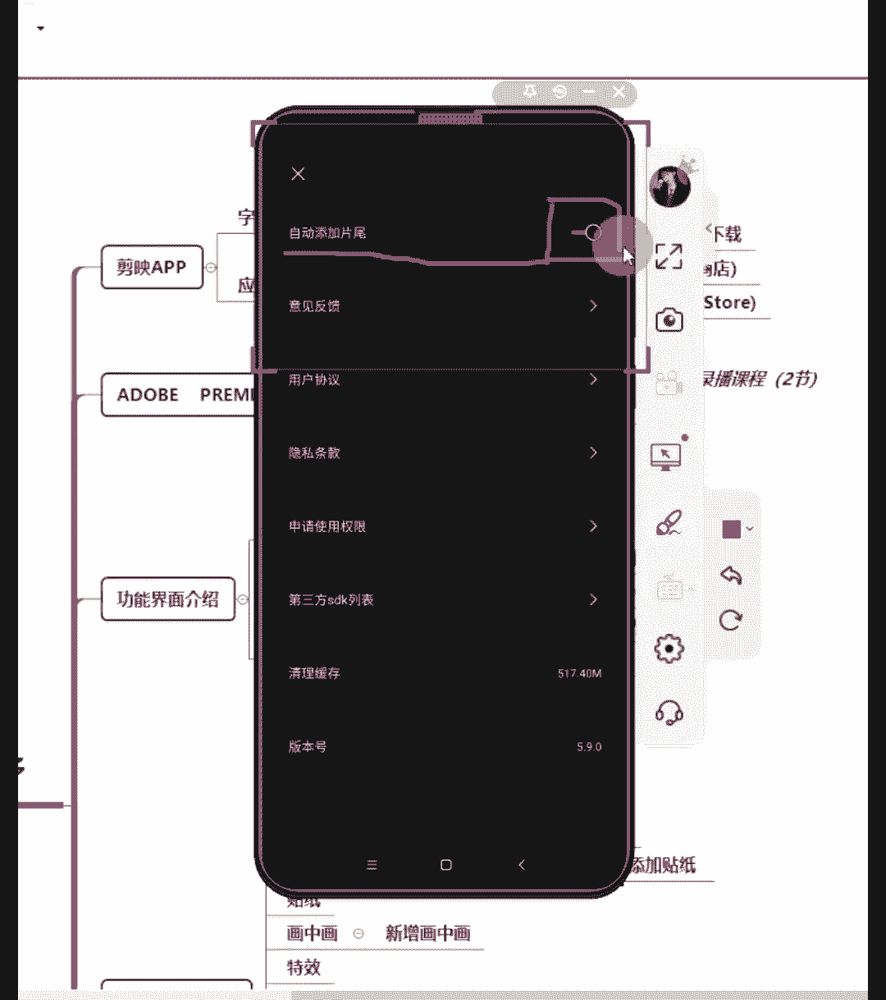
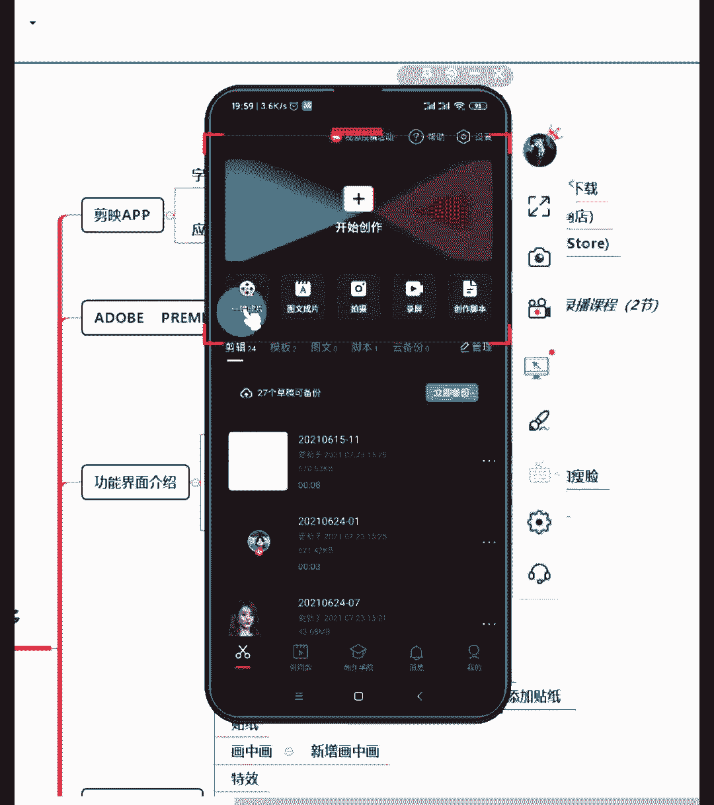
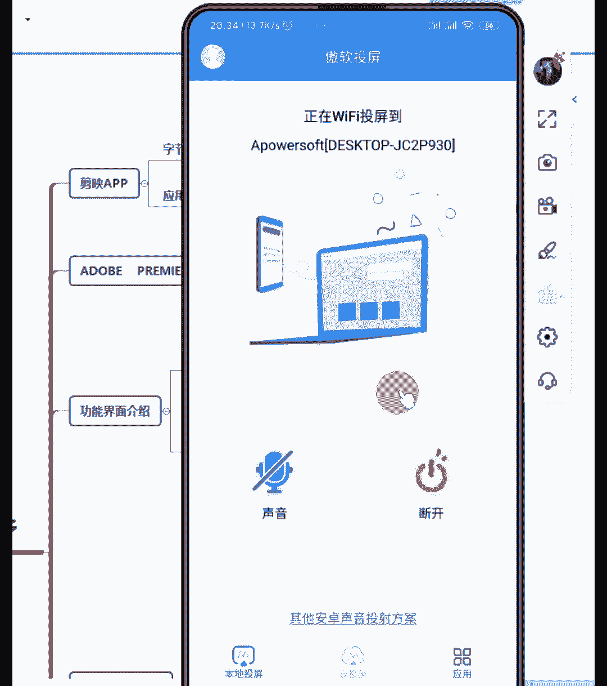
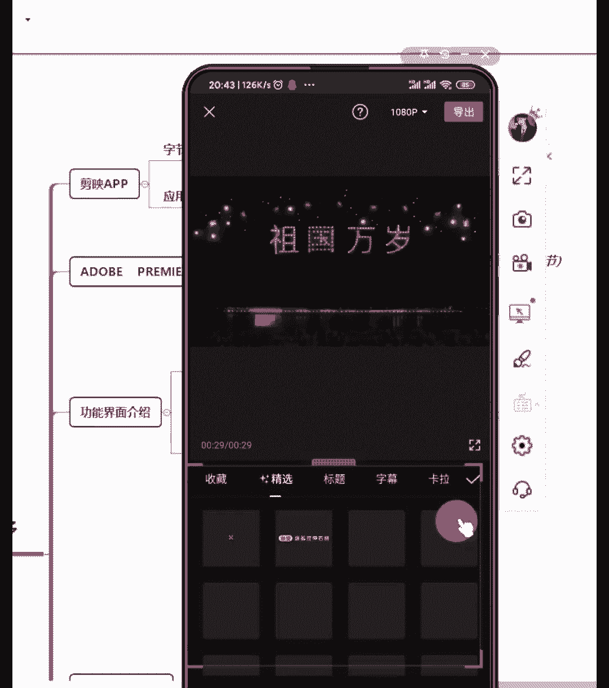
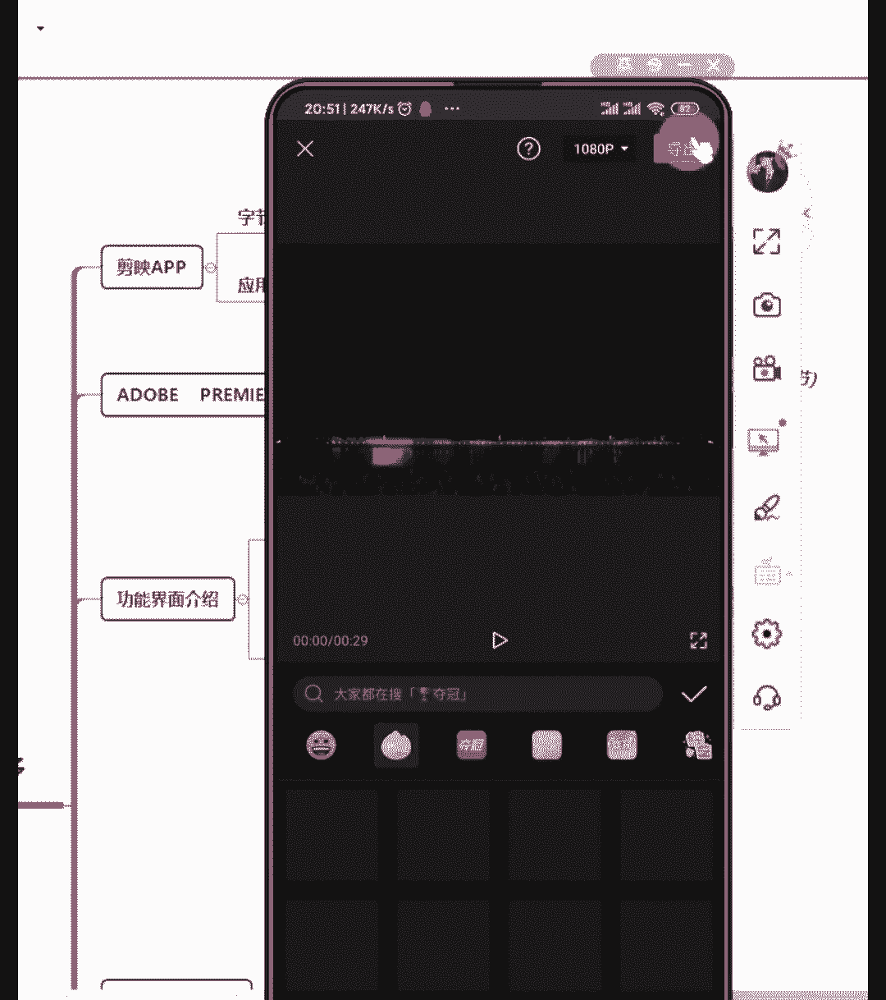

# 2024年做抖音怎么快速起号？3天养出一个高权重抖音账号，掌握这7点，抖音快速养号小技巧！【短剧推广】 - P12：8手机剪映功能详解 - 我从山中来带着大宝剑 - BV1ZCtBeNE8r

各位同学晚上好，现在能够清楚地听到老师的声音，并且能够看到画面的同学在评论区扣个一，能够听到声音，并且能够看到画面的同学扣个一，先检查一下设备有没有问题啊，咳好嗯，设备没有问题的话啊，一样的。

就是我们其实现在是每一节课，都是需要截一张图啊，就是课前截一张图，或者是课后截一张图啊，发给你的指导老师，其实这个截图就是为了让你告诉你的指导老师，你进到课堂来听课了啊，避免你的指导老师。

都不知道你到底有没有听课啊，好没有来晚啊，没有来晚，现在才刚刚开始啊，好，嗯都截好图了没有啊，都截好图了没有，好截好图了，我们就来先来回顾一下，上一节课讲到的一些知识啊。

因为上一节课呢讲的内容会有一点多啊，就主要是讲的一个利用抖音的推荐机制上热门，那么抖音的推荐机制是我们需要牢牢去把握的，因为你只有知道了他怎么去推荐你的作品，你才能够更好的去顺应它的一个机制。

然后去发布作品啊，最重要的呢还是我们做作品的一个内容啊，内容为王，占到80%到90%，技巧为辅啊，只占10%到20%，但是技巧也是非常重要的啊，技巧也很重要，虽然说内容更重要，但是技巧也很重要啊。

我们可以利用一些技巧，让自己的作品更加快的上热门，好吧好，那么上一节课结束之后呢，我有跟同学说啊，让你们在手机上面下载一个剪映好，大家手机上面现在都下载好剪映了没有，因为我们今天这节课。

主要讲的就是一个剪映功能的一个介绍啊，剪映功能的一个介绍好，因为我知道，有些同学其实很早之前就下载了这个软件，但是却并不知道应该怎么去使用它啊，上面有很多很多的功能啊，一个手机咋整啊，不用着急。

就是上课啊，上课主要就是听我说啊，上课主要是听我说，那么课后呢你就可以看录播，然后再操作啊，好吧，而如果说啊，有些同学是今天第一天刚进到课堂来的，也没有关系啊，今天刚进到课堂来也没有关系。

就是说你可以下课之后再去下载也可以的啊，下课之后再去下载好，那么先来简单的介绍一下剪映这款软件啊，因为其实啊有些同学呢，他之前可能其实有听说过其他的一些，剪辑视频的一个软件啊，比如说像快剪啊。

或者是说像呃快剪，就是呃快剪辑啊，快剪辑或者是其他的一些软件啊，那么为什么我们要选择剪映这款软件呢，首先一点是，因为它跟抖音是一家公司出产的产品啊，就是它是同一家公司出产的，那有什么好处。

就是它很多东西跟抖音是同步更新的，同步更新的，然后剪映呢它最开始只有手机版本，然后现在啊今年它又出了一个电脑版本的剪映，如果说啊，如果说有些同学你想要用电脑去剪辑视频的话，一样的也可以用剪映剪辑啊。

手机版的剪映，我们在手机的应用商店或者是应用市场，或者应用商城里面去下载就可以了，因为不同的手机，对于这个软件一个名称可能不一样，就下载软件的地方可能不一样，如果说你是苹果手机的话。

那么是在这个叫做app store那个地方啊，去下载这个软件，好吧好，那么电脑版的剪映去哪里下载啊，很多同学可能会知道，就是如果说你用会用电脑的话，你就会发现电脑去下载软件的话，它会让你附带下很多软件。

所以说电脑版的简易要去抖音的官网下载啊，他才不会让你附带去下载很多，其他的一些软件进来啊，去直接去抖音官网下载就可以的，好这是关于这个软件的一个简单的介绍啊，手机就是在这个应用商城啊。

就是你平常比如说你的微信在哪里下载的，或者是你的什么抖音在哪里下载的，就在这个地方去下载这个剪映就可以了啊，一般安卓手机就在应用商店下载啊，苹果手机在这个app store里面下载就可以了啊。

这个就是去下载的一个地方啊，如果说有些同学啊，有些同学还是不会下载的话啊，也没有关系，那么待会我会投屏实操告诉大家怎么去下载啊，好吧好，这个是关于啊剪映这个软件一个简单的介绍啊。

还有一个就是电脑pr剪辑啊，如果说有些同学对于视频剪辑这方面，有一有一些比较多的了解的话，就肯定有听说过这个pr剪辑，那pr剪辑呢，它是一个啊比较高级的一种剪辑方式啊，因为它剪辑的也会比较复杂。

那么一般像我们我们平常看到的一些电视剧，电影，它其实都是通过pr这个软件去进行剪辑的啊，如果说有同学想要学习pr剪辑的啊，可以去问你们的指导老师要这个录播课程啊，我们的pr是有录播课程可供大家学习的。

就是想要学习的话，你们可以去问你的指导老师，要这个pr的录播课程啊，好吧好，这个就是啊简单的讲一下，就是说剪辑的话呢，除了有用剪映可以剪，pr也可以剪啊，但是pr只有电脑版本啊。

强调一下pr是只能用电脑版本的，而且如果说你的电脑配置比较低的话，可能带不动这个软件啊，这软件对于嗯设备的一个要求也有一些高好吧，所以说如果说你正好就是说啊，对剪辑视频这方面有基础的情况下。

可以考虑去学习一下啊，如果说大家对于剪映都还是一个小白的话，就可以直接把这个PR忽略不计了好吧，因为其实剪映是可以满足我们的，大部分剪辑需求的，大家也不用担心说啊，老师你上课讲了pr，但是我不会呀。

我又没有电脑啊，是不是啊，到时候我都剪不出好的视频啊，不用担心啊，剪映一样的啊，可以满足大家的一个需求，虽然说更深深层次的，可能他没有办法很好的满足大家，但是一般的我们需要用到的发在抖音的。

或者是发在西瓜视频，发在今日头条上面的视频，用剪映剪辑是足够了的，好吧嗯啊pr抠图效果很好啊，确实确实啊好，那么这个pr呢就不多讲啊，因为我们也不是主要学习它啊，我们主要学剪映好。

然后再来讲一下这个剪映的一个功能，界面的一个介绍啊，很多同学呢可能在呃，甚至是在报名我们的课程之前，就已经有下载剪映了，但是一直都不知道应该去怎么使用啊，首先来讲一下它这个功能界面的一个优缺点。

来讲解一下啊，首先它的一个优点，其实大家如果说已经下载好，点进这个软件里面去看过之后，你会发现它的一个页面其实是非常简洁的啊，然后它的这个功能分区很清晰啊，非常清晰。

还有一个就是因为它跟抖音是同一家公司，出品的一个产品，所以说它的很多的一些特效啊，贴纸啊，包括热门音乐，它都是同步更新的啊，就很多啊，有些同学他说老师，我在抖音上看到一个特别好玩的特效啊。

那个特效去哪里找，其实一般在抖音上出现的特效，在剪映里面也能找到，因为他们基本上是同步更新的啊，同步更新的好，然后还有一个就是剪映，有一个自动识别字幕的功能啊，自动识别字幕，就是很多同学在疑惑啊。

那人家那么长的文案，全部都是一个字一个字打上去的嘛，不一定啊，可能就是运用到了这个自动识别字幕的功能，那么这个自动识别的话就省去了很多麻烦，大家想长长的一串文案，如果说你一个字一个字的输上去啊。

如果说嗯要用手写的话，肯定就很慢啊，用手写的话很肯定很慢，但是如果说有这个自动识别的功能的话，就一下子就给你识别出来了，就非常快啊，非常快，然后还有一个就是后期美颜功能啊，就很多人就比如说嗯跟大家讲啊。

如果说有的同学要做美食领域啊，如果要说要做美食领域的话，我告诉大家，所有的美食，后期都需要经过一定的滤镜和美颜的处理，就是那个嗯实物的这个颜色啊，不管你当时在拍摄的时候，那个光线角度找的再好。

你都没有办法把这个实物的这个颜色调整的，很让人很有食欲啊，都是需要经过后期去进行调整的，那么剪映它其实都是可以调整这些内容的啊，可以调整的，后期的一个美颜功能也可以美颜人像啊，就很多同学担心说啊。

老师我拍的一个视频，我觉得我我我不是很上镜，拍的不是很好看啊，也没有关系，因为在剪映里面它有这个美颜磨皮的功能，一样的，可以把你P得美美的啊，好这个是它的一个优点，既然有优点。

那他肯定还是有一定的缺点的啊，为什么他这个软件没有办法用来去剪辑一些嗯，就是大制作的东西的话，他肯定还是有一些缺点啊，首先一个就是他的视频是单轨道的，就是说你用剪映来剪辑视频的话。

它只有一条视频主轨道啊，只有一条视频主轨道，其他的啊包括就画中画切进去的那种，它就不算是主轨道了，所以说剪映里面只有一条啊视频单轨道，所以说他就没有办法满足更多的一些剪辑，这是它的一个缺点。

但是这个缺点并不影响我们去使用它，因为我们要用到的剪映基本上都可以满足了啊，而且剪映在不断的更新中好，那么相较于pr来说呢，嗯它确实还缺了一些其他的功能啊，还缺了一些其他的功能好。

这个就是关于这个剪映的一个优缺点的一个呃，介绍啊，最后下面讲一下这个整个工具栏的基本介绍，好，嗯现在大家在屏幕上看到的啊，剪辑音频，文本贴纸，画中画特效滤镜这些好，呃，想问一下。

就是已经下载了剪映这个软件的同学，你们有点进剪映这里面去看到这些功能分区吗，就是已经下载了这个软件的同学，你们点进剪映里面去，有看到这个功能分区了吗，啊没有下载没有关系啊，看到了一部分啊，有的看到过了。

有的没有看到过是吧，好那我现在先跟大家讲啊，先跟大家讲，就是说因为我待会儿会投屏啊，就是你们等会会看到我手机上的剪映啊，跟你们手机上的剪映也是一模一样的好吧，就待会我会投屏给你们看到啊。

好那么首先就是它这个啊，我现在放给大家看的这一部分啊，剪辑音频文本啊，呃我记得好像是文字啊，就是这个那个上面写的是一个文字好吧，文字贴纸画中画特效滤镜比例背景调解这些啊。

我们统称为在剪映剪辑里面的一个一级功能啊，一级功能栏好吧，这个都统称为一级功能栏，然后一级功能栏里面点进去啊，剪辑里面再点进去，它就会有一个二级功能栏啊，二级功能栏就是二级功能栏。

里面有更多一些小的功能，比如说分割视频啊，或者是给视频调整变速啊，调整视频的音量，添加动画啊，删除视频或智能抠像，漫画编辑滤镜等等啊，有很多啊，有很多这些都看到了，但是不知道怎么用，没有关系啊。

我都会有讲解的啊，都会讲解到的好，这个是简集里面的一个啊，就是剪辑这个一级功能栏里面，下面的一个二级功能栏，里面包含了这么多功能啊，包含这么多功能，那么音频里面也是啊，音频里面也有它的二级功能栏。

里面包括有音乐，音效提取音乐以及抖音收藏和录音啊，好接下来就是文字啊，文字的话里面大概有新建文本啊，新建文本还有一个文字模板，然后有识别字幕，识别歌词以及添加贴纸，那么这三个我着重放在最前面。

是因为它确实也是排在最前面的，我们平常简视频要用到的最多的也是这三个啊，也是这三个啊，就是一个是剪视剪辑啊，剪辑就是基本上是对视频的一个操作，然后一个就是音频，音频呢就是你添加背景音乐也好。

添加人声也好，或者是添加其他，就是只要是声音的地方啊，都是通过这个音频添加进去的啊，通过音频添加进去的，还有这个文字，就比如说你在抖音上面看到别人的视频上，这个字幕怎么添加上去的呢。

就是点以及文字这个功能栏里面啊，可能是新建的一个文本，也有可能是通过识别啊，识别那个音频里面的这个字幕，把它识别出来的，好吧好啊，有些同学觉得讲讲太快了是吗，哦我是这样子想的啊，我跟大家讲一下。

就是我在这里就是因为前面的话都是文字内容，你们没有看到这个实际的软件的话啊，没有看到实际软件的情况下，我讲很多的文字，你们其实也不是很理解，那么我是想说啊，能把这个文字部分讲快一些啊，讲快一些。

然后待会我多留一点时间，就是给你们看到这个软件应该怎么去操作啊，好吧嗯，就待会看到软件的话就会更好一些啊，这个软件叫剪映啊，如果说来迟的同学还不知道这个软件叫什么话，告诉大家啊，叫剪映。

啊今天主要介绍的这个软件叫剪映啊，好因为我有时候可能会讲着课，讲着课，这个啊这个语速不自觉的就变快了啊，如果说太快的情况下，大家可以在评论区提醒一下我啊，提醒一下我，没有关系的啊。

好这个软件的名字叫剪映啊，有就是有些同学可能来迟到了啊，好嗯接着刚刚讲的啊，接着刚刚讲的，那么刚是讲到文字这个部分啊，文字这个部分好不会操作，没有关系啊，我都说了，实操课程就是要教大家去实操的啊。

就是要教大家去操作的啊，叫剪映啊，叫剪映好吧，这个软件啊再强调一次好吗，叫剪映啊，好那么还有就是一个贴纸啊，以及画中画这个功能，画中画这个功能点进去呢，有一个新增画中画的一个二级的一个啊，工具栏啊。

好贴纸里面有各式各样的贴纸啊，各式各样的贴纸，然后特效特效里面也有各式各样的特效，就是很多时候你们在抖音上刷到的很多视频，它就是加了很多的一些特效啊，还有一个滤镜滤镜呢它也是在不断更新的啊，不断更新的。

它这个滤镜的话，它会对视频的整体的一个，画面的一个颜色有一定的调整啊，好还有一个就是比例比例的话是这样子的啊，跟大家讲一下，做抖音视频的比例都是九比16的一个比例啊，抖音视频的比例都是九比16。

就是说你的这个视频剪好了之后呢，你要把它调整成九比16的比例，再把它发布到抖音上面去啊，剪影跟剪映不是一回事啊，不是一回事，好啊我我想说一下啊，今天讲的这个其实是非常简单的。

因为这个就是剪映的一个基本功能的介绍啊，剪映的一个基本功能的介绍，好吧好，那么比例往后的一个功能栏呢就是这个背景啊，很多同学说啊，那我在抖音上看到别人的背景，就是有个各种各样的背景啊，各种各样颜色的。

或者是各种各样花色的一个背景，那么这个背景里面啊有三种选择方式啊，一个是画布颜色，那么画布颜色可以调什么呢，就是把背景啊，比如说就是它调纯色背景，就你们在抖音上面看到的一个纯红色，纯蓝色。

纯粉色这种背景，它就是通过在画布颜色里面调整的，还有一个就是画布样式，画布样式的话，剪映里面本身就给你提供了很多的样式啊，提供了很多样式，好待会也会给大家展示到的，最后一个就是画布模糊。

画布模糊是这样子的，就是很多同学在抖音刷视频的时候，可能会看到，这个视频的上半部分和下半部分是模糊的，然后中间那一段是清晰的，那么这个就是应用到了画布模糊的，这种背景调节的方式啊，好这个是背景这一块啊。

背景这一块好，最后一个就是调解，那么调解里面包含的内容有一点点多啊，就比如说调视频的一个亮度，对比度，饱和度，光感锐化，高光阴影色温色调褪色，暗角颗粒等等，好这些里面有这么多，很多同学可能就会疑惑。

那老师我自己剪辑视频的时候，我到底要调哪些呢啊这个我到时候会跟大家讲，其实我们要调的东西并不多啊，并不多好，那么剪映的一个基本的功能栏啊，基本的功能栏就全部都讲完了啊，全部都讲完了。

接下来就是我用我的手机投屏给大家实操啊，我用我的手机投屏给大家实操，就是说，接下来你们看到的是我的手机上的一个画面吧，嗯等我一会会啊，投个屏，好这就是老师的手机啊，这是老师的手机，那么我的啊。

我用的不是苹果啊，我用的是一个安卓的手机啊，是安卓的手机，然后先讲一下，如果说有些同号现在想问一下，大家知道剪映怎么下载了吗，啊你们知道剪映怎么下载了吗，如果说不知道的啊，就扣个一啊，如果说不知道的话。

就扣个一啊，知道了的话就没有关系啊，嗯我看一下哦，嗯就是啊其他同学知道了的话，就稍稍稍体谅一下啊，稍稍体谅一下，就是我我告诉一下，其他的就还不知道去哪里下载的同学，演示一下怎么去下载啊。

好我先强调一下啊，老师的手机是一个安卓手机啊，是一个安卓手机，小米机啊，嗯是一个小米手机，然后呢在哪里下载啊，这里有一个应用商店，看到没有应用商店啊，点到这个应用商店里面去下载啊，嗯稍等啊，稍等一会哈。

好在这个应用商店就在这个首页上面，这里有一个搜索框啊，有一个搜索框，然后直接点一下这个搜索框，输入剪映啊，剪映，然后出来的第一个这个软件啊，这个软件就是剪映啊，就是剪映好，他现在提示我要升级啊。

我已经安装好了，就是下载这个软件就可以了好吧，下载这个软件就可以了啊，剪辑就是就是这个剪映啊，嗯好就没有下载的同学啊，没有下载，同学就是这么去下载就可以了啊，点这个啊，我因为我这个是已经下载好了。

所以它现在显示的是一个升级啊，显示的是升级，如果说你没有下载的话，它这里显示的是安装，你点一下就可以了啊，点一下这个位置就可以了，苹果手机啊，苹果手机我刚说了啊。

是在那个叫做一个叫做app store那个软件里面啊，叫做app store那个软件里面嗯，就是这个苹果手机是在这个软件里面去下载啊，在这个软件里面去下载，因为我的手机是安卓手机啊，没有办法。

所以说没办法给大家演示这个了啊，啊有点抱歉啊，有点抱歉，好吧咳，好那么这个软件啊，这个软件下载好了之后就是长这个样子啊，长这个样子好吧，就是一个剪刀的一个图标啊。

一个剪刀的一个图标好吧嗯好现在啊现在啊对，下课再去下载啊，下课下课再去下载啊，没有关系好，那么现在呢就先先听我操作啊。

听我的一个操作，然后先点进剪映里面去啊，点进剪映里面去好，点进剪映里面去的话，一般就是这个页面啊，一般就这个页面这样子的啊，整个页面给大家看全，它就是这个样子的啊，然后在这个页面里面呢啊有些同学啊。

有些同学说老师我点进去不是这个页面啊，那么这个时候你就要看清楚你的这个地方，点的是哪里啊，如果说你点到了这个位置的话，那就不是这个页面啊，一定要点到最前面这个剪刀啊，点到这个剪刀这里啊。

剪刀这个位置这个是首页啊，剪映的首页是这个位置好吧，然后啊大家下载好这个软件之后啊，其他的功能先不管啊，我先给大家讲一个最最重要的东西，就是你们要点到这个右上角的设置里面去啊，点到这个设置里面去。

好课程都是有回放的啊，我看到很多同学来迟到了啊，强调一下课程都是有回放的好吗，好，那么先说一下啊，点击右上角的这个设置的这个按钮啊，点击设置这个按钮点进去啊，点进去第一个选项，看到第一个选项。

这里有一个自动添加片尾的一个选项啊，如果说你是第一次下载使用这个软件的话，就是我现在框出来的这个位置，这个位置是打开状态啊，是打开状态，就是我现在可以把它打开，就是你们第一次刚下载这个软件的话。

这个位置绝对是这样子显示的啊，绝对是这样显示的，那么这个地方啊一定要把它关上。

就是你点一下这个地方啊，点一下这个地方呢，它会出现一个提示，就是确认移除片尾吗，它有两个选项，一个是保留片尾，一个是移除片尾好，这个时候你要选择这个点一下这个移除片尾啊，点一下这个移除片尾好吧。

点它啊，点它之后呢，它就可以把它关上了啊，把这个自动添加片尾的这个选项关上了，因为很多啊，之前有很多同学出现了什么情况呢，就是说诶这个视频剪完了之后，后面怎么带上了一个剪映的尾巴啊。

这个剪映的尾巴就是要在这里关掉的啊，在这里关掉的啊，苹果的应该都是一样的啊，应该都是一样的，我没有记错的话，就虽然我没有用过苹果手机，但我见过好吧咳好，就第一步啊，就下载好这个软件，要使用它之前啊。

第一步先是去做这个事情啊，好这里操作完了之后，其他的都不用操作啊，其他的都不用操作，然后点这个叉叉啊，点这个叉叉叉出去就可以了啊，叉出去就可以了，好再来介绍一下这个首页的这个页面啊。

首先上面就有一个点击这个开始创作，就是我们要剪辑一个视频之前啊，都要点击这个开始创作去导入视频进行剪辑的，就是说你要剪辑视频之前，你的视频必须先下载到你的相册里面啊，如果说不能下载到相册里面呢。

至少也要下载到一个名字叫做DC i m，这个文件夹里面好，关于这个文件夹的事情，我们后面再说好吧，我们现在就讲他这个点击开始创作之后，首先跳转到的一个页面。

就是你的相册页面啊，就是我点一下开始创作好进去的这个位置，就是在这个位置我能够看到的所有的内容啊。

所有的内容就是是我相册里面的东西啊，这些东西全部都是我相册里面有的东西好吧。

这些啊全部全部都是我相册里面有的，点击开始创作就会跳转到这个页面好，那么这个时候啊，其实除了会跳转到这个相册页面之外呢，这上面这里还有一个素材库的选项嗯，等一下啊，素材库这个素材库里有什么啊。

这个素材库就是剪映自带的一个素材库啊，自带的一个素材库，好，我可以点进去给大家看一下。

这里面都有些啥啊，好更新了啊，最近更新了有很多东西了哈，就是因为今天好像是一个特殊的日子啊，今天是个特殊的日子嗯，就更新了很多东西啊，就是而且刚刚剪映也在提醒我，他要更新了，好。

那么这个里面啊它有哪些内容啊，它有哪些内容就看到没有一个夺冠2021啊，夺冠2021，就是这个，就是关于奥运会的一些视频的一个片段啊，视频的一个片段有没有看到没有，就这个是素材啊。

这个是剪映自带的素材库，就是当你以后啊，我就是会布置作业，让你们去练习实操剪映的时候，当你们找不到素材的情况下，你们可以就直接在这个素材库里面去下载素材，听懂了没有，就是因为我这几节课啊。

这几节课呢可能都会给大家相应的布置到一些，关于这个剪映的一个作业，那么你们说啊，老师我都还不知道怎么下载素材，你就给我布置这个作业，那我都不知道去哪里找呀，好这个去哪里找啊。

可以直接用剪映自带的这个素材库，在这里面找就可以了啊，在这里面找就可以了，这里面有很多很多啊，这里第一个选项，这里是夺冠2021，然后后面有一个黑白场啊，黑白场后面还有转场片段啊，转场片段。

然后还有一些搞笑片段啊，这个搞笑片段的话随便放一个出来，大家应该都有看到过啊，给大家展示一个啊，给大家展示一个，嗯等一下我拖不动这个框框了，好给大家看一下这个下载一下好嗯。

这个土拨鼠尖叫的这个视频大家有见过没有，就之前之前大家有没有见过这个土拨鼠尖叫，就是你们之前刷一些搞笑视频或是一些视频啊，就有见过，那么这个素材在哪里，就在剪映里面就有啊，你们也不用担心说啊。

老师我去哪里找这个土拨鼠尖叫的视频啊，啊在这个剪映里面就有的，其实这个素材库里面真的有很多，很多的一些素材啊，就比如说我们平平常经常看到的一些啊，这些都是有的啊，在这里面都有好吧。

所以说你们之前可能看到的很多，都不知道人家去哪里找那么多搞笑的素材，找不到的话，直接在这个素材库里面可以找到啊，直接在这个素材你库里面啊，有这个搞笑片段，还有一个什么故障动画啊，啊空镜头片头啊。

片尾就都有很多啊，这下面都有很多，还有蒸汽波啊，最近更新了啊，更新了之后越来越多了啊，更新之后越来越多了，还有节日氛围，还有一些配音片段啊，就非常多啊非常多，好像已经滑到最后了。

大家就是有这么多的素材啊，就是如果说我后面布置的一些课程，就是布置的一些作业，大家不知道去哪里找素材的话，就可以直接先在这个素材库里面下载啊，直接在素材库里面下载好吧，咳好，现在就回回去啊。

回回去点到这个照片视频这一块啊，这个就是照片视频，这里面有的所有的东西就是你相册里面的啊，首先它会先展示的是你相册里面的视频，然后再展示这边啊。

下就是右边这里显示的一个照片，点一下展示的就是你的一个照片啊。

展示就是你一个照片，好吧好好，现在先退回去啊。

退回去又回到这个首页的这个页面啊，就是点击开始创作这个页面，好开使创作这个页面的下面有一个一键成片啊。

一键成片好，一键成片的话，它就是直接让你导入素材进去之后，它自自动帮你去生成一个视频啊，自动帮你生成一个视频，好，这个东西不推荐大家去使用啊。

不推荐大家去使用，好吧好，然后有一个图文成片，图文成片也是和一键成片差不多的一个道理啊，就是输入图片啊，就是把图片和文字放进去之后，它自动帮你生成一个视频啊，这就是这两个啊。

前面这两个这两个啊都是你只要把素材导进去，它自动帮你生成的，但是我告诉大家啊，这两个东西都有一个弊端，什么弊端呢，它帮你生成的视频发布到抖音上，很容易被判搬运，所以说这两个功能我是不推荐大家去使用的啊。

画个叉叉啊，画个叉叉，我不推荐大家去使用这个这两个功能啊，不推荐好，后面有一个拍摄功能好，这个拍摄功能的话，我也不推荐大家去使用，为什么呢，因为除了我们手机，原相机带的那个相机去拍摄其他的视频。

那个视频是最高还原原原素素材的啊，如果说你用剪映去拍摄视频的话，很有可能导致画质被压缩掉了，所以说这个拍摄这个功能，我也不推荐大家使用啊，我也不推荐大家使用好，后面有一个录屏的功能。

这个录屏的功能我希望大家都要会啊，都要会，为什么呢，很多时候你们在制作视频的时候啊，可能会出现什么情况呢，不知道自己哪里操作错了，但是呢你的指导老师又不知道你是哪一步操作，出了问题的时候。

你的指导老师可能会说啊，同学你把你的操作录屏给我看一下，结果这个时候你说啊老师录屏怎么录屏，我不知道怎么录屏啊，我只有一个手机怎么去录屏哈，告诉大家怎么去录屏啊，但其实一般的手机。

它都会自带一个录屏功能的啊，一般的智能机都自带，但是你当你没有找到你手机的自带，录屏功能的时候，你可以用剪映里面的这个录屏好吧，点击这个录屏点进去啊。

点进去之后，然后点击这个开始录屏就可以了啊，点击这个开始录屏好，我可以点一下啊，点一下之后，它下面会出现一项剪映，将开始截取您的屏幕上显示的所有内容。

然后你点击立即开始啊，点击立即开始，它又会有一个三秒的倒计时，然后接下来的每一步操作，他都会帮你记录下来啊，额稍等一会会啊，我这个投屏卡住了啊，稍等一会会投屏卡住了，好有些同学说啊。

老我的怎么没有录屏啊，如果说说你的没有录屏的话，很有可能是，很有可能是因为你的这个剪映没有更新啊。

剪映没有更新，好吧嗯，稍等一会会，我这个投屏一下子出bug了，嗯我重新给大家投一下，重新给大家投一下，啊稍等啊，很快很快很快啊，因为有时候网络会不稳定，所以说这个啊投屏会有一点点的不稳啊，好。

就是这样子的啊，这个录屏功能好吧，这个录屏功能就是点进去点击开始录屏，你点击了开始录屏之后，它会把你屏幕上的所有的一个操作，都记录下来啊，当你录完屏之后啊，就是刚刚。

录完屏之后啊，就是点击这个开始录屏，然后刚刚我录了一段啊，就是因为卡住了，你们没有看到，然后录的这一段呢，它就会在这个位置啊，他会在这个位置，然后你可以怎么去发给你的指导老师呢，这里有一个管理啊。

一个管理，你点了那个管理之后，下面有一个选项啊，保存到相册，当你把这个视频保存到相册之后，你就可以发送给你的指导老师了啊，可以发送给你的指导老师，他就可以看到你在操作这个视频的时候。

是操作这个嗯步骤的时候是哪个地方出了问题，然后他可以更好的去指导，你好吧，就是当你的指导老师跟你说啊，同学录个屏的时候，你就不用去找哪里可以录屏啊。

剪映就可以录屏啊，这个功能还是非常好的，好吧嗯好，那么最上面的一些啊功能就讲完了啊，然后就是到下面下面这些啊，比如说剪辑模板图文这些就可以不用管了啊，不用管了，好现在先来告诉大家怎么进入到剪辑页面。

就是我最开始跟大家讲的，里面有什么剪辑文字啊，音频那些东西是怎么出来的啊，哦创作脚本啊，因为这个创作脚本是我今天更新的时候，刚看到的啊，是这样的，就是创作脚本呢可以点进去看一下。

它里面啊有美食旅行萌宠这三种类型，这个创作脚本是什么意思，如果说啊你不会拍美食的视频，这上面就相当于有一些教程，告诉你应该怎么去拍啊，怎么去拍，比如说啊这上面是美食，我点开一个啊，我点开第一个啊。

嗯稍等一下这个投屏总是反应会慢半拍啊，好你看我点进去之后啊，点进去进之后呢，这里面有一个别人已经拍好的一个视频啊，这上面是别人已经拍好的一个视频好，那么怎么去应用它的这个功能啊，下面有一个脚本结构。

这个脚本的结构，意思就是说，拍视频是从哪几个步骤去进行拍摄的啊，它首先有一个拍摄说明啊，拍摄说明，然后他前面有开场介绍一个烹饪过程，以及一个成品的展示好，那么这个时候，当你想要使用这个脚本的情况下啊。

你就可以点击下方的这个去使用这个脚本，它其实是手把手教你如何去拍一个美食视频，你就按照他的这种方式去拍摄就可以了，那么你拍摄出来的这个作品呢，就可能跟他展示的这个视频是差不多的，一个效果啊。

差不多的一个效果好吧好，这个就是创作脚本里面的一些功能啊，创作脚本里面的一些功能好，这个功能的话是最近刚刚更新的啊，最近刚刚更新的也不是非常的完善啊，很卡吗，很卡吗，问一下问一下很卡吗，不卡哦。

有的应该是没有太大问题的啊，因为因为我其实发现了，就是我一投屏可能就会有一些卡啊，一些我一投屏就会有一些卡，好吧，还好是吧，还好不卡是吧哈，嗯稍等一会会啊，我这个投屏确实是卡住了啊，投屏确实卡住了。

换个电脑啊，这不是电脑的问题啊，不是我电脑的问题啊，是这个，因为因为我投屏的话，我是必须用这个嗯同一个设备去操作，所以说稍等一会儿，我我换个网络试一下，不安全啊，不然酸报名就是浪费短暂时间。

啊我我重新换一个网络啊，我重新换一个网络，看会不会效果稍微好一些，好吧嗯嗯只用手机都可以操作吗，对啊这个就是呃这个就是在手机上操作的呀，就是我刚投屏给大家看到的，就是我的手机啊，这是我的手机。

呃等一下我把我手机缩小一些。

谢啊好接下来正式讲啊，怎么进入到看到剪辑文字啊，以及音频这些功能栏里面去啊，好啊比前几天好了啊，好是因为我我我稍微换了一下设备啊，好那么这个时候想要剪辑一个视频啊，我刚开始也强调过了。

你要剪辑一个视频呢，这个视频首先是要保存到你的这个相册里面的，对是我的WIFI有问题啊，我所以我刚切了一个网络啊，我刚切了一个网络好。

那么这时候呢点击这个开始创作啊，点击开始创作好，点击开始创作之后呢，可以导录一个你今天想要剪辑的一个视频啊，我找一下我今天剪个什么视频呢，哈我我就随便导一个啊，随便导一个视频进去哈。

嗯好那么我现在就导了一个视频，进去之后，我的视频导进去之后呈现的一个界面啊，呈现的一个界面是这个样子的啊，就是这样子的，好吧好，先给大家看到手机最下面这部分的这个界面啊，最下面这个部分是这样子的。

有剪辑啊，音频文字贴纸，画中画特效以及滤镜啊，还有比例背景调节，这就是我刚开始给大家介绍的，剪映的一级功能栏啊，一级功能栏里面有的这些功能啊，全部都在，当你导入了一个视频进去之后。

它会全部呈现在这个下方啊，全部呈现在这下方，好吧好，嗯没有吗，是等一下是你们没有看到屏幕上的一个变化吗，还是什么情况，因为我其实嗯就是我投屏的话，可能就会导致这个网络有点卡顿啊，所以说我不知道我这边。

能不能和你们是同步的啊，哦看到了是吧，好可以看到好吧好，这个是导入视频啊，就是我刚开始是点击开始创作啊，点击开始创作，导入了一个视频之后，才会在这个位置看到有这些功能啊，好导入了视频之后呢，整个界面啊。

整个界面就是这个样子的啊，就是在你的手机上可以看到的一个全界面，就是这个样子的，好视频在这个位置好，那么一步一步的来讲啊，先讲一下最上面的这些东西啊，最上面的这些东西好，这个差不用说了。

我一点这个差就直接退出去了，直接点这个叉就退出去了，好然后这上面有一个1080P啊，1080P好，这个1080P是什么意思呢，就是你素材，就是这个素材导出的时候的一个清晰度啊，导出的一个清晰度。

然后我可以点一下它啊，点一下它就会有点变化啊。

点一下它就会出现这些啊，就是一个分辨率和一个帧率，分辨率通俗易懂的来讲就是清晰度啊，清晰度还有一个帧率，通俗一点来讲就是流畅程度啊，这个帧率调到越高，那么这个视频的流畅程度就越高啊。

上一节课呢我有讲过啊，你剪辑视频这个视频的流畅程度一定要足够高，当然如果说你发现你的这个视频，流畅不足的时候，就这个流畅程度不是很高的情况下，你可以把这个帧率的这个值拉到最大，就是拉到60啊。

拉到60啊，60是最流畅的，但是一般帧率能够达到30都是比较流畅的了，因为如果说帧率低于24，或者是等于24的情况下，才会觉得这个视频看起来非常不流畅啊，一般正常情况下都是可以的，好吧好。

然后这个页面啊就不多说了，因为现在呢在手机上啊，在手机上抖音，也是不支持一个2K4K的画质上传视频的，所以说也不要求大家要把这个清晰度，调整到这么高啊，因为调整到这么高的话，作品没办法发布。

所以说这个就1080P就够了啊，1080P的话就是一个超清的一个清晰度啊，超清的清晰度好。

这个时候这个东西怎么收回去啊，再点一下上面这个1080P它就收回去了啊，收回去好，这个1080P的右边还有一个导出，这个导出就是说你的视频全部都剪剪辑好了啊，全部都剪辑好了之后。

你就点这个导出就可以了啊，这是最后一步要做的操作啊，最后一步要做的操作，好吧好，这是顶上的一个介绍啊，顶上的一个介绍，分辨率拉满会怎么样啊，分辨率拉满的话，它其实是会增大你的这个视频所占的一个内存。

也会让你的这个视频的这个画质，会更加清晰一些啊，因为它会被压缩的程度会少一点，但是啊拉满就是你这个清晰度啊，就是分辨率拉到2K4K的一个值的话，在抖音上是没有办法发布这个作品的，因为现在抖音不支持啊。

手机手机端的抖音是不支持上传，2K4K画质的视频的，所以说我就没有强制说要求大家去拉满这个啊，好正常情况下可以不用调整的啊，正常情况下可以不用调整，对的啊，好那么接下来啊，接下来下面之后就再来讲一下啊。

这个这个画面啊，这个画面就是我的一个视频的画面啊，这是我的一个视频的画面，然后接下来接下来啊分区来讲啊，分区来讲就看不清吗，我现在已经尽可能的就是给大家放到最大了啊，如果说我再放大一些的话。

就看的更加不全了好吗，因为我现在是尽可能嗯呵看不到。

稍微再放大一点点啊，把我的手机稍微放大一点点好吧，就我尽可能的放大，因为我怕我放太就我手机放的太大了的话，你们可能更加看不清楚啊，好在这个位置啊，在这个位置好，先给大家看到一个就是这个。

这个地方这个地方啊，这个地方它有一个时间啊，这个是一个时间，这个时间呢前面是0。00啊，后面是一个0。29，这个后面的这个时长是一个视频的总时长啊，视频的一个总时长，然后前面那个零零的意思。

就是说我的视频播放到哪儿了，它就会显示多少啊，视频播放到哪儿了，就显示到多少，比如说如果说我的视频播放到一秒的话，它就会变成0。01这样子啊，这个前面就是一个时间啊，就是一个时间好。

这个相信大家就看一遍，应该都能明白的啊，好然后中间这里有个三角形的标志。

也是非常简单的，就是我点一下就这三角形的标志，我的视频就开始播放啊，点一下这三角形的标志，视频就开始播放，点一下啊，看我的视频就在播放下面这个轨道在走啊，好我把他拉回去拉回去啊。

好点两下，就是又给它停下来了，又停下来了，然后这里有一个啊，向左的一个箭头和一个向右的一个箭头，那么向左的一个箭头呢，其实就是撤销上一步操作啊，撤销上一步操作，向右的一个箭头呢是恢复上一步的操作啊。

撤销以及恢复，最后还有这里有一个小框框啊，这里有个小框框，这个小框框呢其实就是全屏播放的意思啊，全屏播放的意思，因为我们都知道，在这个剪映里面去剪辑这个视频，我们看到它只占到这么宽啊，只占到这么宽。

但是当我的整个视频剪辑好了之后，我想看一下它在全屏播放的一个效果是怎样，但是这个时候我又不确定我的视频是否剪好，我不想把它导出来的情况下，你就可以点一下这个框框，把它进行一个全屏播放啊。

把它进行全屏播放，好吧好一直看到有同学说学不会嗯，就看不见是吗，是看到的整个屏幕是黑的吗，这个朱蕊同学，朱蕊同学是完全看不到屏幕上的内容吗，呃我就是因为有部分同学啊在在在说，所以我想问一下，就是。

啊我想跟大家讲一下，就是你们用手机看课程的话，其实是可以放全屏看的好吧，其实是可以放全屏看的啊，你们没有必要去看到下面的这个讨论区啊，黑屏的话应该是你自己的那个呃，黑屏的话。

应该是你自己手机的一个网络的问题啊，因为你们现在看到的，绝对应该不可能说是黑屏啊，因为我这个下面很明显是有彩色的画面啊，啊是有彩色画面的呀，好吧好，介绍完这一这一栏之后啊。

再讲到下面最重要的这个功能区里面啊，功能区里面好，最下面的这个功能区，待会再讲，先讲一下上面的这个啊，上面这个，首先这里有一个关闭原声啊，关闭原声好，如果说有的同学说整个屏幕全部都是黑屏的话。

你看一下是不是你的网络啊，可是你的网络问题，因为我我这边绝对不可能全部都是黑屏的，很显然我的画面上有红的呀，啊好吧嗯。

首先来讲一下啊，就是这里有一个关闭原声，那么关闭原声的这个按钮是怎样的呢，就是我一点这个按钮啊，比如说我点一下啊，嗯等下点错好，我点一下这个关闭原声的按钮，关闭原声之后呢。

它就会所有的原声都已经关闭掉啊，我点了一下之后。

它现在就变成开开启原声了啊，开启原声意思就是说我的原声已经全部关掉了，然后我再点一下，那么原声已全部开启，它会在上面有一个提示啊，有一个提示嗯，好，那么在关闭原声这个喇小喇叭的右边。

还有一个设置封面的选项，就是上一节课，我给大家看到的一个账号的个人主页，他的封面其实都是非常整齐的，那么怎样做到这么整齐的封面呢，就是专门在这个设置封面里面，去设置一个封面啊，好具体应该怎么去设置封面。

这个问题呢，我后面啊会单独讲啊，单独讲，因为我现在这个视频的话线不是很好设封面啊，所以说我后面会单独拿出来讲，好吧好，就，你现在只需要了解在这里可以设置封面就OK了，可以设置封面就OK了。

好然后后面后面我们可以看到的这一长条啊。

这一长条就是这这一部分啊，这一部分这个就是我的一个视频轨道，视频轨道啊，就是有些同学说刚开始我说轨道的时候，有同学说不理解轨道是什么意思好，那么这一长条啊，包括这一长条，后面还有啊。

后面还有就这整个一长条就称之为一个轨道啊，称之为一个轨道，好吧，这个这个这个一长条都称之为一个轨道啊，这这一长条一长条啊，就是整个视频轨道啊。

整个视频轨道这就叫轨道啊，所以大家现在大家应该就是，如果说刚刚有不理解轨道什么意思的话，现在应该能够理解的吧，啊不是火车轨道，不是火车轨道，好不好好，这个就是一条视频轨道啊。

那么后续随着我们的课程不断的学习的话，还会讲到一个音频轨道，文字轨道或者是一些特效的轨道啊，这个在后面的课程都会详细讲到啊，会详细讲解到的好吧，不是有点不适应啊，是嗓子有点不舒服，好吧啊。

有点不好意思啊，好，那么讲完上面啊，讲到最下面最最最最最重要的部分了，好就是下面的这个一级工具栏啊，一级工具栏里面先讲一下一个这个啊剪辑剪辑，这个一级工具栏里面点进去啊。

我现在接下来你们看到屏幕上的一个变化操作，是因为我点了剪辑啊，点了剪辑之后，你会发现里面有分割变速啊，音量动画删除智能抠像，然后接着往左滑，你还会看到啊玩法音频分离编辑啊，还有滤镜调节美化等等啊。

蒙版各种功能啊，各种功能，就就这这一排里面有非常非常多的功能啊，大家其实课后可以去看一下，好先啊，讲一下我们经常会用到的这个分割，分割是什么意思呢，嗯打个非常通俗易懂的，比方就是像菜刀切菜一样啊。

像菜刀切菜一样，就比如说一根萝卜，我要把它切成两段，我用菜刀在中间把它一切，那么一个视频我想要给它分成两段，那我就分割啊，用这个分割的功能好看，你具体是在哪个位置要分割好，先强调一下。

比如说我的这个视频啊，假设啊我想在这个地方分割啊，我想在这个地方分割，那么我分割的位置，这个白色的指针啊，这根白色的指针一定要对准我要分割的位置，然后我点一下这个分割啊，点一下这个分割好。

点一下这个分割之后，大家会发现下面的这个呢，它又回到最原始的状态了，然后在我上面分割的这个部分，多了一个白色的小方块啊，多了一个白色的小方块，好，这个就是最基本的一个操作啊，分割分割啊。

分割找不到在哪是吧，跟大家讲一下，要先点击剪辑啊，先点击剪辑，如果说你不点击剪辑也没有关系，点一下这个视频轨道，一样的能看到分割这个选项啊，一样的能够看到分割这个选项啊，对的就是分成两段了啊。

我刚不是说了吗，就是就像你平常切菜的时候，切萝卜的时候，一刀下去一条萝卜就变成两段了啊，就这个意思，那么我点一下这个分割呢，视频就变成两段了，好吧这么说大家能理解了吧啊，这分割功能它就像菜刀一样啊。

它就像菜刀一样嗯，好可以理解的话，我们再来讲下一个啊，下一个就是个变速功能，变速功能呢就是这个视频速度的一个改变，就我们平常刷抖音也会看到一些视频变速啊，视频变速就突然加快了啊，突然加快的那种。

就是很多的视频里面都会用到啊，尤其是一些美食视频里面，他们切菜真的切的那么快吗，其实没有啊，其实没有，就是他们会用到一个变速的功能，那么这个变速呢有一个常规变速和曲线变速啊，常规变速就是正常的变。

所有整个视频都调成两倍速，或者是整个视频都调成三倍速，这样子的一个变速，曲线变速就是这一段是变成了三倍速，或者是另外一段又变成了两倍速，这个就是曲线变速啊，那么这个变速这个问题呢。

具体所有的操作后面都还会有讲到，都还会有讲到，今天主要是给大家介绍一下这个有这个功能啊，主要是给大家介绍这个功能好，不存在谁的剪映软件上没有分割这个功能，只是你没有点对地方好吗，嗯嗯好。

我还是强调一下啊，有问题课后再问好吧，有问题解答课再问啊，解答课也是我给大家讲，所以说大家也不用担心好吗好，先返回啊，先返回，然后后面就是一个音量啊，音量毋庸置疑，就是调整这个视频的音量大小的啊。

往右调声音就变大，往左调声音就变小啊，音量调节应该是非常简单的，然后后面有一个动画，这个动画的话一般啊一般其实用不太到啊，用不太到，他会有一个入场动画，一个出场动画和组合动画。

所谓入场动画就是这个视频开始的时候，它是以一种什怎样的形式呈现在别人的眼前啊，这个动画就是这样子的，比如说我点进去啊，入场动画有一个见显见显的意思，就是说慢慢的显露出来。

结果这个视频的一个开场是慢慢显露出来的，或者是轻微放大，或者是放大缩小这种啊，这个就是一个动画的效果，那么出场呢出出场动画一样的，就是说这个视频要结束的时候，它是以一种怎样的方式去结束啊，就是这个意思。

组合动画就是包含了入场动画和出场动画，就是一次性把入场和出场都搞定啊，嗯稍等稍等啊，等一下这头皮又给我卡住了啊，他一点都不听我的话。

唉真的是等一会儿会儿啊，等一会会，我重新投一下屏啊，他一点都不听我的话，又给我卡住了。

嗯这个投屏可能有自己的想法。

这投屏他可能有自己的想法，他不想听我的，好刚刚讲的就是一个动画啊，刚刚讲的是一个动画，然后后面有一个删除，删除是什么意思呢，就是刚开始不是有同学问到，为什么要分割视频啊，为什么要分割视频。

其实分割往往是会分割什么内容呢，就比如说这个视频这里有一个片段不是特别好，那么我就需要把它分割出来删除啊，所以说为什么会有分割这个片段，尤其是很多同学自己拍摄的一个视频素材。

万一比如说有一个片段拍摄的时候，这个镜头突然模糊了，那么这一段视频我就没办法用了，那我就需要把它分割出来删除啊，所以说这个删除大家搞清楚啊，你要删除的内容，你需要先选中它啊。

你需要先选中这段视频才能去删除，什么叫做选中了这段视频呢，给大家看一下，我现在就已经选中了一段视频啊，我现在就已经选中了一段视频，什么怎么看，我是否有选中一段视频呢，给大家看一下啊。

咳看到这有一个白色的框了没有，这里这个白色的框框啊，包括他这周边都是有白线的啊，有一个白线的，看到没有，这里啊，就是我我画的不是很稳啊，因为我拿这个鼠标画的可能不是很稳，就这个白线线被我画红了的这个。

然后这里有一个白色的小框啊，其实不仅是这一这里有啊，这个视频前面也有给大家看到，他就整个啊，这个时候就相当于我选中了这个视频啊，我选中了这个视频，我选中它，我就可以对它进行各种操作啊。

比如说分割变速音量啊，动画删除，我就是对这一段视频去进行操作的，好吧嗯好，那么删除后面有一个智能抠像啊，关于这个智能抠像呢，我后面会单独去对它进行讲解，因为智能抠像并不是适用于所有的场景啊。

它并不适用于所有的场景，智能抠像只适用于一些特定的场景啊，只适用于一些特定的场景，然后这个玩法呢里面有一些嗯，比较奇奇怪怪的东西啊，一般剪视频都不需要用到啊，不需要用到好，还有一个音频分离。

音频分离是什么意思呢，就是说我的这个视频里面它包含有声音啊，包含有声音，那么我点击这个音频分离，它就可以把里面的声音分割出来啊，我点一下啊，我记得这个视频好像有声音啊，好像有声音。

看下面出现了一个蓝色的轨道，下面出现了一个蓝色的轨道，并且现在下面的这个工具栏它也变了，它变变到音频里面去了，这说明我分离了一个音频轨道出来啊，我分离了一个音频轨道出来好，接着回去啊。

回到刚刚讲的那个地方啊，回到刚刚讲的那个地方，就是音这个音频啊，它现在我把音频分离出来之后呢，它就又变成了一个还原音频，就说我的这个音频可以分离出来，也可以还原回去啊，也可以还原回去。

好嗯就是我想就是我上课的话，知识点就只讲一遍啊，呃不重复的意思是啊，不想耽误其他懂了的同学，如果说你有问题放在解答课提问好吗，啊解答课我一样是我在给大家讲好吗，咳咳，好现在是讲到这个音频啊。

后面就有一个编辑这个编辑功能啊，这个编辑功能的话是我们经常会用到的啊，经常会用到的编辑功能里面点进去有一个旋转，旋转的话是直接对视频去进行旋转的啊，直接对视频进行旋转的，它一般旋转一次是90度的旋转啊。

90度的旋转好，后面还有一个镜像，镜像呢就像我们照镜子一样，我们会在镜子里面看到一个一模一样的自己，但是好像又有点不一样的那种感觉啊，就是这个是镜像的意思，还有一个裁剪。

裁剪的话是可以直接对视频进行一个裁剪的，就像我们平常裁剪图片一样，或者是呃啊再说的通俗易懂一点，就是我们做衣服，做衣服的时候不是要裁剪那个布料吗，就一样的啊，这个裁剪就是一样的。

可以去裁剪这个视频的画面啊，比如说这个视频的画面，比如说右上角就有同学说啊，那个水印怎么去除，我就可以用裁剪的方式去除，把用剪刀给它剪过去，就这个意思啊，裁剪啊，裁剪就像啊裁缝裁衣服一样的意思啊。

好额我看到有两位同学，三位同学刷卡住了，好其他同学告诉我有没有卡，其他同学告诉我有没有卡啊，因为我就是啊没有是吧，好没有没有就好啊，没有就好好，刚刚讲到是一个裁剪功能啊，裁剪功能的话也是会经常应用到的。

那么我们后续呢也会讲啊，对裁剪过后视频的尺寸会变小啊，这个确实啊视频的尺寸会变小呃，这个是因为就像你裁衣服一样的，你把这块布料裁掉了之后，那整块布料肯定就变小了呀，啊这就一样的。

就跟我们裁衣服是一个道理啊，一个道理好，这个就是在编辑功能里面的啊，在编辑功能里面的一个裁剪，然后后面有滤镜啊等等各种调节啊，就就不一一讲解了，因为用的比较少啊，基本上不会用啊，基本上不会用。

影像会虚吗啊，这一般不会虚啊，不会虚，只要你没有调模糊就不会虚啊，好那么这个就是啊剪辑这个一级工具栏里面，二级工具栏里面包含的一些内容啊，包含的一些内容，所以说嗯主要就是剪辑里面我们常用的啊。

我刚刚都有讲到了，我就我们平常常用到的一些功能都有讲到好，那么接下来讲一下这个音频啊，音频主要就是大家一听音频就是跟声音有关嘛，啊跟声音有关的好，点进音频里面去，它有哪些选项啊，有音乐音效。

还有一个提取音乐以及抖音收藏和录音，好音乐的话点进去。

点进去它就会变成这样子的一个页面，在这个页面就可以去搜索，你想要的一个指定的曲目啊，指定的曲目在这里啊，搜索可以搜索指定的歌曲好，或者是说指定某个歌手的歌曲，就可以直接在这里搜索啊。

还有下面就会有这个啊一个类型的歌曲，看到没有一个类型的歌曲，就比如说卡点音乐或者是抖音的热门音乐，纯音乐，纯音乐就是指啊钢琴曲啊，小提琴曲啊，大提琴曲啊，笛子曲啊等等啊，这就属于纯音乐。

就没有歌词的那种好，还有这个是VLOG，Vlog，真是我第二节课的时候讲领域定位的时候，会有讲到一个领域，它就叫VLOG账号啊，就那个领域这里面的这个音乐呢，就非常适用于那种视频啊，好还有一个就是盛夏。

那么这个就是夏天，是一些适合夏天的背景音乐啊，适合夏天的背景音乐，还有一个就是运动啊，运动然后下面还有啊就往后滑啊，就这样子往左滑，后面还有很多啊，还有很多就是有各种啊。

就这个大家课后可以一个一个一个去，都去看一下啊，都可以去看一下好，那么除了这个之外呢，下面还有一些推荐音乐，推荐音乐的话，一般就是最近抖音的一些热门音乐啊，抖音热门音乐，还有一个就是我的收藏。

我的收藏的话一般是怎么样算收藏的啊，我点一下嗯，这个投屏是怎么回事，今天嗯我的收藏一般就是你收藏好的音乐，就会出现在我的收藏里面，那么怎么去收藏一个音乐啊，大家看到这个我现在框出来的这个五角星啊。

五角星你点一下它啊，点一下它就是收藏了啊，点了它就是会出现在我的收藏里面，还有就是你在抖音里面听到了好听的歌曲，收藏起来了，也是可以在剪映里面看到的啊，也是可以在剪映里面看到的，然后最后一个导入音乐。

导入音乐的话嗯是这样子的啊，因为我现在手手机上没有链接，也没有本地音乐，那我点击导入音乐去的话，其实你们看不到什么，就是我下次讲这个的时候呢，我会就是先去下两个音乐到我的手机上，然后下次给大家实操一下。

这个导入音乐是可以导入哪些音乐啊，好这是在音乐这一部分里面啊，点进音乐里面去的一个嗯场景啊。

就是可以看到这些功能，这个投屏是，他总是不听我的话，就很难过，他每次都不听我的指挥啊，我也没有办法，他不听我的指挥，他又断掉了啊，本来我给大家讲课，我是心情很好的，可是可能她有点心情不好了。

好我去切换一下网络好了，看来这个网络它要罢工了，哦稍等一下啊，稍等一下，对他明天再不听话，就让他放学啊，一点都不听话，嗯要是如果今天在野外的话，怕是这节课根本都没办法给大家开啊，是在办公室。

但这个网络的话可能是有时候用久了，它那个WIFI有一点发烫，所以说就可能会有一点不稳定啊。

就是希望大家谅解一下，就是嗯还是我会尽快的去恢复啊，好回来了啊。

我的投屏又回来了，我也回来了啊，好刚刚啊，刚刚有同学问，就是我点击搜索音乐那个页面，从哪里点进去的啊，就是点击音频，点击音乐就可以进入到那个页面啊，就可以进入到那个页面，好现在这个页面讲完了之后呢。

啊讲完之后呢就再讲一下这个音效啊，这个音效里面其实有很多非常有趣的音效啊，好，我放一个给大家听一下啊，我觉得大家平常可能之前都有听过，但是不知道他们去哪里找的这么有趣的声音啊，我把我声音调大一些。

不然我怕你们听不到啊，然后给大家播一下啊，啊等一下我把原声关闭啊，把原声关闭，就放我刚刚加进去的这个一个音效啊，就这种音效啊，这种音效的话一般就是在剪映里面就有啊，在剪音里面就有很多这种音效啊。

嗯等一下应该刚刚不是这个音效的声音啊，应该不是这个音效声音，我再试一下，我再试一下，这个音效应该不是这个声音的，我记得好对，现在正常了，给大家放一下，就是我刚添加进去一个。

大家平常在抖音上肯定听听到过的一个音效啊，我觉得肯定听到过啊，就是你们看搞笑视频一般都会有啊，哎呦我滴妈哈哈哈哈哈哈哈哈，就这个声音啊，这个声音你们之前有听到过吗，就是我刚刚其实用手机已经。

很努力的在靠近我的麦克风了，但是我不知道你们有没有听到这个声音啊，就这个哎呀我的妈呀，这种声音啊，这个声音这个音效啊，这个音效就在这里面找的啊，就点这个音效啊，点这个音效。

你看里面啊有一个哎哟我滴妈呀啊，一会儿滴哈哈哈呵呵啊等等啊，各种啊各种各种声音啊，各种声音就你们都可以去找，就很多同学说哎，我为什么看视频的时候看到别人有这种啊，奇奇怪怪的声音是从哪里来的啊。

其实就在这里面找的啊，在这里来的有很多啊，这里面还有一些机械的呀，或者是一些啊背景音乐啊，什么小朋友，你是否有很多问号啊，这这这好像是一首歌啊，是一首歌好，怎么导入，关键啊。

怎么导入看比如说我想要用这个音乐啊，我想要用这个小朋友，你是否有很多问号，这个音乐好，你想要用，你先点一下这个下载啊，点一下这个下载，就这个按钮是下载的按钮啊，你先点好，现在下载啊，可能网络有点差。

好下载好了之后，它会有一个使用啊，它会有一个使用，使用的话你就点一下就可以了啊，点一下使用，你看他就已经添加到你的这个音频，就到你的这个视频下面来了啊，这个音频轨道啊。

这个音频轨道就是你的这个刚刚加进去的，这个音音效啊，刚刚加进去的这个音效，好吧好，这个就是一个搞笑的一个音效啊，那么刚刚说的添加音乐以及添加这些音效，我都是还可以对它进行一个调整的。

就是一个音量的调整啊，或者是说这个音频我不是所有的地方都需要，那我也可以一样的这个分割功能，除了可以切视频，也可以切音频啊，也可以切音频。

这个分割不一定要用到啊，看你自己的一个需求，比如说啊等一下啊，就是我把它往后拖拖啊，好，什么时候可能会在音频需要对它进行一个分割，大家看到没有，这个时候我的这个音频啊，这个蓝色的轨道是一个音频轨道。

但是显然它现在比视频长了，它比视频长了，那么这个时候，我就需要把多余的这一部分的音频，给它分割出来删除好，为什么要分割出来删除呃，有没有同学之前做过视频出现一种什么情况，就是视频画面已经没有了。

已经全部都是黑屏了，但是你的视频没有结束的，有没有同学遇到过这种情况的，有没有有是吧，为什么会出现这种情况，就是因为你的音频比视频长啊，就是你的音乐的声音比视频要长，所以说就会出现视频画面已经黑屏了。

但是视频还在啊，那么这种时候呢，就要把这个多余的音频给它分割出来啊，多余的音频分割出来就对准啊，这个指针要对准这个视频结束的位置，去进行分割，好点一下分割啊，点一下分割之后呢。

大家看它默认选中的是前半段音频啊，只有这个白色框框，它框住的是前半段砍断了啊，砍断了给给大家看一下，它已经砍断了啊，点到其他地方看到没有，它这中间有一个缝隙啊，已经砍断了，好后面这半段我不需要。

那么我就要选中后半段啊，选中后半段，然后去找到删除啊，删除在最后面啊，点一下删除就可以了，好这个时候我的视频和音频就一样长了啊，视频和音程频就一样长了，就是这么操作的，就这么操作的好吧。

这个是一个音乐和音效啊，是音乐长了和音效长了，都是可以这么去操作的啊，都是可以这么去操作的好，后面还有一个提取音乐。

提取音乐的话可以从很多地方去提取啊，可以从视频里面去进行提取啊，这里的提取音乐，主要是从之前的一些视频里面去提取，这个视频是哪里的啊。

是你相册里面的视频啊，就是点击这个提取音乐提取出来的声音，是你相册里面有的视频的声音，就比如说我想要用这个视频的声音，不想要用他的画面，那我就要单独把声音提出来，就可以用这个操作啊，可以用这个操作。

怎么当前位置不可分割，就是你选的那个地方太小了，选的那个地方太小了，可能就分割不了，好嗯，这个后面单独再讲啊，单独再讲好，还有一个就抖音收藏啊，抖音收藏跟刚刚一样的，就跟刚刚在里面看了一样。

你在抖音收藏的再剪一同步啊，同步好，最后有一个录音功能啊，录音功能就很多同学说，那老师我想用自己的声音怎么用啊，点这个录音功能就可以了啊，点这个录音功能，然后你按住这个地方啊，它显示按住录音。

然后你按住它就可以开始录音啊，你看我现在按住，然后他就是在录音中看到没有在录音啊，然后呢我现在把这个手指啊，我现在手指是一直按着这个位置的，然后我现在把这个手指把它收回来好，他就已经停止录完音。

停止录音了啊，然后这上面就有一段音频轨道啊，就是我刚刚说的这一串话啊，我刚说这一串话，就这个音频轨道好，我不需要把它删掉啊。

把它删掉好，这个就是一个音频啊，一个音频，然后音频讲完了之后再讲一下，好，不用听啊，就是你你们待会要是我刚放的话，那个声音就是我刚说话的那个声音啊，就我刚说话的声音，好吧好，然后再讲一下这个文字啊。

文字也是常用到的啊，常用到的咳文字点进去有哪些啊，一个新建文本，就是当你要自己去输入这个字幕的时候啊，自己输入字幕的时候，就要点击这个新建文本哈。

点击这个新建文本之后，它会在上视频上面出现这个啊，输入文字就输入一个文案啊，输入一个文案，比如说我我的那个视频啊，视频是烟花，那我就输一个烟花进去就可以了，输一个烟花进去嘶，等一下啊，头皮有一点慢。

半拍啊，好这是啊，这是个，新建文本啊，新建文本就是当你自己要给视频输字幕呀，输标题的时候啊，输字幕输标题的时候，那么你就可以去点啊，去点这个新建文本好。

现在我我不需要啊，我不需要这个新建文本给他删掉啊，给他删掉好，回回来回来啊，回到这个刚刚点的文字进来啊，新建文本的右边有一个文字模板啊，文字模板的话是点进去啊，有一些文字的模板啊，就是一个样板啊。

里面有一些文字的样板，就这个意思啊，比如说精选标题，字幕卡拉，就是各种啊，这些自己都可以去看一下，因为他有各式各样的选择啊，现在剪映的功能还是很强大的啊，很强大好，这个头皮呢慢了半拍啊，稍等一会啊。

稍等一会儿，头皮慢了半拍。

我看一下啊。

我看一下是不是我的投屏又出什么问题了啊，好回回来了啊，回来了唉，他并没有回来啊，他还是卡住了，他是卡住了，等一下啊，总是不听我的话呀，他欺负我啊，这个投屏他在欺负我，我却毫无还手之力。

让我让我想起了一首歌，叫做本来今天高高兴兴啊，结果头皮一直不如我的意，我没有给她发工资，是这样的吗，唉我是有点着急呀，我我担心我给大家讲不完，所以说所以说我我我还是有一点点着急啊，我担心我我讲不完。

嗯嗯稍等一下啊，我重新重新连一下这个网络啊，我刚刚又去切了一下啊，这个网络总是不不如我意，让我生气，等，一下啊等一下等一下，呃我发现我越着急，他越不听我的话，哦我试一下，看别的连接方式行不行啊。

稍等一下，我试用一下别的连接方式，嗯有回放啊，有回放的，有回放的，但是就是我现在这个设备出了点点问题啊，因为还有内容没有讲完，所以说我有我有点点，我有点点着急啊，耽误大家的时间，有点不好意思啊。

就就就感觉耽误了大家的时间，就是很抱歉啊，很抱歉哦，本来今天上课高高兴兴啊，结果这个网络总是不给力。

啊回来了回来了啊，我又回来啦。

嗯好我，我重新重新导进去一下。

好，好接着刚刚讲啊，刚刚呢是讲到这个文字这个位置啊，文字这个位置讲，刚刚讲了一个文字模板啊，文字模板好，这个文字模板呢，它其实上面就是有一些文字的样板，可以供大家去使用啊，有一些文字样板可供大家使用。

就在这个文字模板里面，模板模板的意思就是样板的意思啊，就是样板的意思，那么其实这个东西呢嗯其实会比较比较少啊，比较少好，然后后面就是这个识别字幕功能啊，就是识别字幕功能呢我跟大家强调一下，就是它是嗯。

虽然我后面会详细的讲解这个过程啊，就是这个识别字幕是这样的，比如说你的这个视频啊，你的这个视频你把原声关闭了，然后你导入了另外一段音频，然后这个时候你去用识别字幕的话。

它是识别不出来任何字幕的，为什么啊，他其实要求，毫不客气啊，说断就断的，等一下啊，等一下，他他他他在跟我，他在跟我，存心跟我作对啊，存心跟我作对，嗯我我试一下，我再换一下，啊有点有点抱歉啊。

本来我上课之前呢已经测试过这个网络，没有任何问题的，没有想到上课还总是出这种问题啊，啊因为因为我担心啊，因为本来今天的这个课程呢拉的时间有点长了，我担心会额耽误到大家一个时间啊。

就是因为我想尽可能的给大家讲详细一些，就是后面大家接受起这个东西来呢，也会更加简单一点点啊，嗯稍等一会会，重新连一个网络啊，重新连一下网络，有点难过呀，他总是不听我的话呀，希望可以呃讲完所有内容啊。

这个网络可以支撑我讲完所有的内容。

啊刚刚讲到就这个识别字幕啊，这个识别字幕我再强调一下，就比如说有些同学啊，可能想要做这个情感类型的视频，那么情感类型的视频呢，可能会有一个视频和一个音频文案的问题，那么它可能会用到这个视频。

但是他要用其他视频里面的一个音频，导入到进来，然后他最后想要识别这个字幕，我跟大家强调一下，你一定要视频连同音频一起导出一次之后，再重新导进去识别这个字幕，它才识别的出来啊。

如果说你没有进行这个操作的话，它是没有办法去识别这个字幕的啊，好这是关于识别字幕，然后还有一个就是识别歌词，就是说尤其是一些做音乐领域的同学，那么你做这个音乐视频的话，你肯定是需要把这个歌词啊。

放在这个视频上面的，那么这种时候的话，那你就需要把这个歌词给它识别出来啊，一般你直接通过剪映去加的这个歌曲的话，直接点击识别歌词就OK的啊，就可以的，好，这个就是识别字幕和识别歌词。

一般识别歌词可以直接识别，识别字幕的话可能需要导出一次，再重新导进去才能识别啊，这是它两个的一个区别啊，区别好，还有一个就是添加贴纸啊，添加贴纸这个贴纸呢是看情况啊，就是嗯不一定什么时候都需要啊。

这个贴纸里面确实也有一些可可爱爱的贴纸好，你看我这个网络就嗯刷不出来啊，刷不出来咳，嗯反正就是里面有很多可爱的贴纸啊，就大家下载的这个软件，其实都可以去点开来看一下的啊，就里面有很多可可爱爱的贴纸。

大家都可以用一下啊，都可以用一下，就是说有需要就用啊，有需要就用，如果没有这个需要的话，大家也没有必要，就大家也没有必要说嗯，就是去非得被为了用贴纸而用贴纸啊，没有必要啊，没有必要。

这个贴纸一般很多情况下，它都是起到一个遮挡作用的，起到一个遮挡作用的，所以说那也没有必要说非要纠结于诶，我要去添加这个贴纸一样的啊，好，那么今天啊就是讲这个剪映的一个，基本功能的一个介绍呢。

哎老师这边网络不是很争气啊，所以说一直这个投屏一直都在断，所以说可能给大家这个体验不是很好啊，那么主要要讲的啊，主要要讲的的话，我今天这节课主要想给大家讲的，基本上都已经讲到了，基本上都已经讲到了。

想给大家讲的一个内容呢，就是前面这三个啊，前面这三个，我今天主要想给大家讲的就是前面这三个，一个剪辑，一个音频，还有一个文字的一个应用啊，主要就是这三个，就是大家如果说啊。

之前已经在手机上下载好剪映这个软件的话，大家课后可以多去熟悉一下，如果说在今天这节课之前，还没有下载这个软件的话，那么课后第一件事情，就是先去下一个这个软件啊，先去下一个这个软件，好吧好嗯。

那么后面啊就是大家也看到了，他后面其实还有很多的一些功能，那么我今天这个这节课都没有讲，因为我今天主要是讲，就想介绍一下我们常用的一些功能，就后面有贴纸画中画特效滤镜，比例背景，包括调解好。

这些功能呢是这样子的啊，因为后续我们还会有很多的实操课程，那么这些东西在后面的一些实操过程中，会应用到，那么我会在一边应用的过程中，一边去给他讲，因为大家也发现我今天单纯的在做功能介绍。

而没有去实际操作，它的话会让很多同学觉得嗯，老师你都没有实际操作一下，我没有看到效果是这样子的，因为今天呢主要就是带大家了解一下，它的一个功能啊，了解一下功能，那么具体的实操。

后面给大家安排了很多节的实操课，让你一一去了解这些功能啊，这些工具它有哪些作用啊，听着有些凌乱啊，是这样的啊，听着有些凌乱，是呃是是是我的原因啊，是因为这个网络总是断啊，网络总是断。

可能给大家就感受不是很好好，那么咳一样的啊，我看一下，今天本来啊本来原先想给大家嗯，就是布置的一个作业啊，就是这个作业呢可能现在对于大家来说，可能还稍稍有一丢丢难了啊，有一丢丢难了。

但是如果说自己愿意多去琢磨一下的话，其实还好啊，其实还好，就这个嗯，我其实刚都有多多少少有讲到有讲到好吧，就是这个视频的一个剪辑，包括一个音乐啊，嗯是在是机器在考验我啊，可能是因为我没有给他发工资啊。

所以说他一直都不配合我的工作啊，好那么今天啊，今天就是希望，就大家课后可以去操作一下这些啊，可以去操作一下这些，就我现在你们在屏幕上现在看到的这个内容啊，就你们现在在屏幕上看到的这个内容。

我希望大家就课后啊有时间可以去操作一下啊，可以去操作一下嗯，就是不难对吧，其实真的不难啊，就是说就是他可能功能有点多，导，导致大家花了眼啊，确实有这种可能啊，就是这可能就是好，这个是第一点啊。

这是第一点好，然后啊然后还有一个事情啊，跟大家讲一下，就是说大家嗯。

