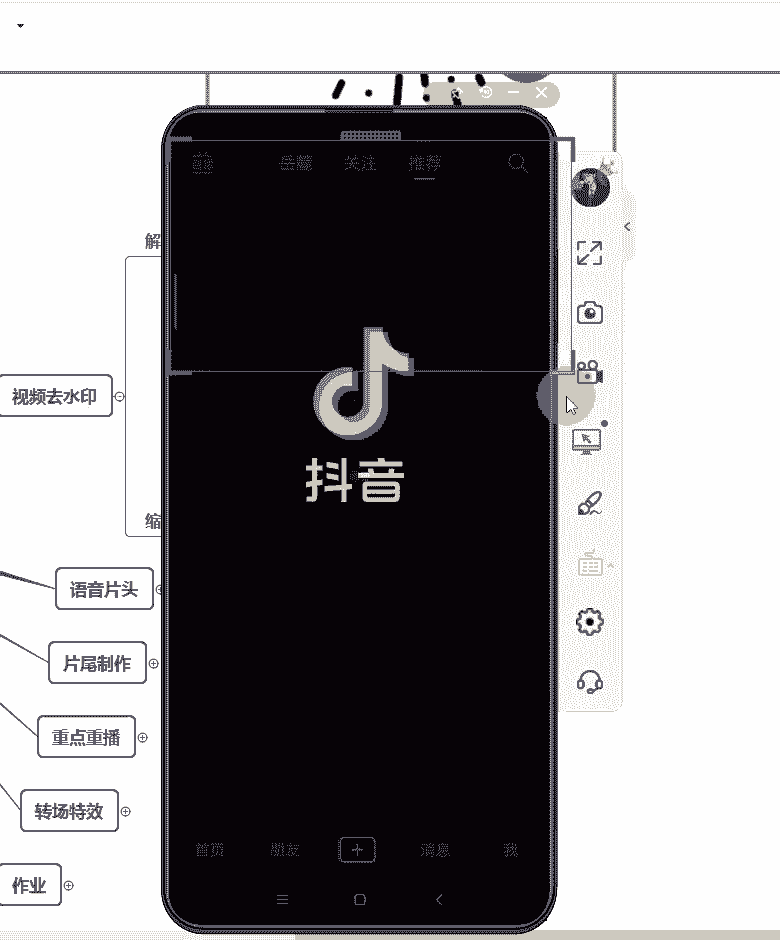

# 2024年做抖音怎么快速起号？3天养出一个高权重抖音账号，掌握这7点，抖音快速养号小技巧！【短剧推广】 - P13：9手机剪映功能实操上 - 我从山中来带着大宝剑 - BV1ZCtBeNE8r

好各位同学晚上好，现在能够听到老师的声音，并且能够看到画面的同学在评论区扣个一，声音和画面都正常的就扣一啊，声音和画面都正常就扣一，没有任何问题，就一样的跟之前啊一样的，截一张图啊。

截一张图发给你的指导老师，表示你已经进到课堂来听课了啊，截一张图发给你的指导老师，告诉你的指导老师，你已经进到课堂来听课了啊，这个截图可以课后再发，也没有关系，现在发也没有关系啊，好，都没有任何问题。

我们就开始来讲今天的一个课程内容啊，上一节课呢给大家介绍了一下，剪映的主要的一些功能，就是我们常用的一些功能，在上一节课呢都有介绍到了啊，也不知道大家就是课后啊，课后大家有没有去熟悉一下剪映的一个。

基本的操作，如果说之前对于剪映有一些基础的同学呢，可能就会觉得嗯还可以，就是这些功能操作呢多熟练几遍就好了，如果说是第一次接触剪音的话，可能就会觉得这些功能有一些复杂啊，那么咳。

今天这节课呢主要就是带着大家来讲一下，就是剪映的这些功能应该怎么去使用，因为上一次课主要讲的是它有哪些功能啊，现在我们从今天这节课开始啊，接下来几节课都会讲到，就是应该如何使用剪映这个软件去剪辑视频啊。

就是具体的去制作一些视频，这些功能应该怎么去实际操作啊，是的啊，这个软件一定要自己多去使用啊，多去使用几遍就熟练了啊，多去使用几遍就熟练了，第一次去使用，或者是说你一刚开始看到这个软件的时候。

你可能会觉得有点头晕，因为功能确实比较多啊，确实比较多，好咳，那么首先今天来讲的第一个内容，就是关于视频去水印啊，很多同学都遇到这个问题，因为我之前也有讲过，那么我们发到抖音上面的作品。

是坚决不能够带其他平台的水水印的，那么其实一样的，你要把作品发到西瓜视频，发到今日头条，或者是发到其他的自媒体平台上，也是不允许带有任何第三方平台的一个水印的，就比如说我想要把作品发布到西瓜视频上面去。

但是我的作品上带了腾讯视频的水印的话，显然西瓜视频是不会推荐你的这个作品的，就是一样的道理，所以说那我的这个视频有水印，我应该怎么办啊，那首先就是要把水印去除掉啊，把水印去除掉好。

去除水印的话有两种方法啊，有两种方法，一种就是解析法，所谓解析法就是说我直接把水印去除掉了，但是对这个画面是没有任何影响的啊，对画面没有任何影响，好，首先我们常用到的一个东西就是皮皮去水印啊。

皮皮去水印，皮皮去水印是一个小程序，在微信小程序里面啊，在微信小程序里面可以找到这个皮皮去水印，那么如果说大家不知道是去哪里找的话，也可以啊，截图保存一下这个啊，这个二维码就是你们可以识别这个二维码。

进入到这个小程序也是可以的，当然待会我也会实操告诉大家，去哪里找到这个皮皮去水印这个小程序啊，好这个是第一个，就是用皮皮去水印，把水印去除掉，那么这种去水印的方式是不会对视频的画面啊，有任何的影响的。

就是他不会把画面放大或者是缩小，或者是减少画面的一部分内容，不会啊，就是单纯的只是把水印去除掉了好，那么皮皮去水印它支持的平台是有限的啊，有限的，他们最喜它只支持啊，比如说抖音的视频或者是快手火山啊。

还有就是这个火山，就是这个抖音火山版啊，还有这个微视啊，哔哩哔哩好看视频，秒拍微博，梨视频等等啊，他大概就只支持这几个平台的短视频去水印啊，短视频去水印，很多人他说老师哔哩哔哩上的水印它去不掉啊。

如果说你想用哔哩哔哩上面的视频，结果这个视频的时长有一两个小时，那他肯定也不支持啊，皮皮去水印，它能够去除的水印是短视频上面的一个水印啊，短视频上面一个水印，很多长视频的话。

它其实是也没有办法去去除这个水印的好，接下来啊，接下来我会用我的手机投屏给大家实操一下，这个皮皮去水印应该怎么操作啊，稍等一会啊，投个屏，看一下这个就是老师的一个手机屏幕啊，老师的一个手机屏幕。

首先讲一下这个皮皮去水印是要怎么操作啊，首先想要去除水印的话，是需要找到你要去除的这个视频，他的一个链接啊。

就比如说我在抖音上面看到一个视频啊，我现在是点进抖音里面去啊。

在抖音里面呃。

等一下啊，好假设啊，假设我现在就要用这个视频素材啊。

我就要用这个视频素材，然后我去哪里找到这个视频的链接啊。

看清楚我接下来的每一个操作啊，给大家画圈视频链接去哪里找，点这个分享键啊，点这个分享键好，点了这个分享键之后呢。

嗯稍等一下这个投屏反应有一点点慢啊。

他反应比我的手机反应的要稍慢一点好，然后这个链接啊，就是大家可以看到下面的这个各种选项啊，下面的各种选项好，下面的往右往左滑啊，往左滑往左滑，就可以看到一个复制链接的选项啊，可以看到一个复制链接的选项。

这里就是最下面这一排，这里有一个复制链接的选项，好，点击这个复制链接。

点击复制链接好，你点复制链接的话。

这上面它会提示你啊，就是刚刚其实这上面一闪而过，就是有一个复制链接复制成功，就是提示你链接已经复制好了，然后链接复制好了之后呢。

你就点返回啊，退出抖音啊，退出抖音，然后再打开微信啊，打开微信，好微信这里啊，在微信这个页面，这个页面大家应该都很熟悉啊，这个页面就是微信我们平常聊天的这个页面啊，聊天的页面好在这个页面。

直接把这个页面往下拉，呃这个投屏总是比我的手上手机，操作会慢半拍啊，所以大家耐心一点点，稍等一下就投屏，等一下，呃我我重新投一下好了，我重新投一下，不然他一直卡在这了，重新投一下屏。

不然他一直就是慢半拍慢半拍，然后他就直接卡住了，就是我啊，不是啊，是我今天其实上课之前这个设备是正常的啊，我上课之前这个设备是正常的，我其实上课之前有检查过，但是有时候因为就是它用着用着。

这个温度变高了之后，就会反应有点慢，嗯稍等一下，稍等一下，重新投，就是因为天气本来就很热，然后这个设备它用一会它就会发烫，然后发烫之后呢，就会导致这个呃速度就变慢了，所以说嗯嗯就是谅解一下。

好刚刚是点到微信里面去啊，点到微信里面去这个皮皮去水印，这个小程序是在微信里面找的，就是这个微信聊天界面大家应该都很熟悉啊，大家都很熟悉。

然后呢就在这个界面啊，就在这个聊天界面直接往下拉啊，往下拉，你看我之前有用过这个皮皮去水印，这个小程序它就会直接在这儿，那么如果说你们之前没有用过的话，就可以在这上面搜索啊，点一下这个搜索框啊。

点一下这个搜索框，然后就输入皮皮去水印啊，皮皮去水印好，那么我之前有使用过，它就会显示使用过的小程序，皮皮去水印啊，如果说你之前没有使用过的话，那你就直接点下面的这个皮皮，去水印就可以了啊。

好点进去点进去我们就用这个蓝色的啊，就用这个蓝色的，就这个皮啊，一个蓝色背景背影的这个啊就点进去好，点进去之后呢啊这上面就是一些广告，不用管啊，大家直接看到下面这个界面啊。

这里有一个请输入是视频的页面网址啊，或者是分享内容，然后刚刚啊，刚刚老师是有在抖音里面复制了一个链接的，那我现在直接点这个粘贴就可以了，直接点粘贴好，它会显示一个等下这投屏总是慢半拍啊。

看一下他能不能反应过来哦，还是还是不行，这个投屏，音乐声太大了，没有音乐声啊，哪有什么音乐声，换个场地，我我倒是想换啊，但是这个网络跟场地没有任何关系啊，就是它因为用久了就会发烫，嗯应该没有音乐声啊。

我我记得我有把音乐关掉了，我重新我重新投屏试一下，我重新投屏试一下，不然的话他总是不知道怎么回事啊，我课前准备的时候呢，是没有任何问题的啊，结果每次一到上课他就出漏洞，就回到刚刚这个页面啊。

回到刚刚这个页面，就是直接点击这个粘贴啊，直接点击这个粘贴，然后它就可以把这个链接粘贴进去，然后把链接粘贴好了之后，再点击这个去水印啊，点击右边的这个去水印，点一下啊，下面再显示去水印中好。

它会提示你去水印成功。

然后提示你去水印成功之后，我们可以看到下面啊，可以先预览一下这个视频，确定是没有水印了之后，再点击这个下载视频啊，再点击这个下载视频，然后你就可以把这个视频，下载到你的手机相册里面了，是不带水印的啊。

不带水印的嗯，好，我我以后上课，我每次上课之前都会有测试这个设备的啊，所以说点点击啊，点击下载视频好，它提示你开始下载，然后这里有一个进度条啊，这里有个进度条，你要确定这个进度条已经全部走完。

才能够确保这个视频，已经下载到你的相册里面了，嗯好视频保存成功啊，这个时候呢，这个视频，其实就已经保存到我的相册里面去了啊，我们可以回到我的相册去看一下这个视频啊，可以看一下这个视频。

就是我刚刚下载的这个视频啊，刚下载这个视频，看就这个视频啊，可以直接把它打开来看一下。

就是这样子的啊。

然后我们可以看到就是这个啊，左上角或者是右下角都是没有水印的，大家可以看到这个，左上角和右下角是没有水印的啊，没有水印的，但是他的这个视频这个剪辑这个视频的本人，他自己在视频里面加了一个。

专属他自己的水印的话，这种水印皮皮去水印是去不掉的啊，皮皮去水印只能够去掉，就像抖音平台，快手平台的这种官方水印。

就自己制作视频的这个人加上去的水印是啊，去不掉的，好吧好，给大家看一下抖音的水印是长什么样子啊，我找一下啊，我记得我有一个视频直接下载下来的。

就是很多人说那抖音，我刷抖音的时候没有看到有水印啊。

给大家看什么是抖音的水印啊，这个这个就是抖音的水印，看到没有，他要么就出现在这个左上角，要么就出现在这个右下角啊，这个就是抖音的水印，如果说你局直接下载这个视频的话，你就会看到有这个水印啊。

就会看到有这个水印，所以说我们要通过去水印的方式进行下载啊。

我们要通过去水印的方式进行下载这个视频嗯。

好然后啊嗯因为刚刚操作呢，因为投屏的缘故，总是啊时不时的断一下，那么我现在就给大家，列一个就是文字版的步骤啊，列一个文字版的步骤给大家咳啊，皮皮去水印啊，好，第一步第一步就是复制要去水印的视频链接啊。

要去除水印的视频链接，去除，这是第一步啊，第二步就是打开微信搜索皮皮，去水印这个小程序啊，打开微信搜索皮皮去水印这个小程序啊，去水印小程序，好，然后，第三步，第三步就是点击粘贴啊，点击，哦不对。

应该是点进小程序里面去啊，点进小程序里面去，点进小程序，点击粘贴，点击粘贴之后再点击去水印啊，再点击去水印，去水印成功之后啊，去水印成功之后，点击下载视频，点击下载视频就可以了啊，好就可以了。

这个是皮皮去水印的一个文字步骤啊，大家可以截图啊，可以截图，就是这个是一个文字步骤啊，可以截图啊，皮皮去水是免费的啊，免费的，就是如果说有时候他跟你说啊，你今日去水印的这个次数已达上限。

它一般就是要求你看一个广告啊，没关系的，把那个广告看完就可以了，然后你就可以无限次的就去使用这个去水印啊，就是看个广告而已，没有什么关系的啊，嗯好这就是皮皮去水印啊，皮皮去水印的一个文字步骤。

大家可以截图保存一下啊，可以截图保存一下，因为有时候呃抄笔记的话可能没有那么快啊，好截好图了没有啊，截好图了没有，就是有需要截图的，截好了没有啊，是免费的啊，是免费的好，然后我现在啊我现在再来强调一下。

就是皮皮去水印，它能去除哪些平台的一个水印啊，希望大家记清楚啊，记清楚大概就是这些平台啊，大概就是这些平台，就只有这些平台的水印是能去除掉的啊，短视频，这些平台的短视频的水印是可以去除掉的。

那么像有些同学说，那老师我把那个视频链接复制到皮皮去，水印里面，怎么水印去不掉，然后我一问你复制的哪个平台的呢，他跟我说爱奇艺啊，像爱奇艺，腾讯视频，优酷视频这几个平台啊，包括芒果TV这些平台的水印。

通过皮皮去水印是去不掉的啊，去不掉的，强调一下啊，好支持这些平台啊，呃给大家这样这样子放吧，告诉大家啊，这样子放啊，上一期文字出现一下啊，西瓜视频短视频的可以去啊，短视频的可以去，长视频的话去不掉啊。

长视频去不掉，抖音的水印都是可以去掉的，就是如果说你你发现这个抖音的水印，去不掉的情况下，你最好在抖音上就先看一下，他这个视频是不是本身就带水印啊，就是你们平常在抖音上刷别人的视频的话。

一般是看不到他的抖音水印的，只有你直接下载了这个视频，才会看到这个抖音水印啊，但是如果说你在刷的情况下是看不到的，如果说你在在刷这个视频的时候，就已经看到了抖音的水印的话。

这个水印通过皮皮去水印也去不掉啊，这个就是关于皮皮去水印的啊，皮皮去水印，他对于视频的一个画质是没有任何影响的，但是有些同学说，那老师有些视频的水印，没有办法通过皮皮去水印去除怎么办。

那么我们就只能用第二个办法了，只能用第二个办法，一个就是缩放啊，或者是裁剪，其实都可以啊，这种去水印的方式我们称之为物理去水印，就是我们会对这个视频的图像有直接的影响，它会有痕迹啊。

会导致视频的画面受损，但是这是没有办法的，没办法了啊，没有办法的办法，好吧好，首先来讲一下这个裁剪啊，裁剪的话一般就是这个字幕或者是水印，它在视频的外面啊，或者是在下方上方或嗯左边左边右边啊。

就是在这个视频的一个周边，那我就可以用这个裁剪的方式去除啊，但是缩放的话，就一般，如果说这个字幕出现在这个视频里面的话，我可能就只能用缩放的方式去除了啊，只能用缩放的方式去除好呃。

还有人在问课程有回放吗啊，就是课程都是有回放的啊，都是有回放的，嗯好我现在来给大家就是演示一下，就是这个裁剪和这个缩放应该怎么去操作啊，裁剪和缩放应该怎么操作，我先找一个视频素材啊，找一个视频素材好。

嗯稍等下我投屏，嗯没有问题，好裁剪和缩放的话是需要在剪映里面进行的啊，裁剪和缩放都是在剪映里面进行的。

好现在点击剪映啊，点击剪映，然后导入，你需要嗯点击开始创作，导入你需要对它去水印，就是需要对这个视频裁剪掉，他的这个水印的这个视频，把它导入到剪映里面啊，点击开始创作。

嗯我找一下那个视频啊。

好我现在把这个视频导入到剪映里面了啊，导入到剪映里面了哈，大家看到没有，这个视频的上方有这个抖音的水印啊，有这个抖音的水印，而且这是最开始，那么到后面的话，他这个下方也会出现这个水印啊。

也会出现这个水印，好这个时候我要把这个水印去除掉，好上面啊，这上面这个画面大家可以先不用看，直接看下面怎么去找到裁剪这个功能啊，裁剪这个功能在哪里，不知道有没有同学去熟悉过的，上几节课。

老师其实有讲过啊，有讲过裁剪这个功能，首先点击剪辑啊，点击左下角的剪辑，点击剪辑之后呢，再在二级工具栏里面找到一个编辑的选项，编辑画个圈啊，画个圈好，点击这个编辑啊，点击这个编辑之后。

里面就有一个裁剪的功能，再点击这个裁剪啊。

点击这个裁剪好，现在就进入到裁剪的一个页面了，好这个页面看到上面是这个样子的啊，因为待会操作就是操作上面这一部分好，这个九宫格的框框是可以去拖动它的，一个大小的，我们平常拖动的话啊。

就是去拖动这个四个角啊，拖动四个角，然后我要把这个水印去除掉，我就去拖啊，把这个角往回缩啊，往回缩，然后现在那个水印就在视频的外面去了，然后这下面啊，待会这下面肯定也会出现那个水印的哈，我下面也一样的。

把它往上拖啊，往上拖就是这个裁剪的功能，就是说我需要留下的画面，就要让它留在这个九宫格的框里面啊，就要留掉留在这个九宫格的框里面好，我把它水印全部都放在框的外面去之后呢，就是已经框好了之后。

再点击右下角的这个对勾，点击这个对勾好。

然后再回到看这个视频啊，看这个视频，我们就看不到右上角的这个水印了啊，看不到了，包括待会右下角的这个呃，左上角的水印和右下角的水印，都已经被裁剪的没有了，就是都看不到这个水印了。

那么这个水印就去除成功了，但是实际上因为这个视频的话，它是这样子的啊，这个视频因为他的这个水印的那个位置，本身就是一个黑色的，所以感觉不到这对于视频的画面有太多的影响，但是我们知道像腾讯视频。

它的水印是出现在这个画面里面的啊，可能一般是出现在这个画面的这个位置啊，画面的这个位置，那么如果说你想把腾讯视频的这个水印裁剪掉，你要么就可能需要把这上半部分都裁剪掉啊，或者是把右边这半部分都裁剪掉。

那么很显然这样子的话，其实是会对画自产生影响的，产生影响的，但是这也是没有办法的办法，刚刚老师说的就是裁剪啊，通过裁剪的方式去去除这个视频的一个水印，那么还有缩放，缩放又是怎么回事啊。

缩放的话就是告诉大家，你点击一下这个视频轨道啊，点击一下这个视频轨道，然后呢，这个视频画面的周边就会出现一个红色的框框，大家看到没有，这个视频的画面周边啊，它就会出现一个红框啊，出现一个红框的话。

大家可以看到就是我出现这个红框的时候，意味着可以对视频的大小，就是画面的大小进行缩放，就像你放大或者缩小图片一样的啊，比如说我现在把它放大，看到没有好，我这样子放大一下之后，大家发现创作灵感那几个字。

就没有出现在视频里面了，这个刚刚这个就是属于放大啊，还有一个就是缩小啊，我把它缩回来啊，缩回来，这样缩小都是可以的，这个缩放啊，缩小和放大啊，缩放是包括两个动作的，一个是缩小一个放大，那么这个动作的话。

它其实就像你平常放大或者是缩小图片一样，去操作的，就是刚刚你们看到这个视频的画面放大缩小，就是像你平常去放大或者缩小图片，那么去操作的一样的操作，好吧嗯好这个就是啊第二种去水印的方式啊。

第二种去水印的方式就是裁剪或者是缩放，这个是没有办法的办法啊，没有办法的办法，因为你实在是这个水印，也没有办法通过化学解析的方式去除的话，那就只能通过这种方式去除了啊，只能通过这种方式去除好。

这个就是关于视频去水印啊，关于视频去水印可以剪掉哦，只是给大家举个例子啊，给大家举个例子好，那么视频去水印啊，两种方式啊，就是我们平常常用的两种方式，就是这两种方式了，影响画面那个是不可避免的啊。

如果说你非要用这个素材的话，那确实是不可避免啊，pr可以去水印波啊，pr去水印的话比较复杂啊，其实它pr去水印，它有点类似于像打马赛克一样的啊，接下来啊，接下来就是啊，刚刚讲的这个视频去水印。

大家都理解了没有，刚刚讲的这个视频去水印，大家都理解了没有，啊，好理解了之后我们再来讲下一个内容啊，理解我们就来讲下一个内容啊，下一个内容主要是讲的语音片头，那么什么是语音片头啊。

我先给大家看一个视频啊，这个这个视频的语音片头很短，但大家可能第一次听到语音片头都不知道嗯，什么是语音片头啊，好这个视频非常短啊，就是前面那个语音片头的部分很短啊，我可能需要重新给大家。

就是大年30，等一下等一下啊，等一下我先把画面给大家框出来啊。

把声音放出来的早晨好一秒。

大年30的早晨，就是前面那个大年30的早晨，大家有听到那个声音没有，大年30的早晨好，那个大年30的早晨啊，那一句就是一个语音片头啊。

那一句就是一个语音片头，就是大家可以看到啊，大年30看就是这个画面它是黑的啊，它是黑的，然后就上面有几个字，大年30的早晨一啊，那么这就是一个简简单的语音片头啊，简单的语音片头。

因为我担心我直接跟大家讲，什么是语音片头，大家可能人都是啊，什么是语音片头啊，老师为什么要教我这个啊，那么这个就是一个语音片头啊，这就是一个语音片头好，那么接下来就是告诉大家啊。

应该怎么去做这样子的一个语音片头啊。

应该怎么做好，先给大家看一下这个文字步骤啊，好来晚了的同学啊，也不用道歉，认真听就可以了啊，认真听就可以了，好先看一下文字步骤啊，先看一下文字步骤，首先啊，语音片头它会用到一个这个黑底的一个素材。

这个素材去哪里找啊，很多同学下课了之后，他说啊，我嗯乐多老师上课说要呃，什么语音片头的素材好，我告诉你们这个语音片头的素材，不用去问你们的指导老师要啊，不用去问你们的指导老师。

要就是只要你的手机上下载了剪映，那么你们的手机上就会有啊，这个是在点击开始创作，然后找到这个素材库啊，在黑白场里面的，第二二个就是我们待会要用到的一个素材啊，我会带老大家找到这个素材在哪个位置的啊。

好这是啊找素材啊，操作步骤啊，先给大家看一下这个文字的操作步骤啊，文字的操作步骤，首先第一步，就你要需要先把这个素材下载下来啊，然后调整一个九比16的比例，因为如果说你的这个语音片头是要加在抖音的。

这个视频的前面的话，那你就需要去调整这个九比16的比例啊，好然后再输入语音片头的文案，最后用文本朗读，把这个文案朗读出来就可以了，好这就是一个完整的啊，一个过程，大家可以截图保存一下啊。

可以截图保存一下，然后呢截好图了之后，我就带大家实操啊，实操，不要现在不要问啊，怎么调怎么去操作啊，我待会会实操给大家看啊，会实操给大家看好，先截好图，没有截好图了，没有截好图就扣个一啊。

截好图就扣个一。

好接下来投屏啊，投屏希望这个投屏争点气啊，投屏争一点气啊。

可以了是吧。

好都截好了之后啊，我们就啊投屏啊，看看老师的这个手机屏啊，所热屏好一样的啊，剪映里面啊，剪映里面点击开始创作。

好点击开始创作，现在我要找的不是我的相册里面的，是要点击这个素材库啊，点击素材库，点击这个素材库啊。

好点击这个素材库之后，然后再找到这个黑白场，黑白场啊，点它好，黑白场我们要下载的是这个第二个啊，第二个如果说你想用白底黑字的话，可以用第一个啊，白底黑字可以用第一个，黑底白字就用第二个。

一般都是用这个第二个啊，一般都是用第二个，然后先下载啊，先这个箭头向下的箭头就是下载的意思哈，已经下载好了之后呢，它这个右上角会出现一个小圆圈，然后点一下这个小圆圈，就是选中的意思，选中的意思的话。

然后看到这个啊，把我的整整个手机屏先放给大家看一下啊，现在就是这个样子啊，现在就是这个样子，然后这个时候我就要点下面的这个选项啊，如果说有这个高清画质的选项，那就把它给点上啊，有就点。

如果说有的手机可能没有，那就没有必要点啊。

点上之后就点右右下角的这个添加啊，右下角这个添加，然后啊大家就可以看到黑乎乎的一团，就导入剪映里面了，好第一步啊，把这个素材导进去，第一步先去调比例，先去调比例啊，比例在哪里调，刚刚有同学问的好。

现在下面是一级工具栏啊，一级工具栏，然后我往左滑往左滑，找到比例这个选项啊。

找到比例这个选项啊。

找比例这个选项啊，点击比例这个选项之后呢。

再点击选择九比16的一个比例啊。

九比16的一个比例好点啊，点一下，其实点完这个比例之后，上面的这个图像它是有变化的啊，刚刚是横着的，黑乎乎的一团，现在它变成竖的了，它变成竖的了，这就是比例调整好了，比例调整好了，九比16的一个比例啊。

九比16的一个比例好，调整好比例之后呢，然后点击返回啊，就是刚刚这个点。

点这个啊。

点这个，然后返回返回之后呢，我要输入文案，就是这个语音片头，你想让他语音的部分是什么，就比如说我刚刚给大家看到的这个视频，他说的是大年30的早晨，这个就是他语音片头的文案部分。

然后这个时候我就需要先输入，我语音片头的一个文案部分啊，好其他同学告诉我有没有声音，因为我看到有两位同学在说听不到声音了，啊有声音是吧，好，啊没有问题就继续讲了啊，没有问题就继续讲了啊。

好那么输入这个文案从哪里输入啊。

这个语音片头的这个文案，是要点击这个文文字去输入的啊，点击这个文字去输入的啊。

点这个文字啊，点了文字之后呢。

再点击这个新建文本。

啊点击这个新建文本好，点击了新建文本之后呢，它就会让你开始输输入文字啊，输入文字好，我想一下输一个什么文字啊，好输入一个，好嗯我的一个语音文案啊，我的一个语音片头的文案就是这个啊，各位同学大家晚上好好。

我把文案输好之后啊，把文案梳好之后，文字啊文字转语音应该怎么操作，好看清楚我接下来的每一步操作啊，我输好了之后呢。

我点一下这个对勾啊，点一下这个对勾好，点一下这个对勾之后呢。

它就变成这个样子了，上面是这个样子，就是这个视频部分是这个样子，好下面啊我主要是看下面的一个操作，这里有一条文字轨道。

然后下面有一个文本朗读，看到没有文本朗读啊，点文本朗读咳。

好文本朗读里面有好几个声音啊，有说唱小哥，台湾女声，海绵宝宝小萝莉，东北老铁小姐姐，重庆小伙啊等等几个声音啊，好几个声音好，我就用一个小姐姐的声音啊，好我重新用一个别的声音，再用这个小姐姐好好。

然后我再试一下这个小姐姐的声音啊，各位同学大家晚上好好，我选择这个声音之后呢。

我再点击右下角的这个对勾啊，点击这个对勾好，他就会告诉我音频已经生成啊，请到音频模块去生去看就可以了，好那么这样子一个简单的语音片头就做好了啊，一个简单的语音片头就做好了，我们可以播放听一下啊。

同学大家晚上好啊，就是这样子的啊，好就是你们真正这个视频做好了之后，你们其实是看不到的，这上面这这两根白线的啊，这这个文本框框的这两根白线，这才是真正做好的样子啊，真正做好的样子就是这样子。

大家晚上好啊，就是这样子的啊，就是这个样子的一个简单的语音片头。

就是这个样子啊，简单的语音片头。

就是通过这样子的一个步骤就做好了，就很简单啊，真的是非常非常简单哈，大家可以再来回顾一下这个文字步骤啊，可以回顾一下这个文文字步骤啊，嗯好关于这个语音片头啊，语音片头大家都会了没有理解了没有啊。

先问一下理解了没有，因为大家都还没有去实操过啊，理解了没有理解的就扣个一啊，啊这是比较简单的啊，比较简单的好啊，这个都理解的话，我们再来讲下一个内容啊，再来讲下一个内容。

下一个内容的话就是一个片尾的制作啊，一个片尾的制作，片尾的制作的话步骤稍微会有一点点复杂啊，稍微会有一点点复杂，必须提前预告一下啊，好讲一下啊，这个步骤放出来呢可能都会有点吓到大家啊。

这步骤内容有点多啊，这个片尾的一个制作，整个步骤啊，完全就所有做一个片尾的整个步骤是这么多啊，我先来文字描述一下，首先啊我们的片尾制作一个片尾啊，制作一个片尾的话，会需要用到两个圈圈的一个片尾素材。

那么这个素材可以，大家下课之后去问你的指导老师要啊，这个素材今天下课之后可以问指导老师要好，还有会用到一张图片，那么这一张图片就需要你自己去准备了啊，需要你自己准备，可以用你的抖音头像。

或者是说你现在啊，你说啊老师我的领域还没有确定好，我的头像也还没有确定下来，那么你今天做这个片尾的话，你可以先找一张其他图片也可以啊，只要是一张图片就可以了啊，是一张图片就可以了。

好然后啊接下来的就是操作步骤啊，操作步骤第一步肯定是先导入素材啊，先导入素材，然后呢剪辑留下白色的圈圈啊，剪辑是怎么留下这个白色的圈圈呢，剪辑啊，剪辑里面有一个功能编辑，然后裁剪啊。

裁剪留下这个白色的圈啊，然后呢再返回找到点，找到画中画啊，新增画中画加图片，然后再用混合模式选择变暗，再调整好图片的一个大小，返回好，我现在啊，我现在是把这个文字步骤给大家陈述一遍好。

我建议大家截个图好吗，大家截个图啊，这是我现描述一遍之后，大家可能是云里雾里的，很正常，但是我待会就是会给大家实操啊，会给大家实操，就是所有的步骤给大家实操下来啊，做这个片尾我们会用到两次画中画啊。

然后这个素材呢我们也会导入两次啊，会导入两次，看第二次新增画中画的时候，我们又会导入到这个圈圈的素材，然后再留下一个黑色的圈啊，然后再使用啊，这个再用混合模式调绿色，然后再调整两个圈的位置就OK了啊。

就OK了，好上一集标题是吧好，我把那个片尾制作几个字也给大家放出来啊，我担心这个框框框的内容太多了呢，你们就会觉得字有点小啊，截好图就扣个一啊，截好图就扣个一。

好我先给大家看一下，就是我们用到的一个素材长什么样子啊，就是待会会用到这个素材长什么样子，啊现在这个还是保存在我的相册里面的啊，这是一个视频啊，就是这样子的啊。

这个片尾的这个素材就是这个样子的，这是一个两秒钟的一个视频啊，两秒钟的一个视频好。

第一步啊，第一步一样的啊。

第一步一样的打开剪映啊，打开剪映，点击开始创作，然后去找到这个片尾素材啊，我的这个片尾素材在这里啊，然后把它添加啊，一样的选择这个高清画质，再选择右下角的添加好。

先把这个素材添加到你的这个剪映里面来啊，添加进来了之后，第一步第一步啊，裁剪留下这个圈圈啊。

裁剪留下这个白色的圈啊，是的啊，留下这个白色的圈好。

怎么去裁剪，再重温一下刚刚说的裁剪功能啊，点击剪辑，剪辑里面找到编辑啊编辑，然后再点击裁剪好。

这个时候呢，又回到这个九宫格的画面，我要留下的是白色的圈，第一次裁剪要留下的是白色的圈啊，一样的，像刚刚老师说的啊，我去移动这个九宫格的时候，就是移动四个角就可以了啊，移动四个角就可以了。

好我现在先裁剪，有一点汗手啊，就移动的有点慢，卡起了是有一点卡住了啊，卡住了好，嗯好就像现在这样子就可以了啊，如果说你再呃要求严格一些的话，你还可以把它再裁小一些啊，再裁小一些。

就是说嗯这个九宫格的这个线，可能可以更加贴近这个白色的圆一些啊，但是要保证下面的这个加号一定是完整的啊，大概裁剪成到这个位置就可以了，反正上面不存在有黑色圈的位置啊，好这个地方把它裁剪了之后呢。

就点击右下角的这个对勾啊，点击右下角的这个对勾啊，再强调一件事情啊，再强调一件事情，就是老师刚刚在裁剪这个白色圈的时候，我只是啊这个这个移动这个角的时候，我只是把它上下去拖动的这个角啊。

我没有左右去放大，其实我刚刚有往往右移动了一下，但是我又马上拉回去了啊，所以说大家在裁剪这个圈的时候，千万不要去把这个放大了啊，把这个圈放大的话，后面会很麻烦，就很有可能导致两个圈对不准啊。

点击右下角的对勾啊，这样子的话我们就会发现诶，他裁剪好了啊，裁剪好了就只剩下这个白色的圈啊，只剩下白色的圈之后呢。

点击返回啊，这个这个就是返回的键啊，这个就是返回的键，返回一次，它还剩下一个，然后我还要再返回一次啊，再返回一次，返回到一级工具栏里面，找到画中画的选项，画中画啊，画中画点一下。

点击画中画里面进去是一个新增画中画。

然后我再点新增画中画，这个时候他又会跳转到我的相册页面。

好，我这个时候需要导入的是一张照片啊，我要导一张照片进去啊。

找一个漂亮小姐姐的照片啊，好就用这个啊，就用这张照片啊，就用这张照片，然后点击右下角的添加啊，好这张照片一放进去的时候，它会把我刚刚的这个圈完全挡住啊，好课程都是有回回放的啊，课程都是有回放的哈。

完全挡住好，这个时候大家也先不用管啊，先不用管，然后直接找到下面这里有一个混合模式啊，这下面有一个混合模式，给大家圈一下混合模式好，找到这个混合模式点进去啊，点进去之后里面有变暗绿色这些选项好。

第一步先点变暗啊，先点变暗好，点击变暗之后啊，点击变暗之后再点击这个对勾啊，点击这个对勾。

好点击对勾之后再给大家看一下，上面的一个变化，大家就会发现诶，只有这个圆圈框住的位置，有我加进去的这个图像，然后外面还有一个红色的框框，还有一个红色的框框啊，那么这个有这个红色的框框。

就意味着我可以对这张图片进行放大缩小啊，我给它稍微缩小一点，甚至还可以直接移动它的一个位置啊，我感觉他在侧侧边有一点强迫症啊，感觉要把它放在中间好，大概就是这个位置好，这个是就可以了啊。

调整成这个样子就可以了，然后接下来啊，接下来就是下面的一个操作，又要点击返回啊，点击返回，然后再一次点击新增画中画啊。

点击新增画中画的时候呢，我需要去把这个片尾的素材再一次导进去啊。

再一次导进去，好选择啊，刚刚已经已经导入过一次，没有关系。

可以导两次啊，可以导两次，然后再点击这个添加啊，再次点击这个添加好，我跟大家讲一下，你第二次再导入同一个素材的时候，你就会发现诶他这里看到有一个红色框框没有，大家看到里面有个小红框了没有。

这个时候我建议大家稍微把它放大一下啊，放大至多大呢，和这个黑边对齐啊，和这个黑边对齐，这样子是有利于你待会儿去对齐这两个圈的啊，嗯我在讲这个片尾之前，我就说了啊，这个圈两个圈的。

这个素材是要问指导老师要的啊，我已经看到不只是一个同学在刷，说素材库里没有这个素材，我都说了，这个素材是要问指导老师要的啊，好我现在先适当的放大一下啊，放大一下也不要放的太大了啊，适当的放一下。

就是跟第一次导进来的一个大小，差不多就可以了，差不多就可以了，然后这个时候放大了之后呢，我再去裁剪啊，我再去裁剪好，我找到编辑，在直接在这个下面找到这个编辑啊，然后我现在要留下的是啊，编辑里面找到裁剪。

然后这个裁剪我大刚刚留下的是白圈，我现在留下的是黑圈啊，留下的是黑圈，然后我去裁剪这个黑圈就可以了，留下这个黑色的圈啊，裁剪好之后一样的点击右下角的这个对勾啊。

点击这个对勾，然后这个时候啊这个时候先不要管上面啊，先因为现在上面看到的就只有这个啊，就只有这个，然后呢再点击这个返回啊，返回之后呢，滑到前面啊，滑到前面就是往右滑啊，往右滑。

这里就有一个继续找到这个混合模式啊。

继续找到这个混合模式，然后选一个绿色啊，选一个绿色，嗯好选完绿色之后，点完对勾就会回到这个页面啊。

回到这个页面，然后呢嗯这个片尾基本上视频的一个画面啊，画面就做好了啊，我这个其实做的不算太完美啊，不算太完美，他这个边上还是有一点点的对比的，不是很整齐啊，先放给大家看一下好，那么一个片尾。

除了有这个圆圈的这个画面之外啊，还可以加一些其他的东西，比如说像谢谢关注之类的啊，或者是说啊觉得好看就关注一下呗，这样子啊。

那么可以直接添加文字啊，点击文字点击文字啊，然后再点击新建文本。

点击新建文本，然后我可以在这个视频下方啊，视频下方就是加一个，谢谢大家关注的一个字眼啊，加，嘻嘻，谢谢嗯，谢谢大家关注啊，好打个感叹号啊，就是可以加这样子的一句文案，或者是说啊呃，谢谢你那么好看。

还来关注我这样子的文案，或者是说嗯听说长得好看的人都关注了我呢，都可以啊，都可以，然后这个字一样的可以换颜色啊，一样的可以换颜色，然后也可以按照刚刚说做语音片头的一样方式。

就是给这个谢谢大家关注这一段文字，配上一个啊声音啊，配上一个声音一样的，就是我把这个文案加进去之后呢，点这个文本朗读啊，点这个文本朗读。

啊点一下，谢谢大家关注好，我觉得就这样子可以的啊。

就用谢谢大家关注啊，然后这样子的话一个简单的片尾就做好了啊，一个简单的片尾就关注啊，就是这样子的，就是这样子一个比较简单的一个片尾啊，就是我的这个文案是比较简单的，文案是比较简单的好。

那么其实啊我刚刚做的这个片尾呢，其实那两个圈圈对的不是特别的整齐齐啊。

就是给大家看一个，我之前啊就是今天上课之前做好的一个。

就是那两个圈会对的更加整齐一点的，就是像这个像这个片尾的话，其实它的两个圈就完全对整齐了，很多同学在做这个片尾的时候，这两个圈总是说对不整齐啊，但是我告诉大家，真的是可以对得很整齐的。

因为刚刚可能是因为卡住了，我一下操作是有一丢丢的小失误，可能就会看着两个圈啊，有那么一丢丢啊，对不整齐，但是这个会更好一些啊，这就是一个简单的片尾啊。

就是步骤啊，步骤会稍微有一点复杂啊，就是文字步骤啊，再一次捋出来给大家看一下啊，捋出来给大家看一下呃，一般啊，就是如果说之前啊对于剪映有一定的基础的话，就会觉得这个片尾其实也不算很复杂。

因为它用到的功能并不多啊，就是一个裁剪功能，一个画中画功能啊，就基本上就是用的这两个功能啊，嗯就用了这两个功能就可以的，就用了这两个功能就可以，这其实不是很很复杂。

如果说啊如果说觉得嗯比较复杂的同学的话，就课后可能需要再多去嗯，多去练习使用这个剪映啊，多去练习使用这个剪映好吧，而且啊而且就是很多同学，如果说啊，老师为什么老师上课做出来是这个样子。

我做做出来怎么是这个样子的话，如果说你自己在实操的过程中，出现了一些问题的情况下，可以直接就是截图或者是嗯录屏，去问你的指导老师的啊，多去问你指导老师的好，这个片尾制作啊，这个片尾制作呃，我我知道啊。

不过我这个时候问大家，大家理解了没有，可能一大片的都说不理解啊，因为这个步骤确实是有点多，好吧好还是问一下啊，大家都理解了没有啊，理解是吧，有点好嗯，课程上啊，正式课程上我还是先只讲一遍啊。

因为我们后面还有内容需要讲，那么当当然，如果说因为我知道可能会有比较多的同学呢，觉得这个比较复杂，没有关系，待会啊，待会就是嗯大家觉得还是觉得很难的话，我解答课再跟大家讲一遍啊。

解答课可以再跟大家讲一遍，好吧好，那么这个片尾制作啊，片尾制作，不管你现在是觉得有点懵呢，还是已经理解好了，大家都可以就是截图保存一下啊，可以截图保存一下吧，截图保存一下啊，啊接下来啊，接下来啊可以等。

等会下课之后就可以去问指导老师，要素材实操一下啊，可以问问问指导老师要素材实操一下啊，然后接下来要讲的一个就是重点重播啊，重点重播，重点重播呢先跟大家解释一下什么叫重点重播，首先这是两个词。

第一个就是重点，第二个就是重播，意思就是说重点片段重复播放一次的意思啊，就是很多同学可能就是我之前有遇到过，就听了课之后都不知道什么叫重点重播啊，重点重播的意思，就是说重点部分重新播放一次的意思，好。

这样子先先问大家理解什么叫重点重播了没有，重点重播的意思，大家理解了没有，还是没有理解吗，就是重点部分啊重复播放一次，就这个意思啊，就这个意思，重点部分重放一次，就是这个视频的重点部分重放一次啊。

就很多综艺他其实都会用到这种效果啊，很多综艺他都会用到这种效果，为什么要重放，既然是重点，那我就要重新放给你看一遍啊，就是很多的综艺节目里面其实都有这种效果，就是大家平常啊不一定说刷抖音。

就你平常看一个综艺节目，其实这种事情都会常有啊，都会常有，好吧嗯，那么这个重点重播应该要怎么操作啊，首先第一步先要准备好你的素材啊，需要先准备好你的素材，就是你要找好啊。

比如说我的这个视频里面有一个精彩的片段，我想要给他重点重播操作一下啊，重点重播操作一下，那么我找到这个素材之后，要先看清楚是哪一个片段需要进行重播啊，哪一个片段需要进行重播，然后要选择好。

选好这个片段之后呢，再把这个精彩的片段给它分割出来啊，分割出来我一样的，先讲文字步骤啊，再实操，先讲文字步骤再实操啊，好分割出来之后，再把这个好看的，这个就是精彩的片段给他复制一次啊。

所谓重播他就要重来一遍，那我怎么让它重来，就是复制啊，复制好，复制之后呢，我可以下面后面会讲到的这两步啊，加滤镜以及变速，这两步呢，都是针对我复制的这个片段去操作的啊，针对我复制的片段去操作的。

那么加这个滤镜啊，我这里说加一个黑白滤镜，这个黑白滤镜是在风格化牛皮纸里面找到的好，这个加滤镜不一定用黑白啊，不一定用黑白，你想加其他滤镜也一样啊，然后呢还可以对它进行一个变速的操作啊。

可以对它进行变速的一个操作，好一样的，大家可以先截图保存啊，大家可以先截图保存嗯，给大家嗯只能放到这么大了啊，只能放这么大了好吧，大家可以先截图保存一下啊，截图保存一下，都截好图了没有，截好图了之后呢。

我就呃投屏啊，投屏给大实操。

好一样的啊。

一样的剪映里面啊，点击开始创作，然后去找一个视频啊。

找一个视频就是需要重点重播的一个视频啊。

我看一下哪个视频比较合适一些啊。

我先看一下这个视频行不行。

你这个视频节奏太慢了不行，换一个换一个，不用这个，用这个好了，用这个视频好嗯。

先找到视频啊，视频好，找到你的这个视频之后呢，先要确定你是哪一个部分，需要对它进行重点重播啊，先要找到哪个部分，需要你对它进行一个重点重播好，我这个视频呢，我看我是哪个地方需要重点重播啊。

我先找到一个需要重点重播的地方啊，好我就挑一个片段啊，大概就是这个片段好，我大概是哪个片段需要重点重播，我先给大家画一个圈啊，我就是这一个片段啊，这一个片段需要对它进行重点重播啊，需要对它进行重点重播。

好那我要怎么操作啊，需要怎么操作嗯，回放什么时候出来，我人都还在这里上课，怎么会有回放呢，现在都还在直播啊，怎么会有回放，肯定是等我直播结束之后才会有回放的呀，咳好，我想要对这一段啊。

就是我刚刚画圈的这一段，对它进行一个重点重播，第一步啊，第一步先点击剪辑啊，点击剪辑好，点击剪辑之后呢，再点击分割，因为我需要把这一段都给它分割出来啊，给它分割出来，然后先是用这个视频轨道。

对准这个白色指针的这个位置，我切第一刀就是切的这个位置啊，切的这个位置好，点击分割啊，点击了分割之后啊，点击分割之后，大家就可以看到，这中间出现了一个白色的小方块，好这个时候不用管它。

然后呢我后面还要再切一刀，因为我是一个片段，需要对它进行重点重播啊，好这个片段好，然后我再在这里啊，再在这里还要切一刀，因为是要把这个片段给他切出来，然后点击点击剪辑，再点击分割啊。

再对它进行切第二刀好，然后这个片段就已经分割出来了，是我刚刚说的，我想要重点重播的一个片段，就已经给它分割出来了啊，分割出来了，分割出来之后呢，你用你的手指啊，就是自己在操作的时候。

你用你的手指轻轻的去点一下，你分割出来的这个片段，我就是用手指轻轻点了一下，分割出来的各个片段好，这会儿大家看出来一个区别没有，这是我点了之后啊，这是我点了之后，这是我没点之前，大家看出来区别了没有。

就这个和这个看到了是吧，就是我点了之后呢，这个视频的周边出现了一个白色的框框，对不对，出现了一个白色的框框啊，那么出现这个白色的框框，就意味着我是选中了这段视频，我接下来的一个操作。

都是针对这一段视频的一个操作啊，我首先要做的就是复制啊，我要把这个片段复制一下，因为我是要对它进行重播，那么我在下面找到复制啊，好现在大家可以看到这个工具栏这一栏诶，没有看到复制没关系，往左滑往左滑啊。

不停的滑，直到滑到不能滑的位置啊，好终于在滑到镜头之前看到了，有一个复制的选项，好点击这个复制，点击这个复制啊，点击这个复制之后呢，它后面默认这上面又会选中一段视频啊。

选中的这段视频就是你复制的这段视频，好我嗯我把这个缩小一点点给大家看到，大家看到没有，现在这个上面，它就出现了两段一模一样的视频啊，出现了两段一模一样的视频，那么前面这半段呢是我最开始这个视频本身的。

后面这半段就是我刚刚点了复制之后，复制的一份啊，复制的一份好，这个时候接下来的所有的操作，都是针对后面这一部分进行操作啊，后面这部分进行操作，那我要对它进行一个操作，我就先要选中它。

选中它就是点一下它啊，点一下它就可以了，点一下它的话，首先啊我对它调一个滤镜啊，先找到在这个下面找到滤镜啊，找到滤镜好，在这个位置滤镜啊，滤镜的话我要对它调一个黑白色的啊。

黑白色的话是在这个上面的这个风格画里面啊，风格画里面找到这个牛皮纸这个滤镜啊，牛皮纸这个滤镜好，然后把这个滤镜调整好了之后，点击右下角的这个对勾，点击之后呢看下面的视频轨道，看不出区别啊。

我给大家看上面的画面，给大家看上面的画面啊，上面画面变成这个颜色了，它本来是这个颜色的啊，它本来是这个颜色的，但是我给它调了滤镜之后，就变成这个颜色了，就这个颜色差别应该还是比较清楚的，比较清晰的。

这就是调整的一个滤镜，那么我除了可以对冲重点重播的部分，调滤镜之外，还可以对它调变速啊，调变速就是点点下面的这个变速好，我给它调慢速啊，放慢一些，放慢成0。75啊，0。6也行啊，0。6就放到0。6吧。

好就给它进行了一个慢放啊，慢放放了之后呢，我可以再点击右下角的这个对勾啊，再点击右下角的这个对勾好，这个时候我给大家看一下，整个视频的一个变化啊，整个视频的一个变化，就是从最开始也不是从最开始。

就是从我开始分割的那个片段啊，给大家看一下，这是正常的啊，这是正常的，然后这就是我重点重播的部分啊，这就是我重点重播的部分，这个区别还是很明显的吧，应该都能看出来吧，这个区别，这个区别还是很明显的。

就是首先我调整了滤镜啊，调整了一个滤镜的话是颜色发生了变化，然后我调整了变速啊，我把它放慢了啊，因为他这个动作慢放了之后还很有趣啊，大家有没有发现这个狗狗他的动作放慢了之后，他的这个走位还是很搞笑的啊。

还是很搞笑的，你看这个爪子走的是不是很妖娆的感觉啊，所以说这就是重点重播啊，这就是重点重播，当然老师上课只是举一个例子啊，不是说你的每一个视频都需要用到这种啊，往往这种重点重播会放在什么地方。

就是一些比较搞笑的片段啊，一些搞笑的片段里面，就会经常用到这种重点重播的手法啊，嗯一般啊就是搞笑的片段，会用重点重播这种方式啊，用重点重播这种方式好吧，这就是重点重播的一个啊，怎么去做啊，怎么去做。

就是有时候其实你们刷视频，尤其是刷搞笑视频，应该看到重点重播是最多的啊，刷搞笑视频看重点重播应该是最多的好，这就是一个重点重播啊，大家都能理解吗，理解的话就扣一啊，理解就扣一啊。

这个重点重播你看你平常都能刷到啊，这个就是他就这么做出来的啊，嗯大家都理解的话，我们再来讲啊，今天最后一个需要讲的一个板块啊，最后要讲的一个板块就是这个转场特效啊，转场特效首先来跟大家讲一下转场特效。

它就是一个特效啊，转场特效它就是一个特效，那么先讲一下啊，哦说话变声啊，刚刚忘记强调这个就是我刚刚调了变速之后啊，跟大家讲一下。

就是因为我这个呢没有说话的一个声音啊，就是你调整了变速之后呢，它其实最下面啊，最下面有一个声音变调啊，有一个声音变调，那么如果说这个视频本身是有啊，比如说有说话的声音或者是笑声，或者是其他声音的话。

一样的，就是把这个选上就可以了啊，把这个选上啊，把声音变调给他选上就可以了，好吧好咳啊，刚刚就是因为我这个视频没有讲话的声音，所以就啊遗忘了这个点啊，遗忘这个点我先给他补回来好。

接下来要讲的一个就是转场特效啊，转场特效既然是特效，那它就它都叫特效，就是一个特效啊，就是一个普通的特效，但是呢它可能跟其他的特效又有一点点不一样，它是哪里不一样啊，首先要跟大家讲。

这个转场特效它只能够在视频的分割处添加，而不像其他的特效，我想在哪里加就在哪里加啊，那么这个转场特效它的特殊之处在于，只能在视频分割的部分添加啊，那么它的一个作用是什么作用呢。

首先一个就是避免场景转换过于生硬啊，这是它最大的一个作用，那么当然对于很多做二次剪辑的同学来讲的话，这个转场特效还有一个作用，就是说可以帮助你的作品提高一下原创程度啊，让它和原视频不同。

就是你增加这个转场特效之后，就会让这个视频的片段，跟原视频的片段不同的地方增加一点点啊，就是这个啊就是转场特效好，现在跟大家讲一下这个转场特效怎么操作啊。

转场特效怎么操作好，一样的啊，就用刚刚就用刚刚做重点重播的，这个视频来给大家举例啊，就用刚做重重点重播这个视频，因为我刚刚这个视频有分割啊，有分割这个地方啊，这个地方就是我刚刚分割出来复制的地方啊。

就是我刚刚分割，只有分割了的地方，才会出现这个白色的小方块啊，那么转场特效从哪里出来啊，很多人说啊，老师我看到这个分割的小方块了呀，但是去哪里找转场好，转场怎么找，直接去点一下这个白色的小方块啊。

点一下这个白色小方块，点一下之后里面就会出现啊，出现很多转场啊，一个运镜转场啊，特效转场转场幻灯片啊，遮罩转场好，他一共就这么多转场啊，现在网络不佳，一个都没刷出来啊，很惨啊。

就是嗯好这个运镜转场可以刷出来啊，待会就用一个运镜转场给大家嗯示范一下，给大家示范一下，好这个转场的话，其实我们平常用到比较多，然后不太影响画面的，就是一个叠化转场啊，叠化转场是对画面影响最小的。

因为比如说你像这种泛白闪光灯泛光的这种，很明显它会有一道光闪过去的话，就会对你的视频画面影响可能会有一点大啊，会影响观感，但是呢你就用这个叠画的这个转场的话，其实对视频的画面没有太多影响啊。

但是我想说的是，我上课为了大家能够更加看清楚，这个转场的一个变化，我可能会用一个比较夸一点的转场啊，我就用这个闪光灯啊，用这个闪光灯，然后我现在要用闪光灯的这个转场啊，我用闪光灯这个转场好。

这下面就有一个转场的时长，最短至少是0。1秒，最长也不过1。9秒，意思就是说这个转场呢，你也不能给他弄的太长了啊，然后我们一般平常的话是尽可能的短，但是我上课为了让大家看到这个效果。

我就把这个时长拉长一些啊，为了让大家看到效果，我就把时长尽可能的拉长一些好，我现在选择的一个时长是1。6秒啊，1。6秒的一个时长，然后我选好了这个转场，并且设置好了这个转场的时长之后呢。

就点击右下角的这个对勾啊，点击这个对勾好，点击好，点击之后我给大家看一下，你添加完了转场之后，可以看到一个很明显的变化，就是这个小白块啊，刚开始是一个小白块，你看其他地方分割的地方是这一个小白块。

但是你添加了转场之后，它变成了一个啊，就有点像蝴蝶结一样的图标啊，有这个图标的意思，就说明你在这个位置添加了一个转场啊，是这个意思好，然后这个时候啊，给大家看一下这个视频的一个变化啊。

给大家看视频的变化，看到没有，这个就是视频的一个变化啊，我可以把这个转场先撤销啊，这个是上一节课讲到的点，这个就是撤销我刚刚的一部分操作，点这个撤销撤销我就会把这个啊转场给撤掉啊，哦再测一次啊。

直接把转场给撤销掉，然后呢，我再去把原先这个视频本来的一个画面，给大家看一下啊，好他原先就是这个样子的，然后呢我要现在恢复刚刚的一个转场啊，恢复刚刚的一个转场啊，然后再给大家看，能看出前后的一个区别吗。

前后的一个区别，就是刚刚给大家看的两遍，这区别应该是很明显的，因为我特意把它设置成这么明显，就是为了让大家看到这个转场的一个效果啊，所以说所以说这个转场啊，转场的话，你平常自己做视频。

没有必要去用这么明显的一个转场啊，平常做视频没有必要用这么明显的一个转场，平常做视频的话就用叠画，然后那个时长尽可能的缩短就可以了啊，平常你们做视频就用叠画啊，就用叠画一般尤其是比如说你做影视二次剪辑。

不管你是做什么二次剪辑啊，你要用到转场的话，尽量用叠画，而且这个时长的话尽可能的选短一些啊，调到最短时长啊，调到最短时长，0。1秒就OK的啊，0。1秒就OK了，好吧好，这就是一个转场特效的一个应用啊。

转场特效的一个应用。

再强调一次啊，再强调一次，只能在视频分割的地方去添加啊，只能在视频分割的地方添加它的作用啊，它最大的一个作用就是避免场景转换过于生硬，比如说什么情况呢，有些人做记录生活领域的。

那么这个镜头直接从屋子里面转，直接啊就没有过度，然后直接就到室外环境的话，这种过程中你可以加一个稍微夸张一点的转场，没有关系啊，但是如果说你只是一个做二次剪辑，为了避免自己的作品和原素材。

重复度过高的情况下加的这个转场呢，它其实就是一个消除的作用，那么这个时候就用到我刚刚讲的这个，叠化转场就可以的啊，用叠化转场就可以了，好吧咳嗯，这个你看你自己啊，你想给他多转几次也可以。

就是做二次剪辑的话，你想给他多转几次也可以，但前前提是不要影响到看视频画面的，一个观感效果就可以了啊，不要影响这个就OK的啊，那么今天啊，今天主要就是讲了一个视频去水印啊，视频去水印。

然后再讲了一个语音片头啊，以及一个片尾的制作，还有一个重点重播以及转场特效啊，一共是讲了五个部分的内容啊，五个部分的内容咳，不是说用了转场就不会说搬运啊，只是说可以降低啊背叛搬运的这个概率啊。

降低背叛搬运的概率好，那么今天啊还是给大家制作一个，布置一个作业啊，布置一个作业，那么作业呢就嗯做这几个啊，做一个语音片头啊，然后再做一个片尾以及一个视频的重点重播啊，作业做好了之后交给你的指导老师啊。

作业做好了之后交给你的指导老师啊，片尾的这个素材是需要去问指导老师要的啊，哦片尾啊，片尾素材是需要问指导老师要的，片头啊，语音片头的素材我告诉大家了，就是在剪映里面可以找到啊。

片头素材可以在剪映里面找到，片尾素材需要去问指导老师要啊，视频的重点重播，找不到视频的同学，可以就在剪映的素材库里面下载一个啊，四五秒的视频都可以做一个重点重播视频的啊，可以做一个好吧，好。

那么今天啊今天的一个课程呢就讲解到这里啊，今天的一个课程就讲解到这里，好一样的啊，大家截图啊，就是没有问题的话就可以截图啊截图，然后下课签到啊。

