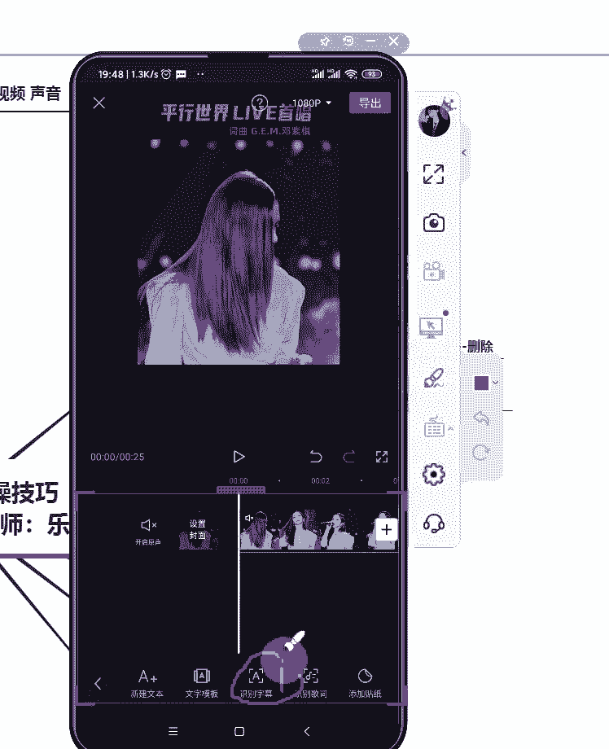
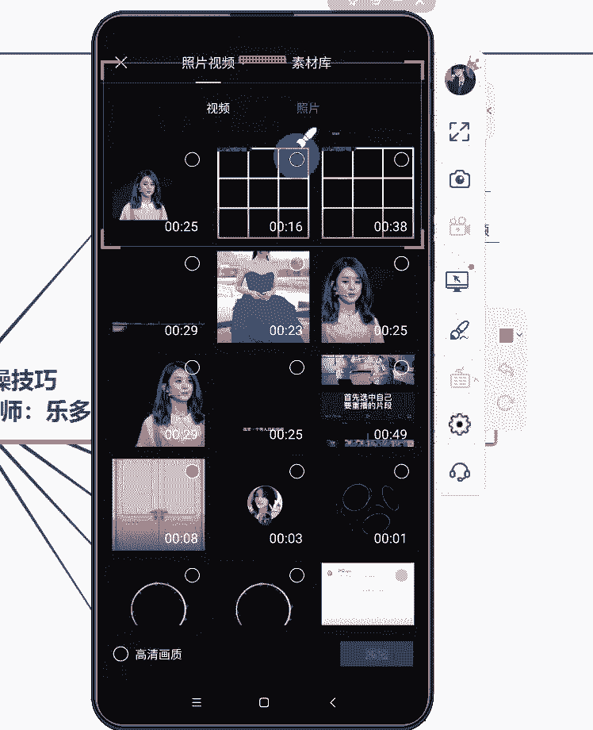

# 2024年做抖音怎么快速起号？3天养出一个高权重抖音账号，掌握这7点，抖音快速养号小技巧！【短剧推广】 - P14：10手机剪映功能实操中 - 我从山中来带着大宝剑 - BV1ZCtBeNE8r

各位同学晚上好，现在能够听到老师的声音，并且能够看到画面的同学，在评论区扣个一声音和画面都正常，就扣一，都没有任何问题的话，截图发给你的指导老师，告诉你的指导老师，你已经进到课堂来听课啦。

这个是每天上课之前都要做的一件事情啊，就是截图发给指导老师啊，告诉你的指导老师，你已经来听课了，好嗯，上课前呢，我们先来回顾一下上一节课讲的一些内容啊，不知道大家掌握的怎么样。

首先昨天晚上呢是讲到了一个皮皮去水印啊，就是关于视频去水印，视频去水印呢我一共讲了两种方法，视频去水印我一共讲了两种方法，好像还有没有同学记得是哪两种方法的，先考考大家对于上一节课的知识掌握的怎么样。

上节课讲到的两种去水印的方式有哪两种啊，一个皮皮去水印啊，我刚自己已经提到了，还有还有什么方法可以去除水印的，除了皮皮去水印可以去除水印之外，那么皮皮去水印这个小程序无法去除的水印啊。

可以用裁剪或者是缩放的方式去除啊，裁剪或者是缩放的方式，希望大家课后呢一定要多去练习，多去练习啊，那除了讲到去水印之外，还讲了一个语音片头以及片尾，好这个片头片尾大家现在会制作了吗。

检查一下大家就是啊片尾能否再说一下，是吧好嗯这个啊，我知道，有部分同学可能对于片尾可能还不太会的，也不要着急啊，我也不会在课前说了，那么我会放到解答课的时候，再给大家操作一下啊。

再给如果说还有同学不会的，待会解答课，不要着急着下课好吧，就我在解答课再给大家操操作一下好，那么除了这个呢，还讲到了一个重点重播啊，重点重播大家会了没有，重点重播，会了是吧，好大部分同学都会了啊。

很好很好啊，如果说还有个别同学不会啊，呃今天这节课程的内容正式讲完了之后呢，我也再去重复一下上一节课的一个内容啊，那么除了呃重点重播，还讲到了一个转场特效啊，转场特效关于如何去添加这个转场特效。

大家会了没，有，转场特效啊，昨天还讲了一个转场特效啊，应该转场特效呢也是比较简单的啊，比较简单的好嗯，就是希望大家课后呢也多去实操一下啊，希望大家课后也多去实操一下，因为其实这个剪映的实操呢。

我们会讲的相对来说多一些，因为后续的话大家不可避免的都要去剪辑视频，剪辑作品，所以说剪映的功能肯定是了解的越全面越好啊，这些功能用得越熟练越好，好吧好，那么今天啊继续讲的是剪映。

那么今天第一个要讲的就是关于变换音频，就是说我怎么给视频去换这个声音啊，怎么给视频换声音，好咳，先讲一下这个换声音是什么意思啊，我跟大家说一下，就是比如说啊我看了一个视频，我把它称之为A视频啊。

A视频好A视频，然后呢还有一个视频叫B视频，我现在是想要用这个A视频的画面，但是不想要声音，我想要B视频的声音，不想要这个画面，我要把A视频的画面和B视频的声音，结合到一起，应该怎么去操作。

主要讲这个变换音频的话，大概就是这个操作啊，就是这个操作好，先来讲一下步骤啊，一样的，先讲文字步骤，讲完文字步骤之后呢，我再给大家进行实操一遍啊，是07：30分开始呀，我没有把课讲完啊，好来迟到的同学。

我只是才刚开始讲好，先讲文字步骤啊，先讲文字步骤，首先第一步肯定是要有视频，你都没有视频，你去换什么音频呢，首先第一步放入视频啊，那么我刚说了，我是要A视频的画面，但是不要他的声音。

所以我我需要把原声关掉啊，点击关闭原声，关闭原声之后呢，再去点击音频，点击音频里面有多个选项，这个在我第一这次给大家讲解剪音的时候，就有讲过啊，就有讲过这个问题，就是音频里面的选项是有很多的。

它有音乐音效，包括提取音乐，抖音收藏以及录音等等啊，那么这个音乐里面点进去可以直接搜索音乐，也可以去找到你在剪映里面收藏的音乐，以及你在抖音里面收藏的一个音乐，好啊，来晚了的同学啊，也不要一直在刷。

签到了，先认真听我说啊，先认真听我说，虽然反复强调课程是07：30开始，但还是不可避免有些同学会迟到啊，好来迟到同学就不要一直刷了，直接认真听我讲就可以了，好那么除了这个呢，还有一个导入音乐啊。

导入音乐的话它有三种方式，一个是链接下载，一个是提取音乐，还有一个就是本地音乐啊，好那么这个音频看你是从哪个地方去操作啊，看你从哪个地方去操作，那么我待会要给大家示范的啊，我先说一下。

我待会要给大家示范的，就是提取音乐啊，就是去提取另外一个视频里面的声音，好好，这个是关于啊去用的那个音频好，我要把这个声音提取出来了之后呢，就是导入我要的音频啊，导入导入之后。

我可以对音频进行单独的一个编辑，就是说这个音频我一样的，就像对视频的操作一样，我可以分割删除，就比如说很多同学在操作视频的时候，发现我的背景音乐的那个音频轨道，比视频轨道还要长。

然后最后这个视频整个做出来的时候呢，时长非常长，但是视频画面已经播放完了，视频还在继续，其实这个时候就只有音频在那里播放了，所以说整个画面会出现黑屏，那么这种时候，我们就需要把长了的这个音频部分。

把它分割出来，然后删掉，避免视频后面全部都是黑屏这种现象，这个在我第一次讲剪映的时候，也有给大家稍微提过一下，待会也会给大家实操示范一下啊，再重新实操示范一下好，这个时候你把这个音频和视频。

切割的和视频一样长，之后呢，你就把音频和视频一起导出啊，一起导出来之后再重新导进去啊，再重新导进去之后就可以识别字幕了啊，可以识别字幕好，接下来就是实操环节啊，实操环节。

我一般都会先把文字步骤讲完了之后呢，就去讲这个就去实操给大家看啊，大家可以把这个文字步骤截张图啊，可以把文字步骤截张图，就是关于变换音频的文字步骤，好大家可以截一张图啊，截好图的就在评论区扣个一啊。

好我先开始投屏，好嗯，就我的手机啊，我的手机这个是好一样的啊，先点开剪映啊。

先点开剪映，然后点击开始创作，导入你要导进去的这个素材啊，点击开始创作导入你的素材嗯。

等一下这个头皮又给我卡住了啊，上课前试这个投屏，他就是正常的啊，每次我一到上课的时候，他总是要给我使小性子。

好了啊，正常了啊，正常了好，点击开始创作，然后导入一个视频素材，就是说这个视频你要哪个声音啊，你要哪个视频的画面，你就导入这个视频的画面就可以了啊，导入这个视频的画面就可以好呃。

比如说我看一下我要哪个视频啊。

我找一找我用哪个视频比较恰当。

好我就用这个视频，好就用这个视频啊，随机找一个视频。

这个头皮又卡住了，稍等哦，呃我也想揍这个投屏啊，我怕我一揍他，他更加不工作了。

好他突然一下回来了，好嗯先不管我用的哪个视频素材啊，我就是随机找到一个视频素材，然后我就用这个视素材就可以了，你们也不用管这个视频素材，具体是一个什么内容，但是我记得这个视频好像本身是有声音的啊。

我把声音放出来听一下好了，啊这这个视频呢它本身是一个唱歌的视频啊，是一个演唱会现场的一个唱歌的视频嗯。

我我我看一下，我试一下，我是不是要换一个网络啊，这个投屏总是慢半拍，慢半拍就卡住了啊。

好好，回来了回来了好，那么这个视频啊，这个视频就是我现在导进去的这个视频呢，它本身是有声音的啊，它本身是有声音的，这显然它是一个呃唱歌的一个视频，但是我现在要的不是这些唱歌的声音啊，不是这个唱歌的声音。

那么我现在需要做的就是把原原声关掉，因为我不要用这个声音，那我就去把原声关掉啊，关闭原声在哪个位置呢，在这里啊，在这个地方你点一下这个小喇叭就可以了，点一下这个小喇叭就可以了。

就是你自己在手机上去操作的话，你点了关闭原声，其实是能够看到这，这里变成了一把小小的一把叉啊，小小的一把叉，就是原声已经关闭掉了，原声已经关闭掉了，就是这个样子，就是说你在手机上是能够看得比较清楚的。

但是因为可能呃大家上课的时候，大多数同学是用手机在听课的话，那么这个屏幕可能会有点小啊，所以说你可能有点看不太清楚，这里有一个小叉叉，但是一般啊，当这个喇叭前面的这个一一竖变成了一个叉叉。

然后它下面出现一个开启原声的时候，就说明这个视频的原声已经被关掉了啊，视频的原声已经被关掉了，好原声关掉之后，我要去导入一个新的声音啊，声音很吵吗，我其他同学听一下，就是声音很吵吗。

因为有一位同学疯狂在这里刷啊，啊不吵是吧，有回声是我这个环境的问题啊，有回声是我这个环境就这个没有办法，就是我这个房间的问题，好吧啊，没有卡住啊，没有卡住是在试一下这个声音的问题啊。

好嗯还是想听一下原声是吧，我先把原声开启啊，我把手机声音调大一些，让大家先听一下这个原声好吧，玫瑰会上的鲜红，因为爱过的都从应该可以听得到啊，就是我刚给他放这一段，就是这个视频本身的一个原声啊。

刚刚这一段是视频的一个原声，那么我现在要做的呢就是把原声关掉啊，把原声关掉，然后去导入一个新的音频啊，就是点这个位置把原声关掉，其实把原声关掉，它会提示你原声已全部关闭好，那么我现在原声关掉之后呢。

要重新换一个音频，那我就去点击这个音频啊，点击这个音频，然后点击这个音频，你可以直接比如说啊，我这个视频他放的是这首歌，但是我想让他换其他的音乐，让他唱其他的音乐也可以，你可以直接就换。

从在这里搜索音乐啊，点击这个位置去找音乐。

直接去找就可以的，就是点进去可以搜索音乐啊。

但是因为我这边啊网络总是不太好，就很难搜索出来音乐啊，就在这个位置可以搜索相关的音乐，就是说你如果说是做一个音乐账号啊，做一个音乐账号，或者是剪辑一个音乐作品的情况下。

那么你就可以直接在剪映里面搜索一首，你想要放到这个视频上面去的歌曲啊，都是可以的啊，都是可以的，好这个就是添加音乐，第一步就是这个是可以直接去搜索音乐的哈。

我现在不要从这里去加音乐啊，我要去提取一个声音啊，我要去提取一个声音，提取音乐的话是要点击这个提取音乐啊。

点击提取音乐好，点一下啊，点一下之后呢，它就会跳转到你的这个相册页面啊，跳转到这个相册页面，然后看你要去提取哪个视频里面的声音啊。

呃我想一下是哪个视频里面的声音，是我想要的啊。

找找我预览一下。

嗯你会好，就是这个视频里的这个视频里的声音，是我想要的，然后我就把这个声音选中这个视频之后，它下面显示的不是添加该视频，看到没有，它显示的是仅导入视频的声音，意思就是说我现在选中了这个视频。

它导进去的只是视频里面的声音而已，视频里面的画面并没有关系啊。

并没有任何关系，所以说我现在点一下仅导入视频的声音，然后导进去的这里就多了一个音频轨道啊，多了一个音频轨道，仅仅就只有一个音频在这里了，好，那么我现在看一下，是视频长一些还是音频长一些哈。

我现在可以看到的是嗯视频比音频要长，那么我就要去切割一下我的视频啊，因为它比我的音频长了，好分割视频，分割视频啊，对准，长了的这个部分啊，把它对准，然后点击分割，点击分割之后呢，再选中后半部分啊。

再点击删除，好这个样子的话，这个时候音频轨道和视频轨道就一样长了。

它们在同一个地方结束啊，这个就是手，我就把音频已经提取出来了，那么很多同学说啊，这个文案我给大家听一下这个声音啊，看能不能听到，如果一个男人真的爱你，那你会看到他的幼稚，他的小心眼和他的坏脾气。

如果想好就听这么多啊，很显然能够听得到，这是一段文案，你们刚能听到声音吗，就是我的手机，已经尽可能的凑近我的麦克风了啊，但是因为这个手机可能有辐射的话，你们可能会听到这个电流的声音啊，就刚刚那一段的话。

其实它就是一段文案的声音，那么我们也知道很多情感类型的视频的话，它除了有一个念文案的声音之外呢，它的这个文案字幕，它一样的是会出现在这个视频上面的，就是我们平常刷到一个作品。

我们可以看到这个字幕是出现在这个屏幕上的，那么像这种声音，这个字幕全部都是自己一个一个打上去的吗，有时候显然不是啊，比如说像我导进去这样子的一个音频，如果说我再挨个挨个去输这个字幕的话。

会出现什么情况呢，可能我啊有时候听岔了，或者是啊音频和字幕根本就对不准这种情况，所以说这个时候我就可以用到，自动识别字幕这个功能啊，可以用到自动识别字幕这个功能，但是我告诉大家。

现在这种情况去识别的话是会失败的，为什么呢，我可以给大家演示一下啊，比如说我现在去识别一下，点击这个文字，然后再点击这个识别字幕啊，再点击这个识别字幕，然后是识别不出来任何东西的啊。

他会告诉我开始识别啊，他这里会显示开始识别啊，就是自动识别字幕啊。

然后我点开始识别，识别失败，请重试好，为什么会识别失败啊，我告诉大家，就是我刚开始讲文字步骤的时候，我跟大家说了，一定要先把它导出去，因为这个时候视频和音频他们其实还是分开的，就是是两个轨道。

我只有把它合并到一起之后呢，我才能去识别这个字幕啊，好在识别这个字幕之前，刚有同学一直说试一下那个变声是吧，我看一下这个视频能不能变声啊，嗯显然这个不能变声啊，这个这个不能变声啊。

咳那么待会待会我录一段音给大家变一下声，试一下，我录一下音给大家变声，好吧好，那么现在既然现在不能识别字幕，我就把这一段啊，因为现在我们可以看到的就是视频是一个轨道，音频是一个轨道。

那么我就要把它导出去，让它们合并啊，合并点击右上角的导出啊。

点击右上角的导出。

好全部导出之后呢，再重新去把这个视频导进来啊。

点击开始创作，然后这是我刚刚导出去的这个视频，然后再把它重新导入啊，重新导入一次，重新导入一次之后呢，我直接去点击文字啊，点击这个文字，然后再点击识别字幕，识别字幕好。

他一样的会提示我啊。

提示我这个东西自动识别字幕，然后我点开始识别，然后它这个上面会在显示啊，字幕识别中好，识别成功，已生成自动字幕，好，这样子我们就可以看到这个字幕了啊，可以看到这个字幕了，就是现在有一点点小。

待会我可以把它适当的调大啊，我可以放给大家看一下，如果一个男人真爱，那你会看到他的幼稚，他的小心眼和他的坏脾气，如果他不爱你，你能看到的只有他的成熟，冷漠和高傲，所以真正聪明的女人都会珍惜。

那个和你这个就是识别出来的这个字幕啊，识别出来的这个字幕，而且我们可以在这个下方看到每一个字幕的，这个文字轨道啊。

文字轨道这个就是这个东西啊，这个这个就可以称之为文字轨道啊，称之为文字轨道，然后识别出来的字，识别出来的字幕啊，下面还有一排字幕，那个是我视频本身的一个字幕啊，你们刚看到有两排字幕。

下面那一排字幕是我视频本身的一个字幕，嗯好，我想问一下其他同学，我的直播间很吵吗，因为有一位同学疯狂在刷屏啊，我都看不到其他同学的发言了，好墨玉红同学，所有的同学都在反映，我的直播间并没有任何问题啊。

我的直播间并没有任何问题，如果说你觉得我这边很吵的话，呃，你可能是你自己那边的一个网络的问题啊，墨玉红同学，好嗯好，刚刚有同学问到啊，这个字幕我想把它放大一点，我想给他换个颜色，怎么操作啊，怎么操作。

告诉大家就是在这个页面啊，就在这个页面看到没有，这里有一个样式好，我点一下这个样式啊，我点一下这个样式之后，大家可以看到识别出来的字幕，它就会有一个好处，什么好处呢，就是我只对其中的一个轨道去进行编辑。

但是这个样式花字气泡位置应用到识别字幕，什么意思，就是说我调整前面这三个选项啊，我只要对其中一个字幕轨道去调整这三个选项，它是可以应用到所有的字幕上面去的，就是我下面画横线的这一句话啊。

我下面画横线这句话大家能看清楚吗，看突然忽略了这个问题，大家能看清楚这这一行字吗，就是我现在用红色框框框给大家看的这一行字，能看清楚吗，这一行字的意思啊，这一行字的意思，就是说我用到前面这三个功能啊。

前面这三个功能样式花字气泡，我只要对其中的一个字幕轨道去应用，其中的一种作用，它是可以应用到全部字幕去的，就是说我只调整了一个字幕，但其实它可以运用到全部的字幕里面，这样说大家可以理解吧。

就这句话的意思啊，这句话的意思就这个意思，就是我只调整一个字幕轨道，但是它可以应用到所有的字幕里面啊，就这个意思，那么前面这三个可以，但是这个动画就不行了，动画就需要一个一个去手手动调节啊。

动画需要一个一个手动调节，它没有办法一次性全部应用啊，跟大家强调一下好，那么刚刚有同学说啊，老师我觉得这个字太小了，怎么办啊，如果说你觉得字太小了的话，你可以直接就在这个视频上面啊，去点一下这个字幕。

点一下这个字幕啊，点一下这个字幕之后，它会出现这样子的一个框框，它会出现这样子一个框框，然后你就可以把它拉大啊，可以把它拉大。

而且你把它拉大的话，不仅仅只是这个字幕拉大，后面的全部一起都拉大啊，就是说这个样式它会应用到所有的字幕里面，就全部都一起拉大了啊。

就是这样子的，然后包括除了这个之外啊，包括像其他的一些应用，比如说花字啊，花字我去试一个花字啊，花字的话有比较多啊，我用这个花字啊，用这个花字一样的，我这一个文案啊，这一个文字轨道应用了这个花字。

我后面所有的文案也是用了这个花字，大家看后面的这个只要是我识别出来的字幕啊，识别出来的字幕，它全部都会应用到，全部都会应用到，包括这个气泡啊，气泡也是一样的，这个气泡啊也给大家试一下啊，给大家试一下。

就比如说我选一个气泡啊，选一个气泡就用第一个好了，就用第一个好了好，第一个气泡应用上去之后就是这个样子啊，应用上去就是这个样子，然后给大家看，后面也全部都是带上了这个气泡啊，也全部都带上了这个气泡好。

这个就只能应用这些啊，像比如说你说你调了一个动画，比如说你对这个啊这一段文字调了一个动画，它就只能应用到这一段文字上面啊，他就不能应用到其他文字上面啊，比如说我用这个爱心弹跳这个动画啊。

嗯等一下我刚刚这个轨道没对准确啊，好我是现在是第一个字幕，轨道运用了这个动画啊，大家可以看到一个男人真的爱你，太快了，这个动画时间没有调对啊，时间没有调对，重新调一下这个动画的时长。

然后把这个气泡取消掉，不要这个气泡，不要气泡。

OK然后如果一个男人真爱就可以看到，但是那个动画只有第一句话可以看到，大家看一下，就是我刚加了一个动画，但是只有第一句话可以看到这个动画，因为是我只对第一句话加了啊，动画不能应用到所有字幕。

第二句就看不到了，所以说这个样式里面就只有前三项啊，只有前三项调整一个全部都变啊，动画就只能挨个挨个调啊，动画就只能挨个爱跳，能不能让字幕跟着声音变色，这个，好像不能啊，减一里面调不了啊。

减音里面调不了，嗯也有可能是哦可以啊，有但是比较少啊，给大家看到这个动画里面有一个动画，可以这么去调啊，就是这个动画，这个动画它可以变变一点点颜色啊，可以变一点点颜色，就是嗯比较少啊，比较少。

这种动画毕竟比较少啊，很少见啊，很少见，就是说跟着跟着这个字幕，然后变颜色的，这个就是这个动画可以啊，这个动画可以，所以这个动画就需要挨个挨个去调整啊，需要挨个挨个去调整，太麻烦了是吧。

确实是调动画会有一些麻烦啊，但是其他的话基本上我调一个就能够应用到。

全部的话，其实就不算麻烦啊，其实就不算麻烦，好吧咳好，刚刚一直有同学在问啊，那这个视频原本的字幕能调整能去掉吗，好视频原本的字幕能不能去掉啊，可以用裁剪的方式可以去除掉啊。

视频原本的字幕可以用裁剪的方式去说啊，我给大去掉吧，不然大家感觉大家看这个很别扭啊。

裁剪啊。

上面的字也给它去掉好吧。

啊，这样子的话，就只能看到我刚刚加上去的这个字幕了啊，就是我刚刚加进去的这个字母可以看到啊，把它往下挪一些吧，就不会有双排字幕了，这个视频现在就变成这个样子了，就只有一排的一个字幕啊。

就只有一排的一个字幕，幼稚好吧，就是这样子的，这个是变换音频啊，当然这个音频的话不一定说，就是说一定要去其他的视频里面找一个音频啊，如果说你是做一个音乐账号的话，你直接就去剪映里面搜索一段音乐。

也是可以的啊，直接搜索一段音乐就是可以的好，那么刚刚有同学一直说用变声啊，变声的话，好像一般是只能自己录的音才能变声啊，自己录的音才能变声。

我试一下啊，我自己这边现在录一段声音，然后呢我对它操作一下变声啊。

去找到我录制的这段音频啊，这段音频就是刚看了这段音频啊，这里显示的小小小的录音的两个字啊，小小录音的两个字，就是我刚刚说的这一段话的一个录音啊。

我刚刚说的这段话的一个录音啊，就是这个录音看到没有，这里有个录音的这个小字啊，好只有鹿的声音可以对它进行一个变声啊，点下面这个变声就可以了啊，好这个变声里面有好几种声音啊，有好几种声音，有大叔萝莉。

女生男生啊，还有怪物好吧，我也不知道我的声音到时候变出去了，能变成什么样子啊，听一下他的坏脾气好，如果他不爱你，你能看到的只有他的好，其实好像是听不到我，我变声的这个声音啊，我把原声关掉。

听一下我变声的声音好吧，我自己这边现在录一段声音，然后呢我给他操作一下变声了，这声音有一点点小啊，不知道刚刚大家有没有听到，哼，就是我我再把声音调到最大啊，我把我手机声音调到最大。

就是我刚刚录的这段声音，你们会发现你跟我刚刚刚刚听到我的声音，和录的这段声音完全不一样啊，我自己这边现在录一段声音，然后呢我对他操作一下变声啊，好就是这段声音啊，就是这段声音啊。

就是我我自己刚刚讲话的声音，然后我把它变成了一个大叔的声音啊，把它变成一个大叔的声音，就是个样子啊，就是这个样子的好吧，所以说这个变声啊，变声是对你的录音进行操作的啊，对你的录音进行操作的。

就是说其他声音是变不了的，其他声音变不了，好吧嗯，变声啊，这个变声是针对录音去操作的啊，因为这一段音频轨道就是我自己的，就是我刚自己录的音啊，还是我自己的声音好听是吧，我也觉得我自己的声音好听啊。

好自恋呀，好。

这个就是关于变换音频啊，刚刚讲解的就是一个变换音频的一个操作啊，变换音频的一个操作，包括变声我也一起讲解了，包括变声也一起讲解了，就变换音频啊，变换音频的一个操作，如果说刚刚还没有来得及截图的同学啊。

现在也可以再截一下图好吧，刚刚没有来得及截图的，现在再截一下图，变身后可以保存下来，用到视频里面吗，可以用到视频里面呀，好应该刚刚已经让大家截了一下图了啊，我担心有些同学刚刚没有截到图。

就现在重新截一下好吧，这个是变换音频啊，变换音频其实啊不难啊不难好，那么讲完这个变换音频，再来讲一个三频制作啊，三频制作三屏制作，首先给大家看一下什么是三屏视频啊。

我记得我相册里面有保存了一个三屏的视频，先给大家看一下，不然的话大头又会在想啊，老师为什么要讲三瓶啊，什么是三屏，我都看不懂啊，我都不知道什么叫三屏视频，说什么三屏呢，对不对，所以说先给大家看一个啊。

三屏视频是长什么样子的啊，啊这个视频啊，如果说昨天有认真听课的话，大家应该啊有点眼熟啊，有点眼熟，这就是一个三屏的视频啊，这就是一个三平的视频，就是这上面啊就这三个画面是一样的，这个就是三屏视频。

好吧啊，就是这个这个就是一个简单的三屏视频啊，那么这种三屏视频应该怎么去做啊，这种三频视频应该怎么去做好一样的，先讲文字步骤啊，先讲文字步骤再去讲这个，再去讲实操啊，嗯好文字步骤啊，比较简单啊。

比较简单，首先想要做这种三屏视频的话，用到的素材就是横屏的素材啊，不是竖屏的素材，如果说是竖屏的素材的话，那它是做不了的啊，做不了这个三屏或者是做出来了的话，这个效果也非常的别扭。

所以说做这个三屏视频的话，这个素材本身就是横屏的啊，第一步就是导入素材，第二剪辑，这个剪辑呢主要就是裁剪一下，这个视频的一个画面啊，裁剪一下视频的画面，然后呢调整成九比16的一个比例之后。

就先把它导出啊，导出导出之后再次导入，再次导入呢点击特效，找到分屏，然后选择三屏啊，选择三瓶就可以了，好这个文字步骤啊非常简单啊，非常简单，但是为了避免大家啊可能听一遍记不牢。

那么大家也可以截个截个图啊，截个图保存一下，截图保存啊，截图保存一下，就是待会我马上就会讲实操了啊，马上就会讲实操，投屏啊。

第一步啊一样的先导入素材啊，先导入素材。

点击开始创作啊，导一个横屏素材进来，我找一个横屏素材好。

这个横屏素材先可以给大家预览一下啊，这个横屏素材是怎样的，就是它在我的整个手机上，我把声音关掉，太吵了太吵了，这个声音好，它在我的整个手机上，它只占据到这一个画面啊，它只占据到这一个画面。

就说明它是一个横屏视频，如果说我这么播放的时候，它就已经占据了我的整整个手机屏幕的话，那就是它就是一个竖屏的视频啊。

如果是占据了整个屏幕的话，它就是一个竖屏的视频了，所以说我们要的是这种横屏的啊，你就手机这么竖着放的时候，它只占到中间位置的这种视频素材，好吧好，那么我现在要用的就是这个素材啊，它是一个横屏素材。

我要用的就是它好，点击右下角的这个添加就可以了啊，把它添加进来啊，把它添加进来，那么这个视频呢我觉得比例非常好啊，我觉得比例非常好，我不需要对它进行一个任何的调整，也不需要对它进行裁剪的情况下。

我可以直接就去调比例啊，可以直接调比例。

在一级工具栏里面找到比例，这个选项啊，找到比例，这个选项好，然后把它调整成九比16的一个比例啊，九比16的比例调整好比例之后。

其他都不用管了，直接导出啊。

直接导出，点击右上角的导出，好刚刚有同学说直接分屏特效不可以吗，我待会给你看一下直接分屏特效是什么效果啊，好导出成功之后啊。

完成啊，完成完成之后呢，我要点击开始创作，然后把这个视频重新导入剪映啊，重新导进去。

添加啊，添加之后呢，好这个时候找到下面找到特效的这个选项啊，特效的这个选项我给大家画圈了啊，特效特效点进去之后呢啊现在已经更新了，现在已经更新了，它这里面有一个画面特效和一个人人脸道具好，其他都不用管。

就直接点这个画面特效啊，点画面特效，点画面特效之后，先在这一这一行啊，这一行最上面这一行文字这里找到一个分屏，就是一直往左滑啊，往左滑往左滑，然后看到分屏啊，点一下这个分屏啊，点一下这个分屏。

分屏里面有两瓶三瓶四瓶黑白三格啊，还有一个六瓶九瓶九瓶跑马灯，那么我们上课呢主要是讲这个三屏啊，如果说你以后想做一个试四瓶的，或者是想做一个六平的，甚至想做一个九瓶的，你不要说老师上课没有教，我不会啊。

其实都在这个特效里面，你只要如果说你想做六瓶的也可以，那你就去用这个六瓶的就可以了啊，你想做四瓶的也可以，你去点这个四瓶就行了，好那我现在要做这个三瓶，我就选择这个三瓶啊，选择这三瓶。

我要选择好了之后点击这个对勾啊，点击这个对勾就可以了。

好可以，之后给大家看一下这个三屏的一个效果啊，看一下这个视频三屏的一个效果。

啊最后三瓶的一个效果好，大家注意到一个什么问题了没有，就是给大家放的短短这几秒的视频里面，大家注意到一个什么问题了没有，大家注意到没有，就是刚刚短短的几秒里面比例吗，是比例吗，就是我现在停留的这个画面。

大家有没有发现他好像跟我预想的不太一样啊，看，就只有刚开始一点点啊，他就只有刚开始一点点。

他到后面就没有了，这是什么原因啊，这是什么原因给大家看一下，就是看到下面这个部分啊。

视频轨道下方加上了三屏特效之后呢，它这里其实三屏会有一个特效的一个轨道，那么它这个轨道只拉长到视频的这个位置，那么这个三屏的特效，它就只应用于前面这半部分啊，它就只应用于前面这半部分。

那我要怎么让它应用到全视频呢。

好点击一下这个三屏特效的这个轨道啊，点击然后摁住这个白色的小方块，摁住它啊，摁住它，然后一直往后拖啊，一直往后拖。

拖到视频有多长就拖多长啊，视频有多长就拖多长好，然后这样子就应用到整个视频了啊，应用到整个视频了哈，整个视频的话大概有半分钟的样子啊，可以放给大家看一下整个的一个效果啊，整个的一个效果。

这样子的话他就整个视频啊，视频全程都是一个三屏啊，视频全程都是一个三屏的效果了，这个视频本身就是一个烟花的视频啊，这视频本身就是一个烟花的视频，好这就是一个简单的三屏视频啊，那么刚刚有同学说。

那老师我没有导出，直接调整三屏会出现什么情况啊，我给大家操作一下，如果说视频没有导出，我现在可以告诉大家。

我可以直接就在草稿箱里面，找到我刚刚的那个视频啊，就是这个视频如果没有导出啊，这个视频没有导出，直接调三停是一个什么效果，给大家看一下，点击特效啊，回顾一下这个过程啊，点击特效，然后找到这个画面特效啊。

不要点人脸道具。

点画面特效，然后在画面特效里面，在最上面这一行啊，找找分屏啊，分屏分屏里面点三屏啊，点三屏好，再给大家看一下这个视频的一个画面嗯。

我给它应用到全视频吧，不然的话大家看不全啊，好大家再看一下这个视频的画面，它就是这个样子的啊，如果说你没有把视频导出的话，这个三屏。

它就还是只存在于这个中间这一部分啊，他上下还是黑的啊，他上下还是黑的，没有声音，是我的手机没开声音啊，因为这个声音很吵啊，声音很吵，所以我就没有开啊，好这就是一个三平的一个制作啊。

三平的一个制作就是这样子的嗯，是比较简单，步骤比较简单，然后我这里呃再给大家一步吧，是在这个画面特效里面啊，画面特效，画面特效啊，画面特效里面好，找分屏啊，找分屏，因为是最近更新了。

最近更新了才有这个画面特效，分一个画面特效和一个人脸道具的，那么之前没更新之前的，就是只有这个画面特效就不存在，要去点这个啊，嗯好这就是一个简单的三屏制作的一个视频啊，简单的一个三屏制作的视频。

好这个过程啊，过程大家可以截图保存啊，截图保存一下，其实很简单啊，很简单，上一集标题就是全部就是三屏制作啊，就这样子的，先搞清楚啊，找横屏素材啊，如果说是竖屏素材的话，做出来这个画面效果不理想啊。

画面效果不理想，这个是嗯三屏制作啊，三屏制作，那么讲完三屏制作呢，我们再讲下一个就是抠像功能，抠像功能啊，抠像功能的话一般就是带，呃两种带两个啊，一个是智能抠像，还有一个就是色度抠图啊，那么智能抠像呢。

它主要就是啊可以抠一些人物素材啊，或者是一些动物素材，其实都可以，就是一些动画的一些素材啊，其实都可以去抠，那么色度抠图呢，主要就是去抠一些绿幕背景的视频，或者是图片啊，主要是去抠这个类型啊。

主要是抠这个类型，那么这个具体去怎么抠啊，具体是怎么抠，我可以抠一个给大家看一下，这个抠像功能的话，大家平常自己只要有素材可以多试试啊，啊尤其是这个绿幕背景的视频或图片，在剪映的素材库里面就有很多啊。

在剪映的素材库里面就有很多，给大家可以看一下。

剪映的素材库里面是很强大的，里面有很多的绿幕素材啊。

点击开始创作，然后不要找进到你的相册里面去，去点这个素材库啊。

点这个素材库，素材库里面就有一个呃绿幕素材啊，绿绿幕素材看到没有，这个绿幕素材。

这个绿幕素材下面就全部都是一些绿幕啊，全部都是一些绿幕，就我可以啊，比如说我要用这个恐龙啊，我用这个恐龙，我可以把这个绿色全部都抠掉啊，全部都抠掉，抠一个啊，色度抠图抠一个给大家看一下啊。

我要把绿色抠掉啊，把绿色全部抠掉，就留下中间这个恐龙啊，就留下中间这个恐龙怎么去抠好，第一步啊，点击剪辑啊，点击这个剪辑，然后前面是智能抠像，不用管，我现在要的是色度抠图啊，找到色度抠图，点击色度抠图。

然后这个色度抠图这里有一个取取色器啊，这个取色器点这里是没有反应的，因为我们可以在这个视频上面看到有一个圆圈，大家能看到这个圆圈，没有这个圆圈，这个圆圈我稍微拖动一下，这个圆圈能够看清楚没有。

就是这个圆圈它就是一个取色器啊，那么他取的是哪一块呢，这个圆圈范围这么广，他取的是哪一块颜色呢，是中间这个小方方块啊，这个小方块这个小方块框中的颜色，就是这个取色器取的颜色，如果说你想要抠什么颜色。

那你就要确保中间的这个小方块框中，这个颜色啊，比如说我要抠绿色，我要把绿色全部抠掉，那么这个中间的这个小方块就要选中绿色啊，我要把它拖到边上来，让它选中绿色，然后选中绿色之后呢，再回到下边啊。

回到下边这里有一个强度啊，只要点这个强度，点这个强度你就可以去拖啊，拖动这个强度好去我拖时啊给给大家看一下嗯，看一下不同强度的一个效果啊，比如说现在这个强度设置为七的情况下，给大家看一下抠的一个效果啊。

显然不是很理想，因为这个绿幕还在啊，绿幕还在，然后我强度再高一些啊，强度再高一些好再高一点啊，11啊，现在是强度是11好，大家还可以看到还有一些些绿色啊，包括它脚底下踩的还是一些些绿色。

然后我觉得我要把绿的全部都抠掉，那么再把这个强度再调高一些啊，再调高一些好，我调到50啊，我调到50好到这种程度的话，基本上就完全看不到绿色了啊，基本上就只有边边上有一些绿色的线了啊。

就很浅很浅的一些些绿色的线了，那么基本上抠成这个样子就差不多了啊，这就是一个简单的色度抠图的应用，那么这个色度抠图，它一般就是用来抠这种绿幕背景的，一个视频或者是图片的，一般是用来抠这个的。

因为色度抠图的话，它只能抠那种纯色啊，纯色要么就是纯绿色，纯蓝色，纯红色的这种颜色可以去抠啊，如果是其他颜色的话，可能抠出来效果就不理想啊，不理想好，如果说呃把强度调到100是吗，试一下啊。

把强度调到100啊，把强度调到100就是这个效果啊，把强度调到100，就这个效果可以看一下，就是一丁点绿色基本上都看不到了，这是强度调100的一个抠图效果好。

这是色度抠图啊，再带大家来看一个智能抠像啊，智能抠像咳好，智能抠像的话，我下载了一个素材啊。

我下载了一个素材啊，点击一个开始创作。

我去找一下我的那个素材啊，好家长一直都在学习好，这个素材呢是一个女孩子跳舞的一个背影啊，女孩子跳舞的一个背影，然后我现在就是把它把这个用智能抠像，把它抠出来，看是一个什么效果啊。

我们可以先看一下这个视频本身是这样子的啊，本身是这样子的，好给大家看几秒就可以了哈，然后我现在要对他一个智能抠图的一个操作啊，智能抠像的一个操作好，怎么去操作这个智能抠像，点击剪辑啊，点剪辑好。

点完剪辑之后，就在这里可以看到有一个智能抠像啊，点一下这个智能抠像。

然后他就再给我扣了啊，他再给我扣了，然后抠完像是一个什么效果呢。

就这样子的啊，就是这样子的，抠完之后啊，就是那个背景都不见了，就只有这一个人在这里动了啊，就只有这个人在这里动了啊，这个就是智能抠像啊，智能抠像抠上来就只剩下这个人像了，然后那些背景都全部都被抠掉了啊。

全部都被抠掉了，那很多人在疑惑，那我把它抠下来干嘛呢，抠下来，我是可以把它一，放到其他的一个场场景下面去的啊，我可以把它放到其他的一个场景里面去，而且就是怎么放到其他场景里面去呢。

可以通过画中画的形式去放啊。

可以通过画中画的形式去放，是呃在课件上也给大家写到了，就是智能抠像抠出来的，这个素材是可以通过画中画去添加的啊，通过画中画去添加的，可以把它抠出来啊，可以把它抠出来，那么这就是一个抠像功能啊。

当然这两个功能呢，其实我们平常用的也不是特别多啊，但主要还是跟大家讲一下，它是有这个功能的啊，有这个抠像功能嗯，就很多时候有些同学看着啊，就有些图片很显然或者是有些视频，它放在一个场景里面。

很显然它比较假的情况下，他可能就是用到了这种抠像功能啊，抠像功能就是一个智能抠像，或者是一个色度抠图都是有可能的好，这就是关于抠像功能里面讲的，一个智能抠像和色度抠图的两种好。

关于这个智能抠像和色度抠图，大家现在是理解呢还是很懵呢，蒙理解好，我看一下啊，额还是理解的人比较多啊，还是理解的人比较多啊，如果说嗯有同学觉得还是不理解，或是有点懵的话。

那么我们可以解答课再说一下这个问题啊，可以再说一下问这个问题，然后我们现在的话就嗯，大部分同学都还是理解了，因为其实这个东西应用标很简单，就是这个智能抠像和色度抠图，它都是一键就能抠的啊。

就你摁一下那个键，它就能帮你抠的，这种就也不用很麻烦，就不用你一个一个慢慢去抠啊，就其实大家都知道就是电脑PS抠图是很厉害的，但是这那种抠图因为它比较精细的话，他就没有办法一键帮你抠好。

他就是要用鼠标一个一个去点的这种抠图啊，但是这种剪映的话，它毕竟功能比较简单一些，然后可能就是嗯他就是为了方便快捷，所以说抠出来的效果，肯定就是说没有PS抠的那么好，但是呢他胜在比较快捷，比较简单啊。

就这个意思好，这是一个抠像功能的一个基本的效果啊，好下面再来讲一个封面的制作，就是我们做视频，包括我之前就是在之前的课程上跟大家讲解，账号搭建的时候，这个个人主页的一个问题啊，就是个人主页要整齐。

这个问题就是很大程度上就是一个作品封面啊，作品封面啊，这个关于这个作品封面的话，就是呃，我现在现场给大家搜一个抖音号看一下啊，给大家搜一个抖音号看一下，我看能不能啊，网络支不支持。

我给大家看一下这个抖音号啊，就是给大家看一下，别人的一个视频的一个封面啊，稍等一下，稍等一下，为什么要让大家去做这个封面啊，就封面整齐是非常重要的啊，封面整齐是非常重要的，好嗯。

哎哎就给大家看这一部分吧，好你乍一看这个封面好，先在评论区说一下，先在评论区说一下，你们觉得这个封面怎么样，先说一下你们觉得这个封面怎么样，就是我现在投屏给大家看到的，这个账号的一个封面乱啊。

也有说好啊，也有说垂直还可以密集恐惧症啊，好，太满了，有点密集恐惧症，OK好，不管你是觉得他还可以还是不可以，还是觉得他乱，还是觉得他整齐，但是我告诉大家啊，就算你觉得他乱，或者是你觉得他不整齐。

我告诉大家，他的所有作品的封面风格统一，风格统一，大的局长，就是你们现在在画面上，一共看到六个作品的封面，他的这个作品的封面有一个统一的特点，大家没有注意到统一的一个特点是什么。

就是全家人端着当天的一个美食拍的一张照片，这个其实大家可能第一眼看到会觉得乱啊，他们穿的服装也不统一，各种都不统一，然后感觉这个画面的大小也不一致，但是他风格是统一的啊，风格都是统一的。

就是全家人和美食在一起啊，和美食在一起，他的这个账号，所有的封面基本上都是这个样子的啊，基本上所有所有的封面都是这样子的啊，除了极个别啊，极个别会有一个不一样，比如说像这个啊，这个就不太一样。

但是大部分啊大部分都是这种封面，可以看到啊，都是这种封面，就是全家人一起端着美食拍的一起一张照片啊，全家人拍端着美食拍的一张照片，那么它的整个封面其实是做的还是很垂直的啊，还是很垂直的啊，嗯好。

所以说我们为什么要单独把这个制作封面，拎出来讲一下，就是希望大家以后做作品的时候呢，也要去设置一个统一的封面啊，统一的封面其实除了这个之外很多啊，我们可以看到很多的一些大V账号呢。

他都是会把这个封面做的很好的啊，嗯看一下这个能不能看啊。

这能不能看，就是我看一下这个这个啊，这个可能会比刚刚的那个更好一些啊，这个会比刚刚那个更好一些，更加整齐啊，更加整齐一点，哎呦嗯，他这个绝对不是说视频里面随机的一个画面，抽取出来做的一个封面。

而且大家看到他的这个，基本上这个画面的大小都是统一的，画面的大小都是统一的啊，都是统一的啊，我的线画的还不直了，还破坏了他的这个破坏了它的这个整齐感啊，就是他的这个画面的大小都是统一的啊，都是统一的。

然后他的这个字啊，这个字也基本上都是在画面上面的这个位置，或者是画面下面的这个位置就是很统一啊，很统一好吧，所以说嗯就我们自己做封面，想要做到这种整齐的话，你单独每次都是用视频里面随机一个画面去做。

封面的话，肯定是做不到这么整齐的，所以说你要去精挑细选一下这些画面啊，要去精挑细选一下这个画面好，那么怎么去做这个封面啊，怎么去做这个封面。

还是比较简单啊，还是比较简单，就是这个封面的话，首先在剪映里面点击这个封面设置啊，就是你视频导进去了之后，它会有一个封面设置，那么封面设置的点进去之后，它会有两种选项，一个是视频帧，一个是相册导入。

视频帧，就是说从视频里面选择一个画面作为你的封面，相册导入，就是说你可以从相册里面导入一张图片，作为你的视频封面啊，都是可以的，都是可以的，好接下来投屏操作啊，投屏操作。

好点击开始创作啊。

点击开始创作，然后找一个视频啊，找一个视频，额我就用今天开始用到这个烟花的视频啊。

就用到这个烟花的视频，好视频导进来之后呢，大家可以看到就在这个位置啊，在关闭原声的右边就是一个设置封面的选项啊。

就是一个设置封面的选项。

然后点击这个设置封面啊，点击这个设置封面就可以设置了，这里面有一个视频帧啊，有一个相册导入视频帧，就是说要选择视频里面的一个画面，作为你的视频封面啊，我可以选一个画面，就是你可以去滑动这个视频轨道。

然后选一个画面啊，选一个画面就可以的，比如说我看我想选假设啊，我想选这个画面啊，因为这个画面的话上面是有字的啊，字是非常整齐的，给大家看一下我选的这个画面啊，就是这个样子好，我选好这个画面之后啊。

如果说我确定要用这个画面，作为我的视频封面之后，一定要点击右上角的这个保存啊，点击这个保存，那么有些同学说老师，我觉得这个视频里面的画面都不是，我想要用来做封面的图画的话，那我怎么办呢。

可以点相册导入啊。

可以去相册里面找一张图片啊，找一张合适的图片好，然后在相册里面找啊，我找找看有没有，适合的图片啊，找到了一个稍微好像有一点点相关的图片，看一下，嗯好假设啊，假设我现在我准备用这一张图片啊。

用这张图片去做这个封面，好，我可以把它导入，导入的话就要去选筛，选一下这个画面的一个大小啊，可以去选一下这个画面的大小，然后或者是你可以选一下这个画面的一个嗯，方向都是可以的啊。

就可以对这个画面选择一下啊，或者是你可以把这个图片甚至放大缩小，但是最好是要铺满整个画面啊，好我就选这个画面。

选择好了之后啊，就点击右下角的一个确认就可以了。

好那我可以用这张图片来作为我的视频封面，也可以啊，这个就是相册导入啊，相册导入好，这就是视频帧导入和相册导入啊，显然我更加喜欢视频帧啊，我觉得视频里面的那个画面会更好一些啊，我就用视频帧里面的这个画面。

然后点击保存啊，不管你是用的相册导入还是视频帧的一个画面，作为封面，都一定要点击这个保存，如果说你没有点击保存。

直接点击了返回的话，那么你的这个视频的封面就没有保存下来啊，就没有保存下来，而且一般只要你的封面做好了的话，其实在这里，就是你们自己的手机上是可以看清楚的。

因为上课的话，你们可能会觉得屏幕比较小，就看不清楚这个画面啊。

画面比较小，可能会有点点看不清楚，但是其实这里可以很清晰的看到啊，就我自己看我的手机是我能够看到这个地方，就是我刚刚设置的那个封面的一个图像啊，好吧好，有同学说了啊，那相册导入的就不会动吧。

我跟大家说是什么情况，不管你是相册导入还是视频帧导入，这个封面都是不会动的啊，都是不会动的，那为什么有些同学作品发布到抖音上面去了，之后，发现你的封面怎么在动个不停。

很有可能是你的抖音的动态封面没有关闭啊，抖音的动态封面没有关闭，它就会把你默认的你自己做好，那个封面会甚至是直接给你覆盖掉，然后他自己给你设置了一个动态封面，这就是为什么你发作品的时候。

在你的个人主页会看到这个封面，不停的在动的原因啊，在动的原因好吧，所以说咳这个只要在剪映里面设置好了的封面，一般是不会出任何问题的，除非是你的抖音里面，又重新另外去设置了其他的封面，因为在抖音里面。

如果说你的动态封面这个选项没有关闭的话，那么他就会给你做一个动态封面啊，他就会给你做一个动态封面，这个抖音就是这样子的咳好。

这是关于在减音里面设置封面啊，在剪映里面设置封面两种方式啊，两种方式是比较简单的啊，比较简单的好，最后最后再讲一个背景修改啊，最后再讲一个背景修改，就是视频的一个背景如何去修改。

包括在我刚刚先不要一直刷那个动态动态封面，在哪里关好吗，有问题解答课提问我会讲好吧，我会讲嗯，好早之前就有提过这个事情啊，好这个背景修改啊，背景修改的前提，也要求是一个横屏视频去修改啊。

也要求是横屏视频去修改，因为如果说你是本身就是一个，九比16的视频的话，你修改了背景是看不到的，刚刚有同学说啊，那老师我在抖音上刷到中间的视频是清晰的，然后上下的视频是模糊的那种视频是怎么做的。

它其实就是用了背景修改里面的画画不模糊啊，画布模糊，画布模糊里面呢一共有四种模糊程度啊，四种模糊程度啊，那么具体要怎么去操作啊，先讲清楚啊，先讲清楚，如果说你用的视频素材，本身就是一个竖屏的视频。

素材的话是无法去修改这个背景的，强调一下，就比如说啊我看一下我刚刚做好的一个视频啊。

就比如说这一个视频，你想要去给他修改背景的话，看不到啊，看不到背景的变化，可以给大家示范一下啊，示范一下，因为这显然这是一个九比16的视频啊。

我点击背景啊，去找到背景啊，点击背景，然后点我就换一个颜色鲜艳的画布颜色啊，换一个非常鲜艳的颜色，就换这个红色很鲜艳的一个颜色啊，我换啊，我现在选中它了，我我的手机上是确实是已经选中它了。

但是这上面看不到啊，好然后我点击右下角的这个对勾啊，点击右下角的这个对勾，然后再给大家看到这个视频有变化吗，你们在这个视频上看到哪个背景，变成这种纯红色的了吗，没有对不对，那么到底有没有给他换上背景呢。

我给大家看一下啊，到底有没有给他换上背景，看到没有换了，其实是换了背景，但是因为这个视频，它本身就已经是一个九比16的比例了，就算你给他换了背景，也已经被原视频给挡住了，看不见啊，看不见。

所以我为什么强调说你想要换背景的，前提是你的素材要是一个横屏，素材调整成九比16之后才能看到啊，才能看到好吧。

如果说你的视频本身就是一个，九比16的比例的一个素材的话，它是没有办法去换这个背景颜色的啊，没有办法换背景颜色的好。

我现在用一个横屏的啊，用一个横屏的视频，就是刚刚用的这个视频啊，全程就用这个烟花的视频来给大家做演示啊，一样的啊，一样的我可以给他啊调个比例好了。

调个比例，然后再去换背景啊，再去换背景，调了比例。

我现在就是一个竖屏的比例，然后再去给他换背景，换一个画布颜色，红色啊，换一个红色的背景，看我刚导进来是一个横屏的素材啊，导进来是一个横屏的素材，我给它调整成了九比16的比例，之后再去换这个背景。

它就可以看到这个背景的颜色了，除了换这个颜色，还可以换其他的颜色，只要你在这个颜色调里面选就可以了啊，这个是画布颜色，画布颜色里面的背景全部都是纯色的啊，全部都是纯色的，这是画布颜色里面的背景。

那么除了画布颜色里面还有一个画布样式，画布样式的话，就是啊剪映会给你提供一些样式啊，会给你提供一些样式就有很多啊，有很多，比如说啊选一个可爱的啊，小兔子的一个给大家看一下。

换上了这个背景之后是一个什么效果啊，这个就是画布样式啊，就是画布样式，就这个背景其实本身就是一张图片，本身就是一张图片啊，好中间黑的是什么，中间黑的是我的视频啊，中间黑的是我的视频，是我的视频本身啊。

因为这个是一个烟花的视频，好这样这样子看就不是中间黑了吧，啊不然你们在吐槽我的视频哦，就是这样子看就中间不是黑的啊，好，那么这个画布样式它除了可以应用到剪映里面，给你的这些样式之外呢，点击这个图标啊。

就是一个图片，然后右下角有个加号的这个图片，它是可以进入到你的相册的啊，可以进入到你的相册，那可以去你的相册里面找一张图片，作为这个背景都是可以的，都是可以的，好这个就是画布样式，除了画布样式。

还有一个就是画布模糊，就是有些同学看到啊，中间是清晰的，上下是模糊的这种情况啊，就是通过画布模糊去调整的，画布模糊有四种模糊程度啊，先是第一种模糊程度，给大家看一下视频的效果啊，第一种模糊程度。

第一种啊，然后这个是第二种，第三第四啊，就这个模糊程度的话是越来越模糊，越来越模糊啊，最开始这个还比较清晰，然后我再调整一下就更模糊一点啊，然后再模糊，最后越来越模糊啊，就是四种模糊程度。

这就是有同学在抖音上有刷到，说中间这一块是清晰的，上下是模糊的，视频就是通过画布模糊去调整的啊，通过画布模糊去调整的，这个它其实也是一个三屏啊，只是我这个视频可能因为本身素材的缘故，看不太出来啊。

它也是一个三品啊，这就是背景的一个更换啊，背景的一个更换，好想要更换背景之前还是先记住这句话。

横屏素材才可以啊，横屏素材才可以，如果说你本身就是一个九比16的视频的话，就换不了就换不了咳，九比16啊啊评论区再问是16比九还是16，九比16啊，九比16，好这就是一个背景修改啊。

背景修改就是这么去修改的，还可以加素材库里面的东西吗，可以嗯，你是说哪个地方加素材库里面的东西呢，哪个地方想要加素材库里面的东西，横屏素材啊，不是多少才能换，横屏素材就可以换啊，横屏素材就可以换。

呃前面那个小兔子边边啊，那个是画布样式里面的啊，那个是画布样式里面的，画布样式里面有各种各样的样式啊，画布样式里面有各种各样的样式，好吧，大家可以就是课后的话，大家可以认真都去看一下。

就是剪映里面所有包括素材库里面所有的东西，大家都可以去看啊，都可以去看，就是横屏的素材才可以换，其实我刚刚竖屏的这个我也给大家讲了一下，就是竖屏的为什么换不了，其实不是说换不了，是换了也看不见啊。

换了也看不见，是这个意思啊，16比九对，16比九就是横屏啊，画布样式可以模糊吗，这个模糊不了啊，这个模糊不了啊，好那么今天的一个课程内容啊，今天课程内容主要是讲了一个变换音频，一个三频制作。

还有一个抠像啊，还有一个封面的制作，加上一个背景的修改啊，一个背景的修改好，最后给大家布置一个作业啊，布置一个作业咳，作业比较简单啊，作业比较简单，就是做一个三屏的视频，然后交给你的指导老师就可以了啊。

作业是交给你的指导老师啊，做好就交给你的指导老师咳。

