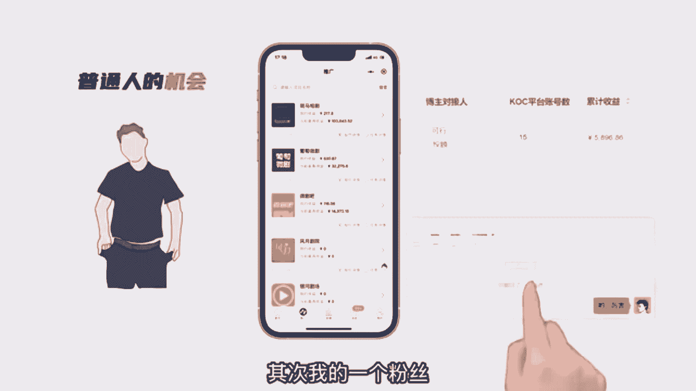
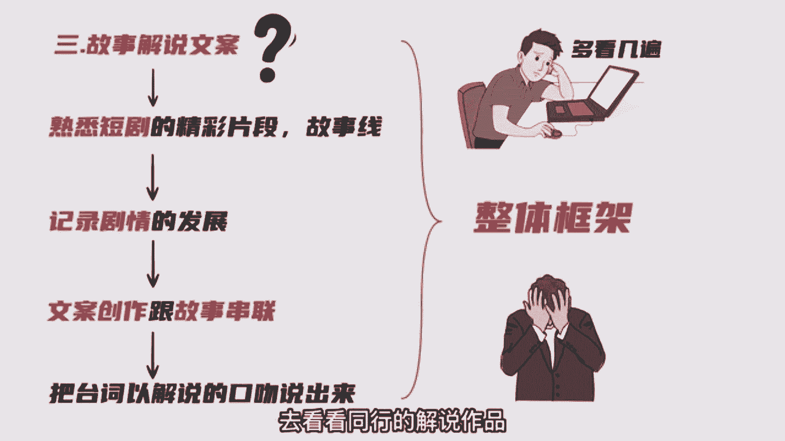

# 2024年做抖音怎么快速起号？3天养出一个高权重抖音账号，掌握这7点，抖音快速养号小技巧！【短剧推广】 - P3：短剧推广怎么做？短剧推广半个月时间变现6000核心玩法，短剧解说玩法拆解 - 我从山中来带着大宝剑 - BV1ZCtBeNE8r

短剧CP推广项目，依然是普通人，想在互联网上赚取第一桶金的最佳项目，因为我自己这边测试了一个星期，拿到了结果，其次我的一个粉丝。

半个月时间也变现了将近6000块，这个是我们内部的聊天截图，放大给大家看一下，证明我并不是毫无根据的张口就来，那关于短剧CP推广。

这期视频是给大伙拆解短剧CP推广的高阶玩法，短剧解说。

我特意去搜了不下几十个做短剧推广的账号，我发现变现能力强。

点赞量高的作品，大多数都是以短剧解说的形式在做，大家都在说短剧CP推广很卷了，那是因为混剪门槛低，所以会卷起来，而短剧解说的优势在于比短剧混剪的门槛要高，需要具备文案创作能力，相对于混剪来说。

竞争少不会太简，而且解说的方式还能大大提高视频原创度，影视解说大家应该都知道吧，短剧解说就是影视解说的缩小版，相比于影视解说要容易得多，那短句解说具体要怎么做呢，我们拿同行短剧解说的视频来现场拆解。

可以看出短剧解说一共是由四个部分组成，视频封面，视频原素材，故事解说文案，还有文案配音，先说第一个视频封面，每个视频的封面一定要统一体现专业性，最好把剧名也打出来，方便粉丝去看，关于视频素材。

拿到短剧授权分销的授权之后，渠道方会提供大把的高清素材供大家去剪辑。

完全不用担心，第四部分文案配音，这个没啥好说的。

市面上大把的配音软件，最难的其实就是第三部分解说文案的创作，那解说文案应该怎么写，首先你要耐心看完整个剧情，熟悉短剧的精彩片段和整个故事线，并做好笔记，先别急着写解说文案，如果看第一遍，对剧情还不熟悉。

就多看几遍，直到可以把每一个剧情的发展记录下来，再自己进行文案创作，跟故事串联，然后再通过剧中的台词去写剧本文案，简单来说就是把短剧中的台词，以解说的口吻说出来，当然时间有限，我只能拆解总体的解说框架。

但说起来容易，做起来难啊，刚做的时候，很多人可能会无从下手，这时候去看看同行的解说作品。

也许能给到你很好的灵感，甚至你可以按他们的思路去做解说创作。