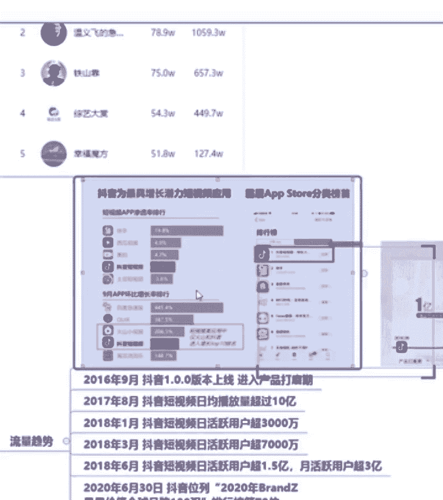

# 2024年做抖音怎么快速起号？3天养出一个高权重抖音账号，掌握这7点，抖音快速养号小技巧！【短剧推广】 - P5：1带你快速破解抖音商机密码 - 我从山中来带着大宝剑 - BV1ZCtBeNE8r

我给大家讲的一个是里面在上面的话，你可以找到很多，带大家快速破解抖音的一个商机密码啊，我知道有些同学呢之前啊之前可能听过一些啊，其他的课程啊，第一节课就会讲到定位，但是我先不讲这个，我想告诉大家。

你们要利用抖音挣钱，你们了解抖音吗，你们对于抖音的一个趋势，各位啊，大家平常应该每天啊，你们现在啊可以在评论区告诉老师一下，你们大概一天会花多长时间去刷抖音，告诉老师。

你们一天大概会花多长的时间去刷抖音，一天24小时啊，你每天会花到啊，30分钟，两个小时，一天啊，两个小时一个小时，好，嗯以前不刷，现在N多小时好，我没事就去知道好，我现在看到最少的啊。

最少的就是每天至少也会刷半个小时的抖音啊，至少也会刷半个小时的抖音啊，还有啊你只刷20分钟的啊，其实更少的啊，好那么你每天刷抖音，你有没有看到抖音的一个趋势呢，啊你看到抖音上啊，大家知道抖音很挣钱。

那么抖音为什么挣钱呢，抖音为什么能挣钱啊，好首先我今天这节课先不给大家讲定位啊，先不给大家讲定位，我就大家先了解一下抖音的一个趋势，抖音的一个趋势啊，相信大家都看到过啊，抖音现在是赚钱的风口啊。

一个短视频的风口，大家有没有听说过这种说法，就是抖音啊，现在就是一个红利风口啊，或者是一个赚钱风口，大家有没有听说过，就是很多公众号上啊，很多公众号上都会这么宣传，包括你们看一些抖音啊。

直播都会在这里说啊，甚至在网上呢还会有人这么告诉你啊，还会有人这么告诉你，就是啊08年啊，你错过了一个淘宝红利啊，10年错过微博红利，13年错过公众号哈，15年错过自媒体好。

2021年你还要错过抖音红利吗，好，这个呢，大家应该就是，如果说你平常啊在抖音上刷直播间啊，或者是刷视频刷的比较多，你们可能都看过这些啊，而他会用特别特别激动的语气跟你说好，那么这些是真的吗。

你真的就是现在之前的这些啊，比如说自媒体红利，你真的就错过了吗，我想告诉大家，你不要盲目的去相信抖音，直播间里面的一些主播的话啊，包括你们现在啊以及后续的课程中，不要盲目的去相信。

因为我知道大家平常刷抖音就会刷到一些主播，他就会在讲这些知识啊，当然老师之前也遇到过啊，很多同学他会从其他的一个直播间里面啊，或是从其他的一个抖音博主那里，转发一个视频给我，然后来问我老师。

他说的是真的吗，啊老师他说的这个有没有用啊，老师他说的这个真的是这样子的吗，就是会遇到很多这种问题，那么我们这些他们说的到底可信不可信啊，到底可信不可信，好，我想告诉大家，具体的还是要看数据。

数据才是最真实的啊，数据才是最真实的，人说的不一定都可信，那么数据才是最直观，那么其实除了抖音，我们还有一个和抖音齐名的快手，有同学现在在用快手的吗，有没有同学在做用快手的。

或者是说在抖音快手上都有发作品的，有没有都有是吧，那么为什么啊，为什么我们的短视频主要是讲抖音，而不讲快手啊，主要是讲抖音而不讲快手，那么快手他现在还有没有在可以做吗。

我可以很明确的告诉大家，你想做抖音可以，想做快手也可以啊，就是很多人他又想说老师我又想做抖音，又想做快手可以吗，我明确的告诉大家可以做啊，抖音和快手都可以做，而且我可还甚至更加明确的告诉大家。

你在快手上做这个流量更容易积累啊，流量更容易积累，但是啊快手有一个什么问题呢，啊有一个巨大的问题就是变现啊，现在变现的话还是需要依靠抖音，就是说你平常发一个视频，老师啊，我这个视频想发在抖音。

又想发在快手可以吗，我明确的告诉你可以，但是你想要变现的话，你还是得看抖音的啊，还是得看抖音，所以说在快手会出现一个什么问题，就是你的账号出不去啊，出不去，那么抖音呢抖音可以做吗啊，靠数据说话啊。

靠数据说话好，我给大家看一下啊，这个是今天下午的一个数据啊，今天下午的一个数据，就是这个数据呢变换的非常快啊，非常快，那么这个数据大概是我今天下午四点左右，看到的一个数据啊。

这个是抖音的一个带货播主榜啊，抖音带货播主榜好，前面是谁，我们都不看，我们就看最后这一栏销售额好，你们看清楚吗，这个销售额销售额这一栏啊，前面的都不管啊，前面的什么销量啊，这些都不用管。

你就看最后这个销售额，大家看一下这个数字，简直是大家不敢相信不敢相信的一个数字啊，非常巨额啊，巨额这个销售额是一个巨额数字啊，这个是一个带货主播主榜啊，带货播主榜好，那么除了这个呢。

还有一个抖音商品榜啊，抖音商品吧，那么其实抖音的商品啊，它其实是其实很接地气啊，没有大家想象的啊，就是非常多的那种奢侈奢侈品啊，其实不是的，它也有很多很接地气的，而且这种很接地气的东西。

它的一个销量包括销售额都是非常高的，非常高的，好，很卡吗，啊想问一下大家很卡吗，其他同学是我一直有看到啊，有同学在这里刷很卡啊，不卡是吧啊，声音声音有杂音吗，啊声音还好是吧。

好如果说有部分同学觉得很卡啊，你看一下是不是自己的网络啊，可以自己切换一下网络好吧，可以自己切换一下网络啊，因为老师这边应该是没有任何问题的啊，其他同学都告诉我了，没有问题好，那么这个抖音商品榜啊。

抖音商品榜其实都是一些非常接地气的啊，非常接地气的这些东西啊，甚至就是我们的一些日用品啊，就是我们的一些日用品就很接地气，但是它的销售额啊，以及它的一个销量，大家看都是数以万计的一个销量啊。

数以万计的一个销量好，最后还有一个呢就是一个涨粉排行榜，涨粉排行榜，所以大家很担心说啊，老师会不会涨粉很难啊，涨粉很难，你可以看到这个涨粉增量啊，就是这个粉丝增量。

可以看到他一次性涨粉也是数以万计的在涨粉，所以说大家觉得就是靠数据说话，把数据摆在大家面前才是最真实的啊，才是最真实的，就是数据是最直观，能够体现抖音这个平台的，很多同学刚在问说啊。

什么叫快手的账号做不出去啊，出不去，这是什么呢，你的流量可以积累，但是真的有流量就能变现吗，好其实我们想要变现需要考虑很多问题啊，想要变现考需要考虑很多问题，就是这个数据啊。

我们可以看到它是需要从三个维度去判断的，快手有什么好处，我告诉大家，如果说大家后续发作品啊，大家后续发作品嗯，基本上只要你的作品质量啊，基本上能够打60分的情况下，那么这个作品的一个播放量。

点赞量在快手肯定会比在抖音高，为什么这么说，因为抖音它这个平台对于作品的质量，其实要求会比快手更严格一些，那么你在快手流量来的更快，但是变现成问题啊，变现是一个问题。

因为他的流其实大部分啊就是短视频的流量，还是集中在抖音了，就算你在快手上能够迅速的积累流量，但是如果说啊这些流量的来源啊，就是比如说抖音用户和快手用户相比的话，快手用户的一个购买力。

其实它是比抖音用户要低很多的，所以说账号不出去啊，就是大家想要冲着变现，如果说你单纯的只为流量，不为变现的情况下，那老师绝对你去推荐你去做快手，但是我为什么说啊，大家一定要做抖音啊。

因为大家的终极目的是变现啊，变现的，如果说你只是为了集流量，那绝对可以就在快手发作品啊，但是你想要在抖音啊，既然你想要变现，那就一定要提升自己的作品质量，然后把作品发到抖音。

你啊抖音才是我们真正要进行一个变现的平台，好我们可以来看一下啊，就是判断红利的一个三个维度，首先第一点就是一个流量趋势啊，流量趋势，那么虽然老师刚刚说在快手上流量容易积累。

但是啊抖音上的流量也不容小觑，抖音绝对是短视频平台里面的顶流啊，顶流好，你做的那么很直观的数据可以看到啊。

这张图片啊，我给大家稍微放大一些些啊，稍微放大一些些。

和老师上号多久了，他好点进去，但是的呢抖音最初出来的时候啊，这个软件最开始出来的时候，它只能被称为一个最具增长潜力的一个，短视频应用软件，就是最开始的话，其实抖音的流量还比不上快手啊，比不上快手。

但是为什么。

现在啊现在刷快手的人其实会越来越少了，越来越少了，它其实就是在慢慢的上来了啊。

我们可以看到一个抖音流量的一个变化趋势啊，刚开始出来的时候就是16年啊，16年抖音16年出来的，他刚开始出来的时候，他的这个流量其实增长的很平缓啊，增长的很平缓，我们可以看到啊，这个线几乎趋于平直线啊。

它都没有垂直往上走，但是到后来啊，后来我们可以看到它是成一个啊，嗯垂直的上升啊，断崖式的在上升，所以说现在啊，现在抖音平台作为一个流量大户啊，流量大户，他的流量绝对不用大家担心啊，不用担心说啊。

我的作品发出去会不会都不够。

用户来看，绝对不存在这种问题啊，只要你的作品质量足够好好。

我们可以来看一下抖音的一个发展趋势啊，抖音的一个发展趋势好一个，这个是抖音近几年来啊，抖音近些年来它的一个发展趋势，首先啊16年这个啊抖音上市啊，抖音上就是这个版本上线啊上线，然后到17年8月。

然后短视频日均播放就超过十个亿了，就是它刚出来不到一年时间啊，将近一年的时间，他的一个日均播放量超过10亿，这个数字可以代表什么呢，它的流量就已经很高了，就已经很高了啊，好那么18年啊。

18年他的一个日活跃用户，就是一天的活跃用户就超过了3000万，这意味着什么呢，中国那个时候，至少已经有3000万用户在玩抖音了，好这是18年的数据，比较老了，好，我们可以看到最新的。

就是去年年底的一个数据啊，日活跃突破6亿好，那么这些数据给大家看到，都可能还会觉得很抽象，那么我们来看一下我们身边的一些啊，大家平常坐公交坐地铁啊，或者是坐火车坐高铁。

你的身边你是不是经常看到有人在刷抖音，告诉老师，你们平常啊，不管是坐公交坐地铁啊，或者是坐高铁坐火车啊，身边是不是大批的人都在刷抖音啊，基本上都是的，对不对，尤其是坐地铁的时候啊，我是坐地铁。

我看到最多的就是有人就低头在刷抖音的，那么这个现象说明什么，这个现象，就说明抖音这个平台流量是真的非常大啊，真的非常大，我可以告告诉大家，三岁小孩都会刷抖音，甚至七八十岁的人，甚至90岁高龄的老人。

他也会刷抖音，他的一个年龄跨度很广啊，人群也非常庞大，那么这些人群庞大，就足以证明抖音这个平台流量是足够的啊，流量是足够的，而且它的流量趋势一直是往上涨，它的这个流量是一直往上涨的。

不存在说什么时候进入到一个平台期，不动了，不存在它一直在往上走啊，一直在往上走，而且我们知道啊。

国家啊每一年人口都在不断上涨，那么就意味着玩抖音的人越来越多好。

那么流量真的就能变现吗，好我们判断红利有三个维度，第一个就是流量啊，第一个就是流量，那么流行快手的流量其实也还不错啊，也还不错，只是现在没有抖音那么高，那么为什么一定要着重强调抖音。

第二个就是一个人群画像的问题。

什么叫人群画像啊，就是想告诉大家，流量大并不意味着购买力强，这就需要第二维度的一个数据，好，我告诉大家一个嗯，现在啊，就是现在很明显能够看到抖音的一个趋势，抖音现在的一个趋势就是往电商方向走的。

就是你想要在抖音上变现，最快的一个方式就是带货啊，就是带货就我们可能会在网上看到啊，就是在抖音上刷到一些主播说啊，就是依靠抖音开直播嗯，挣了挣了多少钱啊，就很多很多钱，那么这很多很多钱。

他是依靠什么方式进行变现的啊，我告诉大家最最重要的一点就是带货，抖音现在往电商趋势走了，电商啊，电商大家都知道就是卖货的，那么抖音现在就是当你们听到一个啊某主播，或者在某个直播间里面听一个人说啊。

他的一个成长经历呢，就是说啊我怎么怎么样啊，开直播，然后变现多少多少，那么这些啊老师很直白的告诉你们，他就是依靠带货啊，带货就现就抖音的一个趋势啊，抖音的一个趋势。

所以说流量并不意味着购买力强，为什么要讲到这个购买力，因为抖音现在就是要带货啊。

要带货嗯，好我给大家讲抖音的一个用户群体啊。

用户群体主要是以女性为主，那么既然抖音要往带货的方向走。

大家想一下。