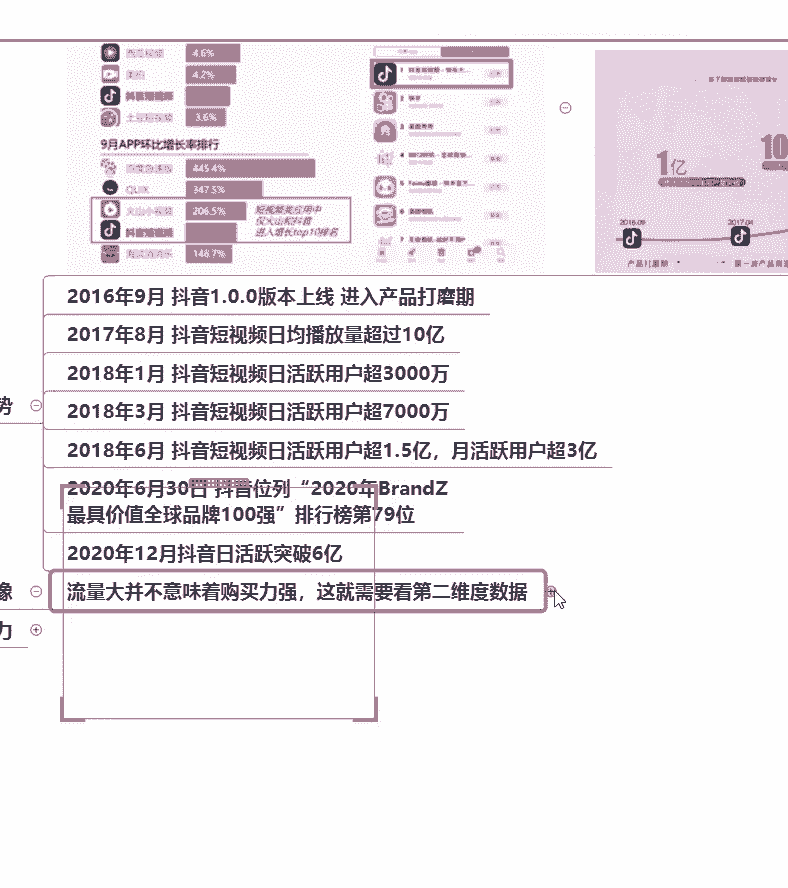
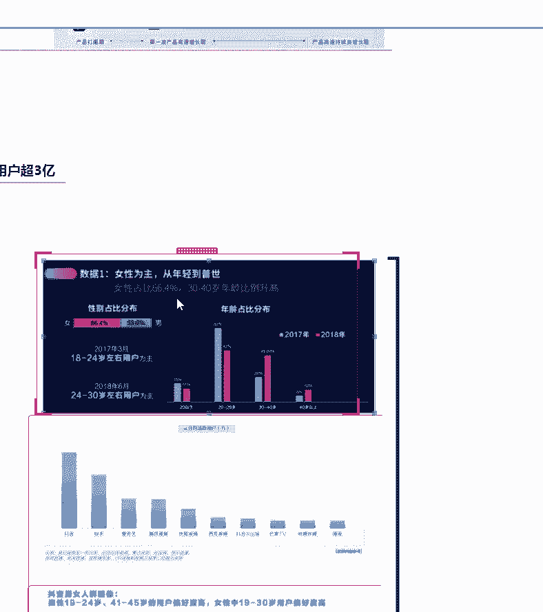

# 2024年做抖音怎么快速起号？3天养出一个高权重抖音账号，掌握这7点，抖音快速养号小技巧！【短剧推广】 - P6：2选择方向{一} - 我从山中来带着大宝剑 - BV1ZCtBeNE8r

抖音上的流量也不容小觑，抖音绝对是短视频平台里面的顶流啊，顶流好，那么很直观的数据可以看到啊。

这张图片啊我给大家稍微放大一些些啊，稍微放大一些些。

讲老师上号达到了有要求了，他好点进去，那是多少个人，抖音最初出来的时候啊，这个软件最开始出来的时候，它只能被称为一个最具增长潜力的一个，短视频应用软件，就是最开始的话，其实抖音的流量还比不上快手啊。

比不上快手，但是为什么现在啊，现在刷快手的人其实会越来越少了，越来越少了。

它其实就是在慢慢的上来了啊，我们可以看到一个抖音流量的一个变化趋势啊，刚开始出来的时候就是16年啊，16年抖音16年出来的，他刚开始出来的时候，他的这个流量其实增长的很平缓啊，增长的很平缓。

我们可以看到啊，这个线几乎趋于直线啊，它都没有垂直往上走，但是到后来啊，后来我们可以看到它是呈一个啊一个斜咳，垂直的上升啊，断崖式的在上升，所以说现在啊，现在抖音平台作为一个流量大户啊，流量大户。

他的流量绝对不用大家担心啊，不用担心说啊。

我的作品发出去会不会都不够，用户来看，绝对不存在这种问题啊。

只要你的作品质量足够好好，我们可以来看一下抖音的一个发展趋势啊，抖音的一个发展趋势好，这个是抖音近几年来啊，抖音近些年来它的一个发展趋势，首先啊16年这个啊抖音上市啊，抖音上就是这个版本上线啊上线。

然后到17年8月，然后短视频日均播放就超过十个亿了，就是它刚出来不到一年时间啊，将近一年的时间，他的一个日均播放量超过10亿，这个数字可以代表什么呢，它的流量就已经很高了，就已经很高了啊。

好那么18年啊，18年他的一个日活跃用户，就是一天的活跃用户就超过了3000万，这意味着什么呢，中国那个时候，至少已经有3000万用户在玩抖音了，好这是18年的数据，比较老了好，我们可以看到。

最新的就是去年年底的一个数据啊，日活跃突破6亿，好，那么这些数据给大家看到，都可能还会觉得很抽象，那么我们来看一下我们身边的一些啊，大家平常坐公交坐地铁啊，或者是坐火车坐高铁。

你的身边你是不是经常看到有人在刷抖音，告诉老师，你们平常啊，不管是坐公交坐地铁啊，或者是坐高铁坐火车啊，身边是不是大批的人都在刷抖音啊，基本上都是的，对不对，尤其是坐地铁的时候啊，我是坐地铁。

我看到最多的就是有人就低头在刷抖音的，那么这个现象说明什么，这个现象，就说明抖音这个平台流量是真的非常大啊，真的非常大，我可以告告诉大家，三岁小孩都会刷抖音啊，甚至七八十岁的人，甚至90岁高龄的老人。

他也会刷抖音，他的一个年龄跨度很广啊，人群也非常庞大，那么这些人群庞大，就足以证明抖音这个平台流量是足够的啊，流量是足够的，而且它的流量趋势一直是往上涨，它的这个流量是一直往上涨的。

不存在说什么时候进入到一个平台期，不动了，不存在它一直在往上走啊，一直在往上走。

而且我们知道啊，国家啊每一年人口都在不断上涨，那么就意味着玩抖音的人越来越多好。

那么流量真的就能变现吗，好我们判断红利有三个维度，第一个就是流量啊，第一个就是流量，那么快手的流量其实也还不错啊，也还不错，只是现在没有抖音那么高，那么为什么一定要着重强调抖音。

第二个就是一个人群画像的问题，什么叫人群画像啊，就是想告诉大家流量大并不意味着购买力强。

这就需要第二维度的一个数据，好，我告诉大家一个嗯，现在啊，就是现在很明显能够看到抖音的一个趋势，抖音现在的一个趋势就是往电商方向走的，就是你想要在抖音上变现最快的一个方式，就是带货啊。

就是带货就我们可能会在网上看到啊，就是在抖音上刷到一些主播说啊，就是依靠抖音开直播嗯，挣了挣了多少钱啊，就很多很多钱，那么这很多很多钱，它是依靠什么方式进行变现的啊，我告诉大家最最重要的一点就是带货。

就说抖音现在往电商趋势走了，电商啊电商大家都知道就是卖货的，那么抖音现在就是当你们听到一个啊某主播，或者在某个直播间里面听一个人说啊，他的一个成长经历呢，就是说啊我怎么怎么样啊，开直播。

然后变现多少多少，那么这些啊老师很直白的告诉你们，他就是依靠带货啊，带货就现就抖音的一个趋势啊，抖音的一个趋势，所以说流量并不意味着购买力强，为什么要讲到这个购买力。

因为抖音现在就是要带货啊，要带货嗯。

好我给大家讲抖音的一个用户群体啊，用户群体主要是以女性为主，那么既然抖音要往带货的方向走。

大家想一下，在你的家里面，谁是买东西买的最多的那个人，辛苦在你家里面谁是买东西买的最多的那个人，而且是网购，来我网购的时候啊，女人呵呵，我好，是的啊，就是这里以女性群体为主啊，我不是说男人不买东西啊。

我不是说男人不买东西，但是绝对是以女性群体玩买买主为多啊，就是比如说大家平常就嗯，618双11结束之后啊，你一到驿站去看啊，基本上大部分都是女孩子啊，或者是一些啊，就是女性群体都是在那里等着拿快递的啊。

一捧可能是十几个的那种，或者是你自己家里面你也看到了，网购最多的绝对是女士啊，女士包括老师自己本人啊，我作为一个女生的话。

我平常我也很喜欢买买买啊，就是这个带货绝对是以女性为主的。

而且她最开始啊，最开始持就是痴迷于这个网购的群体呢，他是比较年轻的啊，就是20岁到30岁这个一个群体，但是现在啊现在他的群体已经在啊，年龄比例在逐渐升高了，就是从30岁到40岁。

但是总体来说还是女性占比比较多啊，女性占比比较多，她占到了66。4%啊。

情况下个月呃卡了吗，这一个还用我说吗，卡了吗，你自己说没说没说好不卡是吧，好不卡就继续讲啊，所以说大家想要做这个抖音，其实你的大部分产品是要瞄准女性的啊，我很直白的跟大家讲。

你的大部分产品就是包括你后续想要带货，你的大部分产品是需要瞄准女性群体的，因为女性就是这个购买力最强的生物啊。

购买生力最强的好，那么除了这个呢。

嗯这张图片有一点点的一个模糊啊，还是想给大家看一下啊，就很多人说购物确实是以女性为主，那么我们都是在抖音上面购物吗，其实大家有没有发现，现在你们就是平常刷直播间啊，就女孩子刷直播间。

她非常喜欢看一些就是卖衣服的，或是卖护肤品的，因为很多时候呃那想既然购物，那为什么不去其他的一个专门购物的平台，比如说像淘宝或者是京东，或者是呃唯品会这些平台购物呢，为什么要选择在抖音上购物。

我很直观的告诉大家，就是大家现在有没有发现，就是现在的嗯职业女性，她其实每天啊朝九晚五，可能每天工作就很累了，她甚至都不会想要去逛街，那么他买衣服买护肤品，这些他基本上都是在网上解决。

那为什么选择了抖音啊，就是很多现在其实很多女性群体，她会在抖音上买衣服，买鞋子，这些就是因为抖音直播啊，抖音直播的话，衣服这些我可以直接看到上身效果，不知道大家有没有注意到，就是我可以看到诶。

他直播间里面的人，他把这件衣服穿在身上的一个效果，会比我在淘宝上只看到几张图片，效果会更好一些啊，效果会更好一些，所以说现在在抖音购物啊，现在抖音购物就是一个很普遍的一个趋势啊，很普遍的趋势。

包括护肤品这些啊，护肤品这些，你看你在淘宝上，你就你就只看到几张图片啊，你也不知道这个东西具体的一个使用步骤，但是你在抖音直播间里面你就能够看到诶，人家是怎么用的，怎么用这个东西才是一个正确的使用方式。

就是人家会通过直播的形式告诉你，它的一个使用方法，所以说现在的人更加倾向于，通过抖音直播间去购买商品啊，通过抖音直播间购买商品，因为我可以看到这个商品的一个使用过程啊，以及它就是像衣服，鞋子子。

包包这些东西，我就能够看到他的一个上身效果，这样子的话肯定会比一些购物平台啊，像唯品会像淘宝这些平台就是更加清晰啊，因为那些平台能够提供给你的，可能就是一个短短的啊，甚至是就是说呃有一些商品呢。

他会给你提供到一个几秒的一个视频，但是非常短啊，非常短，然后大部分基本上就只给你提供一些图片，那你其实根本是看不到他真实的一个，上身效果的，而且还会出现一种什么情况呢，大家就是如果说你在淘宝上购物。

比较多的情况下啊，你就会发现诶，你在图片上看到的这个版型，和你买回来的版型完全不一样啊，都会出现这种情况，但是一般在抖音直播间不会出现这种情况，就他上身是什么效果，然后最后啊最后你买回来的效果。

基本上跟你在直播间看到的是没有太大差别的，所以说这就是为什么现在的啊年轻女性，她都比较倾向于在抖音直播间去购买商品啊，好那么除了这个之外呢。

再来讲一下一个啊人群画像啊，一个人群画像，所谓人群画像呢就是不同年龄阶段的人，他在抖音上对什么比较感兴趣啊，对什么比较感兴趣好，首先第一个就是零零后啊，瞄准抖音最年轻的用户群体就是零零后啊。

因为现在零零后的话也已经20多岁了，最老的一批零零后啊，就已经20几岁了，然后其次就是一个九五后，那么九五后啊，就是零零后和九五后，他们的一个喜好其实是差不多的啊，一个时尚穿搭啊，穿搭类的视频啊。

会比较就偏好度会比较高哈，如果说啊，如果说你的账号想要瞄准一个年龄阶段，一个年龄群体的话，那你就看清楚啊，这个年龄画像，就是这个是用户的一个年龄画像啊，好比如说你是一个啊，就是你的对账号啊。

你的作品你后续想要带货，你想要瞄准的一个年龄群体是零零后的话，那你首先前面就想好自己的账号，要分享哪些内容啊，他比较偏好一些时尚穿搭啊，穿搭类的视频，那么你就要投其所好啊，投其所好好。

那么除了这个之外呢，就是九零后啊，九零后啊，他是对影视，母婴以及美食类的视频偏好都比较高，如果说你的作品啊，你的账号后续想要瞄准的一个对象，是九零后的话，那你就主要去啊供这个影视或者是母婴。

或者是美食类啊，美食类好以及八零后啊，如果说你的账号想要瞄准八零后的话，他就是对汽车母婴每是比较感兴趣，还有一个就是七五后啊，以及一个六零后，那么总的来说啊，总的来说现在是哪几个年龄群体的用户最多呢。

九五后，九零后和八零后啊，这几个年龄阶段的用户群体是最多的啊，最多的肚子饿，那么像六零后和七五后啊，可能就会稍微的嗯，这个用户人群会稍微少那么一点点啊，稍微少那么一点点，但是其实也还是比较多。

然后再讲一个就是关于六零后和七五后，他不是对这个音乐啊，这个还有一个汽车舞蹈类这个视频，这个偏好度比较高的话，那么音乐啊，如果说你想要做一个音乐账号，并且是瞄准这一个年龄阶段的人的话，那么你要注意。

你选择的音乐，肯定是要符合这个年龄阶段的一个音乐啊，就是我知道，如果说有些同学后续想要做一个，分享音乐的账号的情况下啊，那你就要瞄准这个年龄阶段，他喜欢哪一个类型的音乐啊，包括舞蹈以及生活用品。

那么其实是生活用品这一类，不仅仅是六零后啊，我觉得生活用品的话，他其实七五后啊，八零后他其实对生活用品，就是我们生活中经常用到的一些小工具啊，就是尤其是大家平常刷抖音。

应该也能经常刷到的一些实用的小工具啊，就是比如说打扫卫生需要用到的，或者是在厨房里面需要用到的一些东西啊，就是大家平常在刷抖音，你经常能够看到的这些，他瞄准的一个用户群体啊。

那么如果说你去瞄准了一个群体啊，年龄群体他是在零零后的话，就不建议去分享一些什么生活用品类的作品啊，我跟大家强调一下，因为很显然零零后他对于生活用品这一类，他其实并不是很在乎，不知道大家有没有注意啊。

如果说你瞄准的一个人群群体是零零后，但是你的作品基本上都是分享的一些啊，比如说厨房好物呀，或者是一些家居好物的话，那么很显然你瞄准的群体就错了啊，所以说这个老师列出来的这些呢，他也只是部分啊。

不是说我列这个出来，就说九零后只对影视啊，母婴美食这一类比较感兴趣，那很有他可能也对其他感兴趣啊，比如说健身啊，或者是情感啊，他也有可能对这些感兴趣啊，我的这个只是说大数据显示。

大部分的这个年龄阶段的人，对这一类的视频比较感兴趣，好吧，这么说大家能够理解吧，这么说大家可以理解吧，就是我列举出来的这些只是说这个年龄阶段啊，对这个感兴趣的用户群体会大一些啊，量大一些好吧咳好。

能理解就给老师扣个一好吧，能理解就给老师扣个一啊，我这个大家也可以截图啊，其实这个东西对大家以后定位，也是一个非常有好处的啊，就是你知道一个年龄群体的一个画像之后，其实对大家以后定位也是有好处的。

好大家都能理解，我们就来讲下一块啊，下一块好，那么刚刚讲的是判断红利的第二维度啊，第二维度数据，第二维度的话主要就是一个人群画像啊，一个人群画像，那么第三维度的话就是变现能力啊，大家最关心的一个变现好。

那么变现的话其实大家有没有注意到。

这些年其实经常会出现一些所谓的网红产品。

大家有没有听说过网红产品，你们听说过吗。

