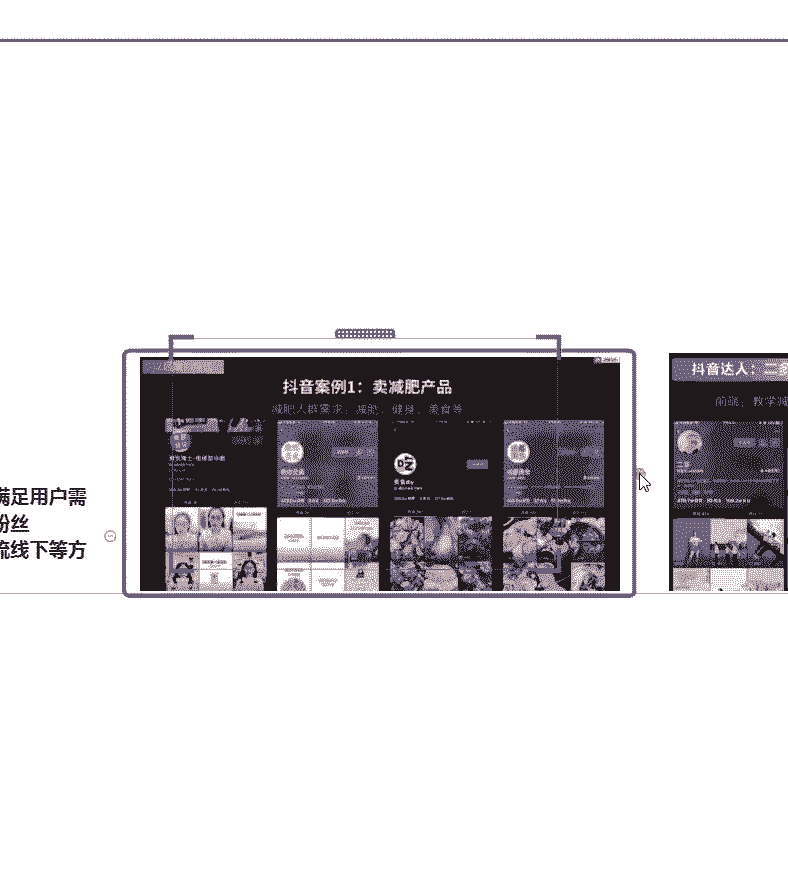

# 2024年做抖音怎么快速起号？3天养出一个高权重抖音账号，掌握这7点，抖音快速养号小技巧！【短剧推广】 - P7：3选择方向{二} - 我从山中来带着大宝剑 - BV1ZCtBeNE8r

是经常啊经常就是可能在抖音上啊，或者是在其他的一些短视频平台上啊，就会看到一些网红产品，那么他们是如何成为网红的啊，他们怎么变成他们怎么就变成网红产品了呢，感觉就很普通呀，感觉就很一般呢。

为什么成了网红产品啊，其实很多产品都是在抖音上火起来的啊，在抖音上火起来的，就比如说嗯前两年啊，前两年小猪佩奇啊，小猪佩奇这个动画片，不知道大家有没有就是有去看过，或者是有听说过啊，小猪佩奇这个。

那么那一段时间啊，这个漫画出来之后啊，这个动画片出来之后呢，小猪佩奇的手表突然就火了，小猪佩奇的这个手表啊，突然一下子就火了，就是因为这个啊动画片出来了之后，很多小孩子啊，甚至就是尤其是他们是发现。

就是尤其是一些小孩子，他可以看这个小猪佩奇看的目不转睛啊，然后很多人就觉得这个小猪佩奇挺可爱的，那一段时间啊，这个小猪佩奇的手表就非常火啊，网红产品，其实就是因为可能是被其他东西带动的。

也有可能是其他的原因啊，还有一个就是一个这个兔子耳朵啊，我不知道大家有没有见过啊，这个兔耳朵对，这是一个毛茸茸的一个兔耳朵，就是我去摁下面，然后那个耳朵可以竖起来的这种，他也是在抖音上。

就是因为有一个网红啊，他拍视频的时候用到了这个道具之后呢，这个产品啊，因为他的这个视频成为一个爆款之后，这个产品它也成为了一个爆款啊，很多的网红产品它其实就是在抖音上抖火的啊。

就是在抖音上抖火的这个兔子耳朵啊，就是之前也有很多啊，包括在其他平台上啊，就是比如说你在淘宝上，也能够又搜到这个兔子耳朵，就是去摁下面，然后那个耳朵可以竖起来的这种啊，很多很多除了这个之外呢。

还有很多啊，就是这种产品，其实它刚开始就一开始这个产品生产出来，就是网红产品吗，显然不是，它其实就是被一两个网红把它带火的啊，它就变成全网火，他就是一个网红产品，但是从网红把他带起来了。

它就变成了网红产品啊，就是这样子的，那么这些产品啊，这些产品的一个引力是非常非常棒的啊，抖音的一个带货王啊，一个，首先第一个就是一个小猪佩奇的一个手表啊，还有这个会动的兔耳朵等等啊等等，就是很多产品嗯。

包括你们现在啊，现在就是在抖音上看到的一些东西，他有时候可能就在，大家觉得他怎么莫名其妙的就火了，其实就是因为有一些网红啊，有一些网红去带动了这些产品，它就火起来了，就是在抖音上啊。

就这些商品其实就是在抖音上被抖火的。

被抖火的咳，那么整体来说啊。

整体来说嗯一个抖音啊，他就是一个流量趋势，人群画像以及一个变现的能力。

那么短视频流量是不断在扩大的啊，不断在扩大的，如果说大家平常你们就是有去一些，非常非常有名的一些旅游景点，或者是一些网红的店铺啊，不管是咖啡厅饭嗯，就是餐馆或者是一些那种街头小店。

就是你经常去这种地方的话，你会看到很多啊，大批量的一些就是网红啊，或者是说一些自媒体从业者，他就会在那种地方拍视频啊，拍视频就是越来越多的自媒体从业者，在那些地方拍视频，那么这样子的话。

其实就意味着，这个流量趋势是整体在往上走的啊。

整体在往上走的，而且咳任务目标不在这个人群。

画像主要是以高消费的年轻女性为主啊，以年轻女性为主，还是再强调一下，就是这个抖音的大部分消费者都是女性，就是你做任何产品，其实嗯需要浏览里面瞄准的一个人群，就是女性啊，瞄准的一个人群就是女性。

当然也有男性啊，但是就是会稍微少一些，所以说大家就是包括后续就是你要定位领域啊，包括你后面要带货，你要瞄准的一个人群。

必须先把他瞄准啊，那么除了就是很多人，包括我刚刚有看到有同学说嗯，老师我没有货源怎么带货啊，这个问题其实我后面的课程都会有讲到啊，就是你没有货源怎么带货，嗯大家想一下嗯，我们在抖音上啊，或者是在快手上。

甚至在其他平台上，你们是不是看到很多很多很多的带货主播，数不胜数的带货主播啊，可能随便刷一个啊，就是今晚直播带货什么什么东西，就是你可以看到很多啊，甚至有一些呃他会代言一些奢侈品牌。

他会在他的直播间代这些奢侈品牌，那他真的是有这个货源吗，其实我告诉大家很多人啊，我甚至可以说是大部分的人，他自己根本就没有货源，但他如何实现带货的，这个后面的课程都会一一讲解到啊。

一一讲解到就是你没有货源的情况下，应该怎么去带货啊，没有货源的情况下应该怎么带货，我有货源，但是我没有办法上商品链接的时候，我又应该怎么带货，这个在后续的课程全部都会讲解到的啊，全部都会讲解到的话。

嗯很卡吗，还有这个话题不要什么不要这个很卡吗，和这个话题没有关系啊，如果啊不卡是吧，就是嗯声音声音有杂音吗，因为我其实今天这个麦克风我有点担心啊，啊不卡是吧，好咳可以啊，上面好不卡就好啊，不卡就好。

那么其实变现的方式多种多样啊，变现的方式多种多样，那么像带货其实只是其中一种啊，我们包括后面也会讲到，比如说啊引流就是引流到微信啊，引流到微信，就是很多同学，其实呃老师之前也遇到过很多的学员啊。

他们有告诉我老师，那我自家的土特产我怎么带呢，啊老师我又没有淘宝店铺，没法上商品链接啊，我的商品怎么卖出去呢，啊就是有些同学在担心没有货源无法带货，那么有些同学又在担心我有货源，我也没有办法带货啊。

这些问题在后面的课程中都会给大家一一讲解，就是非常详细的去说啊，如果说我现在就是用一两句话说了，其实等于白说，因为你们也听不明白具体应该怎么去操作，那么我就把它专门放到后面的课程去讲解啊。

今天这节课主要给大家讲一讲，抖音的一个趋势啊，抖音的一个趋势好变现啊，变现是我们的终极目的，所以说这个是非常重要的。

那么最后再讲一下啊，我们的一个课程问题啊，一个课程首先啊这个课程的话啊。

说什么前后端思维的话，大家可能会觉得啊比较比较难啊。

我想现在先送大家两句话啊，先送大家两句话，第一句话是工欲善其事啊，那我应该不用去其他必先利其器，所以说啊，所以同学们一定要记住这个东西来好，这是第一句话啊，第二句话，磨刀不误砍柴工啊，比如有定制啊是吧。

这句话音乐啊，好这两句话啊，这两句话我希望大家可以牢牢的记住，为什么这么说呢，第一句话的意思就是说你想要做成一件事情，那你必须先打磨好你的工具啊，你必须先把你的工具打磨好。

那么第二句话相信大家平常也经常有听到过，就是磨刀不误砍柴工好，我知道很多同学说啊，老师我是要来变现的，我不是想要听你扯这些乱七八糟的，你今天说的什么呀，又没有教我变现啊，我知道很多同学都会有这种疑惑。

但是这两句话送给大家是什么意思呢，就是我希望告诉大家，任何事情都是需要有一个过程的啊，就像我告诉大家，你要从一楼到十楼，是你心里一直想着我要去十楼就能上去的吗，你是不是要通过爬楼梯或者是坐电梯的方式。

才能上去，那么这个楼梯或者是这个电梯，它其实就是我们的一个工具啊，它其实就是我们的一个工具，所以说我们必须先有工具才能够达到目的，如果说你什么都不具备啊，你现在上来就说老师我不想听你说这些啊。

你就直接告诉我怎么变现，那么这个其实告诉大家不现实啊，你都没有知道啊，那我现在先问大家，你确定好自己要做什么了吗，你知道怎么去剪辑视频吗，发布作品需要注意哪些事情。

我的账号应该如何搭建抖音的推荐机制是什么，好我现在说这一堆啊，好你完全整个人都懵掉了，那如果说在我们对于这些事情，都不了解的情况下，我们是不是需要先把这些了解清楚了之后。

再去慢慢地推进到变现这一个事情呢，啊所以说我希望大家就是嗯我知道很多同学啊，听了一两节课之后，就说这个老师怎么这么啰嗦啊，乐多老师怎么这么啰嗦，为什么还不教我变现，我想告诉大家。

前面的准备工作是非常有必要的啊，前面的准备工作是非常有必要的，大家想一下，你要去砍柴啊，就是用这个这句话来做一个例子，你要去砍柴，你都没有刀，你怎么砍啊，你最终的目的是要把这个柴砍下来扛回家。

但是你都没有刀啊，或者是你的刀非常钝，那你怎么把这个财扛回家呢，所以我前面就讲到的所有的课程内容啊，都是为了大家能够更好的变现啊，我们一定要把基础打牢啊，我一定要把基础打，我知道大家都是嗯小白啊。

对于抖音可能很多都不懂啊，就甚至连最基本的一个，我在抖音上面应该怎么发作品，才能够让我的作品能够得到最好的一个推荐，可能这个大家都不知道啊，所以说我们才要从课程里面，一步一个脚印往前走啊，走踏实了。

最后变现才来的比较简单啊，如果说你前面就想着啊，我就是要变现啊，每天你默念100遍变现，但是你不去学习这些基础课程都是没有用的啊，我可以很直白的告诉大家啊，很直白的告诉大家。

你如果说这些基础课程都不学习，你就只想做车啊，每天默念，哪怕你念1000遍，念1万遍，你都没有办法变现啊，就很直白很现实，所以说基础一定要打牢啊，基础一定要打牢好。

那么刚开始呢给大家看到一个前后端思维啊，那么这个前后端思维呢。

其实嗯对于大家来讲的话，可能就会觉得不好理解啊，我给大家举两个实际的例子啊，剪两个非常嗯接地气一点的，就是我知道就是嗯有些同学啊，他可能说老师我想在抖音上卖某个产品啊。

我的终极目标就是要在抖音上卖一个产品，那么我应该怎么去操作好，我先给大家举一个非常简单的例子啊，假设我现在是一个啊卖减肥药的啊，或是卖减肥产品的好，我现在明确告诉大家，减肥这两个字在抖音上是严令禁止的。

但是我手上就只有减肥这个产品，而且我一定要卖这个产品，我要怎么去操作啊，举例子，首先第一点你要卖减肥产品，但抖音不能说减肥，那么你就在抖音上，分享一些其他的关于减肥的内容，比如说现在减肥有很多种方式啊。

运动减脂餐啊，或者是这两个相结合，光是运动这一项就可以做很多视频啊，告诉大家你们应该平常在抖音上啊，在抖音上应该也有人，看到很多一些关于一些博主，他就是分享啊怎么去减肥啊。

嗯怎么瘦这个地方怎么健康的瘦啊，或者是做一些减脂餐啊，分享一些减脂餐，我应该怎么去吃，搭配什么样的运动，这些内容足以让你分享很多很多的视频了，那很多同学就说，那我分享这些视频有什么用呢。

我还是卖不出去我的产品好，那我告诉大家，你分享的一些关于去做减脂餐的，或者是做一些减肥运动的视频，你是想吸引什么人群来看你的作品，告诉老师，你分享啊运动减肥或者是减脂餐的这种视频。

你是想吸引需要减肥的人群吧，啊你不是想吸引一个瘦子来看的吧，你是想吸引一个啊可能需要减肥的，或者是对于自己的身材，可能有那么一点点焦虑的，你是想吸引到这一部分的人群来看。

那么吸引到这一部分人群来看的时候，他们就很有可能成为你商品的用户啊，你的作品既然不能够直接卖，我就把它引流啊，啊我可以把他引流到微信上面去，比如说啊我就是要卖减肥产品的，然后你发了几个视频。

都是关于一些减肥健身的，以及吃一些减脂餐的，然后吸引到一定的用户群体的时候，你可以去私信他们，或者是在评论区里面告诉他们啊，我可以在微信里面告诉你，更多的一些减肥的知识啊，或者是说我可以就加微信。

然后给你分享更多的一些内容，因为抖音平台它禁止聊减肥这些东西，那么我可以通过微信的方式啊，你就可以通过直接去私信你的粉丝，然后加微信，你加上他们的微信，其实就相当于引流到微信了啊，相当于引流到微信了。

好那么这个过程我想要告诉大家，不是说你发一两个视频就可以去做了，这个必须积累一个时间啊，积累一段时间，就是很多同学就说那老师我着急呀，啊我有我有点焦虑啊，我的东西卖不出去啊，你又让我在抖音慢慢发视频。

但是我想告诉大家，这是必须付出的啊，必须付出的，如果说你的账号才发一两个视频，你就着急，把所有的用户引流到你的微信上面的话，会出现一个什么后果呢，别人就会觉得他这就是一个打广告的账号啊。

他就是想要把我们去加他的微信，然后他天天在他的微信上面打广告，那么这样子的话就会得不偿失啊，所以说大家如果说真的想要啊打广告，而且你的这个粉丝群体比较多的情况下，就是我们其实也能看到一些。

比如说有几10万啊，甚至上百万的一些粉丝账号，他会直接把他的微信放在他的个人主页，但是大家在做账号的前期，我都不建议大家这么做啊，不管你有再好的产品，我都不建议大家这么做，为什么呢。

因为你刚开始这么做啊，平台会检测到他，就会觉得你是一个广告营销号啊，这样是不允许的，但是当你的账号有了流量粉丝的基础之后呢，你就可以了啊，你就可以把你的微信挂在你的个人主页，让别人来加你的啊。

加你的微信，那么在最开始啊，可能你的粉丝只有几1000个的情况下，那我怎么办呢，我可以通过去私信你的粉丝啊，就是我直接私信他啊，你对这个东西想要了解更多吗，可以加微信啊，详细的聊一聊，这些都是可以的。

只要加上微信就是引流成功啊，好那么除了这个之外呢，我知道有些同学呢，可能啊我不一一定是卖减肥产品的，那我要卖其他呢，比如说啊卖点水果呀，或者是卖点农家土特产啊，那这个抖音总不会禁止我了吧。

好那么这个时候又会遇到一种什么情况，很多卖水果的人，你有商品链接吗，就比如说我们网购的时候，就会存在有一个商品链接的情况，那么很多啊，比如说自己家里有果园啊，或者是自己家里专门生产一些土特产的。

这个时候老师问你一句，你有商品链接吗，好你整个人都懵掉了啊，老师什么是商品链接，那边是我有商品就会有商品链接吗，商品链接去哪里做啊，很多人可能就会有这种疑惑，但是我告诉大家，你没有网店的情况下。

你是没有商品链接的，那这个时候你要怎么卖你的商品，还是刚刚老师说的，直接引流到微信啊，直接引流到微信，所以说好老师虽然最开始是用这个减肥产品啊，举个例子，但是其他产品在你有产品。

但是没有商品链接的情况下，你也可以把它引流到微信，然后去售卖你的商品啊，售卖你的商品好，有增肥药吗，这个同学你有点拉仇恨了啊，有点拉仇恨了，好多人都想要减肥，你来问一句，有增肥药吗啊。

这个其实就是我们变现最直观的一个啊，就是你前面这段时间发作品的话，肯定是看不到什么收益的，你只有成功的把用户引流到微信之后，你才能够更好的去售卖你的商品啊，这个不仅仅只是针对老师刚刚说的，这个减肥药啊。

其实还有很多啊，还有很多啊，好甚至啊甚至我告诉大家，尤其是一些做美食的店铺，你还可以直接在线下和粉丝见面啊，就是嗯有比如说家里开饭店的之类的，或者是说啊开餐馆之类的啊，像这种的话，像这种账号。

你想要做给自己的店铺打广告的话，你其实可以到后期啊，可以把它做成企业号，然后你可以吸引同城的粉粉丝，直接到你的店铺来进行消费，也是可以的啊，我们可以线上引流，也可以从线上引流到线下，这些都是可以的啊。

都是可以的，这个时候你的销就是你的这个粉丝，他就会成为你的一个变现的方式啊，变现的方式，养生馆啊，养生馆一样的啊，但是嗯强调一下，就是现在很多一些养生馆的这个营业执照的话，嗯抖音是不批的啊。

就是他会审核不通过啊，会审核不通过，因为抖音这一块的话，它对于养生啊，减肥啊这些啊，或者是一些治疗疾病的，他审核的特别严格，特别严格，可能说如果你直接用一个养生馆的营营业执照，去申请这个企业账号的话。

可能会不成功啊，可能会不成功啊，这个还是想提前跟大家说清楚啊，提前跟大家说清楚好咳，那么这个啊这个就是我刚举的这个例子啊，就是简而言之，大概就是这么两句话啊，第一句就是前端通过提供有价值的优质内容。

所谓这个过程就是我刚刚说的，你可以直接在抖音上发布一些优质的作品啊，我要吸引什么群体，我就发什么类型的作品去吸引这一部分人啊，然后首先你要先给到用户一些甜头，就是你的作品一定要给用户提供一些价值。

就比如说我要销售减肥产品，那我提供出来的视频，我分享的内容肯定是对减肥有用的内容啊，肯定要提供这些内容，然后才能够吸引到相应的粉丝啊，吸引到一定的粉丝之后，这些用户变成你的粉丝之后。

然后你后面再通过加他们的微信啊，引流到微信的方式去进行变现啊，引流到微信去进行变现，这样子的话就避免了我在抖音上卖减肥产品。

会导致账号违规啊，好那么很多啊。

就是你看抖音一个案例啊，一个卖减肥产品的，就是老师刚刚讲的这个啊。

第二个就是一个嗯，拜拜吧，还有还记得拿我发。

记得第二个就是卖一些美妆产品的啊，卖美妆产品的就是很多，很多人呢可能自己有一些货源啊，就是一些呃微商品牌啊，就是我知道的，现在有很多的微商品牌，它其实做的也还不错啊，做的也还不错。

但是呢我又没有线上的一个店铺，我就没有办法直接在抖音卖我的商品的时候，我就可以把它引流到线下啊，引流到线下去售卖，就是把或者是把它引流到微信上都是可以的，如果说你有实体店铺的情况下。

你可以把同城的粉丝引流到线下，如果说没有。

