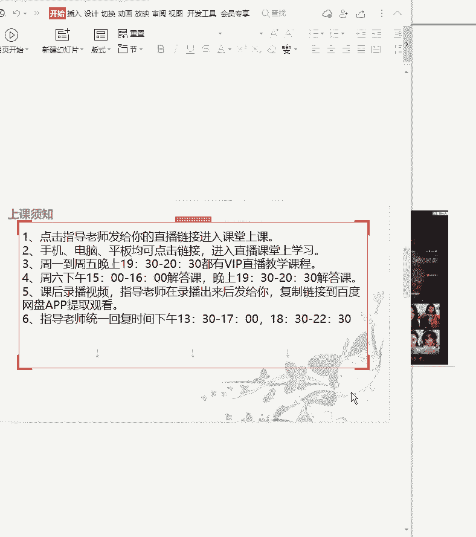
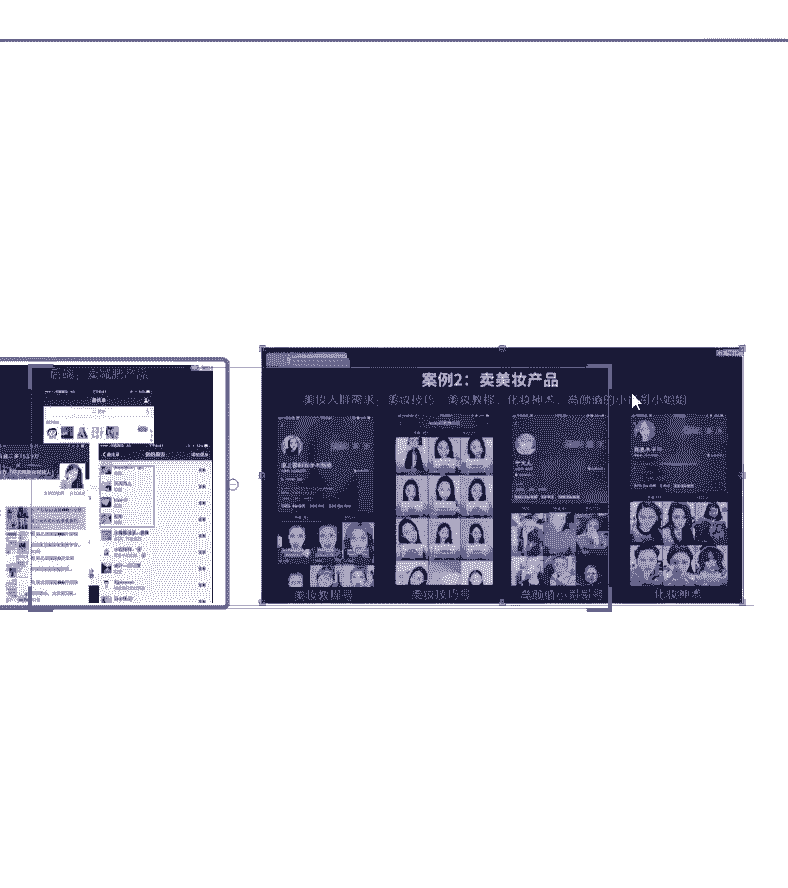
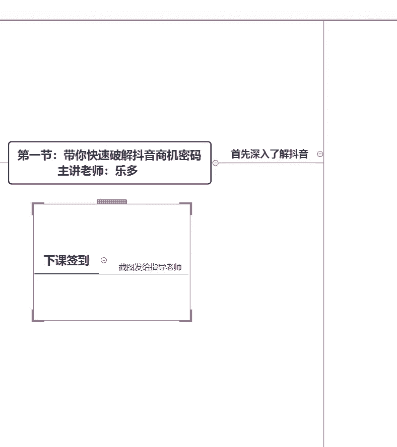

# 2024年做抖音怎么快速起号？3天养出一个高权重抖音账号，掌握这7点，抖音快速养号小技巧！【短剧推广】 - P8：4选择方向{三} - 我从山中来带着大宝剑 - BV1ZCtBeNE8r

那你就把他们引流到微信都是可以的啊，都是可以的，好嗯看到评论区有人问啊，悟空能卖吗，嗯首先强调一点啊，在抖音上所有的活物啊，活物是严禁就是买卖了就动物啊，活的严禁买卖好吧嗯不要说什么蜈蚣之类的。

还有药品啊，药品在抖音上也是严令禁止的啊，嗯如果说同学有需要的话，后续啊，我这边我记得，就是有一份抖音的禁售商品类目啊，这个后续可以分享给大家啊，可以分享给大家，就是说在抖音上。

哪些东西是绝对不允许售卖的啊，绝对不允许售卖的，当然也还有一些就是比如说啊不推荐的啊，不符合平台的一个调性的，这些嗯不能卖的东西全部都有真理啊，全部都有专利嗯，这个嗯后续啊后续都会跟大家分享到啊。

都会跟大家分享到呃，因为我们的课程呢，主要就是针对一些比较热门的内容去进行，讲解的啊，因为抖音的知识的话真的是非常非常的多，那么今天呢主要就是给大家分享一下，就是关于抖音的一个发展趋势啊。

就是很多同学就比较排斥，就是说啊老师我不想带货，但是我还是很明确的告诉大家，带货是抖音的一个趋势啊，你后续不管你是开直播带货还是通过嗯，开商品橱窗带货等等，这些就带货都是一个趋势，就希望大家能够接受啊。

这个确实是抖音发展的，既然我们想要乘上抖音这条大船去变现，那么我们首先就要顺从抖音的一个方向啊，顺从抖音的一个方向，没有没有好嗯，烟酒一类啊，烟酒这一类好像也是不能够在抖音上售卖的啊。

如果说你自己有烟酒的话，嗯你可以就是把它想办法引流啊，引流到微信去进行售卖啊，引流到微信去收，而且烟的话一般是啊管控的比较严格的啊，酒的话稍微还好一些些，烟的话基本上是啊不行的啊，烟基本上不行。

那么九的话就需要进行引流啊，对网上是绝对不能够呃买烟的啊，就是酒，我们可以就是嗯通过引流的方式，引流到微信去进行售卖啊，好嗯今天的一个课堂啊，主要就是给大家分享，就是关于抖音的发展趋势啊。

抖音的一个趋势，以及我们需要瞄准哪些人群，那么后续啊下一节课就会跟大家讲到，我应该如何去定位啊，就是你的账号啊，你的账号应该怎么去定位，那么今天这节课啊，既然大家今天第一天参加学习呢。

我就先不给大家做布置作业了啊，今天让家大家先轻松一下啊，今天先轻松一下，把觉得啊以后上完课可能需要做的事情，今天晚上先尽情的享受个够啊，如果说平常刷抖音刷比较少的同学呢。

我还是稍微建议大家就是尽可能的多去刷啊，就是如果说你一天只能刷20分钟的抖音的话，个人觉得这个时间还是短了一些啊，就是一天的话，我觉得至少要保持一个小时左右啊，至少保持一个小时左右，如果说你觉得嗯。

就每天刷抖音的时间比较少的话，就是尽可能的用一些零散的时间去刷，也可以的啊，比如说坐公交的时候啊，坐地铁的时候就是有空的话可以多去刷刷抖音，因为抖音上啊就是可能你注意不到的点。

其实他可能就是这个作品的一个爆点，亮点都是有可能的啊，就是大家以后去刷抖音，就是我后续告诉大家，你应该怎么正确的刷抖音啊，就是我其实知道很多同学刷抖音，就是看看视频就没了啊，这个视频嗯我觉得好看。

看完刷走啊，这个视频我觉得好看，我就把它刷走了，那么大家有没有想过这个视频为什么好看呢，你为什么会停下来把这个视频看完呢，啊所以说就大家就要注意啊，大家要注意就是以后呢你刷抖音。

尤其是嗯下一节课讲到定位领域之后啊，定位领域之后你应该怎么认真啊，正确的去刷抖音啊，这个我在课堂上都会有详细讲解啊，就是我不是说你们之前刷抖音的方式是错误的，但是你们之前刷抖音的方式呢。

可能还需要有那么一点点改进啊，还需要有那么一点点改进，就是对大家就是说啊喜欢看就看，但是它为什么吸引你呢，是哪里吸引了你呢，是哪个方面让你觉得诶，这个东西值得你停下来看，大家有没有反思过啊。

就今天你们回去刷抖音的时候，你其实就可以认真看一下诶，这个视频，我为什么停止下来，认真看他了，他是哪个地方吸引了我，他除了这个地方，他其他地方做的怎么样呢，啊这个视频你可以从多个维度去进行分析。

每一个作品的啊，就是我希望大家都要具备这个能力，就是为什么这个作品能够吸引你，为什么啊，就是有些作品他的点赞量能够达到几10万，上百万，这个作品为什么会成为爆款，就是我希望就是学习了我们的课程之后啊。

当然这个能力不是说一天两天就能够具备的，但是我们可以通过慢慢的去培养，当你学会了这些之后，你就会发现你自己做作品起来会要简单很多，为什么呢，你知道了哪些方面才能够留住用户啊。

就比如说一个点赞量都有几百万的一个作品，我很明确的告诉大家，这个作品的播放量肯定就上千万了啊，所以说为什么别人的作品，能获得这么高的点赞量啊，一个评论量以及转发量，那么这个作品到底是哪里优质。

到底是哪里好，到底是哪里吸引人，能够得到这么多的点赞，所以说嗯希望就是从今天这节课之后，大家去刷抖音的时候，都认真注意一下这些事情啊，如果说你偶尔刷到那么一两个，可能播放量很低啊。

就是你能看到的就是点赞量可能只有一两个，点赞的这个作品的情况下，你又认真看一下这个作品，它为什么没有人点赞啊，所以说希望大家就是很多细节问题啊，很多细节问题，其实就是在自己刷抖音的时候发现的。

刷抖音的时候发现的嗯，基本上就是粉丝多啊，点赞量就高，这个确实是一方面啊，我只能说这是一方面也有很多嗯，粉丝不算很多，但是点赞量也还不错的啊，点赞量也还不错的，咳好今天啊今天就嗯大家先轻松一晚啊。

明天啊从后续的课程的话，我基本上每一节课都会给大家布置一个作业啊，布置一个作业就是巩固一个知识点啊，巩固一个知识点研究啊，研究了一种嗯好，怎么去打开抖音直播的这个操作啊，这个我们课程都会有讲解的啊。

都会有讲解的，所以说希望大家不要着急啊，因为我知道有些同学呢，之前可能发过一些视频啊，或者甚至也开过直播，但是嗯你就是听了我们的课程之后呢，你再好好想想，哎，我的方法真的正确吗。

好我的打开方式真的是没有问题的吗，或者是说我看作品的方式，我真的没有忽略其他的东西吗，好吧好，希望大家注意一下啊，希望大家注意一下好，那么今天的课程啊，今天课程就嗯对嗯，再强调一下啊，课后再强调一下。

就是我们的这个啊VIP直播课程啊，VIP直播课程是周一到周五晚上啊，07：30准时开课啊，嗯我在，等一下啊。

嗯就是我们的这个课程啊，一个课程啊，再强调一下啊，就是这个上课的一个时间啊，因为我发现今天有同学进入课堂迟到了啊，迟到了，那么我们每一天啊开课的时间啊，周一到周五晚上开课的时间，希望大家记住一下啊。

希望大家记住一下啊，就是啊我们的是晚上07：30开始啊，晚上07：30开始嗯，如果说现在还有同学每天刷的是抖音极速版，但是手机上没有下载抖音的同学啊，希望今天这节课结束之后呢。

大家都可以在手机上下载一个抖音啊，我们后续主要讲的是抖音啊，主要讲的是抖音，如果说你手机上有抖音极速版呃，也如果说你真的确实不舍得把它卸载，没有关系，但是一定要下载抖音好吧，一定要下载抖音啊。

因为我们的课程主要就是针对抖音进行讲解的，为什么不推荐大家去使用抖音极速版，或者是抖音火山版，是因为这两个软件它还是有一些缺陷的啊，它有很多地方比不上抖音那么完善，所以说主要用抖音就可以了。

主要用抖音就可以了，嗯可以注册两个号码吗，嗯一一个手机啊，跟大家强调一下，一个手机上面只能登一个抖音账号啊，一个手机上面只能登一个抖音账号，因为我知道抖音现在呢也可以开分身之类的。

好这个不建议大家去操作啊，不建议大家去操作，具体为什么啊，我后面会详细的跟大家讲啊，详细的讲解到，就是你就会知道，意识到一个手机上只登一个抖音号的重要性啊，嗯抖音极速版不是正式版本吗，嗯怎么说啊。

就是大家都知道手机有一个手机的正式版本，和一个手机的一个青春版本啊，他其实这个极速版，就有点像青春版的这种感觉啊，就是它有很多的功能其实是不完善的啊，是不完善的，所以说就希望大家注意啊。

嗯想截图是吧啊想截图是吧，好啊，从来没有发布过作品，没有关系啊，没有关系，就是呃学了我的课堂，再加上你的指导，老师的指导啊，会指导你怎么去活跃账号，怎么去搭建账号，以及怎么开始发作品。

还有就是发作品需要注意的一些点啊，我都会讲解到啊，都会讲解的好，课程有回放啊，课程有回放的好吧，不用担心，好这个就是一些注意事项的一个截图啊。

哦还有还有忘记的一个事情啊，还有忘记的一个事情嗯，就是大家啊下课之后要签到啊。

就是截一个图发给你的指导老师的这种签到啊。

不是什么很严重的签到啊，大家注意一下，就是以后呢大家上课下课都签个到吧，好吧，就是，下课签到，现在主要是讲那个下课签到啊，因为这个应该是放在一开始就讲的，就忘记了，就是呃就是我以后啊一般快要下课。

我都会把这个打在屏幕上，然后大家就把这个页面截一个图，发给你的指导老师，呃，为什么强调这个呢，就是担心有些同学就是来课堂上课了，但是或者是有时候没有来上课，但你的指导老师可能会不知道啊。

就是有时候你没有来上课，就你没有截到这个图，那你的指导老师就不知道啊，就不知道你到底有没有来上课啊，所以就是大家把这张图啊截图签到啊，截图发给指导老师，好吧嗯，啊。

好嗯那今天啊今天的这个课程呢就讲到这好吧，今天的课程就讲到这，那么其实今今天的内容呢也不算很难，主要是带大家看一下关于抖音的一个趋势啊，抖音的一个趋势嗯，今天这节课之后啊，今天也不给大家布置作业了啊。

不给大家布置作业了，那么从呃后续的课程啊，从后续的课程开始的话，基本上每一节课都会给大家布置到作业啊，都会给大家布置到作业，就是大家也不要觉得作业是负担啊，作业是你的，知道了，老师。

了解你的学习情况的一个非常好的一个表现，因为我们是线上教学，我没有办法在你的身边，看你到底操作到哪一步啊，我也不知道你对于这一块掌握的怎么样，那我就只能通过你的作业啊，看到你整个学习情况好吧。

希望就是大家都就不要说对于这个作业，就有很大的一个心理负担啊，希望大家不要有这个心理负担，而且这个作业的话一般都会比较简单，比较简单，而且都是我课堂上讲解过的知识点啊，都是我课堂上讲解的知识点。

所以说大家也不用担心啊，不用担心好吧，嗯那么今天的课啊，今天的课就讲到这，好希望下一节课啊大家可以都不要迟到啊。

