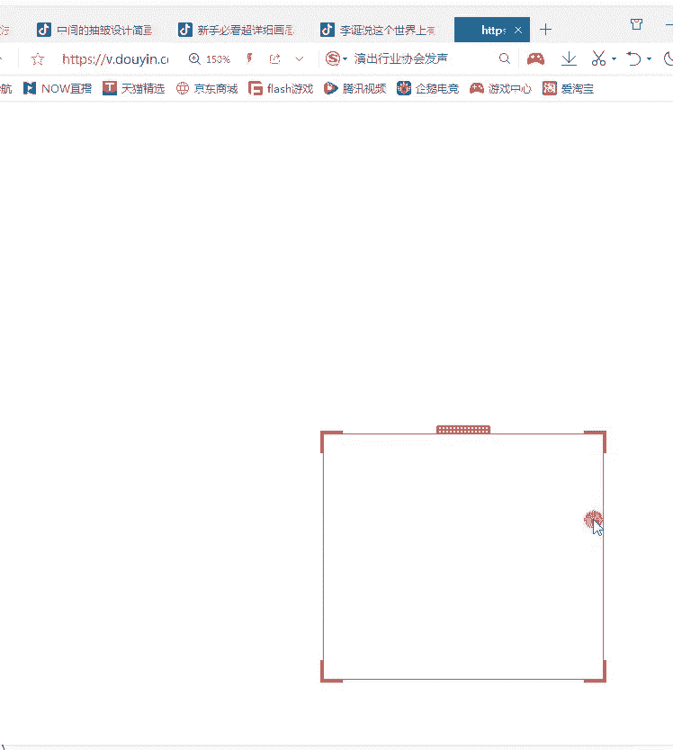
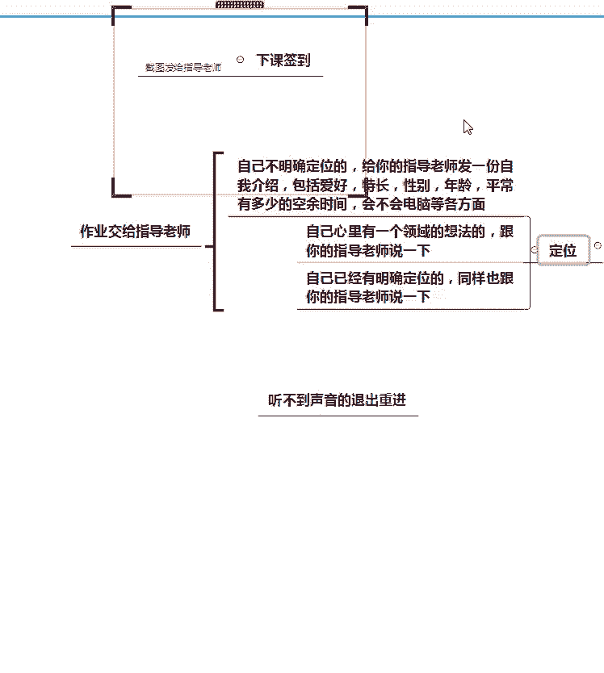

# 2024年做抖音怎么快速起号？3天养出一个高权重抖音账号，掌握这7点，抖音快速养号小技巧！【短剧推广】 - P9：5领域定位优选 - 我从山中来带着大宝剑 - BV1ZCtBeNE8r

类型的作品，之前有在抖音上发过作品吗，啊绘画，乱发的啊，对口型风景啊，随便发也有没有发的好，那么有一些啊有一些我发现了，就是有一些他现在已经确定好方向的同学呢，他其实其实之前发作品就有注意到了。

那我应该发这个类型的作品，那么很多同学他还没有确定方向呢，之前可能就会发乱发啊，就是有点类似朋友圈的这种感觉，大家想回想一下啊，就是一些之前在抖音上乱发作品的人，是不是像发朋友圈一样在发作品。

有没有这种感觉，就是感觉啊我今天在路边看到这朵小野花诶，长得挺漂亮的，我拍了一个短视频，然后把它上传到抖音了啊，我今天跟朋友聚在一起啊，吃了一顿饭啊，吃的挺开心的，拍了个短视频，然后发在抖音上了。

是不是这种情况啊，我看大部分同学都是的啊，那么我们今天这节课来讲到这个领域定位，就是要纠正一下你发作品的一个方向啊，领域定位是非常重要的，就是选好方向是非常重要的啊，如果说你连方向都没有确定好的话。

那么你后续做什么事情都是没有意义的，所以说定位方向是第一步啊，定位方向第一步好，那么现在先带大家来，就是了解一些啊基础的一个知识点好，首先就是一个关于抖音平台啊，那么上节课呢给大家分析了一下。

一个抖音平台的一个趋势，那么抖音它作为国内领先的短视频平台，它是有很多的专业创作者和用户创作者的，一些专业创作者的话，那么我们可能比不上，但是他有很多的用户创作者以后，大家都会成为这个用户创作者啊。

就是你既是用户，但你也是创作者，就称之为用户创作者，那么现在通过上一节课我给大家的分析，大家应该也知道，这是现在抖音平台的一个用户是非常多的啊，你坐在公交车上啊，或者是你在等公交的过程中，你坐在地铁上。

等地铁的过程中，高铁上火车上啊，各种各种场合你都会有看到有人在刷抖音，这就足以说明抖音这个平台，它的流量是非常大的啊，用户群体庞大，所以说大家也不用担心流量这个问题，嗯杂音很大是吗。

我我我调试一下我的设备啊，好现现在呢哦现在还是杂音很大吗，还是有一点点是吧，高音爆麦，有一点点我我再调一下我的麦克风啊，现在呢现在正常了没有，破音还是有啊，这个回音不可避免啊。

回音的话是这个环境的问题啊，回音是环境的问题，这个不可避免的就是这个杂音的话，我尽可能的呃给大家就是消除一下，是不是我的手机干扰到这个，干扰到这个麦克风了，现现在呢现在有没有好一点，现在还是有杂音吗。

嗯还是一样的呀，嗯啊有一点点的话嗯大家克服一下啊，有一点点的话大家克服一下，因为我现在是尽可能的去调试这个设备了啊，因为这个回音的话是环境的问题啊，我这个也没有办法，就是我这个环境是这样子的哈。

呃不影响听课就好了啊，不影响听课就好好，稍微好一点了是吧，好，那就接着讲课啊，没有太大问题，我们就接着讲课啊，就不用耽误太多时间了，好那么再来跟大家讲一下什么是定位啊，什么是定位定位呢。

其实就是给你自己一个方向啊，就比如说你要到达某一个地点，那你肯定要先选选好一个方向，就比如说啊你要从北京去上海啊，或者是从北京去广州，那你肯定要选好一个方向，不能说这个城市本来在南边。

但我却往北边走了啊，这就是南辕北辙，所以说我们做账号也是一样的，要选定一个方向啊，要选定一个方向呃，又看到有同学说杂音很大是，没有声音没有声音，是刚刚老师停停了一会会儿没讲话啊。

呃啊其他同学告诉我是还是有很大的杂音吗，还是有很大的杂音吗，啊可以听清楚是吧，杂音是好大，等一下啊，等一下啊，我我重新，我重新调一下这个设备啊，重新调一下设备，那现在呢现在有没有稍微好一点点。

有没有稍微好一点点，啊可以听清楚是明天换换套设备啊，这个呃换设备可能需要申请一下，好没有问题就行啊，没有问题就继续讲课好，关于这个定位啊，定位其实呢就是给自己一个明确的方向啊，给自己一个明确的方向。

那么我在上课前我也问了大家，就是你们之前在抖音发作品呢，就是啊可能是随便的想发就发了，或者是说也不确定我要发哪个方向的，那么这个呢它就是属于没有方向啊，但是现在我们要做好一个账号。

想利用这个账号来进行变现的话，那我肯定是需要确定好一个方向的，你确定好方向了之后啊，你就要尝试去打造一个自己的风格，就是要让你别人看到你的作品的时候，能够有一个深刻的印象，就像你平常刷抖音的时候。

总会有那么一两个抖音账号的作品，给你留下的印象会比较深刻啊，就是或者是搞笑或者是伤感啊，总是会有那么几个账号，你一提起这个账号，你就想起诶那个视频是怎么怎么样的啊，他的作品都是什么什么类型的。

那么这个其实就是账号的主人，给你留下的一个印象，那我自己做账号也是一样的，也是一样的，就是你要给到用户一个深刻的印象，属于你自己的风格啊，就是你自己的一个鲜明的特色，我们要做到这个。

就是要增加用户对你的一个记忆点，这就是我们定位领域的一个元音啊，就是我们为什么要去做定位，我为什么要啊，一开始就要讲这个定位，而且我反复强调了定位是最重要的啊，第一步是最重要的。

所以说大家就是已经定位好了的同学，那肯定是比较棒的，如果说呃你现在还没有确定好自己的方向的话，那么对于你自己的领域定位一定要想清楚啊，一定要想清楚好，关于这个什么是定位这一块，大家理解了没有。

好理解就扣一啊，就是关于领域定位这一块定位，大家能够理解，没有理解就扣一啊，好啊，大家都理解的话，我们就来讲下一个知识点啊，下一个知识点就是关于一个账户的类型啊，账号的类型的话。

那么老师呢就先挑一些就是比较热门的类型，给大家先讲讲啊，就是呃如果说今天这节课啊，你可能听我说完了一遍，就是我这节课就这场直播课，你听完了之后呢，你其实对于自己的一个定位，可能还不是特别清晰的情况下。

其实你课后还可以问自己的指导老师，要一份这个领域细分表啊，就是说具体有哪些领域可以去进行定位的，都是可以的啊，都是可以的，好那现在我给大家介绍的就是一些账号的类型，就是大概有哪些方向的账号。

是现在在抖音上比较受欢迎的啊，比较受欢迎的就是用户群体，比较庞大的账号类型是哪些啊，首先就是美食啊，美食账号的话其实是非常多的，而且其实大部分的美食账号啊，现在嗯不知道大家有没有注意到，现在有很多的啊。

农村人他在拍这个记录生活的视频，但他的这个视频里面往往和美食是挂钩的，就他的这个视频里面，不可能单纯的只记录他今天做了什么，往往这个视频里面的，还会有一个非常重要的一个事情，就是要分享美食啊。

要分享美食好，那么美食啊，美食是现在比较受欢迎的，还有一个服装啊，包括美妆情感，一是搞笑，最后一个就是生活VLOG啊，这几个账号类型都是比较受欢迎的，就是如果说你自己对这些正好又感兴趣。

然后有条件的话就可以去尝试啊，从这些方面去着手好，先来单独介绍一下啊，这个美食啊，美食就是我们可以给到大家一些账号，去参考一下啊，就是比如说像麻辣德子啊，浪味仙这些账号。

就是大家就是如果说你对美食感兴趣，那么你不确定呃，那我要做哪方面的美食呢，因为美食的话它可以做成很多类型的账号啊，比如说美食打卡探店，或者是做美食教程以及测评啊，这些其实都是属于美食的。

那么你具体想要做哪一些啊，或者是你想要去考虑我呃，我想做美食，但具体做哪一种美食视频，现在还没有想好的情况下，你可以适当的去网上搜索一下，去抖音上搜索一下这方面的账号啊，好那么像麻辣德子。

他这个账号呢其实主要是做美食教程的啊，我不知道，平常如果说有同学对美食的视频，比较感兴趣的话，你们应该会有刷到过他的视频啊，他的视频的话，几乎每一个视频他都是一道菜的一个教程啊。

这种教程类的美食视频呢现在也是比较多的啊，比较多的，它的一般整个视频的一个过程呢，就会是大概包含这些内容啊，大概包含这些内容，一个开场啊，一个开场啊啊都有刷到过，是吧哈啊，比如说啊一般就是开场开场的话。

他可能会先斩试一下一个成品图，就是说我这个菜做好了，他是一个什么样子，一个什么状态啊，一般就是开场会是这个，然后呢他就会从准备食材，然后到制作过程啊，一般这个制作过程他都会带上一个解说，然后到制作完成。

最后开吃，因为开吃它会对这个美食进行一个评价啊，因为一般做这种美食账号的话，其实最后吃东西的人可能不止他一个，还有他的家人朋友等等，所以他们会一同来品尝这一道美食，那么咳这种视频啊，具体要怎么去拍啊。

可以给大家看一个啊，给大家看一个例子，工资源小学有补助短视频，全民干货零基础业嗯看的现在嘛嗯等一下啊，先给大家把声音打开啊，给大家把声音打开啊，对这个呢是为了保证大家的一个上课顺序。

首先你必须得给老师的礼物进行一个创，老师的实力哇，哦棒不棒，咦够不到嗯，够不够够不够，太多了多了，这媳妇今天给钱了啊，咱们今天给我媳妇做个可乐鸡蛋来吧，首先呢咱们准备在市场上买的。

现在鸡蛋贵了四块钱一斤的鸡蛋，完了之后下锅给它煮熟的猪八戒鸡蛋煮好了，咱们过一下凉水啊，既好扒皮，它又不烫手，咱们切点大葱和姜片备用，起锅烧油，下剥好皮的鸡蛋，咱们给它煎成这个熊样子。

家里有条件的来一块五毛钱的可乐，里面好加入切好的葱姜，来点耗油和酱油，稍微加点盐里边让它有点味道，朋友们，咱们盖上锅盖啊，收干汤汁就行，感谢每一位给哥哥们放心，谢谢您的支持，谢谢大家。

汤汁收成这个熊样了，撒点小芝麻，上边，撒点小葱花出锅，有的时商演员，然后我下面告诉老师，然后呢我这边是会为大家辛苦的给拍的所为，把这个留言补习老师，老师今天这一堂课好，这个视频呢。

它就是一个啊非常完整的，一个美十的一个教程的一个视频啊，它一般是会包括这个开场啊，开场，然后包括前面的一个准备食材啊，以及制作过程，那么它在制作过程中，它是有带上解说的，大家有没有注意到。

就是你看完这个视频，你就会知道这个美食应该怎么做啊，它会用到哪些原材料，它的过程中大概需要用到多少东西，它其实在视频制作的过程中，他全部都是有讲解到的，那么这种视频。

它就是属于一个叫城市的美食作品啊教程的，那么现在对于美食领域的话，这种啊教程式的作品是比较多的啊，是比较多的咳，那么还有一个账号啊，也是老师列在这个上面的，就是这个浪味仙这个账号，那么这个账号呢。

它其实主要就是类似于一个测评，什么叫测评呢，就是大家知道现在有很多网红店，你们有没有听说过，就是比如说啊，可能你的城市就里面就有很多的那种网红店啊，就是有很多一些，比如说像重庆。

重庆就有很多的一些网红火锅店等等这些啊，包括在长沙也有很多的这种网红店铺，那么像浪味仙啊，浪味仙他这个账号呢，这个账号主人，他就会去到各种网红店去进行打卡测评啊，他就会去吃里面的东西好不好吃啊。

这个地方的环境怎么样，这个价格怎么样，他就会去做这个事情，这个就称之为测评啊，称之为测评，它既是一种打卡，也是一种测评，测评除了这种直接去店铺里面测评之外呢，也有直接在网上购买一些小零食来进行测评的。

当然这个小零食的话，其实嗯也不一定全部是自己购买的啊，就是有一些你们平常看到很多的博主的话，他可能会选择说哎，找商家寄一个样品给他试一下，然后后续再考虑要不要给这个商家带货，也是有这种情况的。

那么这个呢是啊，不同情况的话，他是要分情况讨论的啊，分情况讨论，就是每一个呃博主他可能有的是自己购买的，有的可能是厂家给他寄的样品来进行一个测评，都是有的，那么适合大家做的啊。

适合大家做的就是做这种美食教程，美食教程，大家想象一下，像刚刚给大家放的这种视频，你想一下，只要你家里有场地啊，你用一个三脚架都能拍出这种作品的，但是像啊美食打卡或者是探店以及测评的话。

这个可能前期就需要有一些资金投入，比如尤其是探店啊，探店的话基本上是天南地北到处走啊，到处走，就是你可以去搜到很多一些关于探店的账号，比如说啊就是我自己个人啊比较喜欢的，比如说像啊小贝饿了这个账号啊。

给大家讲一下，你可以回忆一下，回一下一下啊，这个账号就是一个探店的账号，他会去到全国各地的美食店，然后就去寻找各种美食啊，寻找各种美食，那么这种就是属于一个探店的账号，嗯总的来说啊。

美食这一块无论是打卡探店教程还是测评，它其实现在在抖音上都是比较火的啊，比较火的就是如果说你想要做美食，那你就可以再细分一下，我具体是要做美食打卡呢还是做探店啊，或者是做教程或者是做测评。

当然教程这个啊，应该是比较适合大部分的同学啊，大部分同学如果说你想要做美食领域的话，那做教程的话是比较符合大家的啊，比较符合大家，也不用你到处去跑啊，就在家里拍视频就可以了，好吧咳好。

这个是关于美食这个领域的一个啊，简单的介绍好，第二点呢就是这个服装领域，服装领域大家都知道，从你一直出生啊，到你最后生命的终结，这全过程你基本上都是要穿衣服的，这一点大家承认吧啊从你出生啊。

一直到你生命的终结，这整个过程，包括现在就是中国人还是比较讲究的，就是你人啊入土为安之前还要换一套啊，比较嗯好一点的衣服这样子，所以说服装啊，服装这个领域的话，他其实是针对啊，不管你是哪个年龄阶段。

你刚出生也好啊，哪怕你80岁，90岁，100岁了，你都是需要穿衣服的，所以说服装这个领域市场是非常广的，市场是非常广的，那么做服装的话，咳一般啊一般就是呃我知道有些同学啊，就包括最开始我问到啊。

你想做哪个领域，我看到有同学回答说啊，要做服装领域，那么做服装领域我想跟大家强调一下，你不要一开始做账号就啊我要卖什么服装啊，千万不要这样子，就是现在能够被大家非常能够接受的，一些服装账号。

具体应该怎么去做呢，先教用户穿搭啊，先教用户穿搭，当然有些同学说那老师我不懂穿搭呀，啊我不知道应该怎么穿搭，我虽然是一个卖衣服的，但是我觉得嗯就是我的穿搭很一般呢，就是感觉也不是很适合所有的人。

那么如果说你不会穿搭的情况啊，或者是说你对于穿搭这一块，并不是很精通的情况下，你可以先去学习一下别人的啊学习，比如说在小红书上面，它就有很多教人穿搭的，教人穿搭的，那么呃一般啊。

就是比如说我们看到嗯比较火的一个账号，这个大码胖佳佳啊，松本丧丧啊，这些他都是做服装领域的一个账号，大家其实可以去看一下啊，我给大家看一下这个大码啊，胖佳佳的一个视频啊，他就是教肥胖人群去进行穿搭的。

大家看一下他的一个作品。

夏天穿搭这种对，啊有时候是紧身的衣服，后背就像个蚕蛹一样，侧面这个肚子和腿呀像个金刚，要是瘦个50斤，穿起来就会好看了，瘦不下来的话，直接换一条裙子算了，哇，哦sexy lady，然后就有人要讲啦。

哎呦你不是穿了束腰吗，哼为了证明一下我自己，我还特地穿了个绿短裤在里面给你们看一看，会有人要讲啦，你这上半身这么露，你不显胳膊粗吗，你这么大一块露在外面，你怎么可能不显胳膊粗。

你就随便在外面搭一个这种小开衫就行了呀，再不行，你就搭个这种西装外套呗，喜欢穿保守一点的，里面搭个小T恤，感觉像换了一种风格，最后叮嘱一句，长短款，个子高的买这个好人必备，这个视频看完了之后啊。

假设你正好是一个微胖型的女孩子，你有没有获得一些有用的价值，告诉老师，假设你现在正好是一个比较啊，就是有一点微胖型的女孩子，你有没有获得一些有用的东西，有对不对，他有告诉你啊。

就是我这个身材啊也不不是特别好，可能身材管理有一点点失败，然后有小肚腩啊，或者是这个膀子有点粗，那么我应该怎么去穿这些漂亮的小裙子，它其实是给到了三份穿搭的啊，给到了三份穿搭的。

那么他的作品为什么可以火，首先第一点他就给用户提供了有用的价值，你看我现在问大家有没有得到一些有用的消息，大家都在刷，有，就说明他这个视频是给用户提供了，有用的价值的啊，就是有用的消息。

这样子用户才会喜欢你啊，才会喜欢你，就是因为老师呢，之前也有看到过一些关于服装领域的作品啊，这些作品是怎么呢，上来就有点像图片轮播一样的作品啊，就是啊几张衣服的图片，然后在那里轮播，然后也不告诉我啊。

这些衣服应该怎么搭配，它适合什么样的一个身材都没有啊，就直接就是几张图片。

那么像这种视频，像这种视频的话，他没有给用户提供有用的信息的话，那么用户就不会喜欢啊，用户就不会喜欢这种作品，所以说大家拍视频的时候，或者是说就算你做二次剪辑也是一样的。

你的作品一定要能够给用户提供有价值，有用的信息，用户才会喜欢你的作品，虽然大家来抖音是为了放松，但是放松之余，如果说我能够得到更多的东西，当然是更好的，当然是更好的好，这个是一个关于服装的啊。

服装领域的话他可以细分成很多啊，就是说如果你确定了，你要做一个服装领域的账号的话，那你一定要描准你的用户人群啊，要瞄准你的用户人群，不要你的店铺里面今天卖男装，明天卖女装啊，后天卖这个中年人穿的啊。

然后再过一天又卖婴儿的服装，那这样子的话，很显然你的账号不会垂直啊，这样子的你的粉丝粘性也不强，如果说你做服装账号的话，那你就要确定好我要锁定哪一个人群啊，比如说我做女装，那么我就锁定20岁到25岁。

这个年龄阶段的女性群体，那么我要展示的服装就是全部都适合，这个年龄阶段的女性群体的服装，就是你要锁定好人群，锁定好用户，这样子你的账号做垂直了，你吸引的粉丝才是精准粉丝，而且你只要持续的更新优质作品。

那么这个粉丝粘性会不断加强啊，最后这些粉丝全部都可以变成你的用户，希望大家注意啊，就是说如果你有这个打算要做服装领域的话，希望大家记住这一点，就是你不要卖的很杂乱啊，卖的很杂乱啊。

因为一开始上课的时候呢，其实我是有看到啊，有人说要做服装领域的，所以说希望大家都注意一下啊，嗯好这是关于一个服装领域的一个示例啊，示例，那么他的这个账号呢，主要就是分享一些大码女装。

当然如果说你分享的服装就是啊，小码的也没关系啊，就普通人穿的也没有关系啊，而且很多现在很多的衣服的话，它就是适合那个身材啊，可能从100斤到150斤的，这个体重范围之内都是能穿这个衣服的啊。

那当然也很好，它可以吸引到更多的一个人群啊，好这个是服装领域的一个简单的一个讲解，好下面一个就是美妆领域，大家想一想，你们现在在大街上看到一些女孩子，就是纯素颜的女孩子，你们觉得还多吗，问一下大家。

你们现在走在大街上啊，尤其是在一些商场里面，或者是在一些商业街里面啊，逛街的时候不多，对不对，基本上大部分的女孩子啊，她出门逛街也好，或者是现在的一些啊嗯要上班的女孩子也好，她基本上都会带妆啊。

都会化一点妆，那么其实呢这个呢就是这个妆容啊，它不仅仅是说啊可以遮掉，我脸上可能有一些瑕疵词，比如说啊今天这里长了颗痘痘啊，我要把它遮一下，或者是说啊我脸上这里长了个斑，不是很好看，我要给他遮一下。

其实有些人他不仅仅是因为这个啊，甚至很多时候化妆她成为了一种礼仪啊，成为礼仪之后，你就会发现这个东西它其实是需求量非常大的，因为化妆这个事情是与生俱来就会的吗，问大家，化妆这个事情是与生俱来就会的吗。

你从出生到现在没有人教你，你就会吗，显然不是啊，显然不是的，就是说美妆这个东西是需要去学习的啊，甚至有些人就是呃我可以很明确的告诉大家，就是我其实上初中之前，我都不知道正确的洗脸方式。

真的虽然老师作为一个女孩子啊，但是没有人告诉我啊，正确的洗脸方式应该是怎么去洗，才能够最大程度地清洁自己的皮肤，并且保护好它，就是我后面也是通过慢慢的去学习，我才知道哦，原来洗脸要注意很多很多的细节。

就是这些东西既然不是与生俱来就会的，那就说明需要有人去教啊，需要有人去教，那么做美妆是怎样的，他有可以来教你化妆，甚至是教你护肤，或者是说当你的肌肤遇到一些啊，不是特别严重的问题。

比如说偶尔啊在哪个部位长个痘啊，我应该怎么处理，或者是怎么急救一下，或者说啊我有一天晚上突然因为吃了什么，然后这个脸第二天早上起来的时候特别肿，我应该用什么东西可以快速消肿，或者说我的脸型长得什么样。

我应该画一个怎样的妆容比较适合自己啊，这些都是可以的，所以说咳美妆这一块做教程的，是非常受人欢迎的，因为它有很多的市场啊，现在的一些零零后的小女孩，她就是因为她现在，正好是在一个让自己变美的过程中啊。

变美的过程中，所以说她会对美妆这一块的需求，其实是很大的啊，对于美妆这一块的需求是很大的，那么美妆啊一般就是测评和讲解啊，测评和讲解包括一些教程，那么这个教程式的美妆视频啊，给大家举了个例子啊。

大家可以先看一下，就是说呃不是说你的一个视频就必须分享哎，今天你这个脸上的呃，比如说打底怎么画啊，或者是说这个鼻影怎么画，这个高光怎么擦，这个眉毛怎么画啊，不需要一个视频，不需要分享这么多。

可能一个视频就专门讲解一个地方怎么画好，就可以了啊，就如果说你正好比如说你对化妆比较精通，那你就可以去做这种教程视频啊。

好给大家看一个视频啊，给大家看一个视频，是我晚上八点挣钱。

现在呢距离开课时间也是差不多了，那么我现在就去办公室里面，邀请一下李希老师来给大家讲课，在那里一块啊啊一个人的精气神他全在门，那哪怕你五官长得一般，但是眉毛好看啊，那这个人看着就是会有气质。

他就直接决定你上中庭的五官比例，还有给人的第一印象，我发现大多数的人画眉毛啊，就是给他画个框，然后填起来，然后各种奇奇怪怪的眉形就出来了啊，你看啊，这个是姐妹分家型，这是姐妹再次分家型。

那这个是深宫怨妇型，还有一个讨债失败型，所以今天就是你们没有看过的传新版本，我跟你们保证，我列了提纲的，我大学学彩妆课的时候都没有教的这么仔细过，首先来这是一个标准的眉毛公式，都已经截好图了是吧。

且慢只是公式啊，一般化妆师呢给像我这样的人画眉毛啊，会用到眉粉和眉笔，对一个好看的眉毛，他就必须是有行无边，眉粉负责有型啊，眉笔负责无边，但是我们今天只需要用到一支眉笔，我跟你们讲，这个颜色真的巨好用。

5号色，它这个画出来就特别像你眉毛本身的那个颜色，而且它可以在你眉毛上面随意的加深减淡，并且还不脱节，你敢信，我觉得还可眉粉压出的眉笔啊，但是呢它又比眉粉显色，第一步啊，你要有型对吧，来首先连接鼻翼。

眼尾和发际线，眼尾和发际线中间这个点就是眉尾，这边也是一样啊，然后是这个眉峰啊，正常情况下都是眼睛直视前方的时候，鼻翼眼球的外切线，眉峰三点是在一条直线上，对不对，那有的人鼻翼很宽怎么办呢。

所以另一个方法就是嗯自身外眼角垂直对上去，这个地方这样子找会更容易啊，把这两个点和自身的眉毛给它连接起来，然后眉尾和自身的眉毛也连一下，诶，你看这个形已经出来了啊，形指的就是眉形的大，是走向好看。

你再量一下左右两边是不是一样高，这一步你框死一点没有关系，但是这个眉头千万不要画画了，这个灵魂就没有啦，然后是无边，用这个眉梳啊，挨着这个眉形给它梳下去，哎我说它可以自由的加深减淡的吧。

很多人画左边的眉毛都不顺手对吧，你把这个眉笔掰拍下来，然后从后往前梳，这不就顺手了嘛，你看我的眉毛长到这儿就没有了，后面全是画的对吧，那这个地方我们需要去重点衔接，然后给它这样来回的蹭一点颜色。

我这只眉毛缝了得有八只，我用其他眉笔根本画不上去，画出来，要么就是这里一条反光，要么就是一坨黑色堆在这里，这支眉笔真的是我用过的，画出来衔接的最好的一支，你看我这边的眉毛是抬不上去的，发现了没有。

侧面瘫，你要是像我这样的圆脸宝贝啊，可以再把眉毛画粗一点点啊，就从后往前这样子对，然后再这样梳，你看他这个啊，哪怕画在皮肤上啊，他都一点都不脱节的，你看就融合的特别好，而且画出来的质感真的很绝哦。

你看一点颗粒感都没有，这个眉毛里面啊颜色最浅的应该是眉头，你要是不会画，宁可别画，用这个眉梳弯过来给它往前带一带就行了，桌子上面本身就会带一点颜色的。

哪怕你是个新手小白，啥也不会，你按照这个风格画这件事呢，如果说是的话，好整个视频看完了啊，他其实这个视频呢，他就只分享了一个眉毛的画法，大家注意到没有，他只分享了这个眉毛应该怎么去画啊。

这个眉毛怎么画才比较好看，但是他在最开始讲了一个这个眉毛的重要性，不知道大家有没有注意到，就是你们平常啊可以观察一下身边的人，如果说你身边有一个啊你的亲人或者是朋友啊，或者是啊各种啊。

就是甚至是一个陌生人，你看过去，当你发现他的眉毛很浅的时候，你是不是觉得这个人很没有精神，大家想一下，就是现在啊其实很多人啊，很多人他都可能会有这种，就是有些人他可能天生的这个眉毛就很浅啊。

天生眉毛很浅，那她可能就需要画眉毛，但是画眉毛这个事情啊，其实真的是非常需要技巧的，就很多新手，他这个眉毛呢一不小心就画成蜡笔小新了啊，如果说大家就是有看过蜡笔小新，这个动画片的话。

大家可以去看一下蜡笔小新的那个眉毛，真的就是啊，大家可以还可以想象一下像武大郎的那种形象，就是说如果说你没有好的技巧去画这个眉毛，就会导致这种情况，但是当你的眉毛很浅的时候。

你不画眉毛呢又会给人感觉很不精神啊，这就是为什么大家现在走在大街上，看到很多年轻的女孩子，她都会画精致的妆容，那么其实呢这个也是为了啊，就是体现自己啊是比较精神的啊，是一个比较精神的人。

而不是每天都感觉是没精打采的那种感觉，所以说像这种技巧，他其实是很多人都需要的啊，很多人都需要的，所以说你分享这种技巧的话，就会有很多的用户需要啊，很多的用户需要，尤其是一些新手小白。

对于化妆这一块可能完全不懂的，没有任何技巧的，她就会很喜欢这一类的视频，诶，他今天教我画眉毛了啊，可能他明天会教你怎么画眼影啊，后天教你涂口红，红要怎么涂才比较好看啊，后天教你画腮红。

怎么不会把自己画成一个啊，猴子屁股这种都是有的，所以说如果你正好具备这方面的知识啊，你正好拥有美妆方面的知识，不要吝啬你的知识给大家分享出来，好我甚至还可以提一嘴啊，那这个怎么变现。

这个怎么去进行变现啊，就刚刚我们看这个视频，其实它就带了一点点的广告，不知道大家有没有注意到，就是刚刚这个视频，他其实是有带广告的，大家注意到没有嗯，大家有没有注意到，就是刚刚这个视频啊。

他带的广告对眉笔啊，眉笔就是他带的广告，那她今天教你画眉毛，她带了眉笔，那明天教你画眼影，他会带眼影啊，就很多人担心他说啊，那老师我分享这个东西，我确实是分享的东西给别人啊，那我怎么变现呢。

看是不是很简单啊，是不是很简单，就它在无形之中就向你推荐的产品啊，无形之中向你推荐的产品，所以说我们自己做视频也是一样的啊，也是一样的，可能你比如说你今天要告诉别人啊，怎么画这个口红啊，才比较好看。

因为其实涂口红也是非常有技巧的，那么我就可以无形之中分享一下这个口红A，它是哪个哪个色号的，也不一定说它是哪个品牌的，你只要说它是哪个色号的就可以了，其实无形之中就带了广告啊，就是带货。

所以说大家也不用担心啊，是不是我就算吸引那么多粉丝有什么用呢，啊我又卖不出去货，其实不会啊，其实不会，就是很多时候无形之中你就可以带上广告啊，好，那么这个就是关于美妆领域的一个，简单的讲解啊。

美妆不仅仅只是化妆啊，给大家讲清楚美妆其实它还包括了护肤啊，包括护肤和化妆，那么说句实在话，如果说你对这方面的知识有了有了解的话，你就会发现，护肤和化妆，真的有很多很多的东西可以去进行分享的啊。

现在的美妆博主真的是层出不穷，为什么那么多人都在做美妆，但是美妆领域依然很火，就是他真的市场需求非常广大，如果你正好有这方面的知识，请不要吝啬哈，把它全部都分享出来，他可以给你带来利益的，好吧好。

这个是一个美妆领域的一个简单的讲解，好，下面再来讲一个啊，很多同学说啊，那老师我我又不懂美妆啊，我也不懂服装啊，我不会做饭啊，怎么办哈，我们可以来分享一些情感啊，我们不讲物质的，我们走心啊，走心的。

那么情感的话有比较多的，就是现在在抖音上比较常见的一些类型啊，比较常见的一些类型，首先一个就是书单，那么这个书单是可以直接去套用模板的啊，这个模板在哪里有剪映，里面就有很多很多的书单模板啊。

很多书单模板，那么这个书单的话具体是一个怎样的啊，就是比如不说啊，有一个账号叫人脉书单啊，我给大家看一个他的视频，就是非常的简单啊，非常的简单，给大家看一个啊。

全部进行一个私密或者删除嗯，一播放量全部进行私密或者删除，你播放量指的是低于2000的，全部进行私密或者删除，需要请私信，我愿意我愿意思，你看行不行，现实不行，告诉你共十被车准则好，这个视频啊。

它就是一个简单的书单视频啊，可能大家都还没有缓过神来，诶视频就结束了吗，确实他就结束了，这个视频它的总时长就只有八秒，书单视频就是这么简单啊，书单视频就是这么简单，而且大家发现没有这个书单视频。

它就一页书啊，它就只有一页书在上面，然后呢他在这个书页上啊写了很多字啊，比如说梦想中的生活是怎么怎么样的啊，就写了两段文字在这里，这个就是一个简单的书单作品啊，简单的书单作品，这是非常简单的啊。

可以直接套用模板的啊。

直接套用模板的，那么这个书单领域它虽然简单啊，但它也有一些些的弊端啊，还是先跟大家强调清楚啊，这个呢呃老师也承认，就虽然这个东西简单，那么呃一说啊这个简单，那老师我就要做书单好了啊。

其他这领域我都不考虑了，像你刚说什么美妆啊，服装感觉就很复杂呀，要拍视频，这个书单简单，我想做好，强调一下啊，这个书单是这样子的，它制作简单就会导致很多人都想去做啊，就比如说现在教室里面的同学啊。

就可能看视频这么简单，可能啊我也想做啊，乐多老师，我想做这个啊，我想做这个，那么大家都做这个的话，就会导致人群太多啊，会有竞争，所以说如果你确定好你要做书单的话，你要必须想好，你可能啊比如说你做美妆。

你可能是和1万个人在分蛋糕，但是你要做书单的话，你可能是和10万个人在分蛋糕啊，大家想一下啊，所以说嗯这个确实简单，但是竞争相对来说也会大一些啊，也会大一些，希望大家清楚啊，清楚这一点好。

这个是嗯第一个就是书单，书单呢确实是比较简单的啊，除了这个之外呢，还有一个就是这个涂磊，大家有听说过涂磊吗，你们有没有听说过涂磊嗯，有意义的嫌疑，这个人啊，这个嗯主持人啊，或者说是一个情感调解员啊。

或者甚至大家很多的时候，可能会在抖音上有刷到过他的作品，那么他可以称之为算一个啊情感大师，那么像他的视频其实有很多啊，你们在抖音上看到有涂磊出现的视频，很有可能都是其他用户的一个，二次剪辑的作品啊。

二次剪辑的作品，那么他的作品啊是怎样呈现的，他的作品其实呈现方式有很多啊，有的是他在一些电视节目里面啊，他的一个片段进行了一个二次剪辑，也有他平常他自己发的一些视频，被别人拿来进行二次剪辑的。

都是有的啊，我们可以看一个他的视频啊，可以看一个他的视频。

有一个机子来女人选印象异国是非常重要之灾，也就是说我们如何去解决自己的账号，重新打算怎么做，变性选择男人的必要标准不是颜值，才华和人品，而是他能够为你挺身而出的担当，有些男人只是长得像男人而已。

在想要得到你的时候，殷勤备至，慷慨激昂，海誓山盟，但是真的要到扛事儿的时候，无论是面对经济债务，父母压力，强盗流氓还是流言蜚语，他立刻就躲在了女人的背后，而最悲哀的莫过于。

平日里看起来还挺人品端正的男人，此时还不如坏小子靠得住，所以说男人的颜值和才华是他的私人财产，至于人品，那是公共道德。

最重要的是爱你，并且有保护你的勇敢，爱的人正在路上，我知他风雨兼程，途经问你意而在，因为我的雕刻是一个同学好，这个视频呢就大家平常啊，可能在刷抖音的时候都有见过这个视频。

那么视频里面的主人公呢就是涂磊啊，他经常会分享一些关于情感上面的一些啊句子，文案之类的，他有的时候呢呃可能你们看到的一些视频呢，就是他剪辑的，他在节目里面啊，针对某一个具体的事件，然后进行的一个分析。

但是他说的就是对于情感上面的一些事情，说的确实是很有道理啊，就是让人觉得哎我听了这个感觉，就是在说我自己啊，感觉就是嗯周边很多事情，都可以用这个东西来解释这种感觉啊，这个就是情感领域。

他为什么那么能够受人欢迎，就是因为他说的真的很正确，或者是说他能够戳中你的内心，他能够戳中你的现状，所以说他受人欢迎，很多人都很喜欢他，他能够把情感问题剖析的很清楚，他能够给很多在情感上觉得迷茫的人。

给到答案啊，这就是他为什么那么受人欢迎，那么他的这些文案，甚至他的这些视频，我们都可以拿来进行一个二次剪辑啊，把它做成一个情感类型的视频都是可以的，好这个就是啊一个涂磊的啊。

那么还有一些就是比如说像啊励志的，比如说像马云的一些演讲啊，马云的一些演讲的话，他其实都是非常励志的啊，现在嗯现在因为他他的视频稍微会少一些啊，都是前几年的一些视频了。

我们可以看到他的视频就是都是分享了一些，很励志的观点啊，大家其实可以去搜索看一下嗯，好那么情感是全部都是啊，要么就是套模板，要么就是用别人的视频素材做二次剪辑吗，其实不是啊。

如果说啊你想要做原创也可以啊，也可以可以拍自己啊，我现在就看到有同学在问了啊，能拍自己吗，可以啊，可以拍自己真人出镜拍摄的情感励志啊，也有的啊，也有就是比如说自己啊分享一些情感文案。

自己去分享一些情感故事，这个故事可能就是你自己啊，你自己发生在你自己身上的一些故事，的一个升华，或者是说你周边朋友的一些故事，直接把它分享出来，或者是说啊有一些如果说你的账号做起来的话。

甚至还会有粉丝投稿，就是你们可能经常会刷到一些视频，就是他会在前面讲一个故事，然后他最后说一句嗯，这个是一个粉丝的投稿，然后他会甚至最后还会抛出观点，大家是怎么看这个事情的，都会有。

所以说这个情感你想做二次剪辑也可以啊，想做真人出镜都是可以的，看你自己的一个个人的选择啊，看你个人的选择好，这个是情感领域啊，情感领域的话其实是他的受众是非常广的啊，非常广的，因为人都是有感情的啊。

人都是有感情的，所以说不管你是处在什么阶段，总是有一个主要的感情，会对应在你的生活当中啊，那么这个感情情感这个领域，它就会适用很多的用户啊，很多人他刷到情感视频的时候。

如果说今天这一句文案正好戳中你的心窝子了，那你就会觉得嗯就是在说我自己啊，感同身受的这种感觉，情感作品，最重要的就是要让用户觉得感同身受啊，要让用户感觉感同身受，什么叫二次剪辑是吧。

好这个后续的课程会详细讲解啊，详细讲解，那么今天呢主要就是来讲一下，这些一个领域的问题啊，好这个是情感领域啊，他其实适合很多人去做，适合很多人去做，如果说你觉得你啊你做服装啊，我不懂穿搭，我做美妆。

我不懂得化妆啊，不懂得护肤，没关系啊，情感的话其实不需要你懂得太多东西，只要你是一个情感丰富的人，都可以啊，都可以，现在好，那么除了情感之外呢，还有大家都比较感兴趣的一个就是影视啊。

影视的话是这样子的啊，它也分好几种啊，它也分好几种，那么嗯上面这两个啊，一个若有缘影视剪辑，小C影视剪辑的话，这些是你直接在抖音上面去搜索，影视剪辑一般最先跳出来的两个账号啊。

大家其实可以去看一下他们的作品，那么除了这个之外呢，还有一些影视剪辑啊，比如说像影视解说啊，影视解说，还有一些好剧推荐啊，精彩画面卡点这些，他其实都是属于影视剪辑类型啊。

那么我今天给大家准备到的一个示例的视频呢，它就是一个影视解说的啊，可以给大家看一下，这是画面可能会稍稍有那么一点点恐怖啊，画面稍稍有那么一点点的恐怖，所以说希望大家不要太介意啊。

那这个时候我们用来安慰自动。

深山古堡里挂满了无数幼崽的巢，这都是吸血鬼的后代。

突然抽中探出一只手，吸血鬼保护好了成千上万的新生，吸血鬼飞到了幕府中心去。

尽见吸血鬼祖先，登了伯爵，成为吸血鬼的第一课狩猎。

两个新娘兴奋的带领着这群吸血鬼保护的飞将，但肖战成为了吸血鬼。

古堡里范海辛啃小吸血鬼，抢一哥，终于空了。

陈伯爵不备，范海星大力的往他心脏插入，好，可伯爵笑了，无论是阴木桩还是骨架都伤人了。

作为元祖，吸血鬼伯爵不惧怕任何生气，这时吸血鬼新娘却痛不来了。

小吸血鬼们都暴怒而无了，原来狼人所提供的能量还是不能呼吸，趁机放心逃跑，和带着安娜一起逃离了实验架上的狼人。

也被安娜放了出来，只是这一次安娜放心了，他的哥哥已经彻底变成了一个狼人。

成为了走狗，逃跑时他们失足掉入坑里，在这个隐蔽的山洞。

他们发现了一个怪物，是那个科学家用尸体拼凑出的怪物，笑死痛死亡，他似乎对人类充满了憎恨，安娜受无攻击，怪物从没做过坏事。

却被人类唾弃，被吸血鬼追捕，想活下去就这么难，范海星逐渐明白。

怪物才是科学家复活世界生命之源，只有他体内的能量能带给吸血鬼后的生命。

安娜想杀死他，绝后患泛爱心阻止这个长相丑陋的生物，内心从未被泄露过。

而且只有他能帮助大家，找到杀死吸血鬼王者的方法。

但他们的话被墨菲的老人听到了，德古拉肯定会把怪物整死，体验事不宜迟，范海辛和安娜立马驾驶了车。

准备把怪物送去藏起来，半路上，他们被骑士鬼偷袭。

前面是一座断桥，范海辛跟着马群越过桥梁，装着怪物的车厢去追山崖。

新娘追了上去，抓住车厢里面却没有人，新娘才意识到这是陷阱，车厢里装满了。

不是装，她赶紧逃开紧了，车厢坠到崖顶，爆炸了，音质骤，客家在安中上好，这个视频呢有一点长啊，就不给大家看完了，那么其实这个视频呢看下来啊，大家应该知道他其实就是属于一个影视解说的，就是你看这个视频画面。

你看不到具体的一些细节问题，他都是通过解说的形式去解说这部电影啊，通过解说的形式去解说这个电影的，那么文案解说啊，解说就需要解说文案啊，强调一下，如果说你是做影视解说的话，那肯定是需要剧情解说。

就需要文案啊，这个肯定是需要自己去，就是啊，比如说你要解说一部电影，肯定是需要解说文案的啊，有一个大型流量极大，与中国人合力极大而减半，好强调一下啊，十题嗯，当然很多人来说，那我写不出这种文案怎么办啊。

需要就是当你想要解说这个电影，或者是说啊，我想要解说某一部电视剧，但是我不知道怎么去写文案的时候，这个没有关系啊，后面的课堂上老师都会教你，当你不会写这个的时候，我应该怎么办啊，我应该怎么办。

我都会告诉大家一个具体的方法去进行操作啊，您是把标签去说话，有杂音是吗，杂音很大吗，大吧嗯杂音很大吗，就是我其实嗯，还是希望大家可以听得更加清楚一些啊，谢谢嗯，如果这十条里面有六角很大是吗。

越来越大都是你啊，不算太大诶，靠近主教做嗯，就是如果说没有影响到大家听课的话，就希望大家克服一下啊，啊如果说没有影响的话，大家就希望大家克服一下，好吧嗯好，我争取一下啊，如果说明天能换麦克风的话。

我争取一下啊，好这个就是影视啊，影视的话基本上就是分为这些类型啊，影视基本上分为这些类型，好你类型的是如果说你想要做影视的话，那你先确定好自己是要做一个情节的剪辑，还是做影视解说啊。

或者是做一个精彩画面的卡点啊，都是可以的啊，都是可以的，大家就是提前先考虑好啊，提前考虑好好，那么除了影视之外呢，还有一个就是搞笑领域，大家平常在抖音上，应该会刷到很多的搞笑视频啊，搞笑视频的话。

现在抖音上市场也是非常广的啊，比如说啊比如说这些账号啊，这三个账号它其实都是搞笑领域的啊，嗯老师用一个手机就好了，嗯我明天上课前啊，先调试一下设备，好吧啊，明天上课前先调试一下设备啊，好那么搞笑领域啊。

主要是这几个账号是在抖音啊，现在是非常火的，这几个账号大家就是说，如果说你对搞笑领域特别感兴趣呢，那么你课后可以去搜索一下这几个账号，看一下啊，那么咳给大家看一下一个事例，为什么他们的可以这么火啊。

跟大家讲，现在抖音上搞笑的视频非常多，但是什么类型比较受人欢迎呢，这种一人分饰多绝，一人分饰多绝的作品往往更受人欢迎啊，给大家看一个视频啊，给大家看一个视频，也许你们之前在抖音上就有刷到过这个视频啊。

这个视频的话非常的接地气，但是又很搞笑啊。

是不是退休在家的老爷爷，等你妈喊他们都赚到了钱了，我也一眼馋，我也迷小三，所以说大家可能会早晚上来学这课，但是你知道怎样去赚钱啊是吧。

你吃饭了，新鲜宝宝洗完了好，喊你吃饭好，马上来了，快给我起步是嘛，你听听我讲话，不得讲话，你听不到，我是不是起起起起起起了听讲，你听好笑，那是喊你喊半天，那你也是八大理你，我帮我喊你回来。

你你是家里老祖宗了嘛，我起来哎呀，真的话，那几句把你传递快点，老妈你不是吃饭了吗，饭热的饭诶，你等着嘛，我煮给你吃嘛，你长得嘴巴等到嘛，我是你保姆，我是在农的父母，我是全家的生活还不花钱的。

我你讲这么打了半都不会整的多，都是你笑死你，楼下给我买菜，搞快点，我不想去，快点不行啊，不管你怎么辩啊，我不管你是有权利人的，你没权利也好好，这个视频它就是典型的一人分饰多角啊，他一个人又扮演了母亲。

又扮演了女儿两个角色，而且他的这个场景大家有没有觉得很眼熟，这种场景啊，这种场景的话说句实在，老师作为一个年轻人，我真的经常遇到啊，尤其是放假回家的时候，想着哎好不容易不用上班的时候。

我是不是要睡个懒觉，结果我妈总是啊大清早的把我叫起来去吃饭，结果一起来饭还没做好，就经常会出现这种情况，就是很生活化，很接地气啊，但是他通常就是拍也就一人分饰两角啊，一人分饰两角。

他又会把这个画面搞得比较搞笑，而且就是比较夸张的这种，就是把生活里面本来是一些很平常的事情，把他夸张一点，把夸张一点，一人分饰多角，然后再搭上夸张他的这个搞笑的目的，就达到了搞笑的目的。

就达到了这种视频的话，大家其实平常在抖音上，如果说你刷的比较多的话，其实是经常能看到的，经常可以看到这种类型的视频，而且他的这个作品啊，就这个账号啊，他的这个账号哈。

基本上全部都是基本上全部都是这种类型的啊，全部都是这种类型的，就是他一个人扮演两个角色，甚至有时候是更多个角色啊，不仅仅只是两个人，甚至有时候三个人四个人，其实都是他一个人在演绎的啊。

都是他一个人在演绎的，你就去好，那么这个是一个搞笑领域的，那么搞笑领域的话，现在确实是在嗯抖音平台是比较受欢迎的，那做搞笑领域的话，如果说你想做搞笑啊，你想做搞笑，那么就希望大家注意一下。

你在做搞笑领域，定位搞笑领域之前，你先确定好你是要真人出镜吗啊，因为搞笑的话，他其实还是可以去网上找一些特别搞笑，或者是甚至说是一些很沙雕的片段，把它剪辑到一起，做成一个搞笑视频也是可以的啊。

就是搞笑其实也可以做二次剪辑，但是找素材相对来说会比较繁琐啊，会比较繁琐，因为那些素材呢它真的是散落在各个平台，就需要你慢慢去搜集，把它剪辑到一起，就剪成一个作品的话，确实是需要花比较多的功夫。

如果确定了自己要做搞笑领域，那就先确定好自己要真人出镜还是二次剪辑，如果要做二次剪辑的情况下，那你就做好心理准备啊，就是因为找素材这个过程的话，确实花费的时间会比较多啊，花费的时间会比较多好。

这是一个搞笑领域啊，最后一个呢就是现在抖音上啊，包括其他的自媒体平台也非常火的，就是这个生活VLOG啊，大家可能不太理解这个VLOG是什么意思，那么老师再说的简单一些，就是生活日记的意思啊。

就是生活日记的意思就是记录你的一个日常啊，记录日常它其实就是称之为一个生活VLOG，那么关于生活VLOG的话，现在比较常见的啊，很多就是大部分都是一些拍摄一个，农村生活的啊。

嗯生活VLOG里面有一个重点啊，就是不是记流水账，跟大家强调一下，如果你要定位做生活VLOG，强调一下，不是记流水账，因为大家想象一下，你愿意在抖音上就看别人每天起床刷牙洗脸，吃早饭，吃午饭吃晚饭吗。

我相信没有人想看这种类型的作品啊，生活VLOG虽然是在记录生活，但是也是要记录有有意义的生活啊，也是要记录有意义的生活，这点希望大家记住好，全部啊，就是呃刚刚给大家讲的是一个需要一个美食，服装美妆啊。

包括情感影视这些呢，就是现在在抖音上比较火的几个领域啊，就集中给大家讲一下，集中给大家讲一下，就这几种账号类型的是比较火的，那么我知道可能我讲解了这些之后呢，还是有同学觉得哎这都没有我感兴趣的。

怎么办啊，怎么办好，再来讲一下一个就是定位啧，那老师刚刚讲的这些我感觉我都想做啊，有些同学可能会觉得哎我都想做，我感觉都好有趣啊，那也有同学可能会觉得，老师讲的这些我都不喜欢，怎么办啊。

我应该怎么去定位，老师讲完了这么多，我还是觉得很迷茫啊，就是想问一下大家，就是听到这里，你已经对自己的方向又有了，那么一丁点想法的人，告诉我一下，为什么你没听，好都不会意思。

就是说啊有的人又是存在一种什么想法呢，都想做，那么还有一些人就觉得哎，这些又感觉好像挺难的，又感觉好像又不是那么难，那我到底做哪个啊，还是有同学会有这种疑惑啊，啊也有我刚刚讲的都不喜欢的，对不对。

那么具体啊这个定位首先一个让用户记住你，所以说你要找到一个属于自己的定位，那我怎样才能让用户喜欢我啊，首先一个就是风格啊，一个风格，那么风格它可以分为一个办公室风格啊，一个中国风风格，包括知识分享等等。

我这个是是啊，现在咳更加精致了，列一部分出来啊，这个只是列一部分出来，就是说不是说所有人都是，比如说只能从这几个风格里面选择，就是这个就是利用你现有的一个资源，可以去做的一个账号啊，可以去做的一个账号。

就说比如说你正好是啊在办公室里面上班啊，或者是觉得你每天的一个工作很无聊，那么可以做一个啊，类似一个爆笑办公室的这种账号，其实现在这种账号很多啊，就大家在抖音上有没有刷到过，就是在办公室里面。

比如说啊让员工去猜一个东西，猜不出来就用那个锤子锤一下的那种啊，这是属于爆笑办公一种风格啊，这就是办公室风格类型的好，还有一个就是中国风啊，中国风的话就是现在大家在大街小象啊。

可能都会有看到一些女孩子或者是男孩子啊，就会穿汉服啊，很有可能就是你有时候觉得，偶尔看到一两个人穿这个衣服的时候，你会觉得啊有一点点异类的感觉啊，但是其实现在呢汉服的这个文化，它突然一下子又兴起来了。

就很多人啊，越来越多的年轻人他就很喜欢这个汉服，那么如果说你正好你也是一个汉服爱好者，那么你也可以走这种风格啊，好第三点呢就是一个知识分享类型的，其实知识分享类型的话，其实大部分就是大家经常听说的啊。

老师我想要做口播，好，想要做口播，就很多知识分享类型的账号，它其实都是属于一个口播类型啊，都属于口播类型，那么口播类型的话，看你分享了哪些知识啊，那么比如说像一些软件类的知识的话。

那你就没有办法通过口播分享了，没有办法通过口播分享，因为像这些你可能需要进行实操啊，进行实操分享好一些生活小技巧呢也可以啊，生活小技巧可以用一个口播的形式，也可以就是实际演示一下都是可以的啊。

或者是说单纯的比如说啊大家可以看到一些，比如说一些关于养生啊，美容啊，或者是一些中医知识啊，像这些类型的知识分享的话，那你就可以做一个口播的分享啊，可以做口播分享好，最后呢还有一些啊比较专业的知识分享。

那么这个专业知识分享呢，其实就看你有哪方面的技能啊，比如说啊你懂乐理啊，你对乐理方面就是比如说对音乐方面啊，有有很高的一个呃就是了解啊，就是有就是很深刻的认识，或者说你对书法方面有一个很深刻的了解。

或者说你甚至是有这方面的一个证书之类的，那么你就可以做这方面知识的去分享啊，就是强调一下知识分享类型，就是你知道什么，你了解什么，你就分享什么啊，你会什么你就分享什么，不要说啊，我想分享这个一问啊。

一问三不知，那就尬住了啊，就是当你跟你的指导老师说，嗯老师我想做这个知识分享啊，然后你的指导老师问，那你想做哪方面的指导知识分享呢，然后你说了一个方面，然后一般啊，这种时候你的指导老师会追问一句啊。

就是说老师嗯就是说啊同学，那你对这个东西呃有什么了解呢，好然后你一下子就蒙住啊，老师我不知道呀，我不清楚呀，这个东西我不知道，我不懂啊，好那这种时候啊，如果说你自己都不懂这个东西的情况下。

不建议大家去分享啊，不建议大家去分享，做知识分享，一定要分享，你会的啊，一定要分享，你会的好，这是知识分享类型的啊，还有一个就是发现一个外卖员的一个工作记录，那么其实外卖员的这个工作记日呢。

它其实有点类似于这个生活VLOG啊，就是刚刚老师讲的这个生活日记，它就很相似啊，很相似这个风格啊，看你自己个人，如果说你平常就是一个走搞笑风格的人，那么你做的作品也可以是搞笑的啊。

你不要说你平常就是一个非常严肃的啊，笑点非常高的人，你在抖音上发作品，强行把自己营造成一个搞笑人设的话，完全没有必要啊，这样子的话拍视频你也会觉得很别扭啊，如果说你平常就是一个很喜欢搞笑。

但是你又想在抖音上营造一个很严肃的人设啊，那老师也觉得这也是没有必要的，就是你平常是一个怎样的人，那你可以就在抖音上做这样子，一个人设就够了啊，不要有太大的反差啊，好这是一个风格啊，风格讲完风格之后。

还是跟大家讲一下要注意的一个问题啊，要注意的一个问题就是刚刚老师说的啊，就是你要分享你会的啊，甚至你不要说啊，我觉得用户可能会喜欢这个啊，因为老师之前有遇到过很多的同学，咳。

他呢他说老师我想分享啊一些什么什么知识大，然后我就反问他，我说同学，那你了解这方面的知识吗，他说老师呃，我不了解，我就只知道那么一点点，我说那你都只知道一点点，你为什么想要去做呢。

他说老师我发现很多人都做这个，这个很受人欢迎，我就想做，但是我想说这个东西再受人欢迎啊，如果说你自己都不了解的情况下，我也不推荐你去做啊，希望大家牢记这一点，就是说你虽然很喜欢，但是你不会。

我都不建议你去做，分享的内容，一定是你自己会的啊，强调一下，今天要分享的内容一定是你会的内容，你再去分享，如果说你自己本身就不会这个内容的话，你去分享，万一分享错了呢，啊如果说是一些啊无伤大雅的错误。

那还没有关系，不会造成什么后果，万一这个东西造成了一些不可磨灭的影响，怎么办啊，就比如说老师之前有遇到过啊，老师我想分享一些关于育儿方面的知识，那我就嗯出于就是一个啊，老师对于学生负责的一个心态啊。

我就问他，我说同学，那你是对于育儿知识这一块，有一个专业的知识了解嘛，他说嗯老师我没有，就是想分享一些我自己的一个经验哦，并没有什么很专业的东西啊，甚至用到的一些方法都是啊，一些民间的土方法好。

那这个时候我及时打消了他这个念头，因为育儿这件事情真的很严肃的，我想跟大家讲一下，如果说现在教室里面有同学说，以后想要分享育儿知识的，那我想问一下啊，你到底有没有专业的知识，因为育儿这个事情啊。

因为这个小孩子他很多时候可能还不懂事，但是如果说一旦你的方式，方法或者是一些其他的东西出现了错误，有时候造成的影响可能是终身的，所以说对于育儿知识这一块的分享呢，所以希望大家也要注意一下。

就是当你真的是有非常完备的一个，知识体系的时候，再去做这个分享啊，当然老师只是拿这个领域来进行一个举例子啊，一个举例说明其他也是一样的啊，其他也是一样的嗯，是不是嗯，这个就是希望大家就是定位的时候啊。

要注意的一个内容啊，定位的时候要注意的一个内容好，第二点呢也是很重要的，就是抓住用户的一个心理啊，抓住用户的一个心理，什么意思呢，就是用户都是有好奇心的，大家承不承认你们就有很强的好奇心。

你们承不承认你们就有很强的好奇心，开宝他是课堂上所有同学，你们是不是对于一个事情，如果说看了大部分的内容，但是最后没有看到结局的时候，你会有一种抓耳挠腮的感觉啊，有一种就是觉得哎。

我不知道结局不罢休的这种感觉，所以说这种好奇心理，它往往会吸引到很大一部分的用户，包括大家在抖音上刷视频的时候，你们会看到有一些视频写着啊未完待续啊，尤其是到了关键时候的时候，他就写在那未完待续。

那么这种因为他是刚常见的啊，常见的就是期待下一期未完待续，这就是非常好的，利用了一个用户的一个好奇心理啊，如果说你看一个视频能够看到这句话，能够看到他打在视频上说的未完待续，或者是期待下一期。

就说明你这个人就是有很强的好奇心理，那么我们是不是可以，你既然作为一个普通用户的时候，你有这个好奇心理，那别人也是一样的啊，老师可以说，95%的人，都是有非常强的好奇心理的啊。

为什么会有一句话说好奇害死猫呢，就是因为人都有这个好奇心，那我们自己做作品的时候，我是不是也可以利用用户的这个好奇心，让他来关注我啊，从而不断的去看我的作品啊，最后一直关注我。

成为我的一个非常好的一个铁杆粉丝啊，都是可以的，都是可以的，因为我觉得都是年轻人玩这些东西，杂音很大吗，那同学们不用去担心我给你们带来的趣玩法，就是简单就好，再问一下杂音是很大吗。

因为这个设备我我今天也是第一次用啊，我今天也是第一试用这个沙设备，所以说我不太确定啊，我现在在检测，我课后留半程的一个时间点很大是吧，呃我我明天调试一下设备啊，因为今天是我第一次用这个设备啊。

我今天第一次用这个设备，所以说有时候就可能设备不是很调试的很好啊，好那今天大家先将就一下啊，今天大家先将就一下，好吧好希望今天大家先将就一下啊，我明天一定要把设备调好好吧，让你因为今天这个设备是啊。

我第一次用这个设备讲课啊，好这个第一个就是利用用户的一个好奇心理啊，回到课堂上啊，回到课堂上，因为利用用户的一个好奇心理，然后让用户成为你的一个粉丝，其实很多时候大家会选择去关注一个账号。

其实也是因为这个就当你看到一个故事，正看到起劲的时候，正看到高潮部分的时候，他戛然而止，然后告诉你未完待续的时候，这种时候你首先啊，我一般就是依照正常人的一个想法啊，我啊我本人就一般会点到他的主页里面。

去看一下哎，他有没有更新结局啊，哈看到他AG是他最新发的作品，还没有更新结局，那我可能就会关注他，因为我想知道这个故事的结局，那我就关注他，等他下一次更新，把结局更新出来好就是这样子的啊。

所以说留悬念啊，留这种未完待续也要强调一下，你既然写了未完待续，那就一定要有结果啊，如果说你每一次的故事都没有结果的话，那别人就是说啊没意思啊，没意思，因为你每次都不给结果，就会让人觉得你就是吊人胃口。

但你又不告诉我结果，那这样子也不行啊，也不行，啧好这是第一点啊，利用用户的一个好奇心理，第二个呢就是情感，情感的话是这样子的，因为据我了解啊，据我了解很多同学可能都会选择去做这个情感。

因为这个情感呢它比较适用于大部分人啊，因为大人都是有感情的动物，就你对于很多很多的东西呢，你都是或多或少都会有一些感触啊，尤其是很多很走心的文案，所以说做情感啊一定要有内容，有文案啊，加上背景音乐。

就是有渲染，就是这个文案要走心，要能戳你心窝子的那种感觉，很多同学他说啊，老师情感作品怎么才能够打动人心，那么你先问一下你自己，你看到这个文案的时候，你感动吗，你的心内心有没有被戳中最柔软的那一块地方。

甚至你可以把这个文案啊，把这个视频发给自己的亲朋好友，先看一下这个文案有打动他们吗，有给他们内心一个很深的触动吗，如果说一个视频能够做到这个样子的话，那说明他就是不错的啊，肯定会有很多用户都喜欢。

因为为什么很多人啊，因为老师之前有遇到过一些学员啊，他就告诉我老师，为什么我发的作品就怎么就感觉没有播放量呢，没有人喜欢呢，然后我就反问他了一句啊，我说同学，你自己看到这个作品，看到这个文案的时候。

你觉得这个文案有没有戳中你的内心呢，他说了一句没有，那么这种时候，如果说这个情感文案，连你自己的内心都没有打动的情况下，你谈何去打动别人，所以说做情感文案这个文案一定要非常走心啊，一定要非常走心。

所以说希望大家注意啊，就是如果你定位一个情感领域，或者是说你要走这一块路线啊，深情路线的话，那么你就要一定要注意这个东西，首先要能打动你自己啊，如果说你连自己都打动不了，你怎么去打动别人呢。

大家想一下是不是这样子的啊，如果说一个东西啊，就你比如说你看别人的作品也是一样的，如果说这个作品，连这个作者本人都没有打动的话，他怎么去打动别人，好文案去哪里找，这个大家不用担心啊，后面都会讲啊。

后面都会讲好，第三点就是一个受众群体，那么很多同学说啊，老师好奇心啊，这个感觉都是做剧情的啊，那么呃做情感就是从内容，文案这几个方面去进行着手，那我做其他的怎么办啊，做其他的怎么办。

那你首先考虑到一个你的受众群体，为什么上节课老师跟大家分析了一下，一个抖音的趋势好，我还告诉大家，就是不同的年龄阶段，他对于哪一个类型的视频是比较喜欢的啊，就偏好度比较高的，我都会给大家分析啊。

不知道大家就是上节课有没有，截图保存这个内容，那么如果说你们有截图保存这个内容的话，你会发现不同年龄段他喜欢的东西是不一样的，那我可以针对年龄去定位啊，针对年龄段去定位。

当然也是要结合你自己的一个实际情况啊，结合自己的实际情况，就拿一个最简单的例子来说啊，就比如说啊刚开始老师讲到的一个服装领域啊，那我就可以选定一个年龄阶段的人群，去进行定位。

那么我瞄准的用户人群是20~25岁的，年轻女性群体，那么我分享的作品，就要针对这一一部分群体的女性啊，就她们是喜欢什么类型的呢，啊他们今年流行什么花色，他们是不是都喜欢这个花色呢，喜欢这个款式呢。

那我就要针对他们的喜好去发作品，要迎合用户的喜好，很多同学说老师为什么我的作品啊，没有人没有人看啊，没有点赞量，没有评论量，没有转发量，为什么，那你先看一下这个作品它能够吸引到哪些人，就是你想。

你想一下你这个作品能够吸引到哪些人，包括很多人在发一些作品的时候，他甚至都不知道，你的这个作品可能根本就不对平台所推荐啊，就有些人他甚至会发什么作品呢，不符合平台调性的一些作品。

那么这种作品平台都觉得嗯不怎么样，那用户肯定觉得更加不怎么样了，因为想告诉大家一个最实在的事情，就是你的作品发布到抖音上面去，最开始绝对是平台在帮你推荐的，你不开是不可能说啊，平台都什么都不做。

然后你的作品怎么怎么样啊，就不会的，最开始啊开始从哦，太快了是吗啊，好我我放慢一点，我的语速啊，放慢一点点，我的语速，也是属于听不清是吧，嗯因为啊我再强调一下啊，因为我今天是第一次用这个设备啊。

我不知道这个设备会出现啊，就是这种问题啊，就是杂音很严重，这个问题我明天重新调试一下好吧，明天重新调试一下啊，今天的话就不耽误大家时间，不然的话我突然停下来去调试设备的话，会耽误掉大家的时间。

嗯今天就先将就一下啊，将就一下好吧咳好嗯，接着接着讲刚刚讲的这个服装啊，刚刚讲的这个服装，就是说呃希望大家就定位任何一个领域啊，定位任何一个领域，你都要考虑到我的这个作品，真的能够吸引到用户吗。

就是会是什么样的用户喜欢我这个类型的作品，就希望大家考虑清楚啊，考虑清楚好，这个就是关于一个受众群体的好，第三点啊，第三点这是最重要的一点了，就是如何快速找到你自己的一个定位啊，快速找到自己的定位好。

首先第一点就是现在听课听到现在啊，听课听到现在我们已经过去一个多小时了，那么听到现在觉得还是很迷茫的，同学给老师在评论区扣个一啊，原来是什么，听到现在还是觉得自己很迷茫的同学，在评论区扣个一。

就是对于自己的方向啊，还是不确定啊，还是不知道我要做什么的同学啊，可以给老师扣个一啊，让我看一下啊，还是比较多啊，还是比较多，那么因为嗯有点难做选择啊，出现了一个选择困难症是吧。

好咳如果说我前面说了那么多啊，你还是不确定自己能做什么，其实没有关系，因为前面的讲的会比较笼统一些啊，讲的会比较笼统一些，因为那个都是做一个大概的一个知识介绍好，那么应该如何给自己做定位啊。

到现在都还很懵的同学好，现在停止刷屏啊，停只刷屏，现在都觉得懵的同学，老师来告诉你怎么进行一个自我定位啊，定位跟大家讲，首先考虑的啊，我定位肯定有一些第一条，第二条，第三条，第四条啊。

就像高考报志愿一样，有第一志愿，第二志愿，第三志愿，第四志愿，第五志愿，那么我做领域定位也一样的啊，我有第一条，第二条，第三条，那么首先我从哪些方面考虑呢，首先第一点就是你的一个爱好和特长，你做定位。

你首先你要喜欢他，你要做这个领域，你首先要发自内心的去喜欢这个东西，你才能做好，大家可以想象一下，如果说你自己都不喜欢这个东西，那你怎么能做得下去呢，哦我每天看到他我就觉得烦，那你觉得你能做下去吗。

大家想一下是不是这样子的，那你看到这个东西你就觉得很烦，就像大家做工作一样的，而且是你在一个岗位上，你都觉得你对这个工作很厌烦了，那你觉得你会开心吗，你们来做肯定不会啊，肯定不会，所以说希望大家注意。

你做领域定位也是一样的啊，对你做领域定位也是一样的，你一定要从你的爱好啊，以及你擅长的东西去进行着手啊，好，那么爱好呢，就是呃拿一个大家最普遍的一个爱好，来举个例子啊，比如说你喜欢唱歌啊。

比如说你喜欢唱歌，那你就可以做一个唱歌的账号啊，可以做一个唱歌的账号啊，或者是说也不一定说你要唱歌，你可以做音乐方面的视频也可以，就是很多人他说老师我确实很喜欢唱歌，可是我觉得我唱歌不咋地啊。

而不是很好听，那怎么办，那你是不是可以考虑，那你觉得自己唱歌不好听，但你又很喜欢唱歌，你是不是可以考虑，把一些好听的音乐去分享给大家，做一个音乐账号呢啊，我们都可以从这些方面去。

就稍微发散一下你的思维啊，不要因为说老师我喜欢唱歌啊，我想唱歌，但是我又唱的不好，就开始陷入一个死循环啊，没有必要没有必要啊，你完全可以说啊，那我喜欢唱歌，然后我也觉得听歌也是一个很想做的事情。

那我完全可以把好听的音乐，通过二次剪辑的方式分享给别人，都是可以的啊，好这个是比如说啊用唱歌举个例子啊，那比如说还有游戏啊，游戏如果说你打游戏特别厉害啊，打游戏特别厉害，那你也可以录屏啊。

你也可以录屏录制视频，加上一些表情包，再加上一些背景音乐啊，或者是加上一些解说，一些搞笑的解说，你也是可以把它做成视频了啊，把它做成视频发在抖音上的，抖音上还是有很多这方面的啊。

首先就是从你的爱好去进行着手啊，其次就是你的特长，特长呢就是你擅长的啊，比如说我会一样乐器啊，假设啊你会弹钢琴，假设你会弹吉他啊，假设你会吹葫芦丝，假设你会吹笛子啊，这些都没有关系，只要你会啊会一样。

那你就可以分享啊，比如说我弹一个钢琴独奏，分享一首歌给大家，也是可以的啊，也是可以的，或者是说啊你还有其他的专业啊，比如说啊我之前就有遇到一个同学，他是这样子的，他嗯是对摄影方面是有比较专业的知识啊。

他有专业学过摄影的，那他跟我说，老师我不知道做什么，难道我要分享我拍的照片吗，啊抖音又不推荐图片轮播的作品，那我应该怎么办好，这个时候我告诉你怎么办啊，如果说你有摄影方面的知识。

那你完全可以就去分享摄影这一块的知识啊，不一定说要分享你拍摄的一个作品啊，这个就是从自己的爱好，特长方面去进行着手的好，这个是一个最基本的一个自我定位，也是大家做定位之前首先要考虑的一个问题啊。

首先要考虑的就是你自己的爱好特长是什么啊，自己的爱好特长是什么好，有些同学现在就说哎对我就看到了啊，我没有爱好，没有特长怎么办啊，怎么办好，第二可以从工作着手啊，从你们的工作着手工作的话，包括他们。

比如说你是坐办公室的啊，你是在办公室上班的，那比如说你可以分享一些相关的分析啊，因为现在有很多的职场分析的账号，我不知道大家有没有看到过啊，就是一些关于职场分析的，比如说在职场上面。

一些基础的职场礼仪之类的啊，就是有比较多好，这个是一个办公室类型的，或者是说假设你的职业，你是一个外卖小哥啊，那你就可以记录一下你的工作过程啊，记录一些日常有趣的，比如说我今天送餐啊。

遇到一个比较奇葩的客户，明明我按时送到了啊，明明我按照他的要求做了，我也帮她倒了垃圾了啊，他有快递，我也帮他拿了，结果他给了我差评啊这种，那么这些事情其实都是可以拍成视频分享的啊。

可以拍成视频进行分享的，这个就是从工作着手啊，这个是第二点，就是说当你自我定位的时候，你发现没有爱好，没有特长，那你就可以考虑从你的工作去着手好，这是第二点，第三点啊，第三点就是有些人说。

那老师我就是一个待业的状态呀，啊我就是一个宝妈，我就是一个宝爸，我天天就待在家里看孩子，我没有工作怎么办啊，好这个时候你就可以考虑从你的生活着手啊，从生活着手咳，生活的话可以做一个VLOG。

就是生活日记啊，做一个个人IP的定位，而且跟大家强调一下，就是做个人VLOG账号啊，就是记录生活的这种账号，他是妥妥的圆原创视频啊，妥妥的原创视频，因为你拍摄的就是你自己本人，那么原原创程度高啊。

平台绝对妥妥的支持原创啊，为什么就是现在二次剪辑这一块的话，大家很刚开始做啊，如果说你刚开始做一个账号，你会发现二次剪辑做起来的话，它流量积累的这个时长，稍微会比原创的要长一些啊。

不是说不给二次剪辑流量，就是对二次剪辑剪辑的一个要求会更高，但是你妥妥的原创啊，平台就支持原创，所以说原创视频的话，平台会给到比较多的一个扶持啊，假设你家在农村啊，就现在农村日常生活的记录账号。

真的是非常非常多啊，而且他们起号都比较快，如果你正好生活在这种环境的话，其实完全是可以考虑去拍摄这个类型的视频啊，但是这个类型的视频啊给大家强调一下，就是你的作品要清晰啊，清晰完整啊。

包括一个拍摄的稳定程度，主题的表达程度都要非常的好啊，虽然说是记录生活啊，但也不是在记流水账啊，不是在记录你早上几点钟起床啊，不是在记录你什么时间刷牙，什么时候吃早饭，什么时候吃午，什么时候吃晚饭。

不是记这些啊，还是要记一些有意义的事情好吧，跟大家再次强调，再次强调已经是讲第二次了嗯，还有一个就是自己拍摄的视频呢，要注意一个拍摄的稳定度，拍摄的稳定度，那么想要这个视频拍的好呢。

我们呃难免可能会需要借助到一些工具的啊，那么我们后续也会有专门的课程，讲到一个视频拍摄，如果说你现在对于拍摄这方面啊，可能就是不说一窍不通吧，但是可能就是没有特别专业的知识，或者是说没有技巧的话。

我们的后面的课程也全部都会讲啊，也全部都会讲到的好，最后一点啊，最后一点就是当你发现诶我没有爱好，没有特长啊，我也没有工作，我感觉我的生活就是很乏味啊，每天就是早上起床刷牙，吃早饭，吃午饭，吃晚饭啊。

没有什么可以记录的好，听清楚了啊，没有爱好，没有特长的人，你可以适当的考虑从哪些方面去进行着手啊，咳啊可以考虑啊，书单啊，可以考虑书单啊，或者是一些情感励志的，或者是一些音乐账号啊，音乐账号啊。

或者是一些情感语录都是可以的，以及影视剪辑啊，影视剪辑都是可以的啊，都是可以的，好封面音乐的话啊，是特长，如果你的特长是音乐，可以拍原创啊，如果不是你的特长，你可以拍做二次剪辑啊，可以做二次剪辑。

而且音乐的二次剪辑的话，如果真的有人想做这个啊，我们也会有专门的课程讲解的啊，也会有专门的课程讲解到，那么情感语录的话就非常多了，非常多的，有一些啊专门鼓励人的一些暖心的情感语录。

也有一些非常扎心的情感语语录啊，也有一些土味情话啊，都是有的，所以说情感语录它可以分很多啊，分很多，甚至有一些情感语录，他可能就是在分享一些啊，名人名言都是有可能的啊，都是有可能的。

所以说大家就是说当你没有爱好，没有特长的时候，可以去做这些啊，给大家看全啊，给大家看全嗯，先从这就这么多啊，就当你没有爱好，也没有特长的情况下，你可以考虑从这几个方面去着手啊，如果说嗯我知道课堂上啊。

我刚也有看到有同学刷说啊，老师我没有爱好，没有特长，我不知道怎么去做定位咳，那么你就可以从考虑，从这几个方面去进行着手啊，考虑从这几个方面进行着手，就是说具体要做哪一个。

你今天这节课讲完了之后还不确定的情况下，课后也可以就是说自己去刷刷这方面的视频啊，刷一刷这方面的视频都是可以的，好这个是关于一个定位啊，关于一个定位咳，不需要去买嗯，截图是吧啊，截图晚一点啊。

截图晚一点，现在先把课讲了啊，先把课讲完咳，好最后一个讲一下这个账号定位啊，账号定位账号定位呢就会讲到一个品牌DNA啊，加上一个平台目标，加上这个抖音范儿好，这三个东西啊，挨个来给大家解释一下啊。

挨个给大家讲解一下好，首先一个就是品牌DNA是核心，什么意思呢，就是这个本质啊，你这个账号的本质，要通过什么内容去进行一个确定啊，嗯好首先第一点要投其所好，什么叫要投其所好呢，对嗯。

就是你首先确定好自己想要什么样的粉丝啊，你可以先思考我要吸引什么人群啊，我要吸引什么人群关注我，你先想好，就是那你想要吸引这一部分的人群，那你再去分析这一部分的人群，他喜欢什么，上节课我就告诉大家。

不同的年龄阶段，他对哪方面的内容是偏好度比较高的啊，大家如果说就是上一节课的内容啊，记得不是很清楚了的话，课后可以去看一下录播啊，可以后包括今天的课程啊，今天有同学迟到了，那你也可以看录播啊。

好这个是第一点，就要投其所好，首先搞清楚你确定的粉丝人群，他们喜欢什么，那你就要分享什么啊，第二个就是知己知彼啊，大家都听说过啊，就是这个知己知彼百战不殆啊，这句话大家应该都有听过啊。

好那你想要分享这个内容，那你就要看一下你的同行在做什么，比如说你要做影视剪辑，那你就看一下你的同行都在剪辑，什么类型的作品啊，一定要去看同行的账号，反复强调啊，一定要看同行的账号，不管你定位哪个领域。

都是可以找到同领域的账号的，这个是非常重要的，因为你只有知道自己的同行，在拍什么类型的作品啊，他的这个作品受不受人欢迎呢，如果说他这个作品受人欢迎，我可以学习，如果说他的这个作品不受人欢迎。

那我可以避免啊，避免自己踩这个雷，所以说大做账号一定要多去看同领域的账号啊，一定要多去分析他们的作品啊，要学会去分析他们的作品，他这个账号吸引人，哪里吸引人呢，是他的音乐视频文案还是其他。

大家就是要认真的去看别人的每一个作品，一个作品可以反复看，你能够看出来很多不同的东西啊，很多不同的东西好，这个是第二个啊，要知己知彼，就是你要去了解一下同行好，第三点就是你要分析自己。

不能把目光全部都集中在别人的身上，那你也要看看自己啊，你想要传达什么内容啊，你传达的内容有什么价值啊，这个内容在传达这个内容的过程中，怎样才能够凸显你的一个与众不同。

这个都是大家做账号的时候需要考虑的啊，需要考虑到的，就比如说我要做情感，那我是要做扎心的情感语录呢，还是要做暖心的情感语录呢，还是专门做一些心灵鸡汤呢，就你要去分析好自己到底是想分享什么啊。

比如说我要做影视剪辑，那我是想分享一些啊，比较就是那种甜剧的一些剪辑的，就是现在有很多呃甜剧啊，就是那种嗯很小清新的那种啊，谈恋爱的剧啊，很甜，就完全过程没有虐的那种，那你要想做这种剧，那你要搞清楚啊。

我是要做甜句，要做战争剧，还是要做一些啊虐恋情深的呢，就是这些你都要提前考虑清楚了，你要先想清楚我要分享给用户哪些内容啊，一定要想清楚，包括做美食啊，做美食也是啊，美食简简单单的分享家常菜。

还是说分享一些比较高端的菜品呢，这些都是在做账号之前，你先要考虑清楚的，因为只有你把这个东西分得越细啊，考虑的越越清楚，你做账号才会越清晰啊，强调一下，就是你不要很笼统的说老师我要做情感。

做哪方面的情感呢，我不知道是真人出境还是不真人出镜呢，我不知道啊，那如果是这样子的话，你这个账号就很迷茫啊，相信你自己，如果说你真的出现这种情况，你也会很迷茫啊，好嗯这个就是第三点啊。

你要分析一下你自己的一个，你想给用户分享什么内容啊，最后就是回归到账号的一个本质啊，回归到一个本质，就是你分享的这些内容，能够解决粉丝的哪些问题，就是你能够给粉丝提供哪方面有用的价值。

希望大家一定要注意抖音，以内容为王啊，这个内容不单单只是说你的这个视频质量好，就是你的这个视频要能够传达一些有用的信息，它才是真正的有内容啊，希望大家记住这一点，好吧，咳可以截一下图吗，好啊。

给大家截一下图啊，给大家截下图，终点都只有一个，那就是被重回好有需要截图的啊，有需要截图的可以截下图好吧，有需要截图的可以截下图啊，好需要截图的啊，截好图的可以扣个一啊，需要截截图的，你不找我的图。

做了核酸没实验，因为先有因再震，我告诉你们，你真明白了12如酸叫什么，下午有兴趣电商抖音小店，以前我们看到别人发链接，这个就是啊关于这个你的一个账号啊，一个账号最基础的就是大家做好账。

做账号之前一定要考虑方方面面的问题啊，不要就是好情趣电商是不是突然一下，我想到这个我就要做这个啊，一定要先分清分析清楚啊，分析清楚就是有很多的细节问题啊，很第二个呢就是一个平台的一个目标啊。

平台的目标就是说什么意思呢，你希望自己的账号啊，能够达到一个怎样的高度啊，就是说你希望这个账号能给你带来什么，这个是你运营一个账号的前提啊，不要毫无目的的去做这个账号啊，我当然知道大家目的都是变现啊。

那么变现也是有过程的，好反复强调这一句话啊，就是变现是有过程的，不是你在心里默念1万遍啊，我要变现就可以变现的，就是变现有过程，而且这个过程是需要你付诸实践的，就是你想的每一件事情都是要付诸实践的。

我记得我之前就是有听过一个特别好的例子啊，他是这样说的，就说我的目标就是开一家啊，就开一个那个网红品牌奶茶店啊，就是一个网红品牌，那么我的目标是在全国开70家分店，那我怎样才能达到这个目标。

首先要考虑我先在哪个地方去开这个店啊，比如说我的第一家店选的位置在哪里，那么这个位置呢他的人流量大不大啊，他的租金贵不贵，或者是说各种方面都要考虑进去，那你的账号最终想要变现，那你就要先考虑清楚。

我最开始应该怎么做，我瞄准哪个人群啊，我应该对应哪个人群，我需要上变现的时候，我需要带哪些商品，或者是说我需要通过哪种形式去进行变现，我希望大家这个在做账号之前，都要先考虑清楚啊。

当然我知道大家可能就不知道啊，老师我到现在为止，我都还不知道具体有哪些变现方式，其实没有关系，这些啊我们都会讲到啊，包括你的指导老师也会一直指导你啊，也会一直指导你，就是说当你还不知道我的账号。

具体应该怎么去做啊，甚至今天这节课听完了，我知道还会有很多同学，对于定位都还比较迷茫的，都会有，但是告诉大家，这都是一个过程啊，这都是一个过程，就是你要迈出第一步，接二连三的你就会迈出第二步，第三步啊。

就是你首先要迈出第一步，当然一定要扎扎实实的迈出第一步，就是你确定好方向之后，你一定要细细的分清楚啊，我做这个方向具体要怎么怎么去操作，就是每一步啊一步一个脚印啊，不要虚的飘的去想我老师。

我就是要变现啊，这个领域能变现吗，啊老师这个领域是不是不好变现，就是你在做账号之前，如果说你有这么多考虑的话，那其实真的想要变现就很难了啊，为什么这么说，因为其实现在能做的领域，所有领域都能变现。

所有领域都能变现，只要是你的指导老师给你提供到的一些领域，绝对都是能够变现的领域，但是你一开始就在啊纠结，老师这个鲤鱼变现快吗，老师这个领域变现能够赚很多钱吗，老师哪个领域能够赚最多的钱。

如果说你一开始在考虑这个问题的话，我觉得嗯可能变现对于你来说会有一点难啊，为什么这么讲，因为你没有搞清楚，我变现需要做的第一步是什么啊，嗯好，这个就是希望大家都注意的啊，做账号之前希望大家都能够注意的。

就是你这个账号希望达到什么目标啊，包括你最终啊就是希望做到做成一个什么样子，希望大家都有一个提前的一个想法，提前的一个想法嗯，没有声音了吗，没有声音了吗，因为我看到有同学在刷，说没有声音啊。

好有声音是吧，好好做好了，第三点啊，第三点就是关于一个抖音范儿，什么叫抖音范啊，我跟大家就通俗易懂的来讲，就是你的账号啊，你的账号发布的任何作品，包括你的一个账号搭建，你要符合抖音平台的一个规范标准啊。

就这个平台肯定是会有标准的，包括啊下一节课会给大家讲到，就是什么情况下，会导致你的账号可能出现限流呀，或者是说作品不会被推荐啊，这些都会给大家讲到，那么为什么会讲这个，就是让你的账号符合抖音范儿啊。

符合抖音范儿咳，就是说你的作品是要符合，抖音平台的一个规定的，如果说你的作品都不符合平台的一个规定，那显然是不行的啊，我不知道在今天这节课之前，有没有同学的账号，收到过平台的一个违规通知的。

有没有出现过你的一些有趣实践啊，有有没有同学就是说之前发作品平台啊，就是给你发过啊，违规通知的，有是吧，那你为什么会违规呢，啊是哪里违规了呢，我操作了什么情况下导致我违规呢。

啊如果说你一旦收到平台的一个违规通知，其实就是说明你没有做到抖音范啊，就你没有遵循平台的一个规则，那么当然很多同学说，那我怎么避免违规啊，这个没有关系，下节课我们都会讲到啊。

都会一一讲解到这是为什么会出现违规啊，好就希望大家都要注意啊，希望大家都注意就是每一个细节啊，做账号一定要注意好所有的细节啊，好最后再强调一点啊，最后再强调一点，首先第一点就是找准你的领域定位啊。

找准领域定位是最重要的，今天这节课最重要的就是找准你的领域定位啊，第二个就是打造鲜活的账号人设，你的人设稳住了啊，你的账号就会被贴上标签啊，第三个就是吸引特定的粉丝人群，吸引特定粉丝啊。

就比如说我要做这一个类型的账号，我是要吸引怎样的粉丝群体，这个都是要提前考虑好的啊，提前考虑好的好，第四点就是要有可持续性的内容输出，不要说老师啊，我定位这个领域，然后我发现没有作品可以发了啊。

千万不要出现这种情况，就是做到这个垂直领域细分是这样子的啊，可以细分，但是不要太过于细分啊，因为告诉大家，就是当你发现一个领域去进行细分了之后，你分的越内容就越少，给大家讲一个非常实在的例子啊。

比如说我要分享的是啊抗战片啊，假设我要分享一些抗战片，然后你说嗯从1945年到1949年，这4年我不考虑啊，就是内战啊，内战那几年我不考虑，我只考虑8年抗日战争啊，在这8年之前的我也不考虑。

我就只考虑这个8年抗日战争的一些电视剧好，你刚开始可能会觉得诶抗日战争片挺多的嘛，哎随便一抓一大把，然后你后面剪着剪着发现诶，怎么素材越来越少了，就会出现这种情况，就是说你做这个领域细分。

你不要分的太细了啊，你分的太细了，就会导致你后面做作品的时候，没有素材可以拿来做了啊，所以希望大家注意一下这个点啊，希望大家注意这个点咳好，一定要保证自己定位的领域是可持续性的。

内容输出就是不要分的太细了，分的太细了，就会导致你到最后可以，可能就会出现没有素材啊，素材匮乏这种情况，好吧嗯好，这是需要注意的四点啊，希望大家就是说嗯记不住，可以截图保存一下啊。

记不住可以截图保存一下，好吧，知道吧，我们西瓜视频是拿出真金白银的20元好，先给你们这些这个呢就是关于定位啊，定位其实嗯就是说到现在啊还不会定位的啊，还不会定位的，我再把它收收起来一下，给大家看一下。

就是说你还现在到听课，听到现在啊，还不确定应该怎么去做定位的同学啊，给大家看一下应该从哪些方面考虑去着手啊，就从这几个方面啊，首先第一个自我定位啊，自我定位呢主要就是你的一个嗯爱好特长啊。

尤其你的一个工作生活，包括如果说你没有兴趣爱好特长的，你可以从书单啊，励志啊，音乐情感语录影视这几个方面去考虑啊，可以从这几个方面去进行考虑的好，这个是快速找到自己定位的一个方法啊，好。

当然定位这个事情，肯定还是需要多和你们的指导老师去沟通啊，最后给大家看一个领域总表吧，啊给大家看一个领域总表，就是说嗯嗯都有哪些领域啊，都有哪些领域，就是说其实还挺多的啊，其实还挺多的。

但是就是说因为其老师上面举的一些例子呢，其实都是比较释放火的啊，比较火的，当然也有一些稍微小众一些的领域，还是有很多人做的啊，比如说就其实像颜值达人的话，这个还是有蛮多啊，截屏是吧啊，可以自己截个屏啊。

可以自己截个屏，好吧咳治疗有如说你可以不上线的八，那么也就是说每月保底收入估算值点在价啊，截好了吗，这一块截好吗，因为上面还有啊，下面还有好吧，下面还有，所以说这块儿截好的，可以在评论区扣个一啊。

这块截好了，在评论区扣个一嗯，剪好了的话，我们就嗯看下下面的部分啊，下面的部分好的好，下面的部分啊，下面的部分也排比较多啊，比较多嗯，可能要分三次结啊，分三次结，因为我怕就是一次性全部放出来呢。

可能你们也看不太清楚了，就分三次截吧哈再截一下第二章啊，第二张，那么如果说啊有些同学说啊，可能截下来也看不太清楚，也没有关系啊，这个领域细分表是可以问你们的指导老师，要一份的啊。

领域细分表可以问你们的指导老师要一份的，好吧，最如果说现在就觉得啊截图也来不及呀，或者是说感觉截的图不清晰的也没有关系啊，领域细分表可以问指导老师要一份啊，好咳这是第二章啊。

第三章日本出现这个元气大志在嗯，第三章啊，就下面还有一些啊，就是生活类的啊，还有一些比如说旅游健身啊，或者是旅行啊等等啊，先到好感觉三张还是截不完啊，因为下面还有一些些啊，就是说这个领域细分表。

可以问指导老师要一份啊，因为这个截图啊嗯缩小一点点是吧，哦我担心缩小了大家可能看不清楚啊，我担心缩小了大家看不清楚嗯，如果说你没有脑子，那座都是零基础小白是呢，没关系啊，老师可以帮你指路。

嗯最后啊全部放出来全部放出来，然后就把它稍微缩小一点，截一下图啊，我们继续稍微缩小一点，截下图好吧，四人同时也是西瓜视频的高级动物啊，是吧啊，有些同学可能已经问指导老师去要了，这个领域细分表了。

若说没有要的，然后今天你们觉得这个截图可能不太清晰的啊，课后可以问指导老师要一份啊啊，可以问指导老师要一份这个领域细分表啊，可能会更加清晰一些，因为这个截图的话，可能会导致就是说啊截的不太清晰。

都是有可能的，好吧，来你说老师我拼好都截好了没有啊，截好就可在评论区给老师扣个一啊，截好就扣个一啊，那你觉得啊有录播啊，我的课都有录播啊，希望录播的话就没有太多的杂音，希望大家可以听得舒服一点啊。

因为今天这个设备呢是我第一次用，可以说嗯就导致有杂音这种问题啊，我明天上课之前先调试一下设备好吧，先调试一下设备啊，嗯好学生，我给你学一些英文，哎由美不美好，如果说觉得截图不清晰啊。

如果说觉得截图不清晰的，可以课后问那个嗯，指导老师要一份这个领域细分表啊，好，那么今天的一个主要课程内容呢啊，就全部讲完了啊，课程内容主要全部课程内容就讲完了哈，那么最后讲一个就是今天的一个作业啊。

作业就是大家都很关心的啊，老师今天会布置作业吗，好作业啊，给大家看一下，也就是说我好看一下啊，看一下，这个是针对所有的同学啊，首先第一个到现在为止，还不确定自己的定位的啊，或者是说当你的指导老师。

发了一份领域定位的总表给你的时候，你发现唉你还是不确定你要做什么的情况下啊，你就给你的指导老师发一份自我介绍啊，这个自我介绍主要包括哪些内容呢，啊可能包括你的一个兴趣爱好特长啊，性别年龄啊。

平常大概有多长的一个空余时间，或者说你会不会操作电脑之类的啊，就把你的一个个人情况，尽可能的详细的告诉你的指导老师啊，尽可能详细的告诉你的指导老师好，如果说已经确定好领域定位的同学呢。

你可以直接跟你的指导老师说啊，比如说啊老师我要做服装领域啊，老师我要做美食领域，我要做美食教程啊，这个都是可以的，或者说你要做影视剪辑，你也可以直接跟你的指导老师说，老师我现在要做影视剪辑领域。

你告诉一下我，我接下来应该怎么操作啊，这个指导老师都会更加详细的去，针对你的具体情况啊，进行一个一对一指导，好吧啊，这个就是今天的一个作业啊，今天的一个作业啊，作业就是交给你的指导老师啊。

作业就交给你的指导老师啊，强调一下好，1万73，西瓜视频播量总结方式为西瓜视频抖音，针对头条三个平台的播放量总和了，基本2997就是这样，你看啊，如果说担心自己记不住作业啊，可以截个图啊。

嗯嗯你嗯创天猫，它只要是你满足了，我拿到这个你就能做得到，他不是像那个有那个自的青蛙一样，它不是每一个好作业啊，这个就是作业还在问什么作业啊，作业就是定位好吧咳，作业就是定位啊。

希望大家能够尽快确定好自己的领域定位啊，好乘以三，希望大家能够尽快的确定好自己的领域定位啊，那么嗯下一节课上课前我会啊，在课堂上是要检查一下大家的作业的啊，会检查一下大家的作业啊，也就是说你只要。

那么我们今天的一个课程啊，今天的一个课程呢就讲到这了啊，讲到这了，好最后一个啊，下课签到啊，下课签到，下课签到也是一样的啊，截图发给你的指导老师啊，截图发给指导老师。

