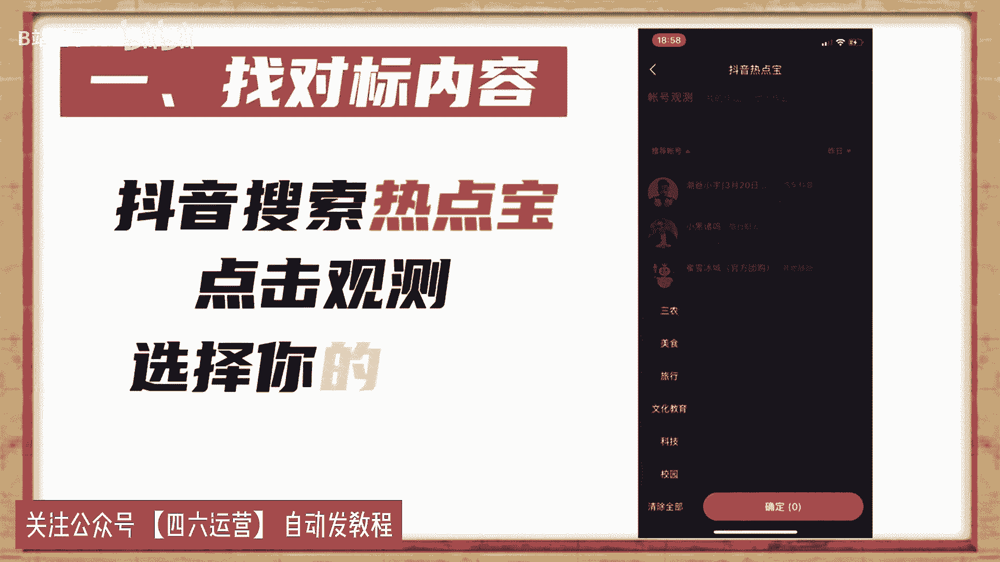
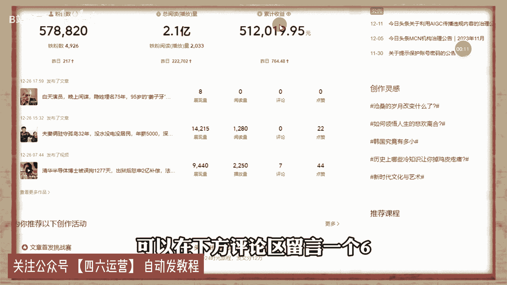

# 2024年做抖音怎么快速起号？5个步骤轻松起号：找账号-定形式-抄选题-测爆款-复制爆款！ - P1 - B站绝了ha - BV1hJ4m137nP

还有谁抖音如何快速起号，并不是打开某某开关就能火，那些都是骗流量的，下面告诉你真正的起号方法，按照步骤操作，你也可以像我这样上热门，首先要搞清楚什么叫做喜好抖音。

有八个流量池，起号的本质就是流量值突破。

至少要达到二级流量池，拥有几千基础播放量才能叫做起号成功，但是99%的人都不会起号，账号不符合系统推荐算法，所以只有几百播放，下面是几号的五个步骤，缺一不可，这是MCN机构内部资料。

建议收藏一找对标内容，抖音搜索热点宝，点击观测，选择你的行业。

找到最近七天涨粉最多的十个账号，然后搜索你行业的热点视频。

点击低粉爆款视频榜，找到最近七天热门的低粉号，这才是找对标最正确的方法，也是最恶心的方法，二确定表现形式，这是需要把对标账号的所有视频看一遍，找一个你能模仿并且超越的表现形式，确定谁来拍，怎么拍。

拍给谁看，我这里选择的是mg动画形式，以此代替真人出镜。

三超热门选题，从对标账号中找七个热门话题，在抖音搜索热门话题内容。

找到三个相关的视频复制链接转化为文字，然后组成为一篇内容。

用自己的理解进行表述，最终形成一篇原创热门文案。

测试爆款，通过定好的形式完成视频制作，每天定时发布一条视频。

连续发布七天，不出意外，必有一条爆款，因为一个新号一般会有三次上热门机会，期间可以购买斗家投达人相似加速测试，结果我复制爆款上热门之后。

粉丝量会暴涨，然后就是复制爆款视频提高粉丝粘度。

这时你就会神奇的发现，你发的视频再也不是三五百播放。

随随便便就是几千几万播放，这是我其中的一个账号，从抖音起号到开通中视频计划，用了三个月左右的时间，现在每天的收入都能稳定在600~1000，只要坚持下去，还是可以赚到一份不错的收益的，如果你也想做。

可以在下方评论区留言一个六。

