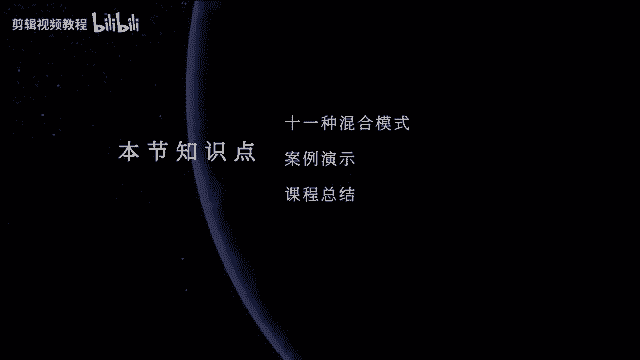
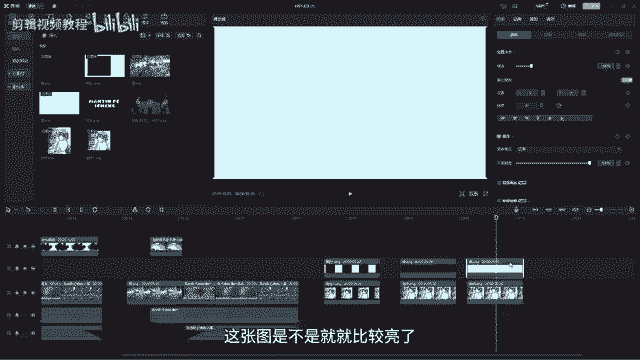

# 2024年做抖音怎么快速起号？5个步骤轻松起号：找账号-定形式-抄选题-测爆款-复制爆款！ - P13：【电脑版】10种混合模式 - 扶摇直下三公里 - BV1Pw4m1S72d

哈喽大家好，那今天这节课要学习的内容的话，那我们先来看一下我们要做的这个案例，I'll be waiting in the shadow of the sun。

Seizing time where no one's been before close the guns，When you waiting for，And now we，Ok。

那这个的话呢大家可以看到啊，就是我们的画面在出现的时候，它是这种水墨晕开的效果，那这个效果的话呢，如果我们要去使用它的话，我们要怎么去做啊，要怎么做出来，那要做出今天我们这个效果的话呢。

我们就需要去先学习我们今天的知识点，就是我们这边的混合模式啊，好那我们先把我们这些素材我们先给它先删除，或者是我们把它重新再复制一份过来，要把我们这个案例啊，Ctrl c，然后呢哎到后面我们再复制一份。

CTRLV好，再粘贴一份到后面来啊，那我们现在就在我们的这个基础上，然后呢来看我们可以看到像我们的画面的话呢，它是一个硬剪的这种效果，那可以看一下。

I'll be waiting in the shadow of the sun，Seizing time where no one's been before close up guns。

When you waiting for，and now they keep对吧，那这个就是我们啊直接剪出来的一个效果啊，那我们要做出像前面这种有水墨晕开的，这些效果，那要怎么去做呢，那这个的话。

我们我们就需要借助我们这里的这个，混合模式来制作啊，那用这个混合模式的话呢，我们可以做出很多非常漂亮的一些效果好，首先我们先进入到我们的本地这边，来把我们今天要用到的一些素材，然后呢先给它都导入进来啊。

OK然后先放进来好，然后放进来以后，那我们现在就开始来这边跟大家去讲解，我们这个混合模式，那我们的混合模式的话呢，它大概的话就由我们这里面啊，123456789十十一啊，11种11种混合模式。

那正常情况下这里面它会显示的是正常，就是我们的素材，它们之间是没有做任何的混合效果的，那我们除了正常之外呢，就是我们呃十种特殊的这个混合模式，那我们这每一个混合模式，我们如果要要一个一个的去学。

一个一个的记的话，那就非常的麻烦啊，那这边的话呢我们来给大家打了三个组，就把我们这个混合模式，然后呢做一个类型的区分，我们把它分为我们的去量组，还有我们的去暗组，还有我们的对比组啊。

首先我们的去量组是什么意思呢，去量组的话呢，其实它就是去掉我们素材当中偏亮的部分，保留暗的部分，我们可以看到像我们现在的这个画面，亮的部分是哪些，是不是画面中呈现白色啊，这种地方对不对。

那and是不是我们这些是不是就是and的，那如果我们要去啊，给它添加混合模式的话，是不是就保留怎么样哎，去掉我们这些比较亮的部分，然后保留暗的部分啊，那比如说我这边就有一张这个图啊。

然后呢我们给它拖进来啊，比如说像这个小姐姐对不对，小姐姐，OK然后呢这里啊，OK然后呢这里这一张图片我们要做一个叠加啊，大家注意我们混合模式它的一个使用方法啊，第一个条件是必须要有两个图层。

然后呢去进行一个叠加啊，就是啊放在一起，然后它才能有混合当个素材，你是没有办法去添加混合模式的啊，OK那么我们给上面的这一层，然后呢去给它添加我们的混合模式，那它这里面的话。

就是我们给它添加上我们的变暗模式，好，大家可以看到变暗模式是不是我们这个图片啊，就是我们刚刚的这张图片，它是不是哎就在我们没有去给它添加的时候，哎这个是暗的，这个是亮的，对不对，哎我们去给它添加以后。

那暗的地方亮地方是不是就被去掉了，去量组完就把亮的地方给去掉了，保留了暗的地方啊，那我们好给它改成变暗，对不对，变暗是不是就给他去掉了，对不对，那如果我要啊，我要让这个画面给它呈现出来的话。

我们就要呃给它变成什么样变量组，那是不是就我们的画面是不是就出来了，对不对好，所以我们的这个去量组的话，就是去除画面当中偏暗的部分，那我们可以拿刚刚的这张图来给大家去演示啊。

那比如说我们在这个图下面放我们的这朵花啊，然后我们放这朵花，OK那我们现在给这个图给它添加上，我们的去按变暗，对不对，那大家可以看到变暗的话，是不是我们最亮的地方那些是不是就给去掉了。

是不是就只剩我们按的这个内容，对不对好，那么我们的这个去量组的话呢，它的类型啊啊这里面的类型的话呢，它有这几种，然后大家可以做一下我们的笔记啊，我们的去量组有变暗，正片叠底颜色加深，线性加深啊。

线性加深，然后呢这四个是我们的去量组哎，那你可以去哎，正片叠底是不是就把好量的去掉了好，然后还有线性加深，对不对，OK还有我们的颜色加深，对不对，是不是就有就把我们的啊亮地方几乎都去掉了。

就只保留我们比较and的部分啊，OK那这个是我们的去量组好，那我们再来看一个，就是我们的去按组，那去暗组的话呢，跟去量组它们两个刚好反过来去按组的话呢，就是把去掉画面中暗的部分，保留亮的部分。

那比如说刚刚我们的这张图，刚刚我们这张图我们导入进来的时候，对不对，导入进来的时候，它这边是亮的，然后这中间这一块是on的，那我要让它跟下面的这个图片啊，让他们俩合在一起的话呢。

是不是哎我要去掉画面当中啊暗的部分，然后呢保留亮的部分，对不对，OK那么我们就要选我们的去按组，OK缺样组的话呢，有我们的绿色变亮啊，颜色减淡啊，绿色对不对，绿色是不是就把我们的黑色部分给它剪掉了。

那我们这个图片有点点歪啊，我们可以调一下它的位置，然后呢这种去调一下它的位置哎，让它尽可能的保留在我们的画面中间啊，这样更好看一些，对不对好，然后那你也可以去加一下其他的，比如说我们的变量。

找一下我们变量变量对不对，是不是就没有变化好，然后还有我们的一个叫颜色减淡哎，颜色减淡，那这个的话呢是我们的去暗组，那去暗组的话呢就是跟去量组，它俩是反过来的啊，那第三组叫什么呢，第三组的话呢叫对比组。

那对比组的话呢，它相比于我们前面两个呃类别来说，会比较的难记忆一些啊，对比组的话呢，其实就是把上面两个图层叠加在一起，去掉我们的中性灰，然后呢让暗部更暗，亮部更亮，比如说我在还是一样。

我把这个图脱下来好，大家可以看到我现在拖这张图，然后呢，哎我现在给这个OK给这个添加上一个比较on的，这样的一个背景，对不对，那我现在就给它添加一个叠加，Ok，那这样的话。

大家会发现我画面当中是不是就比较暗，然后就哎加之前跟没加之前，大家可以看到是不是去掉我们的中性灰，然后呢让我们亮的地方呢啊继续亮，然后暗的地方更暗啊，OK那那我再把这个图再拖到我们的时间线上啊。

OK然后呢我再给它加一个，比如说这张图，这张图是不是就就比较亮了。

好然后呢我再给这个图片，然后呢再给它添加一个叠加，那像这个画面，是不是就会出现这种比较爆的这种感觉，对不对好，所以当我们的这个什么唉，我们两个图片叠加在一起，那么我们混合层如果是比较偏暗的话。

那么画面当中呈现的就是怎么样哎就会更暗，那如果我们的混合层比较亮的话，那画面就成比较曝光的一个状态啊，所以这个是我们的对比组，那对比组的话有哪些呢，对比组的话有我们的叠加，还有我们的强光啊。

还有我们的柔光啊，那就我们这三个啊，三个学会运用了我们的这边，它的这个混合模式以后，那么我们要去做我们之前的这个案例，是不是就比较简单了，OK那现在我们就给大家去演示一下，我们的这个小案例啊。

首先一开始的时候我们这个水墨对不对，这个水墨它要出来，那我们直接在素材库这里面啊，素材库，然后呢在这里面我们直接搜这个水墨对吧，水墨镜头水墨啊，我们直接搜水墨就可以了啊，水墨好，对对。

然后这里面就有很多很多这种镜头，那有好几个啊，那你就随便选一个，比如说我们就选啊，像这些对吧，像这个是不是就很好看，好脱下来啊，脱下来放在我们画面的上面，那我们先来观察一下我们的这个画面，画面当中啊。

然后呢它只有两个颜色，对不对，只有两个颜色，然后呢只有暗部和我们的亮部，那我们再给他选混合模式的时候，我们选哪一种啊，哎这个时候我们就要选的是我们的去on组，对不对，我们要让暗部的地方给它去掉啊，变调。

那这个时候我们就选绿色好，那我们现在添加了绿色以后，我们现在来看一下啊，就冰冷的SHADO，对不对，是不是就已经有我们这种水墨晕开的效果，大家可以看到啊，哎我们用了我们的去暗组以后。

是不是我们黑色部分是不是就被去掉了，就保留白色部分，就像我们的画面就像水墨一样，这种晕开对不对，OK然后呢我们再找一个啊，再找一个然好看一点的，再把后面的也弄上，OK然后再加上我们的这个好，对不对。

然后这个时间在那现在这个要加哪一个，是不是也是一样的，也是一样，我们是不是要去给它添加上我们的绿色，对不对，好绿色啊好，然后呢，One's been before，是不是就有我们的这个水墨荡开的效果。

那这个效果是不是就做完了好，然后呢，这里面的给大家就是这里面的话呢，给大家嗯一个小小的总结啊，那就是呃就相当于是一个学习的小技巧嘛，就是当你的混合层有比较深的颜色，比如说有黑色。

那其他的不管是白色还有其他颜色对吧，白色其他颜色只是只要是我们画面当中，黑色占的比较多，那这个时候你想都不用想，直接用我们的去按组哎，就是用我们的绿色或者是我们的变量对吧，绿色变量还有我们的颜色减淡。

直接用这个组合去使用呢就可以了，那如果我们的混合层哎亮部比较多，然后呢我们就用我们的去亮组，那如果我们的混合层是纯色，或者是不是很明确的颜色啊，那这个时候呢我们就可以用对比组，或者是我们就直接不要用。

那我们的对比组的它的一个使用方法，相对来说还是比较少的啊，那我们用的最多就是我们的去暗组，还有去量组，那这个的话呢大家就哎自己下去，然后呢自己去体验一下呢，那就可以了，好那今天的这节课我们就先到这里。

