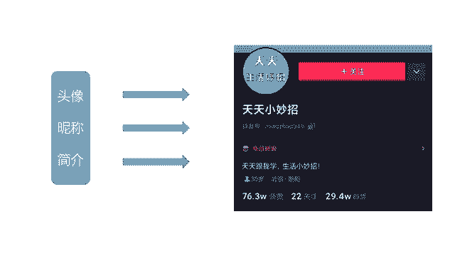
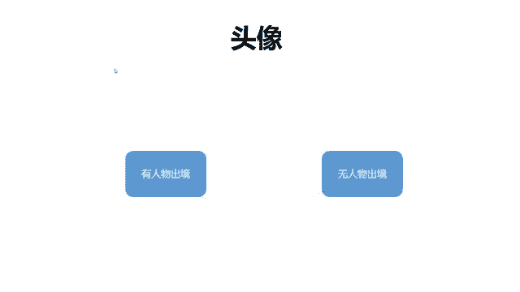
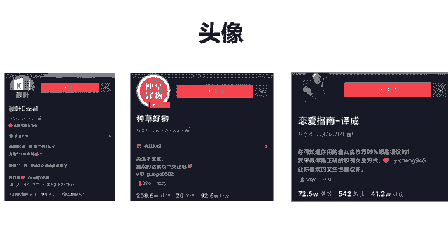

# 2024年做抖音怎么快速起号？5个步骤轻松起号：找账号-定形式-抄选题-测爆款-复制爆款！ - P13：账户头像和昵称 - 1春风知我意 - BV1L33qenERW

啊那么好，我们就一个一个来讲，一个一个来讲，那头像怎么去选择啊，昵称我们的头图以及简介啊，它都有什么样的标准，对不对，它也是我们账号搭建啊，最最基础最最重要的一步。

好吧，我们来先来看头像，啊，那么头像其实是根据我们的内容定位，去做选择的，比如说你的内容里面有人物出镜，那你的头像最好就是出镜的，这个人去做头像就可以，如果说无人物出镜了，无任务出境。

那可能有你一些关于你的行业关键词啊，比如说音乐美妆医疗，对不对，什么恋爱，那这是无人物出境的，无人务出境基本上都用什么呀，文字或者是风景，基本上就是这两种，那么我们可以看一下啊。

来这里给大家举到了几个例子，你像第一个是秋叶啊，秋叶的这个PPT啊或者excel啊，它都是啊就是比较有名的一个办公软件的教学，所以说他的头像呢直接选择的就是excel这个图标，大家看到了吧。

如果你做的是pr教学或者是什么PS教学啊，那么其实你可以把这个图标就直接放在这里啊，那包括说这边还有好物种草，好物种草，可能就是啊就直接使用的是这个文字对吧，那么第三个呢就是这个恋爱指南。

恋爱指南他是直接使用了这个人物的头像，这个人物的照片作为头像可以看到吧，所以说有人物出镜的话，最好是选择直接这个人作为头像就可以，你看尤其是像第一个像秋叶，他的这个头像就非常的能够传递价值啊。

我看了之后呢，我是很想关注他的，因为我觉得他早晚对我有用，因为我是呃一直在上班，我不是上一天班，也不是上两天班，对不对啊，所以说我觉得我关注他之后，万一有一天我遇到了哪个数据不会算。

我可能就会想来看一下啊，包括说PPT教学什么的啊，可能你们现在看见pr教学也会想要关注一下啊，都是这个道理好吧，那么咱们做头像的话啊，也是有几个禁忌的，有几个禁忌点需要去跟同学们说啊。

第一就是它不要过大或者过小啊，就是要适中，排版适中，尤其像这个种草好物啊，他做的就比较好，排版适中，另外就是关于人物的话啊，如果说他的脸太大，他就直接怼在这上面了，他的视觉效果就不太好，那如果太小呢。

我们又看不清这个人了啊，这个是要注意的，而且最好不要用人群的照片，比如说一张照片里有六七个人去做头像啊，这样是要避免的，最多的话就是两个人的合照就可以了，两个人的合照。

那这个大家可以就是稍微注意一下好吧，这个也是比较简单的。

那接下来我们再讲昵称这一块啊，昵称的话呢嗯他其实要突出的点有那么几个，我们先来看看啊，给到大家的几个例子，看瑞普PPT的教育学什么美妆师咕咚，还有跟蒋晖学电商啊，这三个其实你一看你就明白了。

这三个都有什么特点，就是我一看他的昵称，我就知道他是做什么的，你就像刚才咱们说的那个赫敏酒，还是喝酒敏来着，你看我一直都没记住他，你像这种你就不知道他是干嘛的对吧，那所以说他其实吸粉能力是比较强的。

你对这个行业有需求，你就会关注他，这个是一定的，所以其实他们的粉占比啊都很好，你可以看一下，你们可以计算一下，像这个瑞普PPT的粉占比，大概是2。2。3比一吧，然后美妆师的话呢，他是一个八比一。

那一会再讲他为什么八比一，然后跟学辉学电商啊，跟蒋辉学电商啊，这个是嗯2。5比一差不多对吧，他们的粉占比都是不错的，那么一般我们去看粉占比呀，就是比较好的啊，比较好的是什么呢啊。

当我们去看竞争比较激烈的行业的时候，比如说美妆美食，他们比较好的粉占比就是做到七比一，八比一就很不错了，就比如说我们刚才看到的这个什么美妆师，咕咚，对不对，他这个他这个粉黛比做到了八比一。

其实是很不错的，因为现在美妆这个行业，在抖音里面竞争是非常激烈的，非常激烈，那么小领域的话，比如说像电商，像PPT教学，像什么啊，就是pr教学这种领域比较小的话，可能做到四比一，三比一。

二比一是比较好的一个比例，大家其实可以对照着自己去看，对照着跟自己去看，所以说其实你会发现它的昵称，他的这个头像，他的简介写的比较好，之后，他是有强吸粉能力的啊。

就是跟那个赫敏酒啊形成了一个比较大的反差，对不对，那他的音乐行业，现在他可能做的是十比一啊，它的粉蛋比是比较差的，好吧好啊，那么我们接着往下看哈，可能有同学会想啊，老师有没有说赞少粉多的。

你们会有这种疑问吗，因为我们一般看到哈都是这种获赞，都是一一千多万一百多万啊，然后呢他的粉丝是70多万，一般都是粉丝要比赞要少的，那有没有这种啊赞少，但是粉丝多的情况有没有啊，其实也是有的。

我这里简单给大家介绍一下，大家作为一个了解就可以了好吧，可能有同学说老师我看到有些人他有3000个赞，但是呢他竟然有30万粉丝，那这中间悬殊的很多，为什么会出现这种情况哈啊这种情况是有的。

而是因为他可能把之前比较火爆的视频，或者点赞量比较高的视频，他给删除了，可以删除了，但是通过视频他确实积累了一部分粉丝，就会出现这种赞少粉多的一个现象啊，这是我们说啊三千三千赞，为什么有30万粉。

那还有一种情况，可能他只有七八千个赞，他有1万粉丝啊，有没有遇到这种情况，哎好像有点接近一比一的那个粉占比的比例啊，但是还不是他的赞明显比粉丝要少，那么这种情况是为什么呢，就说明这个人他比较爱开直播。

他吸引粉丝的途径呢主要是以直播为主，而不是以他的作品为主，那这个时候其实啊我们可以想一下啊，或者是你想一下，你最近有没有关注一些带货的主播，这带货的主播的话会有这种特点，带货主播的账号一般不会发什么。

特别有意思的一些视频内容，它主要以依靠这个开直播吸粉为主，所以说他们可能会出现这种啊赞相对比较少，那粉丝会比赞稍微多一点点，这种情况好吧，这基本上就是这几种情况了啊，大家其实可以多关注一下啊。

如果说想了解的话呢，啊可以去自己看看好吧，那这个的话呢就其实没有什么可分析的，这个就不用学了好吧，那还有一种情况可能就是别的平台的大V，别的平台的大V就是他迁徙过来，迁移过来，他会带着粉丝过来啊。

尤其是像抖音，还有今日头条，它是一个打通的状态，抖音和今日头条打通的状态的话，比如说你今日头条上有30万赞，它可能在抖音上也会显示30万赞啊，但是其实你抖音上没有发什么作品啊，所以就是导致什么呀，啊。

就是我们会看到他的粉丝来源，基本上都是来自于今日头条，而不是抖音的作品，就会出现那种赞比较少的情况，好吧啊，这是这几种情况啊，基本上有1233种情况吧，啊简单给大家介绍一下，好吧啊，那么啊取昵称的话呢。

建议啊就是有三个建议，第一就是我们在取昵称的时候，里面要有行业的关键词，比如说啊PPT是一个行业关键词，还有什么美妆，它其实也是一个行业关键词，还有什么电商，它也是一个行业关键词，对不对。

这是第一个要点，第二个我们可以在里面加入一些人设啊，比如说像这个美妆师咕咚，他是一个人，对不对，要把他给突出，还有就是跟蒋晖学电商，蒋辉他也是一个人哎，在里面加入你的行业关键词，加入你的人设，对不对。

这是第二个啊，有人设，那么第三个呢最好是能够体现你的价值啊，这个是什么意思啊，体现价值的字眼是什么，我们看一看教学对不对，哎学你看这些字眼就非常体现你的价值，你过来我能教你，你能学会，对不对。

这就是我存在的价值，我为你服务的，这就是第三，这就是我们说的三点哈，稍后会给大家总结一下啊，这就是关于取昵称的哎几个小点需要注意，那么我接着再往下讲啊，我们头像讲完了，然后昵称也讲了一下。

其实嗯大家如果说细心一点去做的话。

