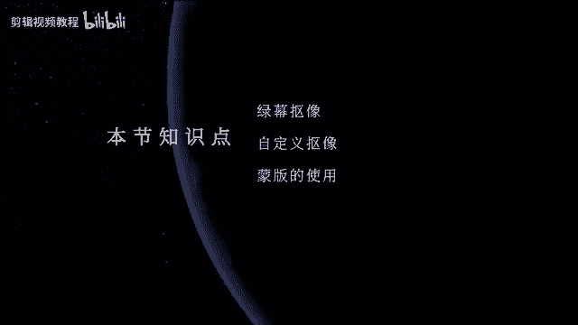
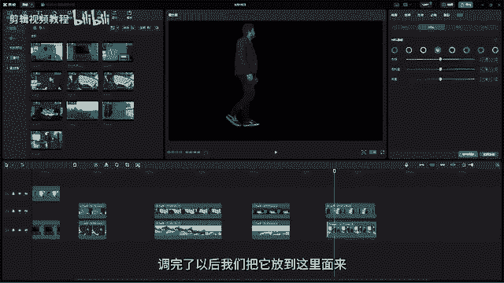

# 2024年做抖音怎么快速起号？5个步骤轻松起号：找账号-定形式-抄选题-测爆款-复制爆款！ - P14：【电脑版】抠像和蒙版 - 扶摇直下三公里 - BV1Pw4m1S72d

嗨欢迎来到我们剪映PC教程，那今天这节课我们要来学习，我们剪映里面非常有趣的两个工具，我们先来看一下今天要制作的效果，OK我们可以看到这个视频里面，有很多不可思议的地方，首先第一个镜头。

这个人他直接从电视机里爬出来了，对不对，那我们在现实生活里面，我们能够做这样的一个行为吗，那肯定是不行的，这个我们人是没有办法从电视机里面爬出来的，对不对，OK那这是一个。

还有一个就是哎这个人他直接无实物托举，对不对，然后就把我们的这个好这个锤子，然后呢拖上去了，好我们可以一起去思考一下，那我们要去做出这样的一些效果的话，我们需要怎么去操作，对不对。

好我们可以看到就像啊这个人有个魔法，然后操控这一把锤子一样啊，那我们所有的这些效果的话呢，哎看上去好像都充满了不可思议科技感，还有我们的模仿，那如果我们要去制作的话，其实它并没有那么难。

甚至是很简单很简单哦，那在剪映里面我们只需要用两个工具，然后呢我们就可以实现我们今天的这些效果，OK那是哪两个工具呢，首先我们先打开剪映啊，打开剪映，我们先把素材先拖到我们的时间线上。

那这个时候呢我们直接选中素材，在我们的控制面板这边，我们今天要学的就是我们的好基础，面板旁边的这两个，一个是抠像，一个是蒙版，那我们就先来看一下我们的这个抠像，OK那抠像的话呢，其实从字面上理解。

顾名思义就是把人物把把像给抠出来，对不对，去抠人物的像，然后呢那我们抠像的话呢，其实它有很多种方法啊，然后用过PS的应该都知道，我们可以用干皮工具啊，套索工具去把人物给抠出来，那还有一种非常快速的抠像。

就是用我们的色块抠像，什么叫色块抠像，就是我们在拍摄的时候，我们只要把人物置身于一个纯色的背景，当中那我们在抠的时候，只需要吸取这个背景的颜色，那我们是不是就可以把人物给抠出来了，比如说这个人物他要拍。

他在电视机里爬出来的这一个动作，那他只需要去搭建一个，类似于电视机的这样的一个场景，然后呢，唉把他自己完全置身在我们的这个，绿色的幕布当中，OK然后呢那我们直接用色块或者是我们去吸色。

直接把这个绿色给它抠掉，那人物是不是就已经完美的抠出来了，OK周边的这些的话呢，我们只需要把这个绿幕之外的内容给它删除了，就行了啊，所以抠像的话呢会非常的简单，在我们的所有影影视里面是非常非常常用的。

OK那我们的素材里面的话呢，这边也有一种叫做绿幕，大家可以看到这里面就有很多，对不对啊，这些他就是利用我们的这种绿幕素材啊，OK啊，比如说这个恐龙啊，把这个恐龙脱下来对吧，然后呢。

那我们现在要把这个恐龙啊，给它放到我们的这个电视机里面，刚刚我们不是在这里面有一个电视机吗，好我们把这个恐龙我们先抠出来，OK用第一个色度抠像，把它前面的这里开启，点开好，点开以后。

我们用这个吸管去吸一下画面当中的颜色，大家注意，我们的背景一般都是纯色啊，我们去吸，那我们去吸一下，好吸一下，然后呢我们调一下强度好，那这个时候大家会发现没有，唉。

我们是不是就已经把这个恐龙给它好调出来了，对不对，唉大概给它抠出来了，OK然后呢再调一下阴影，有些地方没调干净的，我们再来调一下啊对吧，是不是就调出来了，好调出来以后，我们把这个这个电视机放到这里好。

再去调这个恐龙的一个大小啊，好我给它缩小一点对吧，还给它放到电视机上，对不对，电视机上我们甚至可以给他做一个，做一个运动啊，那我们上节课不是给大家讲了一个，就是运动关键帧吗，我们已经讲了，对不对。

所以我们可以让恐龙在这个地方的时候，我们给它打一个关键帧好，然后呢等到这边的时候，哎它让它做一个向前慢慢移动的一个过程，唉还要走到这边来，对不对，那我们来看一下是吗，那现在这个恐龙是不是。

就已经在我们的电视机里面，然后并且从这边往这边走，对不对，OK那这个就是我们的一个绿幕抠像啊，绿幕抠像，OK那比如说像这个，可不可以把这个恐龙也放放进来了，可以啊，我们用色度抠像好。

吸取一下中间的这个绿色，然后呢哎把它抠出来，对不对好，然后呢我们把这个恐龙给它放到最下面来对吧，然后呢那这个时候我们再来调一下它的大小啊，对不对，OK然后我给他放到这来好，然后呢现在这个恐龙它就怎么样。

哎它就从这个里面是不是就开始走出来了，对不对，是不是就走出来了，是不是比较有意思啊，所以我们的第一个色度抠像，抠的是我们的颜色好，然后呢我们现在再来看一下我们的第二个，第二个的话呢叫自定义抠像。

这个自定义抠像的话呢，其实跟我们的这个啊绿幕抠像的话呢，它是差不多的，OK我们也是一样，在我们的素材库这绿幕，然后我们随便找一个对吧，比如说我们把这个OK杰瑞给他弄出来啊。

然后呢把它啊音乐可以先给他关小一点好，然后那我们现在在这里面啊，这里有个自定义抠像，那自定义抠像的话，我们点开它以后，它这里会有三个功能，那这三个功能的话呢，第一个叫智能画笔，那这个抠像的话呢。

跟我们色度抠像它是不一样的，色度抠像的话我们去吸取它的背景颜色，那这个智能抠像的话呢，其实我们去吸什么呢，我们把我们的人物抠出来就可以了，比如说我们可以看一下这个啊，这个对吧。

这个呃JERRY它是这样子的，那我们直接用我们的智能画笔，在我们这个杰瑞身上去画，那这个时候你画一笔以后呢，哎他就被选出来了啊，那这个时候呢我们杰瑞是不是就给画出来了，对不对，好画出来了以后。

那这个时候你点击一下应用效果，那这个时候我们的杰瑞是不是就被抠出来了，他跟我们上面这个色度抠像的原理的话呢，是一样的，但是呢下面这个自定义抠像，它可以抠更复杂的一些画面啊。

比如说我们在这里再找一些素材啊，好比如说我们就用这个对吧，就用这个这个哈哈哈，OK那比如说像这个，我们把他的这个声音给他调小一点，OK然后我们声音不需要啊对吧，哎那现在大的话呢。

它的背景已经不再是这种纯色的，比如说它的背景是这种比较杂乱的，那我要去抠它，那我们用第一个啊，用第一个色度抠像，是不是就抠不了了，所以我们可以用自定义抠像，这个自定义抠像的话。

就是我们只需要把人物主要人物给它抠下来，就可以了啊，比如说我们现在用这个自定义抠像，把这个人物画画出来，对不对好啊，这种衣服对不对好，这个时候它会自动的把人物给它描出来啊，像这些少一点点的。

OK弄完了以后呢，嗯然后点击一下应用效果，那是不是现在我们这个人物是不是就抠出来了，好然后呢我们给它加一个背景，比如说我们刚刚不是好有一个电视机吗，依然把它放到我们的电视机里面，OK然后放到上面来。

那现在我们再来调一下它的位置，好缩放，OK等放到我们的呃电视机上对吧，那像是我们这个人，是不是就已经在我们的电视机呃，电视机上面了，好调一下，不要让他穿帮，对不对，是不是就已经啊。

你可以任意的把它放在你想放的地方啊，好然后呢，那我们自定义抠像里面，它这里还有个什么字，能橡皮擦，还有我们的这个什么啊，橡皮擦等等，那这个的话呢，其实就是相当于我们在抠的时候，需要去做一些调整啊。

那我们再找一个，比如说在在好，在再找这个吧，这个比较火的这个what what对吧，好，我们给他脱下来啊，也是一样，脱下来好好，那这样脱下来以后我们也是一样用智能抠像，然后呢好我们先给他哎。

整个人给他描出来对吧好，先把他的整个人物好，先给他描出来，OK那描出来以后，那有的时候比如说我们一一个不小心手抖了，我们会把旁边的这些给它描掉，对不对，那这个时候怎么办呢。

我们就可以用这个智能橡皮擦去修好，把它比把我们描多的地方给它去掉啊，比如说你在里画的时候，你不小心哎哎手抖，然后是不是把旁边的这些不需要抠的，你都给它画出来了，这时候你再用智能橡皮擦去给它擦掉。

OK画一下它就自动的诶，画一下是不是画一下好，这个也是这样好画一下它是不是就自动的，然后呢就把它取消掉了，那这个橡皮擦也是一样啊，这个橡皮擦也是一样，OK然后呢去擦好，中午去查。

那这个的话就是你需要呃差多少，你就弄多少啊，那我们这边的话呢会更加智能一些对吧，这里他的头发是在这里啊，OK弄完了以后也是一样啊，点击应用，那我们这个人物是不是又抠出来了，对不对好。

然后我们我们也是一样啊，我们给他呃找一个背景给它放进去啊，比如说看到这样的一个好嗯，这个选一个对吧，哎要换一个这种这种背景好啊，给他放进来对吧，还像人物是不是就给他换了一个背景。

OK那这个就是我们的自定义抠像啊，那可以抠复杂的这种背景啊，那这下面这个的话呢叫智能抠像，智能抠像的话，大家可以看到它这里是有一个条件的，就是说当前仅支持人物图像的智能识别，就说明它会它是自动去识别。

我们这种有人物的镜头，它才能去识别，那比如说像有一些镜头，它就是没有人物，怎么办呀，哎呢哎像像像这些我抠这小动物，对不对，哎那小动物它又不是人，哎，那要怎么去抠它呢，对不对，比如说抠这只熊好。

我们拖过来啊，拖过来，那我们这个时候用智能抠像它就用不了了，那我们就只能用自定义抠像，对不对，自定义抠像，那用智能抠像的话，我们可以哎比如说有人的好有人，然后我们找一个有人的啊，我们来试一下。

好比如说这个有人对吧，那我们来看一下，他能不能把我们的人物给他抠出来啊，好然后智能抠像，OK这个时候他正在处理哎，是可以的，对不对，哎，只要有人就可以啊，那我们这只熊我们也可以看一下能不能抠啊。

对吧哎大家可以看到我们这只熊，是不是因为这个熊它有黑色，所以它会把它给抠掉，对不对，好啊，大部分保留下来，但是这一地方就被抠掉了啊，比如说你给他换一个背景，你就会发现啊这个熊它的身上会被扣掉一些。

看到没有就被抠掉了，对不对好，所以我们这个智能抠像它只能去识别人物，它的一个工作原理的话，其实就是去识别人物的五官，然后呢通过人物的五官，然后去识别整个人物的一个动作啊，那所以这是智能抠像。

大家注意用智能抠像的话，仅限于有人物的镜头，如果没有人物的话，我们就只能用自定义抠像，你想保留哪个，你自己用这个画笔去画了就可以了，OK那这个就是我们抠像的三个功能啊，那都是非常常用的。

OK那我们再来看一下蒙版，那蒙版的话呢也是非常非常用常用的一个功能，它可以用来做这种，比如说我们的两个镜头，你想要让它合在一起，那比如说我在这边啊，我在这边我再找一些这个素材啊，OK比如说这个对吧。

这个这个镜头啊，好，然后呢，这个镜头如果这个镜头我想跟这个给他啊，就给它放在一起，比如说我想把这个镜头，它的天空给它换成我这个镜头的天空对吧，我想给他换成这种卡通的，那怎么办呀。

那我们这个时候我们就可以用这个呃，我们的蒙版，然后呢给它抠出来，比如说我们可以看一下啊，下面这个我们是要干嘛，我们是要去掉天空，对不对，那么这个时候如果你再用我们的哎，前面抠像的话，就不是很很好用了啊。

因为它呃这个都是一些森林啊，然后又没有绝对的主体，然后就很难抠，这个时候你直接用蒙版的话就行了，比如说我们现在用蒙版，我们直接用线性，那线性5号它就是这种啊，它就是这种啊，竖着勾的，对不对。

然后这里有两个功能，上面这个的话呢去拖它的羽化值，让它哎更加的柔和一些，好这个的话就是旋转，我们刚刚这个镜头是要怎么样，我们要把天空给它去掉，对不对，好天空去掉，然后再在，OK然后给它旋转过来是吧。

然后呢再给他拉一点羽化值，OK然后呢弄完以后我们把它放到上面来，好，我把我们的呃这个月亮图给它放下面，OK我们先要给下面这个也给他扣一下，好，我们抠抠什么呢，我们现在把它上面好扣一下啊。

旋转让他们两个差不多对齐，对不对，而给它对齐，OK然后呢这种对齐我看一下，下面这个是旋转了多少度好，175，OK然后我们给他拉羽化值，让他们过度自然一点啊，好然后呢上面这个，那现在我们可以看一下。

是不是两个镜头就合在一起了，对不对，哎刚刚下面这个还是我们的这个蓝天白云，下一个镜头，是不是就我就给它放到一起，那这种的话呢也属于抠像，对不对，用我们的蒙版来进行抠像啊，那这个是线性抠像，线性抠像啊。

那还有一个是镜面抠像，镜面抠像的话，我们啊稍等对吧，好，然后呢我们再换换一个其他的镜头，比如说我们就换这个嗯，呃比如说我们嗯用这个对吧，我们用这个这一张图啊，那我们用来做镜面抠像，好镜面。

那这个时候的话呢，他就是其实就是两边夹击的这种方式，然后去进行抠的，OK然后呢你可以给他拖拖远一点好，然后呢给他换一个背景，对不对，OK然后比如说我们就给他好，哦这里是一首歌啊。

我们再来给他找一个其他的素材，好比如说我们在找这个好，给他放在两个合在一起好，下面的这个对吧，下面这个镜头我们也给他好呃，来一个镜面，哎让他们两个这种合在一起，对不对好，OK上面这个给他往上一点对吧。

是不是又把两个镜头又这种完美的合在一起了，对不对，OK这个是线性啊，线性抠像，那还有一个是圆形，那圆形的话其实就是啊给它啊，呃弄成这种圆形啊，那旁边这里也是一样，羽化值拉一下啊，拉一下对不对。

拉大一下好，这个是矩形，矩形啊，这是矩形，然后呢也是一样啊，去调它的对吧，调它的这个像一个正方形一样啊，然后呢大家可以看到这里面矩形的话呢，它有一个比较特殊的一个地方，在于好，这个是羽化，这个是旋转啊。

那这个是什么东西呢，这个的话其实就像是圆角一样，那我们现在的这个矩形的话，它的边缘是比较的哎，生硬的，大家可以看到对吧，比较生硬的，那如果你想让它圆一点，让它更好看一点，你去调这个。

那这个时候你调这个圆角的时候，哎它是不是就会更好看了，它的画面对不对，好，所以我们的这个矩形里面，它多出来了一个圆角功能啊，圆角功能好，然后呢那这个叫我们的爱心对不对，爱心啊就可以抠出一个爱心的图片啊。

好然后这个是星星，对不对，星星啊，那都可以去调成你喜欢的，那就行了啊，呃呃我们来看一下下面它这些参数啊，那这些参数的话其实就是去调蒙版的一个位置，对不对，好调蒙版位置你可以直接拖。

也可以直接在这里去调它的参数啊，那这个是旋转，对吧啊，这是旋转，你可以调啊，这种去旋转，那这个是它的大小唉，可以让它变大啊，那你直接拖它这个边框呢也是一样啊，OK下面是羽化值，对不对。

羽化值那其实也就是调这个啊，所以如果你在啊添加模板的时候，你要给它添加羽化值大小等等，那你想调参数也行，你想直接在它的这个边框上去拉的话呢也行啊，OK那这个就是我们的蒙版。

那那我们现在啊现在回到我们的课程案例上，我们一起来把这个案例做一下啊，我们这个课程案例的话，它需要结合我们的这个好蒙版，还有我们的抠像，然后呢一起来制作，首先我们先来看一下像这个人他出来对不对。

他出来了以后，他周围是不是都是一些绿幕，那我们直接先在抠像这个地方，我们先可以啊，大家可以直接选自定义抠像啊，比如说我们选自定义抠像好，先把人物给他哦，画出来好，然后呢再把这个音响也要画出来啊。

旁边的桌子对吧，哎也要保留啊，OK那我完了以后点击应用，那是不是我们这个人是不是就已经扣好了好，然后那我们直接把它放在我们的电视机的上面，大家注意背景层是要放在下面的啊，背景层要放在下面。

OK那么我们现在这个人物他出来以后，他有一点点穿帮，对不对，那我们把他的一个位置给调一下啊，OK进入到基础这边，然后呢哎把它位置调，但要注意把它把他的手啊，拖到跟我们的电视机诶，刚好搭在我们电视机上面。

这样的话就不穿帮了，对不对，那其实大家会发现一个问题，就是我们用这个自定义抠像的话呢，它会有一些绿色的窗帮好，所以这个地方我们不需要这个自定义的话，我们用什么呢，用色度，OK用色度。

我们先来把它的这个先取下来啊，就是先把它的呃这个颜色取下来，然后然后呢给他先抠掉，对不对，先抠掉那周边这些房间怎么办呢，我们用蒙版，这里面用一个这个矩形蒙版，OK然后呢哎把他拉上来，对不对。

好大概的那种这种拉一下啊，拉一下好，然后呢那大家注意这里面你千万不要这种哎，哎给它诶可以矩形这种圆一下，好好再再下来一点点对吧，那这样的话我们这个人物是不是哎，从画面当中好，然后呢这种好爬出来，对不对。

OK然后呢这里面有点不太够啊，好整体往下移一点点，OK那这样的话是不是就扣好了，对不对，好人物啊出来，然后呢还它周边还有一点点这些啊，绿色的不是很好看，那我们给它加一个调色啊，调色对不对。

调色我们之前是不是就给大家去讲过了，那我们直接进入到我们的色相饱和度，还有亮度这里面选择绿色，然后呢把绿色的饱和度降低啊，那这个五它它的背景是不是就没有了，好亮度来降低好，那这样的话。

刚刚绿色那些穿帮的效果是不是就没有了，OK然后人物是不是就哎从电视机里爬出来，这个效果是不是就做完了好，然后这个是我们的第一个镜头啊，那我们再来做第二个镜头，就是啊这个锤子好。

这个锤子的话呢拍摄就用一根线啊，然后呢给它吊起来，然后同时把他的背景啊放放在一个橙色的呃，这个狼狼部里面好，然后呢再拍一个镜头，就是一个人在那里哎，装模作样的做了一个这样的动作，对不对。

那我们现在先把我们这个锤子先给它抠出来啊，那这个的话呢呃我们直接进入到抠像这里面，我们可以试一下自定义抠像，好把锤子勾出来，好这个这个地方啊，那你可以放大一点对吧，好把我们的好画面放大一些好。

然后呢呃智能抠像，那这一多出来的啊，用这个橡皮擦好，橡皮擦给它擦掉对吧，哎多出来的这些啊，擦掉这个也是擦掉啊，OK然后呢这个给他拉回来，对不对好，OK然后呢擦完了以后，我们点击应用。

那我们锤子是不是就出来了，好这里面还有一点点这个蓝色，我们再点击一下色度好取色器，然后我们来取一下这个好，取一下这个蓝色对吧，那现在是不是这个锤子是不是就已经弄好了，对不对，哎就已经抠好了。

并且扣的很干净啊，那我们现在把这个人给他放进来，OK好这个人啊，他已经放进来了啊，好我要给它拖到下面来，OK那出来了以后，那我们这个锤子它不会动啊，哎用什么方法呢，我们之前的课程里面不是讲了关键帧吗。

我们这里给他做一个关键帧动画就可以了，好首先人物的手是从什么时候开始起来呢，OK从这个地方开始起来，那么我们在这个地方我们就给我们的锤子啊，给锤子，然后呢加一个位移的关键帧动画啊。

首先我们先哎在这个好点击一下，然后呢把我们的这个好诶这个往下移对不对，OK然后给它往下移好，然后呢，哦我们这个人物的手起来到这个地方的时候，我们把这个好锤子给他啊，拎上来对吧，那我们现在可以来看一下啊。

哎他这里面有点快，我们可以给它往前拖啊，对不对，然后呢他旁边这里还有一个他的手，还是这种这种动画啊，那我们可以再动一下，比如说他这里面动一下好，这里再加一个关键帧，点击一个关键帧，然后呢，这里面啊。

这个关键帧的话是用来定这一段距离啊，就这一段内容的好，这里面它又往下一点点，看到没有，它往下一点点，我们再把这个好，首先OK然后呢他再往下啊，然后呢我们再把这个哎再往下一点，对不对，是不是就它它往上。

然后再往上往下再往下，对不对，哎，做一个就锤子，跟着他手部移动的这么一个动画啊，好然后呢做完了以后，那这个颜色啊就是还是一样啊，我们这个锤子的颜色呢有点亮啊，画面其实整体是比较偏暗的，好进入到我们这边。

好在我们的曲线这里面，还给锤子的亮度给它降低一点，让它跟我们的背景更加的哎贴合啊对吧，更加贴合，那这样的话是不是就做完了，OK那我我们的第二个动作呢就做完了，第三个动作是什么呢。

第三个动作在车里面开车是吧，在车里面开车，那也是一样啊，我们可以看到两段素材啊，一段的话就是在车里面啊，这个人在车里面，然后外面弄成绿布啊，绿布，然后呢，哦背景的话就是哎拍了一个这种单纯的对吧，好啊。

单纯的这样一个向向上哎起飞，然后摇晃的镜头，OK那么我们现在先给这个人物啊，我们先把它的这个抠像，我们先给它抠出来，这个的话呢你用我们的色度，或者用我们自定义都可以啊。

那我们很多时候呢会色度加自定义一起来用，会让我们的画面扣的会更干净一些，比如说我们用自定义好，先把整个人物给它哎画出来啊，啊那这个就比较容易画了，包括车里面的内容，对不对，好车车车车啊。

这些全部都画出来啊，画出来，然后专门把绿色给它抠出来，OK那现在好了以后啊，这里面多了一点点好，用这个好，把这个，对啊，这里面有一点点多啊，有点多，OK然后呢弄完以后好哎这种去弄一下好。

然后呢他还有一些绿色，对不对，还有一点点的这种绿色，抠的不是很干净，在来色度里面取色器和取一下我们的绿色啊，取一下绿色，对不对好，然后呢再抠一下啊，抠一下，这里面大家注意，抠的话，这边就会出现穿帮啊。

所以呢我们就不用去不不去那样抠，我们给它进行调色还是一样啊，进来到我们的呃色相饱和度里面，选择绿色色相，把它的饱和度降低，那这样的话是不是就哎，刚刚窗帮那些内容是不是就没有啦，好亮度也降低啊。

那再把我们的这个画面好放进来，那这两个画面是不是就重合在一起了，OK好我们来看一下，对不对，哎那个飞上来了啊，好我们可以加快一点啊，让他怎么样，OK啊上来了对不对，好已飞上来了好飞上来了以后。

他又开始撞了，对不对，那下一个镜头啊，下一个镜头是不是也是一样啊，也是一样啊，那这些重复的，那我就不去演示了啊，这个在里撞撞撞我们的呃，方向盘是不是也一样啊，啊我再快速的给大家演示一下啊。

好自定义给他先哎，把人物先给他全部都画出来，这些车啊，车好啊，这些地方可以画细一点，大家注意一定要画，把你要保留的内容给它画出来，对不对，好这些不要让它穿帮啊，好安全带，然后给他保留。

那他这地方有一些绿幕，它被选进去了啊对吧，选进去了哈，我们扣一下，OK把这种对吧，把绿幕给它抠出来，好应用，那现在是不是就抠好了，对不对，好也是一样啊，调节把它的颜色给它好调掉，OK调掉。

OK然后调完了以后，我们再扔一个镜头啊，呃扔一个这个镜头，OK然后呢这里他开始怎么样开始撞方向盘，我们把前面这一段给它弄掉，对不对，然后他开始撞方向盘，然后画面是不是就在抖动，这个人就像在天空上一样啊。

那这个就是我们的OK第第三个镜头啊，第三个镜头好，那我们在最后再来做最后一个镜头，就是我们的这个好，那这个的话呢哎也是一样，把两个画面给它先放进来啊，一个就是一张这样的，一个是图片。

然后呢一个就是我们的这个人物走过来啊，那像这个的话呢，他如果我们直接用这个蒙版的话呢，其实不是很好抠的，这里面我们可以直接用抠像，对不对，用抠像，然后呢直接用自定义抠像啊，然后呢把人物给他先描出来。

哎大概这种去描出来啊，描出来啊，这个描描描好一点，OK描好了以后，然后呢等他处理完啊，等到处理完以后点击应用，那我们的人物是不是就抠出来了，还有然后再调一下色啊，也是一样，绿色调一下，OK调完了以后。

我们把它放到这里面来。

对不对好，然后呢像他是比较大的啊，进入到基础这边给它缩小，还缩小一点哎给他放了下来对吧，那我们的这个哎人物在桌子上，然后变得很小，这个动作是不是就做完了，那我们这个做完了以后。

那今天这节课所有的知识点呢，就已经全部结束了，呃大家下去以后，素材我会分享给大家，然后呢大家一定要去勤加练习啊，一定要学会用我们的呃抠像，还有蒙版，然后去做我们这一些呃合成的效果。

去创造出更多优秀的作品，OK那今天就到这里。

