# 2024年做抖音怎么快速起号？5个步骤轻松起号：找账号-定形式-抄选题-测爆款-复制爆款！ - P9：3抖音中视频计划要怎么玩 - 石板滩小方 - BV1ZX3zeFEBD

这是现在唯一能够快速加入中视频计划的方法，能够让你快速达到1。7万的播放，快速开通中视频计划，为什么我说唯一呢，就是现在你可能看到市面上有很多人告诉你，各种各样的方法去通过中视频计划。

但是啊这里边呢大部分都是坑，你真的去用了，你会发现按照他说的做呢，要不然呢就是通过不了，要不然就是通过之后呢，平台找你秋后算账，所以很多人他不知道，又想着快速达到1。7万的播放，快速加入。

所以呢就会去踩坑，今天啊我给大家带来了唯一的这个方法，为什么说它唯一呢，就是因为啊它是通过官方的渠道去实现的，那么下面啊废话不多说，咱们直接上干货，建议点赞收藏一下，首先呢我们打开我们的西瓜客户端。

然后呢在右下角我的这里边呢找到创作训练营，我们点进去，那么进去之后啊，你会看到有一个去学习的入口，就在最下边，当然啊我这边已经学习过了，显示的呢是已结束，那么作为一个新号新手，你还没有通过中视频计划。

你这个地方呢一定是去学习，然后呢点击去学习，在这个页面呢可以学习官方的这些课程，学完了之后呢，提交作业一般啊，只要你踏实去做这个作业都能够合格，那么这个时候呢你就拿到了1万的流量包，注意啊。

这1万的流量包可以直接用于作品的投放，那么接下来第二个呢就是头条，注意咱们换了客户端了，这会儿呢要进入头条里边，然后呢也是点右下角，我的里边呢有个创作中心，点到这个创作中心里边之后呢。

你会看到有一个新作者成长攻略这样的海报，我们点一下这个海报，那么进去之后啊，你会看到有各种新手涨粉的任务，那么这些任务加起来啊，就有6000左右的流量包，那么这个流量包啊，也可以直接用于我们作品的投放。

这样的话这两个端口，你完成这两个任务加起来就有1。6万的播放，最后还剩下1000的播放器，随便发几张作品就能达到了，你们还会觉得加入中视频计划，审核那1。7万的播放有多难吗，知道了这些。

你是不是觉得它非常简单呢，好了其实关于操作中视频啊，现在真的不是说随随便便去操作，就能够达到一个不错效益的时候了，现在必须啊专业的事情用专业的方法来做，你必须要有一个系统的思维，系统的方法去操作中视频。

才能够在这个赛道闯出自己的一片天，如果你对中视频计划比较感兴趣的话，可以啊，中视频我为大家准备好了，关于操作中视频各种各样的问题，比如说中视频计划它到底是怎么样一个逻辑。

那么新号和老号去操作中视频的时候，应该注意什么，它有哪些坑，他应该怎么做选题等等啊，这些呢都有涉及，如果大家还有关于中视频其他的问题啊，也可以评论区留言，咱们一起探讨，很多人说做中视频不挣钱。

我建议啊大家看看，这个号坚持发了900多条视频，涨了40多万粉丝，他的每条视频的中视频收益呢，至少是在50以上，大家可以算一算他挣了多少，他做的呢就是这种小动画的视频。

今天呢我给大家详细来拆解做中视频计划，怎么样通过做这种小动画的视频来参与活动，拿到钱，这个玩法呢它非常适合新手，为什么呢，因为它的制作门槛是非常低的，你不需要去找素材啊，也不用写文案，更不用你真人出镜。

而且啊他的原创度还非常的高，按照我接下来分享的方法呢去制作的话，基本上啊，两三条视频就能直接达到1万7的播放了，那么加入中视频计划之后呢，你每发的一条视频只要有播放量，它就有效益。

而且呢这种视频只要你加入了中视频伙伴计划，那么你后边发的视频呢，基本上每条都能有50以上的效益，而且呢因为中视频计划它这个机制啊，你发的作品呢越多，你会发现呢它的效益会不断的叠加。

所以呢你看这个号他发了994条作品了，涨了不少粉的同时啊，也搞到了不少，那么下面废话不多说，直接上干货，实打实的教给大家到底怎么样，像他一样去制作这种小动画的视频，你看一遍啊，不见得能看懂。

所以啊建议点赞收藏，别用的时候啊，找不到了，那么首先啊我们打开剪映的app，注意啊，我们所有的操作都是在剪映里边就可以完成，全程呢我们只需要用到剪映的贴纸和关键帧，这两个功能，打开剪映之后呢。

我们首先呢在素材库里边，选择一个纯白色的背景，然后呢进入到编辑的页面，点击贴纸这个工具，然后呢点添加贴纸，那么添加的时候呢，它会顶部呢出现一个搜索框，比如说我们在搜索框里面输入蓝天哎。

选择一个自己比较喜欢的蓝天的背景贴纸，加进去之后呢，我们给它缩放缩到最大，然后呢把整个画面给它填充上，然后我们继续重复上一步的添加贴纸的操作，我们接着呢去搜索其他的素材，比如说森林。

选择我们喜欢的一个森林的贴纸，然后呢给它缩放放到合适的位置，那这个贴纸啊它是可以无限添加的，比如说我们还可以添加树木，太阳彩虹等等这样的一些贴纸诶，我们就得到了这样的一个背景素材。

那么接下来呢还是添加贴纸，这一步呢我们就不是添加静态的贴纸了，而是添加动态的贴纸，在栏目里面呢输入小兔子诶，这些小兔子啊基本上都是会动的，有在走路的啊，有在跳的，我们根据呢找到的这种动画的文案故事。

去选择合适的小兔子的素材，然后呢把它拖到合适的位置，这种贴纸啊它是自带动画效果的，比如说我添加的这个小兔子的贴纸，它就是扛着萝卜在走路的这样一个动态的效果，那么我们呢还想让它在画面里边进行移动。

怎么办呢，这时候就需要添加关键帧了，我们在开始呢添加一个关键帧，把小兔子啊从右边给它移动到左边，那么在左边这个位置呢再添加一个关键帧，那么播放的时候呢，小兔子就会实现从右到左走路，这样的一个动作了。

那么用同样的方法呢，我们还可以添加其他的动物形象，比如说狮子老虎大灰狼狗狐狸等等，这些动物形象都可以在贴纸里边搜出来，而且呢大部分都是动态的，我们只需要给它添加关键帧，它就能够移动起来。

这个啊需要根据我们找到的文案的故事素材，给他选择使用，最后啊我们再给视频添加一些特效，还有呢匹配一个跟画面高度相关的BGM，也就是背景音乐，这样的话呢一个小动画的视频啊就完成了，两只老虎爱跳舞，哎。

小兔子乖乖拔萝卜，我和小鸭子学走走路，童年是最美的礼物，怎么样，是不是比较简单呢，那么可能啊，还有很多人呢不是很清楚，中视频到底是怎么参与中视频计划拿到收益的，所以呢我这边有针对中视频它的项目原理啊。

以及起号的时候应该注意什么，怎么样才能把中视频玩好，这几个方面呢，做了一个视频的攻略。

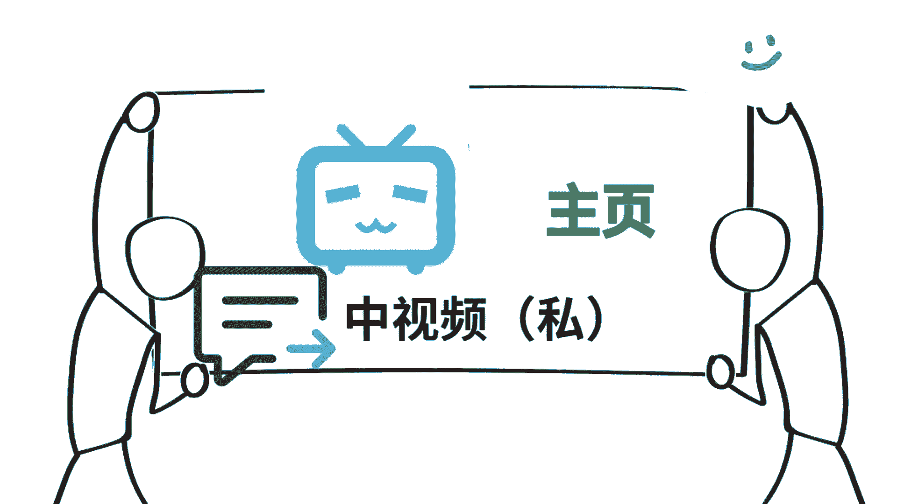

一共有三节，你可以压告我的公，中视频就能拿到了，好了，关于中视频的这个小动画的玩法，就给大家分享到这了，我们下期再见吧，点赞你要投币好不好，点赞呢，做抖音的最高境界就是吃软饭，选话题呢就是选老婆话题。

选得好，软饭吃到饱，软饭男啊。

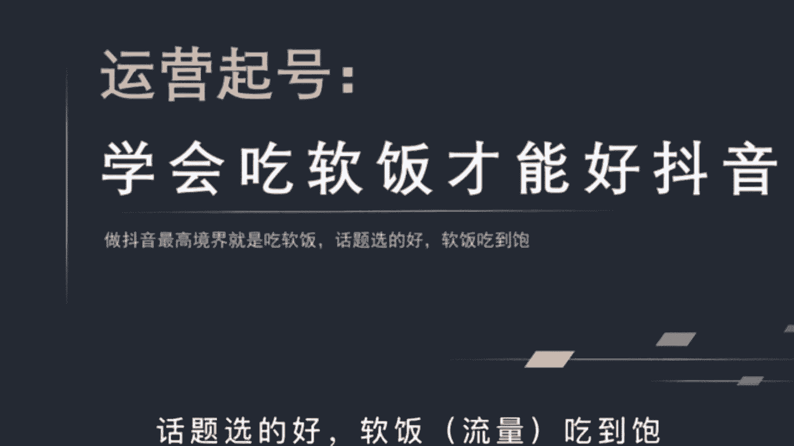

有这么三个特点，和我们做抖音的逻辑是共通的，第一个呢是喜欢吹牛。

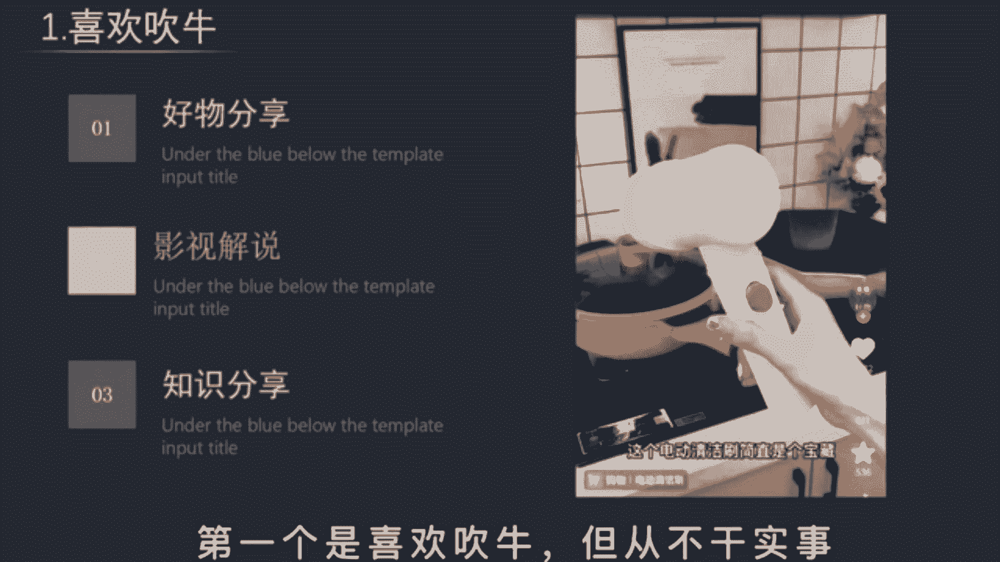

但从来不干实事啊，比如说你是做好物分享，第一句呢就是买了这个清洁神器，再也不用担心厨房油污，那到底是不是真的好物呢啊并不重要，再比如啊你是做影视解说的，开头呢就是。

这绝对是一部能让你吓到汗毛竖起的恐怖片啊，你是做知识分享的，打开这个隐藏开关，播放量暴涨100倍，那你看看他们呀都是吹牛的人，并不关心到底是不是真的有用，只要能拉住你的眼球，提高完播率就好了。

第二点呢是能巧妙地讨好对方，也就是说想你所想无死角的满足你的欲望，在抖音上，只要你能满足实用价值，利益价值，情绪价值，这三点就一定能火啊，比如说你是解说视频的，看完呢丰富了我的谈资。

大家都愿意给你点赞啊，再比如我这种，这就是利益价值，情绪价值呢就是能给观众带来感动，愤怒愉快等心理体验，产生情绪的共鸣啊，比如揭露镰刀的内幕啊，打假数码产品的博主播放量都非常高。

第三点是特别擅长打扮自己，如今社会啊男人与女人都喜欢美好的事物，同样都是美食博主，这两个视频你更喜欢谁呢，这个呀都在讲同一部电影，但这两个封面你又更愿意关注谁，短视频啊，讲究的就是前三秒的画面冲击。

这直接影响到用户的第一眼感官感受啊，特别是用户有了关注意愿时，一般呢都会进入到你的主页，所以你的封面啊，一定不要像朋友圈似的杂乱无章，一定要封面统一，这样大家才更愿意关注你，当你拥有了这种软饭的能力。

即使内容水平一般，也会深受粉丝的喜爱，播放量爆炸啊，为什么呢，因为抖音是机器啊，他不知道什么是好内容，只知道什么是好数据，你玩播高点赞。

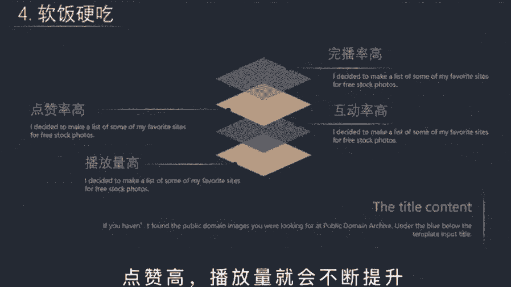

高播放量呢就会不断的提升，被推荐给更多类似的人观看，当你打上了账号标签，就相当于入赘成功啊，以后不用怎么努力，也能有上万的稳定流量，这就叫软饭硬撑，现在做抖音还来得及吗，要回答这个问题。

你不妨先解决自己的这三个问题，你为什么要做，如何获取精准流量。

以及要做什么样的内容，先说第一个，很多人啊都担心各行各业的大佬都这么多了，哪有自己的立足之地，头部账号动不动就赚一个小目标，自己啊怕是连汤都没得喝，其实呢你大可不必这么想，区区3年的短视频爆发期。

几百亿的市场规模还不足以垄断任何一个行业，而且呢个人IP1旦建立起来，你就会拥有一大批无条件信任你的用户，从此呢对你来说，天下没有难做的生意，而对于你的用户来说，你可能啊就是这个行业里。

他唯一接触到的一个专业的老师，或者说呢最适合的老师，有时啊你的用户并不是因为你最牛而选择你，而是因为他信任你，且跳一跳就能够得着才选择，你。

怎么理解呢，举个例子来说，假如啊你要填报高考志愿，你会咨询以下哪个学长或者学姐呢，你可以思考一下，我相信啊答案一定是越往下人数越多，因为对于学校的需求规模就是越往下走，人数越多。

一个平时考试最多上二本的人，有可能去问清华北大吗，就算去问人家也不知道什么样的二本号，毕竟圈层的差距太大了，所以呢不用担心自己没有用户，你总是能找到属于自己的那部分用户。

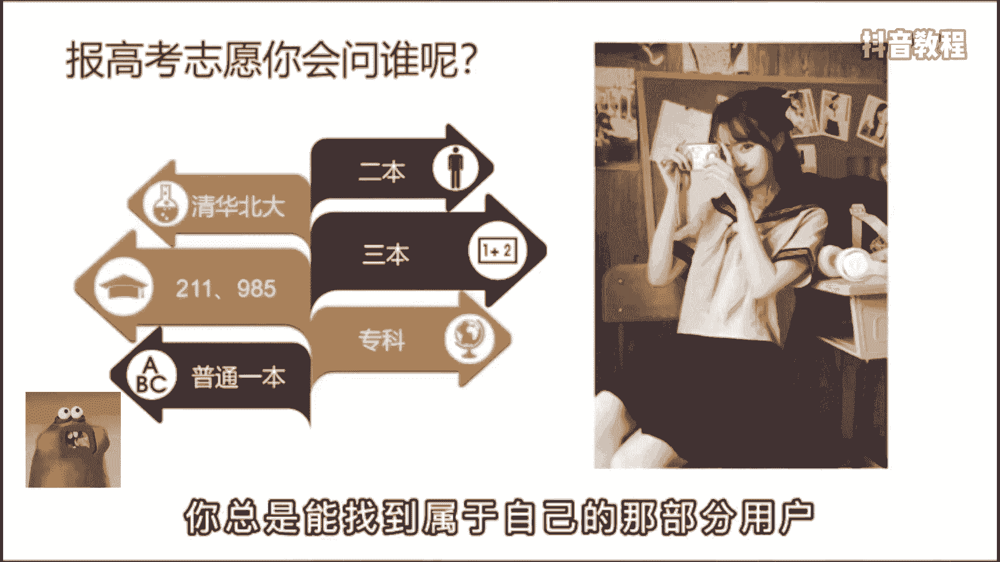

第二个问题，如何获取精准流量，现在啊流量真是越来越贵了，无论是之前的图文时代还是现在的短视频时代，流量几乎成为了商业的核心，但无论任何时代，投产比最高的流量渠道依然是内容，尤其是垂直面。

无论你是卖什么产品的，它都是沉淀付费用户的最佳路径。

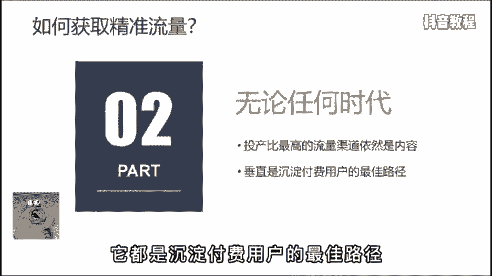

假如啊你是卖脐橙的，你就每天拍刚摘下来的脐橙，一刀切下去有多么的汁多饱满，让观众啊一眼就知道你是干什么的，能给他们提供什么样的价值，时间长了呢，就一定会有人为你买单，当然了，你也得保持品质。

万古不变的套路就是真诚，你的真诚往往会在你的内容里流露出来。

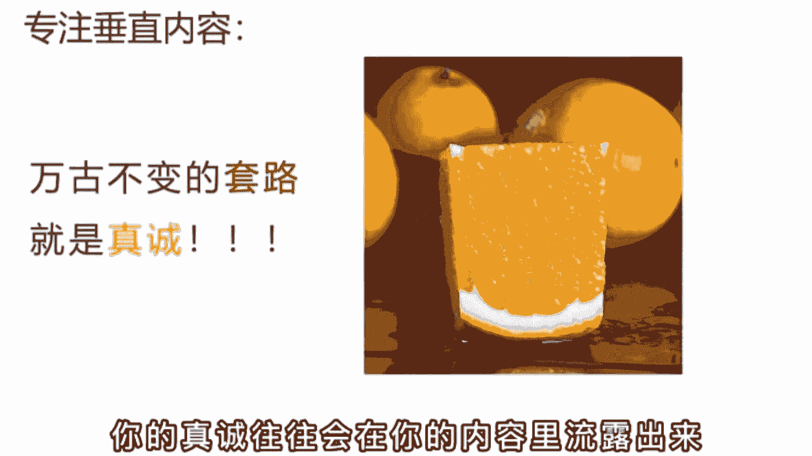

第三个问题，要做什么样的内容，我认为啊好内容的核心在于利他，尤其是成人妲己的内容，人人都爱，就拿我来举例吧，我是教大家如何做好短视频的，我把内容呢分为了三个板块，爆款模仿加运营技巧加项目拆解。

第一个呢是帮大家去了解爆款账号背后的逻辑，把其中可借鉴复制的点拿出来，为我们自己所用，第二个呢是通过我的一个经验系统，完整的把运营账号的逻辑，包括一些可能需要规避的坑分享给大家。

第三个是拆解一些当下热门的项目，比如中饰品计划，抖音小店的玩法等等，内容，时长呢一般在3分钟以上，这些内容啊对于新手来说一定是有价值的，不像30秒的视频那么稀碎，另外呢最重要的是做这件事。

对我自身也有很大的帮助，在给你们拆解分析的时候，也是自我学习迭代的一个过程，只不过呢我把这个过程和结果记录了下来，分享给了你们，让大家和我一起进步，这就是成人妲己的一个好内容，就算最后没有留下一个粉丝。

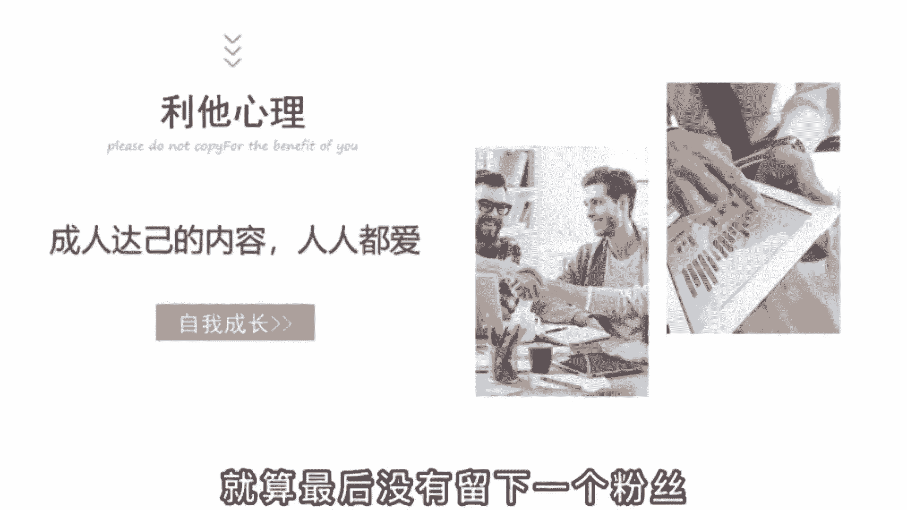

可拥有这些知识，我也是赚的，你现在做抖音流的泪都是定选题，是脑子里进的水，是不是想选题，想的头都秃了，不知道明天该发啥，今天啊教你一套公式，一分钟帮你解决这个苦恼。

会找选题的人呀，他会有更多的时间去制作视频，每天发三条，一个月就是90条，靠堆量都能卷死，你，根本不需要透豆加，而且会做选题的人啊，能比你更精准的找到用户的痛点所在，也更容易得到精准粉丝的驻足观看。

从而快速打上账号标签，那有什么办法解决吗，当然有，这是一套呀，百万粉丝博主常用的选题技巧，为了方便理解，我把它总结成了一个公式，就是内容定位加用户痛点加借势热点，用好这个公式，你的内容啊一定不会跑偏。

比如你想和我一样做一个知识博主，就得去啊挖掘一些行业的关键词，像播放量，粉丝量，定位选题等等，这些都是关键词，没有任何的主观描述，然后呢在这个基础上去寻找用户的痛点，比如像便捷高效技巧教学内容输出。

最后啊去蹭近期的热点，把他们进行任意的组合就可以，眼下这不马上就要春节了吗，你可以说如何用拜年的方式播，播放春节必火的选题内容，张同学快速涨粉的三个秘诀啊等等，那我们呀再把这个公式套在别的行业里。

再试一下，比如美妆行业内容定位是美白除皱口红，用户痛点呢是平价好用，明星同款避坑扫雷，最后啊借势热点进行排列组合，比如迪丽热巴同款美白面膜推荐，七夕千万别送女朋友口红等等，那以上啊，我已经举一反二了。

至于反三就交给你了，你可以根据你的行业特性，把你的思考过程发出来，让我来帮你判断一下可行性。

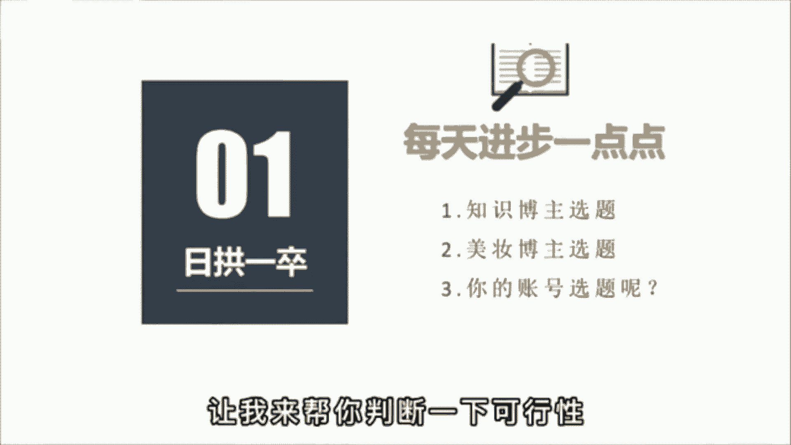

最近你是不是流量不太好，这是因为抖音的算法有了大的变动。

很多账号的流量都有严重的下滑，知名网红毛毛姐一夜掉粉80万，不过呢这对小博主来说，却是一次弯道超车的好机会，看到视频最后啊一定会对你有所帮助，那造成这个现象的主要原因是。

因为抖音的算法新增了一个铁粉机制，所谓铁粉就是长期支持你的粉丝在前，我们只能看到粉丝的总数，这就导致强者恒强，粉丝多的人播放量就越多，哪怕就是拍一段毫无意义的吃水果，也会被吸引走几十上百万的流量。

这对普通人来说就是一种不公平，对平台来说也是不健康的，所以呢，这个铁粉系统就会从一定程度上打破这种局面，让流量的分配更加均衡，让真心做好内容的你能获得更多的流量推荐，无论大号呢是有几百万的粉丝。

在作品发布的初期，都会优先让他的铁粉观看评级，只有过了铁粉这关后，才会进行大范围的推荐，一般呢10万播放以内啊，铁粉播放要占到6~7成的比例，比如呢我是做运营教学的，我发现最近流量不太好。

也去发一些炫富博眼球的话题，老粉看到呢就会不乐意，觉得我这个干货博主初心变了，所以流量呢也不见得会变好。

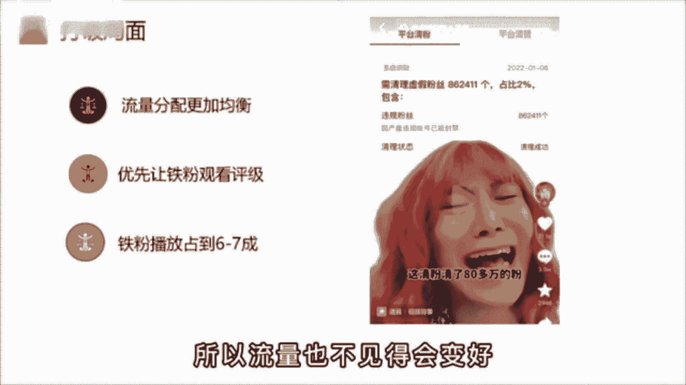

然后再说一下，为什么对中小博主来说是次机会，首先呀你要明白一个基本的概念，每一个行业赛道粉丝的体量是不一样的，你做娱乐号粉丝到1000万都有可能，但你做技能培训，比如开挖掘机最多啊，就是10万的体量。

原因呢有以下两点，第一是学习枯燥，看短视频啊，主要还是以消遣为主，第二呢是学挖掘机的人本来就少，所以呢当你看到一些做好抖音。

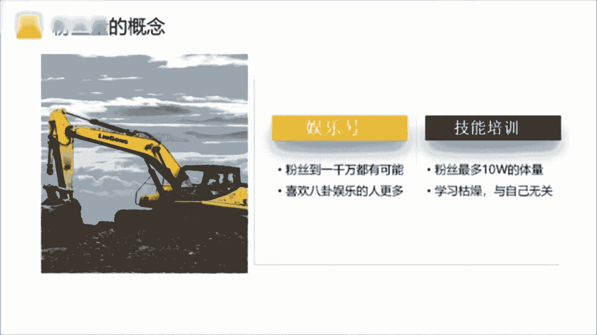

最重要的核心是什么，大多数人都进入了一个误区，明明学习了很多课程，懂得了很多技巧，感觉自己就算没在新媒体行业做过，也算半只脚踏进来了，再怎么差也比新人旗号快吧，但结果呢往往事与愿违。

最常见的现象就是视频卡500播放，甚至呀卡100，没有一个人点赞，投了斗家也无济于事，于是你的心态思路一团糟，去翻找各种知识博主，学习破播放的技巧，一个个的尝试，哪怕是打开某种开关，这种鬼话你也信。

也要去试试，因为你实在是没招了，那做抖音最重要的核心是什么呢，我认为不是变现，不是运营，而是你的兴趣，这就是道与术的区别，任何人在账号初期都是很难获得流量的，你会有很长的一段低谷期，没有播放，没有点赞。

没有一点粉丝，那这就是常态，平台每天啊有上百万个作品在发布，你就会被埋没在其中，除非啊你长得像沈腾一样人见人爱，或者像迪丽热巴一样花见花开，但没有播放呢，不意味着你的作品不好，只是时机未到。

我用影视号做过实验，同一个账号不投流的情况下，把曾经隐藏的作品再发出来，播放量呀，一样会涨，要知道那些被隐藏的作品，是当初认为不太好的内容，但这个不太好呢，是你自以为是的，观众可不这么想。

所以呢你需要做的就是雷打不动的保持更新，用三个月100条视频告诉平台，你是谁，你能给用户带来什么样的价值，等你打上标签，自然啊会获得稳定的流量，哪怕你吃个苹果，也有几千上万的播放，可是要怎么坚持更新呢。

那就是啊寻找你的兴趣点，因为只有热爱才能话题选不好，流量少一半，很多人啊觉得话题这个功能鸡肋，没啥用，不重视，但我劝你啊，可别小看这个功能，这其中呢隐藏着大大的心机，用好了能够帮助新号快速完成。

能启动，因为添加一个合适的话题，能够帮你带来更多的曝光机会和精准流量，一般来说啊，话题分为三类领域话题，内容话题和热点话题，领域话题用来覆盖行业大类内容，话题细分识别人群，热点话题就是蹭流量的话题。

选择的优先级与正确与否，决定着你的视频播放数据，举个例子来说，你是做萌宠吃播的账号，分别对应的话题啊，就是领域宠物日常内容，边牧吃播热点宠物出道计划这个热点话题啊，有可能是时下热点。

也有可能呢是平台的流量扶持计划需要啊，你自己去找找，但是呢你可千万别看别人用什么，你就用什么，很可能啊那个热点已经过时了，具体方法呢就是登录电脑版的抖音服务中心，选择创作灵感，点击创作素材。

再点击热门话题就可以看到了，这里面都是时下热门的话题标签，你可以根据自己的行业来选择，比如刚才说的萌宠，你就可以选择动植物，排名第一的就是宠物出道计划，然后点击后边的发布视频，就可以自动打上该话题了。

那关于话题标签啊，另外还有两种情况，第一你是星号期则内容话题大于领域，话题大于热点话题，原理呢是让系统快速精准的，知道你究竟是干什么的，盲目的蹭热点，有可能啊会影响你的标签。

第二是老号破圈则领域话题大于热点，话题大于内容话题，原理呢是老号的流量比较稳定，需要突破领域的限制，破圈获得更多的流量推荐，但是呢就算学会了这个方法。

你也不要指望一定能，我也知道好内容才会被推荐，但到底什么才是好内容，这个也太抽象了，有没有什么办法能把抽象的价值。

变成可视化的短视频语言呢，还真有，教你一个公式，爆炒虎头，什锦猪肚，红烧鲍鱼，什么意思呢，有句话叫客户买的不是产品，而是感觉。

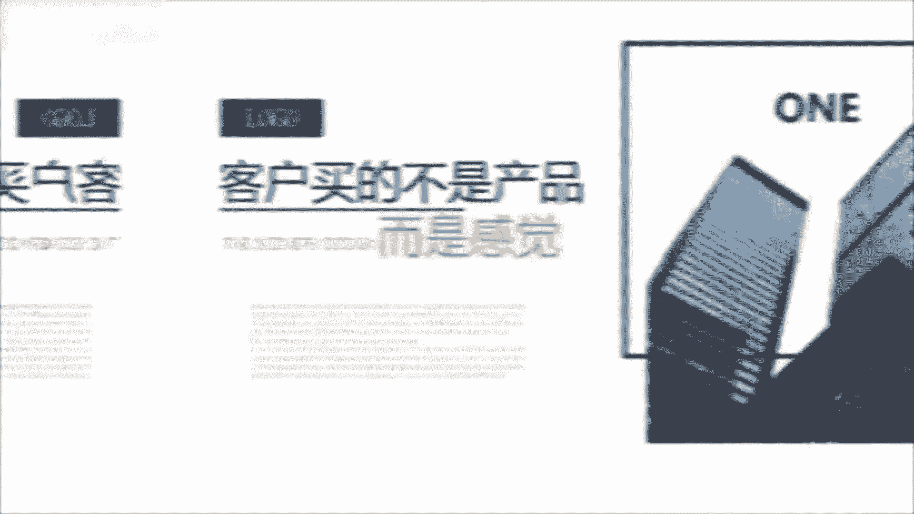

爆炒虎头，就是说开头的五秒要开的精彩，像虎头般斑斓夺目。

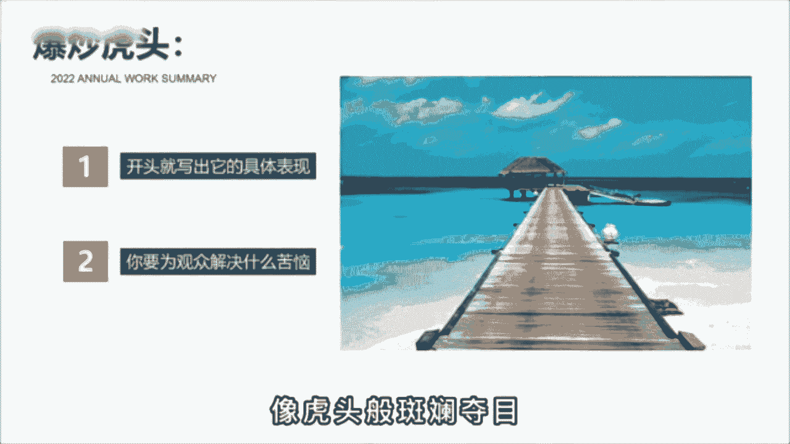

比如这样，那一天上海感受到了被吞噬的恐惧，夜空中出现了一张血盆大口。

钢筋森林都被他吸进嘴里，开头就写出它的具体表现，而不是给大家推荐一部高分末日电影，再或者这样，有人说来上海旅游没什么好玩的，那可能是你的打开方式不太对，作为10年的老沪漂，我想送你今天这份上海旅行攻略。

写出你要为观众解决什么苦恼，而不是我给大家分享三个上海的景点，什锦猪肚呢则是内容要像猪肚那样饱满丰富，包括画面的切换也要符合情绪的递进，比如这样，然而啊过了一天，各国股市呢又普遍的回血，那问题就来了。

接下来这场仗，对全球的经济到底会有什么样的影响呢，内容充实丰富饱满，一定不能出现任何的节奏拖沓，华而不实的内容，红烧豹尾则是指豹子般意味深长的结尾，用最简短有力，干脆利落的语言将总结打好。

比如这个屏幕前的，你看完会不会食欲大增呢，反正我能多干两碗米饭，用一句反问来提高评论互动数据。

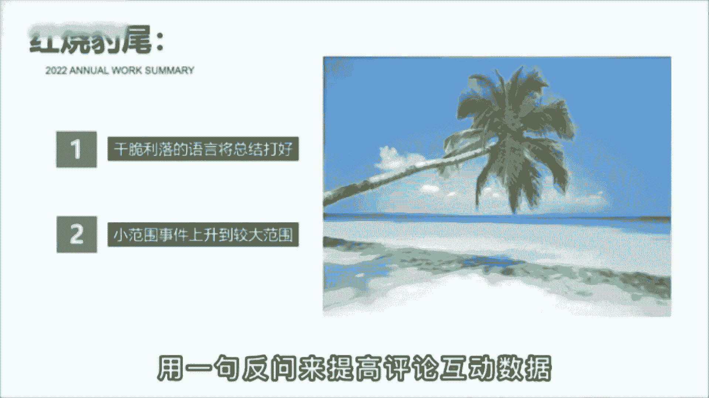

再比如这样吞下了委屈，喂大了格局。

改变不了别人，就改变自己，把前面写的小范围事件上升到较大的范围，从而升华视频的主题，明白了这个公式后，你再问问自己，你的内容真的优质吗，是不是开头不够吸金，内容节奏拖沓，让人看不到最后，而结尾呢就一句。

我们下期再见。

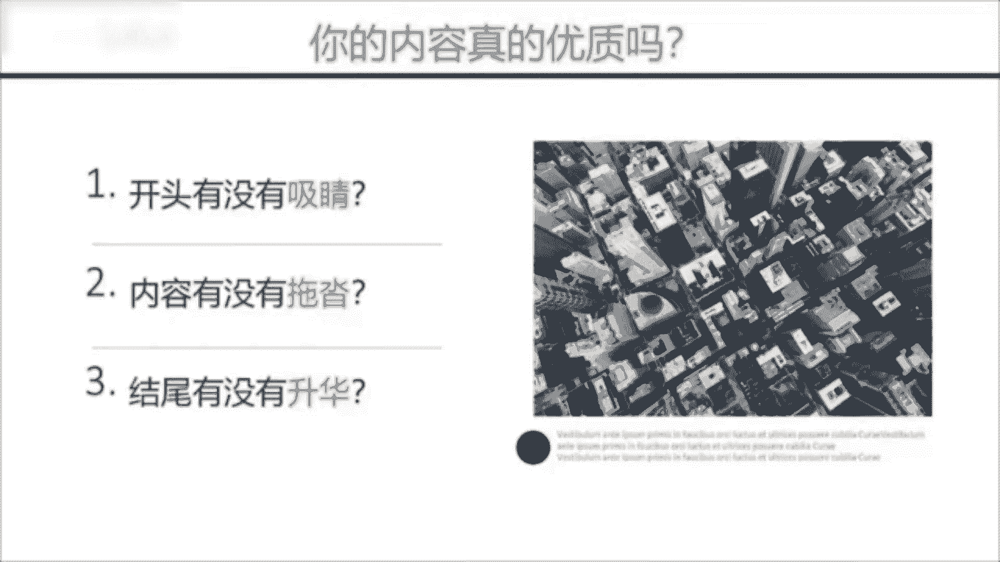

有个同学问我，为啥自己的视频就500播放，怎么努力都不行。

而看别人做呢却那么简单，大大小小的培训博主关注了不少运营知识，也没少点赞收藏，怎么号就是起不来，难道是他们说了假话，干货都在付费课程里，我和他说，其实呀他们教的也没错。

只是你没有搞清楚每个阶段该做什么样的事情，第一个阶段搜集信息，把你要做的这个赛道前十名的账号都找出来，作品按照时间排序，只看最近三个月，每个账号挑五个，把爆款的选题文案都抄下来。

用你的角度分析他为什么会红，培养网感，第二部像素级模仿，把这50个当中，最符合你账号定位和用户画像的作品，进行像素级的翻拍，文案不会写，没关系，你会抄就行，鲁迅曾说过，会模仿绝不是略点。

会模仿又加以创造，那不是更好吗，由此可见，名家大师啊也都是先演模仿再加以创新的，之后呢才会有自己的风格，第三步发布投放，精心准备十条作品，每天啊发两条，五天发完，每天投200，斗家选择点赞评论。

这么做的意义呢是为了养树据，因为没有点赞的作品，很少有人愿意看完，然后呢把其中完播率最高的互动数据，最好的进行单独投放，每条投500，选择粉丝量，一口气干到5000粉丝，这样呢之后就靠自然流量。

你也会有几千到几万的boss破播放的流程，就这三点，你需要做的就是转变思维，学会用时间换空间，要么像我一样，抱着发100条作品的决心干废三个号，要么输出高质量，有话题的内容吸引粉丝，但很明显对小白来说。

一个是坚持不住，一个是做不到，我发现一个很恶心的方法，让中视频快速的突破10万的播放量，注意说的是10万的播放量不是1万，很多知识博主其实不是特别愿意分享这个方法，真的是秒杀了很多几千上万的课程。

我找了12个粉丝做测试，领粉丝的账号，一周不到的时间，播放量都达到了10万，20万甚至30万，快速的通过了中视频1万7播放量的门槛，一条视频呢也拿到了几百几千的视频稿费，咱们直接上干货。

相当于直接给答案，记得点赞收藏，首先呢打开抖音搜索创作者服务中心，打开全部分类点，创作灵感，选择创作热点，找到自己的领域，你想做的内容方向的也都在里边，时间选择近七天往下拉，看热门视频，选择低粉爆款。

找到你同行最新发布的十个爆款作品，借鉴文案替换素材，然后去做视频。

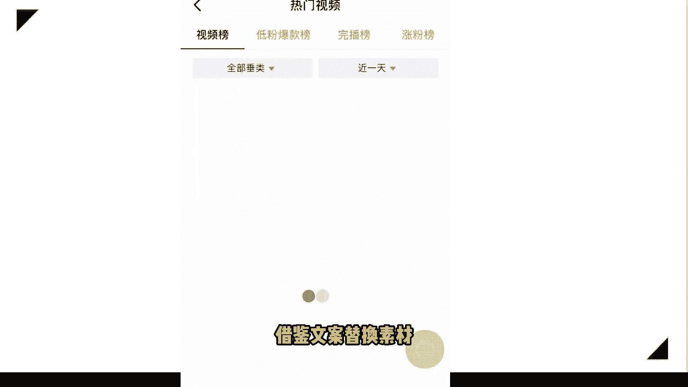

少则三五条，多则十条，必出一到两条的爆款视频，低粉爆款视频就是没有粉丝的账号。

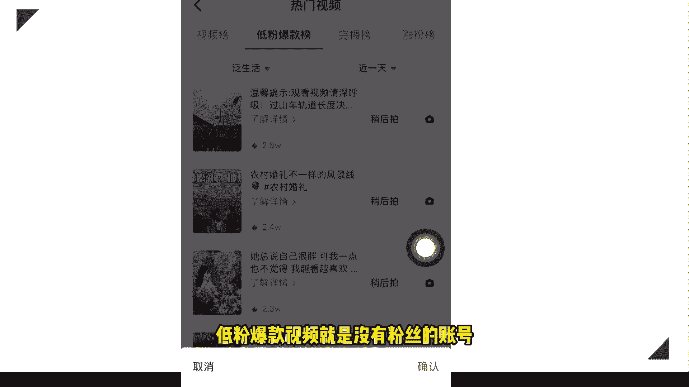

一条视频突然就火了，说明这个视频大家是真的喜欢，按照我说的方法改编模仿去操作就行了，记住视频间隔一天发一条，那如果你对中视频有什么不懂的地方，我也准备了直播教程领取了，大家不要觉得麻烦。

因为很多东西视频里面实在是讲不了。

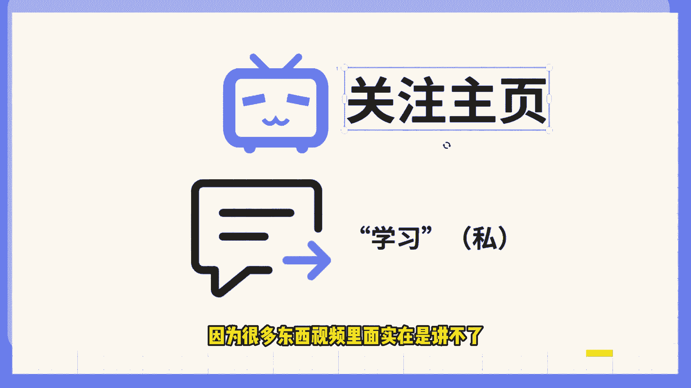