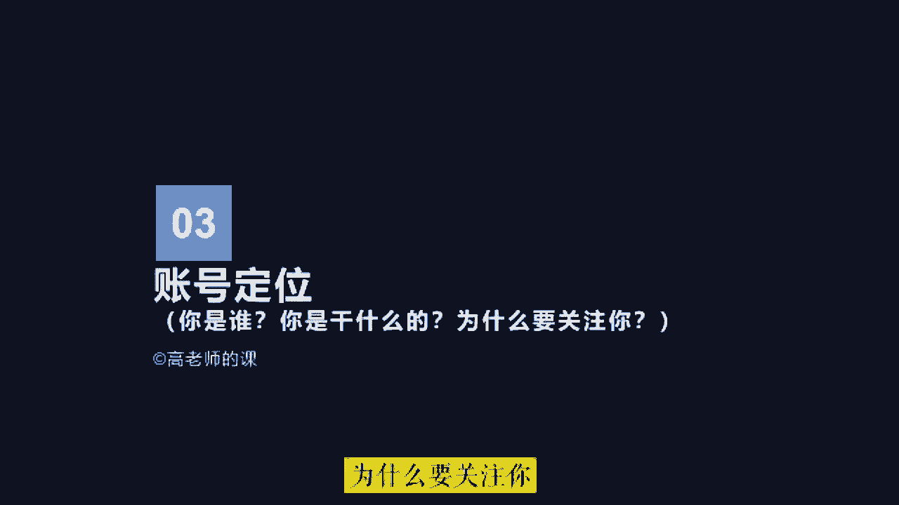

# 2024年做抖音怎么快速起号？抖音暴力起号实操教程分享，让你的账号快速涨粉变现，特别是新手小白，一定要知道的技巧！ - P1 - 白沙糖fa - BV1zqgPe8ELH

他们。都是为了挣钱努力奋斗的年轻人，如何快速起号，并不是打开某某开关就能火。那些都是骗流量的。下面告诉你真正的起号方法，按照步骤操作，你也可以像我这样上热门。

首先要搞清楚什么叫做起号抖音有8个流量值起号的本质就是流量值突破，至少要达到二级流量值，拥有几千基础播放量，才能叫做起号成功，但是99的人都不会起号账号不符合系统推荐算法，所以只有几百播放。

下面是起号的5个步骤，缺一不可。这是MCN机构内部资料，建议收藏。一找对标内容，抖音搜索热点宝，点击观测选择你的行业，找到最近7天涨粉最多的10个账号，然后搜索你行业的热点视频，点击低粉爆款视频吧。

找到最近7天热门的低粉号，这才是找对标最正确的方法，也是最恶心的方法。2确定表现形式，这是需要把对标账号的所有视频看一遍，找一个你能模仿并且超越的表现形式，确定谁来拍怎么拍拍给谁看我这里选择。😊。

是MG动画形式，以此代替真人出镜。3、超热门选题，从对标账号中找7个热门话题，在抖音搜索热门话题内容，找到三个相关的视频，复制链接，账号为文字，然后组成为一篇内容，用自己的理解进行表述。

最终形成一篇原创热门文案。4、测试爆款，通过定好的形式，完成视频制作，每天定时发布一条视频，连续发布7天，不出意外，你有一条爆款。因为一个新号一般会有三次上热门机会，期间可以购买抖加头达人相似。

加速测试结果。5复制爆款，上热门之后，粉丝量会爆涨，然后就是复制爆款视频，提高粉丝年度，这时你就会神奇的发现，你发的视频再也不是三五百播放，随随便便就是几千几万播放。这是我其中的一个账号。

从抖音起号到开通中视频计划，用了3个月左右的时间，现在每天的收入都能稳定在600到100，只要坚持下去，还是可以赚到一份不错的收益的。如果你也想做，可以在下方评论区留言一个6，大家可以一起玩。😊。

首先，做抖音创作必备的五项基本能力。第一，拍摄剪辑能力。最基本的如何用手机拍出画面流畅，表达清晰的视频素材，这个能力是需要具备的。其次，手机剪映或者电脑版剪验的使用，也就是剪辑的能力。

如何剪出让用户能看下去，而且觉得有价值的作品，也是需要经过不断练习才可以的。第二，内容策划能力。内容策划其实就是你的作品构思。比如你想要通过什么样类型的内容来传递你想要表达的信息。

或者你每一个镜头以及在视频中说的每一句话，它的作用是什么？如何进行串联起来，形成一个优质的作品，这些内容是需要不断的花时间揣摩和练习，才能找到感觉的？第三，镜头表现力。如果是真人出镜。

如何在镜头前轻松的表达自己，而且还要把自己想要表达出来的情绪以及感觉演绎到位，这个也是需要我们个人不断去练习的。第四，细分行业的知识储备。如果你提供的是知识类的内容。如何让用户关注你。

就需要你有相对比较专业的细分行业知识，才能获得粉丝的放心。第五，流量变现技能。不管你是通过什么方式来变现的。当系统给你的作品推送大量的流量的时候，你能不能将流量快速的变现。

这个需要你提前就规划好变现的路径。如果你本身就有成熟的商业模式或赚钱方法承接抖音流量会比较容易。如果你是通过短视频或者直播带货的方式，那么还要熟悉直播电商的整体流程。比如选品能力。

以及卖点提炼直播能力和话术技巧等。如果你是通。通过星图广告，那么你需要努力做好个人人设或者个人IP。当然，如果你仅仅是靠流量来获取平台的广告分成，那么就需要有不断创作爆款视频的能力。

以及获取平台更多流量的能力。另外，做好抖音，我们还需要准备5个方面。第一，拍摄剪辑设备拍摄设备相对比较简单一点，一般我们自己使用的手机，只要支持1080P30帧就可以满足需求。

不过最好可以用苹果12以上的或者是国产旗舰版或者次旗舰版型号的手机。当然，如果你的内容方向对画面质量要求较高，建议你还是用相机拍摄。剪辑设备手机当然是可以的。不过如果对电脑操作比较熟练。

用电脑剪辑视频效率会更高效一点。第二，有充足的时间去做选题。做抖音短视频并不是一朝一夕的事情。我们看到很别人很多爆款视频，你首先要确定自己有没有足够多的时间去发掘选题，拍摄剪辑等。第三，平台规则的熟悉。

平台的规则是我们每个人都需要遵守的。不管是伪禁词还是违规行为以及内容都需要在策划的时候就需要规避掉。因此，做之前需要把平台规则好好看一遍。第四，看过足够多不同内容类型的作品。

在抖音中创作出优秀的内容是需要作者具备网感的，也就是对互联网热点内容的敏感度，基本的网络热梗京剧热门视频、热门BGM是需要我们花时间去熟悉理解和整理收集的。而且这些内容也在实时更新，需要我们不断的去看。

才能跟上创作的步伐。第五，熟练内容创作的流程。科学的创作流程能够。够大大提升我们起号以及做出爆款视频的几率。因此，如何更专业的创作短视频，需要我们不断的去学习。最后我们还要认识到。

其实做抖音并没有那么复杂。我们创作作品出来，发布到平台上，在互联网中我们就是一个博主而已。这个过程并没有想象的，或者是有些人说的那么繁琐。唯一有难度的就是需要我们持续的创作出优质的内容作品。因此。

我们关注5个核心方面即可。第一，热门视频BGM和对标账号。这些内容我们只要花时间去刷去找，就可以找到很多了解了很多。慢慢的对抖音创作就会有一个正确而且而且细致的认知。说白了就是要见的足够多。第二。

内容价值和垂直度，内容价值通俗点讲，就是让刷到你的用户觉得你的内容要么有意思，要么有知识，要么有感觉，要么没有见过，没体验过，要么就是自己内心想的被你说出来了，产生了情感共鸣。当然。除了内容价值之外。

账号是不能乱发作品的。也就是如果你发有用的知识就一直发这类的。如果你发别人有感觉的，就一直发这类的。第三，画面文案和内容呈现形式。在抖音中是靠推荐页的竖版视频吸引粉丝的。

那么视频中的元素无非就是画面声音和文字，所不同的是这些元素经过不同的组合形成了不同的内容形式，传递出来的信息和感觉就不一样了。所以我们不管是平时刷视频还是创作视频。

所谓的内容质量就是这些元素细节的不断优化。第四，账号人设和个人IP塑造，我们要变现，做人设是比较容易的方法，人设也就是你在这个账号中，人物角色的设定是什么？经过长时间的沉淀，积累起来粉丝粘性之后。

也就是你的信粉丝信任你，这样就形成了个人的IPIP形成之后，不管是通过广告还是带货来变现。都是比较容易的事情了。第五，玩播率互动率和粉丝画像。我们在运营账号的时候，需要关注的数据就是作品的玩播率。

也就是多少人刷到你的作品，有多少人看完这个数据比较重要，会被反馈到抖音系统中。如果数据比较好，平台给你的流量就会更多。当然还有互动率，也就是点赞、评论、转发、收藏、关注等用户行为。另外。

我们还要去查看观看我们的视频用户是什么样的人，是不是我们想要吸引的人。好，同学们下面正式进入我们的课程。首先我们先认识一下在抖音中常见的热门作品类型中有哪些作品类型其实就是我们所说的行业赛道。

我们在抖音中发什么样的作品，抖音系统会自动分析我们的作品。然后对我们的作品进行分类。也就是我们听过的抖音给我们的账号打标签的说法。当我们发某一种类型的作品比较多的时候，抖音就把我们归到某一个赛道中。

因为抖音的推荐算法是跑马机制。因此我们需要和同一赛道中的同类型作品进行数据PK来抢夺抖音推荐的流量。首先我们来看美食号，美食号是抖音中流量非常大的一类竞争也非常激烈。

像我们平时刷到的做菜的吃饭的探店的深夜食堂类的都属于美食赛道的。现在如果想要在美食赛道做出成绩，就需要从内容类型，美食体验或者拍摄剪辑方面做出创新，才有机会出圈。

如果没有任何创新，仅仅是拍好做好中规中矩，比如家常菜的制作，这种类型的账号已经很难获取大的流量了。因此，我们看在抖音创作者服务中心中的美食作品流量排行榜中，流量比较靠前的。

基本都是增加了差异化创新的元素，比如制作美食用两分半钟的沉浸式制作流程，呈现出高糖的创意小羊蛋糕获得了115万点赞和2118万的播放量。当然，也有利用解说的形式来呈现美食诱惑。这种就是内容形式的创新。

也有农村类治愈系的美食号，农村的场景就是天然的场景差异化元素。因此我们可以看到很多三农类的账号，做美食基本都是做一些在城市很常见，但是搬到农村的环境去制作，就会有不同的效果。

旅行类的账号也是在抖音中流量比较大的赛道。不过，如果仅仅是美景拍摄或者是景点展示，这种类型的竞争并不是很大，除非是非常稀缺的风景和景点。汽车类的账号也是一样，大部分做汽车号的博主都会去分享汽车知识。

但汽车类的赛道目前在抖音中已经相对成熟，而且也有很多头部IP已经在知识分享方面做的很专业。因此，如果要做汽车类的账号，就必须创新内容，比如人事的反差及谁来说车，有反差的人设说起来效果就是不一样。当然。

还可以加一些剧情或者创新内容形式，例如舞蹈或者说唱等。影视娱乐号是在抖音中作品最多的赛道，也是流量最多的内容类目。因为抖音是娱乐平台，其娱乐和媒体属性决定了每天抖音都需要大量的新的娱乐内容产生。因此。

这个赛道对作品质量要求不高，而且不用出镜，也可以操作。运动茶业类账号多数以随拍内容为主。当然也有一些挑战类的手工类的、极限于运动类的这种类型章账号的视频适合在户外进行拍摄文化教育、知识号、知识付费、书单号、传统文化类等内容都集中在这个大赛道中中。

这种类型的账号主要以知识分享为主，内容价值主要是知识、情绪和观众认同感。内容形式多数以口播、文案图文为主。才艺号才艺类账号的内容多数以唱歌、颜值或跳舞达人为主。户外随拍是抖音普通人发作品最多的赛道。

这类账号的内容多数以随手拍为主，如果内容非常有意思或者正能量，又或者有很强的反差感，抖音也会对单个作品推荐大量的流量。但是这种类型的账号很难做垂直，泛流量较多，后期变现不易。

剧情号剧情号是较容易打造人设的一类账号。不过，剧情号的拍摄成本较高，演员场景道具等。另外，剧情号还需要演员具备较强的演绎能力。三农号三农及农业农村和农民在抖音中，三农赛道是抖音重点扶持的赛道。

而且目前来说，大部分专业的短视频创作者利用农村场景做差异化都取得了不错的效果啊。亲子号、萌娃、亲子关系、熊孩子的日常等，很容易引起很多人的共鸣，特别是已婚人士。这类群体具备一定的消费能力。

而且消费需求也非常明确。穿搭美妆类时尚号啊，穿搭美妆时尚类的账号主要粉丝群体为18到35岁的女性，这类群体是抖音中的核心人群。因此这个赛道除了博主竞争比较激烈外。

还有很多品牌方也具备非常强的内容创作能力。

好，同学们，各赛道的账号类型我们讲完了。下面我们来看一下商业定位。所谓的商业定位，就是你打算在抖音中靠什么赚钱的问题。我们经常在抖音中看到有的账号发作品，作品流量上来就开直播，然后开始专注做直播带货。

例如疯狂小杨哥、彩虹夫妇等。这类是属于达人直播带货。他们是靠给商家带货赚取佣金的方式来变现的。还有一部分自身有才艺，表现能力比较强，具备娱乐性，前期拍段子，等拍的段子被很多人喜欢。

粉丝涨起来之后就开始开直播PK或者表演才艺，以满足大家的娱乐需求，然后在直播间收取直播打赏的礼物，收到礼物呢，在抖音中可以体现，这也是变现的一种方式，直播打赏。

这抖音中不管做什么类型的账号最终都要考虑变现的问题，否则将无法持久。这就是为什么有的粉丝很多的账号做着做着就停工的原因。很大一部分是因为账号无法解决变现的问题，难以维持创作的成本。所以我们在做。

号之初就应该把我们的变现路径想明白，通常就是很多人所说的商业模型是什么样子的这就是商业定位。简单来说就是你最终要靠什么方式，什么产品，什么服务来赚钱的问题。

在抖音中，大体有以下几种比较常见的变现方式。第一，短视频直播带货，带货的方式是抖音重点打造的商业核心抖音电商。所以在抖音中，大部分博主最终变现都会优先考虑如何去带货。有的依托短视频。

短视频带货的开通条件是个人需要达到1000粉丝。企业的话认证之后领粉就可以看通。然后呢交纳500元的作者保证金就可以开通商品橱窗。在商品橱窗中可以通过去精选联盟里边进行商品选品。

然后呢发布视频时添加商品就可以了。如果有人通过短视频购买商品。那么作者就会得到相应的佣金。但是目前来说，短视频带货单纯依靠一个账号流量极不稳定。且需要大量的时间去创作优质的短视频。

所以很多人都会采用账号矩阵的方式，甚至开设剪辑工作室，通过团队化批量化的操作来测评做视频。如果是初镜博主具备IP属性的，一般都会进行直播带货，直播带货可以依托自身IP效应，增加粉丝信任。当然。

直播带货需要个人开通商品橱窗，然后在开播的时候挂上商品链接就可以。对于企业来说，从某种程程度上可以解决粉丝信任的问题。所以通常有的企业也可以不用打造IP就可以直接开始直播带货。

但前提是需要具备专业的直播电商团队。第二，广告商单，一个账号把粉丝做起来，最直接的商业价值就是可以通过星图广告来接品牌广告订单，通过新图广告，博主可以进行广告报价。

品牌方会根据博主粉丝量、粉丝画像以及粉丝粘性，在短视频中投放广告。这种方式也是大部分网红IP都在做的变形方式。最基础的我们可以参与抖音短视频投稿任务，不过需要抖音账号在抖音平台粉丝量大于等于1万。

也有抖音的图文。任务及图文形式的作品，也需要抖音账号在抖音平台粉丝量大于等于1万，而且近30天内发布过两篇图文题材的内容，才可以接到这种类型的广告。通常我们看到一些大V在抖音短视频中植入广告的形式。

是星图中的抖音传播任务，需要抖音账号在抖音平台粉丝量大于等于10万。

第三，团购引流。对于本地生活的商家来说，通过抖音团购来进行线下引流，是目前广告成本比较低的方式。也是很多商家在当前营商环境下提升自身竞争力最佳的手段，粉丝在直播间领取商家的抖音团购券。

然后拿着团购券再去线下进行核销，商家利用这样的方式通过抖音来进行引流获客和店铺宣传。当商家发布抖音团购券的时候呢，可以设置佣金比例。团购或者探店达人呢就可以在发布短视频的时候。

用添加本地团购的方式赚取商家佣金。中视频伙伴中视频伙伴计划是抖音联合西瓜视频，为创作者提供广告分成的账号变现方式，创作者可以通过拍摄一分钟以上的横版视频同步到西瓜视频中。

平台会根据播放量和流量价值来自动分成。在抖音中做影视剪辑故事解说里拍Vlog的账号，通常都会采用这种变现方式。

想要加入中视频伙伴计划，抖音视频需要同步到西瓜视频中发布至少三个原创横版视频，视频的累计播放量达到17000就可以。第五，小程序计划啊，针对一些随拍类的文案类的图文类的户外类的账号。

通常嗯时长比较短的视频可以添加小程序推广。小程序推广计划的开通呢也需要粉丝量大于等于1000。

支付费。如果是知识分享类的账号，可以开通学浪或者入驻第三方平台，售卖自己专业领域的课程，可以通过短视频挂链接或者直播挂学浪、小黄车或者是课程小程序的方式来实现变现。呃。

其中第三方小程序平台有海豚之道、海洋之道等这类平台的抽佣比例相对来说比较高啊，一般都在10%左右啊。呃，第七呢就是私域引流。针对客单价比较高的产品和服务，通常会通过抖音开通企业号来获取线索。

或者是直播引流到粉丝群，再进行后端销售的方式来达成这个订单啊，实现最终成交变现。这是私域引流。啊。第八呢就是直播打赏。呃。

娱乐主播呢通常采用的变现方式就是通过PK连麦或者是才艺表演以及聊天的方式来收打赏礼物，呃，赚取音浪收入。在抖音中，一音浪能兑换一毛钱，但这种方式的变现并不稳定，需要更多的是社交经历的投入啊。好，同学们。

下面我们来讲账号定位。对于账号定位的理解，就要反思三个问题。你是谁？你是干什么的？为什么要关注你？首先我们要确定我们接下来要做的是什么类型的账号。账号类型，除了我们上面章节中讲的大类赛道之外。

也就是抖音中定义的一级垂类。那么我们还要思考的问题是在一级垂类下面细分的小赛道是什么。就好比我们参加运动会，你报的项目是田径，田径是你的一级垂类。然后你最擅长的百米赛跑，而且非常有优势。

那么百米赛跑就是你的二级垂类，因此我们可以通过定位我们账号的细分类目来确定你的账号的垂直类型，在这张图中，我们可以看到，在抖音中，无论任何行业，只要你的定位足够清晰，都是有机会的。因为抖音的流量足够大。

而且一旦你做起来增长和类变的速度将是非常快的。

其次，我们还要确定账号主题是谁，账号主题就是该账号的拥有人，并最终呈现给粉丝的账号主人公。也就是要明确让粉丝知道是在看谁的作品，在抖音商业类账号中，账号主题有商家账号和达人账号。

如果账号主题是公司就是商家账号。那么账号内容啊就要偏商业化，而且要不断的通过内容拉近与粉丝的距离，避免严肃。这样既有信任感也能带来好感，比较符合抖音的娱乐属性。如果账号主题是个人，就是达人账号。

那么首先应该解决的就是信任问题，可以通过IP打造的方式为账号树立一个积极正面的人设。然后我们还要明确我们这个账号是做什么的。最直接的方式就是通过抖音认证身份，也就是我们的职业。

如果是达人可以通过这种方式获得黄威。如果是公司可以通过认证栏威。认证职业之后，粉丝可以清晰的看到我们的认证标签。

也就是明白我们的职业这个账号大概做什么的也能一清二楚。嗯，同时呢商家认证蓝威或者是达人认证黄威，也可以获取平台背书，增加信任感。呃，通过对自身商业模式和账号类型的确定，在未认证之前。

也可以通过账号设置明确传达给粉丝。你是做什么的？比如可以通过头像、背景图、简介、视频封面等进行业务关联的统一设置。最后我们还要花一些时间去思考一个问题，就是你将为粉丝提供什么样的价值？

一般在抖音中，粉丝对于博主的价值需求无外乎有以下几种。A知识。抖音中的知识一般分为这种类型，认知型的，如人生思考、思维方式、读书分享和感悟、行业内幕、成功经验、个人提升等干货型的。

如技能提升、经验总结、过程步骤、冷知识等。常识普及型的如生活常识、健康常识、产品常识、科学常识、历史常识、地区常识的解读和普及啊，这类账号提供给粉丝的价值呢就是认同，如三观的认同、观点的认同。

减少指使盲区的获得感，进而产生对自者的认同。第二类就是情绪，在抖音中，情绪是影响观众的重要因素。一般在作品中，观众最容易接受的情绪价值有这些类型，开心愉悦、如搞笑类、夸张表情感染类啊，人物关系共鸣类。

如情侣关系、婆媳关系、夫妻关系、家庭关系、上下级关系、师生关系等。情绪波动如争议类的话题激发出来的情绪，还有就是反转反差渲染类的内容激发出来的情绪。还有就是反常识、反认知的开场等等这些。除此之外。

还有怀旧依谋震惊、好奇、颠覆三观等，也是用户容易在观看作品时产生的情绪。这类账号提供给粉丝的价值，就是共鸣，也就是利用表情、文字、画面、声音、肢体动作等抒发的情绪准确到位，直接去感染观众。第三。

感觉在抖音中，博主是通过短视频画面、文字和声音来传递信息的。博主提供的价值还有视频的画面美感、画面构图，以及观众观看视频产生的喜欢、治愈、视觉冲击，以及对作者呈现出的个人人格魅力的仰慕感等。

或者视频声音为观众带来的节奏感、心跳加速或者是听觉享受等，如颜值类的萌宠类的美景类的才艺类的明星大咖文化类的等这类账号提供给粉丝的价值，就是共情。就是因为表情、文字、画面、声音、肢体动作等的自然表现。

让人产生联想，并和作者在情绪、认知和观众等意识层面产生连接，从而间接引发的共鸣。第四，体验抖音是一个划时代的产品，很多人喜欢刷抖音，是因为抖音让用户看到了不一样的生活方式，了解到了自己到不了的地方。

体验到了未曾体验过的事物，感受到了不曾体会过的感觉。做了自己想做却做不到或者是未曾做过的事情。也就是抖音为用户提供的体验价值。在抖音中流量最多的美食账号，各类美食的享用体验、制作体验。

还有各式各样的旅行体验、运动体验、角色体验等。这类账号提供给粉丝的价值。主要是好奇心的满足、紧张感、激动、感动、体验、获得感等。第五，期待当用户刷到你的短视频时，因为内容对它的吸引力或观看视频时的体验。

或者对作者本人的好奇与期待进一步了解。用户在看完视频时会产生意犹未尽的感觉。这时用户就会点击关注，期待下次更新。所以很多博主利用这点总是不会将所有内容在一个视频中呈现完。

给人一种精彩内容且停下回分解的感觉。好，同学们，下面我们来讲用户定位。用户定位就是我们要思考我们准备给什么样的人发什么样的作品。我们可以考虑一下，在抖音中用户刷到你的作品的过程。首先，创作内容作品。

并在抖音中发布。然后呢，抖音通过对账号和作品的综合分析，再结合用户刷视频时，感兴趣的内容相关性。将你的视频推送给感兴趣的用户，用户在刷到你的视频时。

会根据自己的观感体验进行观看、点赞、关注、评论或者转发的操作行为反馈。抖音根据这些行为反馈，再将视频推送给更多这样的人，这就是一个热门视频的来历。所以想要创作出热门视频，首先需要对你的目标用户进行分析。

当然，我们做抖音终极目的是为了变现，并非一味的追求视频的热度，但视频播放量是变性的前提。因此，我们在分析目标用户时，也要将核心用户的商业价值考虑进去。针对你的核心用户将你的视频内容的价值进行拆解。

针对不同的维度进行精细化的策划设计，这样才能最大限度保证你发布的视频吸引到的核心人群是精准的。

好，首先我们了解一下抖音平台用户的现状。在抖音中，大部分是什么特征的人在使用抖音APP呢？抖音的日活用户已经突破7亿，人均使用时长超过2小时。所以在抖音中，无论在任何时候，任何地点。

以及任何行业都有大量的用户在活跃。但是从总体来说，抖音的用户具备什么样的特征呢？首先，抖音中，女性用户占比55%，年龄在18到30岁之间的占比71%，超过60%的用户分布在一二线城市。其中。

教育美食旅游搞笑和娱乐的兴趣偏好是总体兴趣偏好的top扑5。教育和美食占比最高，分别是25%和727%。另外，在抖音中，年轻群体的网上购物动机91。8%是因为自己喜欢或者需要买给自己的用户。

而且在抖音中，这部分年轻群体喜欢的人物和形象具备的特质，也有以下几个类型。首先，多数是让人心情愉悦或者是搞笑的，其次是颜值控，也就是好看可爱漂亮的等。然后是具有爱国情怀，具备社会正能量的。

还有就是认真生活，认真处事态度的等。因此，在创作视频或者打造人设时，我们需要参考这样的内容特质。

好，如何定位我们的目标用户呢？我们在定位目标用户时，可以通过行业竞争对手或者对标账号来获取参考用户数据，也可以通过线下或者是过往企业消费者的数据进行统计。对于目标用户画像的基础分析。

应该从以下几个方面来进行性别有男和女年龄可以划分为18岁及以下18到28岁、28岁到38岁、38岁到48岁、48岁到58岁、58岁及以上地域的话，可以划分为一线城市、二线城市，三线城市、四线城市。

消费人群特征可以划分为日常白领、熬夜人群、家庭主妇、学生消费水平的话，有经济型商品购买者，也有豪华型商品购买者。如果是电商类的，还需要考虑消费者的购买时间偏好，价格敏感度、囤货偏好。

购物时间偏好有上午、中午、下午、晚上。价格敏感度可以分为高中高中低，囤货偏炮可以分为高中高中低。从用户兴趣方面来说，抖音对视频观看者做了17个兴趣标签的大类。

分别是金融、汽车、科技、娱乐、服饰、教育、母婴、法律、体育、游戏、美食、生活、家装、美妆、旅游、房产、商务服务。

另外，对于品牌商家来说，抖音又将用户进行了5A人群分层，分别是A一了解感知阶段，也就是我知道阶段。顾客是被动接收信息是品牌知名度主要的来源。A2吸引吸引阶段，也就是我喜欢阶段，增加顾客的品牌意向。

创造短期记忆或扩大成长期记忆。A3问询询问阶段，也就是我相信阶段，适度引发顾客的好奇，引发顾客收集信息的行为。A4行动行动阶段，也就是我购买阶段。想要让顾客采取的行动是购买。

以及购买之后的消费使用以及售后服务。A5用户拥户阶段，也就是我推荐阶段，顾客可能会发展出对品牌的强烈忠诚度，这会反映在顾客保留率，重复购买以及向其他人宣扬品牌的好处上。A一人群是被动人群，对品牌有感知。

但这群人是未有进一步互动的人群，品牌多次触达，形成深度认知后会进行互动。A2人群是轻交互人群，已经形成品牌印象，被品牌创造短期的记忆多次立体触达后会采取进一步互动，或形成长期记忆。

A3人群是深度交互人群，被引起好奇，引发客户主动收集品牌相关信息的行为，是最接近成交转化的一环，转化率最高，只差临门一脚形成转化，是高价值的人群。A5人群是品牌私域用户，关注品牌账号。

发表正面评论以及转发品牌信息等用户，除以上人群外，还有一部分最大的人群就是潜在的人群O人群，及有相关行为且在平台内多个兴趣领域活跃的人群，等待被吸引注力的人群。除以上人群划分的维度外。

我们还可以从婚否、家庭、职业收入、资产等方面对用户进行描述。当然，如果某些行业以上信息数据获取有难度，也可以从用户人格方面进行描述。这样对内容的产出也具有一定的指导意义。因此。

我们可以依据分型人格分析图来进行。针对不同类型的人格特点，我们可以有针对性的产出不同的内容，例如忠诚型人格的人，小心谨慎多疑虑，偏保守，发布的视频内容要具有真实感，而且要接地气。

这样会更容易收到这类人的青睐。理想主义者偏感性视频内容多以情绪价值为主。艺术家型人格的人更愿意接受新的体验，可以发布具备创意者或者挑战体验型的内容。学者型人格的人对于知识类的内容可能会更感兴趣。

而而且更愿意互动。

接下来我们来学习人设策划，在抖音中做人设，就像在游戏生选角色一样，需要提前对人物角色进行设定。比如称呼职业拥有的技能点等，但是跟游戏角色所不同的是，我们在抖音中设定的人物角色是人生角色。

所以需要更具有真实性。不管是短视频还是直播，一个成功的IP能够解决粉丝信任的问题，能够起到类变传播的作用。当然也具备很强的变现能力。所以我们做账号，不管是创作内容还是策划选题，目的就是在获取流量的同时。

打造IP打造IP的核心就是在一定的场景或者情境中进行账号人格化的过程，加上情感的注入，加上故事的塑造，加上有符号的标签。账号人格化，也就是我们通常所说的账号人设。对于账号人设的策划，我们可以根据这张图。

从以下几个方面着手。首先，名字或者是姓氏、昵称也是可以的。1个IP首先得有一个叫法，这是IP传播的名片，所以要明确这个IP叫什么，就像一个品牌的品牌名或商标名一样重要。第二个。

职业或者是职务职位、职称、称谓等，人格化必然要具备身份，是用户认识这个人或者这个IP的联想的入口，比如老师、教授、博士、律师等。第三个称呼或者要称谓社会关系等。1个IP有了称呼能快速拉近与用户的距离。

起到移情的作用，如什么什么什么哥什么什么大爷，什么什么姥姥。第四，形象印象或者是第一印象、个人形象等。以用户的视角来看待IP。使IP形象化更容易占据用户心智，如大叔形象。

萌萌哒、铁憨憨、甜美、可爱光头等。第五，性格、爱好特点，或者是人物性格、偏好爱好、优缺点等。一个具有鲜明特点的IP除了具有很强的记忆点之外，还具有很强的真实性、太完美的形象容易脱离大众。

如暴躁娘炮爱吃、爱喝酒等。第六，穿着打扮财富地位等，这个是属于社会的刻板印象。大众的普遍认知。借助用户的固有思维，为IP快速在用户心智中定位。

比如有钱代表会赚钱、开豪车代表成功人士打扮图代表着老师等以上内容策划好之后，就可以结合你自身的产品优势、服务优势等，将其实施到账号搭建中，及抖音账号的5件套、头像昵称、背景图、简介视频封面。

除了对账号IP进行人格化的策划之外，还要通过选题策划内容策划，为您的人设体炼出记忆点，及通常大家所说的超级符号。超级符号的提炼可以从以下几个方面着手画风。

也就是视觉如场景道具、服饰等听觉如BGM特效音配音声线特点等文案能够反映优势且容易。

记忆的提炼词，如什么什么什么简单粗暴，表情夸张情绪的传递，如笑惊恐、无奈等表情包。原特色如方言口音、错发音、网络语、慢条斯理、抑扬顿挫等动作。习惯性的手、肢体动作。

比如撩头发、扶眼镜等超级符号提炼好之后，在你进行短视频创作时，就可以不断的在视频中呈现，起到强化记忆的作用。

