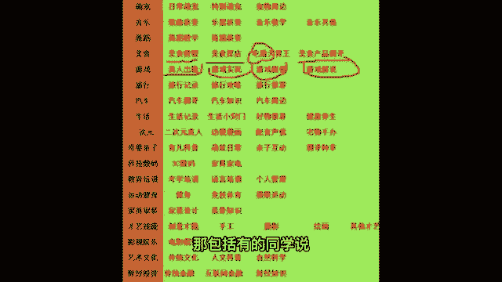

# 2024年做抖音怎么快速起号？抖音暴力起号实操教程分享，让你的账号快速涨粉变现，特别是新手小白，一定要知道的技巧！ - P11：2、怎样定位账号 - 吉度角 - BV1YJ4m1V79F

那接下来我就直接教你怎么涨流量了，前面的这个前景咱们已经了解清楚了，那么我希望这个时候拿出你的笔记本，这里的干货会非常的密啊，来来想要涨流量，咱要有一个准确的账号定位，不要把咱们的抖音账号发成朋友圈了。

今天发发我美美的自拍，明天拍拍我去哪玩了，后天拍拍我干什么了，来发成朋友圈，谁喜欢看朋友，喜欢看诶，陌生人可不喜欢看你的朋友圈啊，那么我们怎么找账号定位呢，就是说围绕一个领域去做老师。

我把抖音的17个标签给你们，展示在我的公屏上啊，来你们先浏览一下，基于自己，基于你喜欢的领域，或者是你擅长的领域，或者是你想做的领域，你可以选择一个把它扣在公屏上面，咱们肯定不可能这十几个全做呀。

全做那就不领域垂直了啊，那样不好诶，你看咱们班有同学要做美食类型了，很不错啊，哎生活类型也不错，其他同学呢你们想选择哪个领域去做啊，房产生活美食还比较多，游戏类型金融嗯不错，宠物类型啊。

每次看到有宠物类型的，我觉得这个以后的视频觉得很可爱，好游戏美妆嗯，好游戏发行人口播，做哪个领域的口播呀，情感口播，养生口播，育儿口播知识口播科普口播对吧，非常多好老师，我先看到这儿啊。

先给咱们同学送上一朵小鲜花，有初步定位是非常好的表现，值得表扬你们，那接着呃有初步定位。

说实话还不够啊，跟着老师一起来看卖一张图，我们要有一个领域细分，也就是二度定位，举个例子，咱们班刚才有同学说，老师我做美食好，美食是个大类啊，它还分为美食教程，教别人做菜，美食探店探访一些好吃的店铺。

吃播诶，把摄像头立那吃东西也是美食，美食产品的一个测评，也是美食，那你具体做哪一类，有的同学说老师我做游戏好，你是做那种真人出镜的游戏呢，还是做游戏实况或者是游戏剧情游戏解说，然后又分为是手游还是端游。

对不对，哪个类型的游戏很全啊，那帮我有同学说嗯。

老师我看看还要做什么的呢，做情感类型的，你是做两性情感还是做婚姻，情感还是做亲情对吧，我们要细分出来，今天我也会给八名积极互动的同学，课下进行一个一对一的二度定位，我就不在课上定位了。

因为课上咱们班这么多同学，你说我一个一个定位，那这节课咱都上不下去了，其次呢老师需要了解你和你沟通，我要和你通过话之后，了解你的具体情况才能帮你，不然我这边随随便便帮你定位。

也是对你不负责任哈，所以你认真听课对吧，被我记住只有好处没有坏处，这就是我们的一个账号定位，那么你们就围绕初步定位，刚才打在公屏上的什么家装啊，金融呀，这种游戏啊，服装啊，娱乐呀。

