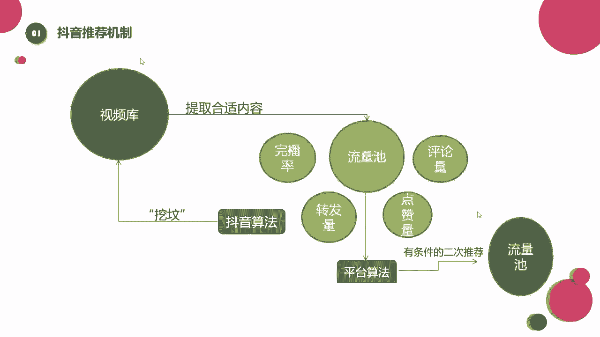
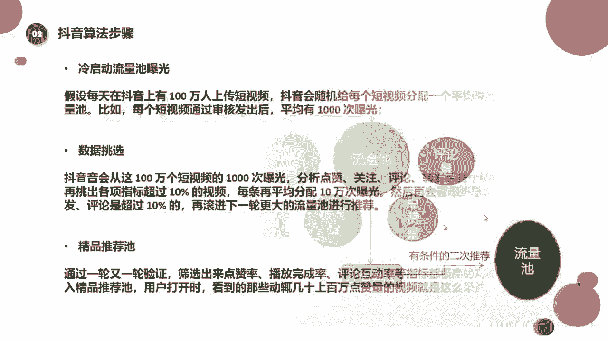
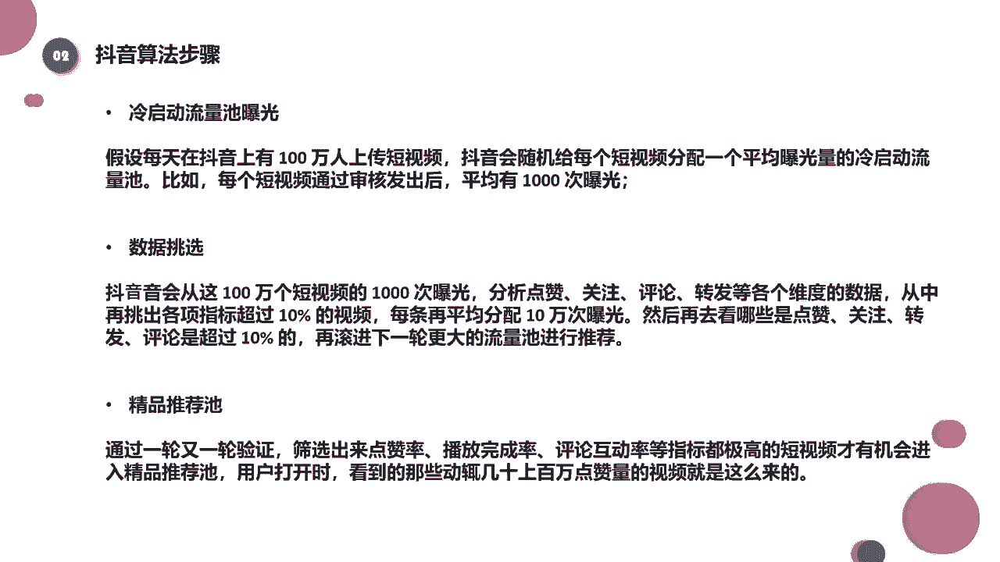

# 2024年做抖音怎么快速起号？抖音暴力起号实操教程分享，让你的账号快速涨粉变现，特别是新手小白，一定要知道的技巧！ - P12：抖音算法步骤 - 南波湾运营 - BV1cx4y1D7rW

好了，那基本上这个图示呢就给大家解释清楚了哈，大家可以再来看一下我们的文字解释。

那么算法的步骤有哪些，我先喝口水，大家可以看一下，我第一个冷启动流量时曝光，下面的都是假设的一些数据啊，假设每天在抖音上有1000万人上传视频，抖音呢会随机给每个短视频分配一个。

平均曝光量的冷启动流量池，也就是我们说的基础流量池，比如说每个短视频通过审核发出去之后，平均会有1000次曝光，那这个数据是假设的啊，那这就是刚才我们的图示的一个文字解释啊。

可能这个时候进进入到基础流量池，我们有2~500的播放量，2~500次的一个曝光，这是他随机分配的，这是一个公平分配的流量嗯，大家都懂吧，好然后我们再接着来看，这里还有一个什么数据挑选。

那抖音呢会从这啊，100万个短视频的1000次曝光，也就是从你的基础流量池中去分析你的点赞，关注评论转发这些互动率怎么样是吧，然后再从中挑出各项指标超过10%的视频，也就是我们刚才说的8%到10%。

或者是3%到5%，这个根据领域不一样，这个数值也不一样哈，然后挑选出来之后，每天在平均分配10万次的曝光，也就是再次进入一个二次流量池，二次流量池的一个推荐，对不对，然后再去看哪些是点赞关注。

我们的评论，转发是超过10%的，那同样再进行一下刚才的那一轮操作，在滚进下一轮更大的流量池进行一个推荐，这个大家能懂吧，这其实就是根据这个呃，我们的视频在这些人中的一个表现，看看大家喜不喜欢啊。

大家的点赞关注多不多，如果多的话，我再多给你推荐点人对吧，那这个的话呢其实有同学可能会遇见了，是刚开始啊给我推荐了500个流量，然后第二次他又流量又增加了，我又多了1000个啊。

我能感受到我的流量在增加啊，我能感受到刚开始500个播放的时候，我的点赞还不错，到后来我的流量增加了之后呢，我的点赞好像没有那么好了，然后慢慢的我的推荐就停下来了，他没有接着往上滚，这是为什么。

这是为什么，这个是有可能我们基础流量池里的人，很喜欢你的作品，但是当我们流量池往上扩大的时候，往上扩大的时候，哎他的一个人群的选择就更大了啊，他不再是那么那么精准的流量了，当人群扩大了之后。

对于你的这个作品的喜爱程度啊，这个选择性就多了，有人喜欢，有人不喜欢，对不对，那就可能出现什么呀，更大一个流量池里面的人，刚开始多数他是不喜欢你的，那就在这个过程中，然后抖音后他就发现了哦。

我给他扩大流量池之后，他的表现不太好啊，那我就不再给他推荐了呗，那他就终止给你的推荐了，所以就会产生这种啊这种现象，就是刚开始推荐的很不错，那到了某一个节点之后，他突然就停了对吧，我以为我以为会爆的啊。

但是呢停在一个比较尴尬的点，他就不再给我推了，当然这也是跟我们视频的一个内容，质量也是有关系的，好然后我们再看第三个精品的流量池，也就是我们的叠加推荐，那么经过一轮又一轮的验证之后呢，筛选出来点赞率。

我们播放完成率，评论的互动率等等指标都是很不错的，视频才有机会进入到精品流量池，也就是我们说的啊，一次又一次一次又一次的什么叠加推荐，来到了精品流量池，其实就相当于上热门了，就你打开手机上啊。

在首页上看到的那些推荐视频，都是几百万的点赞，对不对，那用户打开之后看到的那些啊，几十上百万的一个点赞量的视频呢，就是这么来的，其实每一个视频它都是这样，一轮一轮一轮一轮进行的啊，不过说啊。

可能我们的视频真的比较火爆的时候哈，这一轮一轮的流量增长会非常快，它是翻倍的，之前我有一个视频大概3000万的播放量，那么这个3000万增长非常的快啊，大概是从大概只有几个小时的时间。

它就完成了这种流量池的叠加推荐，那么这几个小时中呢，我们肉眼能够看到的变化啊，就是假设我现在也就是4。23分，我去刷这个视频的时候，他是1000万，可能我过了啊，10分钟它就变2000万了。

甚至10分钟都没有，这个速度是非常快的，而在这个过程中呢，你的点赞评论都是源源断的，都是刷屏式的，那在这个过程里，就有可能你的手机后台暂时就卡了，你甚至可能看不到任何的评论和点赞，因为增长的速度太快了。

但是它里面的一个机器的运转的原理，是永远不变的，那它上升的再快，他也是这样的一个原理，也是这样的算法和步骤好吧，那还有同学说了啊，就是老师我的账号，我的视频跟你说的还不太一样啊。

我发的视频连200的播放量都没有啊，这个是为什么呀，啊你说每个视频都会给200~500的播放量，我的可能连200都没有，我就几十个，我就几个啊，是不是抖音他不爱我了啊，出现这种情况到底是为什么。

我们来看看啊，其实账号呢它也有一个权重的划分，它也有一个等级的划分，虽然说呢他这个抖音的后台，他们并没有出铭文的这种规定啊。

