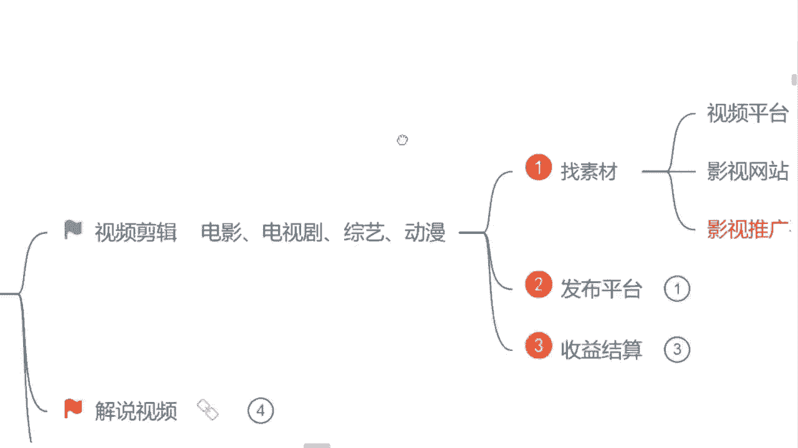
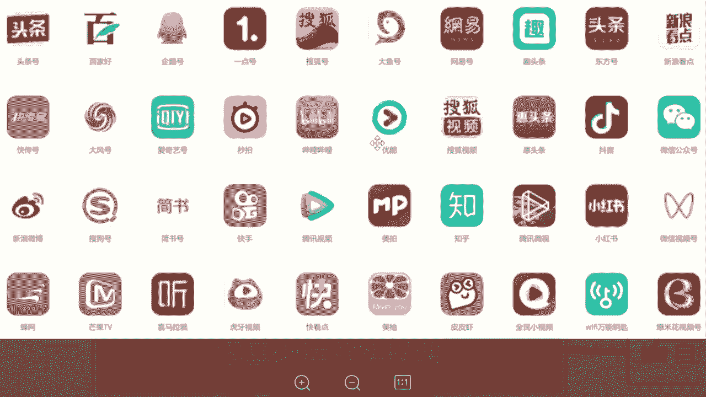
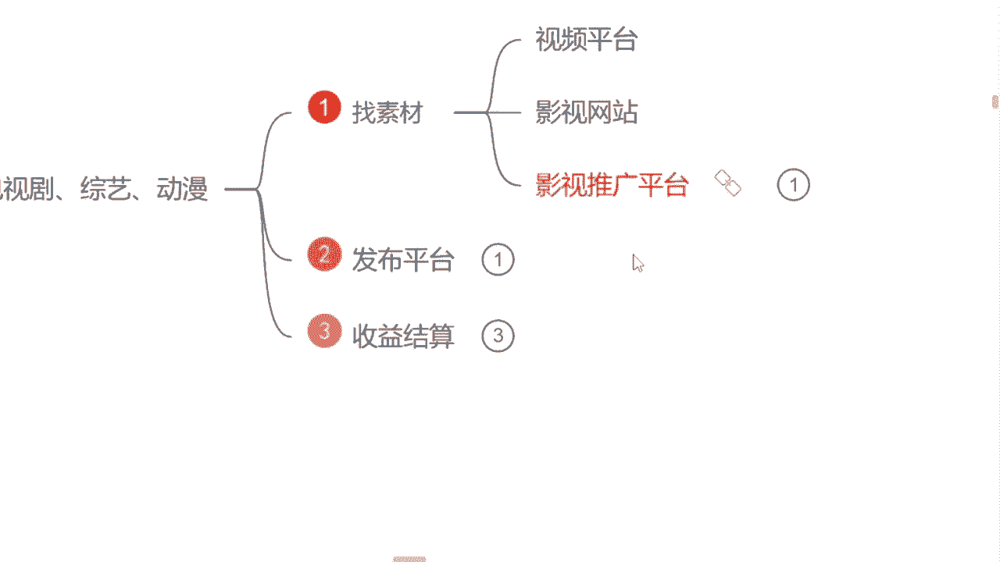
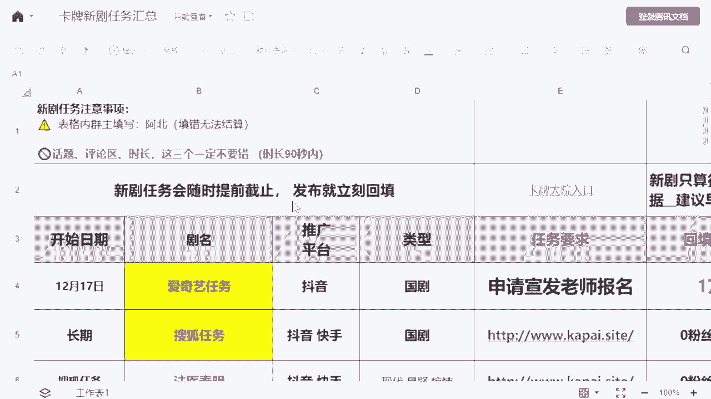
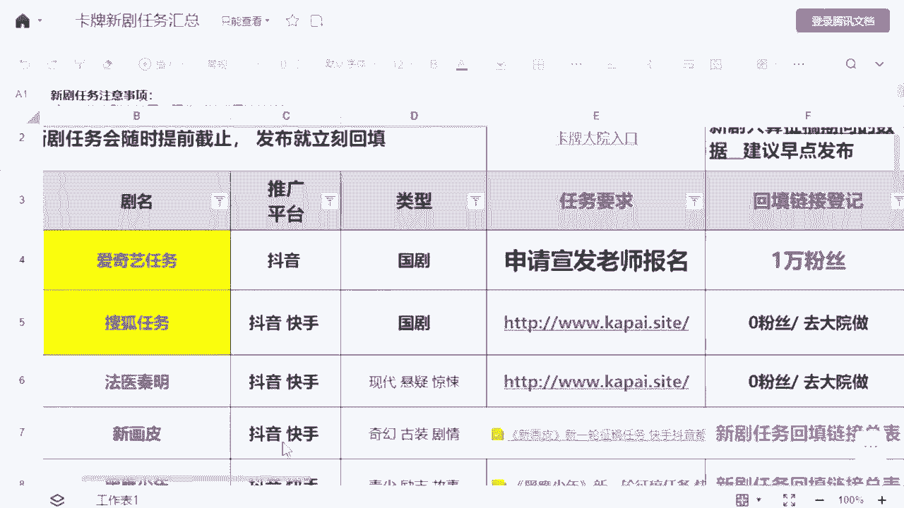
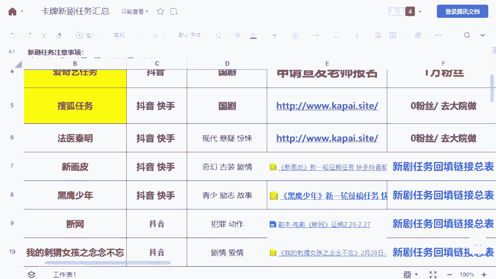
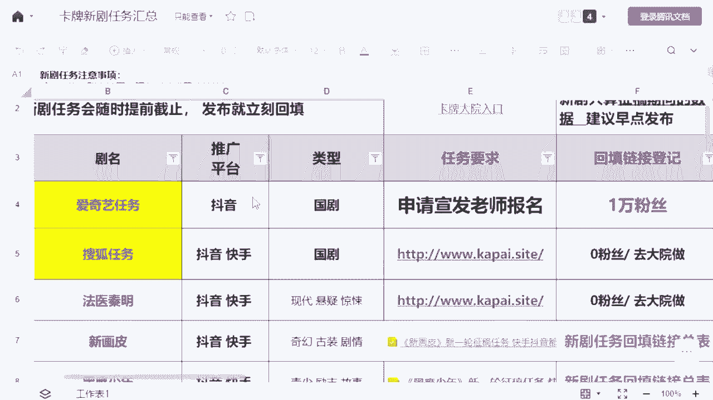
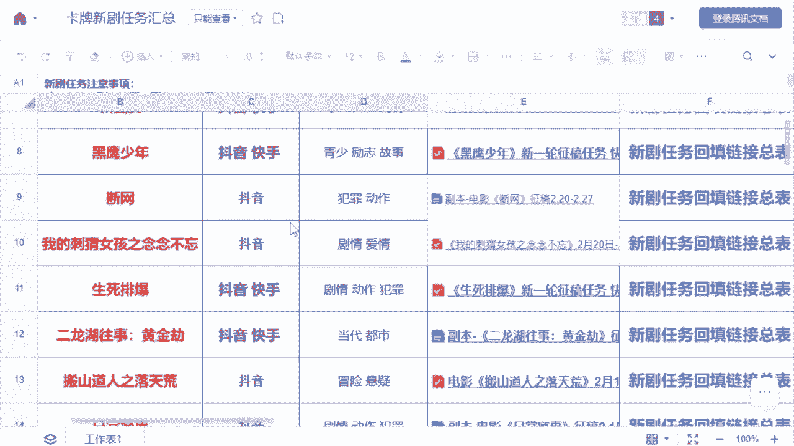
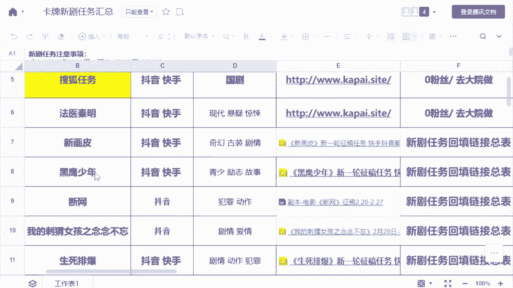
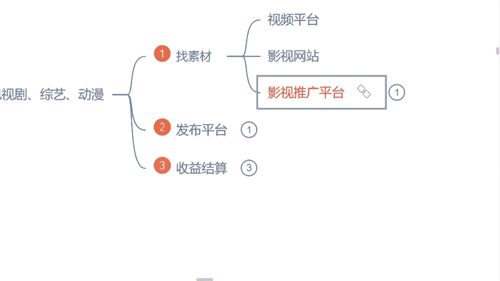

# 2024年做抖音怎么快速起号？抖音暴力起号实操教程分享，让你的账号快速涨粉变现，特别是新手小白，一定要知道的技巧！ - P14：4.视频剪辑；找素材 - 路易胃疼阿 - BV1Rm411r7JZ

选对赛道，而是我刚才说到的对症下药吗，我建议你们去选择这三个类型的视频去做，第一个就是视频剪辑类的，就视频剪辑类，我们平常看的应该都是最多的，因为它包含的范围是最广的，比如说给你们举个例子是吧。

视频剪辑，包括你们平常看的电影的剪辑，电视剧的剪辑全部都包含在里面的，甚至说我们看的这个综艺的啊，像这个动漫的全部都是这个视频剪辑类里面的，那我们如果说想要去做这个视频剪辑类的对吧，首先呢要强调你们啊。

我们做视频，我们是不能去做什么，不能去做搬运的，问一下同学们啊，在这个抖音啊，或者说其他自媒体平台上面，有没有去发过视频的，你们做做的是不是搬运啊，是的，来公屏上打试，是不是诶，不是的就好啊，是啊。

还挺多嘛，我敢肯定80%的同学，但凡你们自己有发过视频的，绝对发的是这个搬运的视频啊，做过搬运视频的同学都能理解一点，你这个视频发出去，要么平台在审核的过程当中不给你通过审核啊，要么就是审核通过了。

判定你这个视频这个重复度过高，直接给你做限流处理，你这个账号根本就做不起来啊，根本就做不起来，那首先呢我们要遇到第一个问题，就是我们想要做这个视频剪辑类，我们该怎么去找素材呢。

看你们找素材的方式对还是不对，那首先讲找素材呢，三个地方去找，来第一个所有的视频平台上面去找，知不知道视频平台有哪些知道的，来公屏上打一，不知道的打二吧，视频平台有哪些知道吗。

这个就是我刚才让你们截图保存的。

这30多个自媒体平台A打二的那个同学，嘿嘿嘿，我刚才让你截图的时候干啥去了啊，现在截图再截一遍啊，一定要保存好，就这30多个自媒体平台一样的三秒钟好吧，截图保存321好的，截图了，一定要保存好。

珍珍老师说了，我让你们记笔记的，让你们截图保存的一定是有用的啊。

一定是有用的，这30多个自媒体平台，就是我们未来找素材的第一个地方了啊，第一个地方当然我们找素材，你也不要这个呃，凭着一个平台去找嘛是吧，不要守着他找，我说我今天看这个抖音是吧。

我就一定要去这个抖音平台上面找视频，我其他平台我都不用，也不要这样子啊，30多个自媒体平台都去找一找啊，因为每个平台他喜欢看这类视频的人，他都不一样的，包括做的这个视频呢，他大体是不一样的啊。

你们能找到素材就非常多，那第二个呢是哪个是影视的网站，知不知道影视的网站有哪些，知道吗，问一下同学们有没有去网站上面看过视频的呀，有的来公屏上打个有字吧，喜欢去网站上面搜视频的，没有有，打野的同学诶。

逮住你了，有没有去看一些不该看的东西啊，喜欢去网站上面搜视频哈，我这里举的网站呢，比如说给你举个例子，就现阶段呢我们看这个电视剧也好，看电影也好是吧，我们都知道所有的这个电视剧和电影。

它都有一个这个相应的一个评分标准是吧，评分越高的电影，评分越高的电视剧它就越好看，这里面有一个典型的这个网站给我，我给你们打出来哈，叫什么呢，豆瓣电影啊，这是非常典型的一个网站了。

我们去豆瓣电影里面搜一些影视作品，它最有优势的一点是什么呢，如果说比如说我举个例子，我说我今天想要看这个狂飙这个电视剧，我想要去做这个电视的剪辑，我先去搜他一下，然后我点开点开了之后呢。

它右半部分会出现一个爱奇艺独家播放，这样的一个标注的这样子的视频，我们就不能做，因为它是有版权的好吧，如果说他没有出现这样一个标注的东西，这个视频我们就可以去做，就很多同学做视频都害怕版权，是不是这样。

我们就可以去判定了啊，这也是比较方便的一种方法，除此之外呢，因为我自己也整理了，将近有50多个网站勇士的啊，像你们想看一些什么国内外的电影啊，各个国家的什么影视作品，这里面全部都是能找到的啊。

全部都是能找到的，这个呢一样的，后边送给你们啊，送给你们，但是呢我还是讲那句话，能听到这节课最后的同学，我就送给你，这是我自己接近6年以来的一个心血，你想要拿走吗，凭借自己努力来拿好不好啊，除此之外呢。

嗯还有很多同学说，曾老师我不想去做影视的，唉我想去做一些什么动漫的，综艺的，什么搞笑类的是吧，旅游类的，我喜欢做这些啊，那有没有呢，有哎我自己呢也整理了将近有60多个网站，这60多个网站里面。

除开影视的，像这个旅游的什么图片的，音效的，评论的，体育的，美食的，境内境外的各个国家的，什么韩国的，日本的，新加坡的，你们全部都能找到类似的一些这个视频素材，不用担心这个素材找不到。

去哪里找这样的一个问题，一样的能听到最后的送给你好不好，这个过程当中你们跟我互动，我能记得我有印象的一样的，下课之后添加我微信来领取好不好，除此之外呢，第三个我要给你们讲到的，我们找素材呢。

第三个地方就是去影视推广平台里面去找，有没有听过这个影视推广的，有没有了解过的，有的来举个手，有的来举个手，打个有字吧，有哈哈哈，小云同学非常的棒啊，举了手是吧，好的有有听说过是吗，好的好的。

那需要我再讲一下吗，这个影视推广再讲一下吧，有的没有听过的，再听一个好不好，就影视推广平台呢，就现在我们就很多这个电视剧，或者说这个电影的一些出品方，或者说版权方。

他会把自己的这一些电影或者电视剧，放到这个平台上面，让我们做这个自媒体视频的人。

就是我们自媒体创作者，来帮助他们去做这个电视剧。

或者说电影的一些宣传曝光，以至于去提高他们的评分，提高他们这个电视剧，以及这个电影的一个传唱度啊，这就是影视推广平台它的一个作用，但是我们作为这个自媒体创作视频的人来说，它的优势在哪里呢。

它的优势就是所有的这个影视推广平台里面的，电视剧，电影，它全部都是有版权的，全部都是有版权的，我们去做就不用担心版权的一个问题，这是第一个优势，那第二个呢就是我们可以看见这个影视推广。

这里面的推广平台基本上是什么呢。

抖音或者快手，甚至说有这个小红书，或者说这个微信视频号，这样的一些这个呃发布途径，因为我们都知道这些途径里面，我们去呃作为这个个体去发视频，永远没有人来给你结算这个收益的，是不是这样子的，是的。

来公屏上打个式子吧，是不是，很多同学去抖音和快手平台上面有发过视频，问曾老师，为什么我没赚到钱呢，因为这个平台它压根就不会给你结算，这个播放量的收益，这个平台它是以带货为主的。

但是我们参与了这个影视推广这个平台，我们去选择做这些电影。

电视剧，我们填写一个任务的回填链接，我们就可以靠这个播放量去结算奖金，我们依然可以，依然可以靠这个播放量去结算到这个收益，拿到这个钱，这就是它的优势了啊，这个过程当中，等一下我再给你们细讲好不好。

那这三个平台呢可能讲到这里的时候，很多同学呢会有这样一个疑问，说A曾老师，为什么这个影视推广的平台，他要拿给我们去做呢是吧，我们普通作为这个创作视频的人，为什么要让我们去做，他不去发广。

有没有这样疑问的，有的来公屏上打个有字吧，有没有这样疑问的说，为什么要拿给我们是吧，为什么他不自己去发广告呢，有吗，那首先要强调一点哈，就是我不知道同学们有没有了解过，如果说这个电视剧或者说这个呃电影。

它的一个出品方或者版权方，他们自己单纯的去发广告，广告的费用是多少呢，如果说不是在一二线城市，它的一个中心城区发广告都是10万起步一条啊，在偏远地方的郊区，你去发一个广告都是10万起步的。

你要去这个一二线城市的中心城区，你去发一个广告都是100万起步的，这是广告的费用，是不是包括哪，像现在比如说我举个例子吧，就像原来我在这个四川成都的时候是吧，成都有一个这个商业区，叫这个春春熙路。

太古里，有人知道吗，就那是一个中心城区，你要去那里发一个广告，广告费用就是100万起步的，但是现在我们出去逛街，谁还会傻傻的站在那里把那个广告看完呢，会不会呀，有喜欢看广告的来公屏上打个有字吧，是不是。

现在我们随随便便刷视频，我们看电视剧的时候，但凡中途有一个广告的出现，我们是不是谁都不喜欢呢，是不是他发广告，基本上达不到一个很高的曝光度了，是不是，现在很多人。

我们基本上都在这个视频平台上面去刷视频了，我们做出来的这个视频，给予它的一个曝光度是更高的，这个就是为什么版权方会把这一个视频拿出来，让我们去做的一个原因了，是不是，那除此之外呢。

首先我们要讲到哈这个视频啊，我们想要去做啊，我们该怎么去做呢，首先第一点我们刚才说到了找素材，我给你们示范一遍，我们这个素材该怎么去找，打开我们自己手机的百度，我们随便去搜索一个平台。

搜索一个西瓜视频来操作一下好吧，别左耳朵进右耳朵就出了啊，等一下问题答对的同学才有这个福利可以领嗯，首先呢我们现在随便去搜索一个，比如说我今天嗯想要去做一个什么呢，我们就去选择一个。

我们就选择一个狂飙吧，我们来搜索一下，我说我今天想要去做这样一个电视剧了是吧，我们找素材直接搜索，搜索完了过后呢，这些就是我们能够用到的素材，但是我们能不能直接把它下下来，你觉得能的来打个能字吧。

你觉得不能打，不能能吗，同学们，我们能能不能直接去下载呀，不能诶对了，如果直接下视频，他跟搬运就没有什么区别了啊，你做搬运的内容平台审核根本就通不过，我们正确的一个找素材的一个方式和方法。

就是你要从这么多的视频当中里面去找到，符合你视频主题的片段，每一个片段不能超过十秒钟，诶这个我要给你们讲到好吧，十秒钟这个给你打出来，这个时长你们一定要记住，超过了这个时长，平台在这个审核的过程当中。

是很容易判定你这个视频有重复度的，阿班每一个这个视频，我们大概保持在六个片段就合适了啊，六个片段这个我们做视频，我们可以不自己去创作，但是我们在找素材过程当中，包括我们做视频的同时，一定要有自己的思路。

自己的一个想法，这样才能称作自己动手过的，自己创作的一个视频好不好，这一点一定要记住哈，那我们视频素材会找了，问一下同学们，实操的话呢，用手机还是用电脑，用手机打手机，用电脑打电脑好吧。

