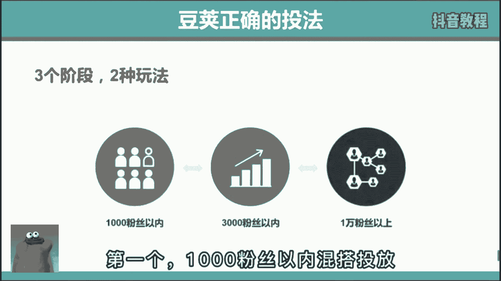
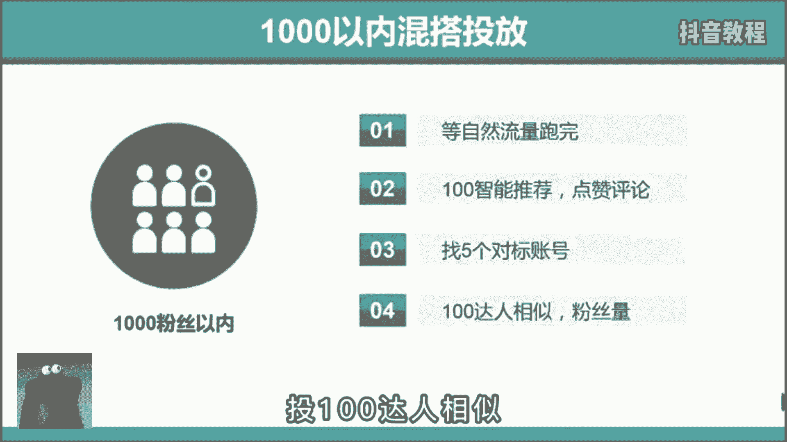
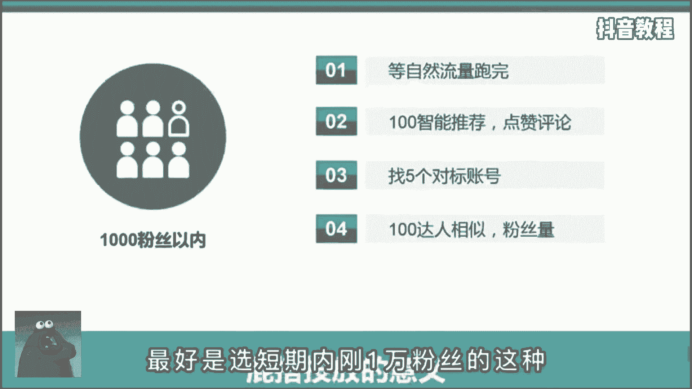
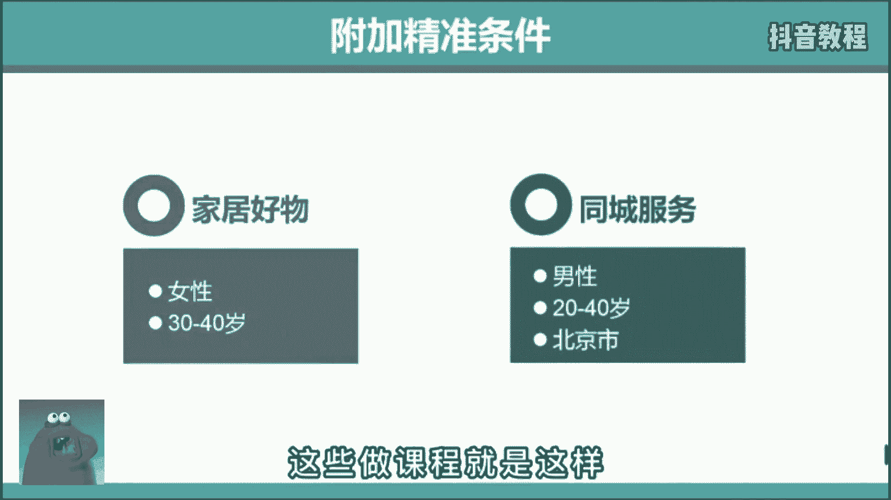

# 2024年做抖音怎么快速起号？抖音暴力起号实操教程分享，让你的账号快速涨粉变现，特别是新手小白，一定要知道的技巧！ - P20：运营篇丨DOU+投放技巧全攻略！ - 6699阿 - BV1St421G7M1

专业玩家是怎么偷偷家的，首先分三个阶段，第一个1000粉丝以内混搭投放在自然流。

跑完后，先选择100智能推荐，选择点赞评论，跑完之后再选择五个对标账号，投100达人相似。

那这里啊选择对标账号的标准就是，最好是选短期内刚1万粉丝的这种。

因为这种粉丝粘性不强，而且不在乎你是不是大号，所以呢对新号就很友好，而第一步先投100智能推荐的原因是，让系统给你美化一下数据，点赞评论多一些，大家更愿意多看两眼。

这就是利用了心理上的从众心理，第二个3000粉丝以内定向投放在视频自然流，跑完后直接选择投200个达人相似，同样选择短期内刚有1万多粉丝的这种，但到这里还没结束，你要根据自己的账号受众选择年龄性别。

地域等附加条件，比如呢你是家居好物，你就肯定要选女性，30~40岁左右，你要是同城号的话，再加个地狱，这样呢能让你吸引的粉丝更精准，加速打上标签，冲击1万粉丝，很多人都不告诉你这个秘密。

这些做课程的就是这样。

那今天呢我都告诉你了，第三个，1万粉丝以上智能投放在视频自然流跑完后，选择一条播放表现最好的，投200的点赞评论。

那这里不投达人，相似的原因是1万粉基本账号都打上标签了，你会有一个稳定的播放量，几千到几万不等，就是纯靠粉丝撑，你也有1万的播放，所以此时呢破播放对你来说就不再是问题，投放的意义在于冲击热门。

通过热门去增粉，而不是靠洗同行的粉，所以这个阶段我的建议是可投可不投，你就专注打磨作品质量就行，但是如果你觉得某条作品自己很满意，是呕心沥血的佳作，肯定能上热门，但结果呢事与愿违了，你就可以啊。

投个抖加试试，让他参加个补考，也许呢还有希望。

