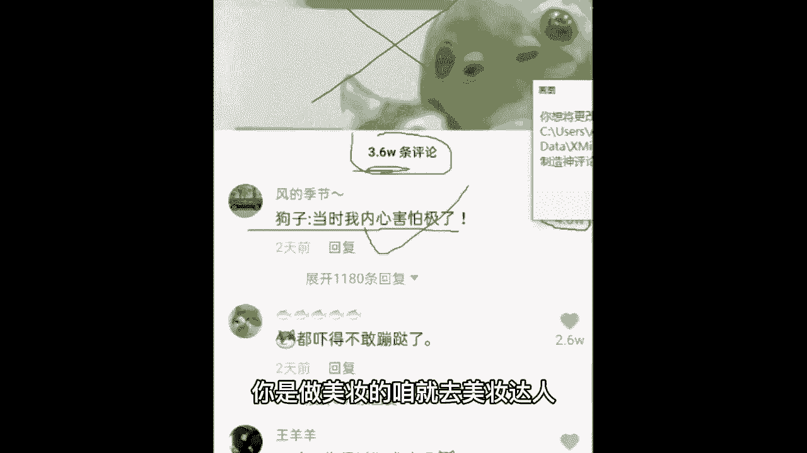

# 2024年做抖音怎么快速起号？抖音暴力起号实操教程分享，让你的账号快速涨粉变现，特别是新手小白，一定要知道的技巧！ - P7：6、分析不能上热门的因素(上) - 猪屎西瓜霜 - BV1bm421n77M

那接着我们往后讲了啊，为什么你的视频上不了热门呢，首先我认为第一点啊，就是你那么普通，却那么自信，就是对我们的作品没有一个准确的认知，第二点也是我总结出来的，毕竟老师我之前也是从小白过来的嘛。

来你看这还有同学说关注一下呢，你不知道吗啊，互相关注，包括说别人关注，你，如果不是吸引过来的，或者说咱们班今天班级里面几百位同学好，你说关注一下我好，这几百位同学直接全部搜索，你立马关注抖音。

它会判定为你是恶意涨粉的，你觉得这对你的账号有帮助吗，如果说你无所谓的话，可以让咱们班同学都去关注一下，搞不了两天账号就废掉了，来仔细听课了啊，为什么我们的作品上不了热门，首先第一个就是小白的心理。

我当时就是这样，我有一个想法，我觉得我这个想法真的太棒了，我立马做视频，做完了，我立马发，我一个小时看20次抖音，看我的这个浏览量爆没爆就是没效果，有没有和我一样的同学可以公屏上面扣个一，我看一下好。

接着啊，通过有老师带有专业人士带，我知道我们要先搭建素材库，什么是素材库啊，来我告诉你，就是你日常生活之中看到什么比较好的画面，和你定位有关的，拍下来，听到什么比较好听的音乐给它下载下来。

或者是看到什么比较好的文案文章，你之后有用的，咱全都给它收集起来，你后期做视频就很方便提取素材了，接着题目选择，题目选择，咱不要做标题党啊，就是题目写的很劲爆，中间内容啥也不是，这样的话，别人看不完。

咱们做抖音，要的是什么，要的是完播率，要的是他从头到尾给咱看完，你光题目好，那不行，从头到尾都得好啊，那接着再套入脚本结构，选择呈现形式，再进行视频拍摄拍摄，你老师我一会儿要讲啊，不要着急。

哎呀剪辑拍摄完了得剪辑吧，剪辑我今天也交给你，也不用急，那剪辑完了就相当于我们的作品哎已经不错了，可以直接呈现出来了，那我们直接发吗，来不要直接发，如果你现在有几万粉丝，那你可以随便什么时候发都行。

但对于我们粉丝少的同学，我们怎么去发，来，中午12点到两点钟，这是一个很好的发布作品的时间段，接着下午五点钟到晚上八点钟，这也是一个很好的时间段，不要大早上发或者大半夜发，那个时候抖音。

他本身自己的人数他就不多，他也没有办法耐下心来，就是说嗯给你争取很多的流量，自己去记下来啊，一会不要问我什么时候发作品了，中午12点到两点，下午五点到八点好，这就是为什么我们的视频上不了热门。

那接着老师得帮你让作品上热门啊，想要作品上热门，你首先要注意的一点是提升我们的账号权重，什么是账号权重啊，就是你的账号在抖音站的一个重要性，你的账号在抖音站的重要性越高，抖音就给你越多越稳定的流量。

你的账号在抖音站的权重越低，抖音给你的流量就越少越随便，这就是我们的提升账号权重啊，那么呃如何判定你的账号权重稳不稳定，像我刚才说的，你发布一条作品，抖音它会给我们300左右的播放量。

如果说抖音他给你的播放量就给了你，几十个播放量，或者是100个播放量，他都不给你300多四五百，更是别想，那证明你的账号权重一定是低的，就可以，咱们来跟着老师一起，把账号权重给他纠正回来啊，五个方法。

首先第一个制造神评论，一起来跟老师看一下什么是神评论吧，这是我当时刷抖音的时候的一个截图啊，视频内容是什么，不重要，就是个搞笑宠物视频，直接看评论，这里有3。6万条评论，这条狗子当时我内心害怕极了。

就有4万的点赞，点赞人数比总体评论人数还多，这一条就叫神评论，有的同学做不出来神评论的话怎么办，退而求其次，去你同领域的达人下面给他评论，你是做美食的，咱就去做去美食达人，你是做美妆的，咱就去美妆达人。

