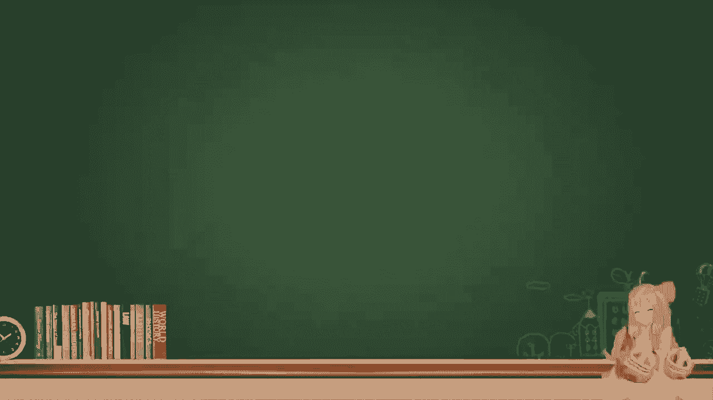
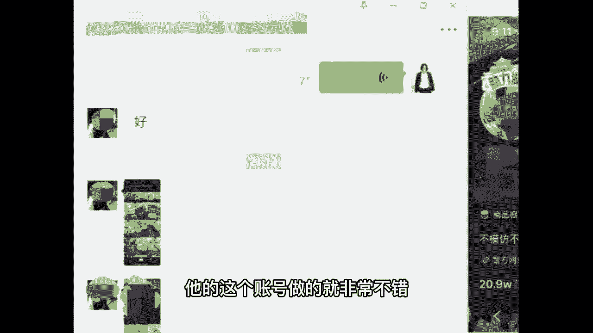
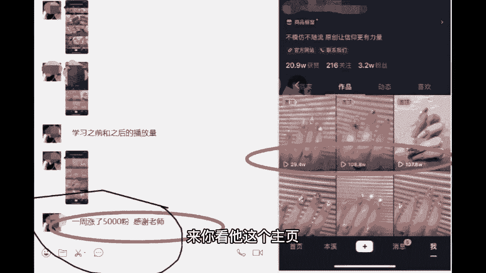

# 2024年做抖音怎么快速起号？抖音暴力起号实操教程分享，让你的账号快速涨粉变现，特别是新手小白，一定要知道的技巧！ - P8：7、分析不能上热门的因素(下) - 6699阿 - BV1St421G7M1

那么接着第二个，前期尽量多看与自己相关的视频或者是直播，既然你有目标了，可以多去看一下同行，同行业，包括同行的一个视频，他们是怎怎么制作的，一方面啊你能够把你的活跃度提升，另外一方面呢。

你又能够加强你自己的权重和定位，这是件好事情啊，那接着往后粉丝互动，这一点就是咱们前期自己没有多少粉丝的时候，有有人给咱评论的时候啊，你给人回忆一下，不要太高冷，后期咱的这个评论增多了。

那么你就挑选那么个三条或者五条回一下，不要都回啊，这是你粉丝多和粉丝少的一个区别，记住那第四个领域，垂直领域垂直，我直接大白话给你讲，就是你是做什么的，你就拍什么，你不要东一下西一下瞎拍。

千万不要拍成朋友圈，来我这边给你看一下，我之前带过的那个学员，他的这个账号做的就非常不错。

自己开店铺的一周涨了5000粉丝来。

你看他这个主页是不是，你看这个主页的第一眼，你就能够知道他是干什么的，包括他开什么店的，一眼就能看出来，一看就是开美甲店的，他这个就做到了领域垂直，那我们回忆一下你自己的账号。

你给你五秒钟看一眼自己的账号，你能看出你自己的这个账号是做什么领域的吗，如果说看不出来，那证明肯定没有领域垂直，尤其是东一下西一下封面都不注意的，来，我给你们举一个呃，讲一个打标签的知识点啊。

你看这里有六条视频呃，比如说12345，这五个他很听老师话，都发的是美甲，第六个他没听老师话乱发，发了个宠物，结果好巧不巧吧，她的美甲作品都没火，他的宠物的作品浏览量点赞啊，都小爆了一下，那么我告诉你。

不管他发多少美甲的作品都没用，这个抖音的机器人，还是会给我们打上一个宠物类型的标签，我们不想做宠物咋整啊，那你必须持之以恒的更新你的美甲作品，直到有一天你的美甲作品浏览量啊，点赞啊都爆了。

并且一定要爆的比之前这个宠物爆的还要厉害，那么才有可能被这个讨厌的机器人更改标签，这也是为什么老师我不让你乱发的原因。

如果咱们班同学已经说主页乱七八糟，看不出什么领域了，怎么办，不要去删除哈，删除会影响你的主页曝光和粉丝量，以后遇到不喜欢的视频，尽可能不要删除，我们怎么办，把它设置为仅自己可见，把它私密起来。

隐藏起来就可以了啊，记下来我们不需要删除了，设置为仅自己可见，隐藏起来即可，这个时候你下课就可以按照老师说的，包括啊看一看自己的主页呀，隐藏一下视频呀，取消一些毫无意义的关注啊，都可以去做啊。

包括自我介绍啊，包括你的名字啊，都可以去完善啊，那接着往后稳定输出，咱们班同学都是几天更新一条作品啊，可以扣在公屏上面，让老师我看一下，直接告诉我，你几天更新一次作品，稳定输出，它的字面意思就是说。

只有我们稳定的更新咱的作品了，抖音它才会给我们稳定的流量，如果说你更新作品都是那种随随便便啊，半个多月这样啊，一个礼拜更新一条作品，说实话这个时间稍微有点长，他抖音不会认为我们是一个稳定的创作者。

那么我们应该怎么办啊，来同学们，你想把抖音做好，那就如果你工作不忙的同学，可以每天更新一条，工作不忙的啊，如果你工作比较忙的，可以两天更新一条，或者三天更新一条，都算稳定啊，像老师我说的这个都不错。

那么有的那你如果说十天半个月更新一条，我就不建议你做了，因为时间太久了，抖音不会认为你这个人很稳定，他也不会给你越来越稳定，越来越多的流量啊，记住老师说的，那么有的同学每天更新好几好几条。

每天都发个三四条，这种老师我告诉你不要这么去做，为什么有的同学说老师我每天发好多，我怎么还不行啊，是因为如果说你每天发了好多视频，但是你的视频吧每一条质量又不怎么样，别人又不怎么喜欢看。

你每天发再多都没有用，抖音，他就会认为你不是一个优质的创作者，什么是优质创作者，就是可能我们两三天发一条，或者是一天发一条，两天发一条，只发一条，但是我们发的这一条作品质量非常的高。

他就会判定为你是优质的创作者，给你更多流量，但是如果你每天发好多条，每条线都不咋地，那么你就被移出优质创作者的行列了，所以不要乱发啊，按照老师说的，尽可能咱一天一条或者两三天一条对吧。

你实在偶尔想要一天发两条也行，但你别天天整个三四条啊，这是老师我跟你说的，提升账号权重的这五个方法，来这五个能够听明白，并且自己做了笔记的公屏上，给老师，我扣个明白两个字啊。

