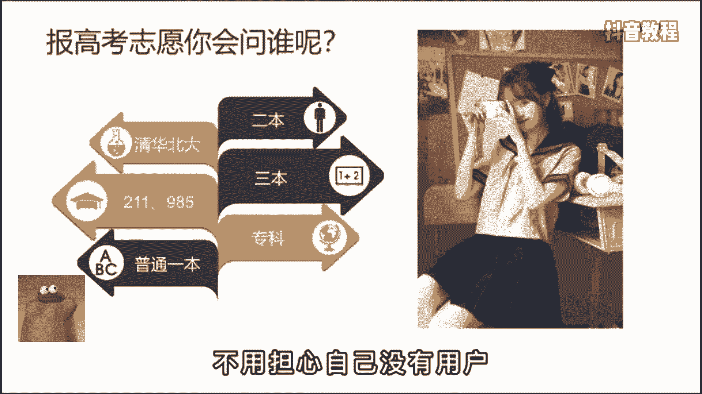
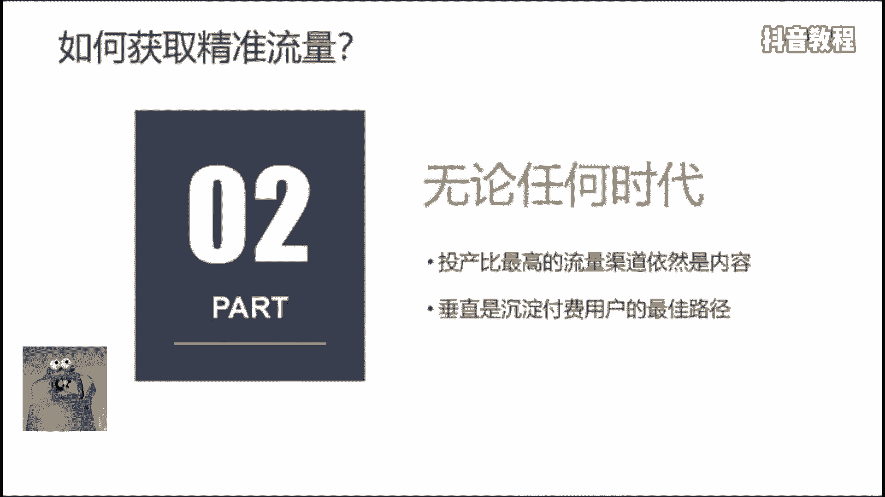
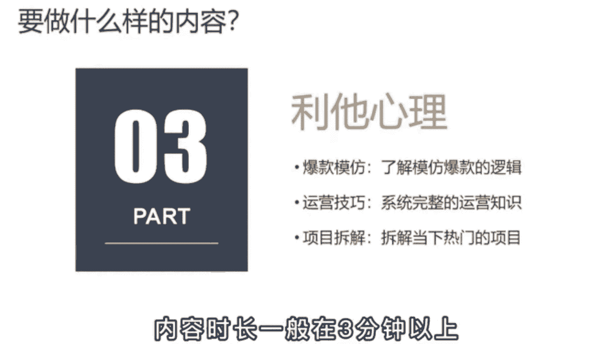
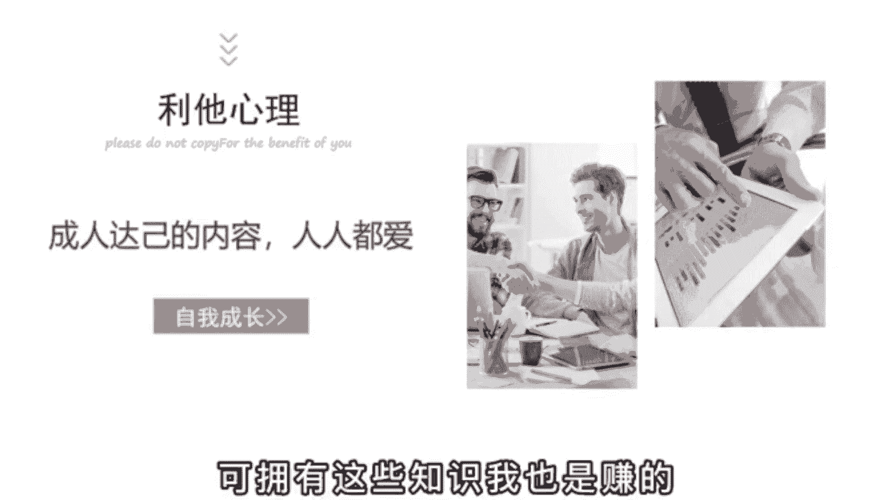

# 2024年做抖音怎么快速起号？抖音暴力起号实操教程分享，让你的账号快速涨粉变现，高口碑抖音运营教程，特别是新手小白，一定要知道的技巧！ - P20：02丨现在做抖音还来得及吗？ - 五雷红鼎 - BV1n1421m7sy

现在做抖音还来得及吗，要回答这个问题，你不妨先解决自己的这三个问题，你为什么要做，如何获取精准流量，以及要做什么样的内容，先说第一个。

很多人都担心各行各业的大佬都这么多了，哪有自己的立足之地，头部召唤动不动就赚一个小目标，自己啊怕是连汤都没得喝，其实呢你大可不必这么想，区区3年的短视频爆发期，几百亿的市场规模还不足以垄断任何一个行业。

而且呢个人IP1旦建立起来，你就会拥有一大批无条件信任你的用户，从此呢对你来说，天下没有难做的生意，而对于你的用户来说，你可能就是这个行业里，他唯一接触到的一个专业的老师，或者说最适合的老师。

有时候你的用户并不是因为你最牛而选择你，而是因为他信任你，且跳一跳就能够得着才选择。

你，怎么理解呢，举个例子来说，假如啊你要填报高考志愿，你会咨询一下哪个学长或者学姐呢，你可以思考一下，我相信啊，答案一定是越往下人数越多，因为对于学校的需求规模就是越往下走，人数越多。

一个平时考试最多上二本的人，有可能去问清华北大吗，就算去问人家也不知道什么样的二本好，毕竟圈层的差距太大了，所以呢不用担心自己没有用户。

你总是能找到属于自己的那部分用户，第二个问题，如何获取精准流量，现在流量真是越来越贵了，无论是之前的图文时代还是现在的短视频时代，流量几乎成为了商业的核心，但无论任何时代。

投产品最高的流量渠道依然是内容，尤其是垂直量，无论你是卖什么产品呢。

它都是沉淀付费用户的最佳路径，假如你是卖提成的，你就每天拍刚摘下来的脐橙，一刀切下去有多么的汁多饱满，让观众一眼就知道你是干什么的，能给他们提供什么样的价值，时间长了呢，就一定会有人为你买单，当然了。

你也得保持品质，万古不变的套路就是真诚，你的真诚往往会在你的内容里流露出来。

第三个问题，要做什么样的内容，我认为啊好内容的核心在于利他，尤其是成人达己的内容，人人都爱，就拿我来举例吧，我是教大家如何做好短视频的，我把内容分为了三个板块，爆款模仿加运营技巧加项目拆解。

第一个呢是帮大家去了解爆款账号背后的逻辑，把其中可借鉴复制的点拿出来为我们自己所用，第二个呢是通过我的一个经验系统，完整的把运营账号的逻辑，包括一些可能需要规避的坑分享给大家。

第三个是拆解一些当下热门的项目，比如中视频计划，抖音小店的玩法等等，内容，时长呢一般在3分钟以上。

这些内容啊对于新手来说一定是有价值的，不像30秒的视频那么稀碎，另外呢最重要的是做这件事，队伍自身也有很大的帮助，在给你们拆解分析的时候，也是自我学习迭代的一个过程。

只不过呢我把这个过程和结果记录了下来，分享给了你们，让大家和我一起进步，这就是成人妲己的一个好内容，就算最后没有留下一个粉丝，可拥有这些知识。

